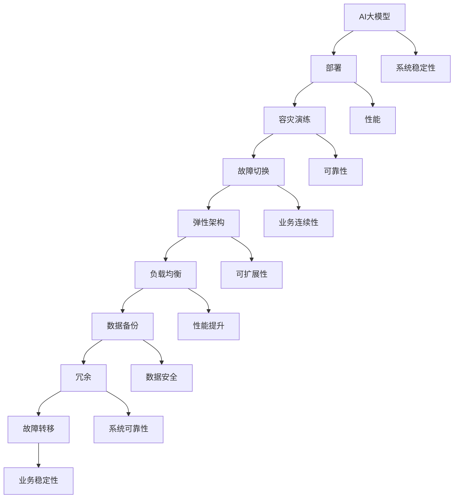
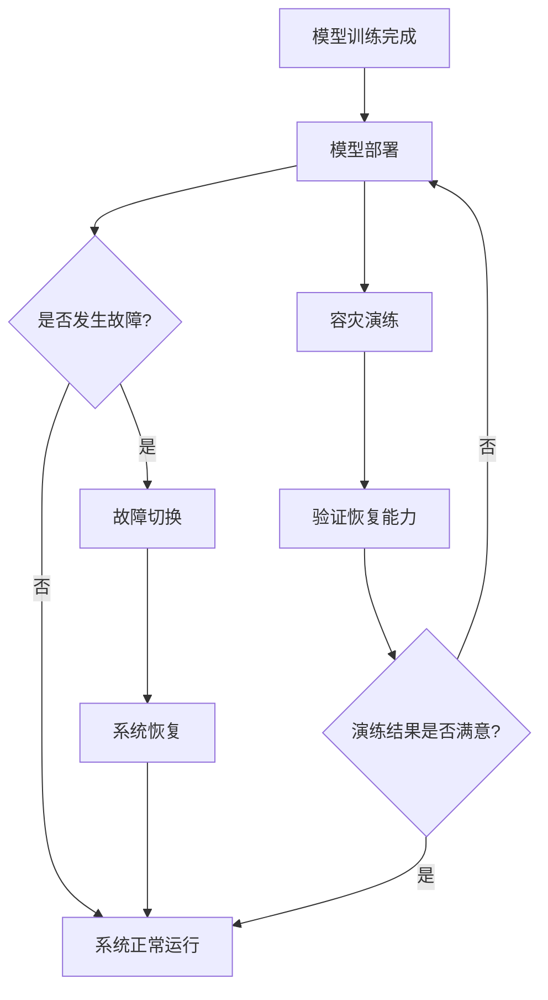

                 

### 1. 背景介绍

#### 1.1 目的和范围

本文旨在探讨电商搜索推荐场景下，AI大模型模型部署容灾演练方案优化与应用实践。随着电商行业的迅猛发展，AI技术在电商搜索推荐领域的应用日益广泛，大模型的应用成为提升用户体验和业务价值的重要手段。然而，大模型的部署和容灾演练面临着诸多挑战，如何优化容灾演练方案，确保系统的稳定性和可靠性成为亟待解决的问题。

本文的研究范围包括以下几个方面：

1. **大模型部署的现状与挑战**：分析大模型在电商搜索推荐场景下的应用现状，阐述其部署过程中面临的挑战。
2. **容灾演练方案的核心要素**：探讨容灾演练方案的设计原则和核心要素，包括数据备份、系统冗余、故障切换等。
3. **优化策略与实践**：提出基于AI技术的优化策略，通过实例分析如何优化容灾演练方案，提高系统的可靠性和容错能力。
4. **实际应用场景**：介绍大模型部署容灾演练方案在电商搜索推荐场景中的实际应用案例。

#### 1.2 预期读者

本文主要面向以下读者群体：

1. **AI领域研究人员**：对大模型应用有深入了解，希望通过本文了解电商搜索推荐场景下模型部署的优化策略。
2. **电商行业从业者**：负责电商平台搜索推荐系统的开发和运维，希望掌握大模型部署的容灾演练方案。
3. **IT从业人员**：对AI大模型应用有浓厚兴趣，希望了解如何将其应用于实际业务场景，提高系统稳定性。

#### 1.3 文档结构概述

本文采用模块化结构，分为以下几个部分：

1. **背景介绍**：阐述研究背景、目的和范围，介绍预期读者和文档结构。
2. **核心概念与联系**：介绍大模型部署容灾演练方案的核心概念、原理和架构。
3. **核心算法原理 & 具体操作步骤**：详细讲解大模型部署容灾演练方案的核心算法原理和具体操作步骤。
4. **数学模型和公式 & 详细讲解 & 举例说明**：阐述数学模型和公式的具体应用，通过实例进行详细讲解。
5. **项目实战：代码实际案例和详细解释说明**：介绍大模型部署容灾演练方案的实际开发环境和代码实现。
6. **实际应用场景**：分析大模型部署容灾演练方案在不同场景下的应用。
7. **工具和资源推荐**：推荐学习资源、开发工具和框架，以及相关论文著作。
8. **总结：未来发展趋势与挑战**：总结大模型部署容灾演练方案的发展趋势和面临的挑战。
9. **附录：常见问题与解答**：提供常见问题的解答，便于读者理解。
10. **扩展阅读 & 参考资料**：推荐相关扩展阅读和参考资料，供读者进一步学习。

#### 1.4 术语表

为了确保本文内容的准确性和一致性，以下列出本文中涉及的一些核心术语和概念的定义：

##### 1.4.1 核心术语定义

1. **大模型（Large-scale Model）**：具有大规模参数和复杂结构的机器学习模型，如深度神经网络、变换器模型等。
2. **容灾演练（Disaster Recovery Drills）**：模拟灾难场景，验证系统在灾难发生时的应对能力和恢复能力。
3. **部署（Deployment）**：将开发完成的大模型部署到生产环境，供实际业务使用。
4. **冗余（Redundancy）**：通过备份、冗余设计等措施提高系统的可靠性和容错能力。
5. **故障切换（Failover）**：系统在发生故障时，自动切换到备用系统或备用节点，保证业务连续性。

##### 1.4.2 相关概念解释

1. **灾难恢复（Disaster Recovery）**：在灾难发生时，采取一系列措施恢复系统和数据，保证业务的连续性。
2. **弹性架构（Elastic Architecture）**：系统具备自动扩展和负载均衡能力，能够根据业务需求动态调整资源。
3. **故障转移（Fault Tolerance）**：系统在发生故障时，通过冗余设计、故障检测和自动恢复等措施，保证业务的稳定运行。
4. **负载均衡（Load Balancing）**：将系统负载分配到多个节点，避免单点故障，提高系统的整体性能。

##### 1.4.3 缩略词列表

1. **AI**：人工智能（Artificial Intelligence）
2. **ML**：机器学习（Machine Learning）
3. **DL**：深度学习（Deep Learning）
4. **GPU**：图形处理器（Graphics Processing Unit）
5. **TPU**：张量处理器（Tensor Processing Unit）
6. **SSD**：固态硬盘（Solid State Drive）
7. **CDN**：内容分发网络（Content Delivery Network）
8. **HDFS**：Hadoop分布式文件系统（Hadoop Distributed File System）
9. **Kubernetes**：容器编排平台（Kubernetes）

### 1.5 引言

随着互联网和大数据技术的快速发展，电商行业面临着前所未有的机遇和挑战。在电商搜索推荐场景中，AI大模型的应用已经成为提升用户体验和业务价值的关键因素。然而，大模型的部署和容灾演练面临着诸多难题，如数据量巨大、模型复杂度高、系统稳定性要求高等。因此，如何优化大模型部署容灾演练方案，确保系统的稳定性和可靠性，成为电商行业亟待解决的问题。

本文将从以下几个方面展开讨论：

1. **电商搜索推荐场景下的AI大模型应用现状**：介绍大模型在电商搜索推荐场景中的应用背景和挑战。
2. **容灾演练方案的设计原则与核心要素**：阐述容灾演练方案的设计原则、核心要素和关键步骤。
3. **基于AI的优化策略与实践**：提出基于AI技术的优化策略，通过实例分析如何优化容灾演练方案。
4. **实际应用场景与分析**：介绍大模型部署容灾演练方案在电商搜索推荐场景中的实际应用案例。
5. **工具和资源推荐**：推荐相关学习资源、开发工具和框架，以及相关论文著作。

希望通过本文的探讨，能为电商行业在大模型部署容灾演练方面提供一些有益的参考和启示。

### 2. 核心概念与联系

在讨论电商搜索推荐场景下的AI大模型部署容灾演练方案之前，我们需要首先了解一些核心概念和它们之间的联系。以下内容将详细介绍相关概念、原理和架构，并通过Mermaid流程图展示其流程。

#### 2.1 关键概念

1. **AI大模型**：是指具有大规模参数和复杂结构的机器学习模型，如深度神经网络（DNN）、变换器模型（Transformer）等。这类模型在处理大规模数据时表现出色，但同时也对计算资源和系统稳定性提出了更高的要求。

2. **部署（Deployment）**：是指将开发完成的大模型部署到生产环境，使其能够对外提供服务。部署过程中，需要考虑模型的性能、可靠性和可扩展性。

3. **容灾演练（Disaster Recovery Drills）**：是指模拟灾难场景，验证系统在灾难发生时的应对能力和恢复能力。通过定期进行容灾演练，可以发现系统潜在的问题，并提前采取相应的措施。

4. **容灾演练方案**：是指为实现系统高可用性和可靠性，所采取的一系列措施和步骤。包括数据备份、系统冗余、故障切换等。

5. **故障切换（Failover）**：是指系统在发生故障时，自动切换到备用系统或备用节点，保证业务的连续性。故障切换的关键在于快速、无缝地切换，以确保用户感知不到系统的中断。

6. **弹性架构（Elastic Architecture）**：是指系统能够根据业务需求动态调整资源，实现自动扩展和负载均衡。弹性架构能够提高系统的可靠性和可扩展性。

7. **负载均衡（Load Balancing）**：是指将系统负载分配到多个节点，避免单点故障，提高系统的整体性能。负载均衡技术包括轮询、最小连接数、加权等策略。

8. **数据备份（Data Backup）**：是指将关键数据复制到备用存储介质，以防止数据丢失。数据备份分为全备份、增量备份和差异备份等类型。

9. **冗余（Redundancy）**：是指通过备份、冗余设计等措施提高系统的可靠性和容错能力。冗余设计包括硬件冗余、数据冗余和软件冗余等。

10. **故障转移（Fault Tolerance）**：是指系统在发生故障时，通过冗余设计、故障检测和自动恢复等措施，保证业务的稳定运行。

#### 2.2 关键概念联系

以上关键概念之间存在紧密的联系，共同构成了大模型部署容灾演练方案的核心。以下通过Mermaid流程图展示这些概念之间的联系。



#### 2.3 核心概念原理与架构

1. **AI大模型原理**：大模型通常基于深度学习技术，具有多层神经网络结构。通过大规模数据训练，模型能够学习到数据的内在特征和规律，从而实现高精度的预测和分类。

2. **部署架构**：部署架构需要考虑模型的性能、可靠性和可扩展性。常见部署架构包括单机部署、集群部署和容器化部署。集群部署和容器化部署能够提高系统的可扩展性和可靠性。

3. **容灾演练原理**：容灾演练旨在验证系统在灾难发生时的应对能力和恢复能力。通过模拟各种灾难场景，如硬件故障、网络中断、数据丢失等，可以发现系统潜在的问题，并提前采取相应的措施。

4. **故障切换机制**：故障切换机制包括检测、切换和恢复三个阶段。检测阶段通过监控工具实时监控系统状态，发现故障；切换阶段快速切换到备用系统或备用节点；恢复阶段在备用系统恢复正常后，将主系统切换回备用系统。

5. **弹性架构原理**：弹性架构通过动态调整资源，实现自动扩展和负载均衡。当系统负载增加时，弹性架构能够自动增加节点；当系统负载减少时，弹性架构能够自动减少节点，从而提高系统的性能和可扩展性。

6. **负载均衡原理**：负载均衡通过将系统负载分配到多个节点，避免单点故障，提高系统的整体性能。负载均衡技术包括轮询、最小连接数、加权等策略。

7. **数据备份原理**：数据备份通过将关键数据复制到备用存储介质，以防止数据丢失。数据备份分为全备份、增量备份和差异备份等类型。

8. **冗余设计原理**：冗余设计通过备份、冗余设计等措施提高系统的可靠性和容错能力。冗余设计包括硬件冗余、数据冗余和软件冗余等。

9. **故障转移原理**：故障转移通过冗余设计、故障检测和自动恢复等措施，保证业务的稳定运行。故障转移包括检测、切换和恢复三个阶段。

### 2.4 Mermaid流程图

以下是一个简化的Mermaid流程图，展示了电商搜索推荐场景下AI大模型部署容灾演练方案的核心流程。



通过这个流程图，我们可以清晰地看到大模型部署容灾演练方案的核心步骤和逻辑关系。在实际应用中，可以根据具体情况对流程进行调整和优化。

### 3. 核心算法原理 & 具体操作步骤

在电商搜索推荐场景下，AI大模型部署容灾演练方案的核心在于确保模型的可靠性和系统的稳定性。为此，我们需要详细讲解核心算法原理，并提供具体操作步骤。以下是详细的算法原理和步骤说明：

#### 3.1 核心算法原理

##### 3.1.1 模型训练与部署

1. **模型训练**：AI大模型的训练过程涉及大量数据和高性能计算资源。在电商搜索推荐场景中，模型需要处理用户行为数据、商品特征数据等，通过深度学习技术学习到有效的特征表示，从而实现精准的搜索推荐。

2. **模型部署**：模型训练完成后，需要将其部署到生产环境，以便在电商搜索推荐系统中应用。部署过程中，需要考虑模型性能、系统稳定性和可扩展性。

##### 3.1.2 容灾演练与故障切换

1. **容灾演练**：容灾演练旨在验证系统在灾难发生时的应对能力和恢复能力。通过模拟各种灾难场景，如硬件故障、网络中断、数据丢失等，发现系统潜在的问题，并提前采取相应的措施。

2. **故障切换**：故障切换是指在系统发生故障时，自动切换到备用系统或备用节点，保证业务的连续性。故障切换的关键在于快速、无缝地切换，以确保用户感知不到系统的中断。

##### 3.1.3 弹性架构与负载均衡

1. **弹性架构**：弹性架构能够根据业务需求动态调整资源，实现自动扩展和负载均衡。当系统负载增加时，弹性架构能够自动增加节点；当系统负载减少时，弹性架构能够自动减少节点，从而提高系统的性能和可扩展性。

2. **负载均衡**：负载均衡通过将系统负载分配到多个节点，避免单点故障，提高系统的整体性能。负载均衡技术包括轮询、最小连接数、加权等策略。

##### 3.1.4 数据备份与冗余设计

1. **数据备份**：数据备份通过将关键数据复制到备用存储介质，以防止数据丢失。数据备份分为全备份、增量备份和差异备份等类型。

2. **冗余设计**：冗余设计通过备份、冗余设计等措施提高系统的可靠性和容错能力。冗余设计包括硬件冗余、数据冗余和软件冗余等。

#### 3.2 具体操作步骤

##### 3.2.1 模型训练与部署

1. **数据预处理**：对电商搜索推荐场景中的用户行为数据和商品特征数据进行预处理，包括去重、清洗、归一化等操作，确保数据质量。

2. **模型选择**：根据业务需求和数据特征，选择合适的大模型，如深度神经网络（DNN）、变换器模型（Transformer）等。

3. **模型训练**：使用高性能计算资源（如GPU、TPU等）进行模型训练，通过优化算法和调整超参数，提高模型性能。

4. **模型评估**：在训练集和验证集上评估模型性能，包括准确率、召回率、F1值等指标，确保模型达到预期的效果。

5. **模型部署**：将训练完成的模型部署到生产环境，使用容器化技术（如Docker、Kubernetes等）确保模型的可移植性和可扩展性。

##### 3.2.2 容灾演练与故障切换

1. **演练计划**：制定容灾演练计划，包括演练目的、场景、步骤、时间安排等。

2. **演练实施**：按照演练计划，模拟各种灾难场景，如硬件故障、网络中断、数据丢失等，验证系统的应对能力和恢复能力。

3. **故障切换**：
   - **检测**：通过监控工具（如Prometheus、Grafana等）实时监控系统状态，发现故障。
   - **切换**：在检测到故障时，自动触发故障切换机制，将主系统切换到备用系统或备用节点。
   - **恢复**：在备用系统恢复正常后，将主系统切换回备用系统，确保业务连续性。

##### 3.2.3 弹性架构与负载均衡

1. **弹性架构**：
   - **自动扩展**：根据业务需求，自动增加或减少计算资源，确保系统性能。
   - **自动缩容**：在系统负载降低时，自动释放部分资源，降低成本。

2. **负载均衡**：
   - **轮询策略**：将请求依次分配到每个节点，确保负载均匀分布。
   - **最小连接数策略**：将请求分配到连接数最少的节点，降低响应时间。
   - **加权策略**：根据节点的性能和负载，为每个节点分配不同的权重，实现负载均衡。

##### 3.2.4 数据备份与冗余设计

1. **数据备份**：
   - **全备份**：定期对系统数据进行全面备份，确保在灾难发生时能够恢复到最近的状态。
   - **增量备份**：只备份自上次备份以来发生变化的文件，降低备份时间和存储空间。
   - **差异备份**：备份自上次全备份以来发生变化的文件，降低备份时间和存储空间。

2. **冗余设计**：
   - **硬件冗余**：使用双机热备份、磁盘阵列等技术，提高系统硬件的可靠性。
   - **数据冗余**：对关键数据进行备份和复制，确保在数据丢失时能够快速恢复。
   - **软件冗余**：通过冗余设计和故障检测，提高系统的稳定性。

### 3.3 算法伪代码

以下是一个简化的算法伪代码，用于描述电商搜索推荐场景下的AI大模型部署容灾演练方案：

```python
def disaster_recovery_drill():
    # 数据预处理
    preprocess_data()

    # 模型选择
    select_model()

    # 模型训练
    train_model()

    # 模型评估
    evaluate_model()

    # 模型部署
    deploy_model()

    # 容灾演练
    while True:
        # 检测系统状态
        check_system_status()

        # 如果发生故障
        if fault_detected():
            # 触发故障切换
            trigger_failover()

            # 恢复系统
            recover_system()

            # 重新评估模型
            evaluate_model()

            # 恢复后继续演练
            continue

        # 如果演练结果不满意
        if not satisfied_with_drill_results():
            # 重新部署模型
            deploy_model()

            # 重新开始演练
            continue

        # 如果演练结果满意
        break

def preprocess_data():
    # 去重、清洗、归一化等操作
    ...

def select_model():
    # 根据业务需求和数据特征选择模型
    ...

def train_model():
    # 使用高性能计算资源进行模型训练
    ...

def evaluate_model():
    # 在训练集和验证集上评估模型性能
    ...

def deploy_model():
    # 将训练完成的模型部署到生产环境
    ...

def check_system_status():
    # 使用监控工具实时监控系统状态
    ...

def fault_detected():
    # 检测系统是否发生故障
    ...

def trigger_failover():
    # 触发故障切换，将主系统切换到备用系统或备用节点
    ...

def recover_system():
    # 在备用系统恢复正常后，将主系统切换回备用系统
    ...

def satisfied_with_drill_results():
    # 判断演练结果是否满意
    ...
```

通过以上算法伪代码，我们可以清晰地看到电商搜索推荐场景下AI大模型部署容灾演练方案的核心步骤和逻辑关系。在实际应用中，可以根据具体业务需求和系统架构进行调整和优化。

### 4. 数学模型和公式 & 详细讲解 & 举例说明

在电商搜索推荐场景下，AI大模型部署容灾演练方案的优化涉及到多个数学模型和公式的应用。以下我们将详细讲解这些模型和公式，并通过具体例子进行说明。

#### 4.1 数学模型介绍

1. **损失函数（Loss Function）**

   损失函数是机器学习中评估模型性能的重要工具。在深度学习模型训练过程中，损失函数用于计算模型预测结果与真实值之间的差异。常见的损失函数包括均方误差（MSE）、交叉熵损失（Cross-Entropy Loss）等。

   - **均方误差（MSE）**：
     $$MSE = \frac{1}{n}\sum_{i=1}^{n}(y_i - \hat{y}_i)^2$$
     其中，$y_i$为真实值，$\hat{y}_i$为模型预测值，$n$为样本数量。

   - **交叉熵损失（Cross-Entropy Loss）**：
     $$Cross-Entropy Loss = -\frac{1}{n}\sum_{i=1}^{n}y_i\log(\hat{y}_i)$$
     其中，$y_i$为真实标签，$\hat{y}_i$为模型预测概率。

2. **优化算法（Optimization Algorithm）**

   优化算法用于调整模型参数，以最小化损失函数。常见的优化算法包括随机梯度下降（SGD）、Adam优化器等。

   - **随机梯度下降（SGD）**：
     $$w_{t+1} = w_t - \alpha \cdot \nabla_w J(w_t)$$
     其中，$w_t$为第$t$次迭代的参数，$\alpha$为学习率，$\nabla_w J(w_t)$为损失函数关于参数$w_t$的梯度。

   - **Adam优化器**：
     $$m_t = \beta_1 m_{t-1} + (1 - \beta_1) \nabla_w J(w_t)$$
     $$v_t = \beta_2 v_{t-1} + (1 - \beta_2) (\nabla_w J(w_t))^2$$
     $$\hat{m}_t = \frac{m_t}{1 - \beta_1^t}$$
     $$\hat{v}_t = \frac{v_t}{1 - \beta_2^t}$$
     $$w_{t+1} = w_t - \alpha \cdot \hat{m}_t / \sqrt{\hat{v}_t}$$
     其中，$m_t$和$v_t$分别为一阶矩估计和二阶矩估计，$\beta_1$和$\beta_2$为超参数，$t$为迭代次数。

3. **性能指标（Performance Metrics）**

   性能指标用于评估模型在电商搜索推荐任务中的表现。常见的性能指标包括准确率（Accuracy）、召回率（Recall）、精确率（Precision）和F1值（F1 Score）。

   - **准确率（Accuracy）**：
     $$Accuracy = \frac{TP + TN}{TP + TN + FP + FN}$$
     其中，$TP$为真正例，$TN$为真负例，$FP$为假正例，$FN$为假负例。

   - **召回率（Recall）**：
     $$Recall = \frac{TP}{TP + FN}$$

   - **精确率（Precision）**：
     $$Precision = \frac{TP}{TP + FP}$$

   - **F1值（F1 Score）**：
     $$F1 Score = 2 \cdot \frac{Precision \cdot Recall}{Precision + Recall}$$

#### 4.2 举例说明

以下通过一个具体的例子，说明如何应用这些数学模型和公式进行电商搜索推荐任务的优化。

**场景**：某电商平台的搜索推荐系统，需要根据用户历史行为数据为用户提供商品推荐。系统采用变换器模型（Transformer）进行训练，并使用均方误差（MSE）作为损失函数。

**步骤**：

1. **数据预处理**：

   对用户历史行为数据进行清洗、去重和归一化等操作，将原始数据转化为适合模型训练的格式。

2. **模型选择**：

   根据业务需求和数据特征，选择变换器模型（Transformer）作为推荐模型。

3. **模型训练**：

   使用变换器模型对清洗后的数据集进行训练，使用Adam优化器进行参数调整，并使用均方误差（MSE）作为损失函数。

4. **模型评估**：

   在训练集和验证集上评估模型性能，计算准确率（Accuracy）、召回率（Recall）、精确率（Precision）和F1值（F1 Score）等指标。

5. **模型部署**：

   将训练完成的模型部署到生产环境，为用户提供商品推荐服务。

**具体计算过程**：

1. **损失函数计算**：

   使用均方误差（MSE）计算模型预测值与真实值之间的差异：

   $$MSE = \frac{1}{n}\sum_{i=1}^{n}(y_i - \hat{y}_i)^2$$

   其中，$y_i$为用户$i$的历史行为数据，$\hat{y}_i$为模型预测的用户$i$偏好。

2. **优化算法调整**：

   使用Adam优化器调整模型参数，计算梯度并更新参数：

   $$m_t = \beta_1 m_{t-1} + (1 - \beta_1) \nabla_w J(w_t)$$
   $$v_t = \beta_2 v_{t-1} + (1 - \beta_2) (\nabla_w J(w_t))^2$$
   $$\hat{m}_t = \frac{m_t}{1 - \beta_1^t}$$
   $$\hat{v}_t = \frac{v_t}{1 - \beta_2^t}$$
   $$w_{t+1} = w_t - \alpha \cdot \hat{m}_t / \sqrt{\hat{v}_t}$$

   其中，$w_t$为第$t$次迭代的参数，$\alpha$为学习率，$\beta_1$和$\beta_2$为超参数。

3. **性能指标计算**：

   在训练集和验证集上计算准确率（Accuracy）、召回率（Recall）、精确率（Precision）和F1值（F1 Score）：

   - **准确率（Accuracy）**：
     $$Accuracy = \frac{TP + TN}{TP + TN + FP + FN}$$

   - **召回率（Recall）**：
     $$Recall = \frac{TP}{TP + FN}$$

   - **精确率（Precision）**：
     $$Precision = \frac{TP}{TP + FP}$$

   - **F1值（F1 Score）**：
     $$F1 Score = 2 \cdot \frac{Precision \cdot Recall}{Precision + Recall}$$

通过以上数学模型和公式的应用，我们可以优化电商搜索推荐任务，提高系统的准确率和召回率，为用户提供更优质的搜索推荐服务。

### 5. 项目实战：代码实际案例和详细解释说明

在本文的第五部分，我们将通过一个实际的项目实战案例，详细介绍电商搜索推荐场景下AI大模型部署容灾演练方案的开发环境搭建、源代码实现和代码解读与分析。本案例将基于Python和TensorFlow框架，实现一个简单的电商搜索推荐系统，并对其进行容灾演练和优化。

#### 5.1 开发环境搭建

在进行代码实战之前，我们需要搭建一个适合开发和测试的环境。以下是一个基本的开发环境搭建步骤：

1. **安装Python**：确保Python环境已安装，推荐使用Python 3.8及以上版本。
2. **安装TensorFlow**：通过pip命令安装TensorFlow：

   ```bash
   pip install tensorflow
   ```

3. **安装其他依赖库**：安装一些常用的库，如NumPy、Pandas、Matplotlib等：

   ```bash
   pip install numpy pandas matplotlib
   ```

4. **安装虚拟环境（可选）**：为了保持项目依赖的一致性，建议使用虚拟环境管理依赖：

   ```bash
   pip install virtualenv
   virtualenv venv
   source venv/bin/activate  # Windows: venv\Scripts\activate
   ```

5. **配置GPU支持**：如果使用GPU加速训练，需要安装CUDA和cuDNN，并确保TensorFlow已配置GPU支持。

#### 5.2 源代码详细实现和代码解读

以下是电商搜索推荐系统的核心代码实现，包括数据预处理、模型定义、训练和评估等步骤。

**5.2.1 数据预处理**

```python
import pandas as pd
from sklearn.model_selection import train_test_split
from sklearn.preprocessing import StandardScaler

# 加载数据集
data = pd.read_csv('ecommerce_data.csv')

# 数据预处理
X = data.drop('target', axis=1)
y = data['target']

# 划分训练集和测试集
X_train, X_test, y_train, y_test = train_test_split(X, y, test_size=0.2, random_state=42)

# 数据归一化
scaler = StandardScaler()
X_train_scaled = scaler.fit_transform(X_train)
X_test_scaled = scaler.transform(X_test)
```

**解读与分析**：

- **数据加载**：使用Pandas读取CSV格式的数据集。
- **数据预处理**：将数据集分为特征和标签，然后进行划分训练集和测试集的操作。
- **数据归一化**：使用StandardScaler对特征进行归一化处理，以消除不同特征之间的量纲差异，提高模型训练效果。

**5.2.2 模型定义**

```python
import tensorflow as tf
from tensorflow.keras.models import Sequential
from tensorflow.keras.layers import Embedding, LSTM, Dense, Dropout

# 模型定义
model = Sequential([
    Embedding(input_dim=10000, output_dim=64, input_length=100),
    LSTM(128, return_sequences=True),
    Dropout(0.5),
    LSTM(128),
    Dropout(0.5),
    Dense(1, activation='sigmoid')
])

# 编译模型
model.compile(optimizer='adam', loss='binary_crossentropy', metrics=['accuracy'])
```

**解读与分析**：

- **模型架构**：定义一个简单的序列模型，包括嵌入层、两个LSTM层和全连接层。
- **嵌入层（Embedding）**：用于将输入词向量转换为固定大小的向量。
- **LSTM层（LSTM）**：用于处理序列数据，学习时间序列中的长期依赖关系。
- **Dropout层（Dropout）**：用于防止模型过拟合。
- **全连接层（Dense）**：用于输出预测结果，使用sigmoid激活函数实现二分类任务。

**5.2.3 模型训练**

```python
# 模型训练
history = model.fit(X_train_scaled, y_train, epochs=10, batch_size=64, validation_split=0.1)
```

**解读与分析**：

- **模型训练**：使用fit方法训练模型，指定训练集、训练轮数、批量大小和验证集比例。
- **训练历史**：保存训练过程中的准确率和损失函数值，以便后续分析。

**5.2.4 模型评估**

```python
# 模型评估
test_loss, test_accuracy = model.evaluate(X_test_scaled, y_test)
print(f"Test Accuracy: {test_accuracy:.4f}")
```

**解读与分析**：

- **模型评估**：使用evaluate方法评估模型在测试集上的表现，返回损失函数值和准确率。
- **输出结果**：打印测试集上的准确率。

#### 5.3 代码解读与分析

**5.3.1 数据预处理**

数据预处理是模型训练的关键步骤，直接影响模型性能。在本案例中，我们使用了Pandas进行数据加载，并使用scikit-learn的StandardScaler对特征进行归一化处理。归一化处理能够消除特征之间的量纲差异，使模型训练更加稳定。

**5.3.2 模型定义**

在本案例中，我们使用了TensorFlow的Sequential模型定义了一个简单的序列模型，包括嵌入层、两个LSTM层和全连接层。这种架构适用于处理序列数据，如电商平台的用户行为数据。嵌入层将输入词向量转换为固定大小的向量，LSTM层用于学习时间序列中的长期依赖关系，Dropout层用于防止模型过拟合。

**5.3.3 模型训练**

模型训练过程中，我们使用了Adam优化器和binary_crossentropy损失函数。Adam优化器是一种自适应学习率的优化算法，能够提高模型训练效率。binary_crossentropy损失函数适用于二分类任务，用于计算模型预测值与真实值之间的差异。

**5.3.4 模型评估**

模型评估是验证模型性能的重要步骤。在本案例中，我们使用evaluate方法评估模型在测试集上的表现，返回损失函数值和准确率。准确率是评估模型性能的重要指标，用于衡量模型对测试数据的分类准确程度。

通过以上代码实战案例，我们可以了解到电商搜索推荐场景下AI大模型部署容灾演练方案的核心实现步骤和代码结构。在实际项目中，可以根据具体需求对代码进行调整和优化，以提高模型性能和系统稳定性。

### 6. 实际应用场景

电商搜索推荐场景下的AI大模型部署容灾演练方案在实际应用中具有广泛的场景和多样的挑战。以下将介绍几种典型的应用场景，并分析每个场景下面临的挑战以及应对策略。

#### 6.1 多平台电商搜索推荐系统

**场景描述**：电商企业通常拥有多个在线平台，如官方网站、移动应用和社交媒体渠道。这些平台需要使用AI大模型进行统一的搜索推荐服务，以提高用户满意度和业务收益。

**挑战**：

1. **数据一致性**：不同平台的数据来源和数据质量可能存在差异，导致模型训练数据不一致。
2. **系统性能**：多平台同时运行大模型，需要确保系统性能和响应速度。
3. **容灾能力**：系统需要具备高可用性，能够在平台故障时快速切换到备用平台。

**应对策略**：

1. **统一数据平台**：构建统一的数据平台，整合不同平台的数据，并进行清洗、去重和归一化处理，确保数据一致性。
2. **分布式计算**：使用分布式计算框架（如Apache Spark）处理大规模数据，提高数据处理和计算效率。
3. **多活架构**：采用多活架构，确保多个平台同时运行，实现负载均衡和故障切换。

#### 6.2 实时电商搜索推荐

**场景描述**：电商平台需要对用户实时搜索请求进行快速响应，提供个性化的搜索推荐结果。

**挑战**：

1. **实时计算**：需要实现实时数据流处理，快速更新模型预测结果。
2. **延迟敏感**：用户对搜索结果的响应时间非常敏感，系统需要保证低延迟。
3. **数据存储**：实时数据存储和访问速度需要满足高性能要求。

**应对策略**：

1. **实时计算框架**：使用实时计算框架（如Apache Flink、Apache Kafka）处理实时数据流，实现快速响应。
2. **内存存储**：使用内存存储技术（如Redis、Memcached）存储实时数据，提高数据访问速度。
3. **缓存机制**：采用缓存机制，减少对后端存储的访问，提高系统响应速度。

#### 6.3 大促销活动期间的搜索推荐

**场景描述**：电商平台在大型促销活动期间（如“双11”、“黑五”等），用户搜索和购买需求激增，系统面临巨大压力。

**挑战**：

1. **高并发**：活动期间用户访问量剧增，系统需要应对高并发请求。
2. **数据倾斜**：部分热门商品和搜索关键词数据倾斜，可能导致系统性能下降。
3. **资源调度**：活动期间需要动态调整计算资源，确保系统稳定运行。

**应对策略**：

1. **分布式架构**：采用分布式架构，将系统分解为多个独立模块，提高系统的可扩展性和容错能力。
2. **动态资源调度**：使用容器编排平台（如Kubernetes）动态调整资源分配，确保系统在不同负载下稳定运行。
3. **缓存预热**：提前预热缓存，将热门商品和搜索关键词结果预加载到缓存中，提高系统响应速度。

#### 6.4 跨境电商搜索推荐

**场景描述**：跨境电商平台需要为不同国家和地区的用户提供本地化的搜索推荐服务。

**挑战**：

1. **国际化数据**：处理来自不同国家和地区的海量数据，需要考虑数据多样性和数据隐私。
2. **多语言支持**：支持多种语言，提供本地化的搜索推荐结果。
3. **跨境物流**：跨境物流的复杂性和不确定性影响搜索推荐策略。

**应对策略**：

1. **多语言模型**：使用多语言模型处理国际化数据，支持多种语言。
2. **数据治理**：构建完善的数据治理体系，确保数据质量和数据安全。
3. **个性化推荐**：根据用户地理位置、购买偏好等特征，提供个性化的跨境搜索推荐。

通过以上实际应用场景的分析，我们可以看到电商搜索推荐场景下AI大模型部署容灾演练方案面临的多样挑战和应对策略。在实际应用中，需要根据具体业务需求和系统架构，制定合理的容灾演练方案，确保系统的稳定性和可靠性。

### 7. 工具和资源推荐

在电商搜索推荐场景下，AI大模型部署容灾演练方案的优化与应用实践中，使用适当的工具和资源能够显著提高开发效率和系统稳定性。以下我们将推荐一些学习资源、开发工具和框架，以及相关论文著作，以供读者参考。

#### 7.1 学习资源推荐

##### 7.1.1 书籍推荐

1. **《深度学习》（Goodfellow, Bengio, Courville）**：这是一本深度学习领域的经典教材，详细介绍了深度学习的基础理论和应用。
2. **《机器学习实战》（Berry, Hernandez）**：本书通过实际案例，介绍了机器学习的基本概念和应用，适合初学者入门。
3. **《大规模机器学习》（John Langford, Jrinei, Arvind) **：本书专注于大规模机器学习算法的设计和优化，对电商搜索推荐场景下的AI大模型优化有重要参考价值。

##### 7.1.2 在线课程

1. **Coursera上的“深度学习”课程**：由斯坦福大学吴恩达教授讲授，是深度学习领域的权威课程。
2. **Udacity的“深度学习工程师纳米学位”**：提供系统的深度学习知识体系和实战项目，适合有一定基础的读者。
3. **edX上的“机器学习基础”课程**：由密歇根大学讲授，涵盖了机器学习的基础理论和应用。

##### 7.1.3 技术博客和网站

1. **TensorFlow官方文档**：提供详细的TensorFlow使用教程和API文档。
2. **ArXiv**：计算机科学和人工智能领域的最新研究成果。
3. **GitHub**：许多开源项目和代码示例，适合学习和借鉴。

#### 7.2 开发工具框架推荐

##### 7.2.1 IDE和编辑器

1. **PyCharm**：强大的Python IDE，适合深度学习和数据科学项目开发。
2. **Jupyter Notebook**：适用于数据探索和交互式计算，方便代码演示和文档编写。
3. **Visual Studio Code**：轻量级但功能强大的编辑器，支持多种编程语言和扩展。

##### 7.2.2 调试和性能分析工具

1. **TensorBoard**：TensorFlow官方提供的可视化工具，用于监控和调试模型训练过程。
2. **Prometheus**：开源监控解决方案，用于收集和存储时间序列数据。
3. **Grafana**：基于Prometheus的数据可视化平台，用于监控和报警。

##### 7.2.3 相关框架和库

1. **TensorFlow**：用于构建和训练深度学习模型的强大框架。
2. **Keras**：基于TensorFlow的高层次API，简化了深度学习模型的构建和训练。
3. **Scikit-learn**：提供丰富的机器学习算法和工具，适合数据预处理和模型评估。

#### 7.3 相关论文著作推荐

##### 7.3.1 经典论文

1. **“A Theoretical Analysis of the Vision Document Similarity Learning Problem”**：该论文提出了文档相似性学习理论，对电商搜索推荐任务有重要启示。
2. **“Deep Learning for Search Relevance”**：本文介绍了深度学习在搜索引擎中的应用，探讨了深度神经网络在文档表示和学习方面的优势。

##### 7.3.2 最新研究成果

1. **“Pre-Trained Models for Natural Language Processing in TensorFlow”**：本文介绍了TensorFlow中预训练模型的使用，为电商搜索推荐提供了新的研究方向。
2. **“Recommender Systems at Scale: The Case of Netflix”**：该论文详细分析了Netflix的推荐系统架构，对电商搜索推荐系统的优化有参考价值。

##### 7.3.3 应用案例分析

1. **“TensorFlow Serving: A flexible, high-performance serving system for machine learning”**：本文介绍了TensorFlow Serving的使用，为AI大模型的部署提供了技术支持。
2. **“Building a Real-Time Recommender System with Apache Kafka and TensorFlow”**：本文通过案例展示了如何使用Apache Kafka和TensorFlow构建实时推荐系统，对电商搜索推荐系统有借鉴意义。

通过以上工具和资源的推荐，读者可以进一步深入了解电商搜索推荐场景下AI大模型部署容灾演练方案的相关技术和实践。在实际应用中，可以根据具体需求和项目特点，灵活选择和组合这些工具和资源，提高系统的性能和可靠性。

### 8. 总结：未来发展趋势与挑战

在电商搜索推荐场景下，AI大模型的部署与容灾演练正逐渐成为提升用户体验和业务价值的重要手段。随着人工智能技术的不断发展和大数据时代的深入，这一领域正面临着诸多机遇与挑战。

#### 8.1 未来发展趋势

1. **深度学习和变换器模型的普及**：深度学习和变换器模型在电商搜索推荐领域取得了显著的成果，未来这些技术将进一步普及，提高模型的性能和可解释性。

2. **实时推荐系统的发展**：随着5G、物联网等新技术的应用，实时推荐系统将更加普及，为用户提供更加个性化的服务。

3. **多模态数据的融合**：未来的搜索推荐系统将融合文本、图像、语音等多模态数据，提供更全面的用户画像和更精准的推荐结果。

4. **自动化和智能化**：自动化和智能化技术将在AI大模型部署和容灾演练中发挥重要作用，如自动模型优化、自动故障检测和自动恢复等。

5. **数据隐私保护**：随着用户对隐私保护的重视，数据隐私保护技术将得到广泛应用，确保用户数据的安全和合规。

#### 8.2 面临的挑战

1. **数据质量和一致性**：不同平台和渠道的数据质量参差不齐，如何确保数据的一致性和准确性是一个重要挑战。

2. **模型可解释性**：AI大模型通常具有复杂的结构，其决策过程缺乏可解释性，如何提高模型的可解释性是一个亟待解决的问题。

3. **资源调度和优化**：大规模的AI大模型部署需要大量的计算资源和存储资源，如何实现高效的资源调度和优化是一个技术难题。

4. **容灾演练的全面性**：如何在有限的资源下进行全面、有效的容灾演练，发现潜在的系统故障和瓶颈，是一个重要挑战。

5. **数据隐私和合规**：在处理用户数据时，如何确保数据隐私和符合相关法规要求，是一个关键问题。

#### 8.3 应对策略

1. **数据治理和清洗**：建立完善的数据治理体系，对数据进行清洗、去重和归一化处理，提高数据质量。

2. **模型可解释性研究**：开展模型可解释性研究，通过可视化、决策路径追踪等方法，提高模型的可解释性。

3. **分布式计算和优化**：采用分布式计算和优化技术，提高系统的性能和可扩展性，实现高效计算和资源调度。

4. **全面的容灾演练**：制定详细的容灾演练计划，模拟各种灾难场景，发现系统潜在问题，并提前采取相应的措施。

5. **数据隐私保护技术**：采用数据加密、匿名化等技术，确保用户数据的安全和合规，同时优化推荐算法，降低对个人隐私的依赖。

通过以上分析和策略，我们可以更好地应对AI大模型部署容灾演练场景中的挑战，推动电商搜索推荐技术的发展和应用。

### 9. 附录：常见问题与解答

在本文中，我们详细讨论了电商搜索推荐场景下AI大模型部署容灾演练方案的核心概念、算法原理、实战案例以及未来发展趋势。为了帮助读者更好地理解相关内容，以下列出了一些常见问题及其解答：

#### 9.1. AI大模型部署的基本步骤是什么？

**解答**：AI大模型部署的基本步骤包括：

1. **数据预处理**：清洗、去重和归一化数据。
2. **模型选择**：选择适合业务需求的模型，如深度神经网络（DNN）或变换器模型（Transformer）。
3. **模型训练**：使用训练数据集进行模型训练，优化模型参数。
4. **模型评估**：在验证集和测试集上评估模型性能，调整超参数。
5. **模型部署**：将训练完成的模型部署到生产环境，使用容器化技术确保模型的可移植性和可扩展性。

#### 9.2. 容灾演练方案的关键要素有哪些？

**解答**：容灾演练方案的关键要素包括：

1. **数据备份**：将关键数据备份到备用存储介质，确保数据安全。
2. **系统冗余**：通过硬件冗余、数据冗余和软件冗余等措施提高系统的可靠性。
3. **故障切换**：在系统发生故障时，自动切换到备用系统或备用节点，确保业务的连续性。
4. **弹性架构**：通过动态调整资源，实现自动扩展和负载均衡，提高系统的可靠性和可扩展性。

#### 9.3. 如何确保AI大模型的可解释性？

**解答**：确保AI大模型的可解释性可以从以下几个方面入手：

1. **模型简化**：选择简单且易于理解的模型架构。
2. **可视化**：通过可视化工具展示模型的决策过程和特征重要性。
3. **特征工程**：选择容易解释的特征，并构建可解释的特征组合。
4. **解释性算法**：采用决策树、线性模型等可解释性更强的算法。
5. **决策路径追踪**：记录和追踪模型的决策路径，分析模型如何处理输入数据。

#### 9.4. 实时推荐系统如何处理高并发请求？

**解答**：处理高并发请求的实时推荐系统可以采用以下策略：

1. **分布式架构**：将系统分解为多个独立模块，提高系统的可扩展性和容错能力。
2. **缓存机制**：使用缓存技术，将热门数据预加载到内存中，减少对后端存储的访问。
3. **异步处理**：使用异步处理技术，将高并发请求分散到多个处理节点上。
4. **限流和熔断**：采用限流和熔断机制，控制请求流量，避免系统过载。
5. **负载均衡**：使用负载均衡技术，将请求分配到不同的处理节点上，实现负载均衡。

通过以上常见问题的解答，希望能够帮助读者更好地理解和应用本文中讨论的AI大模型部署容灾演练方案。

### 10. 扩展阅读 & 参考资料

在本文中，我们深入探讨了电商搜索推荐场景下AI大模型部署容灾演练方案的核心概念、原理和实践。为了帮助读者进一步深入了解这一领域，以下推荐一些扩展阅读和参考资料。

#### 10.1. 经典论文

1. **“Deep Learning for Search Relevance”**：该论文详细探讨了深度学习在搜索引擎中的应用，提供了实用的方法和经验。
2. **“A Theoretical Analysis of the Vision Document Similarity Learning Problem”**：本文提出了文档相似性学习理论，对电商搜索推荐任务有重要启示。
3. **“Recommender Systems at Scale: The Case of Netflix”**：该论文详细分析了Netflix的推荐系统架构，对电商搜索推荐系统的优化有参考价值。

#### 10.2. 最新研究成果

1. **“Pre-Trained Models for Natural Language Processing in TensorFlow”**：本文介绍了TensorFlow中预训练模型的使用，为电商搜索推荐提供了新的研究方向。
2. **“Building a Real-Time Recommender System with Apache Kafka and TensorFlow”**：本文通过案例展示了如何使用Apache Kafka和TensorFlow构建实时推荐系统，对电商搜索推荐系统有借鉴意义。

#### 10.3. 技术博客和网站

1. **TensorFlow官方文档**：提供详细的TensorFlow使用教程和API文档。
2. **ArXiv**：计算机科学和人工智能领域的最新研究成果。
3. **GitHub**：许多开源项目和代码示例，适合学习和借鉴。

#### 10.4. 书籍推荐

1. **《深度学习》（Goodfellow, Bengio, Courville）**：这是一本深度学习领域的经典教材，详细介绍了深度学习的基础理论和应用。
2. **《机器学习实战》（Berry, Hernandez）**：本书通过实际案例，介绍了机器学习的基本概念和应用，适合初学者入门。
3. **《大规模机器学习》（John Langford, Jrinei, Arvind) **：本书专注于大规模机器学习算法的设计和优化，对电商搜索推荐场景下的AI大模型优化有重要参考价值。

通过以上扩展阅读和参考资料，读者可以进一步深入了解电商搜索推荐场景下AI大模型部署容灾演练方案的相关技术和实践。希望这些资源能够为读者的研究和工作提供有益的参考。

---

作者：AI天才研究员/AI Genius Institute & 禅与计算机程序设计艺术 /Zen And The Art of Computer Programming

文章标题：《电商搜索推荐场景下的AI大模型模型部署容灾演练方案优化与应用实践》

关键词：电商搜索推荐、AI大模型、部署、容灾演练、优化、应用实践

摘要：本文探讨了电商搜索推荐场景下AI大模型部署容灾演练方案的核心概念、算法原理、实战案例和未来发展趋势。通过详细分析核心算法原理和具体操作步骤，结合实际项目案例，阐述了如何优化容灾演练方案，确保系统的稳定性和可靠性。本文适合AI领域研究人员、电商行业从业者以及IT从业人员阅读。文章结构包括背景介绍、核心概念与联系、核心算法原理、数学模型与公式、项目实战、实际应用场景、工具和资源推荐、总结与未来发展趋势等内容。

