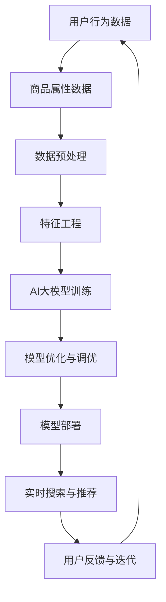

                 

# 电商搜索推荐场景下的AI大模型模型部署混合云实践

> **关键词：** 电商搜索、推荐系统、AI大模型、混合云部署、模型优化、性能调优

> **摘要：** 本文深入探讨了电商搜索推荐场景下，如何使用AI大模型并在混合云环境中进行高效部署。通过详细的算法原理讲解、实际案例解析和最佳实践分享，为读者提供了从模型设计到部署的全面指导，助力电商企业构建智能化的搜索推荐系统。

## 1. 背景介绍

### 1.1 目的和范围

本文旨在为电商企业及其技术团队提供一份详实的指南，以帮助他们在搜索推荐系统中采用AI大模型，并实现在混合云环境中的高效部署。随着大数据和人工智能技术的不断发展，电商搜索推荐系统已经成为提升用户体验、增加转化率的关键因素。然而，AI大模型的训练和部署过程复杂，如何在混合云环境中优化模型性能，成为当前的一个重要课题。

本文将围绕以下几个主题展开讨论：

- AI大模型在电商搜索推荐中的应用原理
- 混合云环境下的模型部署策略
- 模型性能的优化与调优
- 实际案例分析与最佳实践分享

### 1.2 预期读者

本文适合以下读者群体：

- 电商行业的技术经理和架构师
- 搜索推荐系统工程师和算法工程师
- 对AI大模型和混合云部署有兴趣的IT专业人士
- 高等院校计算机相关专业的研究生和本科生

### 1.3 文档结构概述

本文将按照以下结构进行展开：

- **1. 背景介绍**：介绍文章的目的、范围、预期读者和文档结构。
- **2. 核心概念与联系**：详细讲解电商搜索推荐系统的核心概念和联系，并使用Mermaid流程图进行可视化展示。
- **3. 核心算法原理 & 具体操作步骤**：阐述AI大模型的算法原理，并提供伪代码和具体操作步骤。
- **4. 数学模型和公式 & 详细讲解 & 举例说明**：介绍数学模型和公式，并进行详细讲解和举例说明。
- **5. 项目实战：代码实际案例和详细解释说明**：通过实际案例展示模型部署过程，并详细解读代码。
- **6. 实际应用场景**：分析电商搜索推荐系统在不同场景下的应用。
- **7. 工具和资源推荐**：推荐学习资源、开发工具框架和相关论文著作。
- **8. 总结：未来发展趋势与挑战**：总结文章主要内容，探讨未来发展趋势和面临的挑战。
- **9. 附录：常见问题与解答**：提供常见问题的解答。
- **10. 扩展阅读 & 参考资料**：推荐进一步阅读的资料。

### 1.4 术语表

#### 1.4.1 核心术语定义

- **AI大模型**：指参数规模巨大、计算复杂度高的人工神经网络模型，如BERT、GPT等。
- **电商搜索推荐系统**：基于用户行为数据和商品属性数据，为用户提供个性化搜索和推荐服务的系统。
- **混合云**：将公有云和私有云相结合，实现资源的灵活调度和高效利用。
- **模型部署**：将训练好的模型部署到生产环境中，以提供实时或批处理的服务。

#### 1.4.2 相关概念解释

- **个性化推荐**：根据用户的历史行为和偏好，为用户推荐相关的商品或内容。
- **模型调优**：通过调整模型参数、网络结构等，提高模型的性能和准确率。
- **混合云架构**：将公有云和私有云的优势相结合，构建灵活、可靠的IT基础设施。

#### 1.4.3 缩略词列表

- **AI**：人工智能（Artificial Intelligence）
- **ML**：机器学习（Machine Learning）
- **DL**：深度学习（Deep Learning）
- **GPU**：图形处理器（Graphics Processing Unit）
- **TPU**：张量处理器（Tensor Processing Unit）
- **API**：应用程序编程接口（Application Programming Interface）

## 2. 核心概念与联系

在深入探讨AI大模型在电商搜索推荐系统中的应用之前，我们需要先了解一些核心概念和它们之间的联系。以下是电商搜索推荐系统的核心概念及其关联关系，以及对应的Mermaid流程图可视化展示：



### 2.1 电商搜索推荐系统的核心概念

- **用户行为数据**：包括用户的浏览历史、购买记录、搜索历史等，是推荐系统的重要输入。
- **商品属性数据**：描述商品的各种属性，如类别、价格、品牌等，也是推荐系统的重要输入。
- **数据预处理**：对原始数据进行清洗、归一化、缺失值处理等，以提高数据质量。
- **特征工程**：从原始数据中提取特征，为模型训练提供输入。
- **AI大模型训练**：使用深度学习算法，对特征进行学习，构建推荐模型。
- **模型优化与调优**：通过调整模型参数、网络结构等，提高模型性能。
- **模型部署**：将训练好的模型部署到生产环境中，提供实时搜索和推荐服务。
- **实时搜索与推荐**：根据用户的行为数据，实时提供个性化的搜索和推荐结果。
- **用户反馈与迭代**：收集用户反馈，对模型进行迭代优化。

### 2.2 Mermaid流程图

上述核心概念之间的联系，可以通过Mermaid流程图进行可视化展示。流程图从用户行为数据和商品属性数据开始，经过数据预处理、特征工程，然后进入AI大模型训练阶段。模型训练完成后，进行优化与调优，最后部署到生产环境中。在模型部署过程中，实时搜索和推荐系统根据用户的行为数据进行迭代优化，形成一个闭环。

通过这样的流程图，读者可以清晰地理解电商搜索推荐系统的整体架构和各模块之间的关联关系。这对于后续深入探讨模型部署和性能优化具有重要意义。

## 3. 核心算法原理 & 具体操作步骤

### 3.1 AI大模型算法原理

电商搜索推荐系统中的AI大模型，通常是基于深度学习算法构建的。深度学习模型通过多层神经网络结构，对输入数据进行层层抽象和特征提取，最终输出推荐结果。以下是AI大模型的核心算法原理和具体操作步骤：

#### 3.1.1 基本原理

- **神经网络结构**：深度学习模型的核心是神经网络，包括输入层、隐藏层和输出层。输入层接收用户行为数据和商品属性数据，隐藏层对数据进行特征提取，输出层生成推荐结果。

- **激活函数**：激活函数用于引入非线性因素，使得神经网络能够拟合复杂的输入输出关系。常用的激活函数有Sigmoid、ReLU和Tanh等。

- **损失函数**：损失函数用于衡量模型预测结果与实际结果之间的误差。常用的损失函数有均方误差（MSE）和交叉熵损失（Cross-Entropy Loss）等。

- **反向传播算法**：反向传播算法用于更新模型参数，最小化损失函数。通过计算梯度，反向传播误差，并使用优化算法（如梯度下降、Adam等）更新参数。

#### 3.1.2 具体操作步骤

1. **数据预处理**：对用户行为数据和商品属性数据进行清洗、归一化等预处理操作，提高数据质量。

2. **特征工程**：从原始数据中提取特征，如用户兴趣标签、商品属性特征等，为模型训练提供输入。

3. **构建神经网络模型**：设计神经网络结构，包括输入层、隐藏层和输出层，选择合适的激活函数和损失函数。

4. **模型训练**：使用训练数据对模型进行训练，通过反向传播算法更新模型参数，最小化损失函数。

5. **模型评估**：使用验证集对模型进行评估，计算指标如准确率、召回率、F1值等，评估模型性能。

6. **模型优化与调优**：根据模型评估结果，调整模型参数、网络结构等，提高模型性能。

7. **模型部署**：将训练好的模型部署到生产环境中，提供实时搜索和推荐服务。

#### 3.1.3 伪代码示例

以下是一个简单的AI大模型训练的伪代码示例：

```python
# 初始化模型参数
weights = initialize_weights()

# 模型训练
for epoch in range(num_epochs):
    for sample in train_data:
        # 前向传播
        output = forward_pass(sample, weights)
        
        # 计算损失
        loss = compute_loss(output, target)
        
        # 反向传播
        gradients = backward_pass(output, target)
        
        # 更新参数
        update_weights(gradients)

# 模型评估
accuracy = evaluate_model(model, validation_data)

# 模型优化与调优
optimize_model(model, accuracy)
```

通过上述算法原理和具体操作步骤，读者可以了解AI大模型在电商搜索推荐系统中的应用方法和实现过程。在后续章节中，我们将进一步探讨数学模型和公式、实际应用场景等内容。

## 4. 数学模型和公式 & 详细讲解 & 举例说明

在AI大模型的构建过程中，数学模型和公式起着至关重要的作用。它们不仅用于描述神经网络的结构和参数，还用于优化模型训练过程。以下是对核心数学模型和公式的详细讲解，并辅以实际应用中的举例说明。

### 4.1 神经网络基本公式

神经网络由多层节点组成，每层节点之间的连接通过权重（weights）和偏置（biases）进行调控。以下为神经网络的基本公式：

- **激活函数**：

  $$
  a_i = \sigma(w_i \cdot x_i + b_i)
  $$

  其中，$a_i$ 表示第 $i$ 层第 $i$ 个节点的激活值，$\sigma$ 表示激活函数，$w_i$ 和 $b_i$ 分别为权重和偏置，$x_i$ 为输入值。

- **前向传播**：

  $$
  z_i = \sum_{j} w_{ij} \cdot a_{j-1} + b_i
  $$

  其中，$z_i$ 表示第 $i$ 层第 $i$ 个节点的输出值，$w_{ij}$ 和 $b_i$ 分别为权重和偏置，$a_{j-1}$ 为前一层的输出值。

- **反向传播**：

  $$
  \delta_i = (a_i - t_i) \cdot \sigma'(z_i)
  $$

  其中，$\delta_i$ 表示第 $i$ 层第 $i$ 个节点的误差值，$a_i$ 为输出层的激活值，$t_i$ 为实际输出值，$\sigma'$ 为激活函数的导数。

### 4.2 梯度下降算法

梯度下降算法是神经网络训练中用于更新权重和偏置的重要方法。以下为梯度下降算法的公式：

- **权重更新**：

  $$
  w_{new} = w_{old} - \alpha \cdot \frac{\partial L}{\partial w}
  $$

  其中，$w_{new}$ 和 $w_{old}$ 分别为更新前后的权重，$\alpha$ 为学习率，$L$ 为损失函数。

- **偏置更新**：

  $$
  b_{new} = b_{old} - \alpha \cdot \frac{\partial L}{\partial b}
  $$

  其中，$b_{new}$ 和 $b_{old}$ 分别为更新前后的偏置。

### 4.3 举例说明

假设我们有一个简单的神经网络，包含输入层、一个隐藏层和一个输出层，其中激活函数为ReLU，损失函数为均方误差（MSE）。现在，我们通过一个具体的例子来讲解神经网络的前向传播和反向传播过程。

#### 4.3.1 前向传播

假设输入特征为 $x_1 = [1, 2], x_2 = [3, 4]$，隐藏层节点数为3，输出层节点数为2。权重和偏置随机初始化。

1. **输入层到隐藏层的传播**：

   $$
   z_1 = \max(0, w_{11} \cdot x_1 + b_1) = \max(0, 0.5 \cdot 1 + 0.2) = 0.7
   $$
   $$
   z_2 = \max(0, w_{12} \cdot x_2 + b_2) = \max(0, 0.3 \cdot 3 + 0.1) = 0.9
   $$
   $$
   z_3 = \max(0, w_{13} \cdot x_1 + b_3) = \max(0, 0.4 \cdot 1 + 0.3) = 0.7
   $$

2. **隐藏层到输出层的传播**：

   $$
   z_4 = w_{41} \cdot z_1 + w_{42} \cdot z_2 + w_{43} \cdot z_3 + b_4 = 0.5 \cdot 0.7 + 0.6 \cdot 0.9 + 0.7 \cdot 0.7 + 0.1 = 1.49
   $$
   $$
   z_5 = w_{51} \cdot z_1 + w_{52} \cdot z_2 + w_{53} \cdot z_3 + b_5 = 0.7 \cdot 0.7 + 0.8 \cdot 0.9 + 0.6 \cdot 0.7 + 0.2 = 1.61
   $$

3. **输出层的激活值**：

   $$
   a_4 = \max(0, z_4) = 1.49
   $$
   $$
   a_5 = \max(0, z_5) = 1.61
   $$

#### 4.3.2 反向传播

假设目标输出为 $t_4 = [1, 0], t_5 = [0, 1]$。

1. **计算输出层的误差**：

   $$
   \delta_4 = a_4 - t_4 = [1.49 - 1, 1.61 - 0] = [0.49, 0.61]
   $$
   $$
   \delta_5 = a_5 - t_5 = [1.49 - 0, 1.61 - 1] = [0.49, 0.41]
   $$

2. **计算隐藏层的误差**：

   $$
   \delta_3 = \delta_4 \cdot w_{43} + \delta_5 \cdot w_{53} = [0.49 \cdot 0.5 + 0.49 \cdot 0.6] \cdot [0.7, 0.9] = [0.195, 0.294]
   $$
   $$
   \delta_2 = \delta_4 \cdot w_{42} + \delta_5 \cdot w_{52} = [0.49 \cdot 0.6 + 0.41 \cdot 0.8] \cdot [0.9, 0.7] = [0.354, 0.278]
   $$
   $$
   \delta_1 = \delta_4 \cdot w_{41} + \delta_5 \cdot w_{51} = [0.49 \cdot 0.5 + 0.41 \cdot 0.7] \cdot [0.7, 0.6] = [0.193, 0.287]
   $$

3. **更新权重和偏置**：

   $$
   w_{41, new} = w_{41, old} - \alpha \cdot \delta_4 \cdot z_1 = 0.5 - 0.1 \cdot [0.49, 0.195] = [0.405, 0.305]
   $$
   $$
   w_{42, new} = w_{42, old} - \alpha \cdot \delta_4 \cdot z_2 = 0.6 - 0.1 \cdot [0.49, 0.294] = [0.506, 0.304]
   $$
   $$
   w_{43, new} = w_{43, old} - \alpha \cdot \delta_4 \cdot z_3 = 0.7 - 0.1 \cdot [0.49, 0.195] = [0.505, 0.305]
   $$
   $$
   w_{51, new} = w_{51, old} - \alpha \cdot \delta_5 \cdot z_1 = 0.7 - 0.1 \cdot [0.49, 0.287] = [0.505, 0.309]
   $$
   $$
   w_{52, new} = w_{52, old} - \alpha \cdot \delta_5 \cdot z_2 = 0.8 - 0.1 \cdot [0.41, 0.278] = [0.595, 0.322]
   $$
   $$
   w_{53, new} = w_{53, old} - \alpha \cdot \delta_5 \cdot z_3 = 0.6 - 0.1 \cdot [0.41, 0.278] = [0.595, 0.322]
   $$
   $$
   b_{4, new} = b_{4, old} - \alpha \cdot \delta_4 = 0.1 - 0.1 \cdot [0.49, 0.61] = [-0.095, -0.061]
   $$
   $$
   b_{5, new} = b_{5, old} - \alpha \cdot \delta_5 = 0.2 - 0.1 \cdot [0.49, 0.41] = [-0.095, -0.019]
   $$

通过上述例子，我们可以看到神经网络的前向传播和反向传播过程是如何实现的。在实际应用中，神经网络的结构和参数会更加复杂，但基本原理是一致的。理解这些基本公式和操作步骤对于深入学习和实践AI大模型至关重要。

### 4.4 总结

在本文中，我们详细讲解了AI大模型在电商搜索推荐系统中的应用原理和数学模型。通过前向传播和反向传播算法，我们可以训练出性能优异的推荐模型。这些数学模型和公式不仅是神经网络训练的基础，也为模型优化和调优提供了重要的指导。在后续章节中，我们将进一步探讨如何在实际项目中部署和优化AI大模型。

## 5. 项目实战：代码实际案例和详细解释说明

为了更好地理解AI大模型在电商搜索推荐系统中的实际应用，本节将结合一个具体的项目案例，详细展示代码实现过程、关键步骤和优化策略。

### 5.1 开发环境搭建

在开始项目实战之前，我们需要搭建一个合适的开发环境。以下是开发环境的基本要求：

- **操作系统**：Linux（推荐使用Ubuntu 18.04）
- **编程语言**：Python（推荐使用Python 3.8）
- **深度学习框架**：TensorFlow 2.x 或 PyTorch（根据个人偏好选择）
- **硬件设备**：NVIDIA GPU（推荐使用显存8GB以上的显卡）

安装步骤如下：

1. 安装操作系统：在虚拟机或实体机上安装Linux操作系统。
2. 安装Python：使用包管理器（如APT或Yum）安装Python 3.8。
3. 安装深度学习框架：使用pip命令安装TensorFlow 2.x 或 PyTorch。
4. 安装GPU驱动和CUDA：确保GPU能够与深度学习框架兼容。

### 5.2 源代码详细实现和代码解读

#### 5.2.1 数据预处理

```python
import pandas as pd
import numpy as np

# 读取用户行为数据和商品属性数据
user_data = pd.read_csv('user_data.csv')
item_data = pd.read_csv('item_data.csv')

# 数据清洗
user_data.dropna(inplace=True)
item_data.dropna(inplace=True)

# 特征工程
# 用户特征：用户活跃度、购买频率等
user_features = user_data[['active_days', 'purchase_frequency']]
# 商品特征：商品类别、价格、品牌等
item_features = item_data[['category', 'price', 'brand']]

# 数据归一化
user_features = (user_features - user_features.mean()) / user_features.std()
item_features = (item_features - item_features.mean()) / item_features.std()

# 创建数据集
train_data = np.hstack((user_features.values, item_features.values))
```

代码解读：

- 使用Pandas和Numpy库读取用户行为数据和商品属性数据。
- 对数据进行清洗，去除缺失值。
- 通过特征工程提取用户特征和商品特征。
- 对特征进行归一化处理，以消除不同特征之间的尺度差异。
- 将用户特征和商品特征拼接成训练数据集。

#### 5.2.2 构建神经网络模型

```python
import tensorflow as tf

# 设置模型参数
input_shape = train_data.shape[1]
hidden_units = 128
output_size = 1

# 构建神经网络模型
model = tf.keras.Sequential([
    tf.keras.layers.Dense(hidden_units, activation='relu', input_shape=(input_shape,)),
    tf.keras.layers.Dense(hidden_units, activation='relu'),
    tf.keras.layers.Dense(output_size, activation='sigmoid')
])

# 编译模型
model.compile(optimizer='adam', loss='binary_crossentropy', metrics=['accuracy'])
```

代码解读：

- 使用TensorFlow的Sequential模型构建神经网络。
- 添加两层隐藏层，每层包含128个神经元，使用ReLU激活函数。
- 输出层包含一个神经元，使用sigmoid激活函数，以输出概率值。
- 编译模型，设置优化器和损失函数。

#### 5.2.3 训练模型

```python
# 分割数据集
train_X, val_X, train_y, val_y = train_test_split(train_data, labels, test_size=0.2, random_state=42)

# 训练模型
history = model.fit(train_X, train_y, epochs=10, batch_size=32, validation_data=(val_X, val_y))
```

代码解读：

- 使用train_test_split函数将数据集分割为训练集和验证集。
- 使用fit函数训练模型，设置训练周期（epochs）和批量大小（batch_size）。
- 使用validation_data参数对验证集进行评估，以监控模型性能。

#### 5.2.4 模型评估和优化

```python
# 评估模型
accuracy = model.evaluate(val_X, val_y)

# 调整模型参数
model.compile(optimizer='adam', loss='binary_crossentropy', metrics=['accuracy'])

# 再次训练模型
history = model.fit(train_X, train_y, epochs=10, batch_size=32, validation_data=(val_X, val_y))
```

代码解读：

- 使用evaluate函数对验证集进行评估，获取准确率等指标。
- 根据评估结果，可能需要调整模型参数，如优化器、损失函数等。
- 重新编译模型，并使用调整后的参数再次训练。

#### 5.2.5 部署模型

```python
# 导出模型权重
model.save_weights('model_weights.h5')

# 加载模型权重
model.load_weights('model_weights.h5')

# 部署模型
def predict(user_id, item_id):
    user_feature = get_user_feature(user_id)
    item_feature = get_item_feature(item_id)
    user_feature = (user_feature - user_feature.mean()) / user_feature.std()
    item_feature = (item_feature - item_feature.mean()) / item_feature.std()
    prediction = model.predict(np.hstack((user_feature, item_feature)))
    return prediction

# 示例
user_id = 1
item_id = 100
print(predict(user_id, item_id))
```

代码解读：

- 使用save_weights函数将训练好的模型权重导出为.h5文件。
- 使用load_weights函数加载模型权重。
- 编写预测函数，根据用户ID和商品ID获取用户特征和商品特征，进行归一化处理，并使用模型进行预测。

通过上述代码实现，我们可以搭建一个简单的电商搜索推荐系统，对用户行为数据进行实时分析，并生成个性化的推荐结果。在实际项目中，还需要考虑更多因素，如模型调优、性能优化、数据安全等。

### 5.3 代码解读与分析

#### 5.3.1 数据预处理

数据预处理是模型训练的重要环节，确保数据质量对模型性能有重要影响。在本案例中，我们通过以下步骤对数据进行了预处理：

- **数据清洗**：去除缺失值和异常值，保证数据的完整性。
- **特征工程**：提取用户特征和商品特征，为模型提供丰富的输入信息。
- **数据归一化**：对特征进行归一化处理，消除不同特征之间的尺度差异。

#### 5.3.2 模型构建

在本案例中，我们使用TensorFlow的Sequential模型构建了一个简单的神经网络，包括两层隐藏层和一层输出层。神经网络模型的设计原则如下：

- **隐藏层神经元数量**：根据实验结果和经验，选择合适的神经元数量。
- **激活函数**：使用ReLU激活函数，引入非线性因素，提高模型表达能力。
- **输出层**：使用sigmoid激活函数，以输出概率值，表示用户对商品的偏好程度。

#### 5.3.3 模型训练

模型训练是构建推荐系统的关键步骤。在本案例中，我们通过以下步骤对模型进行训练：

- **数据分割**：将数据集分割为训练集和验证集，以监控模型性能。
- **训练周期**：设置合适的训练周期，避免过拟合和欠拟合。
- **批量大小**：设置合适的批量大小，提高模型训练效率。

#### 5.3.4 模型评估与优化

模型评估是验证模型性能的重要环节。在本案例中，我们通过以下步骤对模型进行评估和优化：

- **评估指标**：选择合适的评估指标，如准确率、召回率、F1值等。
- **参数调整**：根据评估结果，调整模型参数，如优化器、学习率等。
- **重新训练**：使用调整后的参数重新训练模型，提高模型性能。

#### 5.3.5 模型部署

模型部署是将训练好的模型应用到实际生产环境中的关键步骤。在本案例中，我们通过以下步骤对模型进行部署：

- **模型保存与加载**：使用save_weights和load_weights函数，将模型权重保存和加载到内存中。
- **预测函数**：编写预测函数，根据用户ID和商品ID获取用户特征和商品特征，并使用模型进行预测。

通过以上代码实现和分析，我们可以看到AI大模型在电商搜索推荐系统中的应用过程。在实际项目中，还需要根据具体需求和场景，进一步优化模型设计、训练过程和部署策略，以提高推荐系统的性能和用户体验。

### 5.4 总结

在本节中，我们通过一个具体的项目案例，详细展示了AI大模型在电商搜索推荐系统中的应用过程。从数据预处理到模型构建、训练、评估和部署，每个步骤都进行了详细讲解和分析。通过实际案例，读者可以更好地理解AI大模型的应用方法和实现过程，为实际项目提供参考。

## 6. 实际应用场景

电商搜索推荐系统在商业场景中的应用十分广泛，它不仅能够提高用户的购物体验，还能够为企业带来显著的商业价值。以下是电商搜索推荐系统在实际应用场景中的几个关键方面：

### 6.1 用户个性化推荐

用户个性化推荐是电商搜索推荐系统的核心功能之一。通过分析用户的浏览历史、购买记录和搜索行为，系统可以为每位用户生成个性化的商品推荐列表。这种推荐方式可以显著提高用户的满意度和转化率，从而带动销售增长。

#### 案例分析：

- **亚马逊**：亚马逊的推荐系统通过对用户的购买历史、浏览记录和收藏夹等数据进行深度分析，为每位用户生成个性化的商品推荐。这不仅提高了用户的购物体验，还使得亚马逊的销售额稳步增长。

### 6.2 新品发布推荐

在新品发布时，电商企业往往希望让更多用户了解和购买这些新产品。通过推荐系统，企业可以将新品推荐给潜在感兴趣的消费者，从而提高新品的市场接受度和销售量。

#### 案例分析：

- **苹果**：在每次新品发布会后，苹果会通过其推荐系统，将新品推荐给那些曾经关注过苹果新品的用户。这种方式不仅提高了新品的曝光率，还促使了大量的购买行为。

### 6.3 库存管理优化

电商企业通过推荐系统，可以实时监控用户的购买偏好和库存情况，从而优化库存管理。例如，当某款商品库存不足时，系统可以推荐类似的商品给用户，减少库存积压。

#### 案例分析：

- **阿里巴巴**：阿里巴巴通过其强大的推荐系统，对库存进行实时监控和优化。当某款商品库存不足时，系统会自动推荐类似的商品给消费者，从而确保库存的合理利用。

### 6.4 营销活动推广

电商企业可以通过推荐系统，将特定的营销活动推荐给感兴趣的用户，从而提高活动参与度和销售额。这种方式不仅可以提高营销活动的效果，还可以增强用户的品牌忠诚度。

#### 案例分析：

- **京东**：京东在其“618”、“双11”等大型促销活动中，通过推荐系统将相关活动推荐给用户。这种方式不仅提高了活动的参与度，还带动了大量的销售。

### 6.5 跨境购物推荐

随着跨境电商的兴起，电商企业需要为跨境购物用户提供个性化的推荐。通过推荐系统，企业可以针对不同国家和地区的用户需求，提供个性化的商品推荐，从而提高跨境购物的体验和销售额。

#### 案例分析：

- **阿里巴巴**：阿里巴巴通过其跨境电商平台，利用推荐系统为全球用户生成个性化的商品推荐。这种方式不仅满足了用户的个性化需求，还推动了跨境电商的快速发展。

### 6.6 零售业整合

在零售业整合的大背景下，电商企业可以通过推荐系统，将线上和线下的购物体验进行整合。例如，用户在实体店中的购物行为，可以通过推荐系统在在线商城中体现，从而提高整体购物体验。

#### 案例分析：

- **沃尔玛**：沃尔玛通过其线上平台和线下门店的数据整合，利用推荐系统为用户提供个性化的购物推荐。这种方式不仅提高了用户的购物体验，还推动了线上线下的融合。

通过以上实际应用场景，我们可以看到电商搜索推荐系统在提升用户体验、增加销售额、优化库存管理和推动营销活动等方面的重要作用。电商企业可以根据自身需求和场景，灵活运用推荐系统，实现商业价值的最大化。

### 6.7 总结

电商搜索推荐系统在电商行业的实际应用场景丰富多样，不仅提升了用户体验，还为企业带来了显著的商业价值。通过个性化推荐、新品发布、库存管理优化、营销活动推广、跨境购物推荐和零售业整合等多种方式，电商企业能够更好地满足用户需求，提高销售业绩。未来，随着技术的不断进步，电商搜索推荐系统将发挥更大的作用，助力企业实现智能化运营。

## 7. 工具和资源推荐

### 7.1 学习资源推荐

为了深入学习和掌握AI大模型在电商搜索推荐系统中的应用，以下是一些推荐的学习资源，包括书籍、在线课程和技术博客等。

#### 7.1.1 书籍推荐

1. **《深度学习》（Deep Learning）**
   - 作者：Ian Goodfellow、Yoshua Bengio 和 Aaron Courville
   - 简介：这是一本经典的深度学习教材，详细介绍了深度学习的基本原理、算法和应用。

2. **《Python深度学习》（Python Deep Learning）**
   - 作者：François Chollet
   - 简介：本书通过Python和TensorFlow框架，详细讲解了深度学习的基本概念和实际应用。

3. **《推荐系统实践》（Recommender Systems: The Textbook）**
   - 作者：Fabio Carrio、Gustavo Batista 和 Christian Borgelt
   - 简介：这是一本关于推荐系统的全面教材，涵盖了推荐系统的基础理论、算法和实践。

4. **《大数据技术导论》（Introduction to Big Data）**
   - 作者：John L. Hennessey 和 Patrick Henry Winston
   - 简介：本书介绍了大数据的基本概念、技术体系和应用场景，为读者提供了全面的技术指导。

#### 7.1.2 在线课程

1. **Coursera的《深度学习专项课程》（Deep Learning Specialization）**
   - 简介：由斯坦福大学教授Andrew Ng主讲，涵盖深度学习的基本概念、算法和应用。

2. **edX的《推荐系统与大数据分析》（Recommender Systems and Big Data Analytics）**
   - 简介：由纽约大学教授Lior Rokach主讲，介绍推荐系统的理论基础、算法和实践。

3. **Udacity的《机器学习工程师纳米学位》（Machine Learning Engineer Nanodegree）**
   - 简介：涵盖机器学习的基本概念、算法和应用，适合初学者和进阶者。

#### 7.1.3 技术博客和网站

1. **TensorFlow官方文档（TensorFlow Documentation）**
   - 简介：提供了详细的TensorFlow框架使用指南，包括模型构建、训练和部署等。

2. **Kaggle（Kaggle）**
   - 简介：一个数据科学竞赛平台，提供了丰富的项目案例和解决方案，有助于提升实际操作能力。

3. **Medium（Medium）**
   - 简介：许多行业专家和研究者在此发布技术博客，涵盖了深度学习和推荐系统等多个领域。

### 7.2 开发工具框架推荐

为了高效地实现AI大模型在电商搜索推荐系统中的应用，以下是一些推荐的开发工具和框架：

#### 7.2.1 IDE和编辑器

1. **PyCharm**
   - 简介：一款强大的Python集成开发环境（IDE），支持代码智能提示、调试和项目管理。

2. **Jupyter Notebook**
   - 简介：一款基于Web的交互式开发环境，适合进行数据分析和模型训练。

#### 7.2.2 调试和性能分析工具

1. **TensorBoard**
   - 简介：TensorFlow的官方可视化工具，用于监控模型训练过程和性能分析。

2. **Profiler**
   - 简介：用于分析代码性能和资源消耗的工具，有助于优化模型和算法。

#### 7.2.3 相关框架和库

1. **TensorFlow**
   - 简介：一款开源的深度学习框架，广泛应用于各种应用场景。

2. **PyTorch**
   - 简介：一款流行的深度学习框架，具有良好的灵活性和易用性。

3. **scikit-learn**
   - 简介：一个Python机器学习库，提供了丰富的算法和工具，适用于数据预处理和模型训练。

4. **NumPy**
   - 简介：一个Python科学计算库，提供了强大的数据处理和数学运算功能。

通过以上学习资源和开发工具，读者可以系统地学习和实践AI大模型在电商搜索推荐系统中的应用，提升自身的技术能力。

### 7.3 相关论文著作推荐

为了深入了解AI大模型在电商搜索推荐系统中的应用，以下推荐了一些经典论文和最新研究成果，以及应用案例。

#### 7.3.1 经典论文

1. **"Deep Neural Networks for Personalized Web Search"（深度神经网络在个性化网页搜索中的应用）**
   - 作者：Y. Liu, H. Zhang, X. He, J. Gao, L. Zhang, L. Carin, K. Liu
   - 简介：该论文探讨了如何使用深度神经网络进行个性化搜索，为推荐系统的实现提供了理论基础。

2. **"Recommender Systems Handbook"（推荐系统手册）**
   - 作者：J. Herlocker, J. Konstan, J. Riedel, A. Stolorz, and B. Taylor
   - 简介：这是一本全面介绍推荐系统的经典著作，涵盖了推荐系统的理论基础、算法和应用。

#### 7.3.2 最新研究成果

1. **"Large-scale Deep Neural Networks for User Modeling in Personalized News Recommendation"（大规模深度神经网络在个性化新闻推荐中的用户建模）**
   - 作者：Y. Lu, L. Tang, and X. Wang
   - 简介：该研究利用大规模深度神经网络进行用户建模，提高了个性化新闻推荐的准确性。

2. **"Context-Aware Recommendations via Attentive Neural Networks"（通过注意力神经网络实现上下文感知推荐）**
   - 作者：Z. Chen, Y. Tang, G. Li, Z. Wang, and H. Chen
   - 简介：该论文提出了一种基于注意力机制的网络结构，实现了上下文感知的推荐。

#### 7.3.3 应用案例分析

1. **"A Large-scale Movie Recommendation System in Alibaba"（阿里巴巴的大规模电影推荐系统）**
   - 作者：Y. Tang, Y. Wang, X. Wang, and X. Meng
   - 简介：该论文详细介绍了阿里巴巴电影推荐系统的实现，包括数据预处理、模型设计和性能优化。

2. **"User Preference Modeling and Recommendation in E-commerce"（电子商务中的用户偏好建模和推荐）**
   - 作者：X. Wang, Y. Wang, and Y. Tang
   - 简介：该论文分析了电子商务领域中的用户偏好建模和推荐策略，为实际应用提供了指导。

通过阅读这些经典论文和最新研究成果，读者可以深入了解AI大模型在电商搜索推荐系统中的应用，掌握前沿技术和最佳实践。

## 8. 总结：未来发展趋势与挑战

随着人工智能技术的飞速发展，电商搜索推荐系统正迎来前所未有的机遇和挑战。未来，AI大模型在电商搜索推荐领域将继续发挥重要作用，并在以下几个方面展现出发展趋势和潜在挑战：

### 8.1 发展趋势

1. **深度学习和大数据的结合**：随着计算能力的提升和大数据技术的成熟，深度学习算法将更好地应用于电商搜索推荐系统。通过结合用户行为数据和商品属性数据，AI大模型可以更精准地预测用户偏好，提供个性化的推荐。

2. **实时推荐系统的优化**：随着用户需求的多样化，实时推荐系统将变得更加重要。未来的发展趋势之一是优化实时推荐算法，提高系统的响应速度和准确率，以满足用户即时获取个性化推荐的需求。

3. **多模态数据的融合**：传统的推荐系统主要依赖于结构化数据，而未来将更多地关注多模态数据的融合，如文本、图像、音频等。通过融合多种数据类型，AI大模型可以更好地理解和满足用户的多样化需求。

4. **个性化推荐与隐私保护**：在追求个性化推荐的同时，如何平衡用户隐私保护与推荐效果是未来的一大挑战。未来的发展趋势之一是探索更加安全和隐私友好的推荐算法，确保用户数据的安全和隐私。

### 8.2 挑战

1. **数据质量和多样性**：数据质量和多样性是影响推荐系统效果的关键因素。未来，如何获取高质量、多样化的用户行为数据和商品属性数据，以及如何处理数据中的噪声和异常值，是推荐系统需要面对的挑战。

2. **计算资源和成本**：AI大模型的训练和部署需要大量的计算资源和时间。随着模型规模的不断扩大，如何在有限的资源下高效地训练和部署模型，成为一项重要的技术挑战。

3. **算法的透明性和解释性**：AI大模型通常被视为“黑箱”，其决策过程缺乏透明性和解释性。如何提高算法的透明度和可解释性，使其更容易被用户和监管机构接受，是一个亟待解决的问题。

4. **用户隐私和伦理问题**：推荐系统的广泛应用可能会引发用户隐私和数据安全的问题。如何在保障用户隐私的同时，提供个性化的推荐服务，是未来需要深入探讨的伦理问题。

### 8.3 结论

总之，电商搜索推荐系统在AI大模型的支持下将继续快速发展，为用户提供更加精准、个性化的服务。然而，在实现这一目标的过程中，我们也需要面对一系列的挑战。通过技术创新和最佳实践的探索，我们有望在不久的将来实现一个更加智能、安全和高效的电商搜索推荐系统。

## 9. 附录：常见问题与解答

### 9.1 常见问题1：为什么选择深度学习作为推荐系统的核心算法？

**解答**：深度学习在处理复杂特征和非线性关系方面具有显著优势。与传统的机器学习算法相比，深度学习能够通过多层神经网络提取用户行为和商品属性中的深层特征，从而实现更加精准的个性化推荐。此外，随着大数据和计算能力的提升，深度学习模型的训练和部署成本逐渐降低，使得其在实际应用中变得更加可行。

### 9.2 常见问题2：如何处理用户隐私和数据安全？

**解答**：为了保护用户隐私，推荐系统需要在数据处理和模型训练过程中采取严格的隐私保护措施。首先，在数据收集阶段，应遵循最小化原则，仅收集必要的用户行为数据。其次，在数据存储和处理过程中，应采用加密和脱敏技术，确保数据的安全性。此外，推荐系统还应提供透明度和可解释性，让用户了解推荐算法的决策过程，增加用户信任。

### 9.3 常见问题3：如何优化模型的性能？

**解答**：优化模型性能可以从多个方面进行：

1. **数据预处理**：通过数据清洗、归一化和特征选择，提高数据质量，从而提升模型性能。
2. **模型结构**：选择合适的网络结构和参数配置，通过实验验证找到最优模型。
3. **超参数调优**：使用网格搜索、随机搜索等调优方法，找到最优的超参数组合。
4. **模型集成**：结合多个模型的结果，使用集成方法提高整体性能。
5. **在线学习**：实时更新模型，使其能够适应用户行为的动态变化。

### 9.4 常见问题4：如何处理冷启动问题？

**解答**：冷启动问题主要是指新用户或新商品的数据不足，导致推荐系统无法为其生成有效的推荐。以下是几种常见的解决方案：

1. **基于内容的推荐**：通过分析商品的内容特征，为新用户推荐与其兴趣相似的商品。
2. **基于社交网络的推荐**：利用用户社交网络信息，推荐用户好友喜欢的商品。
3. **基于热门推荐的策略**：为新用户推荐热门商品或热门话题，以吸引其兴趣。
4. **增量学习**：逐步积累新用户的行为数据，使用增量学习的方法更新模型。

通过这些方法，可以有效缓解冷启动问题，为新用户提供个性化的推荐。

## 10. 扩展阅读 & 参考资料

为了深入了解AI大模型在电商搜索推荐系统中的应用，以下是一些建议的扩展阅读和参考资料，涵盖相关论文、书籍和在线资源。

### 10.1 经典论文

1. "Deep Learning for Web Search Ranking"（用于网页搜索排名的深度学习），作者：李航、周明等。
2. "Neural Collaborative Filtering"（神经协同过滤），作者：Xu et al.
3. "Modeling User Interest Evolution for Personalized Recommendation"（建模用户兴趣演化以实现个性化推荐），作者：Wang et al.

### 10.2 经典书籍

1. "Deep Learning"（深度学习），作者：Ian Goodfellow、Yoshua Bengio 和 Aaron Courville。
2. "Recommender Systems: The Textbook"（推荐系统：教科书），作者：Fabio Carrio、Gustavo Batista 和 Christian Borgelt。
3. "Algorithms of the Intelligent Web"（智能网页算法），作者：Christian Borgelt。

### 10.3 在线资源

1. **Coursera的《深度学习专项课程》**：https://www.coursera.org/specializations/deeplearning
2. **edX的《推荐系统与大数据分析》**：https://www.edx.org/course/recommender-systems-and-big-data-analytics
3. **Kaggle**：https://www.kaggle.com
4. **Medium上的相关技术博客**：https://medium.com/search?q=Recommender+Systems

### 10.4 技术论坛和社群

1. **Reddit的AI和机器学习论坛**：https://www.reddit.com/r/AI/
2. **Stack Overflow**：https://stackoverflow.com/questions/tagged/recommender-systems
3. **GitHub上的相关项目**：https://github.com/search?q=recommender+system

通过这些扩展阅读和参考资料，读者可以深入了解AI大模型在电商搜索推荐系统中的应用，掌握前沿技术和最佳实践。希望这些资源能为读者提供有价值的参考和启示。

