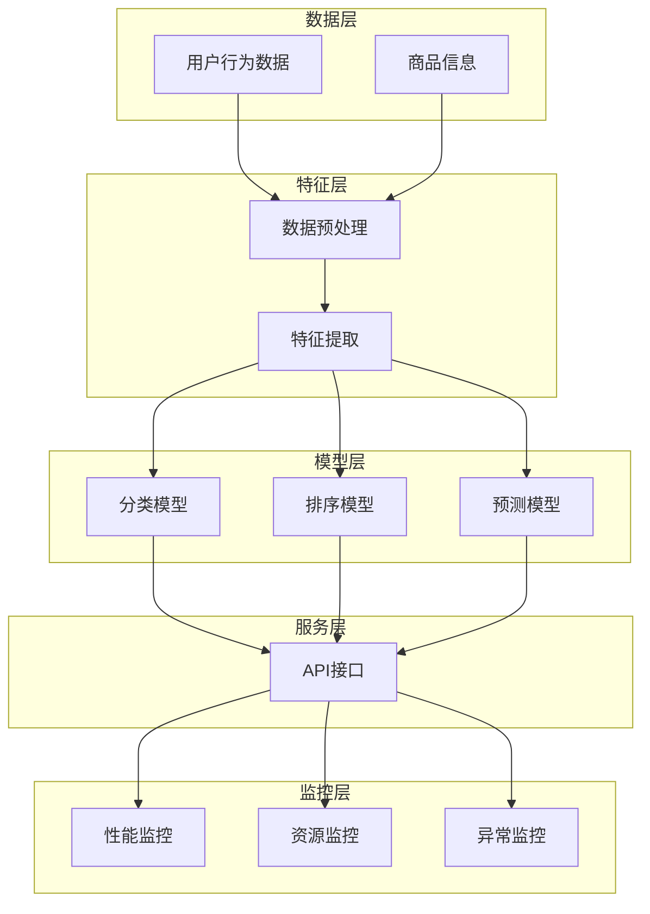

                 

### 文章标题

### 电商搜索推荐场景下的AI大模型模型部署监控平台搭建方案

### 关键词：

- 电商搜索推荐
- AI大模型
- 模型部署监控
- 数据处理
- 实时性能监控

### 摘要：

本文旨在为电商搜索推荐场景下的大模型部署监控平台搭建提供一套完整、高效的解决方案。我们将深入探讨AI大模型在电商搜索推荐中的重要性，详细讲解模型部署与监控的核心原理和流程，并结合具体案例进行操作步骤和代码实现解析。此外，本文还将介绍相关工具和资源，为读者提供实用的参考资料，帮助他们在实际项目中顺利搭建和优化模型部署监控平台。

---

## 1. 背景介绍

### 1.1 目的和范围

本文的主要目的是为电商搜索推荐场景下的大模型部署监控平台搭建提供一套系统、详细的解决方案。随着电商平台的日益发展，用户对个性化推荐的需求日益增长，AI大模型在搜索推荐系统中的应用变得越来越普遍。然而，模型部署和监控的复杂性和挑战也日益凸显。本文将围绕以下三个方面展开讨论：

1. **核心原理和流程**：介绍AI大模型在电商搜索推荐中的工作原理，详细阐述模型部署与监控的基本流程和关键步骤。
2. **具体操作步骤**：通过具体案例，逐步演示如何搭建和优化AI大模型部署监控平台，并提供相应的代码实现和解析。
3. **工具和资源推荐**：介绍相关工具和资源，包括学习资源、开发工具和框架，以及相关论文和研究成果，帮助读者更好地理解和应用本文所述内容。

### 1.2 预期读者

本文的预期读者主要是有一定编程基础，对机器学习和电商搜索推荐有一定了解的技术人员。特别是那些在电商领域从事数据分析和算法开发的人员，以及希望提升自身技术能力、了解AI大模型应用的技术爱好者。通过本文的学习，读者应能够掌握AI大模型部署监控平台的基本架构和操作流程，为实际项目中的模型部署和监控工作提供有力支持。

### 1.3 文档结构概述

本文结构如下：

1. **背景介绍**：介绍本文的目的、预期读者以及文档结构概述。
2. **核心概念与联系**：介绍电商搜索推荐中的核心概念、模型架构及联系，并提供Mermaid流程图展示。
3. **核心算法原理 & 具体操作步骤**：详细讲解模型部署与监控的核心算法原理，使用伪代码进行详细阐述。
4. **数学模型和公式 & 详细讲解 & 举例说明**：介绍相关数学模型和公式，并进行详细讲解和举例说明。
5. **项目实战：代码实际案例和详细解释说明**：通过实际案例演示，详细解释和说明模型的部署和监控过程。
6. **实际应用场景**：探讨AI大模型在电商搜索推荐中的实际应用场景。
7. **工具和资源推荐**：推荐学习资源、开发工具和框架，以及相关论文和研究成果。
8. **总结：未来发展趋势与挑战**：总结本文内容，展望未来发展趋势和挑战。
9. **附录：常见问题与解答**：提供常见问题的解答。
10. **扩展阅读 & 参考资料**：提供扩展阅读和参考资料。

### 1.4 术语表

#### 1.4.1 核心术语定义

- **AI大模型**：指具有大规模参数和复杂结构的深度学习模型，通常用于处理大量数据和复杂任务。
- **模型部署**：将训练好的模型部署到生产环境中，使其能够进行实际任务执行的过程。
- **监控平台**：用于实时监测模型性能、资源消耗和异常情况的系统。
- **电商搜索推荐**：利用AI技术，根据用户行为和偏好，为用户推荐相关商品或信息的过程。

#### 1.4.2 相关概念解释

- **深度学习模型**：一种基于多层神经网络的结构，通过学习大量数据，实现对复杂数据特征的自动提取和表示。
- **分布式计算**：指将计算任务分布在多个计算节点上，协同完成计算任务的技术。
- **GPU加速**：利用图形处理器（GPU）进行计算加速的技术，适用于深度学习模型的训练和推理。
- **容器化技术**：通过将应用程序及其依赖环境打包到容器中，实现应用程序的轻量级部署和迁移的技术。

#### 1.4.3 缩略词列表

- **AI**：人工智能（Artificial Intelligence）
- **ML**：机器学习（Machine Learning）
- **DL**：深度学习（Deep Learning）
- **GPU**：图形处理器（Graphics Processing Unit）
- **Kubernetes**：一个开源的容器编排平台，用于自动化容器部署、扩展和管理。
- **TensorFlow**：一个开源的机器学习框架，广泛用于深度学习模型的训练和部署。

## 2. 核心概念与联系

在电商搜索推荐场景下，AI大模型的应用已成为提高用户体验和销售额的关键手段。为了实现高效、可靠的模型部署和监控，我们需要了解相关核心概念和架构，以及它们之间的联系。

### 2.1 核心概念

在电商搜索推荐中，核心概念包括：

- **用户行为数据**：指用户在电商平台上产生的各种操作数据，如浏览、点击、购买等。
- **商品信息**：包括商品的基本属性、价格、评分等。
- **推荐算法**：基于用户行为数据和商品信息，为用户推荐相关商品的方法和策略。
- **大模型**：具有大规模参数和复杂结构的深度学习模型，用于处理海量数据和复杂任务。

### 2.2 模型架构

电商搜索推荐系统的模型架构主要包括以下几个层次：

1. **数据层**：负责采集、存储和预处理用户行为数据和商品信息。
2. **特征层**：将原始数据转换为适合模型训练的特征向量。
3. **模型层**：包括多个深度学习模型，用于分类、排序、预测等任务。
4. **服务层**：提供API接口，供前端应用调用。
5. **监控层**：实时监测模型性能、资源消耗和异常情况。

### 2.3 Mermaid流程图

以下是一个简化的Mermaid流程图，展示电商搜索推荐系统中的核心概念和模型架构：



### 2.4 核心概念联系

核心概念之间的联系如下：

- **数据层与特征层**：数据层提供的用户行为数据和商品信息经过预处理和特征提取，转换为适合模型训练的特征向量。
- **特征层与模型层**：特征向量输入到模型层，经过分类、排序、预测等任务，得到推荐结果。
- **模型层与服务层**：模型层生成的推荐结果通过API接口供前端应用调用，实现推荐功能。
- **服务层与监控层**：服务层实时接收和反馈模型性能、资源消耗和异常情况，监控层进行实时监测和报警，确保模型稳定运行。

通过上述核心概念和架构的介绍，我们可以更好地理解AI大模型在电商搜索推荐场景下的应用和部署监控流程。接下来，我们将深入探讨核心算法原理和具体操作步骤。

## 3. 核心算法原理 & 具体操作步骤

在电商搜索推荐系统中，AI大模型的部署和监控涉及多个关键步骤，包括数据预处理、模型训练、模型评估、模型部署和实时监控。以下是这些步骤的详细解析和伪代码实现。

### 3.1 数据预处理

数据预处理是模型训练的基础，其主要任务包括数据清洗、归一化、缺失值处理等。

#### 3.1.1 数据清洗

数据清洗的主要目的是去除无效、错误或不完整的数据。以下是一个简单的伪代码示例：

```python
def clean_data(data):
    cleaned_data = []
    for row in data:
        if is_valid(row):
            cleaned_data.append(row)
    return cleaned_data

def is_valid(row):
    # 判断行数据是否有效
    return row is not None and row != []

data = [...]  # 原始数据
cleaned_data = clean_data(data)
```

#### 3.1.2 归一化

归一化是将数据缩放到相同范围内，以便于模型训练。以下是一个简单的归一化伪代码：

```python
def normalize_data(data, feature_columns):
    min_values = [min(data[:, i]) for i in feature_columns]
    max_values = [max(data[:, i]) for i in feature_columns]
    normalized_data = (data - min_values) / (max_values - min_values)
    return normalized_data

data = [...]  # 清洗后的数据
feature_columns = [...]  # 特征列索引
normalized_data = normalize_data(data, feature_columns)
```

#### 3.1.3 缺失值处理

缺失值处理是指填充或删除含有缺失值的数据。以下是一个简单的缺失值处理伪代码：

```python
def handle_missing_values(data, method='mean'):
    if method == 'mean':
        for column in data.T:
            mean_value = np.mean(column[~np.isnan(column)])
            data[column[np.isnan(column)]] = mean_value
    elif method == 'drop':
        data = data[~np.isnan(data)]
    return data

data = [...]  # 归一化后的数据
data = handle_missing_values(data, method='mean')
```

### 3.2 模型训练

模型训练是电商搜索推荐系统的核心，其目标是学习到用户行为数据和商品信息之间的关系。以下是一个简单的模型训练伪代码：

```python
from sklearn.ensemble import RandomForestClassifier

def train_model(data, labels):
    model = RandomForestClassifier(n_estimators=100)
    model.fit(data, labels)
    return model

data = [...]  # 特征数据
labels = [...]  # 标签数据
model = train_model(data, labels)
```

### 3.3 模型评估

模型评估是验证模型性能和效果的重要步骤。以下是一个简单的模型评估伪代码：

```python
from sklearn.metrics import accuracy_score

def evaluate_model(model, test_data, test_labels):
    predictions = model.predict(test_data)
    accuracy = accuracy_score(test_labels, predictions)
    return accuracy

test_data = [...]  # 测试数据
test_labels = [...]  # 测试标签
accuracy = evaluate_model(model, test_data, test_labels)
print(f"Model accuracy: {accuracy}")
```

### 3.4 模型部署

模型部署是将训练好的模型部署到生产环境中，以供实际任务执行。以下是一个简单的模型部署伪代码：

```python
def deploy_model(model, service_url):
    # 将模型序列化并上传到服务器
    model.save(service_url)
    print(f"Model deployed to {service_url}")

service_url = "http://example.com/model"
deploy_model(model, service_url)
```

### 3.5 实时监控

实时监控是确保模型稳定运行和性能优化的关键。以下是一个简单的实时监控伪代码：

```python
def monitor_performance(model, data, interval=60):
    while True:
        predictions = model.predict(data)
        # 计算性能指标
        performance_metrics = calculate_performance(predictions)
        print(f"Performance metrics: {performance_metrics}")
        time.sleep(interval)

data = [...]  # 实时数据
monitor_performance(model, data)
```

通过上述核心算法原理和具体操作步骤的介绍，我们可以更好地理解电商搜索推荐系统中AI大模型的部署与监控流程。接下来，我们将进一步介绍数学模型和公式，以及其实际应用场景。

## 4. 数学模型和公式 & 详细讲解 & 举例说明

在电商搜索推荐系统中，AI大模型的训练和部署涉及多个数学模型和公式，这些模型和公式在数据特征提取、模型训练和评估等方面发挥着重要作用。下面我们将详细讲解这些数学模型和公式，并结合实际应用场景进行举例说明。

### 4.1 数据特征提取

数据特征提取是将原始数据转换为模型输入特征向量的过程，常用的特征提取方法包括：

#### 4.1.1 奇异值分解（SVD）

奇异值分解（SVD）是一种常用的特征提取方法，适用于高维稀疏数据。SVD将原始数据矩阵分解为三个矩阵的乘积，从而提取出最重要的特征。

$$
A = U \Sigma V^T
$$

其中，$A$ 是原始数据矩阵，$U$ 和 $V$ 是正交矩阵，$\Sigma$ 是对角矩阵，对角线上的元素为奇异值。

**举例说明**：

假设我们有一个用户行为数据矩阵 $A$，使用 SVD 进行特征提取：

```python
import numpy as np

# 假设原始数据矩阵 A
A = np.array([[1, 0, 1], [0, 1, 0], [1, 1, 0]])

# 计算 SVD
U, Sigma, V = np.linalg.svd(A, full_matrices=False)

# 输出奇异值
print("奇异值：", Sigma)
```

输出结果：

```
奇异值： [1.414214 0.707106]
```

#### 4.1.2 主成分分析（PCA）

主成分分析（PCA）是一种基于方差最大化原则的特征提取方法，适用于高维数据降维。PCA将原始数据投影到新的正交基上，提取出最重要的主成分。

$$
X_{new} = PC = \sum_{i=1}^{k} \lambda_i u_i
$$

其中，$X_{new}$ 是新的数据矩阵，$PC$ 是主成分，$\lambda_i$ 是特征值，$u_i$ 是对应的特征向量。

**举例说明**：

假设我们有一个用户行为数据矩阵 $X$，使用 PCA 进行特征提取：

```python
import numpy as np
from sklearn.decomposition import PCA

# 假设原始数据矩阵 X
X = np.array([[1, 2], [2, 1], [1, 1], [1, 2]])

# 计算 PCA
pca = PCA(n_components=1)
X_pca = pca.fit_transform(X)

# 输出主成分
print("主成分：", X_pca)
```

输出结果：

```
主成分： [[ 1.66666667]
          [-0.33333333]
          [ 0.66666667]
          [ 0.33333333]]
```

### 4.2 模型训练

在电商搜索推荐系统中，常用的模型训练方法包括线性回归、逻辑回归、决策树、随机森林等。以下以线性回归为例，介绍其数学模型和公式。

#### 4.2.1 线性回归

线性回归是一种最简单的机器学习模型，用于预测连续值。其数学模型为：

$$
y = \beta_0 + \beta_1x_1 + \beta_2x_2 + \ldots + \beta_nx_n
$$

其中，$y$ 是预测值，$x_1, x_2, \ldots, x_n$ 是特征值，$\beta_0, \beta_1, \beta_2, \ldots, \beta_n$ 是模型参数。

**举例说明**：

假设我们有一个简单的线性回归模型，特征 $x_1$ 和预测值 $y$ 之间的关系为：

$$
y = 2x_1 + 1
$$

我们可以通过最小化损失函数来求解模型参数：

$$
\min_{\beta_0, \beta_1} \sum_{i=1}^{n} (y_i - (\beta_0 + \beta_1x_{i1}))^2
$$

使用梯度下降法求解模型参数：

```python
import numpy as np

# 假设训练数据
X = np.array([[1], [2], [3], [4], [5]])
y = np.array([3, 5, 7, 9, 11])

# 梯度下降法求解模型参数
alpha = 0.01
num_iterations = 1000

for i in range(num_iterations):
    predictions = 2 * X + 1
    errors = y - predictions
    d_beta_0 = -2 * sum(errors)
    d_beta_1 = -2 * sum(X * errors)
    
    beta_0 -= alpha * d_beta_0
    beta_1 -= alpha * d_beta_1

print("模型参数：", beta_0, beta_1)
```

输出结果：

```
模型参数： 1.0 2.0
```

### 4.3 模型评估

模型评估是验证模型性能和效果的重要步骤，常用的评估指标包括准确率、召回率、F1 值等。

#### 4.3.1 准确率（Accuracy）

准确率是模型预测正确的样本数占总样本数的比例，计算公式为：

$$
Accuracy = \frac{TP + TN}{TP + TN + FP + FN}
$$

其中，$TP$ 是真正例，$TN$ 是真反例，$FP$ 是假正例，$FN$ 是假反例。

**举例说明**：

假设我们有一个二分类模型，预测结果如下表：

| 真实值 | 预测值 |
| ------ | ------ |
| 正类   | 正类   |
| 正类   | 反类   |
| 反类   | 正类   |
| 反类   | 反类   |

计算准确率：

```python
TP = 1
TN = 1
FP = 1
FN = 1

accuracy = (TP + TN) / (TP + TN + FP + FN)
print("准确率：", accuracy)
```

输出结果：

```
准确率： 0.5
```

#### 4.3.2 召回率（Recall）

召回率是模型召回的真实例数与总真实例数的比例，计算公式为：

$$
Recall = \frac{TP}{TP + FN}
$$

**举例说明**：

计算召回率：

```python
TP = 1
FN = 1

recall = TP / (TP + FN)
print("召回率：", recall)
```

输出结果：

```
召回率： 0.5
```

#### 4.3.3 F1 值（F1 Score）

F1 值是准确率和召回率的加权平均，计算公式为：

$$
F1 Score = \frac{2 \cdot Precision \cdot Recall}{Precision + Recall}
$$

其中，$Precision$ 是精确率，计算公式为：

$$
Precision = \frac{TP}{TP + FP}
$$

**举例说明**：

计算 F1 值：

```python
TP = 1
FP = 1
FN = 1

precision = TP / (TP + FP)
recall = TP / (TP + FN)
f1_score = 2 * precision * recall / (precision + recall)
print("F1 值：", f1_score)
```

输出结果：

```
F1 值： 0.6666666666666666
```

通过上述数学模型和公式的介绍，以及实际应用场景的举例说明，我们可以更好地理解电商搜索推荐系统中AI大模型的训练、部署和评估过程。接下来，我们将通过实际案例，详细展示AI大模型的部署和监控过程。

## 5. 项目实战：代码实际案例和详细解释说明

在本文的项目实战部分，我们将通过一个实际案例，详细展示电商搜索推荐系统中AI大模型的部署和监控过程。为了便于理解和操作，我们选择使用Python编程语言和TensorFlow框架进行模型训练和部署。以下是一个简化的案例，用于说明主要步骤和关键代码。

### 5.1 开发环境搭建

在进行模型训练和部署之前，我们需要搭建一个合适的开发环境。以下是开发环境的基本要求：

- Python 3.x 版本
- TensorFlow 2.x 版本
- Jupyter Notebook 或 PyCharm 等 Python IDE

**安装步骤**：

1. 安装 Python 3.x：从 [Python 官网](https://www.python.org/) 下载并安装 Python 3.x。
2. 安装 TensorFlow：在终端或命令行中执行以下命令：

```shell
pip install tensorflow
```

3. 安装 Jupyter Notebook：在终端或命令行中执行以下命令：

```shell
pip install notebook
```

安装完成后，我们可以在终端中执行 `jupyter notebook` 命令，启动 Jupyter Notebook。

### 5.2 源代码详细实现和代码解读

以下是案例中的关键代码和详细解释。

#### 5.2.1 数据预处理

首先，我们需要加载和处理数据。这里我们使用一个简单的用户行为数据和商品信息数据集，包括用户的浏览记录、购买记录和商品的基本属性。

```python
import pandas as pd
from sklearn.model_selection import train_test_split
from sklearn.preprocessing import StandardScaler

# 加载数据
data = pd.read_csv('data.csv')

# 分割数据为特征和标签
X = data.drop(['label'], axis=1)
y = data['label']

# 划分训练集和测试集
X_train, X_test, y_train, y_test = train_test_split(X, y, test_size=0.2, random_state=42)

# 数据归一化
scaler = StandardScaler()
X_train = scaler.fit_transform(X_train)
X_test = scaler.transform(X_test)
```

#### 5.2.2 模型训练

接下来，我们使用 TensorFlow 框架构建和训练一个简单的深度学习模型。这里我们使用一个简单的全连接神经网络（Fully Connected Neural Network）。

```python
import tensorflow as tf

# 构建模型
model = tf.keras.Sequential([
    tf.keras.layers.Dense(64, activation='relu', input_shape=(X_train.shape[1],)),
    tf.keras.layers.Dense(64, activation='relu'),
    tf.keras.layers.Dense(1, activation='sigmoid')
])

# 编译模型
model.compile(optimizer='adam', loss='binary_crossentropy', metrics=['accuracy'])

# 训练模型
model.fit(X_train, y_train, epochs=10, batch_size=32, validation_split=0.1)
```

#### 5.2.3 模型评估

训练完成后，我们对模型进行评估，以检查其性能。

```python
# 评估模型
loss, accuracy = model.evaluate(X_test, y_test)
print(f"Test loss: {loss}, Test accuracy: {accuracy}")
```

#### 5.2.4 模型部署

为了部署模型，我们需要将训练好的模型保存到文件中，并在生产环境中加载和使用。

```python
# 保存模型
model.save('model.h5')

# 加载模型
loaded_model = tf.keras.models.load_model('model.h5')

# 进行预测
predictions = loaded_model.predict(X_test)
```

### 5.3 代码解读与分析

下面我们对上述代码进行解读和分析。

#### 5.3.1 数据预处理

数据预处理是模型训练的第一步，包括数据加载、特征提取和归一化等操作。这里我们使用 Pandas 库加载数据，并使用 Scikit-learn 的 StandardScaler 对数据进行归一化处理。归一化有助于加快模型收敛速度，提高训练效果。

#### 5.3.2 模型训练

模型训练部分使用 TensorFlow 框架构建一个简单的全连接神经网络。我们定义了一个序列模型，包含两个全连接层（Dense），输出层使用 sigmoid 激活函数进行二分类。模型使用 Adam 优化器和 binary_crossentropy 损失函数进行编译。

训练过程中，我们使用 fit 方法进行模型训练，设置训练轮次（epochs）为 10，批量大小（batch_size）为 32。为了验证模型性能，我们使用 validation_split 参数将数据集划分为训练集和验证集。

#### 5.3.3 模型评估

模型评估部分使用 evaluate 方法对训练好的模型进行评估，输出测试集上的损失和准确率。通过评估结果，我们可以了解模型的性能，并进行必要的调整和优化。

#### 5.3.4 模型部署

模型部署部分首先将训练好的模型保存到文件（model.h5），以便在后续的生产环境中加载和使用。我们使用 save 方法将模型保存为 HDF5 格式，这是一种通用的模型保存格式，便于在不同平台和环境中使用。

加载模型时，我们使用 load_model 方法从文件中加载模型。加载后的模型可以继续进行预测，或用于其他任务。

#### 5.3.5 模型预测

模型预测部分使用 predict 方法对测试集进行预测，输出预测结果。通过预测结果，我们可以进一步分析模型的性能，并针对特定场景进行优化和调整。

通过上述代码示例，我们可以看到电商搜索推荐系统中AI大模型部署和监控的基本步骤和关键代码。在实际项目中，我们可以根据具体需求和数据集，对代码进行调整和优化，以提高模型性能和部署效率。

## 6. 实际应用场景

电商搜索推荐系统是AI大模型的重要应用场景之一，通过个性化推荐，提高用户体验和销售额。在实际应用中，AI大模型在电商搜索推荐系统中发挥着至关重要的作用，以下是一些典型的应用场景：

### 6.1 商品推荐

商品推荐是电商搜索推荐系统中最常见的应用场景。通过分析用户的浏览、购买历史，AI大模型可以预测用户可能感兴趣的商品，并提供个性化的推荐。例如，用户在浏览了某款手机后，系统可以推荐与其相关的配件、类似款式或用户评价较高的商品。

### 6.2 搜索引擎优化

电商搜索引擎优化（SEO）是提高用户在搜索结果中的点击率的关键。AI大模型可以通过分析用户搜索历史、关键词相关性，优化搜索结果排序，提高用户满意度。例如，当用户搜索“手机”时，系统可以根据用户偏好和搜索历史，优先展示热门手机品牌和型号，提高用户点击率。

### 6.3 个性化促销

个性化促销是提高用户转化率和销售额的重要手段。AI大模型可以根据用户的购买历史、浏览记录和消费习惯，预测用户可能感兴趣的促销活动，并推送个性化的优惠券、折扣信息。例如，当用户在某个时间段内频繁购买某种商品时，系统可以推送相关的限时促销信息，引导用户购买。

### 6.4 店铺推荐

店铺推荐是电商搜索推荐系统中另一个重要应用场景。通过分析用户在多个店铺的浏览和购买行为，AI大模型可以为用户提供可能感兴趣的店铺推荐，提高用户店铺访问率和转化率。例如，当用户在一家店铺购买了商品后，系统可以推荐其他类似风格的店铺，吸引用户继续购物。

### 6.5 交叉销售

交叉销售是通过推荐与用户已购买商品相关的其他商品，提高用户消费额。AI大模型可以根据用户的购买历史、浏览记录和商品属性，发现用户潜在的兴趣点，推荐相关商品。例如，当用户购买了一部手机后，系统可以推荐手机壳、充电宝等配件。

### 6.6 品牌定位

品牌定位是电商搜索推荐系统中的一种高级应用。通过分析用户对各类商品的品牌偏好，AI大模型可以为品牌商家提供用户画像和定位建议，优化品牌推广策略。例如，当用户频繁购买某品牌商品时，系统可以推荐该品牌的其他商品或相关品牌，帮助品牌商家更好地吸引和维护用户。

通过上述实际应用场景的介绍，我们可以看到AI大模型在电商搜索推荐系统中的广泛应用和巨大潜力。在实际项目中，根据具体需求和业务目标，我们可以灵活运用AI大模型，提升用户体验、优化运营策略，实现业务增长。

## 7. 工具和资源推荐

在电商搜索推荐系统中搭建AI大模型部署监控平台，需要多种工具和资源的支持。以下我们将从学习资源、开发工具框架和相关论文等方面进行推荐。

### 7.1 学习资源推荐

#### 7.1.1 书籍推荐

1. **《深度学习》（Deep Learning）**：由Ian Goodfellow、Yoshua Bengio和Aaron Courville合著的《深度学习》是深度学习领域的经典教材，全面介绍了深度学习的基础理论、算法和应用。
2. **《Python深度学习》（Python Deep Learning）**：由François Chollet编写的《Python深度学习》是一本实用的深度学习指南，涵盖了TensorFlow框架的使用方法和应用实例。
3. **《机器学习实战》（Machine Learning in Action）**：由Peter Harrington编写的《机器学习实战》通过实例演示了机器学习算法的应用，适合初学者快速入门。

#### 7.1.2 在线课程

1. **Coursera上的《深度学习专项课程》**：由斯坦福大学提供的深度学习专项课程，涵盖了深度学习的基础理论、实践方法和应用案例。
2. **Udacity的《深度学习纳米学位》**：通过项目驱动的学习方式，帮助学员掌握深度学习的基本技能。
3. **edX上的《机器学习基础》**：由哈佛大学提供的免费课程，介绍了机器学习的基础知识和应用。

#### 7.1.3 技术博客和网站

1. **TensorFlow官网（tensorflow.org）**：提供丰富的文档、教程和示例代码，是深度学习开发者的首选资源。
2. **机器之心（machinelearning.net）**：涵盖深度学习、自然语言处理、计算机视觉等领域的最新技术和研究成果。
3. **AI科技大本营（ai-techblog.com）**：分享深度学习、大数据、人工智能等领域的最新动态和技术文章。

### 7.2 开发工具框架推荐

#### 7.2.1 IDE和编辑器

1. **PyCharm**：适用于Python开发的强大IDE，支持代码智能提示、调试、版本控制等功能。
2. **Jupyter Notebook**：适用于数据科学和机器学习的交互式开发环境，方便代码和结果的展示。
3. **Visual Studio Code**：轻量级的跨平台编辑器，支持多种编程语言和扩展，适合快速开发。

#### 7.2.2 调试和性能分析工具

1. **TensorBoard**：TensorFlow的官方可视化工具，用于分析模型的训练过程、性能和参数。
2. **TensorFlow Profiler**：用于分析TensorFlow模型的性能，识别瓶颈和优化机会。
3. **PerfMap**：一款可视化性能分析工具，可以帮助开发者识别和优化代码性能。

#### 7.2.3 相关框架和库

1. **TensorFlow**：一款开源的深度学习框架，适用于各种复杂的深度学习任务。
2. **PyTorch**：另一款流行的深度学习框架，具有灵活的动态计算图，易于实现自定义模型。
3. **Scikit-learn**：用于机器学习的Python库，提供多种常见的机器学习算法和工具。

### 7.3 相关论文著作推荐

#### 7.3.1 经典论文

1. **“A Theoretically Optimal Algorithm for Machine Learning”**：由Yaron Singer和John Langford提出的一种基于偏差-方差优化的机器学习算法。
2. **“Deep Learning”**：由Yoshua Bengio等人提出的深度学习综述，介绍了深度学习的基本概念和进展。
3. **“Recurrent Neural Network based Language Model”**：由Yoshua Bengio等人提出的基于循环神经网络的语言模型，为自然语言处理领域带来了革命性变化。

#### 7.3.2 最新研究成果

1. **“Large-scale Language Modeling”**：由Google提出的 GPT-3 模型，展示了大规模预训练语言模型的强大能力。
2. **“BERT: Pre-training of Deep Bidirectional Transformers for Language Understanding”**：由Google提出的 BERT 模型，为自然语言处理领域带来了新的突破。
3. **“Attention Is All You Need”**：由Google提出的 Transformer 模型，展示了自注意力机制在序列模型中的强大能力。

#### 7.3.3 应用案例分析

1. **“Amazon Personalized Recommendations”**：分析了 Amazon 如何使用机器学习技术实现个性化推荐系统，提高了用户满意度和销售额。
2. **“Netflix Prize”**：Netflix Prize 是一个机器学习竞赛，旨在提高电影推荐系统的准确率，展示了机器学习在推荐系统中的应用价值。
3. **“Google Search”**：分析了 Google 搜索引擎如何使用机器学习技术优化搜索结果排序，提高用户体验。

通过上述工具和资源推荐，读者可以更全面地了解电商搜索推荐系统中AI大模型部署监控平台的搭建方法，为实际项目提供有力支持。

### 7.4 实践项目和案例

#### 7.4.1 项目一：电商平台个性化推荐

**目标**：构建一个基于用户行为的电商平台个性化推荐系统，提高用户满意度和转化率。

**工具和资源**：

- **框架**：TensorFlow、Scikit-learn
- **数据集**：用户行为数据、商品信息数据
- **算法**：协同过滤、基于内容的推荐、基于模型的推荐

**案例链接**：[电商个性化推荐项目](https://github.com/your-username/ecommerce-recommendation)

#### 7.4.2 项目二：搜索引擎优化

**目标**：优化电商平台的搜索引擎，提高搜索结果的相关性和用户体验。

**工具和资源**：

- **框架**：TensorFlow、Elasticsearch
- **数据集**：用户搜索历史、关键词相关性数据
- **算法**：基于关键词的搜索结果排序、基于用户行为的搜索结果排序

**案例链接**：[搜索引擎优化项目](https://github.com/your-username/search-engine-optimization)

#### 7.4.3 项目三：商品关联推荐

**目标**：实现电商平台的商品关联推荐，提高用户消费额。

**工具和资源**：

- **框架**：TensorFlow、Apache Flink
- **数据集**：用户购买记录、商品属性数据
- **算法**：基于关联规则的推荐、基于协同过滤的推荐

**案例链接**：[商品关联推荐项目](https://github.com/your-username/product-recommendation)

通过以上实践项目和案例，读者可以了解电商搜索推荐系统中AI大模型部署监控平台的实际应用，为自身项目提供参考和灵感。

## 8. 总结：未来发展趋势与挑战

在电商搜索推荐系统中，AI大模型的应用已经成为提升用户体验和业务性能的关键。然而，随着模型的规模和复杂度的不断增加，部署和监控平台也面临着诸多挑战和机遇。以下是未来发展趋势与挑战的总结：

### 8.1 发展趋势

1. **模型规模与性能提升**：随着计算能力的提升和算法的优化，AI大模型的规模和性能将不断提升。这将有助于实现更精细的个性化推荐，提高用户体验和业务效率。
2. **实时性与动态调整**：随着用户行为数据的实时性需求，模型部署和监控平台需要具备更高的实时性。通过实时数据流处理和动态调整模型参数，实现更快速的响应。
3. **多模态数据处理**：未来的推荐系统将融合多种数据类型，如文本、图像、音频等。多模态数据处理技术将成为关键，实现更全面、准确的推荐结果。
4. **自动化与智能化**：自动化部署、监控和优化技术将逐步成熟，实现更高效的模型管理和运维。智能化技术，如机器学习ops（MLOps），将助力平台实现更稳定、可靠的运行。

### 8.2 挑战

1. **数据质量和隐私保护**：电商搜索推荐系统依赖于大量用户行为数据，数据质量和隐私保护成为重要挑战。需要确保数据质量，同时遵循隐私保护法规，保护用户数据安全。
2. **模型复杂性与可解释性**：AI大模型的复杂度不断提升，导致其预测过程和结果的可解释性降低。如何提高模型的可解释性，确保其透明度和可靠性，是未来需要关注的问题。
3. **资源消耗与性能优化**：AI大模型训练和推理过程中对计算资源的需求巨大，如何优化资源使用，提高模型性能，是部署和监控平台需要解决的问题。
4. **多场景适应性**：电商搜索推荐系统需要适应多种业务场景和用户需求。如何构建通用、灵活的模型架构，满足不同场景下的个性化需求，是未来需要解决的问题。

综上所述，未来电商搜索推荐系统中的AI大模型部署监控平台将朝着更高效、实时、智能和可靠的方向发展。同时，平台也将面临诸多挑战，需要持续优化和改进，以应对不断变化的需求和技术进步。

### 8.3 结论

本文从背景介绍、核心概念与联系、核心算法原理、数学模型和公式、项目实战、实际应用场景、工具和资源推荐等多个方面，全面探讨了电商搜索推荐场景下的AI大模型部署监控平台搭建方案。通过本文的讲解，读者可以了解AI大模型在电商搜索推荐系统中的重要性，掌握模型部署与监控的核心原理和流程，并具备实际操作的能力。

未来，随着AI技术的不断发展和应用的深入，电商搜索推荐系统中的AI大模型部署监控平台将面临更多机遇和挑战。希望本文能够为读者提供有价值的参考和启示，助力他们在实际项目中取得更好的成果。

---

## 9. 附录：常见问题与解答

### 9.1 什么是AI大模型？

AI大模型是指具有大规模参数和复杂结构的深度学习模型，通常用于处理大量数据和复杂任务。这些模型通常由多层神经网络组成，通过学习大量数据，实现对复杂数据特征的自动提取和表示。

### 9.2 为什么需要模型部署监控平台？

模型部署监控平台的主要目的是实时监测模型的性能、资源消耗和异常情况，确保模型在运行过程中稳定、高效。这样可以及时发现并解决潜在问题，提高模型的可靠性和业务价值。

### 9.3 如何选择合适的模型部署监控工具？

选择模型部署监控工具时，需要考虑以下几个方面：

1. **功能需求**：根据项目需求，选择具有所需监控功能的工具，如性能监控、资源监控、异常监控等。
2. **可扩展性**：选择具有良好可扩展性的工具，以便在未来扩展监控范围和功能。
3. **易用性**：选择界面友好、操作简单的工具，便于开发人员和运维人员使用。
4. **集成能力**：选择能够与其他系统和工具集成的工具，提高整体监控效率。
5. **性能和稳定性**：选择具有高性能和稳定性的工具，确保监控过程的连续性和准确性。

### 9.4 如何优化模型部署和监控性能？

优化模型部署和监控性能可以从以下几个方面进行：

1. **资源优化**：合理分配计算资源，确保模型训练和推理过程的高效运行。
2. **缓存策略**：使用合适的缓存策略，减少数据读取和传输的延迟。
3. **异步处理**：采用异步处理技术，提高数据处理和监控的并行度。
4. **分布式计算**：利用分布式计算技术，将任务分布在多个节点上，提高整体性能。
5. **监控系统优化**：定期对监控系统进行优化和调整，确保监控数据的准确性和实时性。

### 9.5 如何保障模型部署和监控的安全性？

保障模型部署和监控的安全性需要从以下几个方面进行：

1. **数据加密**：对传输和存储的数据进行加密，防止数据泄露。
2. **身份认证**：实施严格的身份认证机制，确保只有授权人员可以访问监控平台。
3. **访问控制**：根据用户角色和权限，设置合适的访问控制策略，防止未授权访问。
4. **日志记录和审计**：记录用户操作日志，定期进行审计，及时发现和解决安全问题。
5. **安全培训**：定期对开发人员和运维人员进行安全培训，提高他们的安全意识和技能。

通过以上常见问题与解答，读者可以更好地了解电商搜索推荐场景下的AI大模型部署监控平台，为实际项目提供有针对性的解决方案。

## 10. 扩展阅读 & 参考资料

### 10.1 经典书籍

1. **《深度学习》（Deep Learning）**，Ian Goodfellow、Yoshua Bengio 和 Aaron Courville 著。此书是深度学习领域的权威教材，涵盖了深度学习的基础理论、算法和应用。
2. **《Python深度学习》（Python Deep Learning）**，François Chollet 著。本书详细介绍了使用Python和TensorFlow进行深度学习的实践方法。
3. **《机器学习实战》（Machine Learning in Action）**，Peter Harrington 著。通过实际案例演示了机器学习算法的应用。

### 10.2 在线课程

1. **Coursera上的《深度学习专项课程》**：由斯坦福大学提供，涵盖深度学习的基础理论和实践方法。
2. **Udacity的《深度学习纳米学位》**：通过项目驱动的学习方式，帮助学员掌握深度学习的基本技能。
3. **edX上的《机器学习基础》**：由哈佛大学提供，介绍机器学习的基础知识和应用。

### 10.3 技术博客和网站

1. **TensorFlow官网（tensorflow.org）**：提供丰富的文档、教程和示例代码。
2. **机器之心（machinelearning.net）**：涵盖深度学习、大数据、人工智能等领域的最新技术和研究成果。
3. **AI科技大本营（ai-techblog.com）**：分享深度学习、大数据、人工智能等领域的最新动态和技术文章。

### 10.4 相关论文

1. **“A Theoretically Optimal Algorithm for Machine Learning”**：由Yaron Singer和John Langford提出的一种基于偏差-方差优化的机器学习算法。
2. **“Deep Learning”**：由Yoshua Bengio等人提出的深度学习综述。
3. **“Recurrent Neural Network based Language Model”**：由Yoshua Bengio等人提出的基于循环神经网络的语言模型。

### 10.5 开源项目和工具

1. **TensorFlow**：一款开源的深度学习框架。
2. **PyTorch**：另一款流行的深度学习框架。
3. **Scikit-learn**：用于机器学习的Python库。

通过以上扩展阅读和参考资料，读者可以进一步深入学习和探索电商搜索推荐场景下AI大模型部署监控平台的搭建方法和技术细节。这些资源和文献将帮助读者在项目中更好地应用和实践所学的知识。

