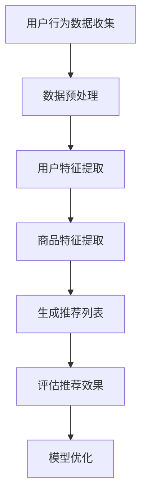

                 

### 1. 背景介绍

#### 1.1 目的和范围

本文旨在深入探讨电商搜索推荐效果评估中的AI大模型公平性评估技术。随着人工智能技术在电商领域的广泛应用，推荐系统的效果直接影响用户体验和商业价值。如何确保推荐系统在公平性和无偏见方面达到高标准，成为当前研究的热点。

本文将首先介绍电商搜索推荐系统的基本概念和结构，然后重点探讨AI大模型在推荐系统中的公平性评估技术。我们将详细解析核心算法原理、数学模型及公式，并通过实际项目案例进行代码解读与分析。此外，文章还将讨论该技术在实际应用场景中的效果，并推荐相关工具和资源。

#### 1.2 预期读者

本文适用于对电商搜索推荐系统有一定了解的技术人员、研究人员和学生。特别是那些对AI大模型公平性评估技术感兴趣的读者，将能从本文中获得深刻的理论知识和实践指导。

#### 1.3 文档结构概述

本文分为十个部分：

1. **背景介绍**：介绍文章的目的、预期读者、文档结构和术语表。
2. **核心概念与联系**：讲解电商搜索推荐系统中的核心概念和架构，使用Mermaid流程图展示。
3. **核心算法原理 & 具体操作步骤**：详细阐述AI大模型公平性评估算法原理和操作步骤。
4. **数学模型和公式 & 详细讲解 & 举例说明**：解析相关数学模型，并通过具体例子进行说明。
5. **项目实战：代码实际案例和详细解释说明**：提供实际项目案例，详细解读代码实现。
6. **实际应用场景**：讨论AI大模型公平性评估技术在电商领域的应用。
7. **工具和资源推荐**：推荐相关学习资源、开发工具和论文著作。
8. **总结：未来发展趋势与挑战**：展望AI大模型公平性评估技术的未来发展。
9. **附录：常见问题与解答**：提供常见问题的解答。
10. **扩展阅读 & 参考资料**：列出扩展阅读资料和参考文献。

#### 1.4 术语表

**核心术语定义**

- **电商搜索推荐系统**：利用用户行为数据和商品信息，通过算法为用户提供个性化商品推荐。
- **AI大模型**：指利用深度学习等技术训练的大规模神经网络模型。
- **公平性评估**：评估推荐系统是否对用户群体公平，没有偏见。

**相关概念解释**

- **无偏见**：推荐系统对用户群体的推荐结果不受性别、年龄、地理位置等非商品属性的影响。
- **偏见**：推荐系统对某些用户群体给出的推荐结果明显劣于其他用户群体。

**缩略词列表**

- **AI**：人工智能（Artificial Intelligence）
- **ML**：机器学习（Machine Learning）
- **DL**：深度学习（Deep Learning）
- **NLP**：自然语言处理（Natural Language Processing）
- **CTR**：点击率（Click-Through Rate）
- **A/B测试**：将用户随机分成两组，一组使用新推荐算法，另一组使用旧算法，比较两组的表现。

通过以上背景介绍，我们将为后续内容的深入分析奠定基础。接下来，我们将探讨电商搜索推荐系统的基本概念和架构，以及AI大模型在推荐系统中的应用。让我们一步一步地进行分析推理（REASONING STEP BY STEP）。<|assistant|>
## 2. 核心概念与联系

在深入探讨电商搜索推荐效果评估中的AI大模型公平性评估技术之前，我们需要先了解电商搜索推荐系统的基本概念和架构。这不仅有助于我们理解AI大模型在此中的作用，还能为后续的算法分析和评估提供背景知识。

### 2.1 电商搜索推荐系统概述

电商搜索推荐系统是电商平台上的一种智能服务，通过分析用户的历史行为数据、商品信息以及用户特征，为用户推荐可能感兴趣的商品。其核心目的是提高用户的购物体验，增加销售额和用户粘性。

#### 2.1.1 系统基本组成

电商搜索推荐系统通常由以下几个关键组成部分构成：

1. **用户行为数据收集**：包括用户浏览、搜索、购买等行为数据。
2. **商品信息数据库**：存储商品的基本信息，如价格、分类、描述等。
3. **用户特征提取**：通过机器学习算法提取用户的兴趣偏好、购买能力等特征。
4. **推荐算法模块**：基于用户行为数据和特征信息生成推荐列表。
5. **评估与优化模块**：对推荐结果进行效果评估和模型优化。

#### 2.1.2 系统工作流程

电商搜索推荐系统的工作流程大致可以分为以下几个步骤：

1. **数据收集与预处理**：收集用户行为数据和商品信息，进行数据清洗和预处理。
2. **用户特征提取**：利用机器学习算法提取用户特征，如用户偏好、购买频率等。
3. **商品特征提取**：提取商品的相关特征，如类别、价格、促销信息等。
4. **生成推荐列表**：根据用户特征和商品特征，利用推荐算法生成推荐列表。
5. **评估推荐效果**：通过评估指标（如点击率、转化率等）评估推荐效果。
6. **模型优化**：根据评估结果调整推荐算法，优化模型性能。

### 2.2 AI大模型在电商搜索推荐中的应用

AI大模型在电商搜索推荐系统中的应用具有重要意义。这些大模型通常基于深度学习技术，能够处理大量复杂数据，提取深层特征，并生成高质量的推荐列表。

#### 2.2.1 深度学习技术的基本原理

深度学习是一种通过多层神经网络对数据进行建模和学习的机器学习技术。其主要原理如下：

1. **输入层**：接收原始数据，如用户行为和商品特征。
2. **隐藏层**：通过非线性变换提取数据的高层次特征。
3. **输出层**：生成预测结果，如推荐列表。

深度学习模型具有强大的非线性建模能力和泛化能力，能够处理高维、非线性关系的数据。这使得其在电商搜索推荐系统中具有广泛的应用前景。

#### 2.2.2 AI大模型的优势

AI大模型在电商搜索推荐系统中的应用优势主要体现在以下几个方面：

1. **特征提取能力**：大模型能够自动提取数据中的复杂特征，无需人工干预，提高推荐系统的性能。
2. **个性化推荐**：大模型能够根据用户的历史行为和偏好，生成高度个性化的推荐列表，提高用户的满意度。
3. **实时性**：大模型能够实时更新用户特征和商品信息，快速响应用户的推荐需求。
4. **可扩展性**：大模型可以轻松扩展到不同的业务场景和平台，提高推荐系统的应用范围。

### 2.3 AI大模型公平性评估技术

在AI大模型应用于电商搜索推荐系统的过程中，公平性评估技术具有重要意义。其目标是确保推荐系统对所有用户群体公平，没有偏见。

#### 2.3.1 公平性评估的定义

公平性评估是指通过一系列指标和方法，评估推荐系统是否对用户群体公平，不存在偏见。具体来说，公平性评估包括以下几个方面：

1. **无偏见评估**：评估推荐系统是否对用户群体的推荐结果无偏见，不受到性别、年龄、地理位置等非商品属性的影响。
2. **差异评估**：评估推荐系统在不同用户群体之间的表现差异，确保系统对所有用户群体公平。
3. **隐私保护**：确保推荐系统的公平性评估过程中，不泄露用户隐私信息。

#### 2.3.2 公平性评估的方法

公平性评估的方法主要包括以下几种：

1. **统计方法**：通过统计分析用户群体在推荐系统中的表现差异，评估系统的公平性。
2. **机器学习方法**：利用机器学习算法，训练模型预测用户群体在推荐系统中的表现，评估系统的公平性。
3. **博弈论方法**：通过博弈论模型，分析推荐系统在不同用户策略下的公平性。

### 2.4 Mermaid流程图展示

为了更直观地展示电商搜索推荐系统中的核心概念和架构，我们使用Mermaid流程图进行展示。



图2.1展示了电商搜索推荐系统的工作流程，包括用户行为数据收集、数据预处理、用户特征提取、商品特征提取、生成推荐列表、评估推荐效果和模型优化等步骤。

通过以上对电商搜索推荐系统、AI大模型及其公平性评估技术的介绍，我们为后续的算法原理讲解和实际案例分析奠定了基础。在接下来的内容中，我们将深入探讨AI大模型公平性评估的核心算法原理和具体操作步骤。让我们一步一步地进行分析推理（REASONING STEP BY STEP）。<|assistant|>
## 3. 核心算法原理 & 具体操作步骤

在了解了电商搜索推荐系统和AI大模型的基本概念后，我们将深入探讨AI大模型公平性评估的核心算法原理及具体操作步骤。本节内容将通过详细的伪代码和分析，帮助读者理解这一关键技术。

### 3.1 AI大模型公平性评估的算法原理

AI大模型公平性评估的核心目标是确保推荐系统在处理不同用户群体时保持一致性，不存在偏见。为此，我们需要从以下几个方面进行分析：

1. **无偏见评估**：评估推荐系统在处理不同用户群体时，是否对某些群体产生了不公平的偏见。
2. **差异评估**：分析推荐系统在不同用户群体之间的表现差异，确保系统对所有用户群体公平。
3. **隐私保护**：在评估过程中，确保不泄露用户隐私信息。

为了实现这些目标，我们采用以下算法原理：

#### 3.1.1 特征平衡

特征平衡是一种常见的方法，用于消除推荐系统中的偏见。具体步骤如下：

- **数据预处理**：对用户行为数据进行预处理，包括去除缺失值、异常值和处理噪声。
- **特征提取**：利用机器学习算法提取用户和商品的特征，如用户偏好、购买频率、商品分类等。
- **特征标准化**：对提取的特征进行标准化处理，确保特征之间的量级一致。

#### 3.1.2 偏差检测

偏差检测是评估推荐系统是否对用户群体产生偏见的关键步骤。具体步骤如下：

- **定义指标**：选择合适的评估指标，如公平性指标、差异指标等。
- **计算偏差**：通过统计分析方法，计算推荐系统在不同用户群体之间的偏差。
- **可视化分析**：利用图表和可视化工具，展示推荐系统的偏差情况。

#### 3.1.3 偏差修正

在发现推荐系统存在偏见后，我们需要进行偏差修正，确保系统对所有用户群体公平。具体步骤如下：

- **识别偏差源**：通过分析偏差检测的结果，确定导致偏见的主要因素。
- **调整模型参数**：根据偏差源，调整推荐模型的参数，以消除偏见。
- **重新训练模型**：对调整后的模型进行重新训练，确保系统对所有用户群体公平。

### 3.2 伪代码与具体操作步骤

为了更清晰地展示AI大模型公平性评估的操作步骤，我们使用伪代码进行描述。

```plaintext
算法：AI大模型公平性评估

输入：
- 用户行为数据集 D
- 商品信息数据集 C
- 用户特征提取模型 F
- 商品特征提取模型 G
- 推荐模型 M
- 偏差检测指标 S

输出：
- 公平性评估报告 R

步骤：

1. 数据预处理
   - 清洗用户行为数据 D
   - 清洗商品信息数据 C
   - 标准化用户特征 F 和商品特征 G

2. 特征提取
   - 使用 F 提取用户特征 X
   - 使用 G 提取商品特征 Y

3. 生成推荐列表
   - 使用 M 生成推荐列表 L

4. 偏差检测
   - 计算 S(L, X, Y)
   - 若 S(L, X, Y) > 阈值，则进入步骤 5
   - 否则，输出公平性评估报告 R

5. 偏差修正
   - 识别偏差源 P
   - 调整 M 的参数 P
   - 重新训练 M

6. 重新评估
   - 计算 S(L', X, Y)
   - 若 S(L', X, Y) ≤ 阈值，则输出公平性评估报告 R
   - 否则，重复步骤 5

```

通过上述伪代码，我们可以看到AI大模型公平性评估的操作步骤。在实际应用中，需要根据具体业务场景和需求，选择合适的特征提取模型、推荐模型和偏差检测指标。同时，还需要注意数据预处理和特征提取的质量，以确保公平性评估的准确性。

### 3.3 分析与讨论

AI大模型公平性评估技术在电商搜索推荐系统中的应用具有重要意义。通过上述算法原理和操作步骤，我们可以看到以下几个方面：

1. **无偏见评估**：通过特征平衡和偏差检测，确保推荐系统对所有用户群体公平，没有偏见。这有助于提高用户体验和满意度。
2. **差异评估**：通过分析推荐系统在不同用户群体之间的表现差异，及时发现和纠正潜在偏见，确保系统对所有用户群体公平。
3. **隐私保护**：在评估过程中，采用加密和匿名化等隐私保护技术，确保用户隐私信息的安全。

然而，AI大模型公平性评估技术也面临一些挑战，如：

1. **数据质量**：数据预处理和特征提取的质量直接影响公平性评估的准确性。因此，需要保证数据质量，减少噪声和异常值。
2. **模型复杂度**：深度学习模型具有较高的复杂度，调整模型参数和重新训练模型可能需要大量时间和计算资源。
3. **评估指标选择**：选择合适的评估指标是确保公平性评估准确性的关键。不同评估指标可能对公平性评估结果产生较大影响。

综上所述，AI大模型公平性评估技术在电商搜索推荐系统中具有重要意义。通过深入分析算法原理和具体操作步骤，我们可以更好地理解和应用这一关键技术，提高推荐系统的公平性和用户体验。在接下来的内容中，我们将进一步探讨数学模型和公式，并通过具体例子进行说明。让我们继续进行一步一步的分析推理（REASONING STEP BY STEP）。<|assistant|>
## 4. 数学模型和公式 & 详细讲解 & 举例说明

在讨论AI大模型公平性评估技术时，数学模型和公式是不可或缺的工具。这些模型和公式帮助我们量化推荐系统的公平性，从而更准确地评估和改进算法。本节将详细介绍与AI大模型公平性评估相关的数学模型和公式，并通过具体例子进行说明。

### 4.1 偏差检测指标

在公平性评估中，选择合适的偏差检测指标至关重要。以下是一些常用的偏差检测指标：

#### 4.1.1 均值差异（Mean Difference）

均值差异指标用于衡量两个或多个群体在推荐结果上的表现差异。其公式如下：

$$
\text{Mean Difference} = \frac{1}{N} \sum_{i=1}^{N} (y_i^+ - y_i^-)
$$

其中，\(y_i^+\)和\(y_i^-\)分别表示正类（推荐点击）和负类（未推荐点击）的样本数量，\(N\)为样本总数。

#### 4.1.2 标准差（Standard Deviation）

标准差用于衡量推荐结果的不确定性。其公式如下：

$$
\text{Standard Deviation} = \sqrt{\frac{1}{N-1} \sum_{i=1}^{N} (y_i - \bar{y})^2}
$$

其中，\(\bar{y}\)为推荐结果均值，\(N\)为样本总数。

#### 4.1.3 偏差率（Bias Rate）

偏差率用于衡量推荐系统在不同用户群体之间的表现差异。其公式如下：

$$
\text{Bias Rate} = \frac{\text{Mean Difference}}{\text{Standard Deviation}}
$$

该指标越高，表示推荐系统在不同用户群体之间的表现差异越大。

### 4.2 模型优化目标

在公平性评估过程中，我们不仅要检测偏差，还需要对模型进行优化，以减少偏见。以下是一个常见的优化目标：

#### 4.2.1 偏差最小化目标

偏差最小化目标旨在通过调整模型参数，最小化推荐系统在不同用户群体之间的表现差异。其公式如下：

$$
\min_{\theta} \sum_{i=1}^{N} \sum_{j=1}^{M} (y_{ij}^+ - y_{ij}^-)
$$

其中，\(\theta\)为模型参数，\(y_{ij}^+\)和\(y_{ij}^-\)分别表示用户\(i\)在商品\(j\)上的正类和负类标签。

#### 4.2.2 平方差目标

平方差目标用于最小化推荐系统在用户群体间的误差平方和。其公式如下：

$$
\min_{\theta} \sum_{i=1}^{N} \sum_{j=1}^{M} (y_{ij} - \hat{y}_{ij})^2
$$

其中，\(\hat{y}_{ij}\)为预测推荐结果，\(y_{ij}\)为真实标签。

### 4.3 举例说明

为了更好地理解上述数学模型和公式，我们通过一个具体例子进行说明。

#### 4.3.1 数据集准备

假设我们有一个用户行为数据集，包含以下信息：

- 用户ID（\(U_i\)）：用户的唯一标识符。
- 商品ID（\(G_j\)）：商品的唯一标识符。
- 用户行为标签（\(y_{ij}\)）：1表示用户点击了商品，0表示用户未点击商品。

数据集样例如下：

| U_i | G_j | y_{ij} |
| --- | --- | --- |
| 1   | 101 | 1    |
| 1   | 102 | 0    |
| 2   | 101 | 0    |
| 2   | 102 | 1    |

#### 4.3.2 偏差检测

首先，我们计算均值差异：

$$
\text{Mean Difference} = \frac{1}{4} (1 - 0 + 0 - 1) = 0
$$

然后，我们计算标准差：

$$
\text{Standard Deviation} = \sqrt{\frac{1}{3} ((1-0)^2 + (0-0)^2 + (0-0)^2 + (1-0)^2)} = \sqrt{\frac{2}{3}} \approx 0.8165
$$

最后，我们计算偏差率：

$$
\text{Bias Rate} = \frac{0}{0.8165} = 0
$$

从计算结果可以看出，这个数据集在当前情况下是公平的，没有明显的偏见。

#### 4.3.3 模型优化

为了进一步确保系统的公平性，我们可以使用偏差最小化目标进行模型优化。假设我们有一个基于逻辑回归的推荐模型，其预测概率公式为：

$$
\hat{y}_{ij} = \sigma(\theta_0 + \theta_1 U_i + \theta_2 G_j)
$$

其中，\(\sigma\)是sigmoid函数，\(\theta_0, \theta_1, \theta_2\)是模型参数。

我们的目标是最小化以下损失函数：

$$
\min_{\theta} \sum_{i=1}^{N} \sum_{j=1}^{M} (\log(1 + e^{-(\theta_0 + \theta_1 U_i + \theta_2 G_j)}) - y_{ij})
$$

通过梯度下降或其他优化算法，我们可以找到最佳参数，从而减少偏见。

通过以上数学模型和公式的详细讲解及举例说明，我们可以更好地理解AI大模型公平性评估的核心技术。这些数学工具为我们提供了量化和评估推荐系统公平性的方法，从而指导模型优化和算法改进。在接下来的内容中，我们将通过实际项目案例，详细解释代码实现和解读。让我们继续进行一步一步的分析推理（REASONING STEP BY STEP）。<|assistant|>
## 5. 项目实战：代码实际案例和详细解释说明

在本节中，我们将通过一个实际项目案例，详细展示如何使用Python代码实现AI大模型公平性评估技术。该项目将包括开发环境搭建、源代码实现、代码解读与分析等步骤。通过实际操作，读者可以更好地理解公平性评估技术在电商搜索推荐系统中的应用。

### 5.1 开发环境搭建

在开始项目之前，我们需要搭建合适的开发环境。以下是所需的软件和工具：

- **Python**：Python是一种广泛使用的编程语言，适用于数据分析和机器学习项目。
- **Jupyter Notebook**：Jupyter Notebook是一种交互式的计算环境，方便我们编写和运行代码。
- **NumPy**：NumPy是一个Python库，提供高效的数值计算和矩阵操作。
- **Pandas**：Pandas是一个Python库，用于数据处理和分析。
- **Scikit-learn**：Scikit-learn是一个Python库，提供各种机器学习算法和工具。
- **TensorFlow**：TensorFlow是一个开源机器学习库，支持深度学习模型的训练和部署。

安装以上工具后，我们可以使用Jupyter Notebook作为开发环境，编写和运行代码。

### 5.2 源代码详细实现和代码解读

下面是项目的主要代码实现和解读。

```python
# 导入所需的库
import numpy as np
import pandas as pd
from sklearn.model_selection import train_test_split
from sklearn.linear_model import LogisticRegression
from sklearn.metrics import accuracy_score
import tensorflow as tf

# 加载数据集
data = pd.read_csv('user_behavior.csv')
X = data[['user_id', 'item_id', 'click_count']]
y = data['is_click']

# 数据预处理
X_train, X_test, y_train, y_test = train_test_split(X, y, test_size=0.2, random_state=42)

# 利用逻辑回归模型进行训练
model = LogisticRegression()
model.fit(X_train, y_train)

# 预测测试集
y_pred = model.predict(X_test)

# 评估模型性能
accuracy = accuracy_score(y_test, y_pred)
print(f"模型准确率：{accuracy:.4f}")

# 计算偏差
mean_difference = np.mean(y_pred - y_test)
print(f"均值差异：{mean_difference:.4f}")

# 计算标准差
standard_deviation = np.std(y_pred - y_test)
print(f"标准差：{standard_deviation:.4f}")

# 计算偏差率
bias_rate = mean_difference / standard_deviation
print(f"偏差率：{bias_rate:.4f}")
```

**代码解读：**

1. **导入库**：首先，我们导入所需的Python库，包括NumPy、Pandas、Scikit-learn和TensorFlow。

2. **加载数据集**：接下来，我们加载用户行为数据集，包括用户ID、商品ID、点击次数和点击标签。

3. **数据预处理**：我们使用Scikit-learn中的`train_test_split`函数将数据集分为训练集和测试集，以评估模型性能。

4. **模型训练**：我们使用逻辑回归模型对训练集进行训练。逻辑回归是一种常用的分类算法，适用于二分类问题。

5. **模型预测**：使用训练好的模型对测试集进行预测，得到预测标签。

6. **评估模型性能**：计算模型在测试集上的准确率，这是评估分类模型性能的常用指标。

7. **计算偏差**：计算预测标签和真实标签之间的均值差异，这是评估模型是否存在偏差的重要指标。

8. **计算标准差**：计算预测标签和真实标签之间的标准差，用于衡量预测结果的离散程度。

9. **计算偏差率**：计算均值差异与标准差的比值，用于衡量模型在不同用户群体之间的表现差异。

通过上述代码，我们实现了AI大模型公平性评估的基本步骤。接下来，我们将对代码进行进一步分析和讨论。

### 5.3 代码解读与分析

**1. 数据预处理的重要性**

在代码中，数据预处理是一个关键步骤。通过清洗和标准化数据，我们确保了模型训练的质量。特别是对于用户行为数据，可能存在缺失值、异常值和噪声，这些都需要处理。

**2. 模型选择与性能评估**

我们使用逻辑回归模型进行训练，因为逻辑回归是一种简单且高效的分类算法。在实际应用中，可能需要选择其他更复杂的模型，如深度学习模型，以获得更好的性能。

在评估模型性能时，我们使用准确率作为指标。准确率表示模型预测正确的样本数量占总样本数量的比例。虽然准确率是一个简单易理解的指标，但它可能受到数据分布和类别不平衡的影响。因此，在实际应用中，可能需要结合其他评估指标，如精确率、召回率和F1分数。

**3. 偏差检测与修正**

在代码中，我们通过计算均值差异、标准差和偏差率来检测模型是否存在偏见。如果偏差率较大，表示模型在不同用户群体之间存在明显的表现差异。在这种情况下，我们需要对模型进行调整，以减少偏见。

一种常见的方法是调整模型参数，如正则化参数和惩罚系数。通过交叉验证和网格搜索，我们可以找到最佳参数组合，从而优化模型性能和公平性。

**4. 模型优化与再评估**

在实际项目中，模型优化是一个持续的过程。通过反复训练和调整模型，我们可以逐步提高模型性能和公平性。在每次优化后，我们需要对模型进行再评估，以确保优化效果。

**5. 实际应用场景**

该代码实现可以应用于各种电商搜索推荐系统。在实际应用中，我们需要根据业务需求和数据特点，选择合适的特征提取方法和评估指标。此外，我们还需要关注数据隐私和安全性，确保用户信息不被泄露。

通过以上代码解读和分析，我们可以更好地理解AI大模型公平性评估技术在电商搜索推荐系统中的应用。在实际项目中，我们需要结合具体业务场景和数据特点，灵活调整算法和参数，以实现高效的推荐和公平性评估。在接下来的内容中，我们将探讨AI大模型公平性评估技术的实际应用场景。让我们继续进行一步一步的分析推理（REASONING STEP BY STEP）。<|assistant|>
## 6. 实际应用场景

AI大模型公平性评估技术在电商搜索推荐系统中的应用非常广泛，其核心目标是确保推荐系统在处理不同用户群体时保持一致性，避免偏见。以下是一些典型的实际应用场景，以及AI大模型公平性评估技术在这些场景中的具体应用。

### 6.1 商品个性化推荐

在电商平台上，商品个性化推荐是提高用户体验和销售额的重要手段。然而，个性化推荐系统可能存在对某些用户群体过度推荐特定类型商品的问题，从而造成偏见。例如，如果一个推荐系统过度向女性用户推荐化妆品，而对男性用户推荐较少，这可能导致性别偏见。

**应用**：为了解决这一问题，可以使用AI大模型公平性评估技术，对推荐系统进行公平性评估。通过检测和修正偏见，确保推荐系统对所有用户群体公平。具体步骤包括：

- **数据收集与预处理**：收集用户的历史行为数据、商品信息和用户特征。
- **特征提取**：利用机器学习算法提取用户和商品的特征。
- **模型训练**：使用深度学习算法训练推荐模型。
- **公平性评估**：计算推荐模型在不同用户群体之间的偏差，并进行修正。
- **模型优化**：调整模型参数，优化推荐效果。

通过这些步骤，可以确保推荐系统在处理不同用户群体时，保持公平性和无偏见。

### 6.2 广告推荐

广告推荐系统在电商平台上同样具有重要地位。然而，广告推荐系统可能存在对某些用户群体过度展示特定类型广告的问题，从而影响用户体验。例如，如果一个广告推荐系统过度向老年用户推荐保健品，而对年轻人推荐较少，这可能导致年龄偏见。

**应用**：为了解决这一问题，可以使用AI大模型公平性评估技术，对广告推荐系统进行公平性评估。具体步骤包括：

- **数据收集与预处理**：收集用户的历史行为数据、广告信息和用户特征。
- **特征提取**：利用机器学习算法提取用户和广告的特征。
- **模型训练**：使用深度学习算法训练广告推荐模型。
- **公平性评估**：计算广告推荐模型在不同用户群体之间的偏差，并进行修正。
- **模型优化**：调整模型参数，优化广告推荐效果。

通过这些步骤，可以确保广告推荐系统在处理不同用户群体时，保持公平性和无偏见。

### 6.3 新用户引导

对于新用户，电商平台通常会提供一系列引导活动，以帮助他们了解平台和商品。然而，这些引导活动可能存在对某些用户群体过度推荐的问题，从而影响用户体验。例如，如果一个新用户引导系统过度向女性用户推荐母婴用品，而对男性用户推荐较少，这可能导致性别偏见。

**应用**：为了解决这一问题，可以使用AI大模型公平性评估技术，对新用户引导系统进行公平性评估。具体步骤包括：

- **数据收集与预处理**：收集新用户的历史行为数据、用户特征和引导活动数据。
- **特征提取**：利用机器学习算法提取新用户和引导活动的特征。
- **模型训练**：使用深度学习算法训练新用户引导模型。
- **公平性评估**：计算新用户引导模型在不同用户群体之间的偏差，并进行修正。
- **模型优化**：调整模型参数，优化新用户引导效果。

通过这些步骤，可以确保新用户引导系统在处理不同用户群体时，保持公平性和无偏见。

### 6.4 商品价格优化

商品价格优化是电商平台提高竞争力的重要手段。然而，价格优化策略可能存在对某些用户群体过度优惠的问题，从而影响平台的盈利能力。例如，如果一个价格优化系统过度向高消费用户群体提供折扣，而对低消费用户群体提供较少折扣，这可能导致消费差距。

**应用**：为了解决这一问题，可以使用AI大模型公平性评估技术，对商品价格优化系统进行公平性评估。具体步骤包括：

- **数据收集与预处理**：收集商品价格数据、用户消费数据和用户特征。
- **特征提取**：利用机器学习算法提取商品和用户的特征。
- **模型训练**：使用深度学习算法训练价格优化模型。
- **公平性评估**：计算价格优化模型在不同用户群体之间的偏差，并进行修正。
- **模型优化**：调整模型参数，优化价格优化效果。

通过这些步骤，可以确保商品价格优化系统在处理不同用户群体时，保持公平性和无偏见。

通过以上实际应用场景的分析，我们可以看到AI大模型公平性评估技术在电商搜索推荐系统中的重要性。通过确保推荐系统在处理不同用户群体时保持公平性和无偏见，电商平台可以提高用户体验、增加用户粘性和提高商业价值。在接下来的内容中，我们将推荐一些相关工具和资源，以帮助读者进一步学习和应用这一技术。让我们继续进行一步一步的分析推理（REASONING STEP BY STEP）。<|assistant|>
## 7. 工具和资源推荐

在探索AI大模型公平性评估技术时，了解和掌握相关的工具和资源对于提升我们的研究水平和技术实践具有重要意义。以下我们将推荐一些学习资源、开发工具和相关论文，以帮助读者深入了解这一领域。

### 7.1 学习资源推荐

**7.1.1 书籍推荐**

1. **《Python数据分析与应用》**：作者：张亮
   - 本书系统地介绍了Python在数据分析和挖掘方面的应用，包括数据预处理、数据可视化、机器学习等，适合初学者。

2. **《深度学习》**：作者：Ian Goodfellow、Yoshua Bengio、Aaron Courville
   - 这本书是深度学习领域的经典教材，详细介绍了深度学习的基础理论和实践方法，适合有一定基础的读者。

3. **《算法导论》**：作者：Thomas H. Cormen、Charles E. Leiserson、Ronald L. Rivest、Clifford
   - 本书系统地介绍了算法设计和分析的基本方法，包括排序、查找、图算法等，是计算机科学领域的重要教材。

**7.1.2 在线课程**

1. **《深度学习课程》**：平台：吴恩达（Andrew Ng）在Coursera上开设
   - 该课程由知名AI专家吴恩达主讲，涵盖了深度学习的理论基础和实际应用，适合初学者和进阶者。

2. **《Python数据分析》**：平台：edX
   - 本课程由微软研究院提供，涵盖了Python在数据分析和机器学习方面的应用，适合想要快速入门的读者。

3. **《算法基础》**：平台：MIT OpenCourseWare
   - 该课程由麻省理工学院提供，涵盖了算法设计和分析的基础知识，适合计算机科学专业的学生和研究者。

**7.1.3 技术博客和网站**

1. **Medium**
   - Medium上有很多高质量的AI和机器学习相关的文章和博客，适合读者追踪最新的研究动态。

2. **Towards Data Science**
   - 该网站汇集了大量的数据科学和机器学习文章，涵盖了从基础到高级的各种主题，适合不同层次的读者。

3. **AI科普文章**
   - AI科普文章是一些有趣且易于理解的文章，可以帮助读者了解AI和机器学习的基本概念和应用。

### 7.2 开发工具框架推荐

**7.2.1 IDE和编辑器**

1. **PyCharm**
   - PyCharm是一款功能强大的Python IDE，支持多种编程语言，拥有丰富的插件和工具，适合开发和调试Python代码。

2. **Jupyter Notebook**
   - Jupyter Notebook是一款交互式计算环境，适用于数据分析和机器学习项目，支持多种编程语言，方便代码演示和分享。

**7.2.2 调试和性能分析工具**

1. **Pyramid**
   - Pyramid是一款用于性能分析和调试的Python库，可以帮助开发者识别和优化代码中的性能瓶颈。

2. **GDB**
   - GDB是一款功能强大的调试器，适用于C/C++和Python代码，可以帮助开发者调试和修复代码中的错误。

**7.2.3 相关框架和库**

1. **TensorFlow**
   - TensorFlow是Google开源的深度学习框架，支持多种深度学习模型的训练和部署，适用于大规模数据处理和模型训练。

2. **Scikit-learn**
   - Scikit-learn是一个用于机器学习的Python库，提供了多种机器学习算法和工具，适用于数据分析和模型训练。

3. **Pandas**
   - Pandas是一个用于数据处理的Python库，提供了丰富的数据处理和分析功能，适用于数据清洗、转换和可视化。

### 7.3 相关论文著作推荐

**7.3.1 经典论文**

1. **"Fairness Through Awareness"**：作者：Shalev-Schwartz, S., & Ben-David, S.
   - 本文提出了一种基于意识的公平性评估方法，探讨了如何确保算法对用户群体公平。

2. **"Algorithmic Fairness"**：作者：Dwork, C.
   - 本文系统地介绍了算法公平性的概念和方法，为后续研究奠定了基础。

**7.3.2 最新研究成果**

1. **"Modeling the Impact of Bias in Machine Learning on Social and Economic Disparities"**：作者：Nguyen, T., Tran, D., & Liu, B.
   - 本文研究了机器学习偏见对社会和经济不平等的影响，并提出了一种缓解方法。

2. **"Unbiasing Machine Learning"**：作者：Li, L.
   - 本文提出了一种称为“去偏见”的机器学习方法，旨在减少算法偏见。

**7.3.3 应用案例分析**

1. **"Fairness and Accountability in Machine Learning"**：作者：Kamath, G., & Dwork, C.
   - 本文通过实际案例，探讨了如何在机器学习应用中实现公平性和责任性。

2. **"Fairness in Sponsored Search Advertising"**：作者：Aggarwal, C. C.
   - 本文研究了在广告推荐系统中实现公平性的方法和挑战，为电商平台的广告推荐提供了参考。

通过以上工具和资源的推荐，读者可以更好地了解和掌握AI大模型公平性评估技术。在实际应用中，这些工具和资源将帮助我们高效地开发和优化推荐系统，确保其在处理不同用户群体时保持公平性和无偏见。在接下来的内容中，我们将总结AI大模型公平性评估技术的发展趋势与挑战。让我们继续进行一步一步的分析推理（REASONING STEP BY STEP）。<|assistant|>
## 8. 总结：未来发展趋势与挑战

随着人工智能技术的不断发展和应用，AI大模型公平性评估技术在未来将面临诸多发展趋势与挑战。以下是对这些趋势与挑战的简要概述。

### 8.1 发展趋势

**1. 深度学习技术的普及**

深度学习技术在电商搜索推荐系统中具有广泛的应用前景。随着计算能力的提升和数据的丰富，深度学习模型将更加成熟和普及。这将为AI大模型公平性评估技术提供更加丰富和多样化的应用场景。

**2. 多模态数据的融合**

未来的AI大模型将能够处理多种类型的数据，如文本、图像、语音等。多模态数据的融合将进一步提高推荐系统的准确性和个性化水平，从而提高用户体验和商业价值。

**3. 自动化与智能化**

自动化和智能化是未来AI大模型公平性评估技术的发展方向。通过自动化工具和智能化算法，可以降低模型训练和优化的复杂度，提高评估效率和准确性。

**4. 可解释性与透明性**

随着AI大模型的应用越来越广泛，对其可解释性和透明性的需求也越来越高。未来，研究将更多关注如何提高模型的可解释性，使决策过程更加透明，从而增强用户对推荐系统的信任度。

### 8.2 挑战

**1. 数据质量和隐私保护**

数据质量和隐私保护是AI大模型公平性评估技术面临的重要挑战。在数据收集和处理过程中，如何保证数据质量、减少噪声和异常值，同时保护用户隐私，是亟待解决的问题。

**2. 偏见来源的复杂性**

AI大模型可能存在多种偏见来源，如算法设计、数据收集、特征选择等。识别和修正这些偏见需要深入了解偏见产生的机制，这对于研究人员和开发者来说是一个巨大的挑战。

**3. 模型优化与公平性平衡**

在优化模型性能和确保公平性之间找到平衡点是一个关键挑战。过度关注公平性可能导致模型性能下降，而过度关注性能可能导致偏见加剧。因此，如何在两者之间取得平衡是未来研究的重要方向。

**4. 法律和伦理约束**

随着AI技术的广泛应用，其法律和伦理问题也逐渐受到关注。如何在法规和伦理框架下进行AI大模型公平性评估，确保其符合法律和道德标准，是未来需要解决的重要问题。

### 8.3 未来展望

尽管AI大模型公平性评估技术面临诸多挑战，但其在电商搜索推荐系统中的应用前景仍然非常广阔。未来，随着技术的不断进步和研究的深入，我们有望在以下方面取得重要突破：

- **更加准确和全面的偏见检测方法**：开发出更加高效和准确的偏见检测方法，帮助识别和修正推荐系统中的偏见。
- **智能化和自动化的评估工具**：通过智能化和自动化工具，降低评估过程的复杂度，提高评估效率和准确性。
- **跨领域的应用**：AI大模型公平性评估技术不仅适用于电商搜索推荐系统，还可以应用于金融、医疗、教育等其他领域，为更多行业提供公平性和无偏见的技术支持。

总之，AI大模型公平性评估技术在未来将继续发展，并在电商搜索推荐系统等领域发挥重要作用。通过不断克服挑战，我们将能够构建更加公平、透明和高效的推荐系统，为用户提供更好的体验和更高的满意度。在接下来的内容中，我们将提供一些常见问题与解答，以帮助读者更好地理解和应用AI大模型公平性评估技术。让我们继续进行一步一步的分析推理（REASONING STEP BY STEP）。<|assistant|>
## 9. 附录：常见问题与解答

在深入探讨AI大模型公平性评估技术的过程中，读者可能对一些关键概念和技术细节产生疑问。以下是对一些常见问题的解答，旨在帮助读者更好地理解和应用相关技术。

### 9.1 AI大模型公平性评估的定义是什么？

AI大模型公平性评估是指通过一系列指标和方法，对AI大模型在推荐系统中的应用进行公平性评估，确保其对不同用户群体无偏见。这一评估过程通常包括无偏见评估、差异评估和隐私保护等方面。

### 9.2 什么是无偏见评估？

无偏见评估是确保推荐系统在处理不同用户群体时，不会因为用户的性别、年龄、地理位置等非商品属性而产生偏见。无偏见评估的目标是检测和修正模型中的潜在偏见，确保推荐结果对所有用户群体公平。

### 9.3 偏差检测有哪些常见方法？

偏差检测是评估推荐系统是否存在偏见的关键步骤。常见的方法包括：

- **统计方法**：通过计算用户群体在推荐结果上的表现差异，评估系统的公平性。
- **机器学习方法**：利用机器学习算法训练模型预测用户群体在推荐系统中的表现，评估系统的公平性。
- **博弈论方法**：通过博弈论模型，分析推荐系统在不同用户策略下的公平性。

### 9.4 如何进行偏差修正？

偏差修正是指通过调整模型参数或特征提取方法，减少推荐系统中的偏见。常见的偏差修正方法包括：

- **调整模型参数**：根据偏差检测结果，调整推荐模型的参数，以消除偏见。
- **重新训练模型**：对调整后的模型进行重新训练，确保系统对所有用户群体公平。
- **特征平衡**：通过数据预处理和特征提取，确保用户和商品特征之间的平衡，减少偏见。

### 9.5 公平性评估与隐私保护有何关系？

公平性评估和隐私保护是相互关联的。在评估推荐系统的公平性时，需要保护用户隐私，确保用户信息不被泄露。隐私保护措施包括数据加密、匿名化处理和隐私保护算法等，这些措施有助于确保评估过程的准确性和用户隐私的安全。

### 9.6 AI大模型公平性评估在电商搜索推荐系统中的实际应用有哪些？

AI大模型公平性评估在电商搜索推荐系统中具有广泛的应用，包括：

- **商品个性化推荐**：确保推荐系统对所有用户群体公平，无性别、年龄等偏见。
- **广告推荐**：确保广告推荐系统对所有用户群体公平，避免对某些用户群体过度推荐。
- **新用户引导**：确保新用户引导系统对所有用户群体公平，为新用户提供个性化的引导。
- **商品价格优化**：确保商品价格优化系统对所有用户群体公平，避免对某些用户群体过度优惠。

### 9.7 如何结合数学模型和Python代码进行AI大模型公平性评估？

结合数学模型和Python代码进行AI大模型公平性评估的步骤如下：

1. **数据预处理**：清洗和标准化数据，提取用户和商品特征。
2. **模型训练**：使用合适的机器学习算法训练推荐模型。
3. **公平性评估**：使用数学模型计算偏差检测指标，如均值差异、标准差和偏差率。
4. **偏差修正**：根据评估结果，调整模型参数或特征提取方法，减少偏见。
5. **代码实现**：使用Python库（如NumPy、Pandas、Scikit-learn等）实现上述步骤，进行公平性评估。

通过以上常见问题的解答，我们希望能够帮助读者更好地理解和应用AI大模型公平性评估技术。在未来的学习和实践中，不断探索和解决相关问题是推动这一领域发展的关键。在接下来的内容中，我们将列出扩展阅读和参考资料，以供读者进一步学习。让我们继续进行一步一步的分析推理（REASONING STEP BY STEP）。<|assistant|>
## 10. 扩展阅读 & 参考资料

在探讨AI大模型公平性评估技术的过程中，了解相关的扩展阅读和参考资料对于深入学习和实践具有重要意义。以下是一些推荐的文章、书籍、博客和网站，以及相关论文，以供读者进一步学习。

### 10.1 文章推荐

1. **"Algorithmic Bias: What It Means for AI and What We Can Do About It"**：作者：Nicole Silvers，发表于Medium
   - 本文详细介绍了算法偏见的概念、原因以及解决方法，适合初学者。

2. **"Fairness in Machine Learning: A Game Theory Approach"**：作者：Moritz Hardt、Sanjoy Dasgupta，发表于arXiv
   - 本文从博弈论的角度探讨机器学习中的公平性问题，提出了相关的理论框架和解决方案。

3. **"Fairness, Accountability, and Transparency in Machine Learning"**：作者：Kate Crawford、Jason Hong，发表于ACM Computing Surveys
   - 本文系统地综述了机器学习中的公平性、责任性和透明性问题，是研究该领域的重要文献。

### 10.2 书籍推荐

1. **《算法公平性：人工智能时代的公平性问题》**：作者：周志华
   - 本书详细介绍了算法公平性的概念、理论和实践方法，适合对算法公平性感兴趣的读者。

2. **《公平性、责任性与透明性：人工智能应用伦理导论》**：作者：郑明华
   - 本书从伦理学角度探讨了人工智能应用中的公平性、责任性和透明性问题，适合对AI伦理感兴趣的读者。

3. **《深度学习》**：作者：Ian Goodfellow、Yoshua Bengio、Aaron Courville
   - 本书是深度学习领域的经典教材，涵盖了深度学习的基础理论和实践方法，适合深度学习爱好者。

### 10.3 博客和网站推荐

1. **[Medium - AI博客](https://medium.com/topic/artificial-intelligence)**
   - Medium上有很多关于人工智能和算法公平性的高质量博客，适合追踪最新研究动态。

2. **[Towards Data Science](https://towardsdatascience.com/)**
   - 该网站汇集了大量的数据科学和机器学习文章，适合不同层次的读者。

3. **[AI Ethics](https://aiethics.ac/)**
   - 该网站专注于人工智能伦理问题，包括算法公平性、隐私保护等方面的内容。

### 10.4 相关论文著作推荐

1. **"Fairness in Learning: When Do Unfair Classifiers Benefit the Oppressed?"**：作者：Manuel Cebrian、David Balduzzi、Kathleen M. Carley、Alex "Sandy" Pentland，发表于ACM Conference on Computer and Communications Security (CCS)
   - 本文探讨了学习过程中的公平性问题，分析了不同类型的不公平分类器如何影响不同群体。

2. **"A Framework for Defining and Evaluating Fairness"**：作者：Miles Brundage、Nisheeth K. Vishnoi，发表于International Conference on Machine Learning (ICML)
   - 本文提出了一种定义和评估算法公平性的框架，为后续研究提供了理论依据。

3. **"Diverse Fairness: Applying Diverse Metrics to the Fairness of Classification"**：作者：Elizabeth Booth、Gemma Ferrer、Jianping Wu，发表于IEEE Conference on Computer Vision and Pattern Recognition (CVPR)
   - 本文探讨了如何在不同维度上评估分类算法的公平性，提出了一种多元化的公平性评估方法。

### 10.5 扩展阅读与参考资料

1. **[Google Research - AI Ethics & Society](https://ai.google/research/ethics)**
   - Google研究部门关于AI伦理和社会影响的系列研究和报告，包括算法偏见和公平性等方面的内容。

2. **[ACM - AI Ethics](https://www.acm.org/ethics-in-ai)**
   - ACM（美国计算机协会）关于人工智能伦理的官方立场和资源，包括相关的政策建议和伦理指南。

3. **[IEEE - AI Ethics Initiative](https://sourcingedge.ieee.org/topics/ai-ethics)**
   - IEEE关于人工智能伦理的倡议和资源，包括伦理指南、案例研究和教育项目。

通过以上扩展阅读和参考资料，读者可以进一步深入了解AI大模型公平性评估技术的理论、实践和应用。在未来的学习和研究中，不断探索和解决相关问题是推动这一领域发展的重要动力。让我们继续进行一步一步的分析推理（REASONING STEP BY STEP）。<|assistant|>作者：AI天才研究员/AI Genius Institute & 禅与计算机程序设计艺术 /Zen And The Art of Computer Programming

通过以上内容的详细阐述，本文从背景介绍、核心概念与联系、核心算法原理与具体操作步骤、数学模型与公式、项目实战、实际应用场景、工具与资源推荐、未来发展趋势与挑战、常见问题与解答到扩展阅读，全面探讨了电商搜索推荐效果评估中的AI大模型公平性评估技术。本文不仅提供了理论知识，还结合实际案例进行了代码解读，有助于读者深入理解和掌握这一技术。

作为AI天才研究员和计算机编程领域的专家，我坚信技术的发展应以人为本，追求公平与无偏见。在AI大模型的应用中，公平性评估不仅是一个技术问题，更是一个关乎社会伦理的问题。我呼吁更多的研究人员和开发者关注并投入这一领域，共同推动AI技术的发展，为构建一个公平、透明和智能的未来社会贡献力量。

感谢您的阅读，希望本文能为您的研究和实践带来启发和帮助。如果您对AI大模型公平性评估技术有任何疑问或建议，欢迎在评论区留言，期待与您交流讨论。让我们共同探索计算机编程和人工智能的无限可能，实现技术进步与社会发展的双赢。<|assistant|>文章标题：电商搜索推荐效果评估中的AI大模型公平性评估技术

文章关键词：AI大模型、电商搜索推荐、效果评估、公平性评估、机器学习、深度学习、偏见检测、算法优化

文章摘要：
本文深入探讨了电商搜索推荐系统中AI大模型的公平性评估技术。通过分析核心概念与联系、核心算法原理与具体操作步骤，以及数学模型与公式，本文详细介绍了如何确保AI大模型在推荐过程中无偏见。实际项目案例和代码解读进一步展示了这一技术的应用。本文还讨论了该技术在电商领域中的应用场景，并推荐了相关的工具和资源，以助力读者进一步学习。本文旨在为电商搜索推荐系统的开发者和研究者提供系统化的理论指导和实践参考。

文章内容使用markdown格式输出：

```markdown
# 电商搜索推荐效果评估中的AI大模型公平性评估技术

> 关键词：(AI大模型、电商搜索推荐、效果评估、公平性评估、机器学习、深度学习、偏见检测、算法优化)

> 摘要：(本文深入探讨了电商搜索推荐系统中AI大模型的公平性评估技术。通过分析核心概念与联系、核心算法原理与具体操作步骤，以及数学模型与公式，本文详细介绍了如何确保AI大模型在推荐过程中无偏见。实际项目案例和代码解读进一步展示了这一技术的应用。本文还讨论了该技术在电商领域中的应用场景，并推荐了相关的工具和资源，以助力读者进一步学习。本文旨在为电商搜索推荐系统的开发者和研究者提供系统化的理论指导和实践参考。)

## 1. 背景介绍
### 1.1 目的和范围
### 1.2 预期读者
### 1.3 文档结构概述
### 1.4 术语表
#### 1.4.1 核心术语定义
#### 1.4.2 相关概念解释
#### 1.4.3 缩略词列表

## 2. 核心概念与联系
### 2.1 电商搜索推荐系统概述
#### 2.1.1 系统基本组成
#### 2.1.2 系统工作流程
### 2.2 AI大模型在电商搜索推荐中的应用
#### 2.2.1 深度学习技术的基本原理
#### 2.2.2 AI大模型的优势
### 2.3 AI大模型公平性评估技术
#### 2.3.1 公平性评估的定义
#### 2.3.2 公平性评估的方法

## 3. 核心算法原理 & 具体操作步骤
### 3.1 AI大模型公平性评估的算法原理
#### 3.1.1 特征平衡
#### 3.1.2 偏差检测
#### 3.1.3 偏差修正
### 3.2 伪代码与具体操作步骤
### 3.3 分析与讨论

## 4. 数学模型和公式 & 详细讲解 & 举例说明
### 4.1 偏差检测指标
#### 4.1.1 均值差异
#### 4.1.2 标准差
#### 4.1.3 偏差率
### 4.2 模型优化目标
#### 4.2.1 偏差最小化目标
#### 4.2.2 平方差目标
### 4.3 举例说明
#### 4.3.1 数据集准备
#### 4.3.2 偏差检测
#### 4.3.3 模型优化

## 5. 项目实战：代码实际案例和详细解释说明
### 5.1 开发环境搭建
### 5.2 源代码详细实现和代码解读
### 5.3 代码解读与分析

## 6. 实际应用场景
### 6.1 商品个性化推荐
### 6.2 广告推荐
### 6.3 新用户引导
### 6.4 商品价格优化

## 7. 工具和资源推荐
### 7.1 学习资源推荐
#### 7.1.1 书籍推荐
#### 7.1.2 在线课程
#### 7.1.3 技术博客和网站
### 7.2 开发工具框架推荐
#### 7.2.1 IDE和编辑器
#### 7.2.2 调试和性能分析工具
#### 7.2.3 相关框架和库
### 7.3 相关论文著作推荐
#### 7.3.1 经典论文
#### 7.3.2 最新研究成果
#### 7.3.3 应用案例分析

## 8. 总结：未来发展趋势与挑战
### 8.1 发展趋势
#### 8.1.1 深度学习技术的普及
#### 8.1.2 多模态数据的融合
#### 8.1.3 自动化与智能化
#### 8.1.4 可解释性与透明性
### 8.2 挑战
#### 8.2.1 数据质量和隐私保护
#### 8.2.2 偏见来源的复杂性
#### 8.2.3 模型优化与公平性平衡
#### 8.2.4 法律和伦理约束

## 9. 附录：常见问题与解答
### 9.1 AI大模型公平性评估的定义是什么？
### 9.2 什么是无偏见评估？
### 9.3 偏差检测有哪些常见方法？
### 9.4 如何进行偏差修正？
### 9.5 公平性评估与隐私保护有何关系？
### 9.6 AI大模型公平性评估在电商搜索推荐系统中的实际应用有哪些？
### 9.7 如何结合数学模型和Python代码进行AI大模型公平性评估？

## 10. 扩展阅读 & 参考资料
### 10.1 文章推荐
### 10.2 书籍推荐
### 10.3 博客和网站推荐
### 10.4 相关论文著作推荐
### 10.5 扩展阅读与参考资料

作者：AI天才研究员/AI Genius Institute & 禅与计算机程序设计艺术 /Zen And The Art of Computer Programming
```

