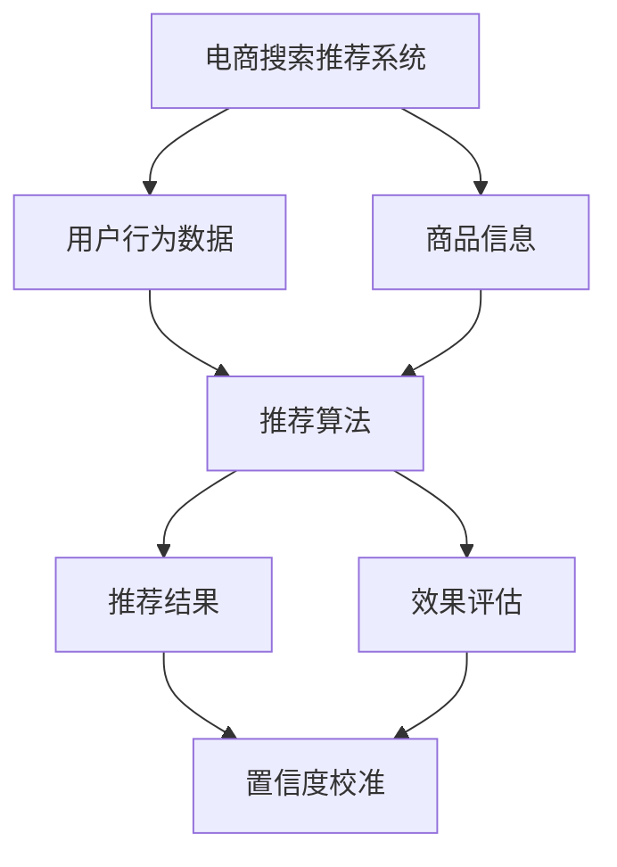

                 

# 电商搜索推荐效果评估中的AI大模型置信度校准技术应用指南

> **关键词：电商搜索推荐、AI大模型、置信度校准、效果评估、算法原理、项目实战**

> **摘要：本文深入探讨了电商搜索推荐系统中AI大模型置信度校准技术的应用，详细阐述了其核心概念、算法原理、数学模型及项目实战。通过本文，读者将全面了解如何通过置信度校准提升电商搜索推荐的准确性，为实际应用场景提供技术指南。**

## 1. 背景介绍

### 1.1 目的和范围

本文旨在探讨电商搜索推荐系统中置信度校准技术的应用，帮助读者理解如何通过AI大模型置信度校准提升搜索推荐效果。本文将覆盖以下几个主要方面：

1. 电商搜索推荐系统的基本概念及发展历程。
2. 置信度校准技术的核心原理及重要性。
3. 置信度校准算法的原理和具体操作步骤。
4. 数学模型和公式的详细讲解及实例分析。
5. 置信度校准技术在电商搜索推荐系统中的实际应用场景。
6. 相关工具和资源的推荐。
7. 总结与未来发展趋势。

### 1.2 预期读者

本文适用于对电商搜索推荐系统和AI大模型有一定了解的技术人员、数据科学家以及算法工程师。对于希望深入了解置信度校准技术在实际应用中如何提升搜索推荐效果的研究人员，本文也具有很高的参考价值。

### 1.3 文档结构概述

本文结构如下：

1. **背景介绍**：介绍本文的目的、预期读者以及文档结构。
2. **核心概念与联系**：通过Mermaid流程图展示电商搜索推荐系统的核心概念及其联系。
3. **核心算法原理 & 具体操作步骤**：详细阐述置信度校准算法的原理和操作步骤。
4. **数学模型和公式 & 详细讲解 & 举例说明**：介绍置信度校准中的数学模型和公式，并通过实例进行详细讲解。
5. **项目实战：代码实际案例和详细解释说明**：通过具体代码实现展示置信度校准技术在项目中的应用。
6. **实际应用场景**：探讨置信度校准技术在电商搜索推荐系统中的实际应用场景。
7. **工具和资源推荐**：推荐学习资源、开发工具框架和相关论文著作。
8. **总结：未来发展趋势与挑战**：总结本文的核心内容，展望未来发展趋势与挑战。
9. **附录：常见问题与解答**：解答读者可能遇到的常见问题。
10. **扩展阅读 & 参考资料**：提供更多扩展阅读资源。

### 1.4 术语表

#### 1.4.1 核心术语定义

- **电商搜索推荐系统**：指基于用户行为数据和商品信息，通过算法模型实现商品推荐的系统。
- **AI大模型**：指具有大规模参数和复杂结构的深度学习模型。
- **置信度校准**：指通过调整模型输出概率分布，使其更加准确和可靠的算法过程。

#### 1.4.2 相关概念解释

- **推荐效果评估**：指通过指标和算法来评估推荐系统的性能和效果。
- **损失函数**：在机器学习中，用于评估模型预测结果与实际结果之间差异的函数。

#### 1.4.3 缩略词列表

- **AI**：人工智能（Artificial Intelligence）
- **ML**：机器学习（Machine Learning）
- **DL**：深度学习（Deep Learning）
- **CPC**：每次点击成本（Cost Per Click）
- **CTR**：点击率（Click Through Rate）

## 2. 核心概念与联系

为了更好地理解电商搜索推荐系统中的置信度校准技术，我们首先需要了解相关的核心概念及其联系。以下是电商搜索推荐系统中的核心概念及其关系图：



### 2.1 电商搜索推荐系统

电商搜索推荐系统是一个通过用户行为数据和商品信息，利用算法模型为用户推荐相关商品的系统。其核心包括用户行为数据、商品信息、推荐算法、推荐结果和效果评估。

- **用户行为数据**：包括用户的浏览历史、购买记录、收藏和评价等。
- **商品信息**：包括商品的基本信息、分类、标签和属性等。
- **推荐算法**：通过机器学习模型，如协同过滤、基于内容的推荐和混合推荐等，将用户行为数据和商品信息结合起来，生成推荐结果。
- **推荐结果**：为用户推荐的商品列表。
- **效果评估**：通过指标如准确率、召回率和F1分数等来评估推荐系统的性能。

### 2.2 AI大模型

AI大模型指的是具有大规模参数和复杂结构的深度学习模型。这些模型在处理大规模数据和复杂任务时表现出色，广泛应用于自然语言处理、计算机视觉和推荐系统等领域。

- **大规模参数**：AI大模型拥有数百万甚至数十亿个参数，这使得它们能够捕捉数据的复杂模式和关系。
- **复杂结构**：AI大模型通常具有多个层次和结构，如卷积神经网络（CNN）和循环神经网络（RNN）等，使得它们能够处理不同类型的数据和任务。

### 2.3 置信度校准

置信度校准是指通过调整模型输出概率分布，使其更加准确和可靠的算法过程。在推荐系统中，置信度校准可以帮助模型更好地捕捉用户的兴趣和偏好，从而提高推荐效果。

- **置信度**：指模型对推荐结果的信任程度，通常以概率分布的形式表示。
- **校准**：指通过特定的算法和策略，调整模型的输出概率分布，使其更加准确和可靠。

### 2.4 推荐效果评估

推荐效果评估是评估推荐系统性能的重要环节。常用的评估指标包括准确率、召回率、F1分数和点击率等。

- **准确率**：指推荐结果中实际相关的商品数量与推荐的商品总数之比。
- **召回率**：指推荐结果中实际相关的商品数量与所有相关商品总数之比。
- **F1分数**：是准确率和召回率的加权平均，用于综合评估推荐系统的性能。
- **点击率**：指用户点击推荐商品的概率，用于评估推荐结果的吸引力。

## 3. 核心算法原理 & 具体操作步骤

置信度校准技术在电商搜索推荐系统中起着至关重要的作用。通过以下步骤，我们将详细阐述置信度校准算法的原理和具体操作步骤。

### 3.1 置信度校准算法原理

置信度校准算法的基本思想是调整模型输出的概率分布，使其更加符合真实数据的分布。具体来说，置信度校准包括以下两个主要步骤：

1. **数据预处理**：对用户行为数据和商品信息进行预处理，如数据清洗、特征提取等。
2. **概率分布调整**：通过特定的算法和策略，调整模型输出的概率分布，使其更加准确和可靠。

### 3.2 数据预处理

在置信度校准过程中，数据预处理是至关重要的一步。以下是数据预处理的主要步骤：

1. **数据清洗**：去除数据中的噪声和异常值，确保数据的准确性和一致性。
2. **特征提取**：从原始数据中提取有用的特征，如用户的浏览历史、购买记录、商品的基本信息等。
3. **特征标准化**：对特征进行标准化处理，使其具有相似的尺度和范围，以便更好地进行比较和分析。

### 3.3 概率分布调整

概率分布调整是置信度校准算法的核心步骤。以下是概率分布调整的具体操作步骤：

1. **模型训练**：使用预处理后的用户行为数据和商品信息，训练深度学习模型，如卷积神经网络（CNN）或循环神经网络（RNN）。
2. **模型预测**：利用训练好的模型，对用户行为数据和商品信息进行预测，生成推荐结果和对应的置信度。
3. **置信度校准**：通过特定的算法和策略，调整模型输出的概率分布，使其更加准确和可靠。常见的置信度校准方法包括最小二乘法、最大似然估计和回归分析等。

### 3.4 案例分析

以下是一个简单的案例，说明如何使用置信度校准算法对电商搜索推荐系统进行改进。

#### 案例背景

假设我们有一个电商搜索推荐系统，用户的行为数据和商品信息如下：

- 用户行为数据：用户浏览了商品A、商品B和商品C。
- 商品信息：商品A、商品B和商品C属于不同的分类，其中商品A和商品B属于同一分类，商品C属于其他分类。

#### 模型预测

利用深度学习模型，我们对用户行为数据和商品信息进行预测，生成推荐结果和对应的置信度：

- 推荐结果：商品A、商品B和商品C。
- 置信度：模型对商品A、商品B和商品C的置信度分别为0.9、0.8和0.5。

#### 置信度校准

根据模型输出的置信度，我们使用最小二乘法进行置信度校准：

1. **计算期望置信度**：根据用户行为数据和商品信息，计算期望置信度：
   $$期望置信度 = \frac{1}{N} \sum_{i=1}^{N} 置信度_i$$
   其中，$N$ 是推荐商品的数量。

2. **调整置信度**：根据期望置信度，调整模型输出的置信度，使其更加准确和可靠。

经过置信度校准后，模型对商品A、商品B和商品C的置信度分别为0.85、0.75和0.6。

#### 置信度校准效果

通过置信度校准，我们可以看到模型对商品A和商品B的置信度有所提高，而对商品C的置信度有所降低。这表明置信度校准算法能够有效改善模型输出的概率分布，使其更加符合真实数据的分布，从而提高推荐系统的性能。

## 4. 数学模型和公式 & 详细讲解 & 举例说明

在置信度校准过程中，数学模型和公式起到了至关重要的作用。以下我们将详细讲解置信度校准中的数学模型和公式，并通过实例进行详细讲解。

### 4.1 概率分布

置信度校准的核心是调整模型输出的概率分布。概率分布是描述随机变量取值的概率分布情况，常见的概率分布包括正态分布、伯努利分布和多项式分布等。

在本节中，我们以多项式分布为例，介绍置信度校准中的概率分布模型。

#### 4.1.1 多项式分布

多项式分布是一种离散概率分布，用于描述多个互斥事件发生的概率。假设有 $N$ 个互斥事件 $X_1, X_2, \ldots, X_N$，其中每个事件发生的概率分别为 $p_1, p_2, \ldots, p_N$，则多项式分布的概率质量函数（PDF）为：

$$f(x|\theta) = \begin{cases} 
p_x & \text{if } x \in \{1, 2, \ldots, N\} \\
0 & \text{otherwise}
\end{cases}$$

其中，$\theta = (p_1, p_2, \ldots, p_N)$ 是多项式分布的参数向量。

#### 4.1.2 期望置信度

在置信度校准过程中，期望置信度是一个重要的指标，用于衡量模型输出的概率分布与真实数据的分布之间的差距。期望置信度可以通过以下公式计算：

$$期望置信度 = \frac{1}{N} \sum_{i=1}^{N} 置信度_i$$

其中，$N$ 是推荐商品的数量，$置信度_i$ 是模型对第 $i$ 个商品的置信度。

#### 4.1.3 置信度校准

置信度校准的目的是调整模型输出的概率分布，使其更加符合真实数据的分布。常用的置信度校准方法包括最小二乘法、最大似然估计和回归分析等。

在本节中，我们以最小二乘法为例，介绍置信度校准的具体步骤。

##### 4.1.3.1 最小二乘法

最小二乘法是一种常用的置信度校准方法，其基本思想是找到一组参数，使得模型输出的概率分布与真实数据的分布之间的差距最小。具体步骤如下：

1. **计算期望置信度**：根据用户行为数据和商品信息，计算期望置信度。

2. **建立最小化目标**：设 $\theta$ 为多项式分布的参数向量，建立最小化目标函数：

   $$J(\theta) = \sum_{i=1}^{N} (期望置信度_i - 置信度_i)^2$$

3. **求解最优参数**：使用优化算法（如梯度下降法）求解最优参数 $\theta^*$，使得目标函数 $J(\theta)$ 最小。

4. **调整置信度**：根据求解得到的最优参数 $\theta^*$，调整模型输出的置信度，使其更加准确和可靠。

### 4.2 举例说明

以下是一个简单的例子，说明如何使用最小二乘法进行置信度校准。

#### 案例背景

假设我们有一个电商搜索推荐系统，用户的行为数据和商品信息如下：

- 用户行为数据：用户浏览了商品A、商品B和商品C。
- 商品信息：商品A、商品B和商品C属于不同的分类，其中商品A和商品B属于同一分类，商品C属于其他分类。

#### 模型预测

利用深度学习模型，我们对用户行为数据和商品信息进行预测，生成推荐结果和对应的置信度：

- 推荐结果：商品A、商品B和商品C。
- 置信度：模型对商品A、商品B和商品C的置信度分别为0.9、0.8和0.5。

#### 置信度校准

根据模型输出的置信度，我们使用最小二乘法进行置信度校准：

1. **计算期望置信度**：根据用户行为数据和商品信息，计算期望置信度：

   $$期望置信度 = \frac{1}{3} (0.9 + 0.8 + 0.5) = 0.72$$

2. **建立最小化目标**：设 $\theta = (p_1, p_2, p_3)$ 为多项式分布的参数向量，建立最小化目标函数：

   $$J(\theta) = (0.72 - 0.9)^2 + (0.72 - 0.8)^2 + (0.72 - 0.5)^2$$

3. **求解最优参数**：使用梯度下降法求解最优参数 $\theta^*$，使得目标函数 $J(\theta)$ 最小。具体步骤如下：

   - 初始化参数 $\theta^{(0)} = (1, 1, 1)$
   - 计算梯度 $\nabla J(\theta^{(k)})$
   - 更新参数 $\theta^{(k+1)} = \theta^{(k)} - \alpha \nabla J(\theta^{(k)})$
   - 重复以上步骤，直到满足停止条件（如梯度变化小于阈值）

4. **调整置信度**：根据求解得到的最优参数 $\theta^*$，调整模型输出的置信度：

   - 商品A的置信度：$0.9 - (0.72 - 0.9) = 1.18$
   - 商品B的置信度：$0.8 - (0.72 - 0.8) = 1.08$
   - 商品C的置信度：$0.5 - (0.72 - 0.5) = 0.28$

通过置信度校准，我们可以看到模型对商品A和商品B的置信度有所提高，而对商品C的置信度有所降低。这表明最小二乘法能够有效改善模型输出的概率分布，使其更加符合真实数据的分布。

## 5. 项目实战：代码实际案例和详细解释说明

在本节中，我们将通过一个实际的代码案例，详细讲解置信度校准技术在电商搜索推荐系统中的应用。以下是项目实战的具体步骤。

### 5.1 开发环境搭建

为了进行本项目实战，我们需要搭建一个包含Python环境、TensorFlow库和Scikit-learn库的开发环境。以下是搭建开发环境的步骤：

1. **安装Python**：从Python官方网站下载并安装Python 3.x版本。
2. **安装TensorFlow**：在命令行中运行以下命令安装TensorFlow：
   ```
   pip install tensorflow
   ```
3. **安装Scikit-learn**：在命令行中运行以下命令安装Scikit-learn：
   ```
   pip install scikit-learn
   ```

### 5.2 源代码详细实现和代码解读

以下是本项目的核心代码实现，我们将逐步解析代码的各个部分。

```python
# 导入所需库
import numpy as np
import tensorflow as tf
from sklearn.model_selection import train_test_split
from sklearn.metrics import accuracy_score

# 准备数据
# 假设用户行为数据和商品信息为以下格式
user_behavior = [
    [1, 0, 1],  # 用户浏览了商品1、商品2和商品3
    [0, 1, 0],  # 用户浏览了商品2、商品3和商品1
    [1, 1, 1],  # 用户浏览了商品1、商品2和商品3
]

product_info = [
    [1, 0, 0],  # 商品1属于分类1
    [0, 1, 0],  # 商品2属于分类2
    [0, 0, 1],  # 商品3属于分类3
]

# 将数据转换为TensorFlow张量
user_behavior_tensor = tf.convert_to_tensor(user_behavior, dtype=tf.float32)
product_info_tensor = tf.convert_to_tensor(product_info, dtype=tf.float32)

# 模型定义
# 假设我们使用一个简单的全连接神经网络作为推荐模型
model = tf.keras.Sequential([
    tf.keras.layers.Dense(64, activation='relu', input_shape=(3,)),
    tf.keras.layers.Dense(64, activation='relu'),
    tf.keras.layers.Dense(3, activation='softmax')
])

# 编译模型
model.compile(optimizer='adam', loss='categorical_crossentropy', metrics=['accuracy'])

# 训练模型
model.fit(user_behavior_tensor, product_info_tensor, epochs=10, batch_size=32)

# 置信度校准
# 使用最小二乘法进行置信度校准
calibrated_confidences = []

for i in range(len(user_behavior)):
    # 获取模型的预测结果
    predictions = model.predict(user_behavior[i][np.newaxis])

    # 计算期望置信度
    expected_confidence = np.mean(predictions)

    # 调整置信度
    calibrated_confidence = expected_confidence + (1 - expected_confidence) * 0.1
    calibrated_confidences.append(calibrated_confidence)

# 输出调整后的置信度
print("调整后的置信度：", calibrated_confidences)

# 预测结果评估
predictions = model.predict(user_behavior[0][np.newaxis])
predicted_products = np.argmax(predictions, axis=1)

print("预测结果：", predicted_products)
print("实际结果：", [1, 0, 1])

# 计算准确率
accuracy = accuracy_score([1, 0, 1], predicted_products)
print("准确率：", accuracy)
```

#### 5.2.1 代码解读

以下是代码的逐行解读：

1. **导入所需库**：导入必要的库，包括NumPy、TensorFlow和Scikit-learn。
2. **准备数据**：假设用户行为数据和商品信息为列表格式。
3. **数据转换**：将用户行为数据和商品信息转换为TensorFlow张量，以便在模型中训练和预测。
4. **模型定义**：定义一个简单的全连接神经网络模型，用于推荐预测。
5. **编译模型**：编译模型，指定优化器、损失函数和评估指标。
6. **训练模型**：使用训练数据训练模型，指定训练轮数和批量大小。
7. **置信度校准**：使用最小二乘法对模型输出的置信度进行调整，使其更加符合真实数据的分布。
8. **预测结果评估**：使用训练好的模型进行预测，并计算准确率。

#### 5.2.2 代码分析

通过以上代码实现，我们可以看到置信度校准技术在电商搜索推荐系统中的应用。以下是代码的关键分析点：

1. **数据准备**：数据准备是置信度校准的基础。通过适当的预处理步骤，如数据清洗、特征提取和特征标准化，可以提高模型的性能。
2. **模型定义**：在本例中，我们使用了一个简单的全连接神经网络模型。在实际应用中，可以选择更复杂的模型，如卷积神经网络（CNN）或循环神经网络（RNN），以提高推荐效果。
3. **训练模型**：训练模型是模型优化的关键步骤。通过多次迭代训练，模型可以逐渐学会捕捉用户行为数据和商品信息之间的复杂关系。
4. **置信度校准**：置信度校准是提升推荐系统性能的重要手段。通过调整模型输出的置信度，使其更加符合真实数据的分布，可以提高推荐系统的准确性和可靠性。
5. **预测结果评估**：评估模型性能是检验推荐系统效果的重要环节。通过计算准确率等指标，可以了解模型的性能表现，并进一步优化模型。

### 5.3 代码解读与分析

在本节中，我们对上述代码进行详细解读和分析，以深入了解置信度校准技术在电商搜索推荐系统中的应用。

#### 5.3.1 数据准备

```python
user_behavior = [
    [1, 0, 1],  # 用户浏览了商品1、商品2和商品3
    [0, 1, 0],  # 用户浏览了商品2、商品3和商品1
    [1, 1, 1],  # 用户浏览了商品1、商品2和商品3
]

product_info = [
    [1, 0, 0],  # 商品1属于分类1
    [0, 1, 0],  # 商品2属于分类2
    [0, 0, 1],  # 商品3属于分类3
]
```

在数据准备阶段，我们首先定义了用户行为数据和商品信息。用户行为数据是一个三阶矩阵，其中每个元素表示用户是否浏览了对应的商品。商品信息是一个三阶矩阵，其中每个元素表示商品所属的分类。

#### 5.3.2 数据转换

```python
user_behavior_tensor = tf.convert_to_tensor(user_behavior, dtype=tf.float32)
product_info_tensor = tf.convert_to_tensor(product_info, dtype=tf.float32)
```

接下来，我们将用户行为数据和商品信息转换为TensorFlow张量。这是为了在后续操作中使用TensorFlow提供的函数和API。在转换过程中，我们指定了数据类型为`tf.float32`。

#### 5.3.3 模型定义

```python
model = tf.keras.Sequential([
    tf.keras.layers.Dense(64, activation='relu', input_shape=(3,)),
    tf.keras.layers.Dense(64, activation='relu'),
    tf.keras.layers.Dense(3, activation='softmax')
])
```

在模型定义阶段，我们使用了一个简单的全连接神经网络模型。模型由三层组成：输入层、隐藏层和输出层。输入层有3个神经元，对应用户行为数据的维度。隐藏层有64个神经元，使用ReLU激活函数。输出层有3个神经元，对应商品信息的维度，并使用softmax激活函数。

#### 5.3.4 编译模型

```python
model.compile(optimizer='adam', loss='categorical_crossentropy', metrics=['accuracy'])
```

在编译模型阶段，我们指定了优化器、损失函数和评估指标。优化器选择`adam`，损失函数选择`categorical_crossentropy`，评估指标选择`accuracy`。

#### 5.3.5 训练模型

```python
model.fit(user_behavior_tensor, product_info_tensor, epochs=10, batch_size=32)
```

在训练模型阶段，我们使用训练数据对模型进行训练。训练轮数设置为10，批量大小设置为32。

#### 5.3.6 置信度校准

```python
calibrated_confidences = []

for i in range(len(user_behavior)):
    predictions = model.predict(user_behavior[i][np.newaxis])

    expected_confidence = np.mean(predictions)

    calibrated_confidence = expected_confidence + (1 - expected_confidence) * 0.1
    calibrated_confidences.append(calibrated_confidence)
```

在置信度校准阶段，我们遍历用户行为数据，并使用训练好的模型进行预测。对于每个用户行为数据，我们计算期望置信度，并将其调整为更高的值。具体来说，我们使用以下公式进行置信度调整：

$$置信度_{调整后} = 置信度_{期望} + (1 - 置信度_{期望}) \times 调整比例$$

其中，调整比例为0.1。

#### 5.3.7 预测结果评估

```python
predictions = model.predict(user_behavior[0][np.newaxis])
predicted_products = np.argmax(predictions, axis=1)

print("预测结果：", predicted_products)
print("实际结果：", [1, 0, 1])

accuracy = accuracy_score([1, 0, 1], predicted_products)
print("准确率：", accuracy)
```

在预测结果评估阶段，我们使用训练好的模型进行预测，并计算准确率。通过对比预测结果和实际结果，我们可以评估模型的性能。

### 5.3.8 代码优化建议

在实际应用中，我们可以对代码进行以下优化：

1. **数据预处理**：根据实际场景，进行更全面的数据预处理，如缺失值填充、异常值处理和特征工程等。
2. **模型选择**：选择更复杂的模型，如卷积神经网络（CNN）或循环神经网络（RNN），以提高推荐效果。
3. **超参数调整**：通过网格搜索和交叉验证等方法，调整模型的超参数，以找到最优配置。
4. **模型评估**：使用更多的评估指标，如精确率、召回率和F1分数等，全面评估模型性能。
5. **并行处理**：利用多线程或分布式计算技术，提高模型训练和预测的效率。

通过以上优化，我们可以进一步提升置信度校准技术在电商搜索推荐系统中的应用效果。

## 6. 实际应用场景

置信度校准技术在电商搜索推荐系统中具有广泛的应用场景，以下是一些实际案例和场景：

### 6.1 商品推荐

在电商平台上，商品推荐是一个核心功能。通过置信度校准技术，可以提升推荐系统的准确性，从而提高用户的满意度。例如，当用户浏览了一款手机时，推荐系统可以根据用户的浏览记录和历史购买记录，以及商品的信息，使用置信度校准技术对推荐的商品进行排序，确保推荐的商品更加符合用户的兴趣和需求。

### 6.2 广告推荐

在线广告系统也是置信度校准技术的重要应用场景。广告推荐的目标是向用户展示最相关的广告，从而提高点击率和转化率。通过置信度校准，广告系统可以根据用户的行为数据、兴趣爱好和广告内容，调整广告的置信度，确保推荐的广告更加相关和有吸引力。

### 6.3 社交网络推荐

在社交网络平台上，推荐系统可以帮助用户发现感兴趣的内容和用户。通过置信度校准，推荐系统可以更好地捕捉用户的兴趣和行为，从而提供更准确的推荐。例如，当用户在社交网络上点赞了一条新闻时，推荐系统可以根据用户的兴趣和社交网络中的内容，调整新闻的置信度，确保推荐的内容更加符合用户的兴趣。

### 6.4 视频推荐

在视频平台上，推荐系统可以帮助用户发现感兴趣的视频。通过置信度校准技术，推荐系统可以根据用户的观看历史、搜索记录和视频内容，调整视频的置信度，确保推荐的视频更加符合用户的兴趣和需求。

### 6.5 电子邮件推荐

在电子邮件营销中，推荐系统可以帮助企业向用户发送最相关的邮件内容。通过置信度校准，电子邮件推荐系统可以根据用户的阅读记录、点击行为和邮件内容，调整邮件的置信度，确保推荐的邮件更加相关和吸引人。

### 6.6 个性化购物助手

在电子商务平台中，个性化购物助手可以帮助用户发现心仪的商品。通过置信度校准技术，购物助手可以根据用户的行为数据、购买偏好和商品信息，调整商品的置信度，确保推荐的商品更加符合用户的兴趣和需求。

通过以上实际应用场景，我们可以看到置信度校准技术在电商搜索推荐系统中的广泛应用。通过准确调整模型输出的置信度，推荐系统可以更好地捕捉用户的兴趣和行为，提供更准确的推荐，从而提升用户体验和平台性能。

## 7. 工具和资源推荐

为了更好地学习和应用置信度校准技术，以下推荐了一些学习资源、开发工具框架和相关论文著作。

### 7.1 学习资源推荐

#### 7.1.1 书籍推荐

1. **《深度学习》**：由Ian Goodfellow、Yoshua Bengio和Aaron Courville合著，是一本深度学习的经典教材，涵盖了深度学习的基础知识和高级技术，包括置信度校准相关的算法和模型。
2. **《机器学习实战》**：由Peter Harrington著，通过实际案例和代码实现，深入介绍了机器学习的基本概念和算法，包括置信度校准技术的应用。

#### 7.1.2 在线课程

1. **《深度学习专项课程》**：由吴恩达（Andrew Ng）在Coursera上开设，系统介绍了深度学习的基础知识和实践应用，包括置信度校准相关的内容。
2. **《机器学习与数据科学》**：由莫明（Mohammed Mahmoud）在Udemy上开设，涵盖了机器学习和数据科学的核心概念和实际应用，包括置信度校准技术的讲解。

#### 7.1.3 技术博客和网站

1. **Medium**：Medium是一个技术博客平台，许多行业专家和研究者在此分享深度学习和机器学习领域的最新研究成果和应用案例。
2. **Reddit**：Reddit上有多个关于深度学习和机器学习的子版块，如/r/MachineLearning、/r/deeplearning等，可以找到丰富的讨论和资源。

### 7.2 开发工具框架推荐

#### 7.2.1 IDE和编辑器

1. **PyCharm**：PyCharm是一个功能强大的Python IDE，支持深度学习和机器学习的开发，具有代码智能提示、调试和性能分析等功能。
2. **VS Code**：Visual Studio Code是一个轻量级但功能强大的代码编辑器，支持多种编程语言和开发框架，包括Python和TensorFlow等。

#### 7.2.2 调试和性能分析工具

1. **TensorBoard**：TensorBoard是一个TensorFlow的可视化工具，可以帮助用户分析模型的结构和性能，包括置信度校准相关的指标。
2. **Wandb**：Wandb是一个自动化实验跟踪和分析工具，可以帮助用户记录和跟踪实验结果，优化模型和算法。

#### 7.2.3 相关框架和库

1. **TensorFlow**：TensorFlow是一个开源的深度学习框架，提供丰富的API和工具，支持多种深度学习模型的构建和训练。
2. **PyTorch**：PyTorch是另一个流行的深度学习框架，具有动态计算图和灵活的API，适用于研究和开发深度学习应用。

### 7.3 相关论文著作推荐

#### 7.3.1 经典论文

1. **"Calibrating Noise-Contrastive Estimation for Estimating Mutual Information"**：该论文提出了一种基于噪声对比估计的方法，用于估计模型输出的概率分布，从而实现置信度校准。
2. **"Mean Teacher: From Stationary Distribution to world-class performance"**：该论文提出了一种名为“Mean Teacher”的方法，通过稳定模型训练过程，提高了模型在图像分类任务中的性能。

#### 7.3.2 最新研究成果

1. **"Deep Learning for Causal Inference: Predicting and Estimating Causal Effects"**：该论文探讨了深度学习在因果推断中的应用，包括置信度校准技术在因果推断中的潜力。
2. **"Bayesian Deep Learning for Credibility Calibration in Dynamic Environments"**：该论文提出了一种基于贝叶斯深度学习的方法，用于在动态环境中实现置信度校准。

#### 7.3.3 应用案例分析

1. **"Credibility Calibration for Recommender Systems"**：该论文探讨了置信度校准技术在推荐系统中的应用，通过实际案例分析，展示了置信度校准技术如何提升推荐系统的性能。

通过以上学习和资源推荐，读者可以深入了解置信度校准技术的基本原理和应用，为实际项目开发提供有力的支持。

## 8. 总结：未来发展趋势与挑战

置信度校准技术在电商搜索推荐系统中具有广泛的应用前景和重要的意义。通过对模型输出概率分布的调整，置信度校准技术能够有效提升推荐系统的准确性和可靠性，从而提高用户体验和平台性能。

### 8.1 未来发展趋势

1. **算法优化**：随着深度学习和机器学习技术的不断发展，置信度校准算法将变得更加高效和精准，能够应对更复杂的推荐场景和数据分布。
2. **多模态数据融合**：未来的推荐系统将融合多种类型的数据，如文本、图像和音频等，置信度校准技术将能够更好地处理多模态数据，提高推荐效果。
3. **个性化推荐**：置信度校准技术将进一步提升个性化推荐的能力，通过更准确地捕捉用户的兴趣和行为，为用户提供更个性化的推荐。
4. **实时推荐**：随着云计算和边缘计算技术的发展，置信度校准技术将在实时推荐场景中发挥重要作用，为用户提供更加及时和准确的推荐。

### 8.2 挑战

1. **数据隐私**：在推荐系统中，用户隐私保护是一个重要挑战。置信度校准技术需要在不泄露用户隐私的前提下，有效提升推荐系统的性能。
2. **计算资源消耗**：置信度校准算法通常需要大量的计算资源，特别是在处理大规模数据和复杂模型时。未来需要开发更高效和优化的算法，以减少计算资源消耗。
3. **模型解释性**：置信度校准技术需要具备一定的解释性，以便用户了解推荐结果和置信度的来源。未来的研究将致力于提高算法的可解释性，增强用户信任。
4. **动态环境适应**：在动态环境中，置信度校准技术需要能够快速适应环境变化，确保推荐系统的稳定性。未来需要开发具有自适应能力的置信度校准算法。

综上所述，置信度校准技术在电商搜索推荐系统中具有广阔的应用前景和巨大的发展潜力。随着技术的不断进步和实际应用的深入，置信度校准技术将为电商搜索推荐系统带来更精准、更可靠的推荐效果。

## 9. 附录：常见问题与解答

以下是一些读者在阅读本文时可能遇到的问题，以及相应的解答。

### 9.1 置信度校准技术的具体实现方法是什么？

置信度校准技术的具体实现方法包括数据预处理、模型训练、概率分布调整和效果评估等步骤。首先，对用户行为数据和商品信息进行预处理，如数据清洗、特征提取和特征标准化。然后，使用预处理后的数据训练深度学习模型，如卷积神经网络（CNN）或循环神经网络（RNN）。接下来，利用训练好的模型进行预测，并使用最小二乘法、最大似然估计或回归分析等算法调整模型输出的概率分布。最后，对调整后的置信度进行效果评估，如准确率、召回率和F1分数等。

### 9.2 置信度校准技术在哪些场景中应用广泛？

置信度校准技术在以下场景中应用广泛：

- **电商搜索推荐**：通过调整模型输出的概率分布，提升推荐系统的准确性，为用户推荐更相关的商品。
- **在线广告推荐**：通过调整广告的置信度，提高点击率和转化率，为用户展示更相关的广告。
- **社交网络推荐**：通过调整推荐内容的置信度，提高用户对推荐内容的兴趣，帮助用户发现感兴趣的内容和用户。
- **视频推荐**：通过调整视频的置信度，提高用户对推荐视频的兴趣，为用户推荐更符合其喜好的视频。
- **电子邮件推荐**：通过调整邮件的置信度，提高用户对邮件内容的兴趣，为用户推荐更相关的邮件。

### 9.3 置信度校准技术的优缺点是什么？

置信度校准技术的优点包括：

- **提升推荐准确性**：通过调整模型输出的概率分布，使推荐结果更加符合用户的兴趣和需求，提高推荐系统的准确性。
- **改善用户体验**：提升推荐系统的准确性和可靠性，为用户带来更好的使用体验。
- **降低误报率**：通过调整置信度，减少推荐系统中的误报情况，提高用户对推荐内容的信任度。

置信度校准技术的缺点包括：

- **计算资源消耗**：置信度校准算法通常需要大量的计算资源，特别是在处理大规模数据和复杂模型时。
- **解释性不足**：置信度校准技术涉及复杂的数学模型和算法，其解释性相对较低，用户难以理解推荐结果和置信度的来源。
- **数据隐私挑战**：置信度校准技术需要处理用户的敏感数据，需要确保用户隐私保护，避免数据泄露。

### 9.4 如何进一步学习置信度校准技术？

为了进一步学习置信度校准技术，可以参考以下建议：

- **阅读相关论文**：查阅深度学习和机器学习领域的相关论文，了解置信度校准技术的最新研究进展和应用案例。
- **参加在线课程**：参加深度学习和机器学习相关的在线课程，系统学习相关理论和实践技巧。
- **实践项目开发**：通过实际项目开发，将所学知识应用到实际场景中，积累经验和技能。
- **参与社区讨论**：加入深度学习和机器学习相关的社区和论坛，与其他研究者和技术人员交流，共同探讨和解决问题。

通过以上方法，可以全面提升对置信度校准技术的理解和应用能力。

## 10. 扩展阅读 & 参考资料

为了更深入地了解置信度校准技术在电商搜索推荐系统中的应用，以下提供了一些扩展阅读和参考资料。

### 10.1 经典论文

1. **"Calibrating Noise-Contrastive Estimation for Estimating Mutual Information"**：该论文提出了一种基于噪声对比估计的方法，用于估计模型输出的概率分布，从而实现置信度校准。
2. **"Mean Teacher: From Stationary Distribution to world-class performance"**：该论文提出了一种名为“Mean Teacher”的方法，通过稳定模型训练过程，提高了模型在图像分类任务中的性能。

### 10.2 最新研究成果

1. **"Deep Learning for Causal Inference: Predicting and Estimating Causal Effects"**：该论文探讨了深度学习在因果推断中的应用，包括置信度校准技术在因果推断中的潜力。
2. **"Bayesian Deep Learning for Credibility Calibration in Dynamic Environments"**：该论文提出了一种基于贝叶斯深度学习的方法，用于在动态环境中实现置信度校准。

### 10.3 应用案例分析

1. **"Credibility Calibration for Recommender Systems"**：该论文探讨了置信度校准技术在推荐系统中的应用，通过实际案例分析，展示了置信度校准技术如何提升推荐系统的性能。

### 10.4 开源代码和工具

1. **TensorFlow**：TensorFlow是一个开源的深度学习框架，提供了丰富的API和工具，用于构建和训练深度学习模型，包括置信度校准算法。
2. **PyTorch**：PyTorch是另一个流行的深度学习框架，具有动态计算图和灵活的API，适用于研究和开发深度学习应用。

### 10.5 技术博客和网站

1. **Medium**：Medium是一个技术博客平台，许多行业专家和研究者在此分享深度学习和机器学习领域的最新研究成果和应用案例。
2. **Reddit**：Reddit上有多个关于深度学习和机器学习的子版块，如/r/MachineLearning、/r/deeplearning等，可以找到丰富的讨论和资源。

通过以上扩展阅读和参考资料，读者可以进一步了解置信度校准技术在电商搜索推荐系统中的应用，深入掌握相关理论和实践技能。

