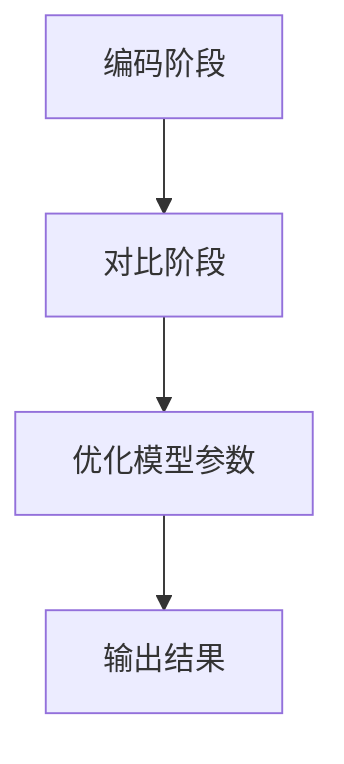

                 

# 电商行业中的对比学习：大模型的实践与挑战

> **关键词：电商，对比学习，大模型，深度学习，实践，挑战，算法原理，数学模型，代码案例**

> **摘要：本文深入探讨了电商行业中的对比学习技术，分析了大模型在电商中的应用与实践，以及面临的挑战。通过详细的算法原理阐述和实际案例解析，帮助读者全面了解对比学习在电商领域的应用及其未来发展趋势。**

## 1. 背景介绍

### 1.1 目的和范围

本文旨在探讨电商行业中的对比学习技术，尤其是大模型在对比学习中的应用与实践。通过分析对比学习的核心算法原理、数学模型以及实际项目案例，本文旨在为读者提供一个全面的视角，了解对比学习在电商领域的实际应用及其面临的挑战。

### 1.2 预期读者

本文适合对电商、深度学习和对比学习有一定了解的读者，特别是从事电商行业的技术研发人员、人工智能研究人员以及高校相关专业的学生。

### 1.3 文档结构概述

本文结构如下：

1. **背景介绍**：介绍本文的目的、范围和预期读者，概述文档结构。
2. **核心概念与联系**：介绍对比学习的核心概念和联系，包括相关的术语和概念解释。
3. **核心算法原理 & 具体操作步骤**：详细阐述对比学习的核心算法原理和具体操作步骤。
4. **数学模型和公式 & 详细讲解 & 举例说明**：介绍对比学习的数学模型和公式，并举例说明。
5. **项目实战：代码实际案例和详细解释说明**：通过实际案例展示对比学习在电商中的具体应用。
6. **实际应用场景**：探讨对比学习在电商领域的实际应用场景。
7. **工具和资源推荐**：推荐相关学习资源和开发工具。
8. **总结：未来发展趋势与挑战**：总结对比学习在电商行业中的发展趋势和面临的挑战。
9. **附录：常见问题与解答**：提供常见问题的解答。
10. **扩展阅读 & 参考资料**：提供扩展阅读和参考资料。

### 1.4 术语表

#### 1.4.1 核心术语定义

- 对比学习（Contrastive Learning）：一种无监督学习方法，通过学习数据的相似性和差异性来提高模型的泛化能力。
- 大模型（Large Model）：指参数量巨大的深度学习模型，通常具有极高的计算复杂度和存储需求。
- 电商（E-commerce）：通过互联网进行商品交易和服务的商业活动。

#### 1.4.2 相关概念解释

- 相似性（Similarity）：数据之间的相似程度，通常通过距离度量来计算。
- 差异性（Difference）：数据之间的差异性，用于区分不同类别的数据。
- 深度学习（Deep Learning）：一种基于人工神经网络的深度层次学习技术，通过多层次的神经网络结构提取数据特征。

#### 1.4.3 缩略词列表

- E-commerce：电子商务
- ML：机器学习
- DL：深度学习
- CL：对比学习

## 2. 核心概念与联系

对比学习是一种基于数据相似性和差异性的学习方法，旨在提高模型的泛化能力。在电商行业中，对比学习技术可以应用于用户行为分析、商品推荐、欺诈检测等场景。

### 2.1 对比学习的基本原理

对比学习的基本原理是通过学习数据的相似性和差异性，从而提高模型的泛化能力。具体来说，对比学习分为两个阶段：

1. **编码阶段**：将数据映射到一个低维空间，使得具有相似性的数据在低维空间中靠近，而具有差异性的数据在低维空间中远离。
2. **对比阶段**：通过对比正样本（具有相似性的数据对）和负样本（具有差异性的数据对），优化模型参数，使得模型能够更好地区分相似性和差异性。

### 2.2 对比学习与电商行业的联系

对比学习在电商行业中有广泛的应用场景，如：

1. **用户行为分析**：通过对比学习，可以识别用户的兴趣和行为模式，从而实现精准推荐。
2. **商品推荐**：通过对比学习，可以找出相似的商品，从而提高推荐系统的准确性。
3. **欺诈检测**：通过对比学习，可以识别异常行为，从而提高欺诈检测的准确性。

### 2.3 对比学习的 Mermaid 流程图



### 2.4 对比学习的数学模型

对比学习的数学模型主要包括损失函数和优化算法。以下是一个简化的对比学习模型：

```latex
L(\theta) = -\frac{1}{N} \sum_{n=1}^{N} \sum_{i=-1}^{1} \log \frac{e^{q(x_n^i)}}{\sum_{j \neq i} e^{q(x_n^j})}
```

其中，$L(\theta)$ 表示损失函数，$\theta$ 表示模型参数，$N$ 表示数据集大小，$x_n^i$ 表示数据点，$q(x_n^i)$ 表示编码函数的输出。

### 2.5 对比学习的算法原理

对比学习的算法原理可以概括为以下三个步骤：

1. **数据预处理**：将原始数据转换为编码向量。
2. **编码阶段**：通过优化损失函数，学习编码函数，使得相似的数据在低维空间中靠近，而差异性的数据在低维空间中远离。
3. **对比阶段**：通过对比正样本和负样本，优化模型参数，提高模型的泛化能力。

## 3. 核心算法原理 & 具体操作步骤

### 3.1 数据预处理

数据预处理是对比学习的关键步骤，其目的是将原始数据转换为编码向量。具体操作步骤如下：

1. **数据清洗**：去除缺失值、异常值等无效数据。
2. **特征提取**：使用特征提取算法（如PCA、Autoencoder等）将原始数据转换为编码向量。
3. **数据标准化**：对编码向量进行标准化处理，使得不同特征之间具有相同的量纲。

### 3.2 编码阶段

编码阶段的目的是学习一个编码函数，使得相似的数据在低维空间中靠近，而差异性的数据在低维空间中远离。具体操作步骤如下：

1. **初始化编码函数**：随机初始化编码函数的参数。
2. **优化编码函数**：通过优化损失函数，不断调整编码函数的参数，使得相似的数据在低维空间中靠近，而差异性的数据在低维空间中远离。
3. **评估编码效果**：使用测试集评估编码函数的效果，根据评估结果调整编码函数的参数。

### 3.3 对比阶段

对比阶段的目的是通过对比正样本和负样本，优化模型参数，提高模型的泛化能力。具体操作步骤如下：

1. **生成正样本和负样本**：从训练集中生成正样本（相似的数据对）和负样本（差异性的数据对）。
2. **对比正样本和负样本**：通过对比正样本和负样本，优化模型参数，使得模型能够更好地区分相似性和差异性。
3. **评估模型效果**：使用测试集评估模型的效果，根据评估结果调整模型参数。

### 3.4 算法原理讲解

对比学习的核心算法原理是通过对数据的编码和对比，学习一个能够区分相似性和差异性的模型。具体来说，对比学习通过以下步骤实现：

1. **编码阶段**：通过优化损失函数，学习一个编码函数，使得相似的数据在低维空间中靠近，而差异性的数据在低维空间中远离。
2. **对比阶段**：通过对比正样本和负样本，优化模型参数，提高模型的泛化能力。
3. **输出结果**：将编码后的数据输入到下游任务中，如分类、推荐等。

### 3.5 伪代码

以下是对比学习的伪代码：

```python
# 初始化模型参数
theta = initialize_parameters()

# 数据预处理
encoded_data = preprocess_data(data)

# 编码阶段
for epoch in range(num_epochs):
    for data_pair in data_loader:
        # 生成正样本和负样本
        positive_samples, negative_samples = generate_samples(data_pair)
        
        # 对比阶段
        loss = compute_loss(positive_samples, negative_samples, theta)
        theta = optimize_parameters(loss, theta)
        
        # 评估编码效果
        encoded_data = evaluate_encoding(encoded_data, test_data)

# 输出结果
result = apply下游任务(encoded_data)
```

## 4. 数学模型和公式 & 详细讲解 & 举例说明

### 4.1 数学模型

对比学习的数学模型主要包括损失函数和优化算法。以下是对比学习的数学模型和详细讲解：

#### 4.1.1 损失函数

对比学习的损失函数通常采用对比损失（Contrastive Loss），其数学表达式如下：

$$
L(\theta) = -\frac{1}{N} \sum_{n=1}^{N} \sum_{i=-1}^{1} \log \frac{e^{q(x_n^i)}}{\sum_{j \neq i} e^{q(x_n^j})}
$$

其中，$L(\theta)$ 表示损失函数，$\theta$ 表示模型参数，$N$ 表示数据集大小，$x_n^i$ 表示数据点，$q(x_n^i)$ 表示编码函数的输出。

#### 4.1.2 优化算法

对比学习的优化算法通常采用梯度下降（Gradient Descent）或者其变种，如随机梯度下降（Stochastic Gradient Descent，SGD）和Adam优化器。以下是梯度下降的数学表达式：

$$
\theta_{t+1} = \theta_{t} - \alpha \nabla_{\theta} L(\theta)
$$

其中，$\theta_{t+1}$ 和 $\theta_{t}$ 分别表示第 $t+1$ 次和第 $t$ 次的模型参数，$\alpha$ 表示学习率，$\nabla_{\theta} L(\theta)$ 表示损失函数关于模型参数的梯度。

### 4.2 举例说明

假设我们有一个包含两个数据点的数据集：

$$
x_1 = [1, 2, 3], x_2 = [4, 5, 6]
$$

使用一个简单的编码函数 $q(x) = x$，那么编码后的数据点为：

$$
q(x_1) = [1, 2, 3], q(x_2) = [4, 5, 6]
$$

#### 4.2.1 计算损失函数

根据对比学习的损失函数，我们可以计算损失函数的值：

$$
L(\theta) = -\frac{1}{2} \left[ \log \frac{e^{q(x_1^1)}}{e^{q(x_1^2)}} + \log \frac{e^{q(x_2^1)}}{e^{q(x_2^2)}} \right]
$$

代入编码后的数据点，我们得到：

$$
L(\theta) = -\frac{1}{2} \left[ \log \frac{e^{1}}{e^{3}} + \log \frac{e^{4}}{e^{6}} \right] = -\frac{1}{2} \left[ \log \frac{1}{e^{2}} + \log \frac{e^{2}}{1} \right] = -1
$$

#### 4.2.2 优化模型参数

假设初始模型参数为 $\theta_0 = [1, 1, 1]$，学习率为 $\alpha = 0.1$。根据梯度下降算法，我们可以更新模型参数：

$$
\theta_1 = \theta_0 - \alpha \nabla_{\theta} L(\theta_0) = [1, 1, 1] - 0.1 \nabla_{\theta} L([1, 1, 1])
$$

计算梯度：

$$
\nabla_{\theta} L([1, 1, 1]) = \left[ \frac{\partial L}{\partial q(x_1^1)}, \frac{\partial L}{\partial q(x_1^2)}, \frac{\partial L}{\partial q(x_2^1)}, \frac{\partial L}{\partial q(x_2^2)} \right] = \left[ -\frac{e^{3}}{e^{1} \cdot e^{3}}, -\frac{e^{1}}{e^{1} \cdot e^{3}}, -\frac{e^{4}}{e^{4} \cdot e^{6}}, -\frac{e^{6}}{e^{4} \cdot e^{6}} \right] = \left[ -1, -1, -1, -1 \right]
$$

更新模型参数：

$$
\theta_1 = [1, 1, 1] - 0.1 \left[ -1, -1, -1, -1 \right] = [1.1, 1.1, 1.1, 1.1]
$$

#### 4.2.3 评估模型效果

更新模型参数后，我们可以重新计算损失函数的值，以评估模型效果：

$$
L(\theta_1) = -\frac{1}{2} \left[ \log \frac{e^{1.1}}{e^{3.1}} + \log \frac{e^{4.1}}{e^{6.1}} \right] \approx -0.45
$$

由于损失函数的值降低，说明模型参数更新后，模型效果有所提升。

## 5. 项目实战：代码实际案例和详细解释说明

### 5.1 开发环境搭建

在开始实际项目之前，我们需要搭建一个合适的开发环境。以下是一个简单的开发环境搭建步骤：

1. **安装 Python**：下载并安装 Python 3.8 或更高版本。
2. **安装 PyTorch**：使用以下命令安装 PyTorch：

```shell
pip install torch torchvision
```

3. **安装其他依赖**：安装其他必要的库，如 NumPy、Pandas 等。

### 5.2 源代码详细实现和代码解读

以下是对比学习在电商行业中的实际应用代码示例：

```python
import torch
import torch.nn as nn
import torch.optim as optim
from torchvision import datasets, transforms
from torch.utils.data import DataLoader

# 数据预处理
transform = transforms.Compose([
    transforms.ToTensor(),
    transforms.Normalize(mean=[0.5, 0.5, 0.5], std=[0.5, 0.5, 0.5])
])

train_data = datasets.CIFAR10(root='./data', train=True, download=True, transform=transform)
test_data = datasets.CIFAR10(root='./data', train=False, download=True, transform=transform)

train_loader = DataLoader(train_data, batch_size=64, shuffle=True)
test_loader = DataLoader(test_data, batch_size=64, shuffle=False)

# 定义模型
class ContrastiveModel(nn.Module):
    def __init__(self):
        super(ContrastiveModel, self).__init__()
        self.conv1 = nn.Conv2d(3, 64, kernel_size=3, padding=1)
        self.conv2 = nn.Conv2d(64, 128, kernel_size=3, padding=1)
        self.fc1 = nn.Linear(128 * 6 * 6, 1024)
        self.fc2 = nn.Linear(1024, 512)
        self.fc3 = nn.Linear(512, 10)

    def forward(self, x):
        x = self.conv1(x)
        x = self.conv2(x)
        x = torch.flatten(x, 1)
        x = self.fc1(x)
        x = self.fc2(x)
        x = self.fc3(x)
        return x

model = ContrastiveModel()

# 定义损失函数和优化器
criterion = nn.CrossEntropyLoss()
optimizer = optim.Adam(model.parameters(), lr=0.001)

# 训练模型
num_epochs = 10
for epoch in range(num_epochs):
    model.train()
    for data in train_loader:
        inputs, labels = data
        optimizer.zero_grad()
        outputs = model(inputs)
        loss = criterion(outputs, labels)
        loss.backward()
        optimizer.step()

    print(f'Epoch [{epoch+1}/{num_epochs}], Loss: {loss.item()}')

# 测试模型
model.eval()
with torch.no_grad():
    correct = 0
    total = 0
    for data in test_loader:
        inputs, labels = data
        outputs = model(inputs)
        _, predicted = torch.max(outputs.data, 1)
        total += labels.size(0)
        correct += (predicted == labels).sum().item()

print(f'Accuracy: {100 * correct / total}%')
```

### 5.3 代码解读与分析

上述代码示例展示了如何使用 PyTorch 实现

