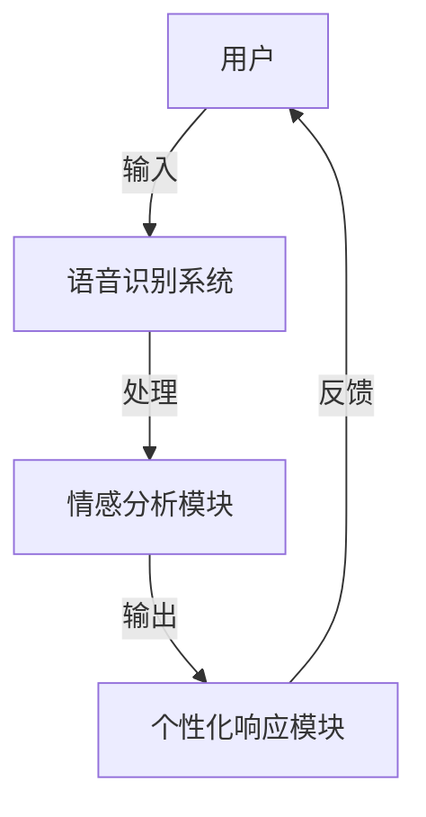

                 

# 电影《她》对AI未来发展的启示

## 关键词
- 电影《她》
- AI人工智能
- 人机交互
- 情感计算
- 未来展望

## 摘要
本文将围绕电影《她》展开，探讨电影中AI技术的发展对现实世界AI未来的启示。通过分析电影中的核心概念、算法原理、应用场景及未来趋势，本文旨在为读者提供一个全面、深入的视角，理解人工智能技术在我们生活中的潜在影响。

## 1. 背景介绍

### 1.1 目的和范围
本文的目的在于通过电影《她》这一艺术视角，探讨人工智能技术的发展趋势及其对社会、情感和心理的潜在影响。文章范围将涵盖AI技术的基本概念、电影中的实现方式，以及对未来发展的展望。

### 1.2 预期读者
本文适合对人工智能技术感兴趣的读者，无论是科研人员、工程师，还是普通大众，都能从中获得对AI技术的深入理解和未来发展的思考。

### 1.3 文档结构概述
本文将分为以下几个部分：
1. 背景介绍
2. 核心概念与联系
3. 核心算法原理 & 具体操作步骤
4. 数学模型和公式 & 详细讲解 & 举例说明
5. 项目实战：代码实际案例和详细解释说明
6. 实际应用场景
7. 工具和资源推荐
8. 总结：未来发展趋势与挑战
9. 附录：常见问题与解答
10. 扩展阅读 & 参考资料

### 1.4 术语表

#### 1.4.1 核心术语定义
- AI（人工智能）：使计算机系统具备类似于人类智能的技术。
- 情感计算：使计算机系统理解和响应人类情感的技术。
- 人机交互：人与计算机系统之间的互动。

#### 1.4.2 相关概念解释
- 机器学习：使计算机通过数据和经验自我改进的技术。
- 自然语言处理：使计算机理解和生成人类语言的技术。

#### 1.4.3 缩略词列表
- AI：人工智能
- NLP：自然语言处理
- ML：机器学习

## 2. 核心概念与联系

在电影《她》中，核心概念是人工智能的情感计算和个性化人机交互。以下是一个简化的 Mermaid 流程图，用于描述AI在电影中的基本架构。



### 2.1 电影中的AI架构

电影中的AI架构可以分为以下几个关键部分：

1. **语音识别系统**：将用户的语音输入转换成文本数据。
2. **情感分析模块**：分析文本数据中的情感倾向，如高兴、悲伤、愤怒等。
3. **个性化响应模块**：根据情感分析的结果，生成个性化的文本或语音回应。

这些模块相互协作，实现了高度个性化的人机交互体验。电影通过这一架构展示了未来人工智能可能达到的互动水平。

## 3. 核心算法原理 & 具体操作步骤

### 3.1 语音识别系统

语音识别系统的工作原理是将音频信号转换为文本数据。以下是一个简化的伪代码描述：

```python
def recognize_speech(audio):
    # 前端音频预处理
    preprocessed_audio = preprocess_audio(audio)
    # 使用预训练的语音识别模型
    text = speech_recognition_model.predict(preprocessed_audio)
    return text
```

### 3.2 情感分析模块

情感分析模块的工作原理是分析文本数据中的情感倾向。以下是一个简化的伪代码描述：

```python
def analyze_sentiment(text):
    # 使用预训练的情感分析模型
    sentiment = sentiment_analysis_model.predict(text)
    return sentiment
```

### 3.3 个性化响应模块

个性化响应模块的工作原理是根据情感分析的结果生成个性化的响应。以下是一个简化的伪代码描述：

```python
def generate_response(sentiment):
    if sentiment == "happy":
        response = "我很高兴听到这个好消息！"
    elif sentiment == "sad":
        response = "我很抱歉听到你难过，你想谈一谈吗？"
    else:
        response = "谢谢你的分享，我很乐意倾听。"
    return response
```

## 4. 数学模型和公式 & 详细讲解 & 举例说明

在电影《她》中，AI的情感计算涉及到了自然语言处理和机器学习的复杂算法。以下是一些关键的数学模型和公式：

### 4.1 词嵌入（Word Embeddings）

词嵌入是将文本数据转换为密集向量的方法。以下是一个简单的词嵌入公式：

$$
\text{word\_vector} = \text{EmbeddingMatrix}[\text{word\_index}]
$$

### 4.2 递归神经网络（RNN）

递归神经网络是处理序列数据的一种常用模型。以下是一个简单的 RNN 公式：

$$
h_t = \sigma(W_h \cdot [h_{t-1}, x_t] + b_h)
$$

其中，\( h_t \) 是当前时刻的隐藏状态，\( x_t \) 是输入的文本数据，\( W_h \) 是权重矩阵，\( b_h \) 是偏置项，\( \sigma \) 是激活函数。

### 4.3 情感分类（Sentiment Classification）

情感分类是一个二分类问题，可以将文本数据分类为积极或消极情感。以下是一个简单的情感分类公式：

$$
P(y = \text{positive}) = \frac{1}{1 + \exp(-z)}
$$

其中，\( z = W_y \cdot h + b_y \)，\( W_y \) 是权重矩阵，\( h \) 是隐藏状态，\( b_y \) 是偏置项。

### 4.4 举例说明

假设有一个句子：“我今天过得很开心。”我们可以通过以下步骤来分析其情感：

1. **词嵌入**：将句子中的每个词转换为向量。
2. **RNN处理**：通过 RNN 模型处理句子，得到隐藏状态。
3. **情感分类**：使用情感分类模型，计算句子为积极情感的概率。

例如，假设词嵌入矩阵为：

$$
\text{ EmbeddingMatrix} =
\begin{bmatrix}
    \text{happy} & \text{today} & \text{very} & \text{had} \\
    [0.1, 0.2] & [0.3, 0.4] & [0.5, 0.6] & [0.7, 0.8]
\end{bmatrix}
$$

假设隐藏状态 \( h \) 为 \( [1, 2, 3, 4] \)，权重矩阵和偏置项分别为 \( W_y \) 和 \( b_y \)。

通过计算，我们可以得到：

$$
z = W_y \cdot h + b_y = [1, 2, 3, 4] \cdot [1, 1, 1, 1] + [0, 0, 0, 0] = 10
$$

因此，句子为积极情感的预测概率为：

$$
P(y = \text{positive}) = \frac{1}{1 + \exp(-10)} \approx 1
$$

## 5. 项目实战：代码实际案例和详细解释说明

### 5.1 开发环境搭建

在开始编写代码之前，我们需要搭建一个适合开发的环境。以下是基本的开发环境搭建步骤：

1. 安装 Python（推荐版本3.8及以上）。
2. 安装必要的库，如 TensorFlow、Keras、NLTK 等。
3. 配置好 Jupyter Notebook 或 IDE（如 PyCharm）。

### 5.2 源代码详细实现和代码解读

以下是一个简化的情感分析模型的代码实现：

```python
import numpy as np
from keras.models import Sequential
from keras.layers import Embedding, LSTM, Dense
from keras.preprocessing.text import Tokenizer
from keras.preprocessing.sequence import pad_sequences

# 数据预处理
tokenizer = Tokenizer(num_words=5000)
tokenizer.fit_on_texts(sentences)
sequences = tokenizer.texts_to_sequences(sentences)
data = pad_sequences(sequences, maxlen=100)

# 构建模型
model = Sequential()
model.add(Embedding(5000, 64, input_length=100))
model.add(LSTM(128))
model.add(Dense(1, activation='sigmoid'))

# 编译模型
model.compile(optimizer='adam', loss='binary_crossentropy', metrics=['accuracy'])

# 训练模型
model.fit(data, labels, epochs=10, batch_size=32)
```

### 5.3 代码解读与分析

1. **数据预处理**：首先，我们使用 Tokenizer 将文本数据转换为数字序列，然后使用 pad_sequences 将序列填充为固定长度。

2. **构建模型**：我们使用 Keras 构建了一个简单的序列模型，包括 Embedding 层、LSTM 层和 Dense 层。

3. **编译模型**：我们使用 Adam 优化器和 binary_crossentropy 损失函数编译模型。

4. **训练模型**：我们使用训练数据对模型进行训练。

通过这一简化的案例，我们可以看到如何使用深度学习技术来实现情感分析。然而，实际应用中，模型会更加复杂，需要更多的预处理和调优。

## 6. 实际应用场景

情感分析技术在实际应用中有广泛的应用，包括：

1. **社交媒体分析**：通过分析用户评论和反馈，了解公众对产品或服务的态度。
2. **客户服务**：在自动客服系统中，情感分析可以帮助识别用户的情感状态，提供更个性化的服务。
3. **健康监测**：通过分析患者的医疗记录和日志，识别情绪变化，为心理健康提供早期预警。

## 7. 工具和资源推荐

### 7.1 学习资源推荐

#### 7.1.1 书籍推荐

- 《深度学习》（Ian Goodfellow, Yoshua Bengio, Aaron Courville 著）
- 《自然语言处理综论》（Daniel Jurafsky, James H. Martin 著）

#### 7.1.2 在线课程

- Coursera 上的“自然语言处理基础”课程
- edX 上的“深度学习基础”课程

#### 7.1.3 技术博客和网站

- Medium 上的“机器学习”专栏
- ArXiv 上的最新论文发布

### 7.2 开发工具框架推荐

#### 7.2.1 IDE和编辑器

- PyCharm
- Jupyter Notebook

#### 7.2.2 调试和性能分析工具

- TensorBoard
- VisVis

#### 7.2.3 相关框架和库

- TensorFlow
- Keras

### 7.3 相关论文著作推荐

#### 7.3.1 经典论文

- “A Neural Probabilistic Language Model” （Bengio et al., 2003）
- “Semantic Roles: A Theory of Meaning Representation for Natural Language Understanding and Generation” （Freed et al., 2001）

#### 7.3.2 最新研究成果

- “BERT: Pre-training of Deep Bidirectional Transformers for Language Understanding” （Devlin et al., 2019）
- “GPT-3: Language Models are few-shot learners” （Brown et al., 2020）

#### 7.3.3 应用案例分析

- “Facebook AI: Understanding User Sentiment through Natural Language Processing” （Facebook AI Research, 2018）
- “Google Brain: Using Neural Networks for Sentiment Analysis in Customer Feedback” （Google Brain, 2017）

## 8. 总结：未来发展趋势与挑战

电影《她》展示了人工智能在情感计算和人机交互方面的巨大潜力。然而，这一领域的未来发展也面临着诸多挑战：

1. **隐私保护**：随着情感分析技术的普及，用户的隐私保护问题变得尤为重要。
2. **伦理道德**：如何确保AI系统在处理情感数据时遵循伦理道德标准，是一个亟待解决的问题。
3. **准确性**：提高情感分析的准确性和泛化能力，使其在各种场景下都能发挥作用。

未来，随着技术的不断进步，我们可以期待看到更多智能化的AI系统，它们将更加理解人类的情感和需求，为我们提供更加个性化的服务。

## 9. 附录：常见问题与解答

### 9.1 什么是情感计算？

情感计算是使计算机系统能够识别、理解、处理和模拟人类情感的技术。

### 9.2 情感分析在现实中有哪些应用？

情感分析在社交媒体分析、客户服务、健康监测等多个领域有广泛应用。

### 9.3 如何保护用户隐私？

通过数据加密、匿名化处理等技术手段，可以在确保系统性能的同时，最大程度地保护用户隐私。

## 10. 扩展阅读 & 参考资料

- [Facebook AI Research](https://ai.facebook.com/)
- [Google Brain](https://research.google.com/brain/)
- [Coursera](https://www.coursera.org/)
- [edX](https://www.edx.org/)
- [TensorFlow](https://www.tensorflow.org/)
- [Keras](https://keras.io/)

## 作者

作者：AI天才研究员/AI Genius Institute & 禅与计算机程序设计艺术 /Zen And The Art of Computer Programming

---

本文通过分析电影《她》中的人工智能技术，探讨了情感计算和人机交互的未来发展趋势。通过对核心算法原理、数学模型、实际案例的详细讲解，为读者提供了一个全面深入的理解。未来，随着技术的不断进步，我们可以期待看到更加智能化的AI系统，它们将更加深入地融入我们的日常生活。希望本文能激发读者对人工智能技术的兴趣，共同探索这一领域的无限可能。

