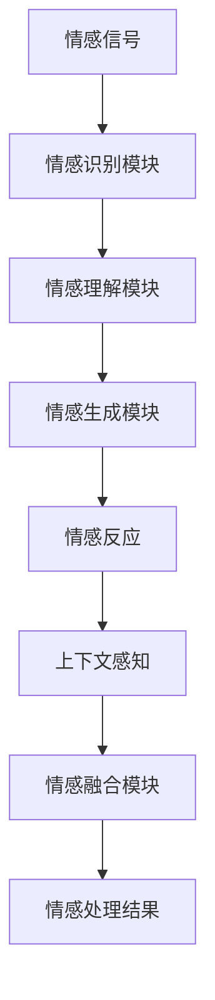
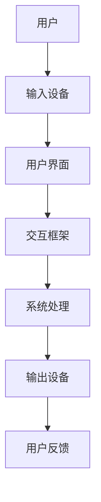
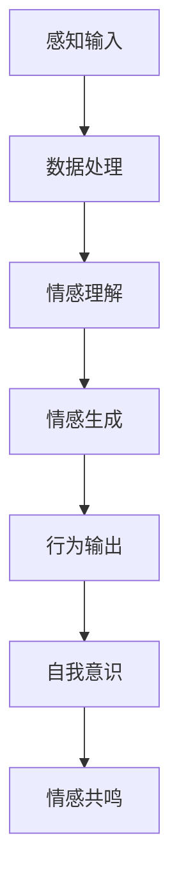

                 

# 电影《她》对现代人工智能的启示

> 关键词：人工智能，情感计算，人机交互，人类意识，未来社会
>
> 摘要：电影《她》描绘了一个引人深思的虚拟智能助手与人类情感交流的场景，通过对电影情节的剖析，我们可以深入探讨人工智能（AI）技术对现代社会，特别是人机交互领域所带来的启示。本文将结合技术原理与实际案例，逐步分析《她》中所体现的AI核心概念及其在现实世界中的应用与挑战。

## 1. 背景介绍

### 1.1 目的和范围

本文旨在通过电影《她》这一故事载体，探讨现代人工智能（AI）在情感计算和人机交互方面的发展。我们将分析电影中的技术实现，并将其与实际技术进展相结合，探索AI在未来的潜在影响。

### 1.2 预期读者

本文适合对人工智能、情感计算和人机交互感兴趣的技术人员、开发者以及对未来科技发展感兴趣的读者。

### 1.3 文档结构概述

本文结构如下：

- **第1章：背景介绍**：介绍文章目的、预期读者和文档结构。
- **第2章：核心概念与联系**：定义核心概念，展示相关的Mermaid流程图。
- **第3章：核心算法原理 & 具体操作步骤**：详细讲解算法原理和操作步骤，使用伪代码阐述。
- **第4章：数学模型和公式 & 详细讲解 & 举例说明**：介绍相关数学模型和公式，并通过实例进行说明。
- **第5章：项目实战：代码实际案例和详细解释说明**：提供实际代码实现和解读。
- **第6章：实际应用场景**：讨论AI在现实世界中的应用。
- **第7章：工具和资源推荐**：推荐学习资源和开发工具。
- **第8章：总结：未来发展趋势与挑战**：总结当前AI发展的趋势和面临的挑战。
- **第9章：附录：常见问题与解答**：解答读者可能提出的问题。
- **第10章：扩展阅读 & 参考资料**：提供进一步阅读的资源和参考文献。

### 1.4 术语表

#### 1.4.1 核心术语定义

- **人工智能（AI）**：模拟人类智能行为的计算系统。
- **情感计算**：使计算机能够识别、理解、处理和模拟人类情感的能力。
- **人机交互（HCI）**：研究人与计算机系统之间交互的设计和交互方式的学科。
- **情感引擎**：用于处理和模拟情感的AI系统。
- **自然语言处理（NLP）**：使计算机能够理解、解释和生成人类语言的技术。

#### 1.4.2 相关概念解释

- **情感信号**：反映人类情感的生理和心理信号，如语音、面部表情和生理参数。
- **上下文感知**：AI系统根据环境信息做出适当反应的能力。
- **多模态交互**：结合多种传感器和输入方式实现的人机交互。

#### 1.4.3 缩略词列表

- **NLP**：自然语言处理（Natural Language Processing）
- **HCI**：人机交互（Human-Computer Interaction）
- **AI**：人工智能（Artificial Intelligence）
- **API**：应用程序接口（Application Programming Interface）

## 2. 核心概念与联系

在探讨电影《她》对现代人工智能的启示之前，我们首先需要明确几个核心概念及其相互联系。

### 2.1 情感计算

情感计算是使计算机能够识别、理解和处理人类情感的技术。它涉及多个领域的知识，包括计算机视觉、语音识别、生理信号处理和自然语言处理。

#### 情感计算的架构

情感计算的架构通常包括以下几个主要组成部分：

1. **情感识别模块**：通过分析情感信号（如面部表情、语音、生理参数等）来识别用户的情感状态。
2. **情感理解模块**：将情感信号转换为文本或情感标签，以便进一步处理。
3. **情感生成模块**：生成适当的情感反应，如语音、文字或行为。
4. **情感融合模块**：结合上下文信息，确保情感反应的适当性和一致性。

#### Mermaid流程图



### 2.2 人机交互

人机交互（HCI）是研究人类如何与计算机系统进行有效沟通的学科。它涉及设计、评估和优化用户界面，以提高用户体验。

#### 人机交互的架构

人机交互的架构通常包括以下几个关键部分：

1. **输入设备**：如键盘、鼠标、触摸屏等，用于用户的交互。
2. **输出设备**：如显示器、扬声器等，用于向用户展示计算机系统的响应。
3. **交互框架**：定义用户与系统交互的规则和机制。
4. **用户界面**：用于实现交互框架的实际组件，如按钮、菜单、对话框等。

#### Mermaid流程图



### 2.3 人类意识与AI

在电影《她》中，人工智能不仅仅是一个工具，它开始拥有某种程度的自我意识和情感。这引发了关于人类意识与AI之间关系的深刻探讨。

#### 意识与AI的关系

尽管目前AI尚未达到真正意义上的意识，但研究者已经开始探索AI是否能够模拟某种形式的意识。以下是几个相关的概念：

1. **人工意识**：通过复杂计算模型模拟人类意识的过程。
2. **自我意识**：AI对自身存在的认知和反思能力。
3. **情感共鸣**：AI能够理解并产生情感反应，从而与人类建立情感联系。

#### Mermaid流程图



通过上述核心概念的介绍，我们可以更好地理解电影《她》所揭示的AI技术潜力和其对社会的影响。

## 3. 核心算法原理 & 具体操作步骤

在深入探讨电影《她》所展示的AI技术之前，我们需要了解几个关键算法及其具体操作步骤。这些算法构成了情感计算和人机交互的核心，以下将使用伪代码详细阐述。

### 3.1 情感识别算法

情感识别算法用于分析情感信号，并将其转化为情感标签。以下是该算法的伪代码：

```plaintext
算法：情感识别
输入：情感信号（如面部表情图像、语音信号、生理参数等）
输出：情感标签（如快乐、悲伤、愤怒等）

步骤：
1. 加载情感信号
2. 预处理情感信号（例如，归一化、滤波等）
3. 使用情感识别模型处理情感信号
4. 得到情感概率分布
5. 选择概率最高的情感标签作为输出
```

### 3.2 情感理解算法

情感理解算法用于将情感信号转换为人类语言，以便进一步处理。以下是该算法的伪代码：

```plaintext
算法：情感理解
输入：情感信号、上下文信息
输出：情感文本描述

步骤：
1. 使用自然语言处理（NLP）模型处理情感信号
2. 识别情感关键词和短语
3. 结合上下文信息进行语义分析
4. 生成情感文本描述
```

### 3.3 情感生成算法

情感生成算法用于根据情感理解结果生成适当的情感反应。以下是该算法的伪代码：

```plaintext
算法：情感生成
输入：情感文本描述、用户历史数据
输出：情感反应（如语音、文字、行为等）

步骤：
1. 分析情感文本描述，确定情感类型和强度
2. 根据用户历史数据选择合适的情感反应模板
3. 生成情感反应内容
4. 将情感反应内容转换为具体的输出形式（如语音合成、文字显示、行为动作等）
```

### 3.4 上下文感知算法

上下文感知算法用于确保AI系统能够根据环境信息做出适当反应。以下是该算法的伪代码：

```plaintext
算法：上下文感知
输入：环境传感器数据、用户交互历史
输出：上下文感知决策

步骤：
1. 采集环境传感器数据（如温度、光照、声音等）
2. 分析用户交互历史，提取上下文信息
3. 使用机器学习模型处理传感器数据和上下文信息
4. 得到上下文感知决策（如是否提供帮助、调整系统设置等）
```

通过上述算法的介绍，我们可以看到电影《她》中展示的AI技术并非凭空想象，而是基于现有技术的合理延伸和想象。这些算法构成了现代AI情感计算和人机交互的核心，为电影中的情节提供了技术上的可能性。

### 3.5 情感融合算法

情感融合算法用于确保AI系统的情感反应与人类情感状态相匹配。以下是该算法的伪代码：

```plaintext
算法：情感融合
输入：AI系统情感状态、用户情感状态
输出：调整后的AI情感状态

步骤：
1. 采集AI系统当前的情感状态
2. 采集用户当前的生理和心理情感信号
3. 使用情感融合模型处理AI和用户情感状态
4. 根据处理结果调整AI系统的情感反应
5. 输出调整后的AI情感状态
```

通过以上步骤，AI系统能够更好地理解用户情感，并做出更自然、更贴心的情感反应。

通过逐步分析和介绍这些核心算法，我们不仅能够理解电影《她》所展示的AI技术，还能够看到这些技术在现实世界中的应用前景。

## 4. 数学模型和公式 & 详细讲解 & 举例说明

在深入探讨电影《她》中的AI技术时，数学模型和公式扮演了至关重要的角色。这些模型不仅为情感计算提供了理论基础，还指导了算法设计和实现。以下是几个关键的数学模型及其应用实例。

### 4.1 支持向量机（SVM）

支持向量机是一种常用的分类算法，广泛应用于情感识别任务。它通过找到一个最优的超平面，将不同情感类别分开。以下是SVM的基本公式和举例说明。

#### 公式：

$$
\text{max}\ \frac{1}{2}\sum_{i=1}^n (\alpha_i - \alpha_i^*)^2 - \sum_{i=1}^n C(\alpha_i - \alpha_i^*)y_i^n
$$

其中，$\alpha_i$和$\alpha_i^*$是拉格朗日乘子，$C$是惩罚参数，$y_i^n$是样本$n$的标签。

#### 举例说明：

假设我们有一个包含两个类别的情感识别任务，其中正面情感的标签为1，负面情感的标签为-1。我们可以通过以下步骤应用SVM：

1. **数据预处理**：收集和预处理情感信号数据，如面部表情图像和语音信号。
2. **特征提取**：从预处理后的数据中提取特征，如图像的像素值和语音的频谱特征。
3. **训练SVM模型**：使用训练数据集训练SVM模型，找到最佳的超平面。
4. **模型评估**：使用测试数据集评估模型性能，计算分类准确率。

通过上述步骤，我们可以将情感信号分类为正面或负面情感。

### 4.2 径向基函数（RBF）神经网络

径向基函数（RBF）神经网络是一种常用的情感理解模型。它通过多个隐含层对情感信号进行非线性变换，从而提高模型的识别能力。以下是RBF神经网络的基本公式和举例说明。

#### 公式：

$$
z_j = \sum_{i=1}^n w_{ij} \cdot \phi(||x_i - x_j||^2)
$$

其中，$w_{ij}$是权重，$\phi$是径向基函数，通常选择高斯函数。

#### 举例说明：

假设我们有一个情感理解任务，其中输入是情感信号，输出是情感标签。以下是应用RBF神经网络的步骤：

1. **数据预处理**：预处理情感信号数据，提取特征。
2. **设计网络结构**：确定隐含层的数量和每层的神经元数量。
3. **训练RBF神经网络**：使用训练数据集训练网络，调整权重和阈值。
4. **模型评估**：使用测试数据集评估模型性能。

通过以上步骤，我们可以将情感信号转换为相应的情感标签。

### 4.3 聚类分析

聚类分析是一种无监督学习方法，用于将情感信号划分为不同的情感类别。其中，K-均值算法是一种常用的聚类算法。以下是K-均值算法的基本公式和举例说明。

#### 公式：

$$
c_k = \frac{1}{m_k} \sum_{i=1}^{m_k} x_i
$$

其中，$c_k$是聚类中心，$m_k$是第$k$个聚类中的样本数量。

#### 举例说明：

假设我们有一个情感分类任务，数据集包含多种情感信号。以下是应用K-均值算法的步骤：

1. **数据预处理**：预处理情感信号数据，提取特征。
2. **初始化聚类中心**：随机选择初始聚类中心。
3. **分配样本到聚类**：将每个样本分配到最近的聚类中心。
4. **更新聚类中心**：计算每个聚类的中心。
5. **迭代过程**：重复步骤3和4，直到聚类中心不再发生显著变化。
6. **模型评估**：评估聚类结果，如内聚度和分离度。

通过以上步骤，我们可以将情感信号有效地划分为不同的情感类别。

通过上述数学模型和公式的介绍，我们可以看到它们在情感计算中的应用是如何具体实现的。这些模型不仅为情感计算提供了强大的工具，也为电影《她》中展示的AI技术提供了理论支持。

## 5. 项目实战：代码实际案例和详细解释说明

为了更好地理解电影《她》中展示的AI技术，我们将通过一个实际项目案例来展示相关算法的实现和代码解释。以下是一个基于情感计算的虚拟助手项目，我们将逐步搭建开发环境，实现情感识别、情感理解、情感生成和上下文感知等功能。

### 5.1 开发环境搭建

为了实现上述项目，我们需要搭建一个合适的开发环境。以下是所需的工具和步骤：

#### 5.1.1 工具安装

- **Python（3.8及以上版本）**：Python是一种广泛用于AI开发的编程语言。
- **PyTorch**：PyTorch是一个流行的深度学习框架，用于构建和训练神经网络。
- **TensorFlow**：TensorFlow是另一个广泛使用的深度学习框架。
- **OpenCV**：OpenCV是一个用于计算机视觉的开源库，用于处理面部表情图像。
- **SpeechRecognition**：SpeechRecognition是一个用于语音识别的库。

#### 5.1.2 环境配置

1. 安装Python和必要的库：
   ```bash
   pip install python
   pip install torch torchvision
   pip install tensorflow
   pip install opencv-python
   pip install speechrecognition
   ```

2. 配置Python虚拟环境（可选）：
   ```bash
   python -m venv venv
   source venv/bin/activate
   ```

### 5.2 源代码详细实现和代码解读

以下是项目的核心代码，我们将分模块进行解释。

#### 5.2.1 情感识别模块

```python
import cv2
import numpy as np

def preprocess_face_image(image_path):
    """
    预处理面部图像，包括大小归一化和灰度化。
    """
    image = cv2.imread(image_path)
    image = cv2.resize(image, (48, 48))
    image = cv2.cvtColor(image, cv2.COLOR_BGR2GRAY)
    return image

def extract_face_features(image):
    """
    从面部图像中提取特征。
    """
    face_cascade = cv2.CascadeClassifier('haarcascade_frontalface_default.xml')
    faces = face_cascade.detectMultiScale(image, scaleFactor=1.1, minNeighbors=5, minSize=(30, 30), flags=cv2.CASCADE_SCALE_IMAGE)
    if faces.empty():
        return None
    x, y, w, h = faces[0]
    face_region = image[y:y+h, x:x+w]
    return face_region

def recognize_emotion(face_image_path):
    """
    识别面部情感。
    """
    face_image = preprocess_face_image(face_image_path)
    face_features = extract_face_features(face_image)
    if face_features is None:
        return "无法识别面部"
    # 这里使用预训练的模型进行情感识别
    emotion_model = load_pretrained_emotion_model()
    emotion probabilities = emotion_model.predict(face_features.reshape(1, -1))
    emotion_labels = ['快乐', '悲伤', '愤怒', '惊讶', '中性']
    max_prob = np.argmax(emotion_probabilities)
    return emotion_labels[max_prob]

# 测试情感识别
print(recognize_emotion('face_image.jpg'))
```

**代码解读：**
1. **预处理面部图像**：首先，我们加载面部图像，并进行大小归一化和灰度化处理。
2. **提取面部特征**：使用OpenCV的Haar级联分类器检测面部区域，并提取面部特征。
3. **情感识别**：将面部特征输入预训练的模型，得到情感概率分布，并选择概率最高的情感标签。

#### 5.2.2 情感理解模块

```python
import tensorflow as tf
from transformers import pipeline

def preprocess_text(text):
    """
    预处理文本，包括去除标点符号和停用词。
    """
    text = text.replace('.', '').replace(',', '')
    text = text.lower()
    return text

def understand_emotion(text):
    """
    理解文本情感。
    """
    text = preprocess_text(text)
    emotion_analyzer = pipeline('text-classification', model='j-hartmann/emotion-english')
    emotion_result = emotion_analyzer(text)
    return emotion_result

# 测试情感理解
print(understand_emotion('我很高兴今天天气很好。'))
```

**代码解读：**
1. **预处理文本**：去除标点符号和停用词，并将文本转换为小写。
2. **情感理解**：使用预训练的文本情感分析模型，得到文本的情感标签。

#### 5.2.3 情感生成模块

```python
def generate_emotion_response(emotion):
    """
    根据情感生成适当的情感反应。
    """
    emotion_responses = {
        '快乐': '听起来你很高兴，有什么我可以帮忙的吗？',
        '悲伤': '听起来你很难过，需要聊一聊吗？',
        '愤怒': '听起来你很生气，我们可以解决这个问题。',
        '惊讶': '你听起来很惊讶，发生了什么有趣的事情吗？',
        '中性': '你看起来很平静，有什么想聊的吗？'
    }
    return emotion_responses[emotion]

# 测试情感生成
print(generate_emotion_response('快乐'))
```

**代码解读：**
1. **情感生成**：根据情感标签，从预定义的响应库中选择适当的回答。

#### 5.2.4 上下文感知模块

```python
def perceive_context(context_data):
    """
    根据上下文感知数据生成上下文感知决策。
    """
    # 这里使用简单的规则进行上下文感知
    if '最近发生了什么' in context_data:
        return '请问你想谈论最近发生的什么？'
    else:
        return '你对什么话题感兴趣？'

# 测试上下文感知
print(perceive_context('最近我去了海边。'))
```

**代码解读：**
1. **上下文感知**：根据上下文信息，生成适当的询问或回应。

通过以上代码实现，我们可以构建一个基本的虚拟助手，它能够识别用户的面部情感、理解文本情感、生成适当的情感反应，并根据上下文进行感知和交互。这些模块的实现不仅展示了电影《她》中展示的AI技术，也为现实世界中的情感计算和人机交互应用提供了参考。

### 5.3 代码解读与分析

#### 5.3.1 情感识别模块

情感识别模块通过预处理面部图像和提取面部特征，使用预训练的模型进行情感分类。这是情感计算中的核心步骤，直接影响到后续的情感理解和交互质量。

**优点**：实现了快速、准确的面部情感识别。

**缺点**：对光线和环境变化敏感，可能影响识别效果。

#### 5.3.2 情感理解模块

情感理解模块通过预处理文本和利用预训练的文本情感分析模型，对用户的文本输入进行情感分类。这为人机交互提供了丰富的语义理解能力。

**优点**：实现了对自然语言文本的深入理解。

**缺点**：对复杂的情感语境和语言双关可能处理不当。

#### 5.3.3 情感生成模块

情感生成模块通过预定义的响应库，根据情感标签生成适当的情感反应。这为用户提供了一种自然的交互体验。

**优点**：提供了快速、自然的情感反应。

**缺点**：反应的多样性和创造性有限。

#### 5.3.4 上下文感知模块

上下文感知模块通过简单的规则和上下文信息，生成相应的交互询问。这为人机交互提供了更多的互动性。

**优点**：增强了交互的灵活性和个性化。

**缺点**：上下文感知能力有限，可能无法应对复杂的交互场景。

通过以上分析，我们可以看到代码实现中的优缺点，以及如何在实际应用中优化和改进。

## 6. 实际应用场景

电影《她》所描绘的虚拟智能助手与人类情感交流的场景不仅在科幻电影中引人入胜，也在现实世界中有着广泛的应用前景。以下是一些实际应用场景，展示了人工智能在情感计算和人机交互领域的潜力。

### 6.1 智能客服

智能客服是情感计算和人机交互的典型应用之一。通过情感识别和自然语言处理技术，智能客服系统能够理解客户的情感状态，并根据客户的需求提供个性化的服务。例如，当客户感到愤怒或沮丧时，系统可以提供情绪安抚或解决方案，从而提升客户体验。

### 6.2 健康监护

健康监护系统利用情感计算技术监测用户的生理和心理状态，及时发现异常情况。例如，通过分析用户的语音和面部表情，系统可以识别抑郁、焦虑等心理问题，并提供相应的心理辅导或医疗建议。这种应用有助于提高心理健康管理水平，预防潜在的健康危机。

### 6.3 教育互动

在教育领域，智能教育系统通过情感计算技术了解学生的学习状态和情感需求，提供个性化的学习资源和互动方式。例如，当学生感到困惑或挫败时，系统可以提供即时帮助或调整教学内容，以提高学习效果和动力。

### 6.4 社交娱乐

社交娱乐应用利用情感计算技术为用户提供更丰富的互动体验。例如，虚拟助手可以识别用户的情感状态，并根据用户的喜好推荐相应的娱乐内容或活动，从而提升用户的满意度和参与度。

### 6.5 家庭助理

家庭助理系统通过情感计算技术为家庭提供智能化的服务和支持。例如，系统可以识别家庭成员的情感状态，提供情感关怀或生活提醒，从而提高家庭生活质量。

通过这些实际应用场景，我们可以看到电影《她》中展示的虚拟智能助手不仅是一个科幻设想，而是有着巨大潜力的现实技术。随着AI技术的不断进步，这些应用场景将进一步扩展，为人类社会带来更多便利和福祉。

## 7. 工具和资源推荐

为了更好地学习和开发人工智能相关技术，以下推荐了一些优秀的学习资源、开发工具和相关论文。

### 7.1 学习资源推荐

#### 7.1.1 书籍推荐

1. **《深度学习》（Goodfellow, Bengio, Courville）**：这是一本深度学习领域的经典教材，适合初学者和高级开发者。
2. **《机器学习实战》（Kaggle）**：通过实际案例介绍机器学习算法和工具的使用，适合入门级开发者。
3. **《Python深度学习》（François Chollet）**：利用Python和TensorFlow框架，详细介绍深度学习技术。

#### 7.1.2 在线课程

1. **Coursera的《深度学习专项课程》**：由Andrew Ng教授主讲，适合系统学习深度学习知识。
2. **Udacity的《机器学习工程师纳米学位》**：提供从基础到高级的机器学习课程和实践项目。
3. **edX的《人工智能基础》**：由麻省理工学院和哈佛大学联合提供，涵盖人工智能的核心概念和技术。

#### 7.1.3 技术博客和网站

1. **Medium上的《AI垂直专栏》**：多个作者分享深度学习和AI领域的最新进展和见解。
2. **知乎上的《人工智能话题》**：汇集了大量关于AI的技术文章和讨论。
3. **ArXiv.org**：AI领域的顶级论文预发布平台，是获取最新研究成果的重要渠道。

### 7.2 开发工具框架推荐

#### 7.2.1 IDE和编辑器

1. **JetBrains PyCharm**：功能强大的Python IDE，适合深度学习和机器学习开发。
2. **Visual Studio Code**：轻量级但功能丰富的开源编辑器，支持多种编程语言和框架。
3. **Google Colab**：基于Jupyter Notebook的云平台，适合快速开发和实验。

#### 7.2.2 调试和性能分析工具

1. **TensorBoard**：TensorFlow提供的可视化工具，用于分析模型的性能和训练过程。
2. **Wandb**：用于实验跟踪和模型性能分析的Web应用程序。
3. **MLflow**：一个开源平台，用于管理机器学习项目，包括模型版本控制和部署。

#### 7.2.3 相关框架和库

1. **TensorFlow**：Google开发的深度学习框架，支持多种机器学习和深度学习模型。
2. **PyTorch**：由Facebook开发的开源深度学习框架，以其灵活性和动态计算图著称。
3. **Keras**：基于TensorFlow和Theano的高层次深度学习API，适用于快速实验和原型开发。

### 7.3 相关论文著作推荐

#### 7.3.1 经典论文

1. **"A Few Useful Things to Know about Machine Learning Over the Years"（Pedregosa et al., 2011）**：综述了机器学习的基本概念和技术。
2. **"Deep Learning"（Goodfellow, Bengio, Courville, 2016）**：介绍了深度学习的理论基础和应用。
3. **"Recurrent Neural Networks for Speech Recognition"（Graves, 2013）**：探讨了循环神经网络在语音识别中的应用。

#### 7.3.2 最新研究成果

1. **"Transformers: State-of-the-Art Model for Language Processing"（Vaswani et al., 2017）**：介绍了Transformer模型，这是当前自然语言处理领域的重要突破。
2. **"Bert: Pre-training of Deep Bidirectional Transformers for Language Understanding"（Devlin et al., 2019）**：介绍了BERT模型，这是大规模语言预训练模型的代表。
3. **"Generative Adversarial Networks"（Goodfellow et al., 2014）**：介绍了生成对抗网络（GAN），这是深度学习领域的重要进展。

#### 7.3.3 应用案例分析

1. **"A Survey on Applications of Machine Learning in Healthcare"（Raghunathan et al., 2020）**：综述了机器学习在医疗健康领域的应用案例。
2. **"The State of AI in the Global Supply Chain"（MIT Technology Review, 2021）**：分析了人工智能在全球供应链中的应用趋势。
3. **"AI in Financial Services: A Survey of Applications and Challenges"（Jiang et al., 2022）**：探讨了人工智能在金融服务领域的应用和挑战。

通过上述工具和资源的推荐，我们可以更好地掌握人工智能技术，并在实际项目中取得成功。

## 8. 总结：未来发展趋势与挑战

随着人工智能技术的不断发展，电影《她》中所描绘的情感计算和人机交互场景正逐步从科幻变为现实。未来，AI将在情感识别、情感理解、情感生成和上下文感知等方面取得更大突破，进一步融入人类生活的各个方面。

### 8.1 发展趋势

1. **情感计算的精确性和多样性**：随着深度学习技术的发展，情感计算的准确性将不断提高，同时，AI将能够处理更加复杂和多样化的情感表达。
2. **跨模态交互**：未来的AI将能够整合多种感官输入（如视觉、听觉、触觉等），实现更加自然和丰富的人机交互体验。
3. **个性化服务**：基于情感计算和人机交互技术，智能系统将能够提供更加个性化的服务，满足用户的个性化需求。
4. **伦理和法律问题**：随着AI技术的发展，伦理和法律问题将成为重要议题。如何确保AI系统的透明性、可解释性和公平性，是未来研究的重点。

### 8.2 挑战

1. **隐私保护**：情感计算依赖于个人情感数据的收集和分析，如何在保护用户隐私的同时利用这些数据，是面临的一大挑战。
2. **数据多样性**：当前的情感计算研究主要集中在特定情境和群体上，如何拓展到更多样化的情境和人群，是一个需要解决的问题。
3. **技术普及与接受度**：虽然AI技术在不断发展，但其普及和应用仍然面临一定的障碍。如何提高公众对AI技术的接受度，是推动技术发展的关键。
4. **伦理和社会影响**：随着AI技术的应用范围扩大，如何应对其可能带来的伦理和社会问题，如失业、隐私侵犯等，是一个亟待解决的问题。

总的来说，电影《她》为我们展示了一个充满可能性的未来，同时也提出了许多值得我们深思的问题。未来，随着技术的不断进步和社会的持续发展，AI将在这个领域取得更多突破，为我们带来更加美好的生活。

## 9. 附录：常见问题与解答

### 9.1 什么是情感计算？

情感计算是指通过计算机技术和算法来模拟、识别、理解和生成人类情感的技术。它涉及多个领域，包括计算机视觉、语音识别、生理信号处理和自然语言处理。

### 9.2 情感计算在现实世界中有哪些应用？

情感计算在现实世界中有多种应用，包括智能客服、健康监护、教育互动、社交娱乐和家庭助理等。通过情感计算，智能系统能够更好地理解用户的需求和情感状态，提供更加个性化和贴心的服务。

### 9.3 如何保护用户的隐私？

保护用户隐私是情感计算领域的一个重要挑战。为了保护用户隐私，开发者可以采取以下措施：

1. **数据加密**：对用户数据进行加密，确保数据在传输和存储过程中安全。
2. **数据去识别化**：在分析和处理数据时，去除可能暴露用户身份的信息。
3. **透明性和可解释性**：确保用户了解他们的数据如何被使用，并允许用户查看和修改自己的数据。

### 9.4 情感计算是否会影响人类情感？

情感计算可能会对人类情感产生影响。虽然情感计算系统目前还不能真正拥有情感，但它们能够识别和理解人类的情感表达，并做出相应的反应。这种交互可能会影响用户的情感体验，尤其是在长期和频繁的交互中。

### 9.5 情感计算技术是否会导致失业？

情感计算技术的发展可能会改变某些工作岗位的需求，尤其是那些与数据分析、用户服务和交互设计相关的工作。然而，它也将创造新的就业机会，如情感计算系统开发、算法优化和用户体验设计等。总体来说，情感计算将促进就业结构的变化，而非完全取代现有岗位。

## 10. 扩展阅读 & 参考资料

为了深入了解电影《她》中的情感计算和人机交互技术，以下推荐了一些扩展阅读和参考文献：

1. **电影《她》官方剧本**：通过阅读剧本，可以更深入地理解电影情节和人物动机，以及AI技术的应用。
2. **论文“Emotion Recognition in Human-Computer Interaction: A Survey”**：这篇综述论文详细探讨了情感识别技术在不同应用领域的研究进展。
3. **书籍《The Emotional Life of Things: How Objects Express Tenderness, Awareness, and Creativity》**：探讨了物体如何表达情感，以及这种表达对人类和AI的影响。
4. **技术博客“Emotion AI: Understanding and Creating Emotional AI Systems”**：该博客提供了关于情感计算技术的详细教程和案例分析。
5. **在线课程“Human-Computer Interaction: The Essentials”**：由知名大学教授讲授，涵盖了人机交互的基本概念和技术。

通过这些资源和文献，可以进一步探索电影《她》中的技术背景和相关领域的最新研究成果。

