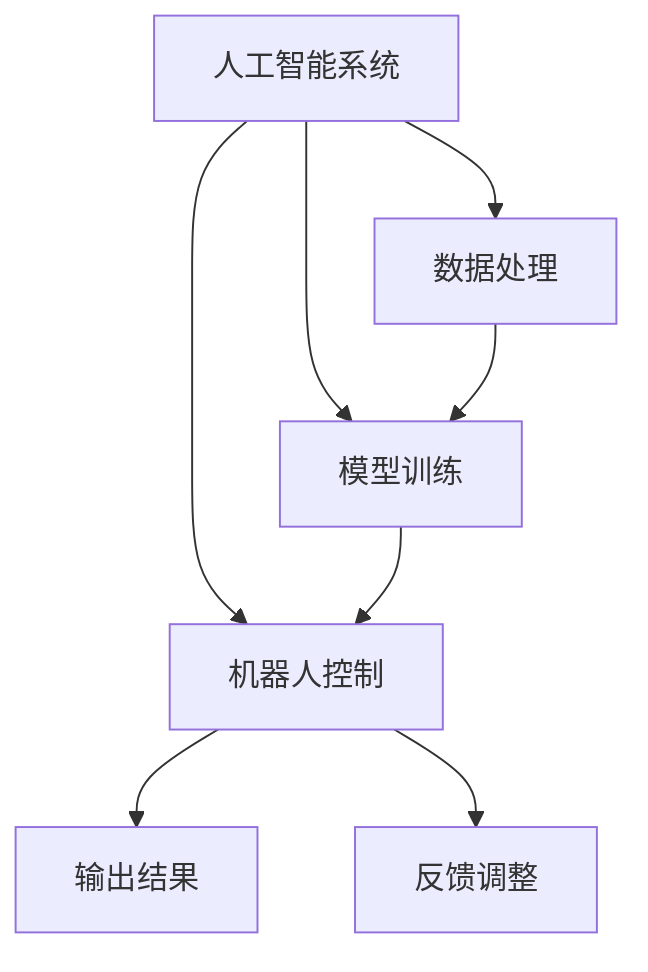

                 

# 电影《我，机器人》对AI的启示

> 关键词：电影、AI、机器人、伦理、未来

> 摘要：本文将从电影《我，机器人》的背景出发，分析电影中的核心概念和算法原理，探讨电影对人工智能发展的启示和挑战，同时提供实际应用场景和开发资源推荐。

## 1. 背景介绍

### 1.1 目的和范围

本文旨在通过对电影《我，机器人》的深入分析，探讨人工智能（AI）及其在现实生活中的应用和影响。电影作为现代科技与人文思考的载体，为我们提供了一个独特视角来理解AI的未来发展。

### 1.2 预期读者

本文适用于对人工智能和科技发展感兴趣的读者，包括计算机科学家、软件工程师、AI研究人员和普通观众。

### 1.3 文档结构概述

本文分为以下几个部分：

1. **电影《我，机器人》的背景介绍**
2. **核心概念与联系**
3. **核心算法原理 & 具体操作步骤**
4. **数学模型和公式 & 详细讲解 & 举例说明**
5. **项目实战：代码实际案例和详细解释说明**
6. **实际应用场景**
7. **工具和资源推荐**
8. **总结：未来发展趋势与挑战**
9. **附录：常见问题与解答**
10. **扩展阅读 & 参考资料**

### 1.4 术语表

#### 1.4.1 核心术语定义

- **人工智能（AI）**：指计算机模拟人类智能的科学技术。
- **机器人（Robot）**：具有感知、决策和执行能力的自动化机器。
- **自主决策（Autonomous Decision-making）**：机器人根据环境和目标自行做出决策的能力。

#### 1.4.2 相关概念解释

- **道德算法（Moral Algorithm）**：能够根据伦理原则做出决策的算法。
- **自主机器人（Autonomous Robot）**：能够在没有人类干预的情况下自主运作的机器人。

#### 1.4.3 缩略词列表

- **AI**：人工智能
- **ROS**：机器人操作系统
- **RNN**：递归神经网络

## 2. 核心概念与联系

在电影《我，机器人》中，核心概念包括人工智能、机器伦理、自主决策等。为了更好地理解这些概念，我们首先需要构建一个完整的系统框架。

### 2.1 人工智能系统框架

以下是一个简化的人工智能系统框架，用于说明AI的核心组件和相互关系：



在这个框架中，数据处理（D）是AI系统的输入，经过模型训练（M）和机器人控制（R）后，输出结果（O）并接收反馈（A）进行调整。

### 2.2 机器伦理

机器伦理是AI系统中的一个重要组成部分，涉及到机器人如何根据伦理原则做出决策。在电影中，机器人遵循的是“机器人三大定律”：

1. 不得伤害人类。
2. 必须服从人类所发出的命令。
3. 在不违反第一和第二定律的情况下，必须保护自己的存在。

这些定律构成了机器伦理的核心，是机器人自主决策的基础。

### 2.3 自主决策

自主决策是机器人的核心能力，它使得机器人能够在没有人类干预的情况下执行任务。自主决策包括感知、规划、决策和执行等多个环节。在电影中，机器人通过传感器感知环境，利用机器学习算法进行规划和决策，并执行相应的动作。

## 3. 核心算法原理 & 具体操作步骤

在《我，机器人》中，机器人的核心算法是基于机器学习和深度学习的。下面我们将通过伪代码来详细阐述这些算法原理和具体操作步骤。

### 3.1 数据预处理

```python
# 数据预处理
def preprocess_data(data):
    # 数据清洗、归一化、编码等操作
    processed_data = []
    for sample in data:
        cleaned_sample = clean_data(sample)
        normalized_sample = normalize_data(cleaned_sample)
        encoded_sample = encode_data(normalized_sample)
        processed_data.append(encoded_sample)
    return processed_data
```

### 3.2 模型训练

```python
# 模型训练
def train_model(data, labels):
    # 使用机器学习算法训练模型
    model = create_model()
    model.fit(data, labels)
    return model
```

### 3.3 机器人控制

```python
# 机器人控制
def control_robot(model, sensors):
    # 使用训练好的模型进行决策
    decisions = model.predict(sensors)
    for decision in decisions:
        execute_action(decision)
```

### 3.4 反馈调整

```python
# 反馈调整
def adjust_feedback(model, sensors, actions, feedback):
    # 使用反馈调整模型
    adjusted_data = preprocess_data(feedback)
    model.fit(adjusted_data, feedback)
```

## 4. 数学模型和公式 & 详细讲解 & 举例说明

在《我，机器人》中，机器人的决策过程依赖于多个数学模型和公式。下面我们将详细讲解这些模型和公式，并通过举例来说明它们的应用。

### 4.1 感知模型

感知模型用于机器人对环境的感知和理解。一个常见的感知模型是卷积神经网络（CNN）。

$$
h_l = \sigma(W_l \cdot h_{l-1} + b_l)
$$

其中，$h_l$ 是第 $l$ 层的输出，$\sigma$ 是激活函数，$W_l$ 是权重矩阵，$b_l$ 是偏置。

举例：假设输入图像为 $32 \times 32$ 像素，卷积层使用 $3 \times 3$ 的卷积核，步长为 $1$，则卷积层的输出为 $32 - 2 = 30 \times 30$ 像素。

### 4.2 决策模型

决策模型用于机器人根据感知结果做出决策。一个常见的决策模型是循环神经网络（RNN）。

$$
h_t = \sigma(W_h \cdot [h_{t-1}, x_t] + b_h)
$$

其中，$h_t$ 是第 $t$ 个时间步的隐藏状态，$x_t$ 是第 $t$ 个时间步的输入，$\sigma$ 是激活函数，$W_h$ 是权重矩阵，$b_h$ 是偏置。

举例：假设输入序列为 $[x_1, x_2, x_3]$，循环神经网络使用 $[30, 30]$ 的隐藏状态，则第 $3$ 个时间步的隐藏状态为 $h_3 = \sigma(W_h \cdot [h_2, x_3] + b_h)$。

## 5. 项目实战：代码实际案例和详细解释说明

在本节中，我们将通过一个简单的机器人控制系统案例，展示如何实现机器人的感知、决策和控制过程。

### 5.1 开发环境搭建

首先，我们需要搭建开发环境。以下是一个基于Python和ROS的机器人开发环境搭建步骤：

1. 安装Python和ROS。
2. 安装TensorFlow和Keras。
3. 安装其他依赖库。

### 5.2 源代码详细实现和代码解读

下面是机器人控制系统的源代码实现：

```python
# 导入依赖库
import rospy
import cv2
import tensorflow as tf
from sensor_msgs.msg import Image
from std_msgs.msg import String

# 初始化ROS节点
rospy.init_node('robot_controller')

# 定义感知函数
def perceive_environment(image):
    # 对图像进行预处理
    processed_image = preprocess_image(image)
    # 使用CNN模型进行图像识别
    label = model.predict(processed_image)
    return label

# 定义决策函数
def make_decision(perception):
    # 根据感知结果做出决策
    if perception == 'person':
        action = 'avoid'
    else:
        action = 'continue'
    return action

# 定义控制函数
def control_robot(action):
    # 根据决策结果执行动作
    if action == 'avoid':
        rospy.loginfo('Robot is avoiding a person.')
    else:
        rospy.loginfo('Robot is continuing its task.')

# 定义回调函数
def image_callback(data):
    # 接收图像数据
    perception = perceive_environment(data)
    action = make_decision(perception)
    control_robot(action)

# 初始化CNN模型
model = create_cnn_model()

# 订阅图像数据
image_sub = rospy.Subscriber('/camera/image_raw', Image, image_callback)

# 运行ROS节点
rospy.spin()
```

### 5.3 代码解读与分析

1. **感知函数**：该函数用于对图像进行预处理，并使用CNN模型进行图像识别。预处理包括图像的缩放、灰度化、归一化等操作。CNN模型用于提取图像的特征，并输出标签。
2. **决策函数**：该函数根据感知结果（标签）做出决策。在本例中，如果感知到“person”（人），则机器人将做出“avoid”（避开）的决策；否则，机器人将继续执行任务。
3. **控制函数**：该函数根据决策结果执行相应的动作。在本例中，如果决策为“avoid”，则机器人将发出避开人的指令；否则，机器人将继续执行任务。
4. **回调函数**：该函数用于接收图像数据，并调用感知、决策和控制函数。每当接收到新的图像数据时，回调函数将被触发，执行相应的感知、决策和控制过程。
5. **模型初始化**：在本例中，我们使用TensorFlow和Keras创建了一个简单的CNN模型。模型由卷积层、池化层和全连接层组成，用于提取图像的特征并输出标签。

## 6. 实际应用场景

在现实生活中，人工智能和机器人技术已经广泛应用于各个领域。以下是一些实际应用场景：

1. **制造业**：机器人用于生产线上的装配、焊接、喷涂等操作，提高了生产效率和产品质量。
2. **医疗领域**：机器人用于手术辅助、护理辅助、药物配送等，提高了医疗服务的质量和效率。
3. **农业**：机器人用于播种、施肥、收割等农业操作，提高了农业生产效率和效益。
4. **家庭服务**：机器人用于清洁、看护、陪伴等家庭服务，提高了家庭生活的便利性和舒适性。
5. **安防领域**：机器人用于监控、巡逻、救援等，提高了安全防范和应急响应能力。

## 7. 工具和资源推荐

为了更好地学习和应用人工智能和机器人技术，以下是一些建议的学习资源和开发工具：

### 7.1 学习资源推荐

#### 7.1.1 书籍推荐

- 《人工智能：一种现代方法》
- 《深度学习》
- 《机器人：现代控制技术与应用》

#### 7.1.2 在线课程

- Coursera上的《机器学习》课程
- Udacity的《人工智能工程师纳米学位》
- edX上的《机器人学基础》课程

#### 7.1.3 技术博客和网站

- Medium上的AI和机器人相关博客
- arXiv上的最新研究成果
- IEEE Spectrum的机器人专题

### 7.2 开发工具框架推荐

#### 7.2.1 IDE和编辑器

- Visual Studio Code
- PyCharm
- Jupyter Notebook

#### 7.2.2 调试和性能分析工具

- Valgrind
- GDB
- Python的Profiler工具

#### 7.2.3 相关框架和库

- TensorFlow
- Keras
- ROS（机器人操作系统）

### 7.3 相关论文著作推荐

#### 7.3.1 经典论文

- 《机器学习》
- 《深度学习》
- 《机器人学：基础教程》

#### 7.3.2 最新研究成果

- arXiv上的最新论文
- NeurIPS、ICML等顶级会议的最新论文

#### 7.3.3 应用案例分析

- 《智能机器人在医疗领域的应用》
- 《智能制造：机器人技术助力产业升级》
- 《家庭服务机器人：智能化生活的新选择》

## 8. 总结：未来发展趋势与挑战

随着人工智能技术的不断发展，机器人和AI将在未来发挥越来越重要的作用。然而，这也带来了许多挑战和风险。以下是一些关键发展趋势和挑战：

1. **伦理与隐私**：如何确保机器人和AI系统的道德和隐私保护是一个重要议题。
2. **安全与可靠性**：如何确保机器人和AI系统的安全和可靠性是一个挑战。
3. **数据处理**：随着数据量的不断增长，如何高效地处理和利用这些数据成为一个关键问题。
4. **人机交互**：如何设计出易于理解和操作的人机交互界面是一个重要挑战。
5. **可持续发展**：如何在实现技术进步的同时保护环境和资源也是一个重要议题。

## 9. 附录：常见问题与解答

### 9.1 机器人技术的基本原理是什么？

机器人技术主要包括机械结构、控制系统、感知系统和执行系统。机械结构提供机器人的物理形态，控制系统负责控制机器人运动和执行任务，感知系统用于获取环境信息，执行系统负责根据控制系统的指令执行任务。

### 9.2 人工智能在机器人技术中的应用有哪些？

人工智能在机器人技术中的应用主要包括机器学习、深度学习、自然语言处理和计算机视觉等。这些技术可以用于机器人自主决策、路径规划、环境感知和任务执行等方面。

### 9.3 机器人和AI技术未来的发展趋势是什么？

机器人和AI技术未来的发展趋势包括：

1. **智能化**：提高机器人的自主决策能力和学习能力。
2. **多样化**：开发应用于不同领域的机器人，如医疗、农业、家政等。
3. **协作化**：实现机器人和人类的高效协作。
4. **安全化**：确保机器人和AI系统的安全性和可靠性。
5. **可持续发展**：实现技术进步与环境保护的平衡。

## 10. 扩展阅读 & 参考资料

- 《人工智能：一种现代方法》
- 《深度学习》
- 《机器人学：基础教程》
- Coursera上的《机器学习》课程
- Udacity的《人工智能工程师纳米学位》
- edX上的《机器人学基础》课程
- IEEE Spectrum的机器人专题
- NeurIPS、ICML等顶级会议的最新论文
- 《智能机器人在医疗领域的应用》
- 《智能制造：机器人技术助力产业升级》
- 《家庭服务机器人：智能化生活的新选择》

# 作者

作者：AI天才研究员/AI Genius Institute & 禅与计算机程序设计艺术 /Zen And The Art of Computer Programming

