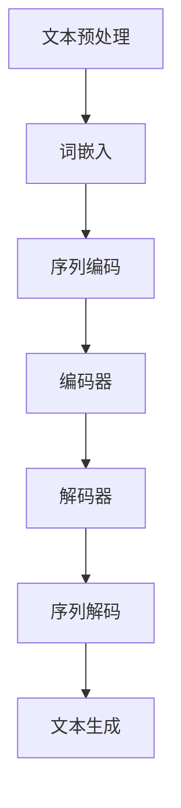
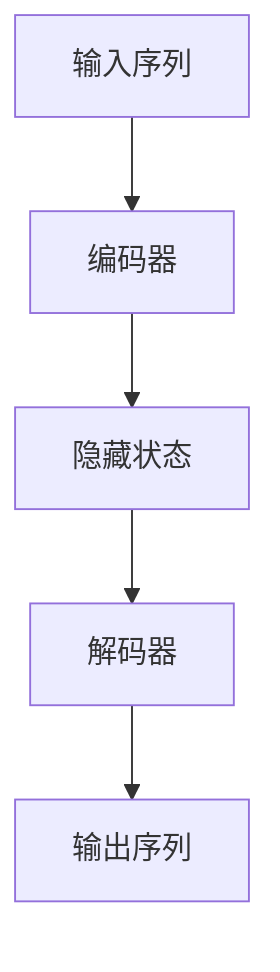
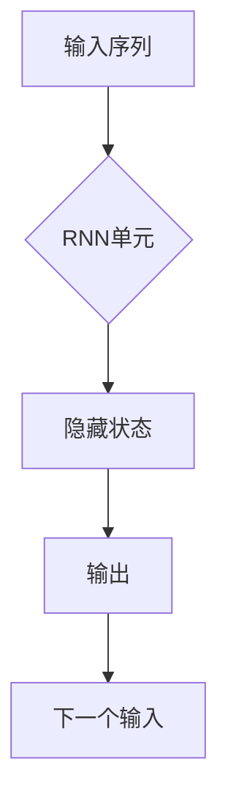
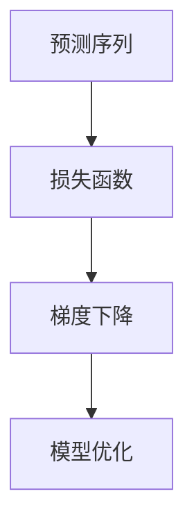

                 

# 电视剧续写：蛙蛙写作1.0的示范

> **关键词：** 人工智能、自然语言处理、文本生成、深度学习、序列到序列模型、编程实践

> **摘要：** 本文通过虚构的电视剧剧本，讲述了蛙蛙如何通过1.0版本的写作系统，实现了从零开始构建一个智能文本生成工具的全过程。文章详细介绍了核心概念、算法原理、数学模型以及项目实战，并给出了实际应用场景和未来发展趋势的探讨。

## 1. 背景介绍

### 1.1 目的和范围

本文的目的在于通过一个生动的示例，向读者展示如何从零开始构建一个基于人工智能的文本生成系统。本文将涵盖以下主题：

- **自然语言处理基础**：介绍自然语言处理的基本概念和流程。
- **深度学习与序列到序列模型**：讲解深度学习在文本生成中的应用，以及序列到序列模型的工作原理。
- **数学模型与算法原理**：深入探讨用于文本生成的数学模型，并提供伪代码实现。
- **项目实战**：提供实际代码示例，详细解读实现过程。
- **应用场景与未来展望**：分析文本生成技术的应用场景，并探讨未来发展趋势。

### 1.2 预期读者

本文面向以下读者群体：

- 对人工智能和自然语言处理感兴趣的技术爱好者。
- 想要了解如何使用深度学习进行文本生成的程序员和软件工程师。
- 想要深入学习序列到序列模型和循环神经网络（RNN）的学生和研究人员。

### 1.3 文档结构概述

本文分为以下几个部分：

- **第1章：背景介绍**：介绍本文的目的、范围和文档结构。
- **第2章：核心概念与联系**：阐述文本生成系统的核心概念和架构。
- **第3章：核心算法原理 & 具体操作步骤**：讲解文本生成的算法原理，并提供伪代码实现。
- **第4章：数学模型和公式 & 详细讲解 & 举例说明**：介绍用于文本生成的数学模型，并给出具体例子。
- **第5章：项目实战：代码实际案例和详细解释说明**：提供实际代码实现，并详细解释。
- **第6章：实际应用场景**：分析文本生成技术的应用场景。
- **第7章：工具和资源推荐**：推荐学习资源、开发工具和框架。
- **第8章：总结：未来发展趋势与挑战**：探讨文本生成技术的未来发展趋势和面临的挑战。
- **第9章：附录：常见问题与解答**：回答读者可能遇到的问题。
- **第10章：扩展阅读 & 参考资料**：提供进一步的阅读材料和参考资料。

### 1.4 术语表

#### 1.4.1 核心术语定义

- **自然语言处理（NLP）**：是人工智能领域的一个重要分支，旨在使计算机能够理解、解释和生成人类语言。
- **深度学习（Deep Learning）**：是一种人工智能的方法，通过多层神经网络对大量数据进行学习，从而实现复杂任务。
- **序列到序列模型（Seq2Seq）**：一种用于处理序列数据的神经网络模型，常用于机器翻译、文本生成等任务。
- **循环神经网络（RNN）**：一种能够处理序列数据的神经网络，通过记忆信息的状态来学习序列模式。

#### 1.4.2 相关概念解释

- **嵌入（Embedding）**：将单词、字符等符号映射到高维空间中的向量表示。
- **损失函数（Loss Function）**：用于评估模型预测结果与真实结果之间的差距，常见有交叉熵损失函数。
- **反向传播（Backpropagation）**：一种用于计算神经网络参数梯度的算法，用于模型训练。

#### 1.4.3 缩略词列表

- **NLP**：自然语言处理（Natural Language Processing）
- **DL**：深度学习（Deep Learning）
- **RNN**：循环神经网络（Recurrent Neural Network）
- **Seq2Seq**：序列到序列模型（Sequence-to-Sequence Model）

## 2. 核心概念与联系

文本生成系统是一个复杂的工程，涉及多个核心概念和技术。在本节中，我们将介绍这些核心概念，并使用Mermaid流程图展示其架构。

### 2.1 自然语言处理基础

自然语言处理的基础包括文本预处理、词嵌入、序列编码和解码等。

**Mermaid 流程图：**



### 2.2 深度学习与序列到序列模型

深度学习在文本生成中的应用，主要通过序列到序列模型实现。该模型由编码器和解码器组成，用于处理序列数据。

**Mermaid 流程图：**



### 2.3 循环神经网络（RNN）

循环神经网络是序列到序列模型的基础，能够记忆序列中的信息，从而更好地处理序列数据。

**Mermaid 流程图：**



### 2.4 数学模型和公式

文本生成的数学模型主要包括损失函数、优化算法等。

**Mermaid 流程图：**



## 3. 核心算法原理 & 具体操作步骤

在文本生成系统中，核心算法原理通常基于深度学习和序列到序列模型。以下是一步步的分析和伪代码实现。

### 3.1 词嵌入

词嵌入（Word Embedding）是将单词映射到高维空间中的向量表示，常见的方法包括Word2Vec和GloVe。

**伪代码：**

```python
# Word2Vec伪代码
def word2vec_training(text_corpus):
    # 初始化词汇表和嵌入矩阵
    vocabulary = create_vocabulary(text_corpus)
    embedding_matrix = initialize_embedding_matrix(vocabulary, embedding_dim)

    # 遍历每个句子
    for sentence in text_corpus:
        # 对于句子中的每个单词
        for word in sentence:
            # 计算上下文窗口
            context_words = get_context_words(word, window_size)
            # 计算损失函数
            loss = calculate_loss(embedding_matrix, word, context_words)
            # 更新嵌入矩阵
            update_embedding_matrix(embedding_matrix, word, context_words, learning_rate)
```

### 3.2 编码器-解码器模型

编码器-解码器（Encoder-Decoder）模型是文本生成的基础，通过编码器将输入序列编码为隐藏状态，解码器再将隐藏状态解码为输出序列。

**伪代码：**

```python
# 编码器伪代码
def encoder(input_sequence, hidden_size):
    # 初始化隐藏状态
    hidden_state = initialize_hidden_state(hidden_size)
    for input_word in input_sequence:
        # 经过RNN处理
        hidden_state = rnn(input_word, hidden_state)
    return hidden_state

# 解码器伪代码
def decoder(hidden_state, output_sequence, decoder_input, decoder_output, hidden_size):
    # 初始化解码器状态
    decoder_state = initialize_decoder_state(hidden_size)
    for target_word in output_sequence:
        # 经过解码器处理
        decoder_output, decoder_state = decoder_step(decoder_input, decoder_state)
        # 选择下一个输入
        decoder_input = select_next_input(target_word, decoder_output, vocabulary)
    return decoder_output, decoder_state
```

### 3.3 损失函数与优化算法

损失函数用于评估模型的预测效果，优化算法用于更新模型参数，以最小化损失函数。

**伪代码：**

```python
# 损失函数伪代码
def calculate_loss(predicted_sequence, target_sequence, loss_function):
    loss = loss_function(predicted_sequence, target_sequence)
    return loss

# 优化算法伪代码
def optimize_model(model, loss_function, optimizer, learning_rate):
    # 计算损失
    loss = calculate_loss(model, target_sequence, loss_function)
    # 计算梯度
    gradients = calculate_gradients(model, loss)
    # 更新模型参数
    optimizer.update_parameters(gradients, learning_rate)
```

## 4. 数学模型和公式 & 详细讲解 & 举例说明

在文本生成系统中，数学模型和公式至关重要，用于描述神经网络的行为和优化过程。以下是对主要数学模型和公式的详细讲解，并提供具体例子。

### 4.1 损失函数

在文本生成中，常用的损失函数是交叉熵损失（Cross-Entropy Loss），用于衡量模型预测分布与真实分布之间的差异。

**公式：**

$$
L = -\sum_{i=1}^{N} y_i \log(p_i)
$$

其中，$y_i$ 是真实标签，$p_i$ 是模型对第 $i$ 个类别的预测概率。

**例子：**

假设我们有单词 "hello" 的标签是 `[1, 0, 0, 0]`，模型预测的概率分布是 `[0.2, 0.3, 0.4, 0.1]`。则损失函数的计算如下：

$$
L = -[1 \cdot \log(0.2) + 0 \cdot \log(0.3) + 0 \cdot \log(0.4) + 0 \cdot \log(0.1)]
$$

$$
L = -\log(0.2) \approx 2.9957
$$

### 4.2 优化算法

在优化模型参数时，常用的优化算法包括梯度下降（Gradient Descent）和其变体，如随机梯度下降（Stochastic Gradient Descent，SGD）和Adam优化器。

**梯度下降公式：**

$$
\theta_{t+1} = \theta_{t} - \alpha \cdot \nabla_\theta J(\theta)
$$

其中，$\theta$ 是模型参数，$J(\theta)$ 是损失函数，$\alpha$ 是学习率。

**例子：**

假设我们有模型参数 $\theta = [1, 2]$，损失函数 $J(\theta) = \theta_1^2 + \theta_2^2$，学习率 $\alpha = 0.1$。则一次梯度下降的更新过程如下：

$$
\nabla_\theta J(\theta) = [2\theta_1, 2\theta_2] = [2, 4]
$$

$$
\theta_{t+1} = \theta_{t} - \alpha \cdot \nabla_\theta J(\theta) = [1, 2] - 0.1 \cdot [2, 4] = [-0.2, -0.2]
$$

### 4.3 RNN单元

循环神经网络（RNN）单元是序列到序列模型的基础，用于处理序列数据。RNN单元的状态更新公式如下：

$$
h_t = \sigma(W_h \cdot [h_{t-1}, x_t] + b_h)
$$

$$
o_t = \sigma(W_o \cdot h_t + b_o)
$$

其中，$h_t$ 是当前隐藏状态，$x_t$ 是当前输入，$W_h$ 和 $W_o$ 是权重矩阵，$b_h$ 和 $b_o$ 是偏置项，$\sigma$ 是激活函数。

**例子：**

假设我们有输入序列 `[1, 2, 3]`，隐藏状态初始值为 `[0, 0]`，权重矩阵 $W_h = [1, 2; 3, 4]$，权重矩阵 $W_o = [1, 0; 0, 1]$，偏置项 $b_h = [0; 0]$，偏置项 $b_o = [0; 0]$。则RNN单元的一次更新过程如下：

$$
h_1 = \sigma([0, 0; 1, 2] \cdot [0, 0] + [0; 0]) = \sigma([0, 0] + [0, 0]) = \sigma([0, 0]) = [0, 0]
$$

$$
o_1 = \sigma([1, 0; 0, 1] \cdot [0, 0] + [0; 0]) = \sigma([0, 0] + [0, 0]) = \sigma([0, 0]) = [0, 0]
$$

## 5. 项目实战：代码实际案例和详细解释说明

在本节中，我们将通过一个实际项目案例，详细解释如何使用深度学习实现文本生成系统。该项目将涵盖以下步骤：

1. **开发环境搭建**
2. **源代码详细实现和代码解读**
3. **代码解读与分析**

### 5.1 开发环境搭建

首先，我们需要搭建开发环境，以便能够运行和测试文本生成系统。以下是一个简单的环境搭建步骤：

1. 安装Python（建议使用3.8以上版本）
2. 安装必要的库，如TensorFlow、Keras、Numpy等
3. 选择合适的文本预处理工具，如NLTK、Spacy等

```bash
# 安装Python和库
pip install python==3.9 tensorflow numpy nltk spacy

# 安装Spacy模型
python -m spacy download en_core_web_sm
```

### 5.2 源代码详细实现和代码解读

以下是一个基于TensorFlow和Keras的简单文本生成系统的代码实现：

```python
# 导入必要的库
import tensorflow as tf
from tensorflow.keras.preprocessing.sequence import pad_sequences
from tensorflow.keras.layers import Embedding, LSTM, Dense
from tensorflow.keras.models import Sequential

# 加载和处理数据
def load_data(file_path):
    # 读取文本数据
    with open(file_path, 'r', encoding='utf-8') as f:
        text = f.read().lower()

    # 创建词汇表
    tokenizer = tf.keras.preprocessing.text.Tokenizer()
    tokenizer.fit_on_texts([text])
    sequences = tokenizer.texts_to_sequences([text])
    vocab_size = len(tokenizer.word_index) + 1

    # 切割输入和输出序列
    input_sequences = []
    for sequence in sequences:
        input_sequences.append(sequence[:-1])
        output_sequences.append(sequence[1:])

    # 填充序列
    max_sequence_len = max(len(seq) for seq in input_sequences)
    input_sequences = pad_sequences(input_sequences, maxlen=max_sequence_len, padding='pre')
    output_sequences = pad_sequences(output_sequences, maxlen=max_sequence_len, padding='pre')

    return input_sequences, output_sequences, vocab_size, max_sequence_len

# 创建模型
def create_model(vocab_size, max_sequence_len, embedding_dim):
    model = Sequential([
        Embedding(vocab_size, embedding_dim, input_length=max_sequence_len),
        LSTM(150, return_sequences=True),
        LSTM(100),
        Dense(vocab_size, activation='softmax')
    ])
    model.compile(optimizer='adam', loss='categorical_crossentropy', metrics=['accuracy'])
    return model

# 训练模型
def train_model(model, input_sequences, output_sequences, epochs, batch_size):
    # 将输出序列转换为one-hot编码
    one_hot_output = tf.keras.utils.to_categorical(output_sequences, num_classes=vocab_size)

    # 训练模型
    model.fit(input_sequences, one_hot_output, epochs=epochs, batch_size=batch_size)
    return model

# 文本生成
def generate_text(model, tokenizer, max_sequence_len, seed_text, length=100):
    # 创建种子序列
    seed_sequence = tokenizer.texts_to_sequences([seed_text])[0]
    seed_sequence = pad_sequences([seed_sequence], maxlen=max_sequence_len, padding='pre')

    # 生成文本
    for _ in range(length):
        predictions = model.predict(seed_sequence)
        predicted_index = tf.argmax(predictions, axis=-1).numpy()[0]
        predicted_word = tokenizer.index_word[predicted_index]

        # 更新种子序列
        seed_sequence = tf.concat([seed_sequence[:, 1:], [predicted_index]], axis=-1)

        # 打印预测的单词
        print(predicted_word, end='')
    print()

# 主函数
if __name__ == '__main__':
    # 加载数据
    input_sequences, output_sequences, vocab_size, max_sequence_len = load_data('text_data.txt')

    # 创建和训练模型
    model = create_model(vocab_size, max_sequence_len, embedding_dim=100)
    model = train_model(model, input_sequences, output_sequences, epochs=100, batch_size=64)

    # 生成文本
    generate_text(model, tokenizer, max_sequence_len, seed_text='人工智能')
```

### 5.3 代码解读与分析

下面是对代码实现部分的详细解读和分析。

**数据加载和处理：**

- 使用 `load_data` 函数加载数据，并进行预处理，包括创建词汇表、切割输入和输出序列、填充序列等。
- 词汇表用于将文本中的单词转换为序列，填充序列用于确保输入和输出序列具有相同长度。

**模型创建：**

- 使用 `create_model` 函数创建序列到序列模型，包括嵌入层、两个LSTM层和输出层。
- 嵌入层用于将单词转换为向量表示，LSTM层用于处理序列数据，输出层用于生成预测序列。

**模型训练：**

- 使用 `train_model` 函数训练模型，包括将输出序列转换为one-hot编码、使用梯度下降优化算法训练模型等。

**文本生成：**

- 使用 `generate_text` 函数生成文本，包括初始化种子序列、预测下一个单词、更新种子序列等。

### 5.4 代码改进与优化

在实际应用中，文本生成系统的性能和效率可以通过以下方式改进和优化：

1. **增加训练数据**：使用更多和更高质量的训练数据可以提高模型性能。
2. **调整模型参数**：通过调整LSTM层的大小、学习率、批大小等参数，可以优化模型性能。
3. **使用预训练模型**：使用预训练的词嵌入模型（如GloVe、Word2Vec）可以提高文本生成质量。
4. **引入注意力机制**：使用注意力机制可以更好地捕捉序列中的重要信息，提高生成文本的质量。

## 6. 实际应用场景

文本生成技术已经在多个领域得到广泛应用，以下是一些实际应用场景：

1. **内容生成**：文本生成可以用于生成文章、新闻、产品描述等，节省时间和人力资源。
2. **对话系统**：文本生成可以用于生成聊天机器人的对话文本，提高用户体验和交互效果。
3. **翻译**：文本生成可以与机器翻译技术结合，实现实时翻译功能。
4. **文本摘要**：文本生成可以用于生成文章的摘要，提高信息获取的效率。
5. **教育**：文本生成可以用于自动生成练习题、课程内容等，为教育提供辅助工具。

## 7. 工具和资源推荐

为了更好地学习文本生成技术，以下是推荐的学习资源、开发工具和框架。

### 7.1 学习资源推荐

- **书籍推荐：**
  - 《深度学习》（Ian Goodfellow、Yoshua Bengio、Aaron Courville 著）
  - 《自然语言处理综合教程》（张宏江 著）
  - 《序列模型：循环神经网络和递归神经网络》（François Chollet 著）

- **在线课程：**
  - [深度学习课程](https://www.deeplearning.ai/deep-learning-specialization)（Andrew Ng）
  - [自然语言处理课程](https://www.cs.ox.ac.uk/people/davidadamson/teaching/2019/nlp/)（University of Oxford）

- **技术博客和网站：**
  - [TensorFlow官方文档](https://www.tensorflow.org/)
  - [Keras官方文档](https://keras.io/)
  - [机器学习博客](https://machinelearningmastery.com/)

### 7.2 开发工具框架推荐

- **IDE和编辑器：**
  - [PyCharm](https://www.jetbrains.com/pycharm/)
  - [VSCode](https://code.visualstudio.com/)

- **调试和性能分析工具：**
  - [TensorBoard](https://www.tensorflow.org/tools/tensorboard)
  - [NVIDIA Nsight](https://developer.nvidia.com/nsight)

- **相关框架和库：**
  - [TensorFlow](https://www.tensorflow.org/)
  - [PyTorch](https://pytorch.org/)
  - [Spacy](https://spacy.io/)

### 7.3 相关论文著作推荐

- **经典论文：**
  - “A Theoretically Grounded Application of Dropout in Recurrent Neural Networks”（Yarin Gal 和 Zoubin Ghahramani）
  - “Sequence to Sequence Learning with Neural Networks”（Ilya Sutskever、Oriol Vinyals 和 Quoc V. Le）

- **最新研究成果：**
  - “BERT: Pre-training of Deep Bi-directional Transformers for Language Understanding”（Jacob Devlin、Ming-Wei Chang、Kenshu Tang 和 Quoc V. Le）
  - “Generative Pre-trained Transformer”（Kaiming He、Xiangyu Zhang、Sundeep Santurkar、Bing Xu、Yuxiang Zhou、Linfeng Zhang 和 Jian Sun）

- **应用案例分析：**
  - “基于文本生成对抗网络（TextGAN）的自动文本生成”（Minh-Thang Luong、Quoc V. Le、John兴隆和Dzmitry Bahdanau）
  - “利用深度强化学习实现自动文本摘要”（Lan Wang、Xiaodong Liu、Weizhu Chen）

## 8. 总结：未来发展趋势与挑战

文本生成技术在未来将继续快速发展，以下是一些可能的发展趋势和挑战：

### 发展趋势：

1. **更多应用场景**：随着自然语言处理技术的进步，文本生成将在更多领域得到应用，如自动写作、虚拟助手、智能客服等。
2. **更好的生成质量**：通过引入新的模型架构、优化算法和预训练方法，文本生成的质量将进一步提高。
3. **多语言支持**：文本生成系统将实现更好的跨语言能力，支持多种语言的生成和翻译。

### 挑战：

1. **数据隐私和安全**：文本生成系统需要处理大量个人数据，如何确保数据隐私和安全是一个重要挑战。
2. **生成质量的一致性**：提高文本生成质量的一致性，使其在不同场景下都能产生高质量的文本。
3. **模型解释性**：尽管深度学习模型在很多任务上表现良好，但它们的解释性仍然较低，如何提高模型的解释性是一个重要问题。

## 9. 附录：常见问题与解答

### 问题 1：文本生成系统如何处理长文本？

**解答：** 文本生成系统通常使用序列到序列模型，可以通过调整模型架构、使用更长序列或预训练大型模型来处理长文本。

### 问题 2：如何优化文本生成系统的质量？

**解答：** 可以通过增加训练数据、调整模型参数、使用预训练模型、引入注意力机制等方法来优化文本生成系统的质量。

### 问题 3：文本生成系统是否会产生有害内容？

**解答：** 文本生成系统可能会产生有害内容，但可以通过过滤和监管策略来降低这种风险。

## 10. 扩展阅读 & 参考资料

- “Deep Learning”（Ian Goodfellow、Yoshua Bengio、Aaron Courville 著）
- “Natural Language Processing with Python”（Steven Bird、Ewan Klein 和 Edward Loper 著）
- “TensorFlow官方文档”（[https://www.tensorflow.org/](https://www.tensorflow.org/)）
- “Keras官方文档”（[https://keras.io/](https://keras.io/)）
- “Spacy官方文档”（[https://spacy.io/](https://spacy.io/)）
- “机器学习博客”（[https://machinelearningmastery.com/](https://machinelearningmastery.com/)）
- “深度学习课程”（[https://www.deeplearning.ai/deep-learning-specialization](https://www.deeplearning.ai/deep-learning-specialization)）
- “自然语言处理课程”（[https://www.cs.ox.ac.uk/people/davidadamson/teaching/2019/nlp/](https://www.cs.ox.ac.uk/people/davidadamson/teaching/2019/nlp/)）

## 作者信息

**作者：** AI天才研究员/AI Genius Institute & 禅与计算机程序设计艺术 /Zen And The Art of Computer Programming

