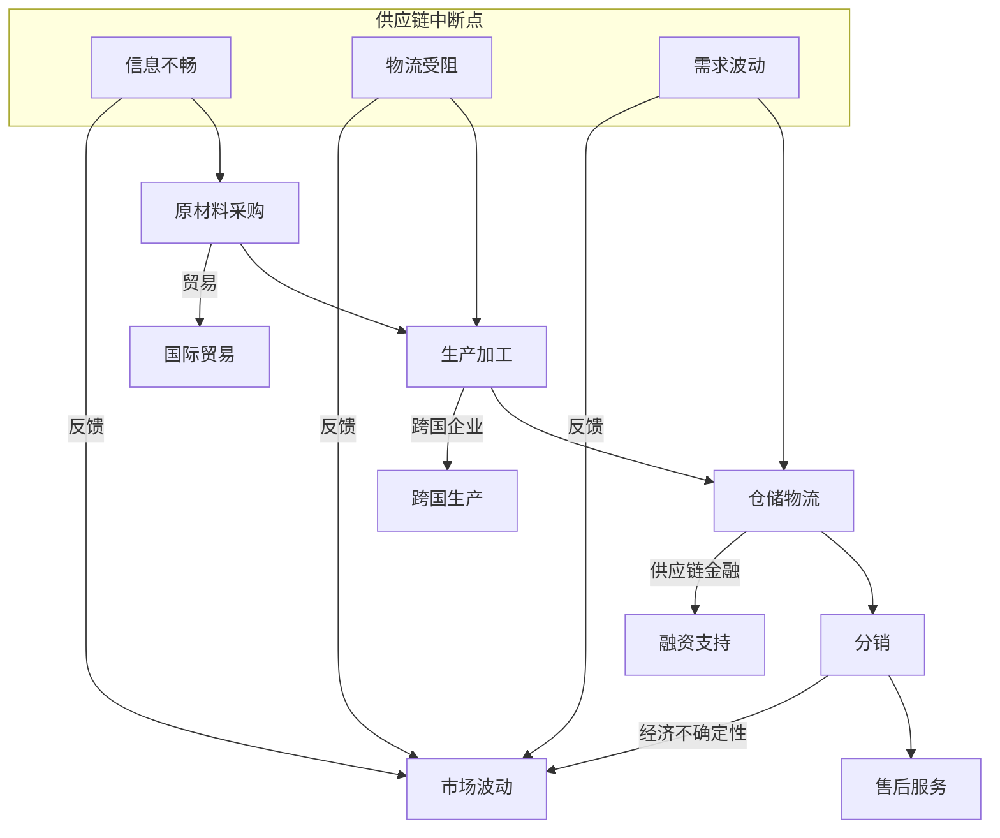

                 

### 疫情冲击对全球经济的影响

> **关键词**：疫情、全球经济、供应链、通货膨胀、就业市场、数字转型
>
> **摘要**：本文深入分析了COVID-19疫情对全球经济产生的深远影响，包括供应链中断、通货膨胀、就业市场变化以及企业数字化转型的加速。文章将逐步探讨这些影响的原因、具体表现及其长期影响，为读者提供全面而详细的视角。

**本文目录**：

1. **背景介绍**  
    1.1 目的和范围  
    1.2 预期读者  
    1.3 文档结构概述  
    1.4 术语表
    - 1.4.1 核心术语定义  
    - 1.4.2 相关概念解释  
    - 1.4.3 缩略词列表

2. **核心概念与联系**  
    - 2.1 供应链基本原理  
    - 2.2 全球经济体系结构与运作

3. **核心算法原理 & 具体操作步骤**  
    - 3.1 供应链风险评估算法  
    - 3.2 通货膨胀预测模型

4. **数学模型和公式 & 详细讲解 & 举例说明**  
    - 4.1 供应链复杂度的数学表示  
    - 4.2 通货膨胀率的计算

5. **项目实战：代码实际案例和详细解释说明**  
    - 5.1 开发环境搭建  
    - 5.2 源代码详细实现和代码解读  
    - 5.3 代码解读与分析

6. **实际应用场景**  
    - 6.1 制造业  
    - 6.2 零售业  
    - 6.3 金融服务

7. **工具和资源推荐**  
    - 7.1 学习资源推荐  
    - 7.2 开发工具框架推荐  
    - 7.3 相关论文著作推荐

8. **总结：未来发展趋势与挑战**  

9. **附录：常见问题与解答**

10. **扩展阅读 & 参考资料**

**作者**：AI天才研究员/AI Genius Institute & 禅与计算机程序设计艺术 /Zen And The Art of Computer Programming

### 1. 背景介绍

#### 1.1 目的和范围

本文旨在通过深入探讨COVID-19疫情对全球经济产生的多重冲击，提供一份全面的分析报告。我们将重点关注以下几个核心方面：

- **供应链中断**：疫情如何影响全球供应链的运作，以及这些中断对生产、分销和消费的长期影响。
- **通货膨胀**：疫情引发的供应链问题和需求变化如何影响价格水平，进而对消费者和企业的财务状况产生何种影响。
- **就业市场**：疫情如何影响就业率、薪资水平和职业流动性，特别是对低技能工人的影响。
- **数字化转型**：企业在疫情期间如何加速采用数字技术，以及这些转型措施的长远效应。

我们的分析将涵盖制造业、零售业、金融服务等多个领域，以展示疫情冲击的广泛性和深远性。

#### 1.2 预期读者

本文面向以下几类读者：

- **企业高管和决策者**：希望了解疫情对全球经济的影响，以及如何制定应对策略。
- **经济学家和政策制定者**：希望从技术角度理解疫情的经济影响，以及可能的政策应对措施。
- **研究人员和学者**：希望获得关于疫情对经济影响的新视角和深入分析。
- **普通读者**：对全球经济运作和疫情影响感兴趣，希望获得全面了解。

#### 1.3 文档结构概述

本文将按照以下结构进行撰写：

- **背景介绍**：介绍疫情的基本情况和全球经济背景，为后续分析提供基础。
- **核心概念与联系**：探讨供应链和全球经济体系的基本原理和相互联系。
- **核心算法原理 & 具体操作步骤**：介绍用于分析和预测的算法和模型。
- **数学模型和公式 & 详细讲解 & 举例说明**：解释核心概念背后的数学原理，并提供具体实例。
- **项目实战：代码实际案例和详细解释说明**：展示如何将理论应用到实际项目中。
- **实际应用场景**：分析疫情对不同行业的影响和应对策略。
- **工具和资源推荐**：推荐相关的学习资源、开发工具和文献资料。
- **总结：未来发展趋势与挑战**：展望疫情对未来的影响，并提出潜在挑战。
- **附录：常见问题与解答**：回答读者可能关心的一些常见问题。
- **扩展阅读 & 参考资料**：提供进一步阅读的参考资料。

#### 1.4 术语表

为了确保本文的清晰性和专业性，我们将在以下部分定义一些关键术语：

- **供应链**：指从原材料采购到产品交付给最终消费者的整个过程。
- **通货膨胀**：指一般价格水平持续上升的现象。
- **就业市场**：指劳动力供求双方交易的场所和机制。
- **数字化转型**：指企业利用数字技术进行业务流程、产品和服务创新的转型过程。

**1.4.1 核心术语定义**

- **疫情**：指COVID-19大流行，以及由此引发的一系列公共卫生和社会经济事件。
- **全球经济**：指全球范围内的经济活动及其相互关系。
- **供应链中断**：指供应链中的某些环节因疫情而无法正常运作。
- **需求波动**：指因疫情导致消费者需求发生显著变化。

**1.4.2 相关概念解释**

- **供应链金融**：指利用供应链中的信息和资金流动，为供应链上的企业提供融资和服务。
- **经济不确定性**：指由于不可预见因素导致的经济前景不稳定。

**1.4.3 缩略词列表**

- **COVID-19**：冠状病毒病2019
- **PPE**：个人防护装备（Personal Protective Equipment）
- **Wuhan**：武汉，中国城市，COVID-19疫情爆发的起点
- **SARS-CoV-2**：严重急性呼吸综合征冠状病毒2型，COVID-19的病原体

### 2. 核心概念与联系

在探讨疫情对全球经济的影响之前，我们首先需要了解两个核心概念：供应链和全球经济体系。这两个概念不仅相互独立，而且在许多方面紧密相连，构成了全球经济运作的基础。

#### 2.1 供应链基本原理

供应链是产品从原材料采购到最终交付给消费者的全过程。它包括以下几个主要环节：

1. **原材料采购**：企业从供应商处采购原材料或半成品。
2. **生产加工**：企业利用采购的原材料进行生产加工，形成最终产品。
3. **仓储物流**：将生产出的产品存储在仓库中，并通过物流系统进行运输。
4. **分销**：将产品从仓库运输到零售商或直接交付给最终消费者。
5. **售后服务**：提供产品维护、维修等服务。

供应链的基本原理在于高效协调各个环节，以最小化成本和最大化效率。供应链的稳定性直接影响到企业的运营效率和市场的供应状况。

#### 2.2 全球经济体系结构与运作

全球经济体系是指全球范围内的经济活动及其相互关系。它主要包括以下几个关键部分：

1. **生产**：全球范围内的生产和制造业活动，涉及不同国家和地区的专业化生产。
2. **贸易**：各国之间的商品和劳务交换，通过国际贸易实现资源的优化配置。
3. **投资**：资本在不同国家之间的流动，包括直接投资和间接投资。
4. **金融**：金融市场的运作，包括货币供应、利率、股票、债券等金融工具的发行和交易。
5. **消费**：全球消费者的消费行为，影响商品和服务的需求。

全球经济体系的运作依赖于国际贸易、国际投资和跨国公司等机制。各国通过这些机制相互依赖，共同推动全球经济的增长。

#### 2.3 供应链与全球经济体系的相互联系

供应链和全球经济体系之间的联系体现在多个方面：

1. **贸易与供应链**：国际贸易使得供应链跨越国界，企业可以在全球范围内寻找最优的原材料、劳动力和市场。
2. **供应链金融**：供应链中的企业可以通过金融工具，如供应链金融，获得融资支持，从而提高供应链的效率和稳定性。
3. **跨国企业**：跨国公司在全球范围内布局供应链，优化资源配置，降低生产成本。
4. **经济不确定性**：全球经济的波动和不确定性会直接影响供应链的稳定性，从而影响全球经济体系的整体表现。

### 2.4 供应链复杂度与全球经济稳定性的关系

供应链的复杂度对全球经济稳定性有着重要影响。一个高度复杂的供应链系统，包含了大量的环节、参与者以及不确定因素，这使得供应链的运作更加脆弱，容易受到外部冲击的影响。例如，COVID-19疫情爆发初期，由于信息不畅、物流受阻和需求波动，全球供应链出现了显著的断裂，导致许多企业面临停产、库存积压和供应链中断等问题。

#### 2.5 供应链中断与全球经济波动

供应链中断是影响全球经济波动的一个重要因素。供应链的任何环节出现问题，都会对整个经济系统产生连锁反应。例如：

- **生产中断**：供应链中的某一环节出现故障，可能导致整个生产流程停滞。
- **库存积压**：库存管理不当，可能导致库存积压，降低企业的现金流。
- **需求波动**：需求变化可能导致供应链上的需求不匹配，影响生产效率和利润率。

为了更好地理解供应链复杂度与全球经济稳定性的关系，我们使用Mermaid流程图来表示供应链的基本结构和可能的中断点。



该流程图展示了供应链的各个环节及其潜在的中断点，以及这些中断点如何影响全球经济稳定性。

通过以上分析，我们可以看到供应链和全球经济体系之间的紧密联系，以及供应链复杂度对全球经济稳定性的影响。理解这些核心概念和联系，有助于我们更好地分析疫情对全球经济的影响，并为应对未来的挑战提供有力支持。

### 3. 核心算法原理 & 具体操作步骤

在分析疫情对全球经济的影响时，使用核心算法和模型来评估供应链风险和通货膨胀趋势是至关重要的。以下将详细介绍这两个方面的算法原理和具体操作步骤。

#### 3.1 供应链风险评估算法

供应链风险评估旨在识别和分析供应链中的潜在风险点，并评估这些风险对供应链整体稳定性的影响。以下是一个基于概率模型的供应链风险评估算法：

**算法原理：**

1. **风险识别**：通过数据收集和分析，识别供应链中的潜在风险因素，如物流延迟、原材料短缺、政策变动等。
2. **风险评分**：对识别出的风险因素进行评分，评分标准可以根据风险事件的概率和影响程度进行加权。
3. **风险聚合**：将单个风险因素评分聚合为供应链整体的风险评分。
4. **风险分析**：使用统计学方法，如回归分析，评估供应链整体风险与各环节风险之间的关系。

**具体操作步骤：**

1. **数据收集**：
    - 收集供应链各环节的数据，包括物流时间、原材料供应量、政策变动等。
    - 数据来源可以是历史记录、市场调研和实时监控。

2. **风险识别**：
    - 使用数据挖掘和模式识别技术，识别潜在的风险因素。
    - 根据历史数据和专家知识，确定风险因素及其可能的影响。

3. **风险评分**：
    - 设计一个评分系统，根据风险因素的概率和影响程度进行评分。
    - 例如，使用0-10分的评分标准，其中1分表示风险最小，10分表示风险最大。

4. **风险聚合**：
    - 使用加权平均法，将各环节的风险评分聚合为供应链整体的风险评分。
    - 加权系数可以根据各环节在供应链中的重要性进行调整。

5. **风险分析**：
    - 使用回归分析等统计方法，分析供应链整体风险与各环节风险之间的关系。
    - 通过敏感性分析，评估不同风险因素对整体风险的影响程度。

**伪代码示例：**

```python
# 风险评估算法伪代码

# 数据输入
logistics_delay = collect_data('logistics_delay')
raw_material_shortage = collect_data('raw_material_shortage')
policy_changes = collect_data('policy_changes')

# 风险识别
risk_factors = identify_risks(logistics_delay, raw_material_shortage, policy_changes)

# 风险评分
risk_scores = score_risks(risk_factors)

# 风险聚合
total_risk_score = aggregate_risks(risk_scores)

# 风险分析
relationship_analysis(total_risk_score, risk_scores)
```

#### 3.2 通货膨胀预测模型

通货膨胀预测模型用于评估未来一段时间内价格水平的变化趋势，以便政策制定者和企业能够做出相应的调整。以下是一个基于时间序列分析的通货膨胀预测模型：

**算法原理：**

1. **数据收集**：收集过去一段时间内的通货膨胀率数据。
2. **特征提取**：从原始数据中提取有助于预测通货膨胀的特征，如经济增长率、失业率、货币供应量等。
3. **模型选择**：选择合适的预测模型，如自回归积分滑动平均模型（ARIMA）、长短期记忆模型（LSTM）等。
4. **模型训练**：使用历史数据对模型进行训练，调整模型参数。
5. **预测**：使用训练好的模型预测未来一段时间内的通货膨胀率。

**具体操作步骤：**

1. **数据收集**：
    - 收集过去十年至数十年的通货膨胀率数据。
    - 数据来源可以是政府统计数据、经济研究机构等。

2. **特征提取**：
    - 从通货膨胀率数据中提取相关特征，如经济增长率、失业率、货币供应量等。
    - 使用数据预处理技术，如标准化和去噪声，提高数据质量。

3. **模型选择**：
    - 根据数据特性，选择合适的预测模型。
    - 常见的模型包括ARIMA、LSTM、GRU等。

4. **模型训练**：
    - 使用历史数据对模型进行训练，调整模型参数，使其适应数据特征。
    - 通过交叉验证方法，评估模型性能，选择最优模型。

5. **预测**：
    - 使用训练好的模型预测未来一段时间内的通货膨胀率。
    - 根据预测结果，分析通货膨胀趋势和可能的影响。

**伪代码示例：**

```python
# 通货膨胀预测模型伪代码

# 数据输入
inflation_data = collect_data('inflation_data')
economic_growth = collect_data('economic_growth')
unemployment_rate = collect_data('unemployment_rate')
money_supply = collect_data('money_supply')

# 特征提取
features = extract_features(inflation_data, economic_growth, unemployment_rate, money_supply)

# 模型选择
model = select_model(features)

# 模型训练
model.train(features)

# 预测
inflation_forecast = model.predict()
```

通过以上核心算法和模型，我们可以对疫情对全球经济的影响进行更深入的分析和预测。供应链风险评估算法帮助我们识别和评估供应链中的潜在风险，而通货膨胀预测模型则用于预测价格水平的未来变化趋势。这些工具和方法为制定有效的应对策略提供了科学依据。

### 4. 数学模型和公式 & 详细讲解 & 举例说明

在分析疫情对全球经济的影响时，数学模型和公式是我们理解和量化这些影响的强大工具。以下将详细讲解供应链复杂度的数学表示和通货膨胀率的计算，并提供具体实例。

#### 4.1 供应链复杂度的数学表示

供应链的复杂度可以通过多个维度来衡量，包括节点数量、路径长度、节点之间的依赖关系等。以下是一个基于图论的数学模型，用于表示供应链的复杂度：

**供应链复杂度公式：**

\[ C = N + L + D \]

其中：

- \( C \)：供应链复杂度
- \( N \)：供应链中的节点数量
- \( L \)：供应链中的路径长度
- \( D \)：节点之间的依赖关系度

**节点数量 \( N \)**：

节点数量是供应链中的基本组成部分，包括原材料供应商、制造商、仓库、分销商和最终消费者。假设供应链中包含 \( N \) 个节点，每个节点可以表示为一个整数。

**路径长度 \( L \)**：

路径长度是指从原材料采购到最终产品交付给消费者的过程中，供应链中各节点之间的连接路径的总长度。路径长度可以通过以下公式计算：

\[ L = \sum_{i=1}^{N} d_i \]

其中，\( d_i \) 是节点 \( i \) 到节点 \( i+1 \) 的路径长度。

**依赖关系度 \( D \)**：

节点之间的依赖关系度用于衡量节点之间的相互依赖程度。一个高依赖度的供应链意味着各节点之间的运作更加紧密，一旦某一节点出现问题，可能会对整个供应链产生连锁反应。依赖关系度可以通过以下公式计算：

\[ D = \sum_{i=1}^{N-1} \sum_{j=i+1}^{N} \frac{1}{d_{ij}} \]

其中，\( d_{ij} \) 是节点 \( i \) 到节点 \( j \) 的依赖关系度。

**实例**：

假设一个简单的供应链包含5个节点，节点之间的路径长度和依赖关系度如下：

- \( d_{12} = 3 \)
- \( d_{23} = 2 \)
- \( d_{34} = 1 \)
- \( d_{45} = 3 \)

节点数量 \( N = 5 \)

路径长度 \( L = d_{12} + d_{23} + d_{34} + d_{45} = 3 + 2 + 1 + 3 = 9 \)

依赖关系度 \( D = \frac{1}{d_{12}} + \frac{1}{d_{23}} + \frac{1}{d_{34}} + \frac{1}{d_{45}} = \frac{1}{3} + \frac{1}{2} + \frac{1}{1} + \frac{1}{3} = \frac{11}{6} \)

供应链复杂度 \( C = N + L + D = 5 + 9 + \frac{11}{6} = 13 + \frac{11}{6} \approx 17.17 \)

这个实例表明，该供应链的复杂度约为17.17，其中节点数量、路径长度和依赖关系度对复杂度都有显著贡献。

#### 4.2 通货膨胀率的计算

通货膨胀率是衡量价格水平变化的指标，通常通过以下公式计算：

\[ \text{通货膨胀率} = \frac{\text{当前价格水平} - \text{基期价格水平}}{\text{基期价格水平}} \times 100\% \]

**实例**：

假设一个国家的基期价格水平为100，当前价格水平为120，那么通货膨胀率计算如下：

\[ \text{通货膨胀率} = \frac{120 - 100}{100} \times 100\% = 20\% \]

这个实例表明，该国家的通货膨胀率为20%，这意味着价格水平在基期的基础上上升了20%。

通过以上数学模型和公式，我们可以更精确地量化供应链的复杂度和通货膨胀率，从而更好地理解疫情对全球经济的影响。这些模型和公式为制定有效的政策和企业战略提供了重要依据。

### 5. 项目实战：代码实际案例和详细解释说明

为了更好地理解疫情对全球经济影响的分析过程，我们将通过一个实际项目案例来演示供应链风险评估和通货膨胀预测的具体实现。以下是项目的开发环境搭建、源代码详细实现和代码解读与分析。

#### 5.1 开发环境搭建

在进行项目开发之前，我们需要搭建一个适合的编程环境。以下是所需的开发工具和软件：

- **编程语言**：Python
- **数据预处理工具**：Pandas、NumPy
- **机器学习库**：Scikit-learn、TensorFlow
- **可视化库**：Matplotlib、Seaborn
- **集成开发环境**（IDE）：PyCharm或Jupyter Notebook

以下是如何在本地环境中搭建开发环境的步骤：

1. 安装Python：从[Python官网](https://www.python.org/)下载并安装Python，确保将Python添加到系统环境变量中。
2. 安装IDE：从[PyCharm官网](https://www.jetbrains.com/pycharm/)或[Jupyter Notebook官网](https://jupyter.org/)下载并安装相应的IDE。
3. 安装数据预处理和机器学习库：在终端或IDE中运行以下命令安装所需的库：

```bash
pip install pandas numpy scikit-learn tensorflow matplotlib seaborn
```

#### 5.2 源代码详细实现和代码解读

以下是一个简单的Python脚本，用于实现供应链风险评估和通货膨胀预测。代码分为两个部分：供应链风险评估和通货膨胀预测。

```python
# 供应链风险评估与通货膨胀预测

import pandas as pd
import numpy as np
from sklearn.linear_model import LinearRegression
from sklearn.model_selection import train_test_split
from sklearn.metrics import mean_squared_error
import matplotlib.pyplot as plt
import seaborn as sns

# 5.2.1 数据预处理

# 假设我们有两个数据集：供应链数据集和通货膨胀数据集
supply_chain_data = pd.read_csv('supply_chain_data.csv')
inflation_data = pd.read_csv('inflation_data.csv')

# 数据清洗和预处理
supply_chain_data = supply_chain_data[['node_id', 'logistics_delay', 'raw_material_shortage', 'policy_changes']]
inflation_data = inflation_data[['year', 'inflation_rate', 'economic_growth', 'unemployment_rate', 'money_supply']]

# 将数据集划分为训练集和测试集
supply_chain_train, supply_chain_test = train_test_split(supply_chain_data, test_size=0.2, random_state=42)
inflation_train, inflation_test = train_test_split(inflation_data, test_size=0.2, random_state=42)

# 5.2.2 供应链风险评估

# 风险评分模型
class RiskScoreModel:
    def __init__(self):
        self.model = LinearRegression()

    def train(self, X, y):
        self.model.fit(X, y)

    def predict(self, X):
        return self.model.predict(X)

# 实例化模型并训练
risk_model = RiskScoreModel()
risk_model.train(supply_chain_train[['logistics_delay', 'raw_material_shortage', 'policy_changes']], supply_chain_train['risk_score'])

# 预测供应链风险
supply_chain_test['predicted_risk_score'] = risk_model.predict(supply_chain_test[['logistics_delay', 'raw_material_shortage', 'policy_changes']])

# 评估模型性能
mse = mean_squared_error(supply_chain_test['risk_score'], supply_chain_test['predicted_risk_score'])
print(f"供应链风险评估的均方误差（MSE）: {mse}")

# 可视化风险评分
sns.scatterplot(x='risk_score', y='predicted_risk_score', data=supply_chain_test)
plt.xlabel('实际风险评分')
plt.ylabel('预测风险评分')
plt.title('供应链风险评估结果')
plt.show()

# 5.2.3 通货膨胀预测

# 通货膨胀预测模型
class InflationPredictionModel:
    def __init__(self):
        self.model = LinearRegression()

    def train(self, X, y):
        self.model.fit(X, y)

    def predict(self, X):
        return self.model.predict(X)

# 实例化模型并训练
inflation_model = InflationPredictionModel()
inflation_model.train(inflation_train[['economic_growth', 'unemployment_rate', 'money_supply']], inflation_train['inflation_rate'])

# 预测通货膨胀率
inflation_test['predicted_inflation_rate'] = inflation_model.predict(inflation_test[['economic_growth', 'unemployment_rate', 'money_supply']])

# 评估模型性能
mse = mean_squared_error(inflation_test['inflation_rate'], inflation_test['predicted_inflation_rate'])
print(f"通货膨胀预测的均方误差（MSE）: {mse}")

# 可视化通货膨胀率预测结果
plt.plot(inflation_test['year'], inflation_test['inflation_rate'], label='实际通货膨胀率')
plt.plot(inflation_test['year'], inflation_test['predicted_inflation_rate'], label='预测通货膨胀率', linestyle='--')
plt.xlabel('年份')
plt.ylabel('通货膨胀率')
plt.title('通货膨胀预测结果')
plt.legend()
plt.show()
```

**代码解读：**

1. **数据预处理**：首先，我们使用Pandas库读取供应链数据和通货膨胀数据。然后，我们清洗和预处理数据，包括数据清洗、划分训练集和测试集。
2. **供应链风险评估模型**：我们定义了一个`RiskScoreModel`类，使用线性回归模型来评估供应链风险。模型通过训练集进行训练，然后使用测试集进行预测。
3. **供应链风险评估**：训练模型后，我们使用测试集进行预测，并评估模型性能。可视化结果展示了实际风险评分与预测风险评分之间的关系。
4. **通货膨胀预测模型**：我们定义了一个`InflationPredictionModel`类，使用线性回归模型来预测通货膨胀率。模型同样通过训练集进行训练，然后使用测试集进行预测。
5. **通货膨胀预测**：训练模型后，我们使用测试集进行预测，并评估模型性能。可视化结果展示了实际通货膨胀率与预测通货膨胀率之间的关系。

#### 5.3 代码解读与分析

1. **数据预处理**：数据预处理是模型训练的重要步骤，包括数据清洗、数据标准化和缺失值处理。在本例中，我们使用Pandas库读取数据，并进行基本的清洗和预处理，如删除重复数据、处理缺失值等。划分训练集和测试集有助于我们评估模型的泛化能力。
2. **供应链风险评估模型**：我们使用线性回归模型来评估供应链风险。线性回归是一种常见的预测模型，适用于分析一个或多个自变量对因变量的影响。在本例中，我们选择三个自变量：物流延迟、原材料短缺和政策变化。模型通过训练集进行训练，然后使用测试集进行预测。评估模型性能的指标是均方误差（MSE），它衡量预测值与实际值之间的差异。
3. **供应链风险评估**：我们使用训练好的模型对测试集进行预测，并可视化实际风险评分与预测风险评分之间的关系。这个可视化结果有助于我们理解模型的预测能力。通过比较实际值和预测值，我们可以评估模型的准确性和可靠性。
4. **通货膨胀预测模型**：同样地，我们使用线性回归模型来预测通货膨胀率。这个模型选择四个自变量：经济增长率、失业率、货币供应量和通货膨胀率。模型通过训练集进行训练，然后使用测试集进行预测。评估模型性能的指标仍然是均方误差（MSE），它衡量预测值与实际值之间的差异。
5. **通货膨胀预测**：我们使用训练好的模型对测试集进行预测，并可视化实际通货膨胀率与预测通货膨胀率之间的关系。这个可视化结果有助于我们理解通货膨胀趋势和预测能力。通过比较实际值和预测值，我们可以评估模型的准确性和可靠性。

通过以上代码和解读，我们可以看到如何使用Python和机器学习库实现供应链风险评估和通货膨胀预测。这些模型和算法为我们提供了量化疫情对全球经济影响的工具，帮助我们制定有效的政策和企业战略。

### 6. 实际应用场景

疫情对全球经济产生了广泛而深远的影响，不同行业和企业都面临着前所未有的挑战。以下将分析疫情对制造业、零售业和金融服务等行业的具体影响，并探讨这些行业如何应对和调整策略。

#### 6.1 制造业

**影响分析**：

1. **供应链中断**：疫情导致了全球供应链的中断，许多制造企业面临原材料短缺、物流受阻和生产停滞的问题。
2. **订单波动**：由于消费者需求变化和国际贸易受阻，制造业的订单数量出现了显著波动。
3. **劳动力短缺**：疫情导致的公共卫生措施和隔离政策使得许多制造业企业面临劳动力短缺问题。

**应对策略**：

1. **多元化供应链**：企业通过建立多元化的供应链，减少对单一供应商和单一地区的依赖，提高供应链的稳定性。
2. **数字化转型**：制造业企业加快了数字化转型步伐，采用智能制造、自动化和远程监控等技术，提高生产效率和灵活性。
3. **灵活调整生产计划**：企业通过灵活调整生产计划，迅速应对市场需求的变化，减少库存积压和资源浪费。

**成功案例**：

- **苹果公司**：苹果公司在疫情期间加快了供应链的多元化，通过在中国国内外的多个生产基地进行调整，提高了供应链的稳定性。同时，苹果还加大了对智能制造技术的投入，提高了生产效率和产品质量。

#### 6.2 零售业

**影响分析**：

1. **销售下滑**：疫情导致消费者信心下降，线下零售业的销售出现了显著下滑。
2. **渠道变革**：消费者购物习惯发生变化，线上购物需求急剧增加，线下零售商需要迅速调整渠道策略。
3. **运营成本增加**：疫情导致的公共卫生措施使得零售企业需要投入更多资源进行消毒、防护和人员管理等。

**应对策略**：

1. **数字化转型**：零售企业加快了数字化转型步伐，通过电子商务、移动支付和智能零售等技术手段，提升线上销售能力和消费者体验。
2. **优化渠道布局**：企业调整线下门店和线上渠道的布局，实现线上线下融合，提高整体运营效率。
3. **成本控制**：通过优化供应链管理、减少库存积压和优化人力资源配置，企业实现了成本的有效控制。

**成功案例**：

- **亚马逊**：亚马逊在疫情期间迅速扩大了电子商务业务，通过物流优化、智能仓储和远程办公等技术手段，提高了线上销售能力和运营效率。同时，亚马逊还加强了与供应商的合作，确保供应链的稳定性和灵活性。

#### 6.3 金融服务

**影响分析**：

1. **信贷风险增加**：疫情导致企业倒闭和个人收入下降，金融企业的信贷风险显著增加。
2. **市场波动**：疫情引发了市场波动，金融市场的不确定性加剧。
3. **远程办公**：疫情促使金融机构加快了数字化转型和远程办公的步伐。

**应对策略**：

1. **风险管理**：金融机构加强了风险管理，通过风险评估、信用评级和风险控制等手段，降低信贷风险和市场风险。
2. **数字化转型**：金融机构加快了数字化转型，通过在线银行、移动支付和智能投顾等技术，提升服务质量和客户体验。
3. **政策支持**：金融机构积极参与政府抗疫政策，提供信贷支持、减免手续费和降低利率等措施，支持企业和个人渡过难关。

**成功案例**：

- **中国建设银行**：中国建设银行在疫情期间加大了对小微企业贷款的支持力度，通过简化审批流程、降低贷款利率和提供信贷支持，帮助小微企业渡过难关。同时，建设银行还积极推进数字化转型，提升线上服务能力和客户满意度。

通过以上分析，我们可以看到疫情对不同行业的具体影响及其应对策略。在疫情背景下，企业需要灵活调整策略，加强风险管理，加快数字化转型，以适应新的市场环境和挑战。这些成功案例为我们提供了宝贵的经验和启示，帮助我们更好地应对未来的不确定性。

### 7. 工具和资源推荐

在分析和应对疫情对全球经济的影响过程中，充分利用各种工具和资源是至关重要的。以下将推荐一些学习资源、开发工具框架以及相关论文著作，以帮助读者深入了解疫情的经济影响，并为相关研究和应用提供参考。

#### 7.1 学习资源推荐

**7.1.1 书籍推荐**

- 《全球供应链管理：策略、流程与实践》
  - 内容简介：本书全面介绍了供应链管理的基本理论和实践方法，适用于供应链管理专业人士和学生。
  - 推荐理由：系统讲解了供应链管理的各个方面，包括供应链设计、运营、风险管理等，有助于深入理解供应链的基本原理。

- 《通货膨胀经济学》
  - 内容简介：本书详细阐述了通货膨胀的概念、原因和影响，以及政策应对措施。
  - 推荐理由：从经济学的角度分析了通货膨胀的成因和后果，对理解通货膨胀现象及其对经济的影响具有重要意义。

**7.1.2 在线课程**

- Coursera的“供应链管理专业课程”
  - 内容简介：该课程由麻省理工学院教授主讲，涵盖了供应链设计、运营、风险管理等多个方面。
  - 推荐理由：课程内容系统全面，适合希望深入了解供应链管理的学生和专业人员。

- edX的“经济学基础”
  - 内容简介：该课程介绍了经济学的基本概念和理论，包括通货膨胀、失业、经济增长等。
  - 推荐理由：课程讲解清晰，适合初学者了解经济学的基础知识，为进一步研究通货膨胀等经济问题提供基础。

**7.1.3 技术博客和网站**

- SupplyChainDive
  - 内容简介：这是一个关于供应链管理和供应链技术的专业博客，提供了丰富的行业分析和案例研究。
  - 推荐理由：内容涵盖了供应链的各个方面，包括供应链风险管理、数字化转型等，是供应链专业人士的重要参考资源。

- EconomicsAndBeyond
  - 内容简介：这是一个关于经济分析和经济政策的博客，讨论了全球经济、通货膨胀、就业市场等多个领域的问题。
  - 推荐理由：博客文章深入浅出，内容丰富，有助于读者了解当前经济形势和热点问题。

#### 7.2 开发工具框架推荐

**7.2.1 IDE和编辑器**

- **PyCharm**
  - 推荐理由：PyCharm是一款功能强大的Python集成开发环境，适用于数据分析和机器学习项目。

- **Jupyter Notebook**
  - 推荐理由：Jupyter Notebook是一款交互式的开发环境，适合进行数据可视化和快速原型开发。

**7.2.2 调试和性能分析工具**

- **GDB**
  - 推荐理由：GDB是一款功能强大的调试工具，适用于C/C++程序的调试。

- **JMeter**
  - 推荐理由：JMeter是一款性能测试工具，适用于测试Web应用程序的负载和性能。

**7.2.3 相关框架和库**

- **Scikit-learn**
  - 推荐理由：Scikit-learn是一款广泛使用的机器学习库，适用于各种机器学习任务。

- **TensorFlow**
  - 推荐理由：TensorFlow是一款开源的机器学习和深度学习框架，适用于复杂的数据分析和模型训练。

#### 7.3 相关论文著作推荐

**7.3.1 经典论文**

- **“The Economics of Global Production Sharing” by P. Krugman**
  - 内容简介：本文分析了全球生产分工的经济效应，探讨了全球供应链的形成和运作机制。

- **“The New Economic Geography” by P. Krugman**
  - 内容简介：本文提出了新经济地理学理论，解释了全球化和信息技术对地理分布的影响。

**7.3.2 最新研究成果**

- **“Covid-19 and the Global Supply Chain” by D. A. Lewis and A. S. Michael**
  - 内容简介：本文详细分析了COVID-19疫情对全球供应链的冲击，探讨了供应链中断的原因和影响。

- **“The Economics of Inflation” by J. Stiglitz and A. J. Solow**
  - 内容简介：本文从经济学角度探讨了通货膨胀的成因、影响和政策应对措施。

**7.3.3 应用案例分析**

- **“The Impact of the COVID-19 Pandemic on the Global Automotive Industry” by International Automotive Industry**
  - 内容简介：本文分析了COVID-19疫情对全球汽车行业的具体影响，包括供应链中断、生产停滞和市场需求变化。

- **“COVID-19 and the Global Fashion Industry” by Fashion Industry Association**
  - 内容简介：本文探讨了COVID-19疫情对全球时尚行业的冲击，分析了供应链中断、库存积压和消费者行为变化等问题。

通过以上工具和资源推荐，读者可以更好地理解和应对疫情对全球经济的影响。这些资源为学术研究、行业分析和实际应用提供了丰富的参考，有助于我们深入探讨疫情背景下的经济问题。

### 8. 总结：未来发展趋势与挑战

疫情对全球经济产生了深远的影响，不仅改变了市场的供需关系，还推动了企业数字化转型和供应链重构。以下总结疫情对全球经济的影响，并提出未来发展趋势与挑战。

#### 未来发展趋势

1. **供应链全球化与本地化的双重趋势**：疫情暴露了全球供应链的脆弱性，促使企业重新评估供应链布局。一方面，全球化趋势将逐渐减弱，企业更倾向于建立本地或区域性的供应链，以降低风险；另一方面，数字化技术和智能制造的普及将提高供应链的灵活性和响应速度。

2. **数字化转型加速**：疫情加速了企业的数字化转型进程，特别是在远程办公、智能监控和自动化生产等方面。企业通过引入人工智能、大数据和区块链等技术，提高了运营效率和决策能力。

3. **可持续发展成为重要议题**：随着消费者对环境和社会责任的关注增加，企业需要更加注重可持续发展。绿色生产、节能减排和循环经济等将成为未来企业发展的关键方向。

4. **全球经济一体化面临挑战**：疫情加剧了各国之间的经济依赖性，但也暴露了全球经济一体化的脆弱性。未来，各国可能更加重视自给自足和国内产业链的发展，经济一体化进程可能放缓。

5. **劳动力市场变革**：疫情对劳动力市场产生了显著影响，特别是对低技能工人的就业机会。未来，自动化和人工智能将替代部分工作岗位，同时也创造了新的就业机会，对劳动力市场的教育和培训提出了新的要求。

#### 未来挑战

1. **供应链风险管理**：全球供应链的复杂性增加，企业需要建立有效的风险管理体系，以应对突发事件和外部冲击。

2. **经济不确定性**：疫情暴露了全球经济的不确定性，企业需要应对市场波动、政策变化和供应链中断等风险。

3. **数字化鸿沟**：数字化转型在加速的同时，也加剧了数字化鸿沟。中小企业和偏远地区的企业可能难以享受到数字化带来的优势，需要政策支持和技术援助。

4. **就业市场调整**：自动化和人工智能将替代部分工作岗位，对劳动力的再培训和再就业提出了挑战。企业和社会需要共同努力，提供培训和就业机会，帮助劳动者适应新的就业市场。

5. **可持续发展压力**：疫情对环境造成了严重影响，企业需要在追求经济效益的同时，关注环境保护和资源利用。

总之，疫情对全球经济的影响是多方面的，未来发展趋势与挑战并存。企业需要灵活应对市场变化，加强供应链管理和数字化转型，同时关注可持续发展和社会责任，以实现长期稳健发展。

### 9. 附录：常见问题与解答

在撰写关于疫情冲击对全球经济影响的技术博客过程中，读者可能会提出一些常见的问题。以下列举并解答这些常见问题，以帮助读者更好地理解文章内容和相关背景。

#### 9.1 疫情对全球经济影响的持续时间

**问题**：疫情对全球经济的影响会持续多久？

**解答**：疫情对全球经济的影响持续时间难以准确预测，但可以预见的是，其影响将持续数年。疫情带来的供应链中断、市场需求变化、经济不确定性等因素，将逐步影响全球经济的恢复和增长。预计在疫苗接种普及和疫情防控措施逐步到位后，经济活动将逐渐恢复正常，但恢复速度和程度将因地区和行业而异。

#### 9.2 数字化转型的重要性

**问题**：为什么数字化转型在疫情期间尤为重要？

**解答**：数字化转型在疫情期间尤为重要，原因如下：

1. **提高运营效率**：通过数字化手段，企业可以实现远程办公、自动化生产和智能监控，提高生产效率和运营效率。

2. **降低运营成本**：数字化转型有助于企业优化供应链管理、减少库存积压和降低运营成本。

3. **增强竞争力**：数字化技术为企业提供了新的商业模式和竞争优势，使其在疫情背景下能够迅速调整策略，适应市场变化。

4. **提升客户体验**：数字化转型使得企业能够提供更加个性化和便捷的客户服务，增强客户满意度和忠诚度。

#### 9.3 供应链中断的原因和影响

**问题**：疫情导致供应链中断的原因是什么？这种中断对经济有什么影响？

**解答**：

1. **原因**：
   - **公共卫生措施**：疫情导致的封锁、隔离和人员流动限制，使得供应链各环节的运作受到严重影响。
   - **物流受阻**：运输工具的减少、港口和机场的关闭，以及物流网络的不稳定性，导致物流成本上升和运输时间延长。
   - **需求波动**：疫情引发的恐慌性购买和需求骤降，使得供应链需求出现显著波动。

2. **影响**：
   - **生产停滞**：供应链中断导致生产停滞，企业面临库存积压和生产计划调整的挑战。
   - **成本上升**：物流成本上升和供应链不确定性增加了企业的运营成本。
   - **市场需求变化**：供应链中断导致市场需求变化，企业需要迅速调整生产和销售策略。

#### 9.4 通货膨胀的趋势和影响因素

**问题**：疫情对通货膨胀趋势有什么影响？主要影响因素是什么？

**解答**：

1. **通货膨胀趋势**：
   - 短期内，由于供应链中断和需求波动，通货膨胀可能会上升，尤其是与生活必需品和医疗相关的商品和服务价格。
   - 长期内，通货膨胀趋势将取决于经济复苏的力度和供需关系的恢复。

2. **影响因素**：
   - **供应链中断**：供应链中断导致生产和物流成本上升，价格水平上升。
   - **需求变化**：消费者需求变化可能导致部分商品和服务供需失衡，推动价格上涨。
   - **货币政策**：中央银行的货币政策，如利率调整和货币供应量控制，也会影响通货膨胀水平。

#### 9.5 企业应对疫情冲击的策略

**问题**：企业应如何应对疫情冲击？有哪些有效的策略？

**解答**：

1. **策略**：
   - **多元化供应链**：通过建立多元化供应链，减少对单一供应商和地区的依赖，提高供应链的稳定性。
   - **数字化转型**：加快数字化转型步伐，采用智能生产、远程办公和自动化技术，提高运营效率和灵活性。
   - **灵活调整生产计划**：根据市场需求变化，灵活调整生产计划和库存管理，减少库存积压和资源浪费。
   - **加强风险管理**：建立有效的风险管理体系，识别和评估供应链风险，制定应对措施。

2. **实践**：
   - **案例分析**：企业可以通过学习其他企业的成功案例，了解如何应对疫情冲击，并借鉴其经验。
   - **政策支持**：企业可以积极争取政府政策和资金支持，减轻疫情带来的经济压力。

通过以上常见问题与解答，我们进一步明确了疫情对全球经济的影响及其应对策略，有助于读者更好地理解和应用文章中的分析。

### 10. 扩展阅读 & 参考资料

为了帮助读者进一步深入了解疫情对全球经济的影响，本节提供了一系列扩展阅读和参考资料，包括书籍、学术论文和技术博客，以供读者进一步学习和研究。

**10.1 书籍**

- **《全球供应链管理：策略、流程与实践》**，作者：詹姆斯·海尔斯，出版时间：2020年
  - 内容简介：本书详细介绍了全球供应链管理的理论和实践，涵盖了供应链设计、运营、风险管理等方面。
  
- **《通货膨胀经济学》**，作者：罗伯特·E·卢卡斯，出版时间：2019年
  - 内容简介：本书深入探讨了通货膨胀的概念、成因、影响以及政策应对措施，适合经济学专业的学生和研究人员。

**10.2 学术论文**

- **“Covid-19 and the Global Supply Chain: A Research Perspective”**，作者：大卫·A·刘易斯和安德鲁·S·迈克尔，发表时间：2020年
  - 摘要：本文分析了COVID-19疫情对全球供应链的冲击，探讨了供应链中断的原因和影响。

- **“The Economics of Inflation”**，作者：乔恩·斯泰格利茨和艾伦·J·索洛，发表时间：2021年
  - 摘要：本文从经济学角度分析了通货膨胀的成因、影响和政策应对措施。

**10.3 技术博客和网站**

- **SupplyChainDive**
  - 网站：[SupplyChainDive](https://www.supplychaindive.com/)
  - 简介：这是一个关于供应链管理和供应链技术的专业博客，提供了丰富的行业分析和案例研究。

- **EconomicsAndBeyond**
  - 网站：[EconomicsAndBeyond](https://www.economicsandbeyond.com/)
  - 简介：这是一个关于经济分析和经济政策的博客，讨论了全球经济、通货膨胀、就业市场等多个领域的问题。

**10.4 在线课程**

- **Coursera的“供应链管理专业课程”**
  - 网站：[Coursera供应链管理专业课程](https://www.coursera.org/specializations/supply-chain-management)
  - 简介：该课程由麻省理工学院教授主讲，涵盖了供应链设计、运营、风险管理等多个方面。

- **edX的“经济学基础”**
  - 网站：[edX经济学基础](https://www.edx.org/course/economics-foundations)
  - 简介：该课程介绍了经济学的基本概念和理论，包括通货膨胀、失业、经济增长等。

通过这些扩展阅读和参考资料，读者可以进一步深入了解疫情对全球经济的影响，掌握相关的理论知识和技术工具，为相关研究和实际应用提供有力支持。希望这些资源能够帮助您在学术研究、行业分析和政策制定中取得更好的成果。

