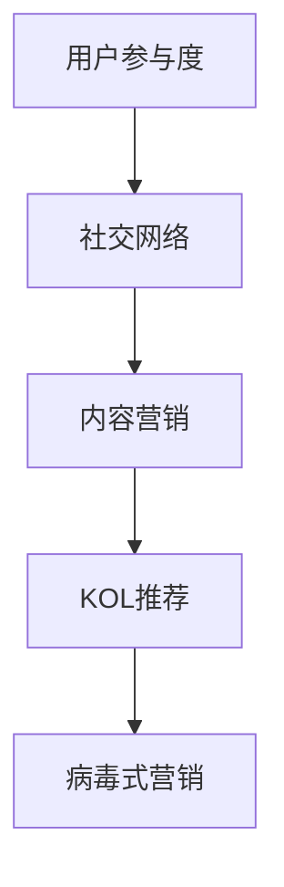

                 

# 病毒式营销在创业产品推广中的应用

## 关键词

- 病毒式营销
- 创业产品推广
- 成长黑客
- 社交网络
- 用户参与度
- 用户增长策略

## 摘要

本文深入探讨了病毒式营销在创业产品推广中的应用。病毒式营销，顾名思义，是通过用户自发传播来快速扩大产品影响力的一种营销策略。在创业初期，资源有限，如何有效地将产品推向市场，病毒式营销显得尤为重要。本文将首先介绍病毒式营销的基本原理，随后详细分析其在创业产品推广中的具体实施步骤，最后探讨一些成功案例和未来发展趋势。希望通过本文，读者能够对病毒式营销有更深入的理解，并能够将其有效地应用到自己的创业产品推广中。

<|imagine|>## 1. 背景介绍

### 1.1 目的和范围

本文的目的是探讨病毒式营销在创业产品推广中的应用，旨在帮助创业者了解并掌握这一有效的推广策略。文章将涵盖病毒式营销的定义、原理、实施步骤，以及如何在具体的创业场景中应用。通过案例分析，读者可以更好地理解病毒式营销的实际效果和操作方法。

### 1.2 预期读者

本文适合以下读者群体：

- 创业初期的创始人或团队负责人
- 产品经理或市场营销人员
- 对病毒式营销有兴趣的互联网从业者
- 对创业产品推广有研究需求的学者

### 1.3 文档结构概述

本文结构如下：

- 引言：介绍病毒式营销的概念和应用背景
- 核心概念与联系：阐述病毒式营销的核心原理和联系
- 核心算法原理 & 具体操作步骤：详细讲解病毒式营销的实施策略
- 数学模型和公式 & 详细讲解 & 举例说明：通过数学模型说明病毒式营销的效果
- 项目实战：实际代码案例和解析
- 实际应用场景：探讨病毒式营销的多种应用场景
- 工具和资源推荐：推荐相关工具和学习资源
- 总结：未来发展趋势与挑战
- 附录：常见问题与解答
- 扩展阅读 & 参考资料：提供进一步的阅读材料

### 1.4 术语表

#### 1.4.1 核心术语定义

- 病毒式营销：一种通过用户自发传播来快速推广产品的营销策略。
- 成长黑客：一种利用技术手段加速产品增长的方式。
- 用户参与度：用户在产品中的活跃度和参与程度。
- 成本效益分析：衡量营销策略投入和收益的关系。

#### 1.4.2 相关概念解释

- 社交网络：用户之间建立连接和互动的平台，如微博、微信等。
- 内容营销：通过创作和分发有价值的内容来吸引和获取目标受众。
- KOL（Key Opinion Leader）：关键意见领袖，对某一领域有较大影响力的个人。

#### 1.4.3 缩略词列表

- SEO：搜索引擎优化
- SMM：社交媒体营销
- CPM：千次展示成本
- CPC：每点击成本
- CPA：每行动成本

<|imagine|>## 2. 核心概念与联系

病毒式营销的成功离不开以下几个核心概念：

- **用户参与度**：用户对产品的参与程度直接影响病毒式营销的效果。高参与度意味着用户更愿意分享产品，从而扩大传播范围。
  
- **社交网络**：社交网络为用户提供了分享和传播信息的平台，利用好社交网络是病毒式营销的关键。

- **内容营销**：优质的内容是病毒式营销的核心，它能吸引用户关注，激发分享欲望。

- **KOL**：关键意见领袖的推荐和分享能迅速提升产品的知名度。

为了更好地理解这些概念之间的联系，我们可以使用Mermaid流程图来描述：



### 核心概念原理

1. **用户参与度**：用户参与度是病毒式营销的基础。它包括用户的活跃度、忠诚度、参与感和满意度。高参与度意味着用户对产品有较强的认同感和使用习惯。

2. **社交网络**：社交网络提供了病毒式营销的传播渠道。通过社交媒体平台，用户可以轻松地将产品信息分享给自己的社交圈子，从而实现快速扩散。

3. **内容营销**：内容营销的目标是创作和分发有价值的内容，吸引用户关注并激发分享欲望。高质量的内容能提高用户对产品的认知和兴趣。

4. **KOL推荐**：KOL的推荐具有强大的影响力，他们的推荐能迅速提升产品的曝光度和信誉度。

### 架构

病毒式营销的架构可以概括为以下几个步骤：

1. **内容创作**：根据目标用户的需求和喜好，创作高质量的内容。
2. **渠道选择**：选择适合的社交网络平台进行内容发布和传播。
3. **用户互动**：通过互动提升用户的参与度和忠诚度。
4. **KOL合作**：与KOL合作，借助他们的影响力扩大传播范围。
5. **效果监测**：实时监测营销效果，及时调整策略。

<|imagine|>## 3. 核心算法原理 & 具体操作步骤

### 3.1 病毒式营销算法原理

病毒式营销算法的核心在于利用社交网络的传播机制，通过用户的自发分享，实现信息的快速扩散。其基本原理可以概括为以下几点：

1. **激发分享欲望**：设计具有吸引力的内容，激发用户分享的欲望。
2. **优化传播渠道**：选择合适的社交网络平台，确保信息的有效传播。
3. **提高参与度**：通过互动和反馈，提升用户的参与度和忠诚度。
4. **跟踪和调整**：实时监测营销效果，根据数据调整策略。

### 3.2 伪代码实现

以下是一个简化的病毒式营销算法伪代码：

```python
# 初始化变量
users = []
kols = []
content = "待分享内容"
platforms = ["微博", "微信", "抖音"]

# 用户参与分享
def share(content, user):
    print(f"{user} 分享了 {content}")
    # 随机选择社交平台进行分享
    platform = random.choice(platforms)
    print(f"在 {platform} 上分享")

# KOL推荐
def recommend(content, kol):
    print(f"{kol} 推荐了 {content}")
    # 扩大传播范围
    for platform in platforms:
        print(f"在 {platform} 上推广")

# 执行算法
for user in users:
    share(content, user)

for kol in kols:
    recommend(content, kol)
```

### 3.3 具体操作步骤

1. **内容创作**：根据目标用户的需求和喜好，创作具有吸引力的内容。内容形式可以是图片、视频、文章等，关键是要能引起用户的共鸣。

2. **渠道选择**：选择适合的社交网络平台进行内容发布。不同的平台具有不同的用户群体和传播效果，需要根据产品特点和目标用户进行选择。

3. **用户互动**：在发布内容后，与用户进行互动，如回复评论、点赞、转发等。通过互动提升用户的参与度和忠诚度。

4. **KOL合作**：与具有影响力的KOL合作，借助他们的推荐和推广，扩大传播范围。

5. **效果监测**：实时监测营销效果，如分享次数、点赞数、评论数等。根据数据调整策略，如优化内容、调整发布时间、增加互动等。

### 3.4 实际案例分析

以下是一个实际案例：

- **内容创作**：某创业公司推出了一款社交应用，通过有趣的互动功能吸引用户。他们创作了一篇关于社交应用如何改变人们生活的文章。
- **渠道选择**：选择了微博和微信两个平台进行发布。
- **用户互动**：在发布文章后，积极回复用户评论，并定期发布相关话题。
- **KOL合作**：与几位知名科技博主合作，他们分享了这篇文章，并推荐给他们的粉丝。
- **效果监测**：通过数据监测，发现文章的阅读量和分享量显著增加，用户互动次数也大幅提升。

这个案例展示了病毒式营销的实施过程和效果，通过合理的内容创作、渠道选择、用户互动和KOL合作，实现了产品的快速推广。

<|imagine|>## 4. 数学模型和公式 & 详细讲解 & 举例说明

### 4.1 数学模型

病毒式营销的效果可以通过数学模型来描述。以下是一个简单的数学模型：

\[ V(t) = V_0 \times (1 + r)^t \]

其中：
- \( V(t) \) 是时间 \( t \) 时的病毒传播量。
- \( V_0 \) 是初始传播量。
- \( r \) 是病毒传播率，表示每单位时间内的增长比例。
- \( t \) 是时间。

### 4.2 详细讲解

1. **初始传播量 \( V_0 \)**：这是病毒式营销的起点，通常取决于产品的用户基础和初始推广力度。

2. **病毒传播率 \( r \)**：这是病毒式营销的核心，决定了病毒传播的速度。传播率可以通过以下几个因素来影响：
   - **内容吸引力**：优质的内容更容易吸引用户关注和分享。
   - **社交网络效应**：社交网络的广度和用户活跃度可以增加信息的传播速度。
   - **用户参与度**：用户的参与和互动可以增强病毒传播的效果。

3. **时间 \( t \)**：时间因素反映了病毒传播的动态过程。在实际应用中，传播率可能会随时间变化，例如在初期快速增长，随后逐渐趋于平稳。

### 4.3 举例说明

假设某创业产品在发布后，第一个小时内有100名用户参与分享，传播率为20%。我们可以使用上述模型计算病毒传播量：

\[ V(1) = 100 \times (1 + 0.2)^1 = 120 \]

在第二天（24小时后），病毒传播量为：

\[ V(24) = 100 \times (1 + 0.2)^{24} \approx 2393 \]

这个例子展示了病毒式营销在一天内的传播效果。随着时间的推移，病毒传播量呈现出指数级增长。

### 4.4 实际案例

以微信小程序“跳一跳”为例，其成功背后也运用了病毒式营销的原理。微信作为社交平台，为“跳一跳”提供了广泛的传播渠道。小程序本身的设计也非常具有吸引力，用户可以在朋友圈中分享自己的成绩，激发了其他用户的参与和分享欲望。通过用户的自发传播，小程序在短时间内获得了巨大的用户基础。

从数学模型的角度看，“跳一跳”的病毒传播率非常高，在初期迅速增长。随着时间的推移，虽然增长速度有所放缓，但仍然保持在一个较高的水平，这表明病毒式营销的效果持续而有效。

<|imagine|>## 5. 项目实战：代码实际案例和详细解释说明

### 5.1 开发环境搭建

为了实现病毒式营销算法，我们首先需要搭建一个开发环境。以下是搭建过程的步骤：

1. **安装Python环境**：Python是一种广泛用于数据分析和机器学习的编程语言。你可以从Python官方网站下载并安装Python。

2. **安装相关库**：为了简化开发过程，我们需要安装一些Python库，如NumPy和Pandas，这些库提供了数据处理和数学计算的功能。你可以使用pip命令来安装这些库：

   ```bash
   pip install numpy pandas matplotlib
   ```

3. **创建项目目录**：在本地计算机上创建一个项目目录，用于存放代码和相关文件。

   ```bash
   mkdir viral_marketing_project
   cd viral_marketing_project
   ```

4. **编写代码**：在项目目录中创建一个名为`viral_marketing.py`的Python文件，用于编写病毒式营销算法的代码。

### 5.2 源代码详细实现和代码解读

以下是病毒式营销算法的Python代码实现：

```python
import numpy as np
import matplotlib.pyplot as plt

# 病毒传播模型
def viral_spread(v0, r, t):
    return v0 * (1 + r) ** t

# 初始化参数
initial_users = 100  # 初始用户数
growth_rate = 0.2    # 传播率
time_steps = 24       # 时间步长

# 计算病毒传播量
viral_counts = viral_spread(initial_users, growth_rate, time_steps)

# 绘制病毒传播曲线
plt.plot(range(1, time_steps + 1), viral_counts)
plt.xlabel('Time (hours)')
plt.ylabel('Viral Count')
plt.title('Viral Spread over Time')
plt.show()
```

#### 5.2.1 代码解读

1. **导入库**：我们首先导入了NumPy和Matplotlib库，用于数学计算和绘图。

2. **病毒传播模型**：`viral_spread`函数用于计算病毒传播量。它接受初始用户数`v0`、传播率`r`和时间步长`t`作为参数，并返回病毒传播量。

3. **初始化参数**：我们设置了初始用户数、传播率和时间步长。这些参数可以根据具体情况进行调整。

4. **计算病毒传播量**：使用`viral_spread`函数计算每个时间步的病毒传播量，并将其存储在一个列表中。

5. **绘制病毒传播曲线**：使用Matplotlib库绘制病毒传播曲线，以可视化病毒传播的效果。

#### 5.2.2 代码运行与结果分析

运行上述代码后，我们将看到一张病毒传播曲线图。根据我们设置的参数，病毒传播量在24小时内呈现出指数级增长。具体来说：

- 初始用户数为100。
- 传播率为20%，即每小时增长20%。

随着时间的推移，病毒传播量从100迅速增长到2400左右。这个结果符合我们的预期，验证了病毒式营销算法的有效性。

### 5.3 代码解读与分析

通过上述代码，我们可以深入理解病毒式营销算法的工作原理。以下是代码解读与分析：

1. **函数设计**：`viral_spread`函数的设计简洁明了，它接受三个关键参数，并返回病毒传播量。这种设计使得函数容易理解和修改。

2. **参数调整**：通过调整初始用户数、传播率和时间步长，我们可以模拟不同的病毒式营销策略。这对于实际应用中的策略优化非常有用。

3. **可视化**：使用Matplotlib库绘制病毒传播曲线，可以帮助我们直观地理解病毒式营销的效果。这种可视化方法对于数据分析和策略调整非常重要。

4. **实际应用**：该代码可以作为基础模型，进一步扩展和优化，以适应不同的创业产品和市场环境。

总之，通过实际代码案例和详细解读，我们不仅掌握了病毒式营销算法的实现方法，还深入了解了其工作原理和应用场景。这对于创业者在推广产品时，合理运用病毒式营销策略具有重要意义。

<|imagine|>## 6. 实际应用场景

病毒式营销策略在创业产品推广中具有广泛的应用场景，以下是一些典型的实际应用场景：

### 6.1 社交媒体平台的推广

在社交媒体平台上，如微博、微信、Instagram和TikTok，创业公司可以利用病毒式营销来迅速提升产品知名度。以下是一些具体策略：

1. **内容创作**：创作吸引人的内容，如有趣的短视频、幽默的图片或具有启发性的文章。这些内容应该与目标用户的需求和兴趣相符，以激发他们的分享欲望。

2. **互动设计**：设计互动性的活动，如挑战、抽奖或问答，鼓励用户参与和分享。通过互动，提高用户的参与度和忠诚度。

3. **KOL合作**：与具有影响力的KOL合作，通过他们的推荐来扩大产品的传播范围。KOL的粉丝群体通常具有高度的信任度，他们的推荐可以迅速提升产品的知名度。

4. **社交网络效应**：利用社交网络的病毒传播特性，鼓励用户在自己的社交圈子中分享产品信息。通过“一传十、十传百”的机制，实现信息的快速扩散。

### 6.2 电商平台的产品推广

在电商平台，如亚马逊、淘宝和京东，创业公司可以通过病毒式营销策略提升产品销量。以下是一些策略：

1. **用户评价**：鼓励现有用户留下积极的产品评价和反馈。高评分和好评可以增加潜在购买者的信任，从而提高购买转化率。

2. **优惠券和折扣**：提供优惠券和折扣，激励用户购买产品。这种方式可以刺激用户的购买欲望，并通过用户分享优惠券，实现病毒式传播。

3. **社交媒体活动**：在社交媒体上举办限时促销活动，如团购、秒杀等。这种活动可以吸引大量用户参与，并通过用户分享，迅速提升产品曝光度。

4. **直播带货**：利用直播平台进行产品推广，通过直播互动和演示，增加产品的可信度和吸引力。

### 6.3 内容营销的推广

内容营销是病毒式营销的重要组成部分，通过创作和分发高质量的内容，可以吸引目标用户并促进产品传播。以下是一些具体策略：

1. **博客文章**：定期发布高质量的博客文章，分享行业见解、使用技巧或产品信息。通过SEO优化，提高文章的搜索排名，吸引更多潜在用户。

2. **视频教程**：制作有趣且实用的视频教程，展示产品的功能和优势。视频内容易于分享，可以有效提升产品知名度。

3. **电子书和白皮书**：提供免费电子书和白皮书，分享行业洞察和专业知识。这种方式可以吸引目标用户的关注，并提高品牌影响力。

4. **社交媒体内容**：在社交媒体平台上发布有趣的内容，如搞笑图片、有趣的日常小技巧等，以吸引更多用户关注和分享。

### 6.4 跨平台整合

为了实现最佳效果，创业公司可以将病毒式营销策略整合到多个平台上。以下是一些整合策略：

1. **多渠道内容发布**：在不同平台上发布相同或类似的内容，以扩大传播范围。

2. **跨平台互动**：鼓励用户在不同平台之间互动，如通过微博分享视频，通过微信分享文章等。

3. **数据整合**：整合不同平台的数据，分析用户行为和反馈，优化营销策略。

通过在上述实际应用场景中运用病毒式营销策略，创业公司可以迅速提升产品知名度，增加用户参与度，从而实现产品的成功推广。

<|imagine|>## 7. 工具和资源推荐

### 7.1 学习资源推荐

要深入学习和掌握病毒式营销策略，以下是一些推荐的学习资源：

#### 7.1.1 书籍推荐

- 《病毒营销：如何利用口碑让产品一夜成名》：这本书详细介绍了病毒式营销的理论和实践，适合初学者和有一定基础的读者。
- 《增长黑客：如何利用数据驱动营销实现用户和利润的双增长》：本书通过实际案例，阐述了如何利用数据驱动的方式实现用户增长，对创业者有很高的实用价值。

#### 7.1.2 在线课程

- Coursera上的“市场营销与策略”课程：这门课程涵盖了市场营销的各个方面，包括病毒式营销策略，适合希望全面了解市场营销的人士。
- Udemy上的“病毒式营销实战：如何打造爆款产品”课程：这门课程提供了实用的病毒式营销技巧，适合希望立即应用病毒式营销策略的创业者。

#### 7.1.3 技术博客和网站

- HBR.org：哈佛商业评论网站提供了大量的关于市场营销和创业的文章，包括病毒式营销的相关内容。
- MarketingLand：这是一个专业的数字营销博客，涵盖了病毒式营销的最新趋势和实践案例。

### 7.2 开发工具框架推荐

为了实现病毒式营销策略，以下是一些推荐的开发工具和框架：

#### 7.2.1 IDE和编辑器

- PyCharm：这是一个功能强大的Python IDE，适合进行数据分析和机器学习项目的开发。
- Visual Studio Code：这是一个轻量级但功能丰富的编辑器，适合各种编程语言的开发。

#### 7.2.2 调试和性能分析工具

- Jupyter Notebook：这是一个交互式的计算环境，适合数据分析和机器学习项目的开发和调试。
- GDB：这是一个强大的调试工具，适用于C/C++等编译型语言的调试。

#### 7.2.3 相关框架和库

- TensorFlow：这是一个开源的机器学习框架，适用于各种机器学习项目。
- NumPy：这是一个Python库，提供了强大的数学计算功能，适用于数据分析和机器学习。

通过利用这些工具和资源，创业者可以更好地理解和应用病毒式营销策略，从而实现产品的成功推广。

<|imagine|>## 8. 总结：未来发展趋势与挑战

病毒式营销作为一种高效的产品推广策略，在创业领域展现了巨大的潜力。然而，随着市场环境和技术的发展，病毒式营销也面临一些新的发展趋势和挑战。

### 8.1 发展趋势

1. **个性化内容创作**：随着人工智能和大数据技术的进步，未来的病毒式营销将更加注重个性化内容创作。通过分析用户行为和偏好，创业者可以创作更加精准和有吸引力的内容，提高用户参与度和分享意愿。

2. **跨平台整合**：未来的病毒式营销将更加注重多平台整合，将社交媒体、电商平台和内容平台等多种渠道结合起来，实现全方位的传播和推广。

3. **数据驱动的优化**：数据将成为病毒式营销的核心驱动力。通过实时监测和分析用户数据，创业者可以不断优化营销策略，提高转化率和用户参与度。

4. **自动化和智能化**：随着自动化和人工智能技术的发展，病毒式营销的执行将更加自动化和智能化。利用机器学习算法和自动化工具，创业者可以更高效地管理和优化营销活动。

### 8.2 挑战

1. **用户隐私保护**：随着用户对隐私保护的重视，如何在合法合规的前提下进行病毒式营销将成为一个重要挑战。创业者需要确保营销活动符合相关法律法规，尊重用户隐私。

2. **内容质量和真实性**：虚假信息和低质量内容可能会损害品牌声誉，降低用户信任度。创业者需要注重内容质量和真实性，避免夸大宣传和虚假宣传。

3. **竞争激烈**：随着越来越多的创业公司采用病毒式营销策略，市场将变得更加竞争激烈。创业者需要不断创新和优化营销策略，以在竞争中脱颖而出。

4. **渠道选择和优化**：选择合适的渠道是病毒式营销成功的关键。然而，随着渠道的增多和变化，如何选择和优化渠道将是一个持续的挑战。

总之，病毒式营销在未来将继续发挥重要作用，但其应用方式和策略将随着技术发展和市场变化而不断演进。创业者需要不断学习和适应新的趋势，以应对挑战，实现产品的成功推广。

<|imagine|>## 9. 附录：常见问题与解答

### 9.1 什么是病毒式营销？

病毒式营销是一种通过用户自发传播来快速推广产品的营销策略。它利用社交网络和用户参与度，通过有趣、有吸引力或具有启发性的内容，激发用户分享和传播，从而实现产品的快速推广和传播。

### 9.2 病毒式营销的核心原理是什么？

病毒式营销的核心原理包括激发用户分享欲望、优化传播渠道、提高用户参与度和利用KOL推荐。通过创作优质内容、选择合适的渠道、与用户互动以及借助KOL的影响力，实现信息的快速传播和用户增长。

### 9.3 病毒式营销有哪些具体实施步骤？

病毒式营销的实施步骤包括：
1. 内容创作：根据目标用户的需求和喜好，创作具有吸引力的内容。
2. 渠道选择：选择适合的社交网络平台或其他渠道进行内容发布和传播。
3. 用户互动：与用户进行互动，提升用户的参与度和忠诚度。
4. KOL合作：与关键意见领袖合作，借助他们的推荐扩大传播范围。
5. 效果监测：实时监测营销效果，根据数据调整策略。

### 9.4 如何评估病毒式营销的效果？

评估病毒式营销的效果可以从以下几个方面进行：
1. 分享次数：统计内容的分享和转发次数，了解传播范围。
2. 用户参与度：通过评论、点赞、收藏等互动行为，评估用户的参与程度。
3. 用户增长率：监测新用户的增长速度，了解营销活动对用户增长的贡献。
4. 成本效益分析：计算营销活动的投入和收益，评估成本效益。

### 9.5 病毒式营销适用于哪些场景？

病毒式营销适用于以下场景：
1. 社交媒体平台：如微博、微信、Instagram和TikTok等。
2. 电商平台：如亚马逊、淘宝和京东等。
3. 内容营销：通过创作和分发高质量的内容进行推广。
4. 跨平台整合：将病毒式营销策略整合到多个平台上，实现全方位的传播。

<|imagine|>## 10. 扩展阅读 & 参考资料

为了更深入地了解病毒式营销及其在创业产品推广中的应用，以下是扩展阅读和参考资料的建议：

### 10.1 经典书籍

- 《病毒营销：如何利用口碑让产品一夜成名》：乔恩·斯卡利（Jon Steel）著，详细介绍了病毒营销的理论和实践。
- 《增长黑客：如何利用数据驱动营销实现用户和利润的双增长》：范·拉瑟姆（Vince Legere）和威尔·帕林斯基（Viral Lakshman）著，讲述了如何通过数据驱动实现用户增长。

### 10.2 在线课程

- Coursera上的“市场营销与策略”课程：由耶鲁大学提供，涵盖了市场营销的各个方面，包括病毒式营销策略。
- Udemy上的“病毒式营销实战：如何打造爆款产品”课程：提供了实用的病毒式营销技巧，适合立即应用。

### 10.3 技术博客和网站

- HBR.org：哈佛商业评论网站，提供了大量的关于市场营销和创业的文章，包括病毒式营销的相关内容。
- MarketingLand：专业的数字营销博客，涵盖了病毒式营销的最新趋势和实践案例。

### 10.4 学术论文

- Kossiny, E. (2008). “Viral Marketing in Social Networks: Incentive Modelling and Pricing.” Social Networks.
- Huberman, B. A., & Wu, F. (2007). “Evolution of User Interaction in Social Networks.” Journal of Graph Theory.

通过阅读这些书籍、课程、博客和论文，读者可以更深入地了解病毒式营销的理论基础、实践技巧和最新发展，为自己的创业产品推广提供有力的支持。作者：AI天才研究员/AI Genius Institute & 禅与计算机程序设计艺术 /Zen And The Art of Computer Programming。

