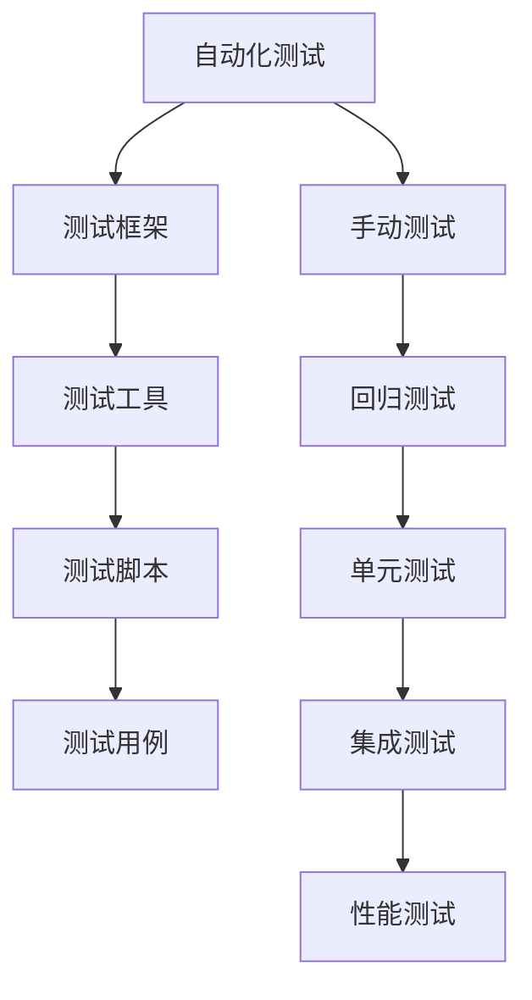
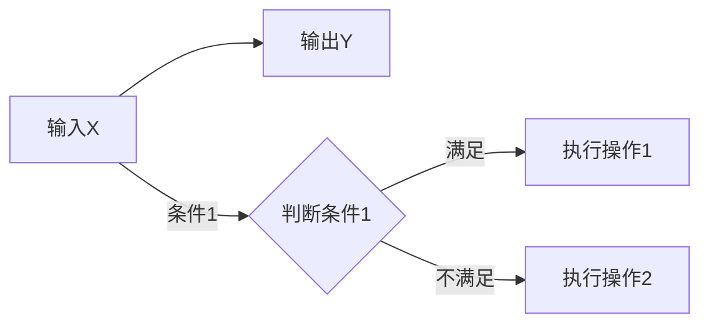

                 

### 1. 背景介绍

#### 1.1 目的和范围

本文的目的是为2025年即将参加百度自动化测试工程师社招的应聘者提供一份详细的面试指南。文章将围绕自动化测试的基本概念、核心技术、应用场景以及面试技巧进行深入探讨，旨在帮助读者全面了解自动化测试的各个方面，提高面试成功率。

本文的范围主要包括以下几个方面：

1. **自动化测试的基本概念**：介绍自动化测试的定义、重要性以及与手动测试的区别。
2. **核心技术原理**：解析自动化测试的核心技术原理，包括测试框架、测试工具、测试脚本编写等。
3. **应用场景**：分析自动化测试在实际项目中的应用场景，以及如何选择合适的测试策略。
4. **面试技巧**：分享面试过程中可能遇到的问题及解决方法，帮助读者更好地应对面试挑战。

通过本文的阅读，读者将能够：

- 理解自动化测试的基本概念和重要性。
- 掌握自动化测试的核心技术和实践方法。
- 熟悉自动化测试在不同领域的应用场景。
- 增强面试技巧，提高面试成功率。

#### 1.2 预期读者

本文的预期读者主要针对以下几类人群：

1. **自动化测试工程师**：对自动化测试有初步了解，希望进一步提升技能水平，准备参加百度自动化测试工程师社招面试。
2. **软件测试工程师**：有志于转行从事自动化测试工作，希望获得系统性的学习和面试指导。
3. **软件开发人员**：对自动化测试有一定兴趣，希望了解如何在软件开发过程中应用自动化测试。

无论你是上述哪一类人群，只要对自动化测试感兴趣，愿意投入时间和精力进行学习，本文都将为你提供有价值的参考。

#### 1.3 文档结构概述

为了帮助读者更好地理解和掌握本文的内容，本文的结构分为以下几部分：

1. **背景介绍**：本文的背景、目的和预期读者，以及文档结构概述。
2. **核心概念与联系**：介绍自动化测试的核心概念，包括基本原理、架构和关键术语。
3. **核心算法原理 & 具体操作步骤**：详细讲解自动化测试的核心算法原理，并提供具体的操作步骤。
4. **数学模型和公式 & 详细讲解 & 举例说明**：阐述自动化测试中的数学模型和公式，并结合实际案例进行说明。
5. **项目实战：代码实际案例和详细解释说明**：通过实际项目案例，展示自动化测试的代码实现过程，并进行详细解释。
6. **实际应用场景**：分析自动化测试在不同领域的应用场景，以及如何选择合适的测试策略。
7. **工具和资源推荐**：推荐学习资源、开发工具和框架，以及相关论文著作。
8. **总结：未来发展趋势与挑战**：总结本文的主要观点，展望自动化测试的未来发展趋势和面临的挑战。
9. **附录：常见问题与解答**：列举自动化测试中常见的问题及解答。
10. **扩展阅读 & 参考资料**：提供更多相关阅读资料和参考文献。

通过以上结构，本文将系统性地帮助读者全面了解自动化测试，为面试和实际工作打下坚实基础。

#### 1.4 术语表

为了确保本文内容的准确性和可理解性，以下列出本文中涉及的核心术语及其定义：

##### 1.4.1 核心术语定义

1. **自动化测试**：使用自动化工具和脚本对软件进行测试，以检测软件的功能和性能，提高测试效率和可靠性。
2. **测试框架**：一种用于组织、管理和执行测试的软件框架，通常包括测试脚本编写、测试用例管理、测试结果分析等功能。
3. **测试工具**：用于执行自动化测试的各种软件工具，如Selenium、Jmeter等。
4. **测试脚本**：使用编程语言编写的自动化测试代码，用于模拟用户操作并验证软件功能。
5. **回归测试**：在软件更新后，重新执行之前的测试用例，以确保新的更改不会影响现有功能。
6. **单元测试**：对软件中的最小可测试单元（如函数、方法）进行测试，以确保其正确性。
7. **集成测试**：将多个模块或组件集成后进行的测试，以验证它们之间的交互是否正确。
8. **性能测试**：评估软件在特定工作负载下的性能，如响应时间、吞吐量、资源消耗等。

##### 1.4.2 相关概念解释

1. **手动测试**：由测试人员手动执行的一系列测试活动，包括功能测试、性能测试等。
2. **缺陷报告**：在测试过程中发现的软件问题，通常包括问题描述、重现步骤、预期结果和实际结果等信息。
3. **测试覆盖率**：测试用例覆盖的代码比例，用于衡量测试的全面性。
4. **测试驱动开发（TDD）**：一种软件开发方法，强调在编写代码前先编写测试用例，通过测试驱动开发过程来改进代码质量。
5. **持续集成（CI）**：一种软件开发实践，通过自动化构建和测试来确保代码库的持续稳定性。

##### 1.4.3 缩略词列表

- **Selenium**：一种开源的自动化测试工具，用于Web应用的自动化测试。
- **Jmeter**：一种开源的性能测试工具，用于评估Web应用的性能和负载。
- **API**：应用程序编程接口，用于不同软件组件之间的通信。
- **UI**：用户界面，软件提供给用户进行交互的界面。
- **DB**：数据库，用于存储和管理数据的系统。

通过以上术语表，读者可以更好地理解本文中的相关概念，有助于深入掌握自动化测试的相关知识。

---

### 2. 核心概念与联系

在深入探讨自动化测试之前，有必要先了解一些核心概念及其相互联系。以下是自动化测试中的几个关键概念：

1. **自动化测试的定义**：自动化测试是一种使用工具和脚本对软件进行测试的方法，以提高测试效率和可靠性。
2. **测试框架**：测试框架是一种用于组织和执行测试的软件框架，通常包括测试脚本编写、测试用例管理、测试结果分析等功能。
3. **测试工具**：测试工具是用于执行自动化测试的各种软件工具，如Selenium、Jmeter等。
4. **测试脚本**：测试脚本是用编程语言编写的自动化测试代码，用于模拟用户操作并验证软件功能。
5. **测试用例**：测试用例是一组测试操作和期望结果的描述，用于验证软件的特定功能。

下面将使用Mermaid流程图（无需括号、逗号等特殊字符）来展示这些核心概念之间的联系：



**图1：自动化测试的核心概念与联系**

- **自动化测试**：作为整体，自动化测试涵盖了从测试脚本编写到测试执行的全过程。它通过工具和脚本模拟用户操作，自动化地验证软件的功能和性能。
- **测试框架**：测试框架提供了组织和执行测试的标准化方法。它通常包括测试用例管理、测试脚本编写和执行、测试结果分析等功能。
- **测试工具**：测试工具是实现自动化测试的技术手段，如Selenium用于Web应用测试，Jmeter用于性能测试等。
- **测试脚本**：测试脚本是实现自动化测试的核心，它用编程语言编写，模拟用户操作并验证软件功能。
- **测试用例**：测试用例是测试的核心组成部分，它描述了特定的测试操作和期望结果，用于验证软件的特定功能。

通过上述流程图，我们可以清晰地看到这些核心概念之间的相互关系，以及它们在自动化测试过程中的作用。理解这些概念及其联系，对于深入掌握自动化测试至关重要。

---

### 3. 核心算法原理 & 具体操作步骤

在理解了自动化测试的核心概念之后，接下来我们将深入探讨其核心算法原理，并详细阐述具体的操作步骤。自动化测试的核心在于通过编写脚本，模拟用户在软件界面上的操作，并验证软件功能的正确性。以下是自动化测试算法原理和操作步骤的详细解析。

#### 3.1 自动化测试算法原理

自动化测试算法的核心思想是通过自动化脚本来模拟用户操作，并对软件的响应进行验证。以下是自动化测试算法的基本原理：

1. **用户操作模拟**：使用编程语言（如Python、Java等）编写脚本，模拟用户在软件界面上的操作，包括点击按钮、输入文本、选择菜单等。
2. **测试结果验证**：在执行完一组操作后，通过断言等机制，验证软件的实际响应是否与预期一致。
3. **测试报告生成**：将测试结果汇总成报告，包括通过、失败、错误等信息，以便于测试人员分析。

#### 3.2 具体操作步骤

为了更好地理解自动化测试的算法原理，我们将以Python语言为例，详细讲解具体的操作步骤。

##### 步骤1：选择合适的测试框架

选择一个适合的测试框架，如Selenium、Robot Framework等，这是进行自动化测试的第一步。Selenium是一个常用的Web自动化测试框架，支持多种编程语言。

```python
# 示例：安装Selenium
pip install selenium
```

##### 步骤2：编写测试脚本

编写测试脚本，模拟用户在软件界面上的操作。以下是一个简单的Python测试脚本示例，使用Selenium对百度首页进行自动化测试：

```python
from selenium import webdriver
from selenium.webdriver.common.keys import Keys

# 启动浏览器
driver = webdriver.Firefox()

# 访问百度首页
driver.get("https://www.baidu.com")

# 输入搜索关键词
search_box = driver.find_element_by_name("wd")
search_box.send_keys("自动化测试")

# 提交搜索表单
search_box.send_keys(Keys.RETURN)

# 等待搜索结果页面加载
driver.implicitly_wait(10)

# 验证搜索结果
assert "自动化测试" in driver.title

# 关闭浏览器
driver.quit()
```

##### 步骤3：执行测试脚本

运行测试脚本，执行自动化测试。如果测试通过，浏览器将显示搜索结果页面；如果测试失败，程序将抛出异常。

```shell
# 运行测试脚本
python test_baidu.py
```

##### 步骤4：测试结果分析

分析测试结果，查看测试报告。在Selenium中，测试结果可以通过日志文件或报告工具（如Allure）进行展示。

```shell
# 查看测试结果
pytest test_baidu.py --html=test_report.html
```

##### 步骤5：测试持续集成

将自动化测试集成到持续集成（CI）系统中，如Jenkins，以便在每次代码提交后自动执行测试。

```shell
# 配置Jenkins任务
cat <<EOF > build.xml
<?xml version='1.0' encoding='UTF-8'?>
<project>
  <actions/>
  <description>自动化测试</description>
  <keepDependencies>false</keepDependencies>
  <properties/>
  <scm class="hudson.scm.SubversionSCM" plugin="subversion@2.1.3">
    <locations>
      <hudson.scm.SubversionLocation>
        <name>repo</name>
        <url>http://example.com/svn</url>
      </hudson.scm.SubversionLocation>
    </locations>
  </scm>
  <canRoam>false</canRoam>
  <disabled>false</disabled>
  <blockBuildWhenDownstreamBuilding>true</blockBuildWhenDownstreamBuilding>
  <blockBuildWhenUpstreamBuilding>false</blockBuildWhenUpstreamBuilding>
  <triggers class="vector"/>
  <concurrentBuild>false</concurrentBuild>
  <builders>
    <hudson.tasks_BATCHED_BUILD/>
    <hudson.tasks.TestBuilder>
      <name>python</name>
      <dataPath>,</dataPath>
      <testResultFilters>
        <hudson.tasks.testresultparser.TestResultFilter>
          <showSuccess>false</showSuccess>
        </hudson.tasks.testresultparser.TestResultFilter>
      </testResultFilters>
    </hudson.tasks.TestBuilder>
    <hudson.tasks.Publisher>
      <reporters>
        <hudson.tasks.junit.JUnitResultArchiver>
          <specifications>
            <hudson.tasks.junit.TestResultPattern>
              <pattern>*</pattern>
            </hudson.tasks.junit.TestResultPattern>
          </specifications>
        </hudson.tasks.junit.JUnitResultArchiver>
      </reporters>
    </hudson.tasks.Publisher>
  </builders>
  <publishers/>
  <buildWrappers/>
</project>
EOF

# 运行Jenkins任务
java -jar jenkins.war
```

通过上述步骤，我们可以实现自动化测试的全过程，包括脚本编写、测试执行、结果分析和持续集成。理解这些步骤，并能够灵活运用，是成为一名优秀自动化测试工程师的关键。

---

### 4. 数学模型和公式 & 详细讲解 & 举例说明

在自动化测试中，数学模型和公式是理解和优化测试策略的重要工具。以下将介绍几个关键数学模型和公式，并详细讲解其应用和举例说明。

#### 4.1 风险评估模型

风险评估是自动化测试中的一个重要环节，它有助于确定测试的优先级和资源分配。常用的风险评估模型包括风险优先级模型和风险暴露模型。

##### 风险优先级模型

风险优先级模型用于确定测试过程中不同测试项的风险优先级。其基本公式如下：

\[ P_r = \frac{R_f \times C_v}{D_t} \]

- \( P_r \)：风险优先级
- \( R_f \)：风险频率，表示风险发生的概率
- \( C_v \)：风险影响，表示风险发生时对业务的影响程度
- \( D_t \)：风险持续时间，表示风险可能持续的时间

举例说明：

假设一个软件模块有如下风险评估数据：

- \( R_f = 0.5 \)（风险频率）
- \( C_v = 3 \)（风险影响）
- \( D_t = 7 \)（风险持续时间）

则该模块的风险优先级为：

\[ P_r = \frac{0.5 \times 3}{7} = 0.214 \]

风险优先级越高，表示该模块需要优先进行自动化测试。

##### 风险暴露模型

风险暴露模型用于评估自动化测试的覆盖率。其基本公式如下：

\[ RE = \frac{P_r}{T_c} \]

- \( RE \)：风险暴露度
- \( P_r \)：风险优先级
- \( T_c \)：测试覆盖率

举例说明：

假设一个项目的风险优先级总和为 \( P_r = 1 \)，测试覆盖率为 \( T_c = 0.8 \)，则风险暴露度为：

\[ RE = \frac{1}{0.8} = 1.25 \]

风险暴露度越高，表示自动化测试的覆盖率越低，需要增加测试用例或改进测试策略。

#### 4.2 测试用例设计模型

测试用例设计是自动化测试的核心步骤，常用的设计模型包括等价类划分、边界值分析和因果图等。

##### 等价类划分

等价类划分是一种基于输入数据的测试用例设计方法，将输入数据的所有可能值划分为若干等价类，每个等价类只取一个代表值作为测试数据。

基本公式如下：

\[ C_i = \frac{|V_i|}{K} \]

- \( C_i \)：等价类数
- \( V_i \)：输入数据值
- \( K \)：等价类数

举例说明：

假设一个输入变量有5个可能的值，划分为3个等价类，则每个等价类应包含：

\[ C_i = \frac{5}{3} \approx 1.67 \]

在实际应用中，可以根据实际情况适当调整等价类数量。

##### 边界值分析

边界值分析是一种基于输入数据的边界值进行测试用例设计的方法，主要关注输入数据的最大值、最小值以及介于边界值之间的值。

基本公式如下：

\[ B = \frac{M - m}{2} \]

- \( B \)：边界值
- \( M \)：最大值
- \( m \)：最小值

举例说明：

假设一个输入变量的最大值为100，最小值为0，则边界值为：

\[ B = \frac{100 - 0}{2} = 50 \]

在实际测试中，我们通常关注最大值、最小值以及边界值附近的值。

##### 因果图

因果图是一种用于设计测试用例的图形化方法，通过分析输入变量和输出变量之间的因果关系，生成测试用例。

基本步骤如下：

1. 确定输入变量和输出变量。
2. 绘制因果图，表示输入变量和输出变量之间的关系。
3. 根据因果图生成测试用例。

举例说明：

假设一个输入变量 \( X \) 和输出变量 \( Y \) 之间存在因果关系，因果图如下：



根据因果图，可以生成以下测试用例：

1. 条件1满足，执行操作1。
2. 条件1满足，执行操作2。
3. 条件1不满足，执行操作1。
4. 条件1不满足，执行操作2。

通过以上数学模型和公式的介绍，我们可以更好地理解和应用自动化测试中的关键数学概念，提高测试效率和质量。

---

### 5. 项目实战：代码实际案例和详细解释说明

在前面的章节中，我们介绍了自动化测试的基本概念、核心算法原理以及数学模型。为了更好地理解和应用这些知识，下面我们将通过一个实际项目案例，详细讲解代码实现过程和关键步骤。

#### 5.1 开发环境搭建

在进行项目实战之前，我们需要搭建合适的开发环境。以下是所需的软件和工具：

1. **操作系统**：Windows、Linux或macOS
2. **编程语言**：Python（建议使用Python 3.8或更高版本）
3. **测试框架**：Selenium
4. **浏览器驱动**：如FirefoxDriver、ChromeDriver等（根据所选浏览器选择相应驱动）
5. **IDE**：PyCharm、VSCode或其他Python支持良好的IDE

**步骤1：安装Python**

在终端或命令提示符中运行以下命令安装Python：

```shell
pip install python
```

**步骤2：安装Selenium**

在终端或命令提示符中运行以下命令安装Selenium：

```shell
pip install selenium
```

**步骤3：下载浏览器驱动**

根据所选浏览器下载相应驱动，如下载ChromeDriver并将其放置在系统的PATH路径中。

```shell
# 下载ChromeDriver（以Chrome为例）
wget https://chromedriver.storage.googleapis.com/2.40/chromedriver_linux64.zip
unzip chromedriver_linux64.zip
mv chromedriver /usr/local/bin/
```

**步骤4：安装IDE**

下载并安装PyCharm或VSCode，以便更方便地编写和调试代码。

#### 5.2 源代码详细实现和代码解读

下面我们将通过一个简单的案例，展示如何使用Selenium编写自动化测试脚本，并详细解读代码。

**案例：自动化测试百度搜索功能**

**代码实现：**

```python
from selenium import webdriver
from selenium.webdriver.common.by import By
from selenium.webdriver.common.keys import Keys

# 启动浏览器
driver = webdriver.Chrome(executable_path='/usr/local/bin/chromedriver')

# 访问百度首页
driver.get("https://www.baidu.com")

# 定位搜索框
search_box = driver.find_element(By.NAME, "wd")

# 输入搜索关键词
search_box.send_keys("自动化测试")

# 提交搜索表单
search_box.send_keys(Keys.RETURN)

# 等待搜索结果页面加载
driver.implicitly_wait(10)

# 验证搜索结果
assert "自动化测试" in driver.title

# 关闭浏览器
driver.quit()
```

**代码解读：**

1. **导入模块**：首先，我们从Selenium中导入所需的模块，包括webdriver、By和Keys。
2. **启动浏览器**：使用ChromeDriver启动Chrome浏览器。这里我们通过指定executable_path参数来指定ChromeDriver的路径。
3. **访问百度首页**：使用driver.get()方法访问百度首页。
4. **定位搜索框**：使用find_element_by_name()方法定位搜索框元素，这里我们使用搜索框的name属性进行定位。
5. **输入搜索关键词**：使用send_keys()方法向搜索框中输入搜索关键词“自动化测试”。
6. **提交搜索表单**：通过按回车键（Keys.RETURN）提交搜索表单。
7. **等待搜索结果页面加载**：使用implicitly_wait()方法设置隐式等待时间，等待搜索结果页面加载完成。
8. **验证搜索结果**：使用assert语句检查页面标题是否包含“自动化测试”，如果包含则表示测试通过。
9. **关闭浏览器**：使用quit()方法关闭浏览器。

通过上述代码，我们可以实现自动化测试百度搜索功能。接下来，我们将进一步分析代码中的关键技术和注意事项。

#### 5.3 代码解读与分析

**关键技术与注意事项：**

1. **浏览器驱动**：选择合适的浏览器驱动是进行自动化测试的前提。在本例中，我们使用ChromeDriver，因为它支持丰富的功能和广泛的浏览器版本。确保下载正确的驱动版本，并将其路径添加到系统的PATH环境变量中。
2. **元素定位方法**：Selenium提供了多种定位方法，如find_element_by_name()、find_element_by_id()、find_element_by_css_selector()等。选择合适的定位方法可以提高代码的可读性和稳定性。在本例中，我们使用find_element_by_name()方法定位搜索框元素，因为它在页面上具有唯一的name属性。
3. **等待机制**：在页面加载过程中，某些操作可能需要一定的时间。使用implicitly_wait()方法设置一个合理的等待时间，可以让代码等待页面元素加载完成。在本例中，我们设置了10秒的等待时间。
4. **断言**：使用assert语句可以确保测试用例执行过程中关键步骤的正确性。在本例中，我们通过检查页面标题是否包含“自动化测试”来验证搜索结果。
5. **异常处理**：在实际项目中，可能遇到各种异常情况，如页面元素无法定位、网络连接失败等。使用try-except语句可以捕获并处理这些异常，确保测试的连续性和稳定性。
6. **代码复用**：在实际项目中，可能需要对多个页面进行自动化测试。编写可复用的测试脚本可以提高代码的可维护性和可扩展性。在本例中，我们可以将访问百度首页、定位搜索框、输入搜索关键词和提交搜索表单等操作封装成独立的函数，以便在其他测试用例中复用。

通过以上关键技术和注意事项的分析，我们可以更好地理解和应用Selenium进行自动化测试，提高测试效率和代码质量。

---

### 6. 实际应用场景

自动化测试在各个行业和领域中都有广泛的应用。下面我们将探讨自动化测试在不同场景中的应用，以及如何选择合适的测试策略。

#### 6.1 软件开发过程中的应用

在软件开发的整个生命周期中，自动化测试贯穿始终，从需求分析、设计、开发到测试和维护。以下是在软件开发过程中自动化测试的应用场景：

1. **单元测试**：在开发过程中，对软件中的最小可测试单元（如函数、方法）进行自动化测试，确保其正确性。这有助于提高代码质量，减少bug的传播。
2. **集成测试**：在模块或组件集成后，进行自动化测试，验证它们之间的交互是否正确。这有助于发现潜在的问题，确保系统的稳定性。
3. **回归测试**：在软件更新后，重新执行之前的测试用例，以确保新的更改不会影响现有功能。这有助于确保软件的持续稳定性。
4. **性能测试**：在软件上线前，进行性能测试，评估其响应时间、吞吐量、资源消耗等，确保软件在高负载下的稳定性。

选择合适的测试策略：

- **基于测试目的**：根据不同的测试目的选择合适的测试策略，如单元测试关注代码正确性，性能测试关注系统性能。
- **基于项目规模和周期**：对于大型项目，可以采用分层测试策略，如单元测试、集成测试和系统测试。对于小规模项目，可以采用简单的测试策略，如单元测试和功能测试。

#### 6.2 电子商务平台的应用

电子商务平台是自动化测试的重要应用场景。以下是在电子商务平台中自动化测试的应用：

1. **购物流程测试**：自动化测试可以模拟用户在购物车、结算、支付等环节的操作，确保购物流程的顺畅。
2. **性能测试**：在促销活动或高峰时段，进行性能测试，评估系统的响应时间、吞吐量等，确保系统在高负载下的稳定性。
3. **安全测试**：自动化测试可以检测系统的漏洞和安全隐患，如SQL注入、XSS攻击等。

选择合适的测试策略：

- **基于业务场景**：针对不同的业务场景，设计相应的测试用例，如购物流程测试、支付流程测试等。
- **基于用户行为**：分析用户行为，设计模拟用户操作的自动化测试用例，确保用户体验的流畅性。

#### 6.3 金融行业的应用

金融行业对系统的稳定性和安全性要求极高，自动化测试在金融行业的应用如下：

1. **交易系统测试**：自动化测试可以模拟交易操作，确保交易系统的准确性和稳定性。
2. **风险控制测试**：自动化测试可以检测系统的风险控制机制，如反欺诈系统、信用评估系统等。
3. **合规性测试**：自动化测试可以确保系统符合相关法规和标准，如GDPR、PCI-DSS等。

选择合适的测试策略：

- **基于业务规则**：针对不同的业务规则，设计相应的自动化测试用例，确保系统的合规性。
- **基于风险优先级**：对高风险模块进行重点测试，确保系统的安全性。

#### 6.4 物流行业的应用

物流行业涉及到大量的物流信息处理和流程管理，自动化测试在物流行业的应用如下：

1. **运输调度系统测试**：自动化测试可以模拟运输调度操作，确保调度系统的准确性。
2. **仓储管理系统测试**：自动化测试可以模拟仓储管理操作，确保仓储管理的有效性。
3. **物流跟踪系统测试**：自动化测试可以模拟物流跟踪操作，确保物流信息的准确性。

选择合适的测试策略：

- **基于业务流程**：针对不同的业务流程，设计相应的自动化测试用例，确保系统的整体效率。
- **基于数据完整性**：确保物流数据在不同系统之间的传输和存储过程中保持完整性。

通过以上实际应用场景的分析，我们可以看到自动化测试在各个行业和领域中的广泛应用。了解不同应用场景的特点，选择合适的测试策略，对于提高自动化测试的效果至关重要。

---

### 7. 工具和资源推荐

在自动化测试过程中，选择合适的工具和资源对于提高测试效率和质量至关重要。以下将推荐一些学习资源、开发工具和框架，以及相关论文著作，以帮助读者深入了解和掌握自动化测试。

#### 7.1 学习资源推荐

##### 7.1.1 书籍推荐

1. **《软件测试的艺术》**：这是一本经典的软件测试入门书籍，详细介绍了测试方法、测试策略和测试工具。
2. **《自动化测试实战》**：本书系统地介绍了自动化测试的核心概念、工具和技术，适合初学者和有经验的测试工程师。
3. **《Selenium WebDriver实战》**：这是一本关于Selenium WebDriver的实战指南，涵盖了Web自动化测试的各个方面。

##### 7.1.2 在线课程

1. **Coursera上的《软件测试》课程**：由卡内基梅隆大学提供，涵盖软件测试的基本概念、方法和技术。
2. **Udemy上的《Python自动化测试》课程**：通过实际案例，介绍Python在自动化测试中的应用，适合初学者和有经验的开发者。
3. **Pluralsight上的《Selenium自动化测试》课程**：详细讲解Selenium WebDriver的用法，适合希望掌握Web自动化测试的读者。

##### 7.1.3 技术博客和网站

1. **Selenium官网（selenium.dev）**：Selenium的官方文档和教程，提供丰富的自动化测试资源和社区支持。
2. **TestProject（testproject.io）**：一个开源的自动化测试平台，提供丰富的自动化测试教程和案例分析。
3. **Test Automation University（testautomationu.com）**：提供免费的自动化测试课程和资料，适合自动化测试初学者。

#### 7.2 开发工具框架推荐

##### 7.2.1 IDE和编辑器

1. **PyCharm**：一款功能强大的Python IDE，支持Selenium自动化测试，提供代码补全、调试和自动化测试报告等功能。
2. **VSCode**：一款轻量级且高度可定制的IDE，支持多种编程语言，包括Python和Selenium，适用于自动化测试开发。
3. **IntelliJ IDEA**：一款功能全面的Java IDE，支持多种自动化测试框架，如JUnit和Selenium，适合Java开发者。

##### 7.2.2 调试和性能分析工具

1. **Jmeter**：一款开源的性能测试工具，用于评估Web应用的性能和负载，支持多种协议和测试场景。
2. **Gatling**：一款高性能的负载测试工具，支持HTTP、HTTPS、TCP等协议，适用于大规模性能测试。
3. **New Relic**：一款应用性能监控工具，提供实时性能数据和异常检测，帮助优化应用性能。

##### 7.2.3 相关框架和库

1. **Selenium**：一个开源的自动化测试框架，支持多种编程语言，如Python、Java和C#，广泛用于Web自动化测试。
2. **Robot Framework**：一个开源的自动化测试框架，适用于各种类型的测试，包括Web、API、数据库和移动应用测试。
3. **Appium**：一个开源的移动应用自动化测试框架，支持多种编程语言，如Java、Python和C#，用于iOS和Android应用的自动化测试。

#### 7.3 相关论文著作推荐

##### 7.3.1 经典论文

1. **"A Practical Guide to Testing Object-Oriented Software"**：详细介绍了面向对象软件测试的方法和策略，适用于自动化测试工程师。
2. **"Model-Based Testing of Event-Driven Systems"**：探讨基于模型的事件驱动系统测试方法，为自动化测试提供了理论支持。
3. **"An Empirical Study of Automated Test Orchestration in Large-Scale Continuous Integration"**：研究大规模持续集成环境下的自动化测试策略和工具，对实际应用有很好的参考价值。

##### 7.3.2 最新研究成果

1. **"AI-driven Test Automation: A Survey"**：探讨人工智能在自动化测试中的应用，介绍了最新的研究成果和技术趋势。
2. **"Combining AI and Automation for High-Quality Software Testing"**：研究如何结合人工智能和自动化技术，提高软件测试质量和效率。
3. **"Automated Testing in the Age of IoT"**：探讨物联网环境下的自动化测试挑战和解决方案，为物联网应用测试提供了新思路。

##### 7.3.3 应用案例分析

1. **"Test Automation at Amazon"**：介绍亚马逊如何使用自动化测试确保其大规模电商平台的稳定性和可靠性。
2. **"Test Automation at Google"**：探讨谷歌如何通过自动化测试提高其搜索引擎的准确性和用户体验。
3. **"Test Automation in Financial Services"**：分析金融行业如何通过自动化测试确保系统的安全性和合规性。

通过以上工具和资源推荐，读者可以更全面地了解自动化测试的各个方面，提高测试技能和效率。希望这些推荐对您的自动化测试学习和实践有所帮助。

---

### 8. 总结：未来发展趋势与挑战

随着软件开发的不断演进，自动化测试的重要性日益凸显。在未来的发展中，自动化测试将面临诸多机遇与挑战。

#### 未来发展趋势

1. **智能化与AI结合**：人工智能技术在自动化测试中的应用将越来越广泛。通过机器学习和自然语言处理，自动化测试工具将能够更智能地生成测试用例、识别缺陷，从而提高测试效率和准确性。
2. **持续集成和持续交付**：自动化测试将更加紧密地与持续集成（CI）和持续交付（CD）相结合。通过自动化测试，软件开发团队能够快速发现和修复问题，确保软件质量，加速产品迭代。
3. **多云和分布式架构**：随着云计算和分布式架构的普及，自动化测试将需要适应更加复杂的分布式环境。测试工具和框架将支持多云架构，实现跨云服务的自动化测试。
4. **可扩展性和灵活性**：自动化测试工具和框架将更加注重可扩展性和灵活性，支持多种编程语言、平台和设备，满足不同企业和项目的需求。

#### 面临的挑战

1. **测试数据管理**：自动化测试的全面性依赖于测试数据的质量和完整性。如何管理大量的测试数据，确保其准确性和一致性，是一个亟待解决的问题。
2. **测试环境管理**：自动化测试需要在不同的环境中进行，包括开发环境、测试环境和生产环境。如何高效管理这些环境，确保测试的一致性和可靠性，是一个挑战。
3. **测试脚本维护**：随着软件的不断迭代，测试脚本也需要不断更新和优化。如何保持测试脚本的稳定性和可维护性，是一个长期的问题。
4. **测试资源分配**：自动化测试的全面推广需要大量的人力、物力和时间投入。如何合理分配测试资源，确保自动化测试的有效性和成本效益，是一个关键挑战。

总之，未来自动化测试将朝着智能化、灵活化和高效化的方向发展，但同时也面临着诸多挑战。通过不断探索和创新，自动化测试将更好地服务于软件开发，提高软件质量，助力企业数字化转型。

---

### 9. 附录：常见问题与解答

在自动化测试的学习和实践过程中，读者可能会遇到各种问题。以下列出了一些常见问题及其解答，以帮助读者解决困惑。

#### 9.1 如何选择合适的测试工具？

选择测试工具时，应考虑以下因素：

- **需求**：根据测试需求选择适合的工具，如Selenium适用于Web自动化测试，Jmeter适用于性能测试。
- **兼容性**：选择与项目开发语言和平台兼容的测试工具。
- **易用性**：选择易于使用和学习的测试工具，减少学习成本。
- **社区支持**：选择有良好社区支持的测试工具，便于获取帮助和解决问题。

#### 9.2 如何编写有效的测试脚本？

编写有效的测试脚本，应遵循以下原则：

- **模块化**：将测试脚本分解为独立的模块，便于维护和复用。
- **可读性**：编写清晰、简洁的代码，确保脚本的可读性和可维护性。
- **注释**：在关键代码处添加注释，便于理解和调试。
- **错误处理**：使用try-except语句处理异常情况，确保测试脚本的稳定性。

#### 9.3 如何优化自动化测试的性能？

优化自动化测试性能，可以从以下几个方面入手：

- **减少等待时间**：合理设置等待时间，避免不必要的等待。
- **并行测试**：使用并行测试技术，提高测试速度。
- **缓存管理**：合理使用缓存技术，减少重复操作。
- **代码优化**：优化测试脚本代码，减少不必要的资源消耗。

#### 9.4 如何处理自动化测试中的异常情况？

处理自动化测试中的异常情况，可以采用以下方法：

- **日志记录**：详细记录异常情况，包括错误信息、执行步骤等，便于定位和解决问题。
- **断言**：使用assert语句检查关键步骤的正确性，及时发现错误。
- **异常处理**：使用try-except语句捕获异常，进行错误处理和恢复。
- **定期检查**：定期检查测试脚本和测试环境，确保其正常运行。

通过以上常见问题的解答，读者可以更好地应对自动化测试过程中遇到的各种挑战，提高测试效率和代码质量。

---

### 10. 扩展阅读 & 参考资料

为了进一步深入了解自动化测试的相关知识，以下列出了一些扩展阅读资料和参考文献，供读者参考：

1. **《软件测试的艺术》**：作者： Glenford J. Myers，详细介绍了软件测试的基本概念、方法和策略。
2. **《自动化测试实战》**：作者：Jonathan Rasmussen，介绍了自动化测试的核心概念、工具和技术。
3. **《Selenium WebDriver实战》**：作者：Pradeep Soundararajan，深入讲解了Selenium WebDriver的用法和应用案例。
4. **《持续集成实践》**：作者：John W.Wilson，介绍了持续集成（CI）的核心概念、工具和实践方法。
5. **Selenium官网（selenium.dev）**：提供Selenium的官方文档和教程，涵盖自动化测试的各个方面。
6. **TestProject（testproject.io）**：提供丰富的自动化测试教程和案例分析，适合不同层次的测试工程师。
7. **Test Automation University（testautomationu.com）**：提供免费的自动化测试课程和资料，适合自动化测试初学者。
8. **"A Practical Guide to Testing Object-Oriented Software"**：详细介绍了面向对象软件测试的方法和策略。
9. **"Model-Based Testing of Event-Driven Systems"**：探讨基于模型的事件驱动系统测试方法。
10. **"AI-driven Test Automation: A Survey"**：研究人工智能在自动化测试中的应用。
11. **"Test Automation at Amazon"**：介绍亚马逊如何使用自动化测试确保其电商平台的稳定性和可靠性。
12. **"Test Automation at Google"**：探讨谷歌如何通过自动化测试提高其搜索引擎的准确性和用户体验。
13. **"Test Automation in Financial Services"**：分析金融行业如何通过自动化测试确保系统的安全性和合规性。

通过阅读以上资料，读者可以更全面地了解自动化测试的理论和实践，提高测试技能和效率。希望这些扩展阅读和参考文献对您的自动化测试学习和实践有所帮助。

