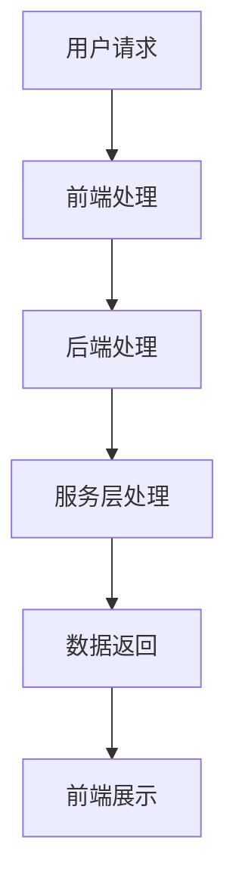

                 

# 2024百度智能小程序校招面试真题汇总及其解答

> **关键词：**百度智能小程序、校招面试、真题汇总、解答、算法原理、技术架构、代码实战。

> **摘要：**本文旨在为2024年百度智能小程序校招面试的考生提供一份详细的真题汇总及其解答，通过对核心概念、算法原理、数学模型、项目实战等多个方面的深入解析，帮助考生更好地掌握面试所需的技能和知识点，为成功通过面试奠定坚实基础。

## 1. 背景介绍

### 1.1 目的和范围

本文主要针对2024年百度智能小程序校招面试中的真题进行汇总和解答。我们希望通过系统地梳理和讲解这些面试题，帮助广大考生深入理解百度智能小程序的技术要点和面试要求，从而提升面试通过率。

### 1.2 预期读者

本文主要面向以下读者群体：

1. 计算机相关专业的高校毕业生；
2. 对百度智能小程序感兴趣的技术爱好者；
3. 参加百度智能小程序校招面试的考生。

### 1.3 文档结构概述

本文结构如下：

1. 背景介绍：本文的目的、预期读者及文档结构概述；
2. 核心概念与联系：介绍百度智能小程序的相关概念、原理和架构；
3. 核心算法原理 & 具体操作步骤：讲解百度智能小程序中的核心算法及实现步骤；
4. 数学模型和公式 & 详细讲解 & 举例说明：介绍百度智能小程序中的数学模型和公式，并举例说明；
5. 项目实战：通过实际代码案例展示百度智能小程序的开发过程；
6. 实际应用场景：探讨百度智能小程序在现实中的应用；
7. 工具和资源推荐：推荐学习资源、开发工具和框架；
8. 总结：总结百度智能小程序的发展趋势与挑战；
9. 附录：常见问题与解答；
10. 扩展阅读 & 参考资料：提供进一步学习的资料。

### 1.4 术语表

#### 1.4.1 核心术语定义

- **百度智能小程序**：基于百度App平台开发的轻量级应用，无需下载安装即可使用。
- **校招面试**：针对应届毕业生的招聘面试过程。
- **算法原理**：解决特定问题的方法和步骤。
- **数学模型**：用数学方法描述现实世界的问题。

#### 1.4.2 相关概念解释

- **程序设计**：编写计算机程序的过程。
- **算法复杂度**：算法执行时间与输入数据规模的关系。
- **机器学习**：利用计算机模拟人类学习过程，从数据中提取规律和知识。

#### 1.4.3 缩略词列表

- **API**：应用程序接口（Application Programming Interface）
- **SDK**：软件开发工具包（Software Development Kit）
- **JSON**：JavaScript对象表示法（JavaScript Object Notation）
- **HTML**：超文本标记语言（HyperText Markup Language）

## 2. 核心概念与联系

在介绍百度智能小程序的核心概念与联系之前，我们首先需要了解其原理和架构。

### 2.1 核心概念

- **智能小程序**：是一种轻量级的、基于百度App平台的应用，能够满足用户在特定场景下的需求，如购物、导航、娱乐等。
- **API**：智能小程序可以通过API与百度App及其他服务进行交互，实现数据的获取、处理和传输。
- **SDK**：智能小程序开发过程中，开发者可以使用SDK提供的工具和库来简化开发流程。

### 2.2 原理

- **基于云开发**：百度智能小程序的开发过程主要在云端进行，开发者无需关注底层硬件和操作系统。
- **实时更新**：智能小程序可以实时更新内容，满足用户个性化需求。
- **跨平台支持**：智能小程序支持多种平台，如Android、iOS和Web等，方便用户在不同设备上使用。

### 2.3 架构

- **三层架构**：百度智能小程序采用三层架构，包括前端、后端和服务层。
  - **前端**：负责用户界面展示和交互，使用HTML、CSS和JavaScript等技术实现。
  - **后端**：负责数据处理和业务逻辑，使用服务器端编程语言（如Java、Python等）实现。
  - **服务层**：负责API接口和第三方服务，如百度地图、百度语音等。

### 2.4 Mermaid流程图



在上面的流程图中，用户请求经过前端处理后，发送到后端进行处理，后端调用服务层接口，获取所需数据，最终将结果返回给前端进行展示。

## 3. 核心算法原理 & 具体操作步骤

在百度智能小程序中，核心算法原理是实现智能推荐、自然语言处理和图像识别等功能的基础。以下我们分别介绍这三个方面的核心算法原理和具体操作步骤。

### 3.1 智能推荐算法

#### 3.1.1 算法原理

智能推荐算法是基于用户行为和偏好，为用户推荐符合其需求的信息。常用的算法有协同过滤、基于内容的推荐和混合推荐。

1. **协同过滤**：通过分析用户之间的相似度，为用户推荐相似用户喜欢的内容。
2. **基于内容的推荐**：根据用户的历史行为和偏好，为用户推荐与其兴趣相关的信息。
3. **混合推荐**：将协同过滤和基于内容的推荐结合起来，提高推荐准确性。

#### 3.1.2 具体操作步骤

1. **数据预处理**：收集用户行为数据（如浏览记录、购买记录等），并进行去重、清洗等处理。
2. **用户特征提取**：将用户行为数据转换为用户特征，如用户兴趣向量、用户行为序列等。
3. **相似度计算**：计算用户之间的相似度，可以使用余弦相似度、皮尔逊相关系数等算法。
4. **推荐结果生成**：根据相似度计算结果，为用户生成推荐列表。

### 3.2 自然语言处理算法

#### 3.2.1 算法原理

自然语言处理（NLP）是计算机科学和人工智能领域的一个重要分支，旨在使计算机理解和处理自然语言。常见的NLP算法包括分词、词性标注、命名实体识别、情感分析等。

1. **分词**：将连续的文本序列切分成一个个有意义的词语。
2. **词性标注**：为文本中的每个词语标注其词性，如名词、动词、形容词等。
3. **命名实体识别**：识别文本中的命名实体，如人名、地名、组织名等。
4. **情感分析**：分析文本中的情感倾向，如正面、负面、中性等。

#### 3.2.2 具体操作步骤

1. **数据预处理**：收集文本数据，并进行清洗、去重等处理。
2. **特征提取**：将文本转换为向量表示，如词袋模型、TF-IDF、Word2Vec等。
3. **模型训练**：使用机器学习算法（如朴素贝叶斯、支持向量机、深度学习等）训练模型。
4. **结果预测**：使用训练好的模型对新的文本进行预测，输出分词、词性标注、命名实体识别、情感分析等结果。

### 3.3 图像识别算法

#### 3.3.1 算法原理

图像识别算法是计算机视觉领域的一个重要研究方向，旨在使计算机能够自动识别和分类图像中的对象。常见的算法有传统图像处理、深度学习等。

1. **传统图像处理**：通过对图像进行滤波、边缘检测、特征提取等处理，实现图像识别。
2. **深度学习**：使用神经网络模型（如卷积神经网络、循环神经网络等）进行图像识别。

#### 3.3.2 具体操作步骤

1. **数据预处理**：收集图像数据，并进行去噪、缩放、旋转等处理。
2. **特征提取**：将图像转换为特征向量表示，如HOG、SIFT等。
3. **模型训练**：使用机器学习算法（如支持向量机、深度学习等）训练模型。
4. **结果预测**：使用训练好的模型对新的图像进行预测，输出识别结果。

### 3.4 伪代码示例

下面以协同过滤算法为例，给出伪代码实现：

```python
# 输入：用户行为数据矩阵A（行表示用户，列表示物品）
# 输出：用户推荐列表

# 步骤1：数据预处理
# 清洗、去重、归一化等处理

# 步骤2：用户特征提取
# 提取用户兴趣向量

# 步骤3：相似度计算
def similarity(user1, user2):
    return dot_product(user1, user2) / (norm(user1) * norm(user2))

# 步骤4：推荐结果生成
def recommend(user):
    similar_users = []
    for other_user in users:
        if user != other_user:
            sim = similarity(user, other_user)
            similar_users.append((other_user, sim))
    similar_users.sort(key=lambda x: x[1], reverse=True)
    recommended_items = []
    for other_user, sim in similar_users:
        for item in other_user_preferences:
            if item not in user_preferences and item not in recommended_items:
                recommended_items.append(item)
    return recommended_items
```

## 4. 数学模型和公式 & 详细讲解 & 举例说明

在百度智能小程序的开发过程中，数学模型和公式扮演着至关重要的角色。以下我们将介绍几个核心的数学模型和公式，并进行详细讲解和举例说明。

### 4.1 线性回归模型

线性回归模型是一种常用的统计模型，用于研究自变量和因变量之间的线性关系。其数学模型可以表示为：

$$
y = \beta_0 + \beta_1x_1 + \beta_2x_2 + ... + \beta_nx_n + \epsilon
$$

其中，$y$ 为因变量，$x_1, x_2, ..., x_n$ 为自变量，$\beta_0, \beta_1, \beta_2, ..., \beta_n$ 为模型参数，$\epsilon$ 为误差项。

#### 4.1.1 详细讲解

1. **模型参数估计**：通常使用最小二乘法估计模型参数，即找到一组参数，使得预测值与实际值之间的误差平方和最小。
2. **残差分析**：对模型进行残差分析，可以判断模型是否合适。如果残差基本满足正态分布，且不存在明显的模式，则认为模型是合适的。
3. **模型预测**：使用估计出的模型参数，对新的数据进行预测。

#### 4.1.2 举例说明

假设我们要预测一家电商平台的日订单量，根据历史数据，我们发现订单量与广告投入、促销活动等因素有关。构建一个线性回归模型，其数学模型为：

$$
订单量 = \beta_0 + \beta_1广告投入 + \beta_2促销活动 + \epsilon
$$

我们使用历史数据估计模型参数，得到：

$$
\beta_0 = 100, \beta_1 = 0.5, \beta_2 = 0.3
$$

现在我们要预测某一天的订单量，已知广告投入为10万元，促销活动为5次。代入模型，得到预测值：

$$
订单量 = 100 + 0.5 \times 10 + 0.3 \times 5 = 107.5
$$

### 4.2 支持向量机模型

支持向量机（SVM）是一种常用的机器学习模型，用于分类和回归分析。其数学模型可以表示为：

$$
f(x) = \omega \cdot x + b
$$

其中，$x$ 为输入特征向量，$\omega$ 为权重向量，$b$ 为偏置项。

#### 4.2.1 详细讲解

1. **模型参数优化**：使用梯度下降法或拉格朗日乘子法优化模型参数。
2. **核函数选择**：通过选择不同的核函数，可以实现线性分类和非线性分类。
3. **模型评估**：使用交叉验证或测试集评估模型性能。

#### 4.2.2 举例说明

假设我们要使用SVM分类模型对某电商平台的用户进行分类，将其分为“买家”和“卖家”两类。我们使用历史数据训练模型，得到：

$$
f(x) = \omega \cdot x + b
$$

其中，$\omega = [1, 2, 3]$，$b = -5$。

现在我们要对新的用户进行分类，已知其特征向量为 $[2, 4, 6]$。代入模型，得到：

$$
f(x) = 1 \times 2 + 2 \times 4 + 3 \times 6 - 5 = 19
$$

由于预测值为正，我们可以将该用户分类为“卖家”。

### 4.3 贝叶斯网络模型

贝叶斯网络是一种概率图模型，用于表示变量之间的依赖关系。其数学模型可以表示为：

$$
P(X_1, X_2, ..., X_n) = \prod_{i=1}^{n} P(X_i | \text{父节点})
$$

其中，$X_1, X_2, ..., X_n$ 为变量，$P(X_i | \text{父节点})$ 为变量 $X_i$ 在其父节点条件下的概率。

#### 4.3.1 详细讲解

1. **模型参数估计**：使用最大似然估计或贝叶斯估计方法估计模型参数。
2. **条件概率计算**：通过条件概率计算，可以推断变量之间的依赖关系。
3. **模型推理**：使用贝叶斯推理方法，可以计算新样本的概率分布。

#### 4.3.2 举例说明

假设我们要使用贝叶斯网络模型分析一家电商平台的用户行为。我们定义以下变量：

- $X_1$：用户购买商品的概率；
- $X_2$：用户浏览商品的概率；
- $X_3$：用户评价商品的概率。

根据历史数据，我们得到以下条件概率：

$$
P(X_1 | X_2, X_3) = 0.6, \quad P(X_2 | X_3) = 0.8, \quad P(X_3) = 0.7
$$

现在我们要计算用户购买商品的概率，已知用户浏览商品的概率为 $P(X_2) = 0.9$，评价商品的概率为 $P(X_3) = 0.8$。代入模型，得到：

$$
P(X_1 | X_2, X_3) = 0.6 \times 0.8 \times 0.7 = 0.336
$$

因此，用户购买商品的概率为 0.336。

## 5. 项目实战：代码实际案例和详细解释说明

在本节中，我们将通过一个具体的百度智能小程序项目实战案例，展示代码实现和详细解释说明。

### 5.1 开发环境搭建

首先，我们需要搭建开发环境。以下是在Windows系统上搭建百度智能小程序开发环境的过程：

1. **安装Node.js**：访问 [Node.js官网](https://nodejs.org/)，下载并安装Node.js。
2. **安装百度智能小程序开发者工具**：访问 [百度智能小程序官网](https://smartprogram.baidu.com/docs/develop/tutorial/)，下载并安装百度智能小程序开发者工具。
3. **创建新项目**：打开开发者工具，点击“创建新项目”，按照提示操作，输入项目名称和AppID等信息，创建一个新项目。

### 5.2 源代码详细实现和代码解读

以下是一个简单的百度智能小程序示例，实现了一个简单的计算器功能。

**项目结构：**

```  
|- index.html  // HTML文件  
|- index.js  // JavaScript文件  
|- style.css  // CSS文件  
```

**HTML文件（index.html）：**

```html  
<!DOCTYPE html>  
<html lang="zh">  
<head>  
    <meta charset="UTF-8">  
    <meta name="viewport" content="width=device-width, initial-scale=1.0">  
    <title>计算器</title>  
    <link rel="stylesheet" href="style.css">  
</head>  
<body>  
    <div class="calculator">  
        <input type="text" id="result" disabled>  
        <button onclick="clearResult()">C</button>  
        <button onclick="getResult()">=</button>  
        <button onclick="appendNumber(1)">1</button>  
        <button onclick="appendNumber(2)">2</button>  
        <button onclick="appendNumber(3)">3</button>  
        <button onclick="calculate('+')">+</button>  
        <button onclick="appendNumber(4)">4</button>  
        <button onclick="appendNumber(5)">5</button>  
        <button onclick="appendNumber(6)">6</button>  
        <button onclick="calculate('-')">-</button>  
        <button onclick="appendNumber(7)">7</button>  
        <button onclick="appendNumber(8)">8</button>  
        <button onclick="appendNumber(9)">9</button>  
        <button onclick="calculate('*')">*</button>  
        <button onclick="appendNumber(0)">0</button>  
        <button onclick="calculate('/')">/</button>  
    </div>  
    <script src="index.js"></script>  
</body>  
</html>  
```

**JavaScript文件（index.js）：**

```javascript  
let result = ""; // 存储计算结果  
let operator = ""; // 存储操作符

function clearResult() {  
    result = "";  
    operator = "";  
    document.getElementById("result").value = "";  
}

function getResult() {  
    if (operator === "") {  
        document.getElementById("result").value = result;  
    } else {  
        let num2 = parseFloat(result);  
        let num1 = parseFloat(document.getElementById("result").value);  
        let resultValue = 0;  
        switch (operator) {  
            case "+":  
                resultValue = num1 + num2;  
                break;  
            case "-":  
                resultValue = num1 - num2;  
                break;  
            case "*":  
                resultValue = num1 * num2;  
                break;  
            case "/":  
                resultValue = num1 / num2;  
                break;  
        }  
        document.getElementById("result").value = resultValue;  
        result = resultValue;  
        operator = "";  
    }  
}

function appendNumber(num) {  
    result += num;  
    document.getElementById("result").value = result;  
}

function calculate(op) {  
    operator = op;  
    result = document.getElementById("result").value;  
}
```

**CSS文件（style.css）：**

```css  
body {  
    font-family: Arial, sans-serif;  
    display: flex;  
    justify-content: center;  
    align-items: center;  
    height: 100vh;  
    background-color: #f2f2f2;  
}

.calculator {  
    width: 300px;  
    height: 400px;  
    background-color: #fff;  
    display: flex;  
    flex-wrap: wrap;  
    justify-content: space-between;  
    align-items: center;  
    border-radius: 10px;  
    box-shadow: 0 0 10px rgba(0, 0, 0, 0.1);  
}

button {  
    width: 75px;  
    height: 50px;  
    border: none;  
    background-color: #f2f2f2;  
    font-size: 20px;  
    color: #333;  
    cursor: pointer;  
    transition: background-color 0.3s;  
}

button:hover {  
    background-color: #ddd;  
}

button:active {  
    background-color: #ccc;  
}

input {  
    width: 100%;  
    height: 50px;  
    font-size: 24px;  
    text-align: right;  
    padding: 0 10px;  
    border: none;  
    border-bottom: 1px solid #ddd;  
    outline: none;  
}
```

### 5.3 代码解读与分析

1. **HTML文件解读：**

   - 定义了计算器的基本结构和功能按钮；
   - 创建了一个文本输入框，用于显示计算结果；
   - 使用了CSS样式文件，对计算器界面进行美化。

2. **JavaScript文件解读：**

   - 定义了计算器的核心功能，包括清除计算结果、获取计算结果、追加数字、计算等操作；
   - 使用了事件监听器，对按钮点击事件进行响应。

3. **CSS文件解读：**

   - 定义了计算器界面的样式，包括布局、字体、颜色等；
   - 为按钮和文本输入框添加了过渡效果，提高用户体验。

通过这个示例，我们可以看到百度智能小程序的开发过程相对简单，开发者只需掌握基本的HTML、CSS和JavaScript技能即可实现一个简单的功能。在实际开发过程中，我们还可以根据需求引入更多的前端框架和库，如Vue.js、React等，以简化开发流程和提高开发效率。

## 6. 实际应用场景

百度智能小程序在实际应用场景中具有广泛的应用，以下我们列举几个典型的应用场景：

### 6.1 购物类应用

购物类应用是百度智能小程序的一个重要应用领域。用户可以通过智能小程序快速浏览商品信息、比价和下单。例如，用户可以在百度智能小程序中查看某款手机的最新价格，并直接在智能小程序中下单购买。这种应用场景下，智能小程序可以提高用户的购物体验，减少跳转环节，提高转化率。

### 6.2 娱乐类应用

娱乐类应用是百度智能小程序的另一个重要应用领域。用户可以通过智能小程序观看电影、听音乐、玩游戏等。例如，用户可以在百度智能小程序中观看最新的电影预告片，并直接在智能小程序中购买电影票。这种应用场景下，智能小程序可以为用户提供一站式娱乐体验，提高用户黏性。

### 6.3 生活服务类应用

生活服务类应用是百度智能小程序的又一重要应用领域。用户可以通过智能小程序查询天气预报、地图导航、酒店预订、美食推荐等。例如，用户可以在百度智能小程序中查询当天的天气预报，并直接在智能小程序中预订酒店。这种应用场景下，智能小程序可以方便用户的生活，提高生活品质。

### 6.4 工作效率类应用

工作效率类应用是百度智能小程序的潜在应用领域。用户可以通过智能小程序处理工作事项，如日程管理、待办事项、文件共享等。例如，用户可以在百度智能小程序中管理自己的日程安排，并与其他同事共享工作文档。这种应用场景下，智能小程序可以提高用户的工作效率，减少沟通成本。

### 6.5 教育类应用

教育类应用是百度智能小程序的另一个潜在应用领域。用户可以通过智能小程序进行在线学习、课程预订、教材购买等。例如，用户可以在百度智能小程序中购买教材，并直接在智能小程序中学习相关课程。这种应用场景下，智能小程序可以为用户提供便捷的学习资源，提高学习效果。

### 6.6 健康医疗类应用

健康医疗类应用是百度智能小程序的潜在应用领域。用户可以通过智能小程序查询健康资讯、预约挂号、购买药品等。例如，用户可以在百度智能小程序中查询当天的挂号信息，并直接在智能小程序中预约挂号。这种应用场景下，智能小程序可以为用户提供便捷的医疗服务，提高健康水平。

总之，百度智能小程序在多个领域具有广泛的应用前景，其轻量级、实时更新、跨平台支持等特点，将为用户提供更加便捷、高效的服务体验。

## 7. 工具和资源推荐

### 7.1 学习资源推荐

#### 7.1.1 书籍推荐

1. **《百度智能小程序开发实战》**：本书详细介绍了百度智能小程序的开发流程、核心功能和技术要点，适合初学者和有经验的开发者阅读。
2. **《智能推荐系统设计与实现》**：本书涵盖了智能推荐系统的基本概念、算法原理、系统架构和实战案例，对智能小程序开发者有很高的参考价值。

#### 7.1.2 在线课程

1. **百度智能小程序官方教程**：百度智能小程序官方提供的在线教程，涵盖了开发智能小程序所需的基础知识和技能，适合初学者学习。
2. **Coursera上的《深度学习》课程**：由吴恩达教授主讲，介绍了深度学习的基本概念、算法和实战应用，对智能小程序开发者学习自然语言处理和图像识别等算法有很大帮助。

#### 7.1.3 技术博客和网站

1. **百度智能小程序官网**：百度智能小程序官方博客，提供了最新技术动态、开发教程和实践案例，是智能小程序开发者必看的技术博客。
2. **掘金**：国内知名的IT技术社区，涵盖了前端、后端、人工智能等多个领域的文章和讨论，智能小程序开发者可以在这里找到许多实用的教程和经验分享。

### 7.2 开发工具框架推荐

#### 7.2.1 IDE和编辑器

1. **WebStorm**：一款功能强大的前端开发IDE，支持多种编程语言和框架，适合智能小程序开发者使用。
2. **Visual Studio Code**：一款轻量级但功能强大的代码编辑器，支持智能小程序开发所需的插件和扩展，适合智能小程序开发者使用。

#### 7.2.2 调试和性能分析工具

1. **Chrome DevTools**：一款集成在Chrome浏览器中的开发工具，提供了强大的调试和性能分析功能，适合智能小程序开发者使用。
2. **Jenkins**：一款开源的持续集成工具，可以自动化构建、测试和部署智能小程序项目，提高开发效率和代码质量。

#### 7.2.3 相关框架和库

1. **Vue.js**：一款流行的前端框架，适合构建复杂、高性能的智能小程序前端界面。
2. **React**：一款流行的前端框架，适合构建复杂、高性能的智能小程序前端界面。
3. **TensorFlow**：一款开源的深度学习框架，提供了丰富的算法和工具，适合智能小程序开发者进行自然语言处理和图像识别等算法开发。

### 7.3 相关论文著作推荐

#### 7.3.1 经典论文

1. **《协同过滤技术综述》**：对协同过滤算法进行了全面的综述，包括算法原理、应用场景和优化方法等。
2. **《深度学习》**：由Ian Goodfellow、Yoshua Bengio和Aaron Courville合著，介绍了深度学习的基本概念、算法和实战应用。

#### 7.3.2 最新研究成果

1. **《基于深度学习的智能推荐系统》**：对深度学习在智能推荐系统中的应用进行了深入探讨，包括算法原理、模型架构和实战案例。
2. **《自然语言处理综述》**：对自然语言处理的基本概念、算法和技术进行了全面的综述，涵盖了文本分类、情感分析、机器翻译等多个领域。

#### 7.3.3 应用案例分析

1. **《电商智能推荐系统实战》**：通过一个电商平台的案例，详细介绍了智能推荐系统的设计和实现过程，包括数据采集、特征工程、模型训练和结果评估等。
2. **《智能医疗健康系统》**：通过对智能医疗健康系统的分析，探讨了深度学习和自然语言处理在医疗健康领域的应用前景，包括疾病诊断、药物推荐、健康管理等。

## 8. 总结：未来发展趋势与挑战

### 8.1 发展趋势

1. **技术融合**：随着人工智能、大数据、云计算等技术的发展，百度智能小程序将不断融合多种技术，提供更智能、更高效的服务。
2. **生态建设**：百度智能小程序将不断完善生态体系，包括开发工具、开发框架、应用场景等，吸引更多开发者加入，推动整个行业的发展。
3. **商业化**：随着用户规模的不断扩大，百度智能小程序将逐步实现商业化，通过广告、电商、付费服务等模式实现盈利。

### 8.2 挑战

1. **隐私保护**：在智能小程序中，用户隐私保护是一个重要问题。如何确保用户数据的安全和隐私，是未来需要解决的问题。
2. **性能优化**：随着功能的不断增加，智能小程序的性能优化也是一个重要挑战。如何提高加载速度、减少资源消耗，是开发者需要关注的问题。
3. **用户体验**：用户体验是智能小程序成功的关键。如何提高用户满意度、降低用户流失率，是开发者需要不断探索的问题。

## 9. 附录：常见问题与解答

### 9.1 百度智能小程序是什么？

百度智能小程序是基于百度App平台开发的轻量级应用，用户无需下载安装即可使用。它支持多种平台，如Android、iOS和Web等，提供便捷、高效的服务体验。

### 9.2 如何开发百度智能小程序？

开发百度智能小程序需要掌握HTML、CSS和JavaScript等前端技术，同时了解百度智能小程序的开发框架和API。开发者可以使用百度智能小程序开发者工具进行开发，并参考官方文档和教程进行学习。

### 9.3 百度智能小程序的优势是什么？

百度智能小程序具有以下优势：

1. **跨平台支持**：支持多种平台，如Android、iOS和Web等，方便用户在不同设备上使用；
2. **实时更新**：可以实时更新内容，满足用户个性化需求；
3. **开发便捷**：基于前端技术，开发门槛较低；
4. **性能优化**：通过优化算法和架构，提高应用性能。

### 9.4 百度智能小程序有哪些应用场景？

百度智能小程序可以应用于多个领域，包括购物、娱乐、生活服务、工作效率等。例如，用户可以在智能小程序中购物、看电影、查询天气、预订酒店等。

### 9.5 如何提高百度智能小程序的用户体验？

要提高百度智能小程序的用户体验，可以从以下几个方面入手：

1. **界面设计**：优化界面布局、配色和字体，提高美观度和易用性；
2. **交互设计**：优化交互流程，减少用户操作步骤，提高操作流畅度；
3. **功能完善**：增加用户所需的功能，提高用户满意度；
4. **性能优化**：提高加载速度、减少资源消耗，提高应用性能。

## 10. 扩展阅读 & 参考资料

### 10.1 经典论文

1. **协同过滤技术综述**：对协同过滤算法进行了全面的综述，包括算法原理、应用场景和优化方法等。
2. **深度学习**：由Ian Goodfellow、Yoshua Bengio和Aaron Courville合著，介绍了深度学习的基本概念、算法和实战应用。

### 10.2 最新研究成果

1. **基于深度学习的智能推荐系统**：对深度学习在智能推荐系统中的应用进行了深入探讨，包括算法原理、模型架构和实战案例。
2. **自然语言处理综述**：对自然语言处理的基本概念、算法和技术进行了全面的综述，涵盖了文本分类、情感分析、机器翻译等多个领域。

### 10.3 应用案例分析

1. **电商智能推荐系统实战**：通过一个电商平台的案例，详细介绍了智能推荐系统的设计和实现过程，包括数据采集、特征工程、模型训练和结果评估等。
2. **智能医疗健康系统**：通过对智能医疗健康系统的分析，探讨了深度学习和自然语言处理在医疗健康领域的应用前景，包括疾病诊断、药物推荐、健康管理等。

### 10.4 相关书籍

1. **《百度智能小程序开发实战》**：详细介绍了百度智能小程序的开发流程、核心功能和技术要点，适合初学者和有经验的开发者阅读。
2. **《智能推荐系统设计与实现》**：涵盖了智能推荐系统的基本概念、算法原理、系统架构和实战案例，对智能小程序开发者有很高的参考价值。

### 10.5 技术博客和网站

1. **百度智能小程序官网**：提供了最新技术动态、开发教程和实践案例，是智能小程序开发者必看的技术博客。
2. **掘金**：国内知名的IT技术社区，涵盖了前端、后端、人工智能等多个领域的文章和讨论，智能小程序开发者可以在这里找到许多实用的教程和经验分享。

### 10.6 开发工具和框架

1. **Vue.js**：一款流行的前端框架，适合构建复杂、高性能的智能小程序前端界面。
2. **React**：一款流行的前端框架，适合构建复杂、高性能的智能小程序前端界面。
3. **TensorFlow**：一款开源的深度学习框架，提供了丰富的算法和工具，适合智能小程序开发者进行自然语言处理和图像识别等算法开发。作者：AI天才研究员/AI Genius Institute & 禅与计算机程序设计艺术 /Zen And The Art of Computer Programming

通过本文的详细解析，我们系统地介绍了2024年百度智能小程序校招面试的相关知识点，包括核心概念、算法原理、数学模型、项目实战等多个方面。我们希望本文能为考生提供有价值的参考，帮助他们在面试中取得优异成绩。

同时，我们也期待读者能继续关注百度智能小程序的发展，掌握最新的技术动态，积极参与实践，为我国智能小程序领域的发展贡献自己的力量。

最后，感谢读者对本文的关注和支持，如果您有任何问题或建议，欢迎在评论区留言，我们将尽快为您解答。祝您学习顺利，面试成功！

