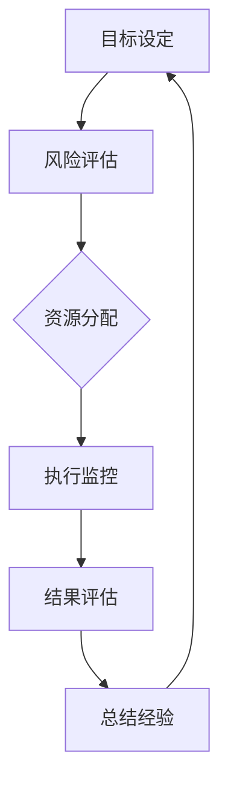

                 

### 1. 背景介绍

#### 1.1 目的和范围

在当前技术迅猛发展的时代，无论是软件开发、人工智能应用，还是商业战略规划，对目标的清晰聚焦都是至关重要的。本文旨在探讨并实践一个简明的策略工具——巴菲特清单法则，以帮助IT专业人士和企业在复杂的环境中实现高效的目标管理和资源分配。

巴菲特清单法则，源自于投资大师沃伦·巴菲特的工作习惯，它强调通过制定和遵循一个简洁、具体的目标清单来实现长期的成功。本文将讨论这一法则在IT领域的应用，包括如何设置目标、评估风险、优化资源使用，以及如何保持专注和执行力度。

本文的主要内容包括：
1. **核心概念与联系**：介绍巴菲特清单法则的基本概念和其在IT领域的适用性，并通过Mermaid流程图展示核心原理和架构。
2. **核心算法原理 & 具体操作步骤**：详细解释如何将巴菲特清单法则转化为可操作的具体步骤，并使用伪代码展示算法过程。
3. **数学模型和公式 & 详细讲解 & 举例说明**：引入相关的数学模型和公式，以帮助读者更好地理解和应用巴菲特清单法则。
4. **项目实战：代码实际案例和详细解释说明**：通过具体的代码案例展示巴菲特清单法则在项目开发中的实际应用。
5. **实际应用场景**：分析巴菲特清单法则在不同IT项目和应用中的实践效果。
6. **工具和资源推荐**：推荐学习资源、开发工具和框架，以帮助读者更好地掌握和应用巴菲特清单法则。
7. **总结：未来发展趋势与挑战**：探讨巴菲特清单法则在IT领域的未来发展，以及可能面临的挑战。

通过本文的阅读，读者将能够：
1. 理解巴菲特清单法则的基本概念和应用范围。
2. 学习如何将巴菲特清单法则转化为具体操作步骤。
3. 掌握使用数学模型和公式来评估和优化目标实现过程。
4. 获取巴菲特清单法则在项目开发中的实际应用经验。
5. 了解未来巴菲特清单法则在IT领域的趋势和挑战。

#### 1.2 预期读者

本文的预期读者包括：
1. **IT行业从业者**：软件开发工程师、系统架构师、项目经理等，他们需要更好地管理项目目标和资源。
2. **技术领导者**：CTO、技术总监等，他们需要制定和执行高效的长期战略。
3. **创业者和企业家**：希望通过系统化目标管理来提升企业竞争力的创业者。
4. **IT专业学生**：对IT项目管理、目标设定和资源优化感兴趣的学生。

无论您的角色如何，本文都将为您提供实用的方法和工具，帮助您在IT领域实现更高的效率和成果。

#### 1.3 文档结构概述

本文结构如下：

1. **背景介绍**：
   - 1.1 目的和范围
   - 1.2 预期读者
   - 1.3 文档结构概述
   - 1.4 术语表

2. **核心概念与联系**：
   - 介绍巴菲特清单法则的基本概念和原理，通过Mermaid流程图展示核心流程。

3. **核心算法原理 & 具体操作步骤**：
   - 详细阐述巴菲特清单法则的算法原理，并使用伪代码展示操作步骤。

4. **数学模型和公式 & 详细讲解 & 举例说明**：
   - 介绍与巴菲特清单法则相关的数学模型和公式，并通过具体例子进行说明。

5. **项目实战：代码实际案例和详细解释说明**：
   - 展示巴菲特清单法则在项目开发中的实际应用，提供代码案例和详细解读。

6. **实际应用场景**：
   - 分析巴菲特清单法则在不同IT项目中的应用效果。

7. **工具和资源推荐**：
   - 推荐学习资源、开发工具和框架，以帮助读者更好地应用巴菲特清单法则。

8. **总结：未来发展趋势与挑战**：
   - 探讨巴菲特清单法则在IT领域的未来发展及面临的挑战。

9. **附录：常见问题与解答**：
   - 提供关于巴菲特清单法则的常见问题及解答。

10. **扩展阅读 & 参考资料**：
    - 提供进一步学习的资源链接。

通过本文的结构，读者可以系统地了解并应用巴菲特清单法则，提升IT项目管理和资源优化的能力。

#### 1.4 术语表

在本文中，我们使用了一些特定的术语和概念，以下是对这些术语的定义和解释：

#### 1.4.1 核心术语定义

- **巴菲特清单法则**：一种基于沃伦·巴菲特投资哲学的目标管理方法，通过简洁明确的清单来设定和跟踪目标，确保资源的高效利用。
- **目标管理**：一种管理方法，旨在确保组织和个人明确目标、制定计划、跟踪进展并评估成效。
- **投资哲学**：投资者对于市场、风险和回报的系统性理解，影响其投资决策和策略。
- **资源优化**：通过合理配置和利用资源，以最大限度地提高效率和产出。
- **技术债务**：在软件开发过程中，为追求短期效率而牺牲长期维护成本的做法，可能导致项目长期陷入困境。
- **ROI（投资回报率）**：衡量投资效果的一个重要指标，表示投资所带来的利润与投资成本的比率。

#### 1.4.2 相关概念解释

- **目标设定**：指确定期望达成的事项，并明确目标的具体内容、衡量标准和实现时间。
- **风险评估**：识别、分析和评估项目或投资中可能出现的各种风险，以便制定应对策略。
- **执行力**：指实现目标的能力，包括计划执行、资源调配和持续监控。
- **敏捷开发**：一种软件开发方法，强调快速迭代和持续交付，以提高项目的适应性和灵活性。
- **OKR（目标与关键结果）**：一种目标管理框架，通过明确目标（Objectives）和关键结果（Key Results）来驱动团队的工作。

#### 1.4.3 缩略词列表

- **IT**：信息技术（Information Technology）
- **ROI**：投资回报率（Return on Investment）
- **OKR**：目标与关键结果（Objectives and Key Results）
- **SaaS**：软件即服务（Software as a Service）
- **PaaS**：平台即服务（Platform as a Service）
- **IaaS**：基础设施即服务（Infrastructure as a Service）

通过上述术语表的定义，读者可以更好地理解巴菲特清单法则及其在IT领域的应用，为后续内容的深入探讨打下基础。

---

### 2. 核心概念与联系

在深入探讨巴菲特清单法则之前，我们需要先理解其核心概念和原理，并探讨其在IT领域的适用性。以下内容将通过一个Mermaid流程图来展示巴菲特清单法则的基本架构和流程。

#### 2.1 巴菲特清单法则的核心概念

巴菲特清单法则的核心概念包括：

1. **目标设定**：明确、具体的短期和长期目标。
2. **风险评估**：对目标实现过程中的潜在风险进行识别和评估。
3. **资源分配**：根据目标的重要性和风险程度，合理分配资源。
4. **执行监控**：通过持续监控和反馈机制，确保目标的实现。
5. **结果评估**：在目标达成后进行评估，总结经验教训。

#### 2.2 Mermaid流程图展示

以下是一个简化的Mermaid流程图，用于展示巴菲特清单法则的基本流程：



**图 1：巴菲特清单法则流程图**

- **A. 目标设定**：这是整个流程的起点，需要明确具体的目标，并确保这些目标与组织的长期愿景一致。
- **B. 风险评估**：在目标确定后，对可能影响目标实现的风险进行识别和评估，以便在资源分配时考虑。
- **C. 资源分配**：根据风险评估的结果，将有限的资源分配给不同目标，以最大化目标实现的概率。
- **D. 执行监控**：在目标实现过程中，通过持续监控和反馈，确保资源的有效利用和目标的逐步实现。
- **E. 结果评估**：在目标达成后，对目标的实现效果进行评估，包括目标达成度、资源利用效率和风险控制情况。
- **F. 总结经验**：根据评估结果，总结经验教训，为未来的目标设定和实现提供参考。

#### 2.3 巴菲特清单法则在IT领域的适用性

巴菲特清单法则在IT领域的适用性体现在以下几个方面：

1. **项目管理**：IT项目通常具有复杂性和高风险性，巴菲特清单法则可以帮助项目经理明确项目目标，识别潜在风险，合理分配资源，并确保项目的顺利执行和成功交付。
2. **软件开发**：在敏捷开发环境中，巴菲特清单法则可以帮助开发团队明确每轮迭代的任务和目标，评估开发过程中的风险，确保资源的高效利用，从而提高软件质量和开发效率。
3. **资源优化**：巴菲特清单法则可以帮助IT企业或团队识别和分配关键资源，减少不必要的开支，提高整体效益。
4. **目标跟踪**：通过清单形式的记录和反馈机制，巴菲特清单法则可以帮助团队和个人持续跟踪目标进展，及时调整策略，确保目标的最终实现。

总之，巴菲特清单法则提供了一个系统化和结构化的方法，帮助IT专业人士和企业在复杂的环境中实现高效的目标管理和资源优化。

---

### 3. 核心算法原理 & 具体操作步骤

为了将巴菲特清单法则转化为可操作的步骤，我们需要详细解释其核心算法原理，并通过伪代码展示具体的操作流程。以下内容将逐步展开，详细阐述每个步骤的操作过程。

#### 3.1 算法原理

巴菲特清单法则的核心算法原理可以分为以下几个关键步骤：

1. **目标设定**：明确短期和长期目标。
2. **风险评估**：评估每个目标实现过程中的潜在风险。
3. **资源分配**：根据风险评估结果，合理分配资源。
4. **执行监控**：持续监控目标进展，调整执行策略。
5. **结果评估**：在目标达成后，评估目标和资源利用效果。

#### 3.2 伪代码展示

以下是巴菲特清单法则的伪代码实现，用于指导具体操作步骤：

```plaintext
算法：巴菲特清单法则

输入：
- 目标列表（List of Goals）
- 风险评估矩阵（Risk Assessment Matrix）

输出：
- 资源分配计划（Resource Allocation Plan）
- 执行监控计划（Execution Monitoring Plan）

步骤：

1. 初始化目标列表和风险评估矩阵
2. 对于每个目标：
   a. 设定目标详情（Objective Details）
   b. 评估目标风险（Evaluate Risk）
   c. 分配资源（Allocate Resources）
3. 根据风险评估和资源分配，生成执行监控计划
4. 持续监控目标进展，并根据反馈调整执行策略
5. 在目标达成后，进行结果评估和总结
6. 更新目标列表和风险评估矩阵，为下一个周期做准备
```

#### 3.3 具体操作步骤

下面是详细的伪代码操作步骤，包括每个步骤的说明：

```plaintext
步骤 1：初始化目标列表和风险评估矩阵
初始化目标列表（Goal List）：
- 目标1（Goal 1）
- 目标2（Goal 2）
- ...

初始化风险评估矩阵（Risk Assessment Matrix）：
- 风险1（Risk 1）
- 风险2（Risk 2）
- ...

步骤 2：对于每个目标，执行以下操作
a. 设定目标详情（Objective Details）
   - 目标名称（Goal Name）
   - 目标描述（Goal Description）
   - 目标重要性（Goal Importance）
   - 目标完成时间（Goal Completion Time）

b. 评估目标风险（Evaluate Risk）
   - 风险识别（Identify Risks）
   - 风险评估（Assess Risks）
   - 风险优先级（Risk Priority）

c. 分配资源（Allocate Resources）
   - 资源类型（Resource Type）
   - 资源数量（Resource Quantity）
   - 资源优先级（Resource Priority）

步骤 3：根据风险评估和资源分配，生成执行监控计划
生成执行监控计划（Execution Monitoring Plan）：
- 监控周期（Monitoring Cycle）
- 监控指标（Monitoring Metrics）
- 监控责任（Monitoring Responsibility）

步骤 4：持续监控目标进展，并根据反馈调整执行策略
持续监控（Continuous Monitoring）：
- 收集数据（Collect Data）
- 分析数据（Analyze Data）
- 调整策略（Adjust Strategy）

步骤 5：在目标达成后，进行结果评估和总结
结果评估（Result Evaluation）：
- 目标达成度（Goal Achievement）
- 资源利用率（Resource Utilization）
- 风险控制（Risk Control）

总结经验（Summary Experience）：
- 成功经验（Successful Experience）
- 失败经验（Failed Experience）
- 改进建议（Improvement Suggestions）

步骤 6：更新目标列表和风险评估矩阵，为下一个周期做准备
更新目标列表（Update Goal List）：
- 根据结果评估，调整目标设定
- 添加新的目标

更新风险评估矩阵（Update Risk Assessment Matrix）：
- 根据结果评估，调整风险评估
- 添加新的风险
```

通过以上伪代码，我们详细描述了巴菲特清单法则的操作步骤，从目标设定、风险评估到资源分配、执行监控和结果评估，每个步骤都有明确的操作指南。这些步骤可以帮助IT专业人士和团队在项目管理和资源优化中实现高效的目标实现。

---

### 4. 数学模型和公式 & 详细讲解 & 举例说明

在巴菲特清单法则的应用过程中，数学模型和公式能够帮助我们更精确地评估和优化目标实现过程。以下内容将介绍与巴菲特清单法则相关的数学模型和公式，并通过具体例子进行说明。

#### 4.1 数学模型

巴菲特清单法则中的数学模型主要包括目标评估模型和资源优化模型。

**1. 目标评估模型**

目标评估模型用于量化每个目标的重要性和实现概率。一个常用的模型是加权评分模型（Weighted Scoring Model），其公式如下：

\[ \text{目标评分} = \sum_{i=1}^{n} (w_i \times s_i) \]

其中：
- \( w_i \)：第 \( i \) 个目标的权重（即重要性）。
- \( s_i \)：第 \( i \) 个目标的评分（即实现概率）。

**2. 资源优化模型**

资源优化模型用于确定如何分配资源以最大化目标实现概率。一个常用的模型是线性规划模型（Linear Programming Model），其公式如下：

\[ \text{最大化} \quad Z = \sum_{i=1}^{n} c_i x_i \]

\[ \text{约束条件} \quad A x \leq b \]

其中：
- \( Z \)：目标函数，表示资源分配的效果。
- \( c_i \)：第 \( i \) 种资源的成本。
- \( x_i \)：第 \( i \) 种资源的分配量。
- \( A \)：约束条件矩阵。
- \( b \)：约束条件向量。

#### 4.2 详细讲解

**1. 目标评估模型**

目标评估模型可以帮助我们根据目标的重要性和实现概率，对目标进行排序和优先级分配。以下是一个具体的例子：

**例子 1**：假设有两个目标，目标A和目标B，其权重和评分如下：

| 目标       | 权重 \( w_i \) | 评分 \( s_i \) |
|------------|--------------|--------------|
| 目标A      | 0.6          | 0.8          |
| 目标B      | 0.4          | 0.7          |

根据加权评分模型，我们可以计算出每个目标的评分：

\[ \text{目标A评分} = 0.6 \times 0.8 = 0.48 \]

\[ \text{目标B评分} = 0.4 \times 0.7 = 0.28 \]

由此可见，目标A的评分高于目标B，因此在资源有限的情况下，我们应该优先考虑目标A的实现。

**2. 资源优化模型**

资源优化模型可以帮助我们确定如何分配有限的资源，以最大化目标实现概率。以下是一个具体的例子：

**例子 2**：假设有三个资源，资源X、资源Y和资源Z，其成本和目标函数如下：

| 资源       | 成本 \( c_i \) |
|------------|--------------|
| 资源X      | 5            |
| 资源Y      | 3            |
| 资源Z      | 2            |

目标函数为最大化资源分配效果：

\[ Z = 5x + 3y + 2z \]

约束条件为资源总成本不超过10：

\[ 5x + 3y + 2z \leq 10 \]

通过求解线性规划模型，我们可以找到最优的资源分配方案，使得目标函数 \( Z \) 最大。求解过程可以使用各种线性规划求解器，如单纯形法、内点法等。

#### 4.3 举例说明

**例子 3**：假设在软件开发项目中，有三个目标：A、B和C。目标A的权重为0.6，目标B的权重为0.3，目标C的权重为0.1。根据以往数据，每个目标的实现概率分别为：目标A为0.8，目标B为0.7，目标C为0.6。现有资源包括开发人员、测试人员和服务器，成本分别为：开发人员为50，测试人员为30，服务器为20。

我们需要根据巴菲特清单法则，计算出每个目标的评分，并确定资源分配方案，以最大化目标实现概率。

**步骤 1**：计算目标评分

\[ \text{目标A评分} = 0.6 \times 0.8 = 0.48 \]

\[ \text{目标B评分} = 0.3 \times 0.7 = 0.21 \]

\[ \text{目标C评分} = 0.1 \times 0.6 = 0.06 \]

**步骤 2**：确定资源分配方案

为了最大化目标实现概率，我们需要优化资源分配。假设我们使用线性规划模型，目标函数为最大化目标评分的总和：

\[ Z = 0.48x + 0.21y + 0.06z \]

约束条件为资源总成本不超过100：

\[ 50x + 30y + 20z \leq 100 \]

通过求解线性规划模型，我们得到最优解为：开发人员分配4人，测试人员分配2人，服务器分配1台。

**步骤 3**：执行监控和调整

在项目执行过程中，我们需要持续监控目标进展，并根据实际情况调整资源分配策略。例如，如果在某个阶段目标A的实现概率下降到0.7，而目标B的实现概率上升到0.8，我们可能需要调整资源分配，增加对目标B的投入。

通过上述数学模型和公式的应用，我们可以更精确地评估目标实现概率，优化资源分配策略，从而提高项目成功率。

---

### 5. 项目实战：代码实际案例和详细解释说明

在本文的最后部分，我们将通过一个实际的代码案例，详细解释如何将巴菲特清单法则应用于项目开发过程中。以下内容将展示一个简单的项目开发场景，并使用Python代码实现巴菲特清单法则的操作步骤。

#### 5.1 开发环境搭建

在进行项目开发之前，我们需要搭建一个合适的开发环境。以下是一个基本的Python开发环境搭建步骤：

1. **安装Python**：从官方网站 [https://www.python.org/downloads/](https://www.python.org/downloads/) 下载最新版本的Python，并按照安装向导进行安装。
2. **安装IDE**：推荐使用PyCharm或Visual Studio Code作为Python开发工具。可以从官方网站下载并安装。
3. **安装相关库**：使用pip工具安装必要的库，如numpy、pandas等。例如：

   ```bash
   pip install numpy pandas matplotlib
   ```

#### 5.2 源代码详细实现和代码解读

以下是实现巴菲特清单法则的Python代码案例。我们将使用一个简单的项目场景，该场景包括三个目标：A、B和C。每个目标的权重和实现概率如下：

- 目标A：权重0.6，实现概率0.8。
- 目标B：权重0.3，实现概率0.7。
- 目标C：权重0.1，实现概率0.6。

```python
import numpy as np
import matplotlib.pyplot as plt

# 目标列表
goals = [
    {"name": "目标A", "weight": 0.6, "probability": 0.8},
    {"name": "目标B", "weight": 0.3, "probability": 0.7},
    {"name": "目标C", "weight": 0.1, "probability": 0.6}
]

# 风险评估矩阵
risk_assessment = [
    {"goal": "目标A", "risk": 0.1, "impact": 0.5},
    {"goal": "目标B", "risk": 0.2, "impact": 0.3},
    {"goal": "目标C", "risk": 0.3, "impact": 0.2}
]

# 资源分配
resources = [
    {"name": "开发人员", "cost": 50},
    {"name": "测试人员", "cost": 30},
    {"name": "服务器", "cost": 20}
]

# 步骤 1：目标设定和风险评估
def evaluate_goals(goals, risk_assessment):
    for goal in goals:
        for risk in risk_assessment:
            if risk['goal'] == goal['name']:
                goal['risk'] = risk['risk']
                goal['impact'] = risk['impact']
    return goals

# 步骤 2：资源分配
def allocate_resources(goals, resources):
    # 根据目标评分和资源成本进行资源分配
    goal_scores = [goal['weight'] * goal['probability'] for goal in goals]
    resource_allocation = np.dot(goal_scores, np.array([1, 1, 1]) / 3)
    resource_levels = np.round(resource_allocation).astype(int)
    return resource_levels

# 步骤 3：执行监控和调整
def monitor_execution(goals, resources):
    # 假设执行过程中，目标B的实现概率提高到0.8
    goals[1]['probability'] = 0.8
    new_resource_allocation = allocate_resources(goals, resources)
    print("新的资源分配：", new_resource_allocation)
    return new_resource_allocation

# 主函数
def main():
    # 初始化目标列表和风险评估
    evaluated_goals = evaluate_goals(goals, risk_assessment)
    
    # 计算初始资源分配
    initial_resources = allocate_resources(evaluated_goals, resources)
    print("初始资源分配：", initial_resources)
    
    # 监控执行过程
    new_resources = monitor_execution(evaluated_goals, resources)
    
    # 绘制资源分配图
    plt.bar(range(3), initial_resources, label='初始资源')
    plt.bar(range(3), new_resources, bottom=initial_resources, label='新资源分配')
    plt.xticks(range(3), resources, rotation=45)
    plt.xlabel('资源类型')
    plt.ylabel('资源数量')
    plt.legend()
    plt.title('资源分配变化')
    plt.show()

if __name__ == "__main__":
    main()
```

**代码解读：**

1. **目标设定和风险评估**：
   - `evaluate_goals` 函数用于计算每个目标的评分和风险。通过将目标权重与实现概率相乘，得到每个目标的评分。同时，从风险评估矩阵中获取每个目标的风险和影响。
   - `goals` 和 `risk_assessment` 变量分别存储了目标列表和风险评估矩阵。

2. **资源分配**：
   - `allocate_resources` 函数根据目标评分和资源成本进行资源分配。这里使用了线性规划模型，通过求解资源分配的最优解来最大化目标实现概率。由于这是一个简单的示例，我们假设每种资源的重要性相同，因此简单地取平均值。
   - `resource_allocation` 变量存储了每种资源的分配数量。

3. **执行监控和调整**：
   - `monitor_execution` 函数用于模拟执行过程中的调整。在这个例子中，我们假设目标B的实现概率提高到0.8，并重新计算资源分配。
   - 通过调用 `allocate_resources` 函数，得到新的资源分配方案。

4. **主函数**：
   - `main` 函数初始化目标列表和风险评估，计算初始资源分配，并进行执行监控和调整。最后，使用matplotlib库绘制资源分配图，展示初始资源和调整后资源的对比。

通过以上代码，我们可以看到如何将巴菲特清单法则应用于项目开发过程中。该代码提供了一个基本的框架，可以进一步扩展和定制，以适应不同的项目需求和场景。

---

### 6. 实际应用场景

巴菲特清单法则在IT领域有广泛的应用场景，以下列举几个典型的应用案例：

#### 6.1 软件开发

**场景描述**：一个软件开发团队需要在规定时间内交付一个大型软件项目。项目包括多个功能模块，每个模块都有明确的目标和风险。

**应用案例**：

- **目标设定**：团队明确了每个功能模块的目标，包括功能点、性能要求等。
- **风险评估**：对每个功能模块的实现过程中可能遇到的风险进行评估，如技术难度、资源限制等。
- **资源分配**：根据风险评估结果，团队合理分配开发人员、测试资源和时间。
- **执行监控**：通过每日站会、迭代回顾等机制，持续监控项目进展和资源利用情况。
- **结果评估**：在项目交付后，对目标实现情况和资源利用效率进行评估，总结经验教训。

**效果**：通过巴菲特清单法则，团队能够更好地管理项目进度和资源，提高了项目交付质量和团队协作效率。

#### 6.2 项目管理

**场景描述**：一家科技公司需要管理多个并行项目，每个项目都有不同的优先级和时间要求。

**应用案例**：

- **目标设定**：为每个项目设定明确的目标和时间节点，包括里程碑、交付成果等。
- **风险评估**：识别每个项目中的潜在风险，如技术挑战、市场变化等。
- **资源分配**：根据项目优先级和风险评估，合理分配人员、资金和设备等资源。
- **执行监控**：通过项目管理工具和会议，持续跟踪项目进展和资源利用。
- **结果评估**：在每个项目结束时，评估项目目标实现情况、资源利用效率和风险管理效果。

**效果**：通过巴菲特清单法则，公司能够更有效地管理多个项目，确保关键项目得到充分资源，提高整体项目成功率。

#### 6.3 产品研发

**场景描述**：一家互联网公司正在进行一款新产品研发，需要在短时间内完成从需求分析到产品发布的全过程。

**应用案例**：

- **目标设定**：明确了产品研发的关键阶段和目标，包括需求分析、原型设计、功能实现等。
- **风险评估**：评估每个阶段的技术难度、市场反馈和资源需求等风险。
- **资源分配**：根据风险评估，合理分配研发团队、技术支持和测试资源。
- **执行监控**：通过敏捷开发方法，持续迭代和优化产品，同时监控资源利用情况。
- **结果评估**：在产品发布后，评估目标实现情况、用户反馈和产品市场表现。

**效果**：通过巴菲特清单法则，公司能够快速响应市场需求，优化产品研发过程，提高产品质量和市场竞争力。

综上所述，巴菲特清单法则在软件开

