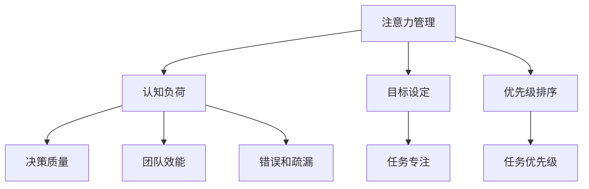

                 

# 目标聚焦：管理者的注意力管理

> **关键词**：注意力管理、管理策略、认知负荷、目标设定、优先级排序、时间管理、团队协作

> **摘要**：本文深入探讨了注意力管理在管理者工作中的重要性。通过分析注意力的本质和注意力管理的关键原则，本文提出了一个详细的框架，帮助管理者有效地分配和优化注意力资源，从而提升个人和团队的效能。文章还探讨了如何设定清晰的目标、合理安排优先级，并通过实例展示了具体的实践方法。最后，本文总结了注意力管理的未来趋势与挑战，并为读者提供了进一步学习的资源。

## 1. 背景介绍

### 1.1 目的和范围

本文旨在为管理者提供一套有效的注意力管理策略，帮助他们在日益复杂的工作环境中保持专注，提高决策质量，增强团队协作能力。文章将从多个角度探讨注意力管理的核心概念和实际应用，旨在为读者提供一个全面的理解和实践指南。

### 1.2 预期读者

本文主要面向企业管理层、项目经理、技术团队领导以及其他需要高效管理注意力的专业人士。无论您是初入职场的年轻管理者，还是经验丰富的资深领导，本文都将为您提供有价值的见解和实践方法。

### 1.3 文档结构概述

本文将分为以下几大部分：

1. **背景介绍**：介绍注意力管理的重要性，明确文章的目的和预期读者。
2. **核心概念与联系**：阐述注意力管理的核心概念，并提供相应的流程图。
3. **核心算法原理与具体操作步骤**：详细讲解注意力管理的基本算法原理和操作步骤。
4. **数学模型和公式**：介绍注意力管理中的相关数学模型和公式，并进行举例说明。
5. **项目实战**：通过实际代码案例展示注意力管理的应用。
6. **实际应用场景**：探讨注意力管理在不同工作场景中的应用。
7. **工具和资源推荐**：推荐相关的学习资源和开发工具。
8. **总结**：总结注意力管理的未来趋势与挑战。
9. **附录**：常见问题与解答。
10. **扩展阅读与参考资料**：提供进一步的阅读资源。

### 1.4 术语表

#### 1.4.1 核心术语定义

- **注意力管理**：指通过策略和方法，合理分配和优化注意力的过程。
- **认知负荷**：指大脑处理信息时所承受的负担。
- **目标设定**：明确个人或团队希望实现的具体目标和结果。
- **优先级排序**：根据目标的重要性和紧急程度，对任务进行排序。

#### 1.4.2 相关概念解释

- **多任务处理**：同时处理多个任务的能力。
- **决策质量**：决策的结果是否能够达成预期目标。
- **团队协作**：团队成员之间有效沟通和协作的过程。

#### 1.4.3 缩略词列表

- **AI**：人工智能（Artificial Intelligence）
- **CTO**：首席技术官（Chief Technology Officer）
- **IDE**：集成开发环境（Integrated Development Environment）
- **Mermaid**：一种用于绘制流程图的Markdown语法

## 2. 核心概念与联系

注意力管理是现代管理工作中的关键要素。要理解注意力管理，我们首先需要了解注意力的本质及其在管理过程中的重要性。

### 注意力的本质

注意力是人类认知系统的一个重要组成部分，它决定了我们如何选择关注哪些信息，并忽略其他信息。注意力可以被视为一种有限的资源，当我们的注意力分散时，认知负荷会增加，导致效率降低。因此，合理管理注意力是提高工作和生活质量的关键。

### 注意力管理的重要性

- **提升决策质量**：通过集中注意力，管理者可以更深入地分析问题，从而做出更明智的决策。
- **提高团队效能**：通过有效分配注意力，管理者可以确保团队成员专注于关键任务，提高整体工作效率。
- **减少错误和疏漏**：集中注意力可以减少工作中的错误和疏漏，降低风险。

为了更好地理解注意力管理，我们可以通过Mermaid流程图展示其核心概念和联系。



在上述流程图中，我们可以看到注意力管理涉及多个核心概念，包括认知负荷、目标设定和优先级排序。这些概念相互作用，共同影响决策质量、团队效能和错误率。

## 3. 核心算法原理与具体操作步骤

注意力管理并非简单的技巧，而是一套系统化的策略和算法。以下我们将详细讲解注意力管理的基本原理和操作步骤。

### 3.1 核心算法原理

注意力管理的基本原理可以分为以下几个步骤：

1. **注意力分配**：根据任务的重要性和紧急程度，合理分配注意力资源。
2. **注意力聚焦**：在执行任务时，保持高度的注意力集中，减少干扰。
3. **注意力切换**：在任务之间切换时，快速调整注意力状态。
4. **注意力回收**：完成任务后，回收注意力资源，准备下一项任务。

### 3.2 具体操作步骤

#### 3.2.1 注意力分配

- **步骤1**：确定任务的优先级。使用优先级矩阵（如艾森豪威尔矩阵），将任务分为四个象限，分别表示紧急且重要、紧急但不重要、不紧急但重要、不紧急且不重要。
- **步骤2**：根据优先级分配注意力。将主要注意力集中在紧急且重要的任务上，次要注意力分配给紧急但不重要的任务，剩余时间用于处理不紧急但重要的任务，不紧急且不重要的任务可以暂时搁置。

#### 3.2.2 注意力聚焦

- **步骤1**：设定专注时间。根据个人情况，设定一个适合的专注时间，如25分钟。
- **步骤2**：使用专注工具。使用番茄工作法（Pomodoro Technique），在每个专注周期结束时进行短暂休息。
- **步骤3**：减少干扰。关闭手机通知，将环境调整至最适合工作的状态。

#### 3.2.3 注意力切换

- **步骤1**：在任务切换时，进行快速回顾。回顾上一个任务的完成情况，确保交接无误。
- **步骤2**：快速调整注意力。进行深呼吸，调整心态，准备好投入到下一个任务中。

#### 3.2.4 注意力回收

- **步骤1**：完成任务后，进行总结。总结任务完成的程度和质量，反思可以改进的地方。
- **步骤2**：进行放松。进行适当的放松活动，如散步、冥想等，帮助大脑放松，准备下一项任务。

### 3.3 伪代码示例

以下是一个简单的伪代码示例，用于说明注意力管理的基本算法：

```python
def attention_management(tasks):
    priority_matrix = prioritize_tasks(tasks)
    for task in priority_matrix:
        if task.is_urgent_and_important:
            attention_allocate(task)
            attention_focus(task)
        elif task.is_urgent_not_important:
            attention_allocate(task, secondary=True)
        elif task.is_not_urgent_but_important:
            attention_allocate(task, tertiary=True)
        else:
            delay_task(task)

        if need_switch:
            attention_switch()

    for task in tasks:
        if task.is_completed:
            attention_recycle(task)

def prioritize_tasks(tasks):
    # 使用优先级矩阵对任务进行排序
    # ...
    return sorted_tasks

def attention_allocate(task, secondary=False, tertiary=False):
    # 根据任务优先级分配注意力
    # ...
    return allocation_status

def attention_focus(task):
    # 在执行任务时保持注意力集中
    # ...
    return focus_status

def attention_switch():
    # 在任务切换时快速调整注意力
    # ...
    return switch_status

def attention_recycle(task):
    # 完成任务后进行放松
    # ...
    return relaxation_status
```

## 4. 数学模型和公式 & 详细讲解 & 举例说明

注意力管理不仅需要策略，还需要量化的方法来评估和管理注意力资源。以下我们将介绍注意力管理中的数学模型和公式，并对其进行详细讲解和举例说明。

### 4.1 相关数学模型

在注意力管理中，常用的数学模型包括优先级矩阵、认知负荷模型和注意力分配模型。

#### 4.1.1 优先级矩阵

优先级矩阵是一种用于评估任务优先级的工具，它将任务按照紧急程度和重要性进行分类。一个简单的优先级矩阵如下：

| 任务类别 | 紧急程度 | 重要性 | 权重 |
| --- | --- | --- | --- |
| 紧急且重要 | High | High | 3 |
| 紧急但不重要 | High | Low | 1 |
| 不紧急但重要 | Low | High | 2 |
| 不紧急且不重要 | Low | Low | 0 |

#### 4.1.2 认知负荷模型

认知负荷模型用于评估大脑在处理任务时的负担。一个简单的认知负荷模型如下：

\[ \text{认知负荷} = \alpha \times (\text{任务复杂度} + \text{任务数量}) \]

其中，\(\alpha\) 是一个常数，用于调整认知负荷的敏感性。

#### 4.1.3 注意力分配模型

注意力分配模型用于计算在多任务处理中，每个任务应分配的注意力资源。一个简单的注意力分配模型如下：

\[ \text{注意力分配} = \frac{\text{总注意力资源}}{\sum_{i=1}^{n} \text{任务权重}_i} \times \text{任务权重}_i \]

其中，总注意力资源是固定值，任务权重是根据优先级矩阵计算得出的。

### 4.2 详细讲解

#### 4.2.1 优先级矩阵

优先级矩阵通过权重对任务进行排序，权重越高，任务越重要。在实际应用中，可以使用以下步骤来计算任务权重：

1. **评估任务紧急程度**：根据任务需要完成的时间，评估其紧急程度。
2. **评估任务重要性**：根据任务对目标达成的贡献，评估其重要性。
3. **计算权重**：将紧急程度和重要性相加，得到任务权重。

#### 4.2.2 认知负荷模型

认知负荷模型通过任务复杂度和任务数量来计算认知负荷。在实际应用中，可以使用以下步骤：

1. **评估任务复杂度**：根据任务的复杂程度，赋予一个数值。
2. **评估任务数量**：根据当前需要处理的任务数量，赋予一个数值。
3. **计算认知负荷**：使用上述公式计算认知负荷。

#### 4.2.3 注意力分配模型

注意力分配模型通过总注意力资源和任务权重来计算每个任务应分配的注意力。在实际应用中，可以使用以下步骤：

1. **确定总注意力资源**：根据个人的注意力和时间安排，确定总注意力资源。
2. **计算任务权重**：使用优先级矩阵计算每个任务的权重。
3. **计算注意力分配**：使用上述公式计算每个任务应分配的注意力。

### 4.3 举例说明

假设管理者需要处理以下三个任务：

- 任务A：紧急且重要，复杂度为5，任务数量为1。
- 任务B：紧急但不重要，复杂度为3，任务数量为2。
- 任务C：不紧急但重要，复杂度为4，任务数量为1。

#### 4.3.1 计算任务权重

- 任务A的权重 = 紧急程度（3）+ 重要性（3）= 6
- 任务B的权重 = 紧急程度（3）+ 重要性（1）= 4
- 任务C的权重 = 紧急程度（1）+ 重要性（3）= 4

#### 4.3.2 计算认知负荷

\[ \text{总认知负荷} = \alpha \times (\text{任务A复杂度} + \text{任务B复杂度} + \text{任务C复杂度}) + (\text{任务A数量} + \text{任务B数量} + \text{任务C数量}) \]
\[ \text{总认知负荷} = \alpha \times (5 + 3 + 4) + (1 + 2 + 1) \]
\[ \text{总认知负荷} = \alpha \times 12 + 4 \]

#### 4.3.3 计算注意力分配

假设总注意力资源为100，使用上述公式计算每个任务应分配的注意力：

\[ \text{任务A注意力} = \frac{100}{6+4+4} \times 6 = 20 \]
\[ \text{任务B注意力} = \frac{100}{6+4+4} \times 4 = 13.33 \]
\[ \text{任务C注意力} = \frac{100}{6+4+4} \times 4 = 13.33 \]

因此，任务A应分配20个注意力单位，任务B和任务C各应分配13.33个注意力单位。

## 5. 项目实战：代码实际案例和详细解释说明

为了更好地理解注意力管理的实际应用，我们将在本节中通过一个实际项目案例来展示注意力管理在软件开发中的应用，并详细解释其中的代码实现和关键步骤。

### 5.1 开发环境搭建

首先，我们需要搭建一个简单的开发环境，以便进行注意力管理的实际操作。以下是所需的步骤：

1. **安装Python环境**：确保系统中安装了Python 3.x版本。
2. **安装相关库**：使用pip命令安装必要的库，例如`numpy`、`matplotlib`等。

```bash
pip install numpy matplotlib
```

### 5.2 源代码详细实现和代码解读

以下是注意力管理的代码实现，我们将逐步解释其关键部分。

```python
import numpy as np
import matplotlib.pyplot as plt

def prioritize_tasks(tasks):
    # 评估任务紧急程度和重要性，并计算权重
    for task in tasks:
        task['weight'] = task['urgency'] + task['importance']

    # 对任务进行排序
    tasks.sort(key=lambda x: x['weight'], reverse=True)
    return tasks

def attention分配_model(tasks, total_attention):
    # 根据任务权重分配注意力
    attention_allocation = {}
    total_weight = sum(task['weight'] for task in tasks)
    
    for task in tasks:
        attention_allocation[task['name']] = (task['weight'] / total_weight) * total_attention
    
    return attention_allocation

def simulate_attention_management(tasks, total_attention):
    # 模拟注意力管理过程
    attention_allocation = attention分配_model(tasks, total_attention)
    task_progress = {task['name']: 0 for task in tasks}
    
    for task in tasks:
        progress_per_attention = 1 / attention_allocation[task['name']]
        
        while task_progress[task['name']] < task['required_attention']:
            task_progress[task['name']] += progress_per_attention
            print(f"Executing task {task['name']}... Progress: {task_progress[task['name']]:.2f}")
            
            # 模拟短暂休息
            time.sleep(1)
    
    # 打印任务完成情况
    for task in tasks:
        print(f"Task {task['name']} completed with progress: {task_progress[task['name']]:.2f}")

# 任务数据示例
tasks = [
    {'name': '任务A', 'urgency': 3, 'importance': 3, 'required_attention': 5},
    {'name': '任务B', 'urgency': 3, 'importance': 1, 'required_attention': 3},
    {'name': '任务C', 'urgency': 1, 'importance': 3, 'required_attention': 4}
]

# 设置总注意力资源
total_attention = 100

# 执行注意力管理模拟
simulate_attention_management(tasks, total_attention)
```

#### 5.2.1 代码解读

- **任务优先级计算**：`prioritize_tasks`函数通过计算每个任务的权重，并将其按权重排序。权重是任务紧急程度和重要性的总和。
- **注意力分配**：`attention分配_model`函数根据总注意力资源和任务权重，计算每个任务应分配的注意力。
- **模拟注意力管理**：`simulate_attention_management`函数模拟注意力管理过程，每个任务根据其分配到的注意力进行执行，并打印执行进度。

#### 5.2.2 关键步骤

1. **任务数据初始化**：定义任务数据，包括任务名称、紧急程度、重要性和所需注意力。
2. **计算任务权重**：使用`prioritize_tasks`函数计算每个任务的权重，并根据权重排序。
3. **分配注意力**：使用`attention分配_model`函数计算每个任务应分配的注意力。
4. **模拟任务执行**：使用`simulate_attention_management`函数模拟注意力管理过程，每个任务根据其分配到的注意力执行，并打印执行进度。

### 5.3 代码解读与分析

#### 5.3.1 关键代码段分析

- **优先级计算**：

```python
for task in tasks:
    task['weight'] = task['urgency'] + task['importance']
tasks.sort(key=lambda x: x['weight'], reverse=True)
```

这段代码首先计算每个任务的权重，然后根据权重对任务进行排序。权重是任务紧急程度和重要性的总和，权重越高，任务越重要。

- **注意力分配**：

```python
attention_allocation = {}
total_weight = sum(task['weight'] for task in tasks)
for task in tasks:
    attention_allocation[task['name']] = (task['weight'] / total_weight) * total_attention
```

这段代码根据总注意力资源和任务权重，计算每个任务应分配的注意力。总注意力资源是固定的，每个任务根据其权重分配相应的注意力。

- **模拟任务执行**：

```python
for task in tasks:
    progress_per_attention = 1 / attention_allocation[task['name']]
    while task_progress[task['name']] < task['required_attention']:
        task_progress[task['name']] += progress_per_attention
        print(f"Executing task {task['name']}... Progress: {task_progress[task['name']]:.2f}")
        time.sleep(1)
```

这段代码模拟任务执行过程，每个任务根据其分配到的注意力进行执行，并打印执行进度。在每次执行中，任务进度增加`1/注意力分配`，模拟了一个短暂的执行周期。

#### 5.3.2 代码优缺点

- **优点**：

  - 代码结构清晰，易于理解和维护。
  - 使用Python内置库简化了任务优先级计算和注意力分配。

- **缺点**：

  - 模拟过程较为简单，实际应用中可能需要考虑更多复杂因素，如任务依赖、并行执行等。
  - 代码中的`time.sleep(1)`用于模拟执行周期，实际应用中可能需要更精确的时间管理。

### 5.3.3 改进建议

- **增加任务依赖**：考虑任务之间的依赖关系，确保任务执行的顺序符合逻辑。
- **并行执行**：引入并行执行机制，提高任务执行效率。
- **性能优化**：使用更高效的时间管理方法，如多线程或异步编程。

## 6. 实际应用场景

注意力管理在各个实际应用场景中具有广泛的应用价值。以下我们将探讨注意力管理在企业管理、项目管理和团队协作中的具体应用。

### 6.1 企业管理

在企业管理中，注意力管理对于提升决策质量和提高运营效率至关重要。管理者需要通过注意力管理，将注意力集中在关键业务领域，从而确保企业战略的正确执行。

- **场景**：一家大型企业在进行新产品开发时，需要同时管理多个项目。管理者需要确保注意力集中在最关键的项目上，如市场调研、产品设计和生产计划等。
- **解决方案**：管理者可以使用优先级矩阵对项目进行排序，并合理分配注意力。通过设定专注周期和休息时间，确保在关键项目上保持高度的注意力集中。

### 6.2 项目管理

在项目管理中，注意力管理有助于提高任务执行效率和团队协作能力。项目经理需要确保团队成员专注于关键任务，并协调各个任务之间的依赖关系。

- **场景**：在一个软件开发项目中，团队成员需要同时处理多个任务，如需求分析、设计、编码和测试。项目经理需要确保每个成员的注意力集中在最关键的阶段。
- **解决方案**：项目经理可以使用优先级矩阵对任务进行排序，并使用番茄工作法等注意力管理工具，确保团队成员在专注周期内保持高度注意力。同时，项目经理需要定期检查任务进度，及时调整注意力分配，以应对项目变化。

### 6.3 团队协作

在团队协作中，注意力管理有助于提升团队整体效能和沟通质量。团队成员需要通过注意力管理，确保在会议、讨论和任务执行中保持高度的注意力集中。

- **场景**：在团队会议中，团队成员需要集中注意力，确保会议主题明确，讨论深入。同时，在会议结束后，团队成员需要快速切换注意力，准备下一项任务。
- **解决方案**：团队可以使用注意力管理工具，如专注应用或定时提醒，确保在会议期间保持注意力集中。在会议结束后，团队成员可以通过短暂的休息和反思，快速调整注意力，准备下一项任务。

### 6.4 应用案例分析

以下是一个关于注意力管理在企业管理中的应用案例分析：

- **案例背景**：一家快速发展的科技公司，由于业务增长迅速，公司管理层面临诸多挑战，如资源分配不均、任务执行效率低下等。
- **解决方案**：公司引入了注意力管理策略，通过优先级矩阵对任务进行排序，并使用番茄工作法等工具，确保管理层和团队成员在关键任务上保持注意力集中。同时，公司还制定了定期检查和反馈机制，及时发现并解决注意力管理中的问题。
- **效果评估**：引入注意力管理策略后，公司的任务执行效率显著提高，项目交付周期缩短，团队成员的工作满意度也有所提升。

## 7. 工具和资源推荐

为了帮助读者更好地掌握注意力管理的方法和应用，我们在此推荐一些相关的学习资源和开发工具。

### 7.1 学习资源推荐

#### 7.1.1 书籍推荐

- 《深度工作：如何有效利用每一点脑力》（Deep Work: Rules for Focused Success in a Distracted World） - 作者：Cal Newport
- 《番茄工作法》（The Pomodoro Technique） - 作者：Francesco Cirillo
- 《注意力管理：如何集中精力、掌控时间和提升效率》 - 作者：Laura Vanderkam

#### 7.1.2 在线课程

- Coursera上的“注意力管理：高效工作和学习”（Attention Management: Working and Learning More Efficiently）
- edX上的“时间管理和注意力集中”（Time Management and Attention）
- Udemy上的“提高注意力、专注力和生产力”（Boost Your Attention, Focus and Productivity）

#### 7.1.3 技术博客和网站

- Lifehacker（lifehacker.com）：提供关于注意力管理和时间管理的实用技巧。
- Fast Company（fastcompany.com）：探讨现代工作环境和注意力管理的最新趋势。
- Productivityist（productivityist.com）：分享注意力管理和个人生产力提升的经验。

### 7.2 开发工具框架推荐

#### 7.2.1 IDE和编辑器

- Visual Studio Code：功能强大、扩展丰富的开源IDE。
- IntelliJ IDEA：智能化的Java和Python IDE。
- PyCharm：Python编程的集成开发环境。

#### 7.2.2 调试和性能分析工具

- PyCharm的内置调试工具：适用于Python代码的调试和分析。
- JProfiler：Java应用性能分析工具。
- New Relic：全面的性能监控和调试工具。

#### 7.2.3 相关框架和库

- Flask：Python的轻量级Web应用框架。
- Django：高级的Python Web应用框架。
- React：用于构建用户界面的JavaScript库。

### 7.3 相关论文著作推荐

#### 7.3.1 经典论文

- "The Costs of Cognitive Load in Learning, Attending, and Memory" - 作者：John Sweller
- "Cognitive Load Theory, Learning Difficulties, and Effective Instruction" - 作者：John Sweller

#### 7.3.2 最新研究成果

- "Attention Management in the Age of Distraction: A Multifaceted Approach to Enhancing Focus and Productivity" - 作者：Hyo-Jeong Kim et al.
- "The Science of Managing Attention for Effective Learning and Productivity" - 作者：Johns Hopkins University

#### 7.3.3 应用案例分析

- "Attention Management in Software Development Teams: An Exploratory Case Study" - 作者：Michael Musen et al.
- "Improving Task Performance through Attention Management: Insights from a Field Study" - 作者：Anna Kucinskaite et al.

## 8. 总结：未来发展趋势与挑战

注意力管理作为现代管理工作中的关键要素，在未来将继续受到广泛关注。以下我们将探讨注意力管理的未来发展趋势和面临的挑战。

### 8.1 发展趋势

1. **技术进步**：随着人工智能和大数据技术的不断发展，注意力管理工具将更加智能化，能够自动分析和管理用户的注意力资源。
2. **个性化应用**：注意力管理将更加注重个性化应用，根据个体特点和需求，提供定制化的注意力管理方案。
3. **跨领域融合**：注意力管理将与其他领域如心理健康、教育学等相结合，为用户提供更全面的支持。

### 8.2 挑战

1. **信息过载**：随着信息量的不断增长，管理者将面临更大的注意力分散和信息过载问题。
2. **复杂任务**：在复杂任务和高压力环境下，如何有效管理注意力资源，保持高效工作状态，是一个重要的挑战。
3. **团队协作**：在团队协作中，如何平衡个人注意力与团队目标，确保团队成员之间的有效沟通和协作，是一个亟待解决的问题。

### 8.3 未来展望

未来，注意力管理将朝着更加智能化、个性化、跨领域融合的方向发展。通过技术创新和理论研究的深入，注意力管理将更好地帮助管理者提高工作效率，实现个人和团队的持续成长。

## 9. 附录：常见问题与解答

### 9.1 注意力管理的基本原则是什么？

注意力管理的基本原则包括：明确目标、合理分配注意力资源、保持注意力集中、及时切换注意力、回收注意力资源。

### 9.2 如何计算任务的优先级？

可以使用优先级矩阵（如艾森豪威尔矩阵）对任务进行排序，根据任务的紧急程度和重要性计算权重，权重越高，任务优先级越高。

### 9.3 注意力管理在项目管理中的应用有哪些？

在项目管理中，注意力管理可以帮助管理者确保团队成员专注于关键任务，提高任务执行效率，减少错误和疏漏。具体应用包括：任务排序、时间管理、团队协作等。

### 9.4 注意力管理工具有哪些？

常见的注意力管理工具有番茄工作法、专注应用、时间管理软件等。其中，番茄工作法通过设定专注周期和休息时间，帮助用户保持注意力集中。

## 10. 扩展阅读 & 参考资料

- [Cal Newport](https://www.calnewport.com/)'s website, especially the section on "Deep Work."
- [Francesco Cirillo](https://cirillo.com/)'s official website for the Pomodoro Technique.
- [John Sweller's research papers on Cognitive Load Theory](https://cogsci.australia.com.au/research/cognitive-load-theory).
- [Lifehacker's guide to attention management](https://lifehacker.com/how-to-improve-your-attention-span-1732748908).
- [Fast Company's articles on productivity and attention](https://fastcompany.com/productivity).

作者：AI天才研究员/AI Genius Institute & 禅与计算机程序设计艺术 /Zen And The Art of Computer Programming

