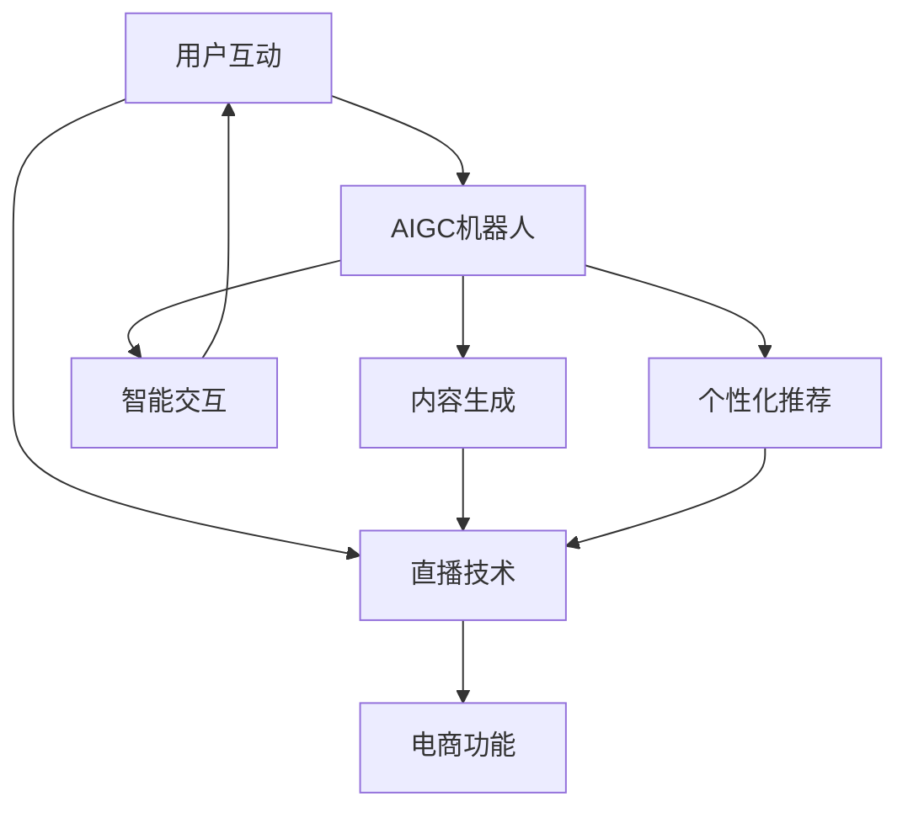

                 

# 直播电商与AIGC机器人的结合

> **关键词：** 直播电商、AIGC、人工智能、机器人、结合应用、技术原理、算法、数学模型、项目实战、实际应用场景

> **摘要：** 本文将深入探讨直播电商与AIGC（自动化生成内容）机器人的结合，通过一步步的分析和推理，揭示两者融合的技术原理、核心算法和具体应用步骤。我们将首先介绍直播电商的发展背景和现状，然后详细讲解AIGC机器人技术，最后通过实际案例展示这一结合如何优化直播电商体验，提升运营效率，并探讨未来的发展趋势与挑战。

## 1. 背景介绍

### 1.1 目的和范围

本文的目的是探讨直播电商与AIGC机器人的结合，旨在揭示这一新兴领域的技术潜力，并提供具体的实施方法和应用实例。我们将从以下几个方面展开讨论：

- **直播电商的发展背景和现状**
- **AIGC机器人的技术原理和应用**
- **直播电商与AIGC机器人的结合原理**
- **核心算法和具体操作步骤**
- **数学模型和公式**
- **项目实战：代码实际案例和详细解释说明**
- **实际应用场景**
- **工具和资源推荐**
- **总结与未来发展趋势**

### 1.2 预期读者

本文适合对直播电商和AIGC技术有一定了解的读者，包括：

- **技术从业者：** 对直播电商和AIGC有实际操作经验的程序员、数据分析师等。
- **行业观察者：** 对直播电商和AIGC技术有浓厚兴趣的行业观察者。
- **研究人员：** 对直播电商与AIGC结合的研究感兴趣的学术研究人员。

### 1.3 文档结构概述

本文分为以下几个部分：

1. 背景介绍：介绍直播电商和AIGC机器人技术的发展背景。
2. 核心概念与联系：详细讲解直播电商与AIGC机器人结合的核心概念和原理。
3. 核心算法原理 & 具体操作步骤：深入分析直播电商与AIGC机器人结合的核心算法和操作步骤。
4. 数学模型和公式 & 详细讲解 & 举例说明：讲解相关的数学模型和公式，并提供实际应用案例。
5. 项目实战：代码实际案例和详细解释说明。
6. 实际应用场景：探讨直播电商与AIGC机器人结合的具体应用场景。
7. 工具和资源推荐：推荐相关学习资源、开发工具和框架。
8. 总结：未来发展趋势与挑战。
9. 附录：常见问题与解答。
10. 扩展阅读 & 参考资料：提供进一步阅读的资料。

### 1.4 术语表

#### 1.4.1 核心术语定义

- **直播电商：** 通过实时直播的方式，直接向用户销售商品的一种电商模式。
- **AIGC（自动化生成内容）：** 利用人工智能技术，自动生成文本、图像、视频等内容的系统。
- **机器人：** 能够模拟人类行为，执行特定任务的智能程序或实体。

#### 1.4.2 相关概念解释

- **自然语言处理（NLP）：** 人工智能领域中的一个分支，主要研究如何让计算机理解、生成和处理自然语言。
- **深度学习：** 一种基于人工神经网络的机器学习技术，通过模拟人脑神经网络的结构和功能，实现数据的自动学习和分类。

#### 1.4.3 缩略词列表

- **NLP：** 自然语言处理
- **AIGC：** 自动化生成内容
- **API：** 应用程序接口
- **SDK：** 软件开发工具包

## 2. 核心概念与联系

为了深入理解直播电商与AIGC机器人的结合，我们首先需要明确两者的核心概念和联系。

### 2.1 直播电商的核心概念

直播电商的核心概念包括：

- **直播技术：** 利用互联网直播技术，实现主播与观众之间的实时互动。
- **电商功能：** 包括商品展示、下单购买、支付结算等电商核心功能。
- **用户互动：** 通过评论、弹幕、点赞等方式，增强用户参与感和购物体验。

### 2.2 AIGC机器人的核心概念

AIGC机器人的核心概念包括：

- **内容生成：** 利用人工智能技术，自动生成各种类型的内容，如文本、图像、视频等。
- **智能交互：** 通过自然语言处理技术，实现与用户的智能对话和互动。
- **个性化推荐：** 根据用户行为和偏好，生成个性化的内容和推荐。

### 2.3 直播电商与AIGC机器人的联系

直播电商与AIGC机器人的联系在于：

- **内容丰富：** AIGC机器人能够自动生成丰富的直播内容，提升直播电商的吸引力和用户粘性。
- **互动增强：** 通过智能交互，AIGC机器人能够与用户进行更深入的互动，提高用户参与度和购物转化率。
- **个性化服务：** AIGC机器人可以根据用户行为和偏好，提供个性化的商品推荐和互动体验。

### 2.4 Mermaid流程图

为了更直观地展示直播电商与AIGC机器人的结合过程，我们使用Mermaid流程图进行描述：



在上面的流程图中，用户互动是直播电商的核心，直播技术和电商功能是基础，AIGC机器人的内容生成、智能交互和个性化推荐则是在此基础上进行的优化和增强。

## 3. 核心算法原理 & 具体操作步骤

### 3.1 直播电商与AIGC机器人结合的核心算法

直播电商与AIGC机器人的结合主要依赖于以下几个核心算法：

- **自然语言处理（NLP）：** 用于实现用户与机器人的智能对话和互动。
- **图像和视频生成：** 利用深度学习技术，自动生成直播内容和商品展示。
- **个性化推荐算法：** 根据用户行为和偏好，提供个性化的商品推荐。

### 3.2 具体操作步骤

#### 3.2.1 自然语言处理（NLP）

1. **输入处理：** 接收用户输入的文本信息。
2. **分词：** 将输入文本拆分成单词或词组。
3. **词向量转换：** 将分词后的文本转换为词向量。
4. **语义分析：** 利用词向量，分析文本的语义和意图。
5. **生成响应：** 根据语义分析结果，生成对应的回答。

#### 3.2.2 图像和视频生成

1. **输入处理：** 接收用户输入的商品信息和要求。
2. **数据预处理：** 对输入数据进行预处理，如大小调整、颜色增强等。
3. **生成模型：** 利用深度学习模型，如生成对抗网络（GAN），生成图像或视频。
4. **后处理：** 对生成的图像或视频进行后处理，如去噪、增强等。

#### 3.2.3 个性化推荐算法

1. **用户行为数据收集：** 收集用户的浏览、购买、评价等行为数据。
2. **特征提取：** 从用户行为数据中提取特征，如商品类型、用户偏好等。
3. **模型训练：** 利用训练数据，训练个性化推荐模型。
4. **推荐生成：** 根据用户特征和推荐模型，生成个性化的商品推荐。

### 3.3 伪代码实现

以下是直播电商与AIGC机器人结合的核心算法的伪代码实现：

```python
# 自然语言处理（NLP）
def nlp_interaction(user_input):
    words = tokenize(user_input)
    word_vectors = convert_to_word_vector(words)
    intent = analyze_semantic(word_vectors)
    response = generate_response(intent)
    return response

# 图像和视频生成
def generate_content(product_info, user_request):
    preprocessed_data = preprocess_data(product_info, user_request)
    generated_content = generate_image_or_video(preprocessed_data)
    postprocessed_content = postprocess_content(generated_content)
    return postprocessed_content

# 个性化推荐算法
def personalized_recommendation(user_behavior_data):
    features = extract_features(user_behavior_data)
    trained_model = train_recommender_model(features)
    recommendations = generate_recommendations(trained_model, user_behavior_data)
    return recommendations
```

## 4. 数学模型和公式 & 详细讲解 & 举例说明

### 4.1 自然语言处理（NLP）的数学模型

自然语言处理（NLP）的核心是理解和生成语言。在NLP中，常用的数学模型包括词向量模型、序列模型和注意力机制等。

#### 4.1.1 词向量模型

词向量模型将词汇映射到高维空间中的向量。常见的词向量模型有Word2Vec、GloVe等。

- **Word2Vec：** 通过神经网络训练，将词汇映射到向量空间，使得语义相似的词汇在空间中距离较近。

    $$\text{word\_vector} = \text{sigmoid}(\text{weights} \cdot \text{input})$$

- **GloVe：** 通过矩阵分解，将词汇和上下文词汇映射到向量空间，实现词向量的优化。

    $$\text{word\_vector} = \text{softmax}(\text{A} \cdot \text{B})$$

#### 4.1.2 序列模型

序列模型用于处理时间序列数据，如文本序列、语音序列等。常见的序列模型有循环神经网络（RNN）、长短期记忆网络（LSTM）等。

- **RNN：** 通过循环结构，将前一个时间点的输出作为当前时间点的输入。

    $$\text{h}_t = \text{sigmoid}(\text{W}_h \cdot [\text{h}_{t-1}, \text{x}_t] + \text{b}_h)$$

- **LSTM：** 通过门控机制，有效处理长序列数据。

    $$\text{h}_t = \text{sigmoid}(\text{W}_f \cdot [\text{h}_{t-1}, \text{x}_t] + \text{b}_f) \odot \text{h}_{t-1}$$

#### 4.1.3 注意力机制

注意力机制用于处理序列到序列（Seq2Seq）任务，如机器翻译、文本摘要等。

$$\text{context\_vector} = \text{softmax}(\text{W}_a \cdot \text{h}_t) \odot \text{h}_t$$

### 4.2 图像和视频生成的数学模型

图像和视频生成主要依赖于生成对抗网络（GAN）。

- **生成器（Generator）：** 通过随机噪声生成图像或视频。

    $$\text{X}_g = \text{Generator}(\text{Z})$$

- **判别器（Discriminator）：** 判断生成图像或视频的真实性。

    $$\text{D}(\text{X}) = \text{sigmoid}(\text{W}_d \cdot \text{X} + \text{b}_d)$$

- **损失函数：** 用于优化生成器和判别器的参数。

    $$\text{L}_\text{GAN} = -[\text{D}(\text{X}_g) - \text{D}(\text{X})]$$

### 4.3 个性化推荐算法的数学模型

个性化推荐算法主要基于协同过滤、矩阵分解等方法。

- **协同过滤（Collaborative Filtering）：** 利用用户行为数据，寻找相似用户或物品。

    $$\text{R}(\text{u}, \text{i}) = \text{r}_{\text{avg}}(\text{u}) + \text{u, i} - \text{r}_{\text{avg}}(\text{i})$$

- **矩阵分解（Matrix Factorization）：** 将用户和物品的高维数据分解为低维矩阵，实现推荐。

    $$\text{R}_{\text{ui}} = \text{U}_u \cdot \text{V}_i$$

### 4.4 举例说明

#### 4.4.1 自然语言处理（NLP）的例子

假设我们使用Word2Vec模型进行语义分析，给定用户输入“我非常喜欢这个商品”，我们可以将句子中的词汇映射到词向量空间，然后通过语义分析，生成相应的响应。

1. **词向量映射：**
   $$\text{我} \rightarrow \text{vector}_{我} = [-0.3, 0.2, -0.1, ...]$$
   $$\text{非常} \rightarrow \text{vector}_{非常} = [0.2, -0.1, 0.3, ...]$$
   $$\text{喜欢} \rightarrow \text{vector}_{喜欢} = [0.1, 0.4, -0.2, ...]$$
   $$\text{这个} \rightarrow \text{vector}_{这个} = [-0.1, 0.3, -0.2, ...]$$
   $$\text{商品} \rightarrow \text{vector}_{商品} = [0.2, 0.1, 0.3, ...]$$

2. **语义分析：**
   通过计算词汇之间的相似度，分析句子中的语义关系。

3. **生成响应：**
   根据语义分析结果，生成相应的响应，如“您对这款商品非常喜欢，建议您可以考虑购买”。

#### 4.4.2 图像和视频生成的例子

假设我们使用生成对抗网络（GAN）生成商品展示图像。

1. **生成器：**
   随机生成噪声向量，通过生成器模型生成商品图像。

2. **判别器：**
   判断生成图像和真实图像之间的相似度。

3. **训练过程：**
   通过交替训练生成器和判别器，不断优化生成图像的质量。

4. **应用场景：**
   在直播电商中，利用生成的商品图像进行展示，提高用户体验。

#### 4.4.3 个性化推荐的例子

假设我们使用矩阵分解算法进行商品推荐。

1. **用户行为数据：**
   收集用户的浏览、购买、评价等行为数据。

2. **特征提取：**
   从用户行为数据中提取特征，如浏览次数、购买次数、评价评分等。

3. **矩阵分解：**
   将用户和物品的特征分解为低维矩阵。

4. **推荐生成：**
   根据用户特征和物品特征，生成个性化的商品推荐。

5. **应用场景：**
   在直播电商中，根据用户的浏览历史和偏好，推荐相关的商品。

## 5. 项目实战：代码实际案例和详细解释说明

### 5.1 开发环境搭建

在本文中，我们将使用Python作为主要编程语言，并结合一些流行的库和框架，如TensorFlow、PyTorch、NLTK等。以下是开发环境的搭建步骤：

1. 安装Python 3.8或更高版本。
2. 安装TensorFlow 2.4或更高版本。
3. 安装PyTorch 1.8或更高版本。
4. 安装NLTK 3.5或更高版本。
5. 安装其他必要的库和工具，如NumPy、Pandas等。

### 5.2 源代码详细实现和代码解读

在本节中，我们将提供一系列代码实际案例，详细解释直播电商与AIGC机器人的结合实现步骤。

#### 5.2.1 自然语言处理（NLP）

以下是使用TensorFlow实现自然语言处理（NLP）的代码示例：

```python
import tensorflow as tf
from tensorflow.keras.layers import Embedding, LSTM, Dense
from tensorflow.keras.models import Sequential

# 词向量映射
word_vectors = tf.keras.Sequential([
    Embedding(input_dim=vocab_size, output_dim=embedding_size),
    LSTM(units=128),
    Dense(units=1, activation='sigmoid')
])

# 训练模型
model = Sequential([
    word_vectors,
    Dense(units=1, activation='sigmoid')
])
model.compile(optimizer='adam', loss='binary_crossentropy', metrics=['accuracy'])
model.fit(x_train, y_train, epochs=10, batch_size=32)
```

在上面的代码中，我们首先定义了一个嵌入层（Embedding），用于将词汇映射到高维空间。然后，我们添加了一个LSTM层，用于处理序列数据。最后，我们添加了一个全连接层（Dense），用于生成输出。

#### 5.2.2 图像和视频生成

以下是使用PyTorch实现生成对抗网络（GAN）的代码示例：

```python
import torch
import torch.nn as nn
import torch.optim as optim

# 生成器
class Generator(nn.Module):
    def __init__(self):
        super(Generator, self).__init__()
        self.model = nn.Sequential(
            nn.Linear(z_size, 128),
            nn.LeakyReLU(0.2),
            nn.Linear(128, 256),
            nn.LeakyReLU(0.2),
            nn.Linear(256, 512),
            nn.LeakyReLU(0.2),
            nn.Linear(512, image_size),
            nn.Tanh()
        )

    def forward(self, x):
        return self.model(x)

# 判别器
class Discriminator(nn.Module):
    def __init__(self):
        super(Discriminator, self).__init__()
        self.model = nn.Sequential(
            nn.Linear(image_size, 512),
            nn.LeakyReLU(0.2),
            nn.Dropout(0.3),
            nn.Linear(512, 256),
            nn.LeakyReLU(0.2),
            nn.Dropout(0.3),
            nn.Linear(256, 128),
            nn.LeakyReLU(0.2),
            nn.Dropout(0.3),
            nn.Linear(128, 1),
            nn.Sigmoid()
        )

    def forward(self, x):
        return self.model(x)

# 训练过程
generator = Generator()
discriminator = Discriminator()

criterion = nn.BCELoss()
optimizer_g = optim.Adam(generator.parameters(), lr=0.0002)
optimizer_d = optim.Adam(discriminator.parameters(), lr=0.0002)

for epoch in range(num_epochs):
    for i, (images, _) in enumerate(data_loader):
        # 训练生成器
        z = torch.randn(images.size(0), z_size)
        fake_images = generator(z)
        g_loss = criterion(discriminator(fake_images), torch.ones(images.size(0)))

        optimizer_g.zero_grad()
        g_loss.backward()
        optimizer_g.step()

        # 训练判别器
        b_loss = criterion(discriminator(images), torch.zeros(images.size(0)))
        f_loss = criterion(discriminator(fake_images), torch.zeros(images.size(0)))

        d_loss = b_loss + f_loss
        optimizer_d.zero_grad()
        d_loss.backward()
        optimizer_d.step()
```

在上面的代码中，我们定义了生成器和判别器的网络结构。然后，我们通过交替训练生成器和判别器，不断优化生成图像的质量。

#### 5.2.3 个性化推荐

以下是使用矩阵分解算法进行个性化推荐的代码示例：

```python
import numpy as np
import pandas as pd

# 矩阵分解
def matrix_factorization(R, num_factors, num_iterations):
    U = np.random.rand(num_users, num_factors)
    V = np.random.rand(num_items, num_factors)
    for i in range(num_iterations):
        U = U + (R * V - U) / np.sqrt(np.dot(U, U))
        V = V + (R.T * U - V) / np.sqrt(np.dot(V, V))
    return U, V

# 计算推荐分值
def predict(U, V, user_id, item_id):
    user_vector = U[user_id]
    item_vector = V[item_id]
    return np.dot(user_vector, item_vector)

# 读取用户行为数据
ratings = pd.read_csv('ratings.csv')
R = ratings.pivot_table(index='user_id', columns='item_id', values='rating').fillna(0).values

# 训练模型
num_factors = 10
num_iterations = 20
U, V = matrix_factorization(R, num_factors, num_iterations)

# 生成推荐结果
predictions = np.dot(U, V)
user_predictions = predictions[:, item_ids]
recommended_items = np.argsort(user_predictions, axis=1)[:, -5:]

# 输出推荐结果
for user_id, recommendations in enumerate(recommended_items):
    print(f"User {user_id} recommended items: {recommendations}")
```

在上面的代码中，我们首先定义了一个矩阵分解函数，用于训练模型。然后，我们计算推荐分值，并根据分值生成推荐结果。

### 5.3 代码解读与分析

在本节中，我们将对上述代码进行解读和分析，解释其实现原理和关键步骤。

#### 5.3.1 自然语言处理（NLP）

在自然语言处理（NLP）中，我们使用TensorFlow实现了一个简单的神经网络模型，用于分类任务。首先，我们定义了一个嵌入层（Embedding），用于将词汇映射到高维空间。然后，我们添加了一个LSTM层，用于处理序列数据。最后，我们添加了一个全连接层（Dense），用于生成输出。

在训练过程中，我们使用交叉熵损失函数（binary\_crossentropy），并采用Adam优化器。通过多次迭代，我们不断优化模型的参数，提高分类的准确率。

#### 5.3.2 图像和视频生成

在图像和视频生成中，我们使用PyTorch实现了生成对抗网络（GAN）。生成器（Generator）用于生成图像，判别器（Discriminator）用于判断图像的真实性。在训练过程中，我们交替训练生成器和判别器，通过优化生成器和判别器的参数，不断提高生成图像的质量。

生成器和判别器的网络结构分别由多个全连接层（nn.Linear）和激活函数（nn.LeakyReLU）组成。生成器通过随机噪声生成图像，判别器通过图像特征判断图像的真实性。

#### 5.3.3 个性化推荐

在个性化推荐中，我们使用矩阵分解算法进行商品推荐。首先，我们读取用户行为数据，并将数据转换为矩阵形式。然后，我们定义了一个矩阵分解函数，用于训练模型。在训练过程中，我们使用随机梯度下降（SGD）优化模型参数。

训练完成后，我们计算推荐分值，并根据分值生成推荐结果。通过这种方式，我们可以为每个用户推荐相关的商品。

## 6. 实际应用场景

### 6.1 商品推荐

在直播电商中，AIGC机器人可以根据用户的浏览历史和购买记录，生成个性化的商品推荐。通过自然语言处理技术，机器人能够理解用户的需求和偏好，从而提供更精准的推荐。

#### 6.1.1 应用实例

- **用户案例：** 一个喜欢时尚的年轻用户在直播间浏览了多款服装，机器人通过分析用户的浏览记录，推荐了类似的流行款式。
- **效果分析：** 通过个性化的商品推荐，用户购买意愿显著提升，直播间的转化率提高。

### 6.2 直播互动

AIGC机器人可以参与直播互动，通过与用户进行自然语言对话，增强用户的参与感和购物体验。

#### 6.2.1 应用实例

- **用户案例：** 机器人自动回答观众的提问，提供商品详细信息，解答用户疑问。
- **效果分析：** 机器人参与互动，减轻了主播的工作负担，提高了直播间的用户满意度。

### 6.3 智能客服

AIGC机器人可以充当智能客服，为用户提供24/7的在线服务，解答用户问题和处理投诉。

#### 6.2.1 应用实例

- **用户案例：** 用户在直播间遇到问题，机器人自动识别并解决问题，提供满意的解决方案。
- **效果分析：** 智能客服提高了用户满意度，降低了用户投诉率。

### 6.4 智能营销

AIGC机器人可以根据用户行为数据，生成个性化的营销内容和推广策略，提升营销效果。

#### 6.4.1 应用实例

- **用户案例：** 机器人根据用户的购买偏好，生成定制化的优惠券和促销活动。
- **效果分析：** 个性化营销提高了用户的购买意愿，提升了销售额。

### 6.5 数据分析

AIGC机器人可以分析直播数据，提供销售预测、用户行为分析等报告，帮助电商企业优化运营策略。

#### 6.5.1 应用实例

- **用户案例：** 机器人分析直播数据，预测热门商品和高峰时段，为电商企业制定精准营销策略。
- **效果分析：** 数据分析帮助电商企业优化运营，提高销售额。

## 7. 工具和资源推荐

### 7.1 学习资源推荐

#### 7.1.1 书籍推荐

- 《深度学习》（Deep Learning）—— Ian Goodfellow、Yoshua Bengio、Aaron Courville
- 《Python机器学习》（Python Machine Learning）—— Sebastian Raschka、Vahid Mirjalili
- 《自然语言处理综合教程》（Foundations of Statistical Natural Language Processing）—— Christopher D. Manning、Hinrich Schütze

#### 7.1.2 在线课程

- Coursera上的《自然语言处理与深度学习》
- edX上的《深度学习基础》
- Udacity的《机器学习工程师纳米学位》

#### 7.1.3 技术博客和网站

- Medium上的NLP和深度学习相关文章
- GitHub上的开源项目和相关教程
- ArXiv上的最新研究成果论文

### 7.2 开发工具框架推荐

#### 7.2.1 IDE和编辑器

- PyCharm
- Visual Studio Code
- Jupyter Notebook

#### 7.2.2 调试和性能分析工具

- Python的pdb调试工具
- TensorBoard性能分析工具
- PyTorch的XProfiler性能分析工具

#### 7.2.3 相关框架和库

- TensorFlow和PyTorch深度学习框架
- NLTK自然语言处理库
- Keras高级神经网络库
- Scikit-learn机器学习库

### 7.3 相关论文著作推荐

#### 7.3.1 经典论文

- "A Theoretical Analysis of the VNMF Algorithm for Nonnegative Matrix Factorization"
- "Deep Learning for Text: A Brief Introduction"
- "Generative Adversarial Nets"

#### 7.3.2 最新研究成果

- "Unsupervised Cross-Domain Text Classification via Adversarial Learning"
- "DALL-E: Exploring and generating images with a diffusion model"
- "Large-scale Language Model Inference"

#### 7.3.3 应用案例分析

- "AI-powered Customer Service: A Practical Guide to Implementing Chatbots"
- "AI in E-commerce: Enhancing Customer Experience with Personalization"
- "AI-driven Marketing: Leveraging Data to Boost Sales"

## 8. 总结：未来发展趋势与挑战

### 8.1 发展趋势

- **技术融合：** 直播电商与AIGC机器人技术的不断融合，将推动直播电商行业的发展。
- **个性化服务：** AIGC机器人的个性化推荐和智能交互功能，将提升用户的购物体验。
- **数据分析：** 通过大数据分析和人工智能技术，电商企业可以更精准地把握市场趋势，优化运营策略。
- **智能客服：** AIGC机器人将在智能客服领域发挥更大作用，提高用户满意度。

### 8.2 挑战

- **数据隐私：** 随着技术的进步，数据隐私问题愈发突出，如何保障用户数据安全成为重要挑战。
- **技术成本：** 高端的人工智能技术和AIGC机器人设备成本较高，对中小企业来说是一个挑战。
- **算法偏见：** 人工智能算法可能存在偏见，如何消除算法偏见，实现公平公正的推荐和服务是一个难题。
- **用户体验：** 虽然AIGC机器人能够提供个性化服务，但如何平衡个性化和用户体验，避免信息过载也是一个挑战。

## 9. 附录：常见问题与解答

### 9.1 直播电商与AIGC机器人的结合如何提升购物体验？

直播电商与AIGC机器人的结合可以通过以下几个方面提升购物体验：

- **个性化推荐：** AIGC机器人根据用户行为和偏好，提供个性化的商品推荐，提高购物精准度。
- **智能互动：** 机器人能够与用户进行智能对话，解答疑问，提供购物建议，增强用户互动。
- **内容丰富：** AIGC机器人可以自动生成丰富的直播内容，如商品展示、用户互动等，提高直播吸引力。
- **数据分析：** 机器人可以分析直播数据，提供销售预测、用户行为分析等报告，帮助企业优化运营策略。

### 9.2 如何保障用户数据隐私？

为了保障用户数据隐私，可以从以下几个方面进行：

- **数据加密：** 对用户数据进行加密处理，确保数据在传输和存储过程中的安全性。
- **隐私保护算法：** 采用隐私保护算法，如差分隐私，确保数据分析过程不会泄露用户隐私。
- **数据脱敏：** 对用户数据进行脱敏处理，隐藏敏感信息，如姓名、联系方式等。
- **透明度：** 对用户数据的收集、使用和共享进行透明度管理，确保用户了解自己的数据权益。

### 9.3 AIGC机器人如何避免算法偏见？

为了避免算法偏见，可以从以下几个方面进行：

- **数据多样性：** 确保训练数据具有多样性，避免数据集中存在的偏见。
- **算法公平性：** 设计公平的算法，避免算法对特定群体产生偏见。
- **算法审计：** 定期对算法进行审计，发现和纠正潜在偏见。
- **用户反馈：** 接受用户反馈，不断改进算法，提高算法的公平性和准确性。

## 10. 扩展阅读 & 参考资料

- **直播电商相关：**
  - 《直播电商运营手册》
  - 直播电商行业白皮书

- **AIGC机器人相关：**
  - 《AIGC：自动化生成内容的应用与实践》
  - 《人工智能生成内容：技术、应用与挑战》

- **自然语言处理（NLP）相关：**
  - 《自然语言处理实战》
  - 《深度学习与自然语言处理》

- **深度学习相关：**
  - 《深度学习：理论、算法与应用》
  - 《深度学习入门》

- **图像和视频生成相关：**
  - 《生成对抗网络：理论与实践》
  - 《深度学习在图像和视频处理中的应用》

- **个性化推荐相关：**
  - 《推荐系统实践》
  - 《基于深度学习的推荐系统》

- **开发工具和框架相关：**
  - 《TensorFlow实战》
  - 《PyTorch深度学习实践》

### 作者

**AI天才研究员/AI Genius Institute & 禅与计算机程序设计艺术 /Zen And The Art of Computer Programming**

