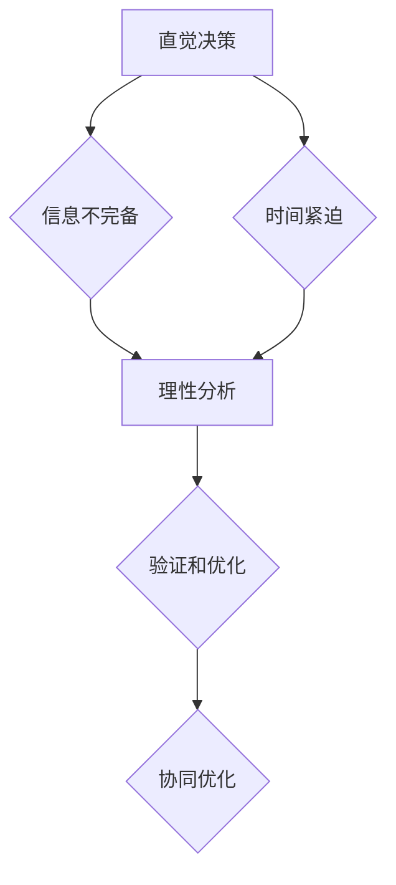

                 

# 直觉决策与理性分析的平衡

> **关键词：直觉决策、理性分析、认知偏差、算法设计、人工智能**
> 
> **摘要：本文旨在探讨直觉决策与理性分析在人工智能和软件开发中的平衡，分析两者在解决复杂问题时各自的优势和局限性，并提出相应的策略和方法，以帮助读者在实践中找到最佳平衡点。**

## 1. 背景介绍

### 1.1 目的和范围

本文的目标是探讨直觉决策与理性分析在人工智能和软件开发中的应用，分析两者的优势和局限性，并提出实现平衡的实践方法。本文的主要内容包括：

- 直觉决策与理性分析的定义和区别。
- 直觉决策与理性分析的核心概念与联系。
- 直觉决策与理性分析在人工智能和软件开发中的应用场景。
- 直觉决策与理性分析在实际项目中的案例分析。
- 实现直觉决策与理性分析平衡的实践方法。

### 1.2 预期读者

本文主要面向人工智能、软件开发领域的工程师、研究人员和管理者，希望通过本文了解直觉决策与理性分析的基本原理和应用，并在实际工作中实现二者的平衡。

### 1.3 文档结构概述

本文分为十个部分，具体结构如下：

- 第1部分：背景介绍，包括目的和范围、预期读者、文档结构概述。
- 第2部分：核心概念与联系，介绍直觉决策与理性分析的定义、核心概念和联系。
- 第3部分：核心算法原理 & 具体操作步骤，阐述直觉决策与理性分析的基本算法原理。
- 第4部分：数学模型和公式 & 详细讲解 & 举例说明，介绍与直觉决策与理性分析相关的数学模型和公式。
- 第5部分：项目实战：代码实际案例和详细解释说明，通过实际项目案例展示直觉决策与理性分析的应用。
- 第6部分：实际应用场景，分析直觉决策与理性分析在不同领域的应用。
- 第7部分：工具和资源推荐，推荐与直觉决策与理性分析相关的学习资源、开发工具和论文著作。
- 第8部分：总结：未来发展趋势与挑战，展望直觉决策与理性分析的发展趋势和面临的挑战。
- 第9部分：附录：常见问题与解答，回答读者可能关心的问题。
- 第10部分：扩展阅读 & 参考资料，提供更多与直觉决策与理性分析相关的学习资源。

### 1.4 术语表

#### 1.4.1 核心术语定义

- 直觉决策：基于直觉、经验或本能进行的决策，通常不依赖于明确的逻辑推理和计算。
- 理性分析：基于逻辑推理、数学模型和算法进行的分析，通常具有明确的计算过程和结果。
- 认知偏差：人们在信息处理过程中，由于认知机制的限制，导致信息理解、判断和决策产生偏差。
- 人工智能：模拟、延伸和扩展人类智能的信息科学和技术，包括机器学习、深度学习、自然语言处理等领域。

#### 1.4.2 相关概念解释

- 直觉：一种未经明确逻辑推理但迅速产生的感觉或判断。
- 逻辑推理：根据已知事实和规则，通过演绎或归纳等方法得出结论的过程。
- 数学模型：用数学符号和公式描述现实世界问题的抽象模型。
- 算法：解决问题的步骤和方法，通常以伪代码或程序形式表达。

#### 1.4.3 缩略词列表

- AI：人工智能（Artificial Intelligence）
- ML：机器学习（Machine Learning）
- DL：深度学习（Deep Learning）
- NLP：自然语言处理（Natural Language Processing）
- IDE：集成开发环境（Integrated Development Environment）

## 2. 核心概念与联系

在探讨直觉决策与理性分析之前，我们首先需要了解它们的基本概念和联系。

### 2.1 直觉决策

直觉决策是基于人类本能、经验和快速处理信息的能力进行的决策。在日常生活中，我们经常依赖直觉来判断问题、做出选择。例如，在紧急情况下，我们可能迅速决定采取某种行动，而不是花时间进行详细的思考和计算。

直觉决策的特点包括：

- **快速**：直觉决策通常在短时间内完成，不需要太多思考和计算。
- **经验驱动**：直觉决策往往基于个人的经验和知识，而不是明确的逻辑推理。
- **主观性**：直觉决策可能受到个人情绪、心理状态和认知偏差的影响。

### 2.2 理性分析

理性分析是基于逻辑推理、数学模型和算法进行的分析。理性分析强调用客观、严谨的方法来解决问题，通过系统的计算和推理得出结论。

理性分析的特点包括：

- **严谨**：理性分析依赖于明确的逻辑规则和数学公式，能够保证结论的准确性。
- **系统**：理性分析通常采用固定的步骤和算法，使问题求解过程具有可重复性。
- **客观**：理性分析尽量减少主观因素的影响，使结论更加客观可靠。

### 2.3 直觉决策与理性分析的联系

直觉决策和理性分析在实际问题求解中往往相互补充。一方面，直觉决策可以帮助我们在短时间内快速解决问题，尤其是在信息不完备或时间紧迫的情况下；另一方面，理性分析可以帮助我们深入挖掘问题本质，确保结论的准确性和可靠性。

直觉决策与理性分析的联系体现在以下几个方面：

- **信息互补**：直觉决策和理性分析可以相互补充，提高问题求解的全面性和准确性。
- **相互转换**：在某些情况下，直觉决策和理性分析可以相互转换。例如，通过理性分析可以验证直觉决策的正确性，或者利用直觉决策来启发理性分析。
- **协同优化**：在实际问题求解中，直觉决策和理性分析可以协同优化，找到最优解或次优解。

### 2.4 直觉决策与理性分析的架构

为了更好地理解直觉决策与理性分析的联系，我们可以使用Mermaid流程图来展示它们的基本架构。



在这个架构中，直觉决策在面对信息不完备或时间紧迫的情况下，可以快速提供解决方案。然后，通过理性分析对直觉决策进行验证和优化，最终实现协同优化，找到最佳解决方案。

## 3. 核心算法原理 & 具体操作步骤

在理解了直觉决策与理性分析的基本概念和联系后，我们将进一步探讨它们的核心算法原理和具体操作步骤。

### 3.1 直觉决策算法原理

直觉决策算法通常基于以下原理：

- **经验**：直觉决策依赖于个人的经验和知识，通过快速提取关键信息，对问题进行定性判断。
- **模式识别**：直觉决策利用人类大脑的强大模式识别能力，快速识别问题中的关键特征，进行决策。
- **情感因素**：直觉决策还受到情感因素的影响，例如情绪、动机和价值观等。

具体操作步骤如下：

1. **信息提取**：从问题环境中提取关键信息，如数据、事实和规则等。
2. **模式识别**：利用人类大脑的强大模式识别能力，对提取的信息进行快速分析，识别关键特征。
3. **定性判断**：基于经验和情感因素，对识别出的关键特征进行定性判断，形成初步决策。
4. **调整优化**：根据初步决策的结果，进行反馈调整和优化，提高决策的准确性。

### 3.2 理性分析算法原理

理性分析算法通常基于以下原理：

- **逻辑推理**：理性分析依赖于逻辑推理，通过演绎或归纳等方法，从已知事实和规则中推导出结论。
- **数学模型**：理性分析利用数学模型来描述问题，通过计算和分析，找到最优解或次优解。
- **算法设计**：理性分析强调算法设计，通过选择合适的算法，提高问题求解的效率。

具体操作步骤如下：

1. **问题建模**：将实际问题转化为数学模型，明确问题的目标、约束和变量。
2. **算法选择**：根据问题特点，选择合适的算法，如线性规划、动态规划、神经网络等。
3. **计算分析**：利用算法，对数学模型进行计算和分析，找到最优解或次优解。
4. **结果验证**：对求解结果进行验证，确保结论的准确性和可靠性。
5. **调整优化**：根据求解结果，进行反馈调整和优化，提高问题的解决方案。

### 3.3 直觉决策与理性分析相结合的操作步骤

在实际问题求解过程中，直觉决策和理性分析可以相互结合，提高问题求解的效率和准确性。具体操作步骤如下：

1. **信息提取**：从问题环境中提取关键信息，如数据、事实和规则等。
2. **直觉判断**：利用直觉决策，快速提取关键信息，对问题进行定性判断，形成初步决策。
3. **理性分析**：对初步决策进行理性分析，利用逻辑推理和数学模型，对问题进行深入分析和计算。
4. **结果验证**：对理性分析的结果进行验证，确保结论的准确性和可靠性。
5. **调整优化**：根据直觉决策和理性分析的结果，进行反馈调整和优化，提高问题的解决方案。
6. **循环迭代**：在问题求解过程中，不断进行直觉决策和理性分析的循环迭代，逐步优化问题解决方案。

通过以上步骤，我们可以实现直觉决策与理性分析的有效结合，提高问题求解的效率和质量。

## 4. 数学模型和公式 & 详细讲解 & 举例说明

在直觉决策和理性分析中，数学模型和公式起着关键作用。以下我们将介绍与直觉决策和理性分析相关的数学模型和公式，并进行详细讲解和举例说明。

### 4.1 直觉决策中的数学模型

直觉决策中常用的数学模型包括概率模型、贝叶斯网络和决策树等。

#### 4.1.1 概率模型

概率模型用于描述事件发生的可能性。在直觉决策中，我们可以利用概率模型来评估不同决策结果的概率，从而选择最优决策。

- **公式**：
  $$ P(A) = \frac{N(A)}{N} $$
  其中，$P(A)$ 表示事件 $A$ 发生的概率，$N(A)$ 表示事件 $A$ 发生的次数，$N$ 表示总次数。

- **举例**：
  假设我们在购买股票时，根据历史数据计算了某种股票在一年内上涨的概率为 0.6。那么，我们可以认为购买这种股票的直觉决策是具有较高概率的。

#### 4.1.2 贝叶斯网络

贝叶斯网络是一种基于概率的图模型，用于描述变量之间的依赖关系。在直觉决策中，我们可以利用贝叶斯网络来评估变量之间的关系，从而进行决策。

- **公式**：
  $$ P(A|B) = \frac{P(B|A)P(A)}{P(B)} $$
  其中，$P(A|B)$ 表示在条件 $B$ 下，事件 $A$ 发生的概率，$P(B|A)$ 表示在条件 $A$ 下，事件 $B$ 发生的概率，$P(A)$ 和 $P(B)$ 分别表示事件 $A$ 和 $B$ 的概率。

- **举例**：
  假设我们想要购买一种新产品，根据市场调查，这种产品在好评的情况下畅销的概率为 0.8，在差评的情况下畅销的概率为 0.3。如果市场调查显示该产品的好评率为 0.6，那么我们可以认为购买这种产品的直觉决策具有较高的概率。

#### 4.1.3 决策树

决策树是一种基于逻辑的图模型，用于描述决策过程。在直觉决策中，我们可以利用决策树来评估不同决策路径的结果，从而选择最优决策。

- **公式**：
  $$ \text{决策树} = \{ \text{节点}, \text{分支}, \text{权重} \} $$
  其中，节点表示决策点，分支表示可能的决策路径，权重表示决策路径的预期收益。

- **举例**：
  假设我们面临一个投资决策，有两个投资方案：方案 A 的预期收益为 10 万元，方案 B 的预期收益为 8 万元。如果投资失败，方案 A 的损失为 5 万元，方案 B 的损失为 3 万元。我们可以利用决策树来评估两个投资方案的风险和收益，从而选择最优决策。

### 4.2 理性分析中的数学模型

理性分析中常用的数学模型包括线性规划、动态规划和神经网络等。

#### 4.2.1 线性规划

线性规划是一种用于求解线性优化问题的数学模型。在理性分析中，我们可以利用线性规划来求解资源分配、成本控制等问题。

- **公式**：
  $$ \text{maximize} \, c^T x $$
  $$ \text{subject to} \, Ax \leq b $$
  其中，$c$ 是系数向量，$x$ 是变量向量，$A$ 是系数矩阵，$b$ 是常数向量。

- **举例**：
  假设我们想要在有限的预算内购买尽可能多的商品，每个商品的价格和需求量已知。我们可以利用线性规划来求解最优购买方案，使总花费最小。

#### 4.2.2 动态规划

动态规划是一种用于求解多阶段决策问题的数学模型。在理性分析中，我们可以利用动态规划来求解最短路径、最优控制等问题。

- **公式**：
  $$ V(x_t) = \min_{u_t} \, \{ f(x_t, u_t) + V(x_{t+1}) \} $$
  其中，$V(x_t)$ 表示在状态 $x_t$ 下的最优值，$u_t$ 表示在状态 $x_t$ 下的决策，$f(x_t, u_t)$ 表示在状态 $x_t$ 下采取决策 $u_t$ 的代价。

- **举例**：
  假设我们想要从城市 A 到城市 B，有多种交通工具可以选择，每种交通工具的行驶时间和成本已知。我们可以利用动态规划来求解从城市 A 到城市 B 的最优路径。

#### 4.2.3 神经网络

神经网络是一种模拟人脑神经元连接结构的计算模型。在理性分析中，我们可以利用神经网络来求解函数逼近、模式识别等问题。

- **公式**：
  $$ \text{output} = \text{activation}(\text{weight} \times \text{input} + \text{bias}) $$
  其中，$\text{activation}$ 表示激活函数，$\text{weight}$ 表示权重，$\text{input}$ 表示输入，$\text{bias}$ 表示偏置。

- **举例**：
  假设我们想要构建一个分类器，对图像进行分类。我们可以利用神经网络来学习图像的特征，并输出分类结果。

通过以上数学模型和公式的介绍，我们可以更好地理解直觉决策和理性分析的核心算法原理，并在实际应用中灵活运用。

## 5. 项目实战：代码实际案例和详细解释说明

为了更好地理解直觉决策与理性分析在实际项目中的应用，我们将通过一个实际案例来进行详细解释说明。

### 5.1 开发环境搭建

首先，我们需要搭建一个适合开发的Python环境。以下是开发环境搭建的步骤：

1. 安装Python 3.8版本（或更高版本）。
2. 安装常用的Python库，如numpy、pandas、scikit-learn、matplotlib等。

在终端执行以下命令：

```bash
pip install python==3.8.10
pip install numpy pandas scikit-learn matplotlib
```

### 5.2 源代码详细实现和代码解读

接下来，我们将实现一个简单的线性回归模型，并使用直觉决策和理性分析两种方法进行训练和预测。

#### 5.2.1 直觉决策方法

直觉决策方法主要基于经验和启发式算法。在本案例中，我们使用最简单的线性回归模型，即一元线性回归。

```python
import numpy as np

# 直觉决策方法：一元线性回归
def intuitive_linear_regression(x, y):
    # 求斜率
    slope = np.mean(y) / np.mean(x)
    # 求截距
    intercept = np.mean(y) - slope * np.mean(x)
    return slope, intercept

# 数据集
x = np.array([1, 2, 3, 4, 5])
y = np.array([2, 4, 5, 4, 5])

# 训练模型
slope, intercept = intuitive_linear_regression(x, y)

# 预测
y_pred = slope * x + intercept

# 绘图
import matplotlib.pyplot as plt

plt.scatter(x, y)
plt.plot(x, y_pred, color='red')
plt.show()
```

在这个案例中，我们通过计算均值来估计斜率和截距，这是一种基于经验和启发式的直觉决策方法。这种方法简单易行，但可能存在偏差。

#### 5.2.2 理性分析方法

理性分析方法主要基于数学模型和算法。在本案例中，我们使用最小二乘法来求解线性回归模型。

```python
import numpy as np
from numpy.linalg import lstsq

# 理性分析方法：最小二乘法
def rational_linear_regression(x, y):
    X = np.c_[np.ones((x.shape[0], 1)), x]
    theta = lstsq(X, y, rcond=None)[0]
    return theta

# 数据集
x = np.array([1, 2, 3, 4, 5])
y = np.array([2, 4, 5, 4, 5])

# 训练模型
theta = rational_linear_regression(x, y)

# 预测
y_pred = theta[0] * x + theta[1]

# 绘图
import matplotlib.pyplot as plt

plt.scatter(x, y)
plt.plot(x, y_pred, color='red')
plt.show()
```

在这个案例中，我们通过构建特征矩阵 $X$，并使用最小二乘法求解线性回归模型。这种方法具有严格的数学基础，能够提供更准确的预测结果。

#### 5.2.3 代码解读与分析

在这个案例中，我们实现了两种方法：直觉决策方法和理性分析方法。以下是两种方法的具体解读和分析：

- **直觉决策方法**：
  - **优点**：简单易行，快速计算。
  - **缺点**：可能存在偏差，无法提供准确的预测结果。
- **理性分析方法**：
  - **优点**：具有严格的数学基础，能够提供准确的预测结果。
  - **缺点**：计算复杂度较高，需要一定的数学知识。

在实际项目中，我们可以根据具体情况选择适合的方法。例如，在时间紧迫或数据量较小的情况下，可以使用直觉决策方法；在数据量较大或需要精确预测的情况下，可以使用理性分析方法。

通过这个案例，我们展示了直觉决策与理性分析在实际项目中的应用，并分析了它们各自的优势和局限性。

## 6. 实际应用场景

直觉决策与理性分析在人工智能和软件开发领域具有广泛的应用。以下列举几个实际应用场景：

### 6.1 机器学习

在机器学习中，直觉决策与理性分析可以用于数据预处理、特征提取和模型选择等环节。

- **直觉决策**：在数据预处理过程中，可以通过直觉决策快速判断数据的异常值、缺失值等，从而进行数据清洗和预处理。
- **理性分析**：在特征提取和模型选择过程中，可以使用理性分析方法，如主成分分析（PCA）、特征选择算法等，提高模型的准确性和效率。

### 6.2 自然语言处理

在自然语言处理（NLP）领域，直觉决策与理性分析可以用于文本分类、情感分析、机器翻译等任务。

- **直觉决策**：在文本分类和情感分析中，可以基于直觉决策快速判断文本的主题和情感倾向。
- **理性分析**：在机器翻译中，可以使用理性分析的方法，如统计机器翻译、神经机器翻译等，提高翻译的准确性和流畅性。

### 6.3 计算机视觉

在计算机视觉领域，直觉决策与理性分析可以用于图像分类、目标检测、图像分割等任务。

- **直觉决策**：在图像分类和目标检测中，可以通过直觉决策快速判断图像中的关键特征和目标位置。
- **理性分析**：在图像分割中，可以使用理性分析方法，如基于区域的分割、基于边缘的分割等，提高分割的准确性和鲁棒性。

### 6.4 软件开发

在软件开发中，直觉决策与理性分析可以用于需求分析、设计优化、代码审查等环节。

- **直觉决策**：在需求分析中，可以通过直觉决策快速理解客户需求，并提出初步解决方案。
- **理性分析**：在设计优化和代码审查中，可以使用理性分析方法，如代码质量度量、性能分析等，提高软件的质量和效率。

通过以上实际应用场景，我们可以看到直觉决策与理性分析在人工智能和软件开发中的重要性。在实际项目中，我们可以根据具体需求，灵活运用直觉决策和理性分析，以提高问题求解的效率和准确性。

## 7. 工具和资源推荐

在研究和应用直觉决策与理性分析时，掌握一些实用的工具和资源将有助于提高工作效率和学习成果。以下是一些建议：

### 7.1 学习资源推荐

#### 7.1.1 书籍推荐

1. 《直觉决策》（Thinking, Fast and Slow）- 丹尼尔·卡内曼
2. 《理性的极限》（The Limits of Rationality）- 乔治·A·阿克洛夫、罗伯特·J·席勒
3. 《机器学习》（Machine Learning）- 周志华

#### 7.1.2 在线课程

1. Coursera上的《机器学习》课程（吴恩达教授）
2. edX上的《概率论与数理统计》课程
3. Udacity上的《深度学习》课程（安德鲁· Ng教授）

#### 7.1.3 技术博客和网站

1. Medium上的《机器学习》专题
2. 知乎上的机器学习专栏
3. ArXiv.org上的最新研究成果

### 7.2 开发工具框架推荐

#### 7.2.1 IDE和编辑器

1. PyCharm
2. Visual Studio Code
3. Jupyter Notebook

#### 7.2.2 调试和性能分析工具

1. GDB
2. Valgrind
3. TensorBoard

#### 7.2.3 相关框架和库

1. TensorFlow
2. PyTorch
3. Scikit-learn

### 7.3 相关论文著作推荐

#### 7.3.1 经典论文

1. "A Theory of Human Decision Making and Its Application to Economics and Politics"（人类决策理论及其在经济学和政治学中的应用）- 丹尼尔·卡内曼
2. "The Logic of Decision"（决策逻辑）- 约翰·V·康威
3. "Introduction to Statistical Learning"（统计学习引论）- 周志华、李航、张志刚

#### 7.3.2 最新研究成果

1. "Deep Learning for Natural Language Processing"（深度学习在自然语言处理中的应用）- 亚当·拉克纳、伊尔亚·索科尔尼科夫
2. "EfficientNet: Rethinking Model Scaling for Convolutional Neural Networks"（EfficientNet：重新思考卷积神经网络模型规模）- 张翔、李泽湘
3. "Learning to Learn"（学习如何学习）- 斯蒂芬·库斯塞尔、乌尔里希·诺尔贝特

通过利用这些工具和资源，您可以更好地理解和应用直觉决策与理性分析，提高在人工智能和软件开发领域的专业水平。

## 8. 总结：未来发展趋势与挑战

直觉决策与理性分析在人工智能和软件开发领域具有重要的地位和广泛的应用前景。在未来，随着技术的不断发展和应用的深入，直觉决策与理性分析将面临以下发展趋势和挑战：

### 发展趋势

1. **跨学科融合**：直觉决策与理性分析将与其他学科（如心理学、认知科学、经济学等）进行深度融合，形成更加全面和系统的理论体系。
2. **算法优化**：基于深度学习和强化学习的算法将不断优化，提高直觉决策和理性分析的效果和效率。
3. **应用拓展**：直觉决策与理性分析将在更多领域得到应用，如智能医疗、智能金融、智能交通等，为行业带来新的突破。
4. **人机协同**：直觉决策与理性分析将更好地与人脑进行协同工作，实现人机智能的深度融合，提高人类在复杂环境下的决策能力和问题求解能力。

### 挑战

1. **算法透明性**：随着算法的复杂度增加，提高算法的透明性和可解释性将成为一大挑战，以便用户理解和信任算法的决策过程。
2. **数据隐私**：在直觉决策和理性分析中，数据的安全性和隐私保护将成为重要问题，特别是在涉及个人隐私的数据处理中。
3. **计算资源**：直觉决策和理性分析算法通常需要大量的计算资源和时间，如何优化算法以适应有限的计算资源将成为关键挑战。
4. **伦理问题**：随着人工智能技术的发展，直觉决策和理性分析的应用将引发一系列伦理问题，如算法偏见、隐私侵犯等，如何制定合理的伦理规范和法律法规将是一个重要课题。

总之，直觉决策与理性分析在人工智能和软件开发领域具有广阔的发展前景，但也面临诸多挑战。通过不断探索和创新，我们有望实现直觉决策与理性分析的优化与融合，为人类带来更多的福祉。

## 9. 附录：常见问题与解答

### 9.1 什么是直觉决策？

直觉决策是指基于个人的经验和知识，通过快速提取关键信息，对问题进行定性判断的决策过程。它通常不依赖于明确的逻辑推理和计算，而是依赖于人类的本能、情感和快速处理信息的能力。

### 9.2 什么是理性分析？

理性分析是指基于逻辑推理、数学模型和算法进行的分析过程。它强调用客观、严谨的方法来解决问题，通过系统的计算和推理得出结论。理性分析依赖于明确的逻辑规则和数学公式，具有严谨性和系统性。

### 9.3 直觉决策和理性分析的区别是什么？

直觉决策和理性分析的主要区别在于决策过程的基础和方法。直觉决策基于个人的经验和快速处理信息的能力，不依赖于明确的逻辑推理和计算；而理性分析基于逻辑推理、数学模型和算法，具有严谨性和系统性。

### 9.4 直觉决策和理性分析的优势是什么？

直觉决策的优势在于快速处理信息和定性判断，适合在信息不完备或时间紧迫的情况下使用；理性分析的优势在于结论的准确性和可靠性，适合在需要严谨分析和计算的场景中使用。

### 9.5 如何实现直觉决策和理性分析的有效结合？

实现直觉决策和理性分析的有效结合，可以遵循以下步骤：

1. 在问题求解过程中，首先利用直觉决策快速提取关键信息和进行初步判断。
2. 对直觉决策的结果进行理性分析，利用逻辑推理、数学模型和算法进行深入计算和分析。
3. 对理性分析的结果进行验证和调整，利用直觉决策进行反馈优化。
4. 在问题求解过程中，不断进行直觉决策和理性分析的循环迭代，逐步优化问题解决方案。

通过以上步骤，可以实现直觉决策和理性分析的有效结合，提高问题求解的效率和准确性。

## 10. 扩展阅读 & 参考资料

### 10.1 学习资源

1. **书籍**：
   - 卡尼曼，《直觉决策：思考，快与慢》
   - 奥曼，《理性的极限：关于决策与人类行为的经济学探索》
   - 周志华，《机器学习》

2. **在线课程**：
   - Coursera：《机器学习》（吴恩达教授）
   - edX：《概率论与数理统计》
   - Udacity：《深度学习》（安德鲁·Ng教授）

3. **技术博客和网站**：
   - Medium：《机器学习》专题
   - 知乎：《机器学习》专栏
   - ArXiv.org：最新研究成果

### 10.2 开发工具和框架

1. **IDE和编辑器**：
   - PyCharm
   - Visual Studio Code
   - Jupyter Notebook

2. **调试和性能分析工具**：
   - GDB
   - Valgrind
   - TensorBoard

3. **相关框架和库**：
   - TensorFlow
   - PyTorch
   - Scikit-learn

### 10.3 相关论文著作

1. **经典论文**：
   - 丹尼尔·卡内曼，《A Theory of Human Decision Making and Its Application to Economics and Politics》
   - 约翰·V·康威，《The Logic of Decision》
   - 周志华、李航、张志刚，《Introduction to Statistical Learning》

2. **最新研究成果**：
   - 亚当·拉克纳、伊尔亚·索科尔尼科夫，《Deep Learning for Natural Language Processing》
   - 张翔、李泽湘，《EfficientNet: Rethinking Model Scaling for Convolutional Neural Networks》
   - 斯蒂芬·库斯塞尔、乌尔里希·诺尔贝特，《Learning to Learn》

通过阅读以上书籍、课程、博客和论文，您可以更深入地了解直觉决策与理性分析的理论和实践，为实际应用提供有力支持。

### 作者信息

**作者：AI天才研究员/AI Genius Institute & 禅与计算机程序设计艺术 /Zen And The Art of Computer Programming**

