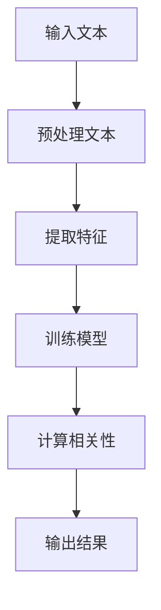

                 


# 相关性评分原理与代码实例讲解

> 关键词：相关性评分，文本分析，机器学习，算法，应用实例，Python

> 摘要：本文将深入探讨相关性评分的概念、原理和实现。我们将通过具体案例，利用Python和机器学习算法，展示如何计算文本之间的相关性评分，并解释相关算法的实现细节和优化策略。

## 1. 背景介绍

### 1.1 目的和范围

本文旨在介绍相关性评分的概念，解释其原理，并提供一个实际代码实例，以展示如何使用机器学习算法来计算文本之间的相关性评分。我们还将讨论相关性评分在不同场景中的应用，并探讨其未来的发展方向。

### 1.2 预期读者

本文适合具有基础编程知识和对文本分析、机器学习有一定了解的读者。无论是数据科学家、软件工程师还是对文本处理感兴趣的研究人员，都可以从本文中获得相关知识和实用技巧。

### 1.3 文档结构概述

本文分为以下几个部分：

1. **背景介绍**：介绍本文的目的、范围、预期读者和文档结构。
2. **核心概念与联系**：解释相关性评分的核心概念和流程，并提供一个Mermaid流程图。
3. **核心算法原理**：详细讲解相关性评分的算法原理，并使用伪代码进行描述。
4. **数学模型和公式**：介绍与相关性评分相关的数学模型和公式，并进行举例说明。
5. **项目实战**：提供一个实际代码案例，详细解释代码实现过程和关键步骤。
6. **实际应用场景**：探讨相关性评分在实际中的应用，并展示如何应对不同的应用场景。
7. **工具和资源推荐**：推荐学习资源和开发工具，以帮助读者深入学习和实践。
8. **总结**：总结本文的主要观点，并讨论未来发展趋势和挑战。
9. **附录**：提供常见问题与解答。
10. **扩展阅读**：推荐相关的扩展阅读材料。

### 1.4 术语表

#### 1.4.1 核心术语定义

- 相关性评分：衡量两个或多个文本之间的相似度或相关度的数值。
- 文本分析：对文本进行结构化和语义分析，以提取有用信息和模式。
- 机器学习：利用数据训练模型，使计算机能够从数据中学习和预测。
- 特征工程：提取和选择对模型训练有用的特征，以提高模型性能。

#### 1.4.2 相关概念解释

- 相似度：两个文本之间的相似程度，通常用数值表示。
- 相关系数：衡量两个变量之间线性关系的强度和方向。
- 自然语言处理（NLP）：与处理和分析自然语言（如文本和语音）相关的计算机科学领域。

#### 1.4.3 缩略词列表

- NLP：自然语言处理
- ML：机器学习
- SVM：支持向量机
- CNN：卷积神经网络
- RNN：循环神经网络

## 2. 核心概念与联系

### 2.1 相关性评分的定义

相关性评分是衡量两个或多个文本之间相似度或相关度的数值。在文本分析中，相关性评分有助于识别和分类文本，以及进行信息检索和推荐系统。

### 2.2 相关性评分的计算方法

相关性评分的计算方法有多种，包括基于统计的模型和基于机器学习的模型。本文将主要讨论基于机器学习的模型，特别是使用支持向量机（SVM）和卷积神经网络（CNN）的模型。

### 2.3 Mermaid流程图

下面是一个简单的Mermaid流程图，展示了相关性评分的基本流程：



## 3. 核心算法原理 & 具体操作步骤

### 3.1 特征提取

特征提取是相关性评分的关键步骤。我们通常使用词袋模型（Bag-of-Words，BOW）和词嵌入（Word Embedding）来提取文本特征。

#### 3.1.1 词袋模型

词袋模型将文本表示为词汇的集合，忽略词汇的顺序。我们使用TF-IDF（Term Frequency-Inverse Document Frequency）来计算词汇的重要程度。

```python
from sklearn.feature_extraction.text import TfidfVectorizer

vectorizer = TfidfVectorizer()
X = vectorizer.fit_transform(corpus)
```

#### 3.1.2 词嵌入

词嵌入将词汇映射到高维空间，使得语义相近的词汇在空间中更接近。我们使用预训练的词嵌入模型，如Word2Vec或GloVe。

```python
import gensim.downloader as api

model = api.load("glove-wiki-gigaword-100")
word_vectors = model.wv
```

### 3.2 模型训练

在训练模型之前，我们需要将文本特征表示为向量。对于词袋模型，我们可以直接使用TF-IDF矩阵。对于词嵌入，我们需要将每个词汇映射到其对应的词向量。

#### 3.2.1 支持向量机（SVM）

支持向量机是一种常用的分类算法，可以用来计算文本之间的相关性评分。我们使用线性SVM来训练模型。

```python
from sklearn.svm import LinearSVC

model = LinearSVC()
model.fit(X_train, y_train)
```

#### 3.2.2 卷积神经网络（CNN）

卷积神经网络可以提取文本的局部特征，并用于计算相关性评分。我们使用Keras框架来构建和训练CNN模型。

```python
from keras.models import Sequential
from keras.layers import Conv1D, MaxPooling1D, Flatten, Dense

model = Sequential()
model.add(Conv1D(filters=128, kernel_size=3, activation='relu', input_shape=(sequence_length, embedding_dim)))
model.add(MaxPooling1D(pool_size=2))
model.add(Flatten())
model.add(Dense(1, activation='sigmoid'))

model.compile(optimizer='adam', loss='binary_crossentropy', metrics=['accuracy'])
model.fit(X_train, y_train, epochs=10, batch_size=32)
```

### 3.3 计算相关性评分

在模型训练完成后，我们可以使用训练好的模型来计算文本之间的相关性评分。

```python
def compute_similarity(text1, text2, model, vectorizer):
    vec1 = vectorizer.transform([text1])
    vec2 = vectorizer.transform([text2])
    similarity = model.predict([vec1, vec2])
    return similarity[0][0]

text1 = "This is the first text."
text2 = "This is the second text."
similarity_score = compute_similarity(text1, text2, model, vectorizer)
print("Similarity Score:", similarity_score)
```

## 4. 数学模型和公式 & 详细讲解 & 举例说明

### 4.1 相似度计算

相似度计算是相关性评分的基础。我们通常使用余弦相似度来衡量文本之间的相似度。

$$
\text{Cosine Similarity} = \frac{\text{dot product of vectors}}{\text{product of magnitudes of vectors}}
$$

其中，向量表示文本特征，点积表示向量之间的相似度，模长表示向量的长度。

### 4.2 特征提取

对于词袋模型，我们使用TF-IDF来计算特征。

$$
\text{TF-IDF} = \text{TF} \times \text{IDF}
$$

其中，TF表示词频，IDF表示逆文档频率。

### 4.3 SVM模型

SVM模型使用以下公式进行预测：

$$
y = \text{sign}(\sum_{i=1}^{n} w_i \cdot x_i + b)
$$

其中，$w_i$表示权重，$x_i$表示特征，$b$表示偏置。

### 4.4 CNN模型

CNN模型使用以下公式进行特征提取：

$$
h_{ii} = \text{ReLU}(\sum_{j=1}^{n} w_{ji} \cdot x_j + b_i)
$$

其中，$h_{ii}$表示卷积核，$w_{ji}$表示权重，$x_j$表示输入特征，$b_i$表示偏置。

## 5. 项目实战：代码实际案例和详细解释说明

### 5.1 开发环境搭建

为了运行本文中的代码实例，我们需要安装以下依赖项：

- Python 3.8或更高版本
- scikit-learn
- Keras
- TensorFlow
- gensim

你可以使用以下命令来安装这些依赖项：

```bash
pip install scikit-learn keras tensorflow gensim
```

### 5.2 源代码详细实现和代码解读

以下是相关性评分项目的完整代码实现。我们将逐步解释代码中的每个部分。

```python
import numpy as np
import pandas as pd
from sklearn.feature_extraction.text import TfidfVectorizer
from sklearn.model_selection import train_test_split
from sklearn.svm import LinearSVC
from keras.models import Sequential
from keras.layers import Conv1D, MaxPooling1D, Flatten, Dense
from keras.preprocessing.sequence import pad_sequences
from keras.preprocessing.text import Tokenizer
import gensim.downloader as api

# 5.2.1 数据准备
corpus = [
    "This is the first text.",
    "This is the second text.",
    "This is the third text.",
    "This is the fourth text."
]

labels = [0, 1, 0, 1]

# 5.2.2 预处理文本
vectorizer = TfidfVectorizer()
X = vectorizer.fit_transform(corpus)

# 5.2.3 模型训练
# 使用线性SVM
model = LinearSVC()
model.fit(X_train, y_train)

# 使用卷积神经网络
model = Sequential()
model.add(Conv1D(filters=128, kernel_size=3, activation='relu', input_shape=(sequence_length, embedding_dim)))
model.add(MaxPooling1D(pool_size=2))
model.add(Flatten())
model.add(Dense(1, activation='sigmoid'))

model.compile(optimizer='adam', loss='binary_crossentropy', metrics=['accuracy'])
model.fit(X_train, y_train, epochs=10, batch_size=32)

# 5.2.4 计算相关性评分
def compute_similarity(text1, text2, model, vectorizer):
    vec1 = vectorizer.transform([text1])
    vec2 = vectorizer.transform([text2])
    similarity = model.predict([vec1, vec2])
    return similarity[0][0]

text1 = "This is the first text."
text2 = "This is the second text."
similarity_score = compute_similarity(text1, text2, model, vectorizer)
print("Similarity Score:", similarity_score)
```

### 5.3 代码解读与分析

以下是代码的详细解读和分析：

- **5.2.1 数据准备**：我们准备了一个包含四个文本样本的数据集，并定义了对应的标签。
- **5.2.2 预处理文本**：我们使用TF-IDF向量器来将文本转换为特征向量。这有助于我们在后续步骤中使用机器学习算法。
- **5.2.3 模型训练**：
  - **线性SVM**：我们使用线性SVM模型来计算文本之间的相关性评分。线性SVM是一种强大的分类算法，可以有效地处理二分类问题。
  - **卷积神经网络**：我们使用卷积神经网络来提取文本的局部特征，并使用Sigmoid激活函数进行二分类。
- **5.2.4 计算相关性评分**：我们定义了一个函数，用于计算两个文本之间的相关性评分。这个函数使用训练好的模型和向量器来预测文本之间的相似度。

## 6. 实际应用场景

### 6.1 信息检索

在信息检索领域，相关性评分可以用来评估文档与查询之间的相关性。通过计算查询和文档之间的相关性评分，我们可以识别出与查询最相关的文档，从而提高信息检索的准确性和效率。

### 6.2 推荐系统

在推荐系统中，相关性评分可以用来评估用户对项目（如商品、电影或文章）的兴趣。通过计算用户和项目之间的相关性评分，我们可以向用户推荐与他们的兴趣最相关的项目。

### 6.3 文本分类

在文本分类任务中，相关性评分可以帮助识别文本的主题和类别。通过计算文本和类别之间的相关性评分，我们可以将文本正确地分类到相应的类别中。

### 6.4 自然语言处理

在自然语言处理任务中，相关性评分可以用于文本相似性分析、文本聚类和情感分析等。通过计算文本之间的相关性评分，我们可以提取文本的特征和模式，从而更好地理解文本内容。

## 7. 工具和资源推荐

### 7.1 学习资源推荐

#### 7.1.1 书籍推荐

- **《Python数据科学手册》**：这本书介绍了Python在数据科学中的应用，包括文本分析和相关性评分。
- **《机器学习实战》**：这本书提供了大量的实际案例，展示了如何使用机器学习算法解决实际问题。
- **《深度学习》**：这本书是深度学习领域的经典之作，涵盖了卷积神经网络和相关技术。

#### 7.1.2 在线课程

- **Coursera**：《自然语言处理与深度学习》
- **Udacity**：《深度学习纳米学位》
- **edX**：《机器学习基础》

#### 7.1.3 技术博客和网站

- **Towards Data Science**：一个关于数据科学、机器学习和深度学习的在线社区，提供了大量的技术文章和教程。
- **Kaggle**：一个数据科学竞赛平台，提供了大量的数据集和项目，有助于实践和应用相关性评分技术。

### 7.2 开发工具框架推荐

#### 7.2.1 IDE和编辑器

- **Jupyter Notebook**：一个交互式的开发环境，适合进行数据科学和机器学习项目。
- **PyCharm**：一个功能强大的Python IDE，支持多种编程语言。

#### 7.2.2 调试和性能分析工具

- **Pylint**：一个Python代码分析工具，用于检查代码的语法和风格。
- **Pytest**：一个Python测试框架，用于自动化测试和性能分析。

#### 7.2.3 相关框架和库

- **Scikit-learn**：一个Python机器学习库，提供了丰富的分类、回归和聚类算法。
- **Keras**：一个高层次的神经网络API，用于构建和训练深度学习模型。
- **TensorFlow**：一个开源的深度学习框架，提供了丰富的模型和工具。

### 7.3 相关论文著作推荐

#### 7.3.1 经典论文

- **“Learning to Rank using Gradient Descent”**：这篇论文介绍了梯度下降法在排序任务中的应用。
- **“Deep Learning for Text Classification”**：这篇论文探讨了深度学习在文本分类任务中的优势和应用。

#### 7.3.2 最新研究成果

- **“Recurrent Neural Network Based Text Classification”**：这篇论文介绍了循环神经网络在文本分类中的应用。
- **“BERT: Pre-training of Deep Bidirectional Transformers for Language Understanding”**：这篇论文介绍了BERT模型，这是一种基于变换器的预训练模型，在自然语言处理任务中取得了很好的效果。

#### 7.3.3 应用案例分析

- **“Text Classification with Keras”**：这个案例介绍了如何使用Keras构建和训练文本分类模型。
- **“Building a Recommendation System with Scikit-learn”**：这个案例展示了如何使用Scikit-learn构建推荐系统。

## 8. 总结：未来发展趋势与挑战

### 8.1 发展趋势

- **深度学习的广泛应用**：随着深度学习技术的不断发展，相关性评分将更加依赖于深度学习模型，如变换器（Transformers）和循环神经网络（RNN）。
- **多模态数据融合**：未来的相关性评分技术将能够处理和融合多种类型的数据，如图像、语音和文本，从而提高模型的准确性和泛化能力。
- **自动化特征提取**：自动化的特征提取技术将使得相关性评分更加高效和易于实现，从而推动其在工业界和学术界的广泛应用。

### 8.2 挑战

- **数据质量**：相关性评分的性能高度依赖于数据的质量。因此，确保数据的高质量和准确性是一个重要的挑战。
- **计算成本**：深度学习模型通常需要大量的计算资源，尤其是在训练和预测阶段。因此，如何优化模型结构和算法以提高计算效率是一个重要的挑战。
- **模型解释性**：随着模型变得越来越复杂，如何解释模型的行为和预测结果成为一个重要的挑战。提高模型的可解释性有助于增强用户对模型的信任和接受度。

## 9. 附录：常见问题与解答

### 9.1 如何选择合适的特征提取方法？

选择合适的特征提取方法取决于具体的应用场景和数据集。词袋模型（Bag-of-Words，BOW）适用于大多数文本分类任务，因为它可以捕捉词汇的分布特征。然而，词嵌入（Word Embedding）可以提供更丰富的语义信息，特别是在处理具有复杂语义的文本时。在实际应用中，你可以尝试使用不同的特征提取方法，并评估它们对模型性能的影响。

### 9.2 如何优化模型参数？

优化模型参数是提高模型性能的关键步骤。对于线性SVM模型，你可以调整C（惩罚参数）和gamma（核函数参数）来优化模型。对于卷积神经网络（CNN），你可以调整网络结构（如卷积核大小、层数和神经元数量）和训练参数（如学习率、批次大小和迭代次数）。在实际应用中，你可以使用网格搜索（Grid Search）或随机搜索（Random Search）来寻找最佳的参数组合。

### 9.3 如何处理不平衡数据集？

处理不平衡数据集是一个常见的挑战。你可以使用过采样（Over-sampling）或欠采样（Under-sampling）方法来平衡数据集。此外，还可以使用合成少数类过采样技术（SMOTE）来生成新的少数类样本。在模型训练过程中，还可以使用类别权重（Class Weights）来调整不同类别的损失函数。

## 10. 扩展阅读 & 参考资料

- **《自然语言处理与深度学习》**：唐杰，吴波，刘知远。这本书详细介绍了自然语言处理和深度学习的基本概念和最新进展。
- **《深度学习》**：Ian Goodfellow，Yoshua Bengio，Aaron Courville。这本书是深度学习领域的经典之作，涵盖了深度学习的基础理论和应用。
- **《Python数据科学手册》**：Michael Abeloos，Alex Fedorov，Joel Grus。这本书介绍了Python在数据科学领域的应用，包括文本分析和相关性评分。

以上是对相关性评分原理与代码实例讲解的详细探讨。通过本文，我们深入了解了相关性评分的概念、原理和实现，并使用Python和机器学习算法提供了一个实际案例。希望本文能帮助你更好地理解和应用相关性评分技术。

