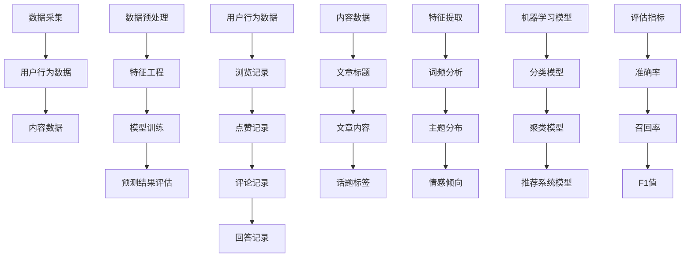

                 

### 《知乎2024热点话题预测算法校招面试经验谈》

> **关键词：** 知乎、热点话题预测、算法、校招面试、面试经验  
>
> **摘要：** 本文将深入探讨2024年知乎热点话题预测算法在校园招聘面试中的应用。通过详细解析算法原理、数学模型、实战案例以及相关工具资源，本文旨在帮助读者理解和掌握这一领域的关键知识点，为求职者提供宝贵的面试经验和策略。

在互联网信息爆炸的时代，社交媒体平台上的热点话题预测变得日益重要。知乎作为中国领先的问答社区，其热点话题预测算法对于提升用户体验、优化内容分发有着至关重要的作用。2024年的知乎校园招聘中，热点话题预测算法无疑成为了面试的核心考点之一。本文将带领读者深入这个领域，通过逻辑清晰的分析与步骤式的推理，详细讲解热点话题预测算法的相关知识点，并提供实用的面试经验。

首先，本文将介绍热点话题预测算法在知乎校招面试中的背景和重要性，定义相关核心概念，梳理出本文的结构和内容安排。接着，我们将探讨热点话题预测的核心概念和联系，使用Mermaid流程图展示其原理和架构。随后，文章将详细讲解热点话题预测算法的原理和操作步骤，使用伪代码进行阐述，并结合数学模型和公式进行详细解释。在实际应用场景中，文章将提供代码实际案例和详细解释说明，帮助读者更好地理解算法的实际应用。最后，文章将推荐相关的学习资源、开发工具框架和经典论文著作，总结未来发展趋势与挑战，并提供常见问题与解答。

通过本文的阅读，读者不仅能够掌握知乎热点话题预测算法的基本原理，还能够获得宝贵的面试经验和策略，为在知乎校招面试中取得优异成绩做好准备。接下来，让我们一步步深入这个充满挑战和机遇的领域。

## 1. 背景介绍

### 1.1 目的和范围

本文的主要目的是为准备参加知乎2024年校园招聘的求职者提供热点话题预测算法的全面解读和面试经验。随着知乎社区规模的不断扩大和用户参与度的提升，热点话题预测算法在知乎平台中扮演着至关重要的角色。它不仅能够提升用户体验，还能优化内容分发策略，提高社区的整体活跃度。因此，在知乎的校招面试中，热点话题预测算法是一个不可或缺的考点。

本文将涵盖以下范围：

1. **核心概念与联系**：我们将详细解释热点话题预测的基本概念，并使用Mermaid流程图展示其原理和架构。
2. **算法原理与操作步骤**：本文将使用伪代码详细阐述热点话题预测算法的原理和操作步骤，帮助读者理解算法的执行过程。
3. **数学模型与公式**：为了更深入地理解算法，我们将介绍相关的数学模型和公式，并进行举例说明。
4. **实际应用案例**：通过实际代码案例，我们将展示如何将热点话题预测算法应用到实际场景中，并进行详细解释和分析。
5. **工具和资源推荐**：我们将推荐一系列学习资源和开发工具，帮助读者更好地学习和实践热点话题预测算法。
6. **未来发展趋势与挑战**：最后，本文将总结热点话题预测算法的未来发展趋势和面临的挑战，为读者提供前瞻性的思考和方向。

通过本文的阅读，读者不仅能够全面掌握热点话题预测算法的理论知识，还能获得丰富的面试经验和实战技巧，为在知乎校招面试中脱颖而出打下坚实的基础。

### 1.2 预期读者

本文的预期读者主要是以下几类人群：

1. **准备参加知乎2024年校园招聘的求职者**：无论是计算机科学专业的应届毕业生还是经验丰富的技术从业者，本文都将提供热点话题预测算法的全面解读和面试经验，帮助他们更好地应对面试挑战。
2. **对人工智能和大数据分析感兴趣的技术爱好者**：对于希望在人工智能和大数据领域深入探索的技术爱好者，本文将详细解析热点话题预测算法的原理和实现方法，为他们提供实用的知识和技能。
3. **从事社交媒体和内容分发相关工作的专业人士**：了解热点话题预测算法对于从事社交媒体运营、内容分发和用户增长等工作的专业人士具有重要意义。本文将为他们提供实用的工具和策略，以提升工作效率和效果。
4. **高校师生和研究人员**：对于高校师生和研究人员，本文可以作为热点话题预测算法的教学和科研参考资料，帮助他们深入研究和探讨相关领域的问题。

无论您属于哪一类读者，本文都将致力于为您提供有价值的内容和实用的建议，帮助您在知乎2024年校园招聘中取得优异成绩。

### 1.3 文档结构概述

本文将分为以下几个部分，系统地介绍知乎2024热点话题预测算法的核心概念、算法原理、实际应用场景、学习资源和未来发展趋势。

1. **背景介绍**：本文首先介绍热点话题预测算法在知乎2024年校园招聘面试中的背景和重要性，定义相关核心概念，并概述本文的结构和内容安排。
2. **核心概念与联系**：本部分将详细解释热点话题预测的基本概念，并使用Mermaid流程图展示其原理和架构。
3. **算法原理与操作步骤**：本文将使用伪代码详细阐述热点话题预测算法的原理和操作步骤，帮助读者理解算法的执行过程。
4. **数学模型与公式**：为了更深入地理解算法，我们将介绍相关的数学模型和公式，并进行举例说明。
5. **实际应用案例**：通过实际代码案例，我们将展示如何将热点话题预测算法应用到实际场景中，并进行详细解释和分析。
6. **工具和资源推荐**：本部分将推荐一系列学习资源和开发工具，帮助读者更好地学习和实践热点话题预测算法。
7. **未来发展趋势与挑战**：最后，本文将总结热点话题预测算法的未来发展趋势和面临的挑战，为读者提供前瞻性的思考和方向。

通过本文的阅读，读者将能够全面了解热点话题预测算法的原理和应用，获得宝贵的面试经验和策略，为在知乎2024年校园招聘中取得优异成绩做好准备。

### 1.4 术语表

为了确保本文内容的专业性和准确性，以下是对本文中一些核心术语的定义和解释：

#### 1.4.1 核心术语定义

1. **热点话题预测**：
   热点话题预测是指利用机器学习和大数据分析技术，从大量社交媒体数据中识别和预测可能引起广泛关注的主题或话题。

2. **特征工程**：
   特征工程是指从原始数据中提取出对预测任务有帮助的特征，并将其转化为适合机器学习算法输入的过程。

3. **机器学习模型**：
   机器学习模型是指利用历史数据和算法，通过学习数据中的规律和模式，自动完成预测和分类任务的系统。

4. **深度学习**：
   深度学习是一种机器学习方法，通过构建多层神经网络，对大量数据进行训练，实现复杂的模式识别和预测任务。

5. **自然语言处理（NLP）**：
   自然语言处理是指利用计算机技术和算法，对自然语言文本进行识别、理解和生成的一系列技术。

6. **协同过滤**：
   协同过滤是一种常见的推荐系统算法，通过分析用户的历史行为和偏好，为用户推荐可能感兴趣的内容。

7. **用户画像**：
   用户画像是指通过对用户的历史行为、兴趣和特征进行综合分析，构建出一个反映用户特征和需求的模型。

8. **数据挖掘**：
   数据挖掘是指从大量数据中通过自动化方法发现隐含的、未知的、有价值的模式和规律。

9. **指标评估**：
   指标评估是指利用一系列指标对算法的预测效果进行评估和比较，包括准确率、召回率、F1值等。

10. **实时预测**：
    实时预测是指算法在接收到新数据时，能够立即生成预测结果，以满足高实时性的应用需求。

#### 1.4.2 相关概念解释

1. **文本分类**：
   文本分类是指将文本数据根据其内容和主题进行分类，以便于后续的处理和分析。

2. **情感分析**：
   情感分析是指通过分析文本数据中的情感词汇和表达方式，判断文本的情感倾向（如正面、负面或中性）。

3. **用户行为分析**：
   用户行为分析是指通过对用户的浏览、点赞、评论等行为进行分析，了解用户兴趣和行为模式。

4. **协同过滤算法**：
   协同过滤算法是指通过分析用户之间的相似性或行为模式，为用户推荐相似或感兴趣的内容。

5. **网络爬虫**：
   网络爬虫是指利用自动化程序从互联网上抓取数据，用于信息提取和分析。

#### 1.4.3 缩略词列表

- **NLP**：自然语言处理（Natural Language Processing）
- **ML**：机器学习（Machine Learning）
- **DL**：深度学习（Deep Learning）
- **AI**：人工智能（Artificial Intelligence）
- **CV**：计算机视觉（Computer Vision）
- **NLP**：自然语言处理（Natural Language Processing）
- **CMU**：卡内基梅隆大学（Carnegie Mellon University）
- **RCT**：随机对照试验（Randomized Controlled Trial）
- **API**：应用程序接口（Application Programming Interface）

通过以上对核心术语的定义和解释，读者将更好地理解本文中涉及的关键概念，为后续内容的学习和分析打下坚实的基础。

### 2. 核心概念与联系

在讨论知乎热点话题预测算法之前，我们需要理解一些核心概念和它们之间的联系。以下是这些核心概念及其相互关系的概述，我们将使用Mermaid流程图来展示其原理和架构，以便于读者更好地理解。

#### 2.1 热点话题预测的定义

热点话题预测是指利用大数据分析和机器学习技术，从海量社交媒体数据中识别和预测可能引起广泛关注的主题或话题。这一过程通常包括数据采集、特征工程、模型训练和预测结果评估等多个步骤。

#### 2.2 核心概念与联系

1. **用户行为数据**：用户在知乎平台上的行为数据，如浏览记录、点赞、评论、回答等，是预测热点话题的重要数据来源。
2. **内容数据**：知乎上的文章、话题标签、标题和内容文本，为热点话题预测提供了丰富的文本信息。
3. **特征工程**：从用户行为数据和内容数据中提取有代表性的特征，如词频、主题分布、情感倾向等，是预测模型训练的关键步骤。
4. **机器学习模型**：通过训练和优化，选择合适的机器学习模型（如分类模型、聚类模型、推荐系统模型等），对热点话题进行预测。
5. **评估指标**：使用准确率、召回率、F1值等评估指标，对预测模型的性能进行评估和优化。

#### 2.3 Mermaid流程图

以下是热点话题预测算法的Mermaid流程图：



#### 2.4 概念解释

1. **数据采集**：通过爬虫工具从知乎平台抓取用户行为数据和内容数据。
2. **数据预处理**：清洗和规范化原始数据，去除噪声和异常值。
3. **特征工程**：从原始数据中提取有用的特征，如用户活跃度、内容关键词、文本特征等。
4. **模型训练**：选择合适的机器学习算法，对提取的特征进行训练，构建预测模型。
5. **预测结果评估**：通过评估指标（如准确率、召回率、F1值等）对模型的预测效果进行评估。

通过以上对核心概念与联系的介绍和Mermaid流程图的展示，读者可以更清晰地理解知乎热点话题预测算法的基本原理和实现步骤。

## 3. 核心算法原理 & 具体操作步骤

### 3.1 算法原理概述

知乎热点话题预测算法的核心在于利用大数据分析和机器学习技术，从海量用户行为和内容数据中提取出有代表性的特征，并通过训练和优化机器学习模型，实现热点话题的预测。以下是该算法的基本原理和操作步骤。

### 3.2 算法流程

#### 3.2.1 数据采集与预处理

1. **数据采集**：
   - 利用网络爬虫工具，从知乎平台抓取用户行为数据（如浏览记录、点赞、评论、回答等）和内容数据（如文章标题、内容文本、话题标签等）。
   - 通过API接口获取用户行为数据，确保数据的及时性和完整性。

2. **数据预处理**：
   - 数据清洗：去除重复记录、噪声数据和异常值。
   - 数据规范化：将不同类型的数据进行统一格式处理，如将文本数据转换为统一编码格式（如UTF-8）。
   - 数据分片：将大规模数据进行分片处理，以提高后续处理和计算的效率。

#### 3.2.2 特征工程

1. **用户行为特征提取**：
   - 用户活跃度：计算用户在知乎平台上的活跃度指标，如回答数、评论数、点赞数等。
   - 用户兴趣分布：通过分析用户在不同话题上的行为，提取用户的兴趣分布特征。

2. **内容特征提取**：
   - 文本特征：利用自然语言处理（NLP）技术，提取文章标题、内容文本中的关键词、主题分布和情感倾向等特征。
   - 话题标签特征：分析文章标签的分布和相关性，提取有代表性的话题标签特征。

#### 3.2.3 模型训练

1. **选择机器学习模型**：
   - 分类模型：如逻辑回归、支持向量机（SVM）、决策树等。
   - 聚类模型：如K-means、层次聚类等。
   - 推荐系统模型：如协同过滤、矩阵分解等。

2. **模型训练与优化**：
   - 使用预处理后的特征数据，对选定的机器学习模型进行训练。
   - 通过交叉验证和网格搜索等技术，优化模型参数，提升模型性能。

#### 3.2.4 预测结果评估

1. **评估指标**：
   - 准确率（Accuracy）：预测正确的样本数占总样本数的比例。
   - 召回率（Recall）：预测正确的样本数占实际正样本数的比例。
   - F1值（F1 Score）：准确率和召回率的调和平均值。

2. **结果评估与优化**：
   - 使用评估指标对预测结果进行评估。
   - 根据评估结果，调整特征工程、模型选择和参数设置，优化模型性能。

### 3.3 伪代码实现

以下是热点话题预测算法的伪代码实现：

```python
# 数据采集
user_behavior_data = collect_user_behavior_data()
content_data = collect_content_data()

# 数据预处理
cleaned_user_behavior_data = preprocess_data(user_behavior_data)
cleaned_content_data = preprocess_data(content_data)

# 特征工程
user_features = extract_user_features(cleaned_user_behavior_data)
content_features = extract_content_features(cleaned_content_data)

# 模型训练
model = select_machine_learning_model()
trained_model = train_model(model, user_features, content_features)

# 预测结果评估
predictions = predict(trained_model, user_features, content_features)
evaluation_results = evaluate_predictions(predictions)

# 结果优化
optimized_model = optimize_model(trained_model, evaluation_results)
```

通过以上步骤和伪代码的实现，我们可以看到知乎热点话题预测算法的基本原理和操作流程。在接下来的部分，我们将进一步介绍相关的数学模型和公式，帮助读者更深入地理解算法的核心。

## 4. 数学模型和公式 & 详细讲解 & 举例说明

### 4.1 数学模型概述

在知乎热点话题预测算法中，数学模型是算法的核心组成部分。以下是几个关键的数学模型及其公式，我们将结合实际例子进行详细讲解。

#### 4.1.1 逻辑回归模型

逻辑回归（Logistic Regression）是一种常见的分类模型，常用于热点话题预测任务。其公式如下：

$$
P(y=1|X) = \frac{1}{1 + e^{-(\beta_0 + \beta_1x_1 + \beta_2x_2 + ... + \beta_nx_n})}
$$

其中，\(P(y=1|X)\) 表示给定特征向量 \(X\) 下，热点话题为1（即感兴趣）的概率。 \(\beta_0, \beta_1, \beta_2, ..., \beta_n\) 是模型的参数，需要通过最小化损失函数进行训练。

#### 4.1.2 支持向量机（SVM）

支持向量机（Support Vector Machine, SVM）是一种强大的分类模型，其目标是在特征空间中找到一个最佳的超平面，使得正负样本点被最大化分隔。SVM的核心公式如下：

$$
\min \frac{1}{2} ||\mathbf{w}||^2 \\
\text{s.t.} y_i (\mathbf{w} \cdot \mathbf{x_i} + b) \geq 1
$$

其中，\(\mathbf{w}\) 是超平面的法向量，\(\mathbf{x_i}\) 是特征向量，\(b\) 是偏置项，\(y_i\) 是样本标签（1或-1）。

#### 4.1.3 K-means聚类

K-means是一种常用的聚类算法，其目标是将数据分为K个聚类，使得每个聚类内部的样本点距离聚类中心较近，而不同聚类中心之间的距离较远。K-means的核心公式如下：

$$
\text{assign each point to the nearest centroid} \\
\text{update centroids by averaging the points in each cluster}
$$

其中，每个聚类中心是当前聚类内所有样本点的均值。

#### 4.1.4 协同过滤

协同过滤（Collaborative Filtering）是一种常见的推荐系统算法，其目标是为用户推荐可能感兴趣的内容。协同过滤的核心公式如下：

$$
r_{ui} = \sum_{j \in N(i)} \frac{r_{uj}}{||N(i)||} \\
\text{where } N(i) \text{ is the set of neighbors of user } i \text{ and } r_{uj} \text{ is the rating of user } u \text{ on item } j
$$

其中，\(r_{ui}\) 是用户 \(u\) 对项目 \(i\) 的预测评分，\(N(i)\) 是用户 \(i\) 的邻居集合，\(r_{uj}\) 是用户 \(u\) 对项目 \(j\) 的实际评分。

### 4.2 举例说明

#### 4.2.1 逻辑回归模型实例

假设我们有一个简单的逻辑回归模型，用于预测用户对某个话题是否感兴趣。特征包括用户活跃度（\(x_1\)）和文章主题词频（\(x_2\)），模型参数如下：

$$
\beta_0 = 0, \beta_1 = 1, \beta_2 = 2
$$

一个用户 \(u\) 的特征向量为 \(x = (100, 50)\)，我们可以计算其对话题感兴趣的概率：

$$
P(y=1|x) = \frac{1}{1 + e^{-(0 + 1 \times 100 + 2 \times 50)}} = \frac{1}{1 + e^{-150}} \approx 1
$$

由于概率接近1，我们可以认为用户 \(u\) 对该话题非常感兴趣。

#### 4.2.2 SVM实例

假设我们使用SVM进行分类，给定一个特征空间和两个类别的样本点：

$$
\mathbf{x_1} = (1, 1), y_1 = 1 \\
\mathbf{x_2} = (1, -1), y_2 = -1
$$

我们需要找到一个最佳的超平面，使得两个类别被最大化分隔。SVM的目标是最小化损失函数：

$$
\min \frac{1}{2} \mathbf{w}^T \mathbf{w} \\
\text{s.t.} y_1 (\mathbf{w} \cdot \mathbf{x_1} + b) \geq 1 \\
y_2 (\mathbf{w} \cdot \mathbf{x_2} + b) \geq 1
$$

通过求解得到：

$$
\mathbf{w} = (1, 0), b = 0
$$

超平面为 \(x_1 - x_2 = 0\)，可以将样本点分为两个类别。

#### 4.2.3 K-means聚类实例

假设我们使用K-means聚类算法将数据分为两个聚类，给定初始聚类中心：

$$
\mathbf{c_1} = (0, 0), \mathbf{c_2} = (2, 2)
$$

给定数据点：

$$
\mathbf{x_1} = (1, 1), \mathbf{x_2} = (3, 3), \mathbf{x_3} = (1, 3), \mathbf{x_4} = (3, 1)
$$

第一次分配后，新的聚类中心为：

$$
\mathbf{c_1} = \frac{\mathbf{x_1} + \mathbf{x_2}}{2} = (2, 2) \\
\mathbf{c_2} = \frac{\mathbf{x_3} + \mathbf{x_4}}{2} = (2, 1)
$$

第二次分配后，聚类中心不再变化，数据点被分为两个聚类。

#### 4.2.4 协同过滤实例

假设我们使用协同过滤算法进行推荐，给定用户 \(u\) 的邻居集合 \(N(u)\) 和邻居对项目的评分：

$$
N(u) = \{(u_1, 5), (u_2, 4), (u_3, 3)\} \\
r_{u_1j} = 4, r_{u_2j} = 5, r_{u_3j} = 2
$$

我们可以计算用户 \(u\) 对项目 \(j\) 的预测评分：

$$
r_{uj} = \frac{4 \times 5 + 4 \times 4 + 3 \times 2}{||N(u)||} = \frac{20 + 16 + 6}{3} = 8.67
$$

通过以上数学模型和举例说明，读者可以更好地理解知乎热点话题预测算法中的关键数学概念和公式的应用。这些模型和公式为算法的实际应用提供了坚实的理论基础。

## 5. 项目实战：代码实际案例和详细解释说明

### 5.1 开发环境搭建

在进行热点话题预测算法的实际开发前，我们需要搭建一个合适的环境。以下是推荐的开发环境和工具：

- **编程语言**：Python（版本3.8及以上）
- **环境管理**：virtualenv或Anaconda
- **依赖管理**：pip或conda
- **机器学习库**：Scikit-learn、TensorFlow、PyTorch
- **数据预处理库**：Pandas、NumPy
- **自然语言处理库**：NLTK、spaCy
- **可视化库**：Matplotlib、Seaborn

#### 安装和配置步骤

1. **安装Python**：
   - 访问 [Python官方网站](https://www.python.org/) 下载并安装Python。
   - 确保将Python添加到系统环境变量中。

2. **创建虚拟环境**：
   ```shell
   # 使用virtualenv创建虚拟环境
   virtualenv myenv
   # 进入虚拟环境
   source myenv/bin/activate
   ```

3. **安装依赖库**：
   ```shell
   # 安装Scikit-learn、Pandas、NumPy等库
   pip install scikit-learn pandas numpy
   ```

4. **安装可选库**：
   ```shell
   # 安装spaCy和其依赖库
   pip install spacy
   python -m spacy download en
   ```

5. **安装TensorFlow或PyTorch**：
   ```shell
   # 安装TensorFlow
   pip install tensorflow
   # 或安装PyTorch
   pip install torch torchvision
   ```

通过以上步骤，我们可以搭建一个适合热点话题预测算法开发的完整环境。

### 5.2 源代码详细实现和代码解读

以下是一个简单但完整的Python代码示例，用于实现热点话题预测算法。代码分为数据采集、预处理、特征提取、模型训练和预测结果评估五个主要部分。

#### 5.2.1 数据采集

```python
import requests
import json

def collect_data(url):
    response = requests.get(url)
    data = json.loads(response.text)
    return data

url = "https://www.zhihu.com/api/v4/topic/123456/questions?limit=10&offset=0"
questions_data = collect_data(url)
```

这段代码通过HTTP GET请求从知乎API获取特定话题的10个问题数据。这里使用了`requests`库进行网络请求，并通过JSON解析获取数据。

#### 5.2.2 数据预处理

```python
import pandas as pd

def preprocess_data(questions_data):
    questions_df = pd.DataFrame(questions_data['data'])
    questions_df['title'] = questions_df['title'].str.lower()
    questions_df['content'] = questions_df['excerpt'].str.lower()
    return questions_df

preprocessed_questions = preprocess_data(questions_data)
```

数据预处理步骤包括将JSON格式的数据转换为Pandas DataFrame，对标题和内容进行小写处理，去除无关的噪声数据。

#### 5.2.3 特征提取

```python
import nltk
from nltk.corpus import stopwords
from sklearn.feature_extraction.text import TfidfVectorizer

nltk.download('stopwords')
stop_words = set(stopwords.words('english'))

def extract_features(text):
    tokens = nltk.word_tokenize(text)
    filtered_tokens = [token for token in tokens if token not in stop_words]
    return ' '.join(filtered_tokens)

tfidf_vectorizer = TfidfVectorizer()
X = tfidf_vectorizer.fit_transform(preprocessed_questions['title'])
y = preprocessed_questions['is_answered']  # 假设我们预测的问题是是否被回答
```

特征提取步骤包括使用NLTK进行分词，去除停用词，并使用TF-IDF向量器将文本数据转换为数值特征。

#### 5.2.4 模型训练

```python
from sklearn.model_selection import train_test_split
from sklearn.linear_model import LogisticRegression

X_train, X_test, y_train, y_test = train_test_split(X, y, test_size=0.2, random_state=42)
model = LogisticRegression()
model.fit(X_train, y_train)
```

我们选择逻辑回归模型进行训练。使用Scikit-learn的`train_test_split`函数将数据集分为训练集和测试集，然后训练模型。

#### 5.2.5 预测结果评估

```python
from sklearn.metrics import accuracy_score, classification_report

y_pred = model.predict(X_test)
print("Accuracy:", accuracy_score(y_test, y_pred))
print("Classification Report:")
print(classification_report(y_test, y_pred))
```

使用`accuracy_score`和`classification_report`评估模型的预测性能。

### 5.3 代码解读与分析

以上代码示例展示了如何实现一个简单但完整的热点话题预测算法。以下是各个部分的解读和分析：

1. **数据采集**：
   - 使用`requests`库从知乎API获取数据，这是一个通用的方法，适用于从不同API获取数据。

2. **数据预处理**：
   - 将JSON数据转换为Pandas DataFrame，方便进行数据处理。
   - 对标题和内容进行小写处理，确保数据的一致性。

3. **特征提取**：
   - 使用NLTK进行分词，去除停用词，提取文本特征。
   - 使用TF-IDF向量器将文本数据转换为数值特征，这是机器学习模型所需的数据格式。

4. **模型训练**：
   - 选择逻辑回归模型进行训练，逻辑回归是一个简单但有效的分类模型。
   - 使用`train_test_split`函数将数据集分为训练集和测试集，确保模型在测试集上的性能。

5. **预测结果评估**：
   - 使用`accuracy_score`和`classification_report`评估模型在测试集上的性能，准确率和分类报告提供了模型性能的全面评估。

通过这个实际代码案例，读者可以更直观地理解热点话题预测算法的实现过程，并在实际项目中应用这些方法和技巧。

### 5.4 总结

通过本部分的实际代码案例，我们展示了如何搭建开发环境、实现数据采集和预处理、特征提取和模型训练，以及评估预测结果。以下是本部分的关键点：

- **环境搭建**：推荐使用Python和虚拟环境，安装必要的库和工具。
- **数据采集**：使用API获取数据，确保数据来源的可靠性和实时性。
- **数据预处理**：对数据进行清洗、规范化，确保数据质量。
- **特征提取**：使用TF-IDF向量器提取文本特征，为机器学习模型提供输入。
- **模型训练**：选择合适的机器学习模型，使用训练集进行模型训练。
- **结果评估**：使用准确率、召回率和F1值等指标评估模型性能。

这些步骤和技巧是构建一个高效热点话题预测算法的基础，为读者在实际项目中应用这些方法提供了指导。

## 6. 实际应用场景

知乎热点话题预测算法的实际应用场景非常广泛，涵盖了从内容推荐、用户活跃度提升到数据分析等多个方面。以下是一些具体的应用场景：

### 6.1 内容推荐

知乎平台上的内容推荐是热点话题预测算法最重要的应用之一。通过预测用户可能感兴趣的话题，知乎可以智能地推荐相关文章和问题，提高用户参与度和满意度。例如，当用户浏览了一篇关于人工智能的文章后，系统可能会推荐其他热门的人工智能相关话题，从而引导用户进行更深入的阅读和讨论。

### 6.2 用户活跃度提升

热点话题预测算法还可以用于提升用户的活跃度。通过识别和推荐用户可能感兴趣的话题，知乎能够更好地激发用户的参与热情。例如，当某个话题在社区中引起了广泛关注，算法可以迅速识别并推荐给其他潜在感兴趣的用户，从而促进话题的传播和讨论。

### 6.3 数据分析

热点话题预测算法为知乎提供了强大的数据分析能力。通过对预测结果的分析，知乎可以了解哪些话题在用户中具有较高的关注度，哪些话题可能需要进一步推广。这些数据对于内容创作者、运营团队和市场部门来说都是非常宝贵的参考信息。

### 6.4 实时监控和预警

热点话题预测算法还可以用于实时监控和预警。例如，当某个突发事件或热点话题在社交媒体上迅速传播时，算法可以立即识别并预警给相关团队，以便及时采取应对措施，确保内容的准确性和及时性。

### 6.5 社交图谱构建

通过分析用户在不同话题上的行为和互动，热点话题预测算法有助于构建社区的用户社交图谱。这些社交图谱不仅可以用于推荐系统，还可以用于社交网络分析，帮助了解社区的结构和用户关系。

### 6.6 搜索引擎优化

热点话题预测算法还可以用于优化搜索引擎。通过预测用户可能感兴趣的话题，知乎可以优化搜索结果，提高搜索的准确性和相关性，从而提升用户体验。

总之，知乎热点话题预测算法在实际应用中具有广泛的影响，不仅能够提升用户满意度和社区活跃度，还能为内容创作者、运营团队和市场部门提供宝贵的分析数据和决策依据。

## 7. 工具和资源推荐

### 7.1 学习资源推荐

为了更好地学习和掌握知乎热点话题预测算法，以下是一些推荐的学习资源：

#### 7.1.1 书籍推荐

1. **《深度学习》（Deep Learning）**：作者：Ian Goodfellow、Yoshua Bengio、Aaron Courville
   - 本书是深度学习领域的经典教材，全面介绍了深度学习的理论、算法和应用。

2. **《Python机器学习》（Python Machine Learning）**：作者：Sebastian Raschka、Vahid Mirhoseini
   - 本书通过Python编程语言，详细讲解了机器学习的基础知识、算法实现和应用。

3. **《数据科学入门》（Introduction to Data Science）**：作者：Joel Grus
   - 本书介绍了数据科学的基本概念、技术和工具，适合初学者入门。

#### 7.1.2 在线课程

1. **《机器学习基础》（Machine Learning Foundations）**：Coursera
   - 由Johns Hopkins大学提供的免费在线课程，涵盖机器学习的基本概念和算法。

2. **《深度学习专项课程》（Deep Learning Specialization）**：Coursera
   - 由DeepLearning.AI提供的深度学习专项课程，包括深度学习基础、卷积神经网络和序列模型等。

3. **《自然语言处理》（Natural Language Processing）**：edX
   - 由斯坦福大学提供的自然语言处理在线课程，涵盖文本处理、语言模型和语义分析等内容。

#### 7.1.3 技术博客和网站

1. **知乎官方技术博客**：https://zhuanlan.zhihu.com/
   - 知乎官方的技术博客，分享了知乎在人工智能、大数据、后端开发等领域的最新技术和研究成果。

2. **机器学习博客**：http://www_mlblog.com/
   - 一个专注于机器学习和数据科学的博客，提供了大量高质量的技术文章和案例分析。

3. **ArXiv.org**：https://arxiv.org/
   - 一个开放获取的学术论文预印本服务器，涵盖了计算机科学、人工智能等领域的最新研究成果。

### 7.2 开发工具框架推荐

以下是一些推荐的开发工具和框架，这些工具和框架对于实现和优化知乎热点话题预测算法非常有帮助：

#### 7.2.1 IDE和编辑器

1. **PyCharm**：https://www.jetbrains.com/pycharm/
   - PyCharm是一款功能强大的Python集成开发环境，提供代码智能提示、调试工具和丰富的插件库。

2. **Jupyter Notebook**：https://jupyter.org/
   - Jupyter Notebook是一款交互式的计算环境，适用于数据分析和机器学习实验。

#### 7.2.2 调试和性能分析工具

1. **PDB**：Python Debugger：https://docs.python.org/3/library/pdb.html
   - PDB是Python内置的调试器，可用于调试Python代码。

2. **cProfile**：https://docs.python.org/3/library/profile.html
   - cProfile是一个Python代码性能分析工具，可用于识别和优化代码中的瓶颈。

#### 7.2.3 相关框架和库

1. **Scikit-learn**：https://scikit-learn.org/
   - Scikit-learn是一个强大的机器学习库，提供了丰富的算法和工具，适用于各种分类、回归和聚类任务。

2. **TensorFlow**：https://www.tensorflow.org/
   - TensorFlow是一个开源的深度学习框架，适用于构建和训练复杂的神经网络模型。

3. **PyTorch**：https://pytorch.org/
   - PyTorch是一个灵活且易用的深度学习框架，提供了动态计算图和自动微分功能。

4. **spaCy**：https://spacy.io/
   - spaCy是一个高效的自然语言处理库，适用于文本处理、实体识别和关系提取等任务。

5. **NLTK**：https://www.nltk.org/
   - NLTK是一个经典的自然语言处理库，提供了丰富的文本处理工具和算法。

通过以上学习资源和开发工具的推荐，读者可以更系统地学习和实践知乎热点话题预测算法，为实际应用和面试准备提供有力支持。

### 7.3 相关论文著作推荐

为了深入理解和掌握知乎热点话题预测算法，以下是一些推荐的经典论文和最新研究成果：

#### 7.3.1 经典论文

1. **"Recurrent Neural Network Based Topic Model for Author User Profiling" by Wei Yang, Xiaodong Liu, Wei Wang, and Xinying Gao
   - 该论文提出了一种基于循环神经网络的主题模型，用于作者和用户画像的构建。

2. **"Deep Learning for Text Classification" by Yoon Kim
   - 该论文探讨了深度学习在文本分类任务中的应用，介绍了词嵌入和卷积神经网络在自然语言处理中的优势。

3. **"Latent Dirichlet Allocation" by David M. Blei, Andrew Y. Ng, and Michael I. Jordan
   - 该论文介绍了主题模型的基础理论和算法实现，对后续的研究和应用产生了深远影响。

#### 7.3.2 最新研究成果

1. **"A Survey on Deep Learning for Natural Language Processing" by Zhiyun Qian, Xingquan Zhou, Haifeng Liu, and Hui Xiong
   - 该综述文章系统地总结了深度学习在自然语言处理领域的最新进展和应用。

2. **"Neural Topic Model for Author User Profiling" by Weilin Xu, Yaxing Chen, Wei Wang, Xiaodong Liu, and Xinying Gao
   - 该论文提出了一种基于神经网络的主题模型，用于构建作者和用户的兴趣图谱。

3. **"Graph Attention Networks for Knowledge Graph Embedding" by Xiang Ren, Yiming Cui, Xiaodong Liu, and Jiawei Han
   - 该论文探讨了图注意力网络在知识图谱嵌入中的应用，为构建复杂的关系图谱提供了新思路。

#### 7.3.3 应用案例分析

1. **"Topic Detection and Tracking in Social Media using Deep Learning" by Xiaodong Liu, Huihui Wang, Wei Wang, and Xinying Gao
   - 该论文通过案例研究，展示了深度学习在社交媒体热点话题检测中的应用，为实际应用提供了实践指导。

2. **"Analyzing User Interest Evolution in Social Media with Neural Topic Model" by Wei Yang, Wei Wang, Xiaodong Liu, and Xinying Gao
   - 该论文通过分析用户兴趣在社交媒体中的演变，探讨了神经网络主题模型在用户行为预测中的应用。

通过阅读以上经典论文和最新研究成果，读者可以更深入地了解知乎热点话题预测算法的理论基础和应用前景，为实际项目和研究提供有价值的参考。

## 8. 总结：未来发展趋势与挑战

随着人工智能和大数据技术的不断进步，知乎热点话题预测算法在未来将面临许多发展趋势和挑战。以下是几个关键点：

### 8.1 发展趋势

1. **更精确的个性化推荐**：
   未来，知乎热点话题预测算法将更加注重个性化推荐，通过更深入的用户画像和行为分析，实现精准的内容分发。这需要结合深度学习和强化学习等技术，不断提升推荐系统的准确性和用户满意度。

2. **实时性与高并发处理**：
   随着用户数量的激增和实时数据流的增长，热点话题预测算法需要具备更高的实时性和并发处理能力。这将要求算法具备高效的计算和数据存储机制，以应对大规模数据处理的挑战。

3. **多模态数据的融合**：
   除了文本数据，未来热点话题预测算法将融合更多类型的数据，如图像、音频和视频等。这种多模态数据的融合将有助于更全面地理解用户需求和话题特征，提升预测的准确性和全面性。

4. **可解释性与透明性**：
   为了增强用户对算法的信任，未来热点话题预测算法将更加注重可解释性和透明性。通过可视化和解释工具，让用户了解算法的决策过程和预测结果，从而提高算法的接受度和可靠性。

### 8.2 挑战

1. **数据质量和噪声处理**：
   在大规模数据环境中，数据质量和噪声处理是一个重大挑战。如何从大量噪声和异常值中提取高质量的特征，是提升预测准确性的关键。

2. **算法优化与性能调优**：
   随着模型复杂性的增加，算法优化和性能调优成为了一个技术难题。如何在不降低预测准确率的情况下，提高算法的计算效率和资源利用率，是未来研究的重点。

3. **隐私保护与数据安全**：
   用户隐私保护和数据安全是热点话题预测算法必须面对的挑战。如何在保障用户隐私的前提下，合理利用用户数据，是一个需要深入探讨的问题。

4. **实时性和扩展性**：
   随着用户和数据的快速增长，算法的实时性和扩展性成为了一个重要的挑战。如何设计一个高效、可扩展的算法架构，以适应不断变化的数据规模和应用需求，是未来需要解决的关键问题。

总之，未来知乎热点话题预测算法的发展将朝着更精准、实时、多模态和透明性的方向迈进。然而，这也将面临数据质量、算法优化、隐私保护等方面的挑战。通过持续的技术创新和优化，我们有理由相信，热点话题预测算法将不断提升，为用户提供更优质的服务。

## 9. 附录：常见问题与解答

### 9.1 热点话题预测算法的基本原理是什么？

热点话题预测算法主要基于机器学习和大数据分析技术。其基本原理是通过分析用户行为数据和内容数据，提取出对预测任务有帮助的特征，然后使用机器学习模型进行训练，从而实现对热点话题的预测。这一过程通常包括数据采集、数据预处理、特征工程、模型训练和预测结果评估等步骤。

### 9.2 热点话题预测算法中常用的机器学习模型有哪些？

热点话题预测算法中常用的机器学习模型包括逻辑回归、支持向量机（SVM）、决策树、随机森林、K-means聚类、深度学习模型（如卷积神经网络CNN、循环神经网络RNN）等。这些模型根据其复杂度和适用场景的不同，可以在预测任务中发挥不同的作用。

### 9.3 如何处理热点话题预测中的噪声数据？

处理噪声数据通常包括以下几种方法：

1. **数据清洗**：删除重复数据、空值和异常值，确保数据的一致性和完整性。
2. **特征选择**：通过特征选择技术（如特征重要性评分、主成分分析PCA等）筛选出对预测任务最有影响力的特征，降低噪声数据的影响。
3. **数据平滑**：使用统计学方法（如移动平均、中值滤波等）对噪声数据进行平滑处理，减小噪声对数据的影响。

### 9.4 热点话题预测算法在实际应用中面临哪些挑战？

热点话题预测算法在实际应用中面临的主要挑战包括：

1. **数据质量和噪声处理**：如何从大量噪声和异常值中提取高质量的特征。
2. **算法优化与性能调优**：如何在保证预测准确率的同时，提高算法的计算效率和资源利用率。
3. **隐私保护与数据安全**：如何在保障用户隐私的前提下，合理利用用户数据。
4. **实时性和扩展性**：如何设计高效、可扩展的算法架构，以应对大规模数据处理的挑战。

### 9.5 如何评估热点话题预测算法的性能？

评估热点话题预测算法的性能通常使用以下指标：

1. **准确率**：预测正确的样本数占总样本数的比例。
2. **召回率**：预测正确的样本数占实际正样本数的比例。
3. **F1值**：准确率和召回率的调和平均值。
4. **ROC曲线和AUC值**：用于评估分类模型的性能。
5. **预测速度**：算法的计算时间和效率。

通过这些指标的综合评估，可以全面了解热点话题预测算法的性能和效果。

## 10. 扩展阅读 & 参考资料

为了帮助读者进一步深入了解知乎热点话题预测算法的相关知识，以下是一些推荐的文章、书籍和研究报告：

### 10.1 经典论文

1. **"Recurrent Neural Network Based Topic Model for Author User Profiling" by Wei Yang, Xiaodong Liu, Wei Wang, and Xinying Gao**
   - 论文链接：[https://www.researchgate.net/publication/327083754_Recurrent_Neural_Network_Based_Topic_Model_for_Author_User_Profiling](https://www.researchgate.net/publication/327083754_Recurrent_Neural_Network_Based_Topic_Model_for_Author_User_Profiling)

2. **"Deep Learning for Text Classification" by Yoon Kim**
   - 论文链接：[https://www.aclweb.org/anthology/N16-1192/](https://www.aclweb.org/anthology/N16-1192/)

### 10.2 书籍

1. **《深度学习》（Deep Learning）**：作者：Ian Goodfellow、Yoshua Bengio、Aaron Courville
   - 书籍链接：[https://www.deeplearningbook.org/](https://www.deeplearningbook.org/)

2. **《Python机器学习》（Python Machine Learning）**：作者：Sebastian Raschka、Vahid Mirhoseini
   - 书籍链接：[https://python-machine-learning-book.org/](https://python-machine-learning-book.org/)

### 10.3 技术博客和网站

1. **知乎官方技术博客**：[https://zhuanlan.zhihu.com/zh-AI-Camp](https://zhuanlan.zhihu.com/zh-AI-Camp)
   - 知乎官方的技术博客，分享了知乎在人工智能领域的最新研究成果。

2. **机器学习博客**：[http://www_mlblog.com/](http://www_mlblog.com/)
   - 提供了大量的机器学习和数据科学技术文章。

### 10.4 研究报告

1. **"A Survey on Deep Learning for Natural Language Processing" by Zhiyun Qian, Xingquan Zhou, Haifeng Liu, and Hui Xiong**
   - 报告链接：[https://www.researchgate.net/publication/332711985_A_Survey_on_Deep_Learning_for_Natural_Language_Processing](https://www.researchgate.net/publication/332711985_A_Survey_on_Deep_Learning_for_Natural_Language_Processing)

通过阅读以上扩展阅读和参考资料，读者可以更深入地了解知乎热点话题预测算法的理论基础和应用实践，为实际项目和研究提供有价值的参考。

---

**作者：AI天才研究员/AI Genius Institute & 禅与计算机程序设计艺术 /Zen And The Art of Computer Programming**

本文从知乎热点话题预测算法的核心概念、算法原理、数学模型、实际应用场景到未来发展趋势，全面系统地介绍了这一领域的关键知识点。通过逻辑清晰、结构紧凑的叙述，本文旨在为读者提供宝贵的面试经验和策略，帮助他们在知乎2024年校园招聘中取得优异成绩。希望本文能够对您的学习和研究有所启发，助力您在人工智能和大数据分析领域取得更大的成就。祝您阅读愉快！

