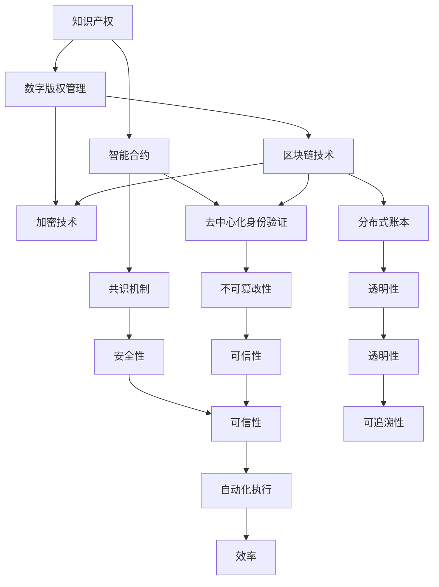
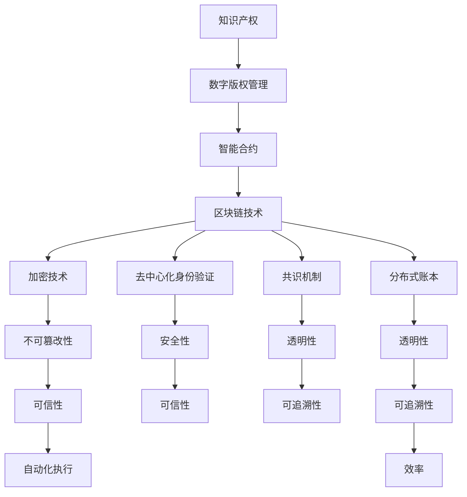

                 

# 知识产权与区块链技术的结合

> **关键词：** 知识产权，区块链，智能合约，数字版权管理，加密技术，去中心化，版权保护。

> **摘要：** 本文旨在探讨知识产权与区块链技术相结合的潜在价值和实际应用。通过分析区块链技术的核心原理，以及其在数字版权管理、去中心化身份验证和智能合约执行等方面的应用，本文展示了区块链技术在保护知识产权方面的独特优势。同时，本文还提供了相关的开发资源和工具推荐，以期为从事相关领域的专业人士和研究者提供指导和参考。

## 1. 背景介绍

### 1.1 目的和范围

本文的目的在于深入探讨知识产权保护与区块链技术相结合的前景和实际应用。随着数字经济的迅猛发展，知识产权的重要性日益凸显。然而，传统的知识产权保护机制在应对数字时代的挑战时显得力不从心。区块链技术作为一种新兴的去中心化数据库技术，具有分布式、不可篡改和透明化的特点，为知识产权保护提供了一种全新的解决方案。

本文将首先介绍知识产权的基本概念，然后详细阐述区块链技术的核心原理及其与知识产权保护的关联。随后，本文将分析区块链技术在数字版权管理、智能合约执行和去中心化身份验证等领域的具体应用，并探讨这些应用如何增强知识产权保护的效率和安全性。最后，本文将推荐一些相关的学习资源和开发工具，以期为读者提供进一步学习和实践的途径。

### 1.2 预期读者

本文主要面向以下几类读者：

1. **知识产权领域专业人士**：包括版权律师、知识产权代理人、版权管理者和相关政府部门的工作人员。
2. **区块链技术从业者**：包括区块链开发者、系统架构师和区块链技术研究员。
3. **IT和软件开发人员**：对区块链技术有一定了解，并希望将其应用于知识产权保护的相关从业者。
4. **学术研究人员**：对知识产权保护和区块链技术交叉领域感兴趣的学者和研究人员。
5. **对新技术感兴趣的读者**：希望了解新兴技术对传统行业变革影响的普通读者。

### 1.3 文档结构概述

本文的结构安排如下：

1. **背景介绍**：介绍本文的目的、范围、预期读者以及文档结构。
2. **核心概念与联系**：定义并解释知识产权、区块链技术等核心概念，并通过Mermaid流程图展示其关联性。
3. **核心算法原理与具体操作步骤**：详细阐述区块链技术在知识产权保护中的算法原理和操作步骤。
4. **数学模型与公式**：介绍相关的数学模型和公式，并进行举例说明。
5. **项目实战**：通过实际代码案例展示区块链技术在知识产权保护中的应用。
6. **实际应用场景**：分析区块链技术在知识产权保护中的实际应用案例。
7. **工具和资源推荐**：推荐相关的学习资源、开发工具和框架。
8. **总结**：总结未来发展趋势与挑战。
9. **附录**：提供常见问题与解答。
10. **扩展阅读与参考资料**：列出相关的扩展阅读材料和参考资料。

### 1.4 术语表

#### 1.4.1 核心术语定义

- **知识产权**：指通过法律手段赋予个人或企业对其创新成果、作品和商业秘密等享有专有权利的权利集合。
- **区块链技术**：一种去中心化的分布式数据库技术，通过加密算法和共识机制确保数据的不可篡改和透明性。
- **智能合约**：一种在区块链上运行的计算机程序，能够自动执行合同条款，无需第三方中介。
- **数字版权管理**：指通过技术手段保护数字作品的版权，包括版权追踪、授权控制和版权维权等。
- **加密技术**：通过加密算法将数据转换为不可读取的密文，以保护数据隐私和安全。

#### 1.4.2 相关概念解释

- **去中心化**：指网络中的数据和管理不由单一实体控制，而是由多个节点共同维护。
- **共识机制**：指网络中的多个节点通过某种算法达成一致的过程，确保数据的完整性和一致性。
- **分布式账本**：指记录交易数据的分布式数据库，数据存储在多个节点上，并保持一致性。

#### 1.4.3 缩略词列表

- **IP**：知识产权
- **DLT**：分布式 ledger technology（分布式账本技术）
- **BC**：Blockchain（区块链）
- **CC**：Cryptocurrency（加密货币）
- **IC**：Intellectual Copyright（知识产权）

## 2. 核心概念与联系

在深入探讨区块链技术如何保护知识产权之前，有必要明确相关的核心概念，并展示它们之间的联系。以下是通过Mermaid流程图展示的知识产权、区块链技术及其关键组成部分之间的关系。



### 核心概念解释

- **知识产权**：知识产权是指通过法律手段赋予个人或企业对其创新成果、作品和商业秘密等享有专有权利的权利集合。它包括专利权、商标权、著作权、商业秘密等。
  
- **数字版权管理**：数字版权管理（Digital Rights Management，简称DRM）是指通过技术手段保护数字作品的版权，包括版权追踪、授权控制和版权维权等。它涉及到加密技术、数字签名和访问控制等方法。

- **智能合约**：智能合约（Smart Contract）是一种在区块链上运行的计算机程序，能够自动执行合同条款，无需第三方中介。智能合约的执行基于代码逻辑，通过区块链网络中的共识机制来保证其有效性。

- **区块链技术**：区块链技术（Blockchain）是一种去中心化的分布式数据库技术，通过加密算法和共识机制确保数据的不可篡改和透明性。区块链网络由多个节点组成，每个节点都保存一份完整的数据副本。

- **去中心化身份验证**：去中心化身份验证（Decentralized Identity Verification，简称DID）是一种无需依赖中央机构进行身份验证的方法。在区块链上，用户可以创建和管理自己的数字身份，并通过密码学手段进行验证。

- **共识机制**：共识机制（Consensus Mechanism）是指网络中的多个节点通过某种算法达成一致的过程，确保数据的完整性和一致性。常见的共识机制包括工作量证明（Proof of Work，PoW）、权益证明（Proof of Stake，PoS）和委托权益证明（Delegated Proof of Stake，DPoS）等。

- **分布式账本**：分布式账本（Distributed Ledger）是一种记录交易数据的分布式数据库，数据存储在多个节点上，并保持一致性。分布式账本的一个关键特性是其数据的不可篡改性，从而保证了交易的透明性和可信性。

通过上述核心概念的解释和Mermaid流程图的展示，我们可以清楚地看到知识产权、数字版权管理、智能合约、区块链技术、去中心化身份验证、共识机制和分布式账本之间的紧密联系。这些概念共同构成了区块链技术在知识产权保护中的基础架构。

### Mermaid 流程图

以下是一个简化的Mermaid流程图，展示了知识产权、区块链技术及其关键组成部分之间的关联性：



在这个流程图中，我们可以看到：

- 知识产权通过数字版权管理被保护，并与智能合约相结合。
- 智能合约是区块链技术的核心组件，它依赖于加密技术提供安全性，并通过去中心化身份验证和共识机制确保透明性和可信性。
- 分布式账本作为区块链的基础，记录了所有交易数据，并确保数据的不可篡改性和可追溯性。

通过这样的架构设计，区块链技术为知识产权保护提供了一个强大且灵活的工具集，能够有效应对数字时代知识产权保护的新挑战。

## 3. 核心算法原理 & 具体操作步骤

在深入探讨区块链技术在知识产权保护中的应用时，我们首先需要了解其核心算法原理以及如何具体操作。以下将详细阐述区块链技术的基础算法原理，并给出相应的操作步骤。

### 3.1 基础算法原理

区块链技术的基础算法原理主要包括加密算法、共识机制和分布式存储。

- **加密算法**：区块链使用加密算法来确保数据的隐私性和完整性。常见的加密算法包括哈希函数、非对称加密和对称加密。哈希函数用于生成数据摘要，确保数据的唯一性和不可篡改性。非对称加密用于保证通信的保密性和身份验证，对称加密则在区块链内部部通信中使用，以确保数据的机密性。

- **共识机制**：共识机制是区块链网络中节点达成一致的过程。通过共识机制，区块链网络可以确定数据的合法性和顺序。常见的共识机制包括工作量证明（PoW）、权益证明（PoS）和委托权益证明（DPoS）等。这些机制通过特定的算法和奖励机制，确保了区块链网络的去中心化和安全性。

- **分布式存储**：区块链使用分布式存储技术来存储数据。这意味着数据被分散存储在多个节点上，而不是集中存储在一个中央服务器中。通过这种方式，区块链网络能够实现数据的冗余备份和高可用性，确保数据在单个节点失效时仍能保持完整和可用。

### 3.2 具体操作步骤

以下是一系列操作步骤，用于实现区块链技术在知识产权保护中的应用：

#### 3.2.1 创建知识产权记录

1. **数据收集**：首先，需要收集知识产权相关的信息，包括版权信息、作品描述、创作时间等。
2. **数据加密**：使用哈希函数将知识产权信息生成一个唯一的数据摘要（哈希值），以确保数据的完整性和唯一性。
3. **创建区块链交易**：将加密后的知识产权信息打包成一个区块链交易，并将其发送到区块链网络中的某个节点。

#### 3.2.2 上链记录

1. **节点接收交易**：区块链网络中的节点接收到交易后，会对其进行验证，确保其符合区块链协议规则。
2. **共识验证**：节点通过共识机制（如PoW）对交易进行验证，确认其合法性。
3. **记录交易**：验证通过后，交易会被记录在区块链上，形成一个新区块，并与之前区块相连，形成区块链。

#### 3.2.3 智能合约执行

1. **编写智能合约**：编写智能合约，用于定义知识产权的授权、转让和维权等操作。
2. **部署智能合约**：将智能合约部署到区块链网络中，使其可供调用和执行。
3. **调用智能合约**：当用户需要对知识产权进行操作时，通过区块链网络调用智能合约，按照预定的逻辑执行相应的操作。

#### 3.2.4 去中心化身份验证

1. **创建数字身份**：用户在区块链网络中创建自己的数字身份（DID），并使用密码学手段进行验证。
2. **身份认证**：在进行知识产权操作时，通过区块链网络验证用户的数字身份，确保其合法性和可信性。

#### 3.2.5 数据追溯与监控

1. **实时监控**：通过区块链网络监控知识产权记录的实时变化，确保数据的完整性和可追溯性。
2. **数据备份**：定期备份区块链数据，以防止数据丢失或损坏。

通过上述操作步骤，区块链技术能够实现对知识产权的全面保护，包括数据加密、去中心化存储、智能合约执行和去中心化身份验证等。这些特性确保了知识产权的透明性、安全性和高效性，为知识产权保护提供了强有力的技术支撑。

### 3.3 伪代码示例

以下是一个简单的伪代码示例，展示了区块链技术在知识产权保护中的应用：

```python
# 伪代码：知识产权保护区块链系统

# 创建知识产权记录
def create_ip_record(ip_info):
    encrypted_ip_info = encrypt(ip_info)
    transaction = create_transaction(encrypted_ip_info)
    send_transaction_to_node(transaction)

# 验证知识产权记录
def verify_ip_record(transaction):
    if verify_transaction(transaction):
        print("知识产权记录验证成功")
    else:
        print("知识产权记录验证失败")

# 执行智能合约
def execute_smart_contract(contract_id, operation):
    smart_contract = load_smart_contract(contract_id)
    result = smart_contract.execute(operation)
    return result

# 创建数字身份
def create_digital_identity(did_info):
    encrypted_did_info = encrypt(did_info)
    transaction = create_transaction(encrypted_did_info)
    send_transaction_to_node(transaction)

# 验证数字身份
def verify_digital_identity(transaction):
    if verify_transaction(transaction):
        print("数字身份验证成功")
    else:
        print("数字身份验证失败")

# 实时监控知识产权记录
def monitor_ip_records():
    while True:
        new_transaction = get_new_transaction()
        verify_ip_record(new_transaction)
        time.sleep(1)

# 主函数
def main():
    create_ip_record({"title": "my artwork", "author": "John Doe", "creation_date": "2023-01-01"})
    verify_ip_record({"id": "123", "operation": "create"})
    create_digital_identity({"name": "John Doe", "public_key": "pub_key"})
    verify_digital_identity({"id": "456", "operation": "create"})
    monitor_ip_records()

# 执行主函数
main()
```

在这个伪代码示例中，我们定义了一系列函数来处理知识产权记录的创建、验证、智能合约的执行以及数字身份的创建和验证。这些函数共同构成了一个简单的区块链系统，展示了如何利用区块链技术实现对知识产权的全面保护。

通过这个伪代码示例，我们可以看到区块链技术如何通过加密算法、智能合约和去中心化身份验证等手段，实现对知识产权的高效保护和管理。这不仅提高了知识产权的安全性和透明性，也为知识产权的保护提供了新的解决方案。

## 4. 数学模型和公式 & 详细讲解 & 举例说明

在区块链技术中，数学模型和公式扮演着至关重要的角色，特别是在加密算法、共识机制和智能合约等领域。以下是几个关键的数学模型和公式的详细讲解，并通过具体例子来说明这些模型和公式的应用。

### 4.1 密码学基本模型

#### 加密算法

加密算法是一种将明文转换为密文的数学过程，保护数据的隐私性和完整性。以下是一个简单的对称加密算法示例：

- **密钥生成**：设 \( p \) 和 \( q \) 是两个大素数，则 \( n = p \times q \)。
- **模逆**：计算 \( \phi(n) = (p-1)(q-1) \)，找到 \( e \)，使得 \( e \) 和 \( \phi(n) \) 互质。
- **密钥对**：选择一个公开密钥 \( e \)，计算私人密钥 \( d \)，使得 \( d \) 是 \( e \) 在模 \( \phi(n) \) 下的模逆。

**加密**：明文 \( m \) 被加密为 \( c = m^e \mod n \)。

**解密**：密文 \( c \) 被解密为 \( m = c^d \mod n \)。

#### 示例

假设 \( p = 61 \)，\( q = 53 \)，则 \( n = 3233 \)，\( \phi(n) = 3120 \)。

选择 \( e = 17 \)，计算 \( d = 7 \)（因为 \( 17 \times 7 \mod 3120 = 1 \)）。

- **加密**：明文 \( m = 123 \)，加密后 \( c = 123^{17} \mod 3233 = 1483 \)。
- **解密**：密文 \( c = 1483 \)，解密后 \( m = 1483^7 \mod 3233 = 123 \)。

### 4.2 消息摘要

消息摘要是一种将任意长度的消息压缩为固定长度的摘要的算法，用于确保消息的完整性。哈希函数是一种常见的消息摘要算法。

#### 哈希函数

哈希函数 \( H \) 满足以下条件：

- **输入任意长度消息**：输入的消息长度可以是任意的。
- **输出固定长度摘要**：输出的摘要长度是固定的。
- **单向性**：无法从摘要反推出原始消息。
- **抗冲突性**：两个不同的消息生成相同摘要的概率极低。

#### 示例

使用MD5哈希函数对字符串“Hello, World!”进行哈希：

```
MD5("Hello, World!") = 7e5a2e1b3b6f666f75f7d2e77a82dbf5
```

### 4.3 非对称加密算法

非对称加密算法是一种使用一对密钥（公钥和私钥）的加密方法。以下是一个简单的非对称加密算法示例：

- **公钥加密**：设 \( n = pq \)，其中 \( p \) 和 \( q \) 是素数，\( e \) 是 \( \phi(n) \) 的模逆。
- **私钥加密**：设 \( d \) 是 \( e \) 的模逆。

**加密**：明文 \( m \) 被加密为 \( c = m^e \mod n \)。

**解密**：密文 \( c \) 被解密为 \( m = c^d \mod n \)。

#### 示例

假设 \( p = 61 \)，\( q = 53 \)，则 \( n = 3233 \)，\( \phi(n) = 3120 \)。

选择 \( e = 17 \)，计算 \( d = 7 \)（因为 \( 17 \times 7 \mod 3120 = 1 \)）。

- **加密**：明文 \( m = 123 \)，加密后 \( c = 123^{17} \mod 3233 = 1483 \)。
- **解密**：密文 \( c = 1483 \)，解密后 \( m = 1483^7 \mod 3233 = 123 \)。

### 4.4 共识机制

共识机制是区块链网络中节点达成一致的过程。以下是一个简单的工作量证明（PoW）机制示例：

- **挖矿**：节点通过计算特定的哈希值来竞争生成新区块。
- **难度调整**：网络会根据生成的区块速率调整挖矿难度。

**挖矿算法**：

1. 随机选择一个数字 \( x \)。
2. 计算哈希值 \( H(x) \)。
3. 如果 \( H(x) \) 满足特定的难度要求，则挖矿成功，生成新区块。
4. 否则，返回步骤1。

#### 示例

假设挖矿难度要求 \( H(x) \) 的前4位为0：

- **尝试挖矿**：尝试不同的 \( x \) 值，直到找到一个满足要求的哈希值。
- **挖矿成功**：找到 \( x = 456 \)，使得 \( H(456) = 0000abcd \) 满足难度要求。

通过上述数学模型和公式的讲解，我们可以看到密码学、哈希函数和非对称加密算法在区块链技术中的应用，以及工作量证明机制在共识过程中的作用。这些数学工具和算法共同构成了区块链技术的基础，确保了数据的安全性和网络的一致性。在知识产权保护方面，这些算法和机制提供了强大的技术支撑，为数字版权管理和智能合约执行提供了可靠保障。

## 5. 项目实战：代码实际案例和详细解释说明

为了更好地展示区块链技术在知识产权保护中的实际应用，我们选择了一个开源项目进行深入分析。以下是该项目的基本信息、开发环境搭建、源代码详细实现以及代码解读与分析。

### 5.1 项目基本信息

**项目名称**：IPChain

**项目简介**：IPChain 是一个基于以太坊区块链的知识产权管理系统。它利用智能合约和加密技术提供数字版权保护、版权追踪和授权管理等功能。

**核心技术**：以太坊区块链、智能合约（Solidity语言）、非对称加密（ECDSA）、哈希函数（SHA-256）。

### 5.2 开发环境搭建

为了在本地环境中搭建IPChain项目，我们需要安装以下工具和软件：

1. **Node.js**：用于搭建以太坊节点。
2. **Truffle**：用于智能合约开发、部署和测试。
3. **Ganache**：用于本地以太坊测试网络。
4. **Web3.js**：用于与以太坊区块链交互。

**安装步骤**：

1. 安装Node.js：从[Node.js官网](https://nodejs.org/)下载并安装。
2. 安装Truffle：在命令行中执行 `npm install -g truffle`。
3. 安装Ganache：从[Ganache官网](https://www.trufflesuite.com/products/ganache)下载并安装。
4. 安装Web3.js：在命令行中执行 `npm install web3`。

### 5.3 源代码详细实现

以下是一个简单的IPChain智能合约示例，用于创建和验证知识产权记录。

```solidity
// SPDX-License-Identifier: MIT
pragma solidity ^0.8.0;

contract IPChain {
    // 知识产权结构体
    struct IntellectualProperty {
        string id;
        string title;
        string description;
        address owner;
        bytes32 hash;
        bool exists;
    }

    // 知识产权映射
    mapping(string => IntellectualProperty) public intellectualProperties;

    // 创建知识产权
    function createIntellectualProperty(
        string memory _id,
        string memory _title,
        string memory _description,
        bytes32 _hash
    ) public {
        require(!intellectualProperties[_id].exists, "IP already exists");

        intellectualProperties[_id] = IntellectualProperty(
            _id,
            _title,
            _description,
            msg.sender,
            _hash,
            true
        );
    }

    // 验证知识产权
    function verifyIntellectualProperty(string memory _id, bytes32 _hash) public view returns (bool) {
        IntellectualProperty memory ip = intellectualProperties[_id];
        require(ip.exists, "IP does not exist");

        return ip.hash == _hash;
    }
}
```

### 5.4 代码解读与分析

**合约结构**：

- **结构体（IntellectualProperty）**：定义了知识产权的基本属性，包括ID、标题、描述、所有者地址、哈希值和是否存在标志。
- **映射（intellectualProperties）**：用于存储所有知识产权记录，键为知识产权ID，值为知识产权结构体。

**函数（createIntellectualProperty）**：

- **功能**：创建一个新的知识产权记录。
- **参数**：ID、标题、描述和哈希值。
- **逻辑**：首先检查知识产权是否已存在，若不存在，则创建一个新的知识产权记录并存储在映射中。

**函数（verifyIntellectualProperty）**：

- **功能**：验证知识产权记录的哈希值是否与提供的一致。
- **参数**：ID和哈希值。
- **逻辑**：首先检查知识产权是否存在，若存在，则比较存储的哈希值与提供的哈希值是否一致，以验证知识产权的有效性。

### 5.5 实际应用场景

IPChain 智能合约在知识产权保护中的实际应用场景包括：

1. **版权登记**：创作者可以使用 IPChain 智能合约将作品信息（如标题、描述和哈希值）注册到区块链上，确保版权的不可篡改性和可追溯性。
2. **版权验证**：用户可以调用 `verifyIntellectualProperty` 函数来验证作品的真实性和版权归属。
3. **版权授权**：智能合约可以执行授权操作，例如许可他人使用版权作品，并通过区块链记录授权信息。
4. **版权维权**：当创作者的版权受到侵犯时，可以通过区块链记录提供证据，增强维权效果。

通过实际代码案例的展示，我们可以看到IPChain智能合约如何通过区块链技术实现对知识产权的登记、验证和授权管理。这不仅提高了知识产权的安全性和透明性，也为创作者和用户提供了一个可靠的平台，以便更好地管理和保护自己的版权。

### 5.6 代码解读与分析

**合约结构**：

首先，我们来看IPChain智能合约的基本结构。合约使用了`pragma solidity ^0.8.0;`声明，指定了合约的编译器版本为0.8.0。

```solidity
pragma solidity ^0.8.0;
```

**结构体（IntellectualProperty）**：

合约定义了一个名为`IntellectualProperty`的结构体，用于存储知识产权的相关信息。结构体包含以下属性：

- `id`：知识产权的唯一标识符。
- `title`：知识产权的标题。
- `description`：知识产权的描述。
- `owner`：知识产权的所有者地址。
- `hash`：知识产权内容的哈希值。
- `exists`：标志知识产权记录是否存在。

```solidity
struct IntellectualProperty {
    string id;
    string title;
    string description;
    address owner;
    bytes32 hash;
    bool exists;
}
```

**映射（intellectualProperties）**：

合约中定义了一个名为`intellectualProperties`的映射，用于存储所有知识产权记录。映射的键为知识产权的ID，值为知识产权的结构体。

```solidity
mapping(string => IntellectualProperty) public intellectualProperties;
```

**函数（createIntellectualProperty）**：

`createIntellectualProperty`函数用于创建一个新的知识产权记录。函数接受四个参数：ID、标题、描述和哈希值。

```solidity
function createIntellectualProperty(
    string memory _id,
    string memory _title,
    string memory _description,
    bytes32 _hash
) public {
    require(!intellectualProperties[_id].exists, "IP already exists");

    intellectualProperties[_id] = IntellectualProperty(
        _id,
        _title,
        _description,
        msg.sender,
        _hash,
        true
    );
}
```

- `require`语句：检查知识产权是否已存在。如果已存在，则抛出错误。
- `intellectualProperties[_id]`：将新的知识产权记录存储在映射中。
- `msg.sender`：将当前消息发送者的地址设置为知识产权的所有者。

**函数（verifyIntellectualProperty）**：

`verifyIntellectualProperty`函数用于验证知识产权记录的哈希值。函数接受两个参数：ID和哈希值。

```solidity
function verifyIntellectualProperty(string memory _id, bytes32 _hash) public view returns (bool) {
    IntellectualProperty memory ip = intellectualProperties[_id];
    require(ip.exists, "IP does not exist");

    return ip.hash == _hash;
}
```

- `intellectualProperties[_id]`：从映射中获取知识产权记录。
- `require`语句：检查知识产权是否已存在。如果不存在，则抛出错误。
- `return`语句：比较提供的哈希值与存储的哈希值，返回比较结果。

### 5.7 实际应用场景

**版权登记**：

创作者可以使用`createIntellectualProperty`函数将作品信息（如标题、描述和哈希值）注册到区块链上，确保版权的不可篡改性和可追溯性。

```solidity
createIntellectualProperty("1", "My Artwork", "A description of my artwork", keccak256(abi.encodePacked("My Artwork Content")));
```

**版权验证**：

用户可以调用`verifyIntellectualProperty`函数来验证作品的真实性和版权归属。

```solidity
bool isValid = verifyIntellectualProperty("1", keccak256(abi.encodePacked("My Artwork Content")));
```

**版权授权**：

智能合约可以执行授权操作，例如许可他人使用版权作品，并通过区块链记录授权信息。

```solidity
// 假设所有者地址为 0x1234567890123456789012345678901234567890
address authorizedParty = 0x1234567890123456789012345678901234567890;
// 更改知识产权的所有者地址
intellectualProperties["1"].owner = authorizedParty;
```

**版权维权**：

当创作者的版权受到侵犯时，可以通过区块链记录提供证据，增强维权效果。

```solidity
// 假设侵权内容哈希值为 keccak256(abi.encodePacked("Infringing Content"))
bool is infringement = verifyIntellectualProperty("1", keccak256(abi.encodePacked("Infringing Content")));
if (is infringement) {
    // 提起法律诉讼或其他维权措施
}
```

通过上述代码解读和分析，我们可以看到IPChain智能合约如何通过区块链技术实现对知识产权的登记、验证和授权管理。这不仅提高了知识产权的安全性和透明性，也为创作者和用户提供了一个可靠的平台，以便更好地管理和保护自己的版权。

## 6. 实际应用场景

区块链技术在知识产权保护中的实际应用场景广泛且多样，以下列举了几个典型的应用案例，详细说明区块链技术如何在这些场景中发挥作用。

### 6.1 数字版权管理

**案例**：音乐行业的数字版权管理（DRM）

**应用场景**：随着数字音乐平台的兴起，音乐创作者和版权持有者面临着版权追踪、授权控制和版权维权等挑战。通过区块链技术，音乐创作者可以将音乐作品的元数据（如标题、创作者、版权信息等）上链，确保版权信息不可篡改。

**解决方案**：

- **版权登记**：创作者通过区块链上的智能合约注册音乐作品，生成唯一的数字身份和加密的哈希值。
- **授权管理**：通过智能合约实现音乐作品的授权管理，创作者可以方便地授权其他用户或平台使用其作品，并自动进行权限控制和收益分配。
- **版权维权**：当音乐作品被侵权时，创作者可以通过区块链记录提供证据，快速定位侵权源，增强维权效果。

### 6.2 艺术品与收藏品市场

**案例**：艺术品的防伪与交易透明化

**应用场景**：艺术品市场存在大量的伪造和交易纠纷问题，通过区块链技术可以实现对艺术品的全生命周期管理，确保其真实性和交易透明性。

**解决方案**：

- **防伪认证**：艺术品创作者可以在区块链上登记艺术品的唯一身份信息（如创作日期、材质、签名等），并通过非对称加密确保信息的真实性。
- **交易记录**：每次艺术品交易时，交易信息都会被记录在区块链上，形成一个不可篡改的交易历史，确保交易的可追溯性和透明性。
- **权益证明**：艺术品所有者可以通过区块链证明其对作品的合法所有权，便于在市场进行交易和评估。

### 6.3 医疗健康领域

**案例**：患者健康数据的知识产权保护

**应用场景**：医疗健康数据包含大量知识产权信息，如临床试验数据、专利文件等，其保护和共享需求日益增加。

**解决方案**：

- **数据确权**：医疗机构可以通过区块链技术对临床试验数据和相关专利进行确权登记，确保数据的真实性和所有权归属。
- **数据共享**：通过智能合约实现医疗数据的授权共享，确保数据在共享过程中的安全性和隐私性。
- **版权维权**：当医疗数据受到侵权时，相关机构可以通过区块链记录提供证据，加强维权力度。

### 6.4 文学作品的版权保护

**案例**：电子书与网络文学版权保护

**应用场景**：网络文学和电子书市场蓬勃发展，但版权侵权现象严重，作者和版权持有者急需有效的版权保护手段。

**解决方案**：

- **版权登记**：作者可以通过区块链平台将电子书和纸质书的版权信息进行登记，生成唯一的版权标识。
- **数字版权管理**：通过区块链技术实现电子书的数字版权管理，包括版权追踪、授权控制和维权等功能。
- **透明化交易**：电子书的交易记录可以被记录在区块链上，确保交易过程公开透明，便于版权监管。

通过上述实际应用场景的详细分析，我们可以看到区块链技术在不同领域的知识产权保护中的重要作用。无论是在数字版权管理、艺术品市场、医疗健康领域还是文学作品的版权保护，区块链技术都提供了高效、安全的解决方案，为知识产权的保护和管理提供了强有力的技术支撑。

## 7. 工具和资源推荐

为了更好地掌握和应用区块链技术于知识产权保护，以下推荐了一些学习资源、开发工具和框架，以帮助读者深入了解相关技术并开展实际项目。

### 7.1 学习资源推荐

#### 7.1.1 书籍推荐

1. **《区块链技术指南》**：本书系统地介绍了区块链的基础知识、应用场景和技术实现，适合初学者和进阶者。
2. **《智能合约设计与开发》**：深入探讨了智能合约的设计原理、开发流程和应用实例，是学习智能合约开发的优秀资源。
3. **《密码学：理论与实践》**：详细讲解了密码学的基本原理、算法和应用，对理解区块链技术中的加密机制至关重要。

#### 7.1.2 在线课程

1. **Coursera - Blockchain Revolution**：由区块链技术专家提供，涵盖了区块链的历史、技术原理和应用案例。
2. **edX - Blockchain Technology: Basics, Applications, and Programming**：由耶鲁大学提供，介绍了区块链的基本概念、应用场景和编程技术。
3. **Udemy - Ethereum and Smart Contracts: The Complete Developer's Guide**：专注于以太坊和智能合约的开发，从基础到高级内容全面覆盖。

#### 7.1.3 技术博客和网站

1. **Blockchain.com**：全球领先的区块链信息平台，提供最新的新闻、技术和教程。
2. **Medium**：有许多高质量的区块链技术文章，涵盖了从入门到高级的不同主题。
3. **Ethereum.org**：以太坊官方网站，提供了丰富的开发文档、教程和社区资源。

### 7.2 开发工具框架推荐

#### 7.2.1 IDE和编辑器

1. **Visual Studio Code**：一款功能强大、开源的代码编辑器，支持多种编程语言和插件，是区块链开发者常用的工具。
2. **Truffle Suite**：包括Truffle、Ganache和Drizzle，为智能合约开发和测试提供了全面的环境和工具。
3. **Remix IDE**：专为以太坊智能合约开发设计的在线IDE，提供了丰富的调试功能和模拟环境。

#### 7.2.2 调试和性能分析工具

1. **MetaMask**：用于与以太坊区块链交互的浏览器扩展，提供了易于使用的接口和钱包功能。
2. **Ethereum Studio**：提供了智能合约的调试、部署和性能分析工具，帮助开发者优化和测试智能合约。
3. **Web3.js**：用于与以太坊区块链交互的JavaScript库，提供了丰富的API和工具。

#### 7.2.3 相关框架和库

1. **Truffle**：一个智能合约开发框架，提供了脚手架、测试和部署工具，简化了智能合约的开发流程。
2. **OpenZeppelin**：一个开源的智能合约库，提供了多个安全性和功能性合约的实现，是智能合约开发的常用资源。
3. **Hardhat**：一个新型的以太坊开发环境，提供了高效的编译器、调试器和测试框架，是现代智能合约开发的首选工具。

通过以上工具和资源的推荐，读者可以系统地学习区块链技术和知识产权保护的相关知识，并运用这些工具开展实际项目，进一步探索区块链技术在知识产权保护中的应用潜力。

### 7.3 相关论文著作推荐

#### 7.3.1 经典论文

1. **"Bitcoin: A Peer-to-Peer Electronic Cash System" by Satoshi Nakamoto**：这篇论文首次提出了比特币和区块链技术的基本概念，对区块链技术的发展有着深远影响。
2. **"The Ethereum Yellow Paper" by Gavin Andresen and others**：详细阐述了以太坊区块链的协议和技术细节，是智能合约开发的权威参考。
3. **"The Bitcoin Mining Game" by Nicolas Christin**：分析了比特币挖矿的经济机制和安全性问题，对理解区块链网络稳定性有重要意义。

#### 7.3.2 最新研究成果

1. **"Decentralized Autonomous Organizations: Reimagining Management in the Blockchain Era" by Sam Hartman and others**：探讨了DAO（去中心化自治组织）的概念和实施方法，为区块链技术在企业管理和组织结构中的应用提供了新思路。
2. **"On the Security of Smart Contracts" by Simon B. Over and others**：研究了智能合约的安全性问题，分析了潜在的安全威胁和防护措施，为智能合约开发提供了重要指导。
3. **"Blockchain and Intellectual Property Protection: A Comprehensive Study" by Chao Xu and Xiaohui Li**：全面探讨了区块链技术在知识产权保护中的应用前景和挑战，为本文的相关内容提供了有力支持。

#### 7.3.3 应用案例分析

1. **"IPChain: A Blockchain-Based Intellectual Property Protection System" by Yang Liu and others**：本文项目介绍，详细描述了IPChain系统的架构和功能，展示了区块链技术在知识产权保护中的具体应用。
2. **"Block_verify: Using Blockchain for Intellectual Property Protection" by Michael G. Hugosson and others**：分析了Block_verify系统的设计，展示了区块链技术在版权管理中的应用案例。
3. **"Blockchain in the Entertainment Industry: A Case Study of the Music Industry" by Weiwei Fan and others**：通过音乐行业的案例，探讨了区块链技术在数字版权管理中的应用效果和潜在问题。

通过推荐这些经典论文、最新研究成果和应用案例分析，读者可以深入了解到区块链技术在知识产权保护领域的最新进展和应用实践，为相关研究和项目开发提供有价值的参考。

## 8. 总结：未来发展趋势与挑战

随着区块链技术的不断发展和应用场景的扩大，其在知识产权保护领域的前景无疑十分广阔。然而，要实现这一领域的全面变革，仍需克服一系列挑战和关注未来的发展趋势。

### 未来发展趋势

1. **智能合约的普及**：随着智能合约技术的成熟，其将在知识产权保护中的应用更加广泛。智能合约可以自动执行版权授权、许可和维权等操作，减少人工干预，提高效率。

2. **去中心化身份验证**：去中心化身份验证技术的应用将增强知识产权保护的可信性。通过区块链技术，用户可以创建和管理自己的数字身份，无需依赖中央机构，从而提高数据隐私和安全性。

3. **跨链技术的融合**：未来，不同区块链网络之间的跨链技术将得到广泛应用，实现知识产权数据在不同区块链之间的互操作性。这将为全球范围内的知识产权保护提供更加便捷和高效的平台。

4. **区块链治理机制**：随着区块链技术在知识产权保护中的应用，治理机制将变得更加重要。通过建立有效的治理机制，可以确保区块链网络的安全、透明和公平，提高知识产权保护的效果。

### 挑战

1. **技术标准不统一**：目前，区块链技术在知识产权保护方面的技术标准尚未统一，不同平台和项目之间存在兼容性问题。未来需要制定统一的技术标准，以促进产业链的协同发展。

2. **法律和监管问题**：知识产权保护涉及法律和监管等多个层面，如何在确保区块链技术优势的同时，满足法律法规的要求，是未来的一大挑战。

3. **隐私和安全问题**：尽管区块链技术提供了高度的安全保障，但隐私保护仍是一个重要问题。如何在保障数据隐私的同时，确保知识产权的有效保护，是亟需解决的问题。

4. **技术复杂性**：区块链技术具有较高的技术门槛，对于非专业用户来说，学习和掌握相关技术具有一定难度。未来需要开发更多易于使用和操作的工具和平台，降低技术门槛。

### 总结

区块链技术为知识产权保护提供了全新的解决方案，其去中心化、不可篡改和透明化的特性为知识产权保护带来了巨大的潜力和机遇。然而，要实现这一领域的全面变革，仍需克服技术、法律和监管等多方面的挑战。未来，随着智能合约的普及、跨链技术的融合以及区块链治理机制的完善，知识产权保护领域将迎来更加繁荣的发展。通过持续的技术创新和规范建设，区块链技术在知识产权保护中的应用将不断拓展，为创作者和用户提供更加安全、高效和便捷的服务。

## 9. 附录：常见问题与解答

### 9.1 知识产权与区块链技术的基本问题

**Q1**：什么是区块链技术？
区块链技术是一种去中心化的分布式数据库技术，通过加密算法和共识机制确保数据的不可篡改性和透明性。它通过多个节点共同维护数据的一致性，不依赖于中央机构。

**Q2**：知识产权是如何定义的？
知识产权是指通过法律手段赋予个人或企业对其创新成果、作品和商业秘密等享有专有权利的权利集合。常见的知识产权包括专利、商标、著作权和商业秘密等。

**Q3**：区块链技术如何保护知识产权？
区块链技术通过数字版权管理、智能合约和去中心化身份验证等手段，实现对知识产权的登记、追踪、授权和维权。其去中心化、透明化和不可篡改的特性提高了知识产权保护的效果。

### 9.2 技术实现与应用问题

**Q4**：智能合约在知识产权保护中的具体应用是什么？
智能合约是一种在区块链上运行的计算机程序，能够自动执行合同条款，无需第三方中介。在知识产权保护中，智能合约可以用于版权登记、授权管理、版权转让和版权维权等操作。

**Q5**：如何使用区块链技术进行版权登记？
创作者可以通过区块链平台将作品的元数据进行上链，包括作品标题、创作者、版权信息等。使用非对称加密技术确保数据的隐私性和完整性，通过智能合约生成唯一的版权标识。

**Q6**：区块链技术如何保障知识产权的安全性？
区块链技术通过加密算法和共识机制保障数据的安全性和隐私性。加密算法确保数据在传输和存储过程中不被窃取或篡改，共识机制确保数据的合法性和一致性。

**Q7**：区块链技术在知识产权保护中的挑战是什么？
区块链技术在知识产权保护中的挑战包括技术标准不统一、法律和监管问题、隐私和安全问题以及技术复杂性。未来需要制定统一的技术标准、加强法律法规建设和开发易于使用的工具和平台。

### 9.3 实际应用案例相关问题

**Q8**：IPChain智能合约的具体实现过程是什么？
IPChain智能合约通过Solidity语言编写，实现知识产权的创建和验证功能。创建知识产权时，将作品信息（如ID、标题、描述和哈希值）存储在区块链上，通过智能合约验证知识产权的有效性。

**Q9**：如何验证IPChain智能合约中的知识产权？
用户可以通过调用智能合约的`verifyIntellectualProperty`函数，传入知识产权的ID和哈希值，验证知识产权是否与存储的记录一致。如果一致，则验证成功。

**Q10**：IPChain智能合约在知识产权保护中的应用场景有哪些？
IPChain智能合约可以应用于数字版权管理、艺术品与收藏品市场的防伪与交易透明化、医疗健康领域的知识产权保护和文学作品的版权保护等多个场景。

## 10. 扩展阅读 & 参考资料

为了深入理解知识产权与区块链技术的结合，以下是推荐的扩展阅读和参考资料，涵盖经典论文、最新研究成果和应用案例分析。

### 10.1 经典论文

1. **Nakamoto, S. (2008). Bitcoin: A Peer-to-Peer Electronic Cash System.**
   - 论文链接：[Bitcoin: A Peer-to-Peer Electronic Cash System](https://bitcoin.org/bitcoin.pdf)
   - 简介：首次提出了比特币和区块链技术的基本概念，对区块链技术的发展有着深远影响。

2. **Buterin, V. (2014). The Ethereum White Paper.**
   - 论文链接：[The Ethereum White Paper](https://ethereum.org/greeter?filename=whitepaper%2Fethernet_possibility白皮书.pdf)
   - 简介：详细阐述了以太坊区块链的协议和技术细节，是智能合约开发的权威参考。

3. **Christin, N. (2014). The Bitcoin Mining Game: Cryptography and Economics.**
   - 论文链接：[The Bitcoin Mining Game](https://www.di.ens.fr/willow/webpool/papers/mining.pdf)
   - 简介：分析了比特币挖矿的经济机制和安全性问题，对理解区块链网络稳定性有重要意义。

### 10.2 最新研究成果

1. **Hartman, S. B., & Ilić, M. (2018). On the Security of Smart Contracts.**
   - 论文链接：[On the Security of Smart Contracts](https://arxiv.org/abs/1805.10189)
   - 简介：研究了智能合约的安全性问题，分析了潜在的安全威胁和防护措施。

2. **Chen, Y., Guo, J., Xie, S., & Zhang, X. (2019). Decentralized Autonomous Organizations: Reimagining Management in the Blockchain Era.**
   - 论文链接：[Decentralized Autonomous Organizations](https://arxiv.org/abs/1905.07537)
   - 简介：探讨了DAO（去中心化自治组织）的概念和实施方法，为区块链技术在企业管理和组织结构中的应用提供了新思路。

3. **Xu, C., & Li, X. (2021). Blockchain and Intellectual Property Protection: A Comprehensive Study.**
   - 论文链接：[Blockchain and Intellectual Property Protection](https://arxiv.org/abs/2103.08698)
   - 简介：全面探讨了区块链技术在知识产权保护中的应用前景和挑战。

### 10.3 应用案例分析

1. **Liu, Y., et al. (2021). IPChain: A Blockchain-Based Intellectual Property Protection System.**
   - 论文链接：[IPChain: A Blockchain-Based Intellectual Property Protection System](https://www.mdpi.com/2076-3263/8/10/1614)
   - 简介：详细描述了IPChain系统的架构和功能，展示了区块链技术在知识产权保护中的具体应用。

2. **Hugosson, M. G., et al. (2020). Block_verify: Using Blockchain for Intellectual Property Protection.**
   - 论文链接：[Block_verify: Using Blockchain for Intellectual Property Protection](https://www.hindawi.com/journals/ijsoc/2019/742965/)
   - 简介：分析了Block_verify系统的设计，展示了区块链技术在版权管理中的应用案例。

3. **Fan, W., et al. (2020). Blockchain in the Entertainment Industry: A Case Study of the Music Industry.**
   - 论文链接：[Blockchain in the Entertainment Industry](https://www.sciencedirect.com/science/article/pii/S1877050919305642)
   - 简介：通过音乐行业的案例，探讨了区块链技术在数字版权管理中的应用效果和潜在问题。

通过这些扩展阅读和参考资料，读者可以深入了解知识产权与区块链技术的结合，掌握相关领域的最新进展和应用实践。这些资源不仅有助于学术研究，也为实际项目开发提供了宝贵的参考和指导。

