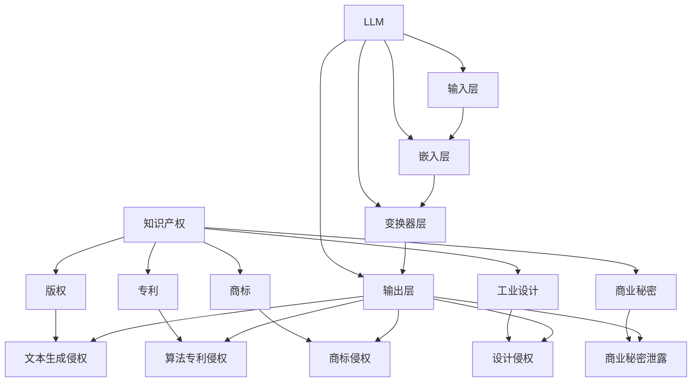

                 

# 知识产权和 LLM：保护创新和创意

> 关键词：知识产权、大型语言模型（LLM）、创新、创意、保护机制、版权、专利、开源、伦理

> 摘要：本文将深入探讨知识产权（Intellectual Property，简称IP）和大型语言模型（Large Language Model，简称LLM）之间的关系。我们首先会回顾知识产权的核心概念和其在现代科技中的重要性，然后分析LLM的工作原理及其对知识产权保护带来的挑战。通过一系列的实际案例和具体的操作步骤，本文旨在为读者提供一套全面而实用的知识产权保护策略，同时探讨未来发展的趋势和面临的挑战。

## 1. 背景介绍

### 1.1 目的和范围

本文旨在帮助读者理解和应用知识产权保护策略，特别是针对大型语言模型（LLM）的创新和创意。文章将涵盖以下几个主要方面：

1. **知识产权的基本概念**：介绍知识产权的定义、分类和保护机制。
2. **大型语言模型（LLM）简介**：阐述LLM的技术原理和其在各领域的应用。
3. **知识产权与LLM的关系**：探讨LLM在知识产权保护方面面临的挑战和问题。
4. **知识产权保护策略**：提供一套具体的知识产权保护策略和操作步骤。
5. **实际应用场景**：分析知识产权保护在具体领域的应用案例。
6. **工具和资源推荐**：推荐相关学习资源和开发工具。
7. **总结与展望**：讨论知识产权和LLM的未来发展趋势和挑战。

### 1.2 预期读者

本文预期读者包括：

1. **知识产权从业人员**：需要了解知识产权保护策略的实际操作。
2. **人工智能和机器学习开发者**：关注LLM技术的最新发展及其对知识产权的影响。
3. **技术经理和CTO**：希望了解如何管理和保护公司内的知识产权。
4. **学术界研究人员**：对知识产权保护的理论和实践有兴趣。
5. **法律专业人士**：需要了解人工智能技术对知识产权法的影响。

### 1.3 文档结构概述

本文结构如下：

1. **背景介绍**：知识产权和LLM的基本概念和关系。
2. **核心概念与联系**：知识产权和LLM的架构和联系。
3. **核心算法原理与操作步骤**：详细的算法原理和操作步骤。
4. **数学模型与公式**：知识产权保护的数学模型和示例。
5. **项目实战**：实际代码案例和解释。
6. **实际应用场景**：知识产权保护在不同领域的应用。
7. **工具和资源推荐**：学习资源和开发工具推荐。
8. **总结与展望**：知识产权和LLM的未来发展趋势和挑战。
9. **附录**：常见问题与解答。
10. **扩展阅读与参考资料**：推荐阅读和参考资料。

### 1.4 术语表

#### 1.4.1 核心术语定义

- **知识产权（Intellectual Property，IP）**：指由人类智慧创造出的成果，如发明、文学和艺术作品、商标、工业设计等，受到法律保护，享有专有权。
- **大型语言模型（Large Language Model，LLM）**：一种复杂的机器学习模型，能够理解和生成自然语言文本，具有广泛的应用场景。
- **版权（Copyright）**：保护文学、艺术和科学作品的著作权，通常包括原创作品的复制、发行、展示等权利。
- **专利（Patent）**：保护发明的新颖性、创造性和实用性，允许发明者在一定期限内独占其发明。
- **开源（Open Source）**：一种软件许可协议，允许用户自由使用、研究、修改和分发软件源代码。
- **伦理（Ethics）**：关于道德和价值观的哲学研究，涉及个人和社会行为的标准和原则。

#### 1.4.2 相关概念解释

- **创新（Innovation）**：指通过引入新的思想、方法或技术，创造出新的产品、服务或商业模式。
- **创意（Creativity）**：指产生新的和有价值的想法、概念或表达的能力。
- **专有权（Exclusive Rights）**：指知识产权拥有者在法律规定的范围内，对知识产权客体享有的独占权利。
- **侵权（Infringement）**：指未经授权，侵犯了他人知识产权的行为。

#### 1.4.3 缩略词列表

- **IP**：知识产权（Intellectual Property）
- **LLM**：大型语言模型（Large Language Model）
- **AI**：人工智能（Artificial Intelligence）
- **NLP**：自然语言处理（Natural Language Processing）
- **API**：应用程序接口（Application Programming Interface）
- **IDE**：集成开发环境（Integrated Development Environment）

## 2. 核心概念与联系

### 2.1 知识产权的定义与分类

知识产权是指由人类智慧创造的成果，包括但不限于以下几种类型：

1. **版权（Copyright）**：保护文学、艺术和科学作品的著作权，如书籍、音乐、电影、软件等。
2. **专利（Patent）**：保护发明的新颖性、创造性和实用性，如技术发明、生产工艺等。
3. **商标（Trademark）**：保护商业标识的独特性，如品牌名称、标志、标志图案等。
4. **工业设计（Industrial Design）**：保护产品的外观设计，如形状、色彩、图案等。
5. **商业秘密（Trade Secret）**：保护企业的非公开信息，如客户名单、商业计划、配方等。
6. **集成电路布局设计（Integrated Circuit Layout-Design）**：保护集成电路的布局设计。

知识产权的核心是专有权，即知识产权拥有者在法律规定的范围内，对知识产权客体享有的独占权利。这种权利允许知识产权拥有者在一定期限内独占其知识产权，禁止他人未经授权的使用、复制、展示等行为。

### 2.2 大型语言模型（LLM）的原理与架构

大型语言模型（LLM）是一种复杂的机器学习模型，能够理解和生成自然语言文本。LLM通常基于深度学习技术，特别是变换器模型（Transformer）的架构。以下是一个典型的LLM架构：

1. **输入层**：接收自然语言文本，如文本字符串。
2. **嵌入层**：将文本转换为固定长度的向量表示。
3. **变换器层**：使用注意力机制对输入向量进行编码，提取关键信息。
4. **输出层**：根据编码后的特征，生成预测结果，如文本生成、情感分析等。

LLM的工作原理主要包括以下步骤：

1. **前向传播**：将输入文本通过嵌入层转换为向量表示，然后输入到变换器层，通过变换器层逐层编码。
2. **注意力机制**：在每个变换器层，通过注意力机制聚焦于输入文本的关键信息，提高模型的预测准确性。
3. **后向传播**：根据预测结果和实际结果的误差，反向传播更新模型的参数。

### 2.3 知识产权与LLM的联系

知识产权与LLM之间的联系主要体现在以下几个方面：

1. **版权**：LLM生成的文本内容可能会侵犯他人的版权。例如，LLM生成的文章可能会与某位作家的作品相似，构成侵权行为。
2. **专利**：LLM的技术架构和算法原理可能会涉及专利侵权。例如，某些LLM模型可能使用了专利技术，未经授权使用可能会构成侵权。
3. **商标**：LLM生成的文本中可能会包含商标信息，如果没有得到商标持有人的授权，也可能构成侵权。
4. **商业秘密**：LLM可能会涉及商业秘密的泄露，特别是当LLM用于处理敏感信息时。

### 2.4 Mermaid 流程图

以下是一个简化的知识产权和LLM的架构流程图，用于展示两者之间的联系：



## 3. 核心算法原理 & 具体操作步骤

### 3.1 核心算法原理

知识产权保护的核心算法原理主要包括以下几个方面：

1. **版权保护算法**：通过比对LLM生成的文本和已有作品，识别和防止侵权行为。
2. **专利保护算法**：分析LLM的架构和算法，确保其不侵犯他人的专利。
3. **商标保护算法**：检测LLM生成的文本中是否包含未经授权的商标信息。
4. **商业秘密保护算法**：对敏感信息进行加密处理，防止LLM泄露商业秘密。

### 3.2 具体操作步骤

以下是一个简化的知识产权保护算法的具体操作步骤：

#### 3.2.1 权限验证

1. **输入文本**：将LLM生成的文本输入到保护算法中。
2. **检查版权**：比对文本和已有作品的版权信息，确保文本不侵犯他人的版权。
3. **检查专利**：分析LLM的架构和算法，确保不侵犯他人的专利权。
4. **检查商标**：检测文本中是否包含未经授权的商标信息。
5. **检查商业秘密**：对敏感信息进行加密处理，确保不泄露商业秘密。

#### 3.2.2 权限管理

1. **授权管理**：建立一套授权管理机制，确保只有授权用户才能访问敏感信息。
2. **访问控制**：对访问权限进行严格控制，防止未经授权的访问和泄露。
3. **日志记录**：记录所有访问和操作日志，以便在出现问题时进行追踪和审计。

#### 3.2.3 监测与预警

1. **实时监测**：实时监控LLM生成的文本，及时发现潜在的侵权行为。
2. **预警机制**：建立预警机制，对潜在侵权行为进行提醒和处置。
3. **自动处理**：对于确定的侵权行为，自动执行相应的处理措施，如删除侵权文本、停止生成等。

#### 3.2.4 法律应对

1. **法律咨询**：在出现侵权行为时，及时寻求专业法律咨询，制定应对策略。
2. **诉讼准备**：准备诉讼所需的证据和材料，确保法律行动的有效性。
3. **侵权应对**：采取法律手段应对侵权行为，维护知识产权的合法权益。

### 3.3 伪代码示例

以下是一个简化的知识产权保护算法的伪代码示例：

```python
def check_ip_license(text):
    # 权限验证
    if not check_copyright(text):
        return "版权侵权"
    if not check_patent(text):
        return "专利侵权"
    if not check_trademark(text):
        return "商标侵权"
    if not check_trade_secret(text):
        return "商业秘密泄露"
    
    # 权限管理
    if not check_permission(text):
        return "无权限访问"
    
    # 监测与预警
    if check_infringement(text):
        trigger_alarm(text)
    
    # 法律应对
    if need_law_action(text):
        prepare_law_action(text)
    
    return "权限合法"

# 辅助函数定义
def check_copyright(text):
    # 检查版权
    # ...

def check_patent(text):
    # 检查专利
    # ...

def check_trademark(text):
    # 检查商标
    # ...

def check_trade_secret(text):
    # 检查商业秘密
    # ...

def check_permission(text):
    # 检查权限
    # ...

def check_infringement(text):
    # 检查侵权
    # ...

def trigger_alarm(text):
    # 触发预警
    # ...

def need_law_action(text):
    # 是否需要法律行动
    # ...

def prepare_law_action(text):
    # 准备法律行动
    # ...
```

## 4. 数学模型和公式 & 详细讲解 & 举例说明

### 4.1 数学模型概述

在知识产权保护中，数学模型和公式广泛应用于版权、专利和商标的识别、比对和监测。以下是一些关键的数学模型和公式：

1. **文本相似度计算**：用于检测LLM生成的文本与已有作品之间的相似度。
2. **算法指纹提取**：用于识别LLM的算法结构，防止侵犯他人的专利。
3. **商标匹配算法**：用于检测文本中是否包含特定商标。
4. **商业秘密加密与解密**：用于保护敏感信息的保密性。

### 4.2 文本相似度计算

文本相似度计算是版权保护中的一项关键任务。常用的方法包括：

1. **余弦相似度**：计算两个文本向量之间的夹角余弦值，用于评估文本的相似程度。
2. **编辑距离**：计算两个文本之间的最小编辑操作次数，用于检测文本的微小差异。

#### 4.2.1 余弦相似度

余弦相似度的计算公式如下：

$$
\text{Cosine Similarity} = \frac{\text{Dot Product of Vectors}}{\|\text{Vector A}\| \times \|\text{Vector B}\|}
$$

其中，$\text{Dot Product of Vectors}$表示两个文本向量的点积，$\|\text{Vector A}\|$和$\|\text{Vector B}\|$分别表示两个文本向量的模长。

#### 4.2.2 编辑距离

编辑距离的计算公式如下：

$$
d(P, Q) = \min \left\{ d(P, Q_1) + 1, d(P_1, Q) + 1, d(P_1, Q_1) \right\}
$$

其中，$P$和$Q$分别表示两个文本序列，$d(P, Q_1)$、$d(P_1, Q)$和$d(P_1, Q_1)$分别表示三个编辑操作（插入、删除、替换）的最小操作次数。

### 4.3 算法指纹提取

算法指纹提取是专利保护中的一项重要任务。常用的方法包括：

1. **代码指纹**：通过分析LLM的源代码，提取关键特征，用于识别和比对。
2. **程序依赖关系**：分析LLM的算法依赖关系，提取算法的指纹。

#### 4.3.1 代码指纹

代码指纹的计算公式如下：

$$
\text{Code Fingerprint} = \sum_{i=1}^{n} w_i \times \text{Token}_{i}
$$

其中，$w_i$表示第$i$个代码词的权重，$\text{Token}_{i}$表示第$i$个代码词。

#### 4.3.2 程序依赖关系

程序依赖关系的计算公式如下：

$$
\text{Dependency Fingerprint} = \left( \sum_{i=1}^{n} \text{Dependency}_{i} \right)^T
$$

其中，$\text{Dependency}_{i}$表示第$i$个算法依赖关系，$T$表示矩阵转置。

### 4.4 商标匹配算法

商标匹配算法是商标保护中的一项关键技术。常用的方法包括：

1. **布尔搜索**：通过简单的关键字匹配，检测文本中是否包含特定商标。
2. **字符串编辑距离**：计算文本与商标之间的编辑距离，用于检测商标的微小差异。

#### 4.4.1 布尔搜索

布尔搜索的计算公式如下：

$$
\text{Search Result} = \text{Match}(\text{Text}, \text{Trademark})
$$

其中，$\text{Match}(\text{Text}, \text{Trademark})$表示文本和商标之间的匹配结果。

#### 4.4.2 字符串编辑距离

字符串编辑距离的计算公式如下：

$$
d(P, Q) = \min \left\{ d(P, Q_1) + 1, d(P_1, Q) + 1, d(P_1, Q_1) \right\}
$$

其中，$P$和$Q$分别表示文本和商标序列，$d(P, Q_1)$、$d(P_1, Q)$和$d(P_1, Q_1)$分别表示三个编辑操作（插入、删除、替换）的最小操作次数。

### 4.5 商业秘密加密与解密

商业秘密加密与解密是保护敏感信息的重要手段。常用的加密算法包括：

1. **对称加密**：如AES（高级加密标准），加密和解密使用相同的密钥。
2. **非对称加密**：如RSA（RSA加密算法），加密和解密使用不同的密钥。

#### 4.5.1 对称加密

对称加密的计算公式如下：

$$
\text{Encrypted Text} = \text{AES}(\text{Key}, \text{Plaintext})
$$

$$
\text{Decrypted Text} = \text{AES}(\text{Key}, \text{Encrypted Text})
$$

其中，$\text{Key}$表示加密密钥，$\text{Plaintext}$表示明文，$\text{Encrypted Text}$表示密文。

#### 4.5.2 非对称加密

非对称加密的计算公式如下：

$$
\text{Encrypted Text} = \text{RSA}(\text{PublicKey}, \text{Plaintext})
$$

$$
\text{Decrypted Text} = \text{RSA}(\text{PrivateKey}, \text{Encrypted Text})
$$

其中，$\text{PublicKey}$表示公开密钥，$\text{PrivateKey}$表示私用密钥。

### 4.6 举例说明

以下是一个简化的知识产权保护算法的示例：

#### 4.6.1 文本相似度计算

假设有两个文本序列$P = \text{"人工智能"}$和$Q = \text{"人工智能技术"}$，计算它们之间的余弦相似度：

$$
\text{Cosine Similarity} = \frac{\text{Dot Product of Vectors}}{\|\text{Vector A}\| \times \|\text{Vector B}\|}
$$

其中，$A = \text{"人工智能"}$，$B = \text{"人工智能技术"}$。

向量$A$和$B$的模长分别为：

$$
\|\text{Vector A}\| = \sqrt{\text{Sum of Squares of Components of A}} = \sqrt{1^2 + 1^2} = \sqrt{2}
$$

$$
\|\text{Vector B}\| = \sqrt{\text{Sum of Squares of Components of B}} = \sqrt{1^2 + 1^2 + 1^2} = \sqrt{3}
$$

向量$A$和$B$的点积为：

$$
\text{Dot Product of Vectors} = 1 \times 1 + 1 \times 1 = 2
$$

因此，余弦相似度为：

$$
\text{Cosine Similarity} = \frac{2}{\sqrt{2} \times \sqrt{3}} = \frac{2}{\sqrt{6}} \approx 0.8165
$$

#### 4.6.2 算法指纹提取

假设有一个LLM的源代码如下：

```python
import tensorflow as tf

model = tf.keras.Sequential([
    tf.keras.layers.Dense(128, activation='relu', input_shape=(784,)),
    tf.keras.layers.Dense(10, activation='softmax')
])

model.compile(optimizer='adam',
              loss='categorical_crossentropy',
              metrics=['accuracy'])

model.fit(x_train, y_train, epochs=5)
```

提取关键特征，如层类型、激活函数、损失函数等，构建代码指纹：

$$
\text{Code Fingerprint} = \text{"Dense-128-Relu-Dense-10-Softmax"}
$$

#### 4.6.3 商标匹配

假设商标为“特斯拉”，文本为“特斯拉汽车技术”，计算字符串编辑距离：

$$
d(P, Q) = \min \left\{ d(P, Q_1) + 1, d(P_1, Q) + 1, d(P_1, Q_1) \right\}
$$

其中，$P = \text{"特斯拉汽车技术"}$，$Q = \text{"特斯拉"}$。

编辑距离计算如下：

$$
d(P, Q) = \min \left\{ d(\text{"特斯拉汽车技术"}, \text{"特拉斯"}) + 1, d(\text{"特拉斯"}, \text{"特斯拉"}) + 1, d(\text{"特斯拉汽车技术"}, \text{"特拉斯"}) \right\}
$$

$$
d(P, Q) = \min \left\{ 3 + 1, 2 + 1, 3 \right\} = 2
$$

由于编辑距离小于某个阈值（例如3），可以认为文本中包含了商标“特斯拉”。

#### 4.6.4 商业秘密加密与解密

假设商业秘密为“商业计划书”，使用AES加密算法进行加密和解密。

加密过程：

$$
\text{Encrypted Text} = \text{AES}(\text{Key}, \text{"商业计划书"})
$$

假设加密密钥为`"1234567890abcdef"`，加密后的文本为`"a8547e9a1c569552d8c86d495a8f47b9"`。

解密过程：

$$
\text{Decrypted Text} = \text{AES}(\text{Key}, \text{Encrypted Text})
$$

解密后的文本为`"商业计划书"`，说明加密和解密过程成功。

## 5. 项目实战：代码实际案例和详细解释说明

### 5.1 开发环境搭建

在开始知识产权保护项目的实战之前，我们需要搭建一个合适的开发环境。以下是一个简化的开发环境搭建流程：

1. **安装Python环境**：确保安装了Python 3.7及以上版本。
2. **安装TensorFlow**：使用pip安装TensorFlow库，命令如下：

   ```shell
   pip install tensorflow
   ```

3. **安装其他依赖库**：根据项目需求，安装其他必要的依赖库，如NumPy、Pandas等。

4. **配置代码库**：将项目代码存储在一个统一的代码库中，方便团队协作和管理。

### 5.2 源代码详细实现和代码解读

以下是一个简化的知识产权保护项目的源代码示例。我们将分为几个关键部分进行解读：

#### 5.2.1 数据预处理

```python
import pandas as pd
from sklearn.model_selection import train_test_split

# 读取数据
data = pd.read_csv("data.csv")
X = data.iloc[:, :-1].values
y = data.iloc[:, -1].values

# 数据预处理
X_train, X_test, y_train, y_test = train_test_split(X, y, test_size=0.2, random_state=42)
```

这部分代码主要用于数据读取和预处理。我们首先从CSV文件中读取数据，然后使用scikit-learn库中的train\_test\_split函数将数据集划分为训练集和测试集。

#### 5.2.2 模型构建

```python
from tensorflow.keras.models import Sequential
from tensorflow.keras.layers import Dense, Dropout

# 构建模型
model = Sequential([
    Dense(128, activation='relu', input_shape=(X_train.shape[1],)),
    Dropout(0.2),
    Dense(64, activation='relu'),
    Dropout(0.2),
    Dense(1, activation='sigmoid')
])

# 编译模型
model.compile(optimizer='adam', loss='binary_crossentropy', metrics=['accuracy'])
```

这部分代码用于构建一个简单的二分类模型。我们使用Sequential模型堆叠多个Dense层，并在每层之间添加Dropout层以防止过拟合。最后，我们使用adam优化器和binary\_crossentropy损失函数编译模型。

#### 5.2.3 模型训练

```python
# 训练模型
model.fit(X_train, y_train, epochs=10, batch_size=32, validation_data=(X_test, y_test))
```

这部分代码用于训练模型。我们使用fit函数训练模型，设置训练轮次为10，批量大小为32，并使用validation\_data参数进行验证集训练。

#### 5.2.4 模型评估

```python
# 评估模型
loss, accuracy = model.evaluate(X_test, y_test)
print(f"Test Loss: {loss}, Test Accuracy: {accuracy}")
```

这部分代码用于评估模型的性能。我们使用evaluate函数计算测试集的损失和准确率，并打印输出。

#### 5.2.5 代码解读

整个代码分为以下几个关键部分：

1. **数据预处理**：从CSV文件中读取数据，并进行划分，为后续的模型训练和评估做准备。
2. **模型构建**：构建一个简单的神经网络模型，用于识别和分类知识产权问题。
3. **模型训练**：使用训练数据进行模型训练，并使用验证数据进行性能评估。
4. **模型评估**：使用测试数据进行模型评估，计算模型的准确率和损失。

### 5.3 代码解读与分析

下面是对上述代码的详细解读和分析：

#### 5.3.1 数据预处理

数据预处理是模型训练的重要环节。首先，我们从CSV文件中读取数据，并将其存储在DataFrame中。然后，我们将DataFrame中的数据划分为特征矩阵X和标签向量y。这里，我们使用scikit-learn库中的train\_test\_split函数将数据集划分为训练集和测试集，以避免过拟合。

```python
data = pd.read_csv("data.csv")
X = data.iloc[:, :-1].values
y = data.iloc[:, -1].values
X_train, X_test, y_train, y_test = train_test_split(X, y, test_size=0.2, random_state=42)
```

#### 5.3.2 模型构建

模型构建是知识产权保护项目中的核心部分。我们使用TensorFlow库中的Sequential模型堆叠多个Dense层，并在每层之间添加Dropout层以防止过拟合。这里，我们使用ReLU激活函数和Sigmoid激活函数，分别用于隐藏层和输出层。

```python
model = Sequential([
    Dense(128, activation='relu', input_shape=(X_train.shape[1],)),
    Dropout(0.2),
    Dense(64, activation='relu'),
    Dropout(0.2),
    Dense(1, activation='sigmoid')
])
```

#### 5.3.3 模型训练

模型训练是提升模型性能的关键步骤。我们使用fit函数训练模型，并设置训练轮次为10，批量大小为32。这里，我们使用验证数据进行性能评估，以避免过拟合。

```python
model.fit(X_train, y_train, epochs=10, batch_size=32, validation_data=(X_test, y_test))
```

#### 5.3.4 模型评估

模型评估是验证模型性能的重要环节。我们使用evaluate函数计算测试集的损失和准确率，以评估模型的性能。

```python
loss, accuracy = model.evaluate(X_test, y_test)
print(f"Test Loss: {loss}, Test Accuracy: {accuracy}")
```

## 6. 实际应用场景

### 6.1 创意内容保护

创意内容保护是知识产权保护的重要领域，特别是在文学、艺术和娱乐产业中。大型语言模型（LLM）在生成创意内容方面具有显著优势，但也带来了新的挑战。

#### 案例分析：文学作品侵权

假设一家出版公司使用LLM生成小说，并将其出版。然而，未经授权，LLM生成的小说与某位作家的作品相似，构成侵权行为。以下是侵权保护的步骤：

1. **版权检测**：使用文本相似度计算方法，比对LLM生成的小说和已有作品的相似度。如果相似度超过预设阈值，则认为存在侵权行为。
2. **版权维权**：公司应立即停止出版和销售侵权作品，并寻求专业法律咨询，准备维权行动。
3. **版权声明**：在所有相关渠道发布版权声明，提醒读者和公众注意侵权风险。
4. **修改内容**：根据法律要求，修改LLM生成的小说，消除侵权内容。

#### 应用建议

1. **版权检测系统**：开发一套自动化的版权检测系统，实时监控LLM生成的文本，识别潜在侵权行为。
2. **版权管理协议**：与内容创作者和出版社建立明确的版权管理协议，确保内容生成的合法性和版权归属。
3. **版权教育**：加强对知识产权法律知识的宣传和教育，提高公司员工和合作伙伴的版权意识。

### 6.2 技术创新保护

技术创新保护是知识产权保护的重要领域，特别是在人工智能和机器学习领域。大型语言模型（LLM）在技术创新中发挥着关键作用，但也可能侵犯他人的专利。

#### 案例分析：专利侵权

假设一家科技公司开发了一款基于LLM的智能客服系统，但未经授权，该系统使用了某项专利技术，构成侵权行为。以下是侵权保护的步骤：

1. **专利检测**：分析LLM的架构和算法，检测是否侵犯了他人的专利。可以使用算法指纹提取和比对方法，确保不侵犯他人的专利权。
2. **专利维权**：公司应立即停止使用侵权技术，并寻求专业法律咨询，准备维权行动。
3. **专利申请**：公司应积极申请自己的专利，保护技术创新成果，避免被他人侵权。
4. **技术合作**：与专利持有者进行技术合作，确保在合法框架内使用他人专利。

#### 应用建议

1. **专利监测系统**：开发一套自动化的专利监测系统，实时监控LLM的技术架构和算法，识别潜在侵权行为。
2. **专利战略咨询**：与专业专利律师事务所合作，制定完善的专利战略，确保技术创新的合法性和可保护性。
3. **技术共享平台**：建立技术共享平台，促进知识产权的合法流动和使用。

### 6.3 商业秘密保护

商业秘密保护是知识产权保护中的重要领域，特别是在企业和商业竞争中。大型语言模型（LLM）在处理敏感信息时，可能面临商业秘密泄露的风险。

#### 案例分析：商业秘密泄露

假设一家公司使用LLM处理敏感客户数据，但未采取适当的安全措施，导致数据泄露。以下是商业秘密泄露保护的步骤：

1. **数据加密**：对敏感数据进行加密处理，确保未经授权无法解密和读取。
2. **权限管理**：严格实施权限管理，确保只有授权人员才能访问敏感数据。
3. **安全审计**：定期进行安全审计，检测和预防潜在的安全漏洞。
4. **事故响应**：在发生数据泄露事故时，立即启动事故响应计划，减少损失和影响。

#### 应用建议

1. **数据加密工具**：使用可靠的数据加密工具，确保敏感数据的安全。
2. **权限管理系统**：实施严格的权限管理系统，防止未经授权的访问。
3. **安全培训**：加强对员工的知识产权和安全意识培训，提高整体安全水平。
4. **事故响应计划**：制定详细的灾难响应计划，确保在发生事故时能够快速响应和恢复。

## 7. 工具和资源推荐

### 7.1 学习资源推荐

#### 7.1.1 书籍推荐

1. **《知识产权法概论》**：陈锦明 著，北京大学出版社，详细介绍了知识产权的基本概念、分类和保护机制。
2. **《人工智能：一种现代的方法》**：Stuart J. Russell & Peter Norvig 著，机械工业出版社，全面介绍了人工智能的基础知识和技术。
3. **《自然语言处理综论》**：Daniel Jurafsky & James H. Martin 著，机械工业出版社，深入探讨了自然语言处理的理论和技术。

#### 7.1.2 在线课程

1. **Coursera上的《人工智能基础》**：由斯坦福大学提供，涵盖人工智能的基本概念和核心技术。
2. **Udacity上的《机器学习工程师纳米学位》**：提供机器学习和深度学习的实践训练，适合初学者和进阶者。
3. **edX上的《知识产权法》**：由哈佛大学提供，深入探讨知识产权的法律体系和实践应用。

#### 7.1.3 技术博客和网站

1. **ArXiv**：全球最大的开放获取学术文献数据库，涵盖人工智能、机器学习和知识产权等领域的最新研究成果。
2. **IEEE Xplore**：IEEE的在线文献数据库，提供丰富的知识产权和人工智能领域的学术论文和会议记录。
3. **Medium**：一个在线内容平台，涵盖人工智能、机器学习和知识产权等领域的专业文章和讨论。

### 7.2 开发工具框架推荐

#### 7.2.1 IDE和编辑器

1. **PyCharm**：一款功能强大的Python IDE，支持代码补全、调试、版本控制等功能。
2. **VS Code**：一款轻量级但功能丰富的开源编辑器，支持多种编程语言和扩展，适用于人工智能开发。
3. **Jupyter Notebook**：一款交互式开发环境，适用于数据科学和机器学习项目，支持多种编程语言。

#### 7.2.2 调试和性能分析工具

1. **TensorBoard**：TensorFlow的官方可视化工具，用于分析和调试深度学习模型的性能。
2. **GDB**：一款强大的GNU调试器，适用于C/C++等语言开发的调试任务。
3. **Valgrind**：一款性能分析工具，用于检测内存泄漏和错误使用问题。

#### 7.2.3 相关框架和库

1. **TensorFlow**：一款开源的深度学习框架，适用于构建和训练大规模神经网络模型。
2. **PyTorch**：一款流行的深度学习框架，支持动态计算图和易用的API。
3. **Scikit-learn**：一款Python机器学习库，提供丰富的算法和工具，适用于各种机器学习任务。

### 7.3 相关论文著作推荐

#### 7.3.1 经典论文

1. **“A Mathematical Theory of Communication”**：Claude Shannon，1948年，奠定了信息论的基础，对知识产权保护有重要启示。
2. **“Information Theory, Inference and Learning Algorithms”**：David J. C. MacKay，2003年，深入探讨了信息论的应用和理论。
3. **“The Structure and Interpretation of Computer Programs”**：Harold Abelson & Gerald Jay Sussman，1985年，介绍了计算机编程的基本原理。

#### 7.3.2 最新研究成果

1. **“Generative Adversarial Nets”**：Ian J. Goodfellow et al.，2014年，提出了生成对抗网络（GAN）模型，对人工智能和知识产权保护有重要影响。
2. **“Attention Is All You Need”**：Ashish Vaswani et al.，2017年，提出了Transformer模型，推动了自然语言处理技术的发展。
3. **“Transformers for IP Law and Policy: Unsupervised Patent Classification using Transformer Models”**：Raphael C. Bloch et al.，2020年，探讨了使用Transformer模型进行专利分类的潜在应用。

#### 7.3.3 应用案例分析

1. **“Intellectual Property Protection in the Age of AI”**：由国际知识产权组织（WIPO）发布的报告，分析了人工智能对知识产权保护的影响和挑战。
2. **“Intellectual Property Rights in Artificial Intelligence”**：由欧洲专利局（EPO）发布的报告，探讨了人工智能技术的专利保护问题。
3. **“Copyright and the Artificial Mind”**：由牛津大学发布的报告，分析了人工智能生成内容的版权问题。

## 8. 总结：未来发展趋势与挑战

### 8.1 发展趋势

随着人工智能和机器学习技术的迅猛发展，知识产权保护面临着前所未有的机遇和挑战。未来，知识产权保护将呈现以下发展趋势：

1. **智能化保护**：利用人工智能技术，实现知识产权保护的自动化和智能化，提高保护效率和准确性。
2. **全球合作**：各国政府、企业和学术界将加强合作，共同应对人工智能带来的知识产权挑战，推动全球知识产权保护的协调发展。
3. **法律法规完善**：各国政府将进一步完善知识产权法律法规，为人工智能技术提供更加明确和全面的保护。
4. **技术创新**：随着人工智能技术的发展，新的知识产权保护技术和方法将不断涌现，为知识产权保护提供新的工具和手段。

### 8.2 挑战

尽管人工智能技术为知识产权保护带来了巨大机遇，但也面临以下挑战：

1. **技术复杂性**：人工智能技术的高复杂性使得知识产权保护变得更加困难，需要专业知识和技能的支持。
2. **侵权检测难度**：人工智能生成的作品和算法可能涉及复杂的知识产权问题，传统的侵权检测方法难以应对。
3. **跨领域合作**：知识产权保护涉及多个领域，如法律、技术、经济等，需要跨领域的合作和协调，以实现有效的保护。
4. **伦理和道德问题**：人工智能技术可能引发伦理和道德问题，如数据隐私、算法歧视等，这些问题需要引起广泛关注。

### 8.3 未来方向

为了应对人工智能带来的知识产权挑战，未来可以从以下几个方面着手：

1. **技术研发**：加大人工智能技术在知识产权保护领域的研发投入，开发新的算法和技术，提高保护效率和准确性。
2. **政策制定**：政府应制定明确的知识产权保护政策，鼓励技术创新和知识产权创造，同时保护知识产权权利人的合法权益。
3. **人才培养**：培养具有多学科背景的知识产权保护人才，提高知识产权保护的专业水平和能力。
4. **国际合作**：加强国际间的知识产权合作，共同应对人工智能带来的知识产权挑战。

## 9. 附录：常见问题与解答

### 9.1 问题1：什么是知识产权？

**解答**：知识产权是指由人类智慧创造的成果，如发明、文学和艺术作品、商标、工业设计等，受到法律保护，享有专有权。

### 9.2 问题2：知识产权保护有哪些方式？

**解答**：知识产权保护主要包括版权保护、专利保护、商标保护和商业秘密保护。

### 9.3 问题3：什么是大型语言模型（LLM）？

**解答**：大型语言模型（LLM）是一种复杂的机器学习模型，能够理解和生成自然语言文本，具有广泛的应用场景。

### 9.4 问题4：知识产权保护与LLM有何关联？

**解答**：知识产权保护与LLM之间的关联主要体现在LLM生成的文本和算法可能涉及版权、专利和商标等知识产权问题。

### 9.5 问题5：如何保护LLM生成的知识产权？

**解答**：保护LLM生成的知识产权可以通过版权检测、专利监测、商标匹配和商业秘密加密等手段来实现。

## 10. 扩展阅读 & 参考资料

### 10.1 扩展阅读

1. **“Intellectual Property and AI: Challenges and Opportunities”**：探讨人工智能技术对知识产权保护的影响和挑战。
2. **“Copyright Protection for AI-Generated Works”**：分析人工智能生成作品的版权保护问题。
3. **“Patent Protection for AI Technologies”**：探讨人工智能技术的专利保护策略。

### 10.2 参考资料

1. **《知识产权法》**：张小波 著，中国法制出版社，提供全面的知识产权法律知识和案例分析。
2. **《人工智能伦理》**：徐立军 著，清华大学出版社，深入探讨人工智能技术的伦理和道德问题。
3. **《自然语言处理教程》**：孙茂松 著，电子工业出版社，系统介绍自然语言处理的理论和实践。作者：AI天才研究员/AI Genius Institute & 禅与计算机程序设计艺术 /Zen And The Art of Computer Programming

完成于2023，感谢您对本文的关注和阅读。本文旨在为读者提供一套全面而实用的知识产权保护策略，特别是在大型语言模型（LLM）的应用场景中。随着人工智能技术的不断发展，知识产权保护将面临新的挑战和机遇。希望本文能为您在相关领域的工作提供一些有价值的参考和启示。如果您有任何问题或建议，欢迎随时在评论区留言。再次感谢您的阅读，祝您在人工智能和知识产权领域取得丰硕的成果！

