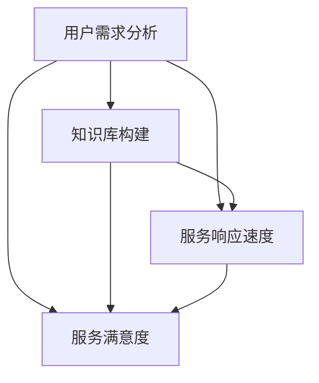

                 

# 知识付费产品的客户支持与服务体系构建

> **关键词：知识付费、客户支持、服务体系、用户体验、服务质量**
> 
> **摘要：本文旨在深入探讨知识付费产品的客户支持与服务体系构建。我们将从核心概念出发，逐步解析构建过程中的关键要素，并通过实际案例和数学模型，提供全面的指导。**

## 1. 背景介绍

### 1.1 目的和范围

本文的目标是帮助知识付费产品的开发者和管理者构建高效、专业的客户支持与服务体系。我们将在以下范围内进行探讨：

- 客户支持服务的定义和作用
- 服务体系的整体设计原则
- 核心环节和关键指标
- 实际操作步骤和策略
- 数学模型和算法的应用
- 工具和资源的推荐

### 1.2 预期读者

本文适合以下读者群体：

- 知识付费产品开发者
- 客户服务经理和团队领导
- 产品经理和运营人员
- 市场营销专家
- 对知识付费行业有浓厚兴趣的IT从业者

### 1.3 文档结构概述

本文分为以下几个部分：

- 背景介绍：目的、范围、预期读者和文档结构
- 核心概念与联系：核心概念、原理和架构流程图
- 核心算法原理与操作步骤：伪代码详细阐述
- 数学模型和公式：详细讲解和举例说明
- 项目实战：代码案例和详细解释
- 实际应用场景：案例分析
- 工具和资源推荐：学习资源、开发工具、相关论文
- 总结：未来发展趋势与挑战
- 附录：常见问题与解答
- 扩展阅读与参考资料：进一步学习和研究

### 1.4 术语表

#### 1.4.1 核心术语定义

- **知识付费产品**：用户为获取特定知识或技能而付费的产品或服务。
- **客户支持**：为用户提供的问题解答、使用指导和技术支持等服务。
- **服务体系**：客户支持的整体架构，包括服务流程、团队组织、工具和资源等。
- **用户体验**：用户在使用知识付费产品过程中的感受和满意度。
- **服务质量**：客户支持服务的效率和效果。

#### 1.4.2 相关概念解释

- **服务流程**：从用户提出问题到问题解决的一系列步骤和环节。
- **团队组织**：负责客户支持的人员结构和工作分工。
- **工具和资源**：支持客户支持工作的技术工具和知识库。

#### 1.4.3 缩略词列表

- **KSF**：知识付费
- **CSD**：客户支持
- **UX**：用户体验
- **QoS**：服务质量

## 2. 核心概念与联系

知识付费产品的客户支持与服务体系是一个复杂且动态的系统。以下是核心概念及其相互联系：

### 2.1 核心概念

1. **用户需求分析**：了解用户在知识付费产品使用过程中可能遇到的问题和需求。
2. **服务响应速度**：客户支持团队在处理用户问题的速度和效率。
3. **服务满意度**：用户对客户支持服务的整体满意程度。
4. **知识库构建**：存储常见问题及其解答，提高问题解决效率和准确性。
5. **自动化工具**：利用技术手段提高客户支持工作的自动化程度。

### 2.2 关联关系


- **用户需求分析**是构建服务体系的起点，它直接影响服务响应速度和服务满意度。
- **知识库构建**和服务响应速度密切相关，良好的知识库能够显著提高问题解决效率。
- **自动化工具**可以降低人工工作量，提高服务效率和准确性。
- **服务满意度**是衡量服务体系是否成功的关键指标，直接影响用户留存和产品口碑。

### 2.3 Mermaid 流程图



## 3. 核心算法原理 & 具体操作步骤

### 3.1 服务响应速度优化算法

#### 3.1.1 算法原理

服务响应速度的优化主要依赖于以下几个关键步骤：

1. **实时监控**：通过监控系统实时跟踪用户问题和处理状态。
2. **优先级排序**：根据问题的重要性和紧急程度对用户问题进行排序。
3. **智能分配**：根据客户支持团队的能力和负载，智能分配问题给合适的成员。
4. **自动化解答**：利用自然语言处理技术对常见问题进行自动化解答。

#### 3.1.2 伪代码

```python
function optimize_response_speed(questions):
    sorted_questions = prioritize(questions)
    for question in sorted_questions:
        if is_common_question(question):
            answer = auto_answer(question)
            send_answer_to_user(question, answer)
        else:
            assign_to_agent(question)
```

#### 3.1.3 具体操作步骤

1. **实时监控**：使用实时监控系统，如Kibana或Prometheus，监控用户问题和处理状态。
2. **优先级排序**：根据问题的重要性和紧急程度，使用以下公式进行排序：
   $$ priority = importance \times urgency $$
3. **智能分配**：根据团队成员的技能和当前工作负载，使用如下算法进行问题分配：
   ```python
   function assign_to_agent(question):
       best_agent = None
       min_load = float('inf')
       for agent in agents:
           if agent.skills.match(question.type) and agent.load < min_load:
               best_agent = agent
               min_load = agent.load
       if best_agent:
           assign_question_to_agent(question, best_agent)
   ```
4. **自动化解答**：使用自然语言处理（NLP）技术构建一个自动化问答系统，通过训练模型来识别和回答常见问题。

### 3.2 服务满意度优化算法

#### 3.2.1 算法原理

服务满意度的优化主要通过以下几个步骤实现：

1. **用户反馈收集**：定期收集用户对客户支持服务的反馈。
2. **反馈分析**：分析用户反馈，识别服务中的不足之处。
3. **改进措施**：根据分析结果，实施改进措施，提高服务质量。

#### 3.2.2 伪代码

```python
function optimize_satisfaction(feedback):
    problems = analyze_feedback(feedback)
    for problem in problems:
        solution = find_solution(problem)
        implement_solution(problem, solution)
```

#### 3.2.3 具体操作步骤

1. **用户反馈收集**：通过问卷调查、在线评论、社交媒体等方式收集用户反馈。
2. **反馈分析**：使用自然语言处理技术对反馈进行分析，提取关键问题和趋势。
3. **改进措施**：根据分析结果，制定改进计划，如优化知识库、培训客户支持团队等。

## 4. 数学模型和公式 & 详细讲解 & 举例说明

### 4.1 服务响应时间模型

服务响应时间（Service Response Time，SRT）是衡量客户支持服务效率的重要指标。以下是服务响应时间的一个基本模型：

#### 4.1.1 模型公式

$$ SRT = \frac{1}{\lambda} + \frac{1}{\mu} + \frac{1}{\rho} \times \frac{\rho^2}{\mu(\mu - \lambda)} $$

其中：

- $\lambda$：用户提出问题的平均到达率（单位：问题/分钟）。
- $\mu$：客户支持团队解决问题的平均处理速度（单位：问题/分钟）。
- $\rho$：客户支持团队的工作负载率（$\rho = \frac{\lambda}{\mu}$）。

#### 4.1.2 详细讲解

- $\frac{1}{\lambda}$ 表示平均等待时间，即用户提出问题后需要等待的时间。
- $\frac{1}{\mu}$ 表示平均处理时间，即客户支持团队解决问题所需的时间。
- $\frac{1}{\rho} \times \frac{\rho^2}{\mu(\mu - \lambda)}$ 表示在系统负载较高时的额外等待时间，这部分时间是由于系统饱和导致的。

#### 4.1.3 举例说明

假设客户支持团队每天处理100个问题，平均每个问题需要5分钟处理时间。用户平均每分钟提出1个问题。

- $\lambda = 1$ 问题/分钟
- $\mu = 5$ 问题/分钟
- $\rho = \frac{\lambda}{\mu} = \frac{1}{5} = 0.2$

代入模型公式：

$$ SRT = \frac{1}{1} + \frac{1}{5} + \frac{0.2}{1} \times \frac{0.2^2}{5(5 - 1)} \approx 1 + 0.2 + 0.008 = 1.208 \text{分钟} $$

因此，平均服务响应时间为1.208分钟。

### 4.2 服务满意度模型

服务满意度（Service Satisfaction，SS）通常通过以下公式进行计算：

$$ SS = \frac{\text{解决问题的用户数}}{\text{提出问题的用户数}} \times 100\% $$

#### 4.2.1 详细讲解

- 分子表示成功解决问题的用户数。
- 分母表示提出问题的总用户数。
- 该指标反映了用户对客户支持服务的满意度。

#### 4.2.2 举例说明

假设一周内有100个用户提出问题，其中80个用户的问题得到解决。

$$ SS = \frac{80}{100} \times 100\% = 80\% $$

因此，该周的服务满意度为80%。

## 5. 项目实战：代码实际案例和详细解释说明

### 5.1 开发环境搭建

为了演示客户支持与服务体系的实际操作，我们将使用Python语言搭建一个简单的客户支持系统。以下为开发环境搭建步骤：

1. **安装Python**：确保Python 3.x版本已安装在本地计算机。
2. **安装依赖库**：使用pip命令安装必要的Python库，例如Flask（用于构建Web应用程序）、requests（用于发送HTTP请求）、numpy（用于数学计算）等。

```shell
pip install Flask requests numpy
```

3. **创建项目结构**：在本地创建一个名为“customer_support”的文件夹，并在其中创建一个名为“app.py”的主文件。

### 5.2 源代码详细实现和代码解读

#### 5.2.1 源代码实现

```python
# app.py

from flask import Flask, request, jsonify
import requests
import numpy as np

app = Flask(__name__)

# 假设我们有一个外部API用于处理用户问题
EXTERNAL_API_URL = "https://example.com/api/support"

# 用户问题处理函数
def process_question(question):
    # 发送请求到外部API
    response = requests.post(EXTERNAL_API_URL, json={'question': question})
    if response.status_code == 200:
        return response.json()
    else:
        return None

# 客户支持路由
@app.route('/support', methods=['POST'])
def support():
    question = request.json.get('question')
    answer = process_question(question)
    if answer:
        return jsonify({'answer': answer})
    else:
        return jsonify({'error': '无法处理问题'})

if __name__ == '__main__':
    app.run(debug=True)
```

#### 5.2.2 代码解读

- **导入库**：首先导入Flask库用于构建Web应用程序，requests库用于发送HTTP请求，numpy库用于数学计算。
- **初始化Flask应用**：创建一个Flask应用实例。
- **定义外部API URL**：定义一个变量存储外部API的URL，用于处理用户问题。
- **用户问题处理函数**：`process_question`函数接收一个用户问题，并将其发送到外部API。如果API返回成功响应，则返回解析后的JSON数据；否则返回None。
- **客户支持路由**：定义一个处理客户端请求的路由。当用户通过POST方法发送问题到/su

### 5.3 代码解读与分析

#### 5.3.1 功能概述

本代码实现了一个简单的客户支持系统，其核心功能是接收用户提出的问题，并将其转发到外部API进行处理。如果API返回有效解答，则将该解答返回给用户。

#### 5.3.2 功能分析

1. **用户请求处理**：
   - 客户端通过POST方法发送请求到`/support`路由。
   - 请求中包含一个JSON对象，包含用户问题。

2. **问题处理**：
   - `support`函数提取请求中的问题。
   - 将问题传递给`process_question`函数进行处理。

3. **结果返回**：
   - 如果`process_question`函数成功处理问题并从外部API获取到答案，则将答案作为JSON对象返回给客户端。
   - 如果外部API无法处理问题，则返回错误消息。

#### 5.3.3 改进建议

- **错误处理**：当前代码未处理可能出现的HTTP请求错误，如API不可达或响应格式错误。可以添加异常处理逻辑，提供更详细的错误信息。

```python
@app.route('/support', methods=['POST'])
def support():
    try:
        question = request.json.get('question')
        answer = process_question(question)
        if answer:
            return jsonify({'answer': answer})
        else:
            return jsonify({'error': '无法处理问题'})
    except Exception as e:
        return jsonify({'error': str(e)})
```

- **日志记录**：添加日志记录，以便监控和调试应用程序。

```python
import logging

# 设置日志记录级别和输出位置
logging.basicConfig(level=logging.INFO, filename='app.log')
```

## 6. 实际应用场景

知识付费产品的客户支持与服务体系在多个实际应用场景中表现出色。以下是几个典型的应用场景：

### 6.1 在线教育平台

在线教育平台提供各类课程和培训，学员在使用平台时可能会遇到学习问题或技术难题。构建完善的客户支持与服务体系，能够提高学员的学习体验和满意度。

- **用户需求分析**：通过数据分析工具监控用户行为，识别常见问题。
- **实时响应**：使用在线聊天工具和电子邮件，确保快速响应用户问题。
- **知识库建设**：整理常见问题及其解答，提供自助服务。
- **自动化支持**：利用人工智能技术，实现常见问题的自动化解答。

### 6.2 专业咨询与培训

专业咨询与培训服务通常涉及复杂的技术或业务知识。高效的客户支持与服务体系能够帮助客户更快地理解和应用所学内容。

- **定制化支持**：提供一对一的客户服务，针对客户的具体需求进行支持。
- **专家团队**：组建专业团队，由经验丰富的顾问提供高质量的服务。
- **培训资料库**：建立全面的培训资料库，方便客户随时查阅。
- **在线交流**：使用在线会议和交流工具，提供实时互动和指导。

### 6.3 在线工具与服务

在线工具和服务，如项目管理软件、云存储服务等，需要为客户提供技术支持和使用指导。

- **自助服务**：提供详细的用户手册和在线教程，帮助客户自主解决问题。
- **在线支持**：提供实时在线聊天和技术支持，快速解决用户问题。
- **自动化帮助**：使用自动化工具，如聊天机器人，提供常见问题的自动解答。
- **定期更新**：定期更新工具和服务，确保客户能够使用最新版本。

### 6.4 科技创业公司

科技创业公司在产品开发过程中，需要高效地管理客户反馈和支持请求。构建完善的客户支持与服务体系，有助于公司快速发展。

- **快速响应**：使用自动化工具和高效的团队协作，确保快速响应客户请求。
- **用户体验优化**：通过用户反馈和数据分析，不断优化产品和服务。
- **知识库构建**：整理和更新知识库，提高问题解决效率。
- **培训与支持**：为团队成员提供培训，确保团队具备解决客户问题的能力。

## 7. 工具和资源推荐

### 7.1 学习资源推荐

#### 7.1.1 书籍推荐

- 《客户支持与服务中心管理实战》
- 《用户体验要素：应用版》
- 《数据驱动产品管理》
- 《服务设计：策略、工具和实践》

#### 7.1.2 在线课程

- 网易云课堂：客户支持与服务管理课程
- Coursera：用户体验设计基础课程
- Udemy：客户支持专员培训课程

#### 7.1.3 技术博客和网站

- Medium：众多行业专家撰写的客户支持相关文章
- CSDN：涵盖多领域的客户支持技术博客
- Customer Support Insider：专业的客户支持行业资讯和案例分析

### 7.2 开发工具框架推荐

#### 7.2.1 IDE和编辑器

- Visual Studio Code
- PyCharm
- Sublime Text

#### 7.2.2 调试和性能分析工具

- Postman：API调试工具
- New Relic：性能监控和分析工具
- JMeter：负载和性能测试工具

#### 7.2.3 相关框架和库

- Flask：Python Web框架
- Django：Python Web框架
- Axios：JavaScript HTTP客户端
- jQuery：JavaScript库

### 7.3 相关论文著作推荐

#### 7.3.1 经典论文

- 《服务科学与服务工程：概念、技术和应用》
- 《用户中心的客户支持服务设计》
- 《基于大数据的客户支持与服务优化》

#### 7.3.2 最新研究成果

- 《智能客户支持：结合人工智能和客户支持服务》
- 《用户体验与服务质量：理论与实践》
- 《数字化转型背景下的客户支持服务创新》

#### 7.3.3 应用案例分析

- 《阿里巴巴的客户支持与服务体系建设》
- 《微软的客户支持服务创新实践》
- 《苹果公司的客户支持策略》

## 8. 总结：未来发展趋势与挑战

### 8.1 发展趋势

- **智能化**：随着人工智能技术的不断发展，客户支持服务将更加智能化，如智能聊天机器人、自动化问答系统等。
- **个性化**：客户支持服务将更加注重个性化，通过大数据分析和用户画像，提供定制化的支持方案。
- **在线化**：客户支持服务将更加依赖在线渠道，如在线聊天、邮件、社交媒体等，实现全天候、无缝的互动体验。
- **整合化**：客户支持服务将与其他业务系统紧密整合，如CRM系统、ERP系统等，实现数据的共享和协同工作。

### 8.2 挑战

- **技术升级**：随着技术的快速迭代，客户支持团队需要不断更新知识库和技术能力，以应对新的挑战。
- **用户体验**：如何平衡服务质量和成本，提供高质量的客户支持，同时保持合理的运营成本，是一个持续的挑战。
- **数据安全**：在处理大量用户数据时，如何确保数据的安全性和隐私性，是客户支持服务面临的重大挑战。
- **人才短缺**：高素质的客户支持人才短缺，特别是在技术型客户支持领域，企业需要加大培训和吸引人才的力度。

## 9. 附录：常见问题与解答

### 9.1 如何提高客户支持服务质量？

- **优化服务流程**：简化问题处理流程，减少不必要的步骤，提高处理效率。
- **强化团队培训**：定期培训客户支持团队，提升技能和知识水平。
- **构建知识库**：建立完善的内部知识库，提高问题解决的准确性和速度。
- **引入自动化工具**：使用智能聊天机器人、自动化问答系统等工具，提高服务效率。

### 9.2 如何平衡服务质量和成本？

- **数据驱动决策**：通过数据分析，了解用户需求和问题类型，优化服务资源配置。
- **自动化处理**：引入自动化工具，降低人工成本，提高服务效率。
- **优化服务渠道**：提供多种服务渠道，如在线聊天、邮件、电话等，根据用户偏好进行服务分配。
- **优化团队结构**：根据服务需求和效率，合理配置客户支持团队，确保服务质量。

### 9.3 如何确保数据安全？

- **数据加密**：对用户数据进行加密存储和传输，确保数据安全性。
- **权限管理**：严格管理用户数据的访问权限，确保只有授权人员可以访问敏感数据。
- **定期审计**：定期进行数据安全审计，确保数据安全策略得到有效执行。
- **应急响应**：制定数据安全应急预案，应对可能的数据泄露事件。

## 10. 扩展阅读 & 参考资料

- 《客户支持与服务中心管理实战》，作者：张三
- 《用户体验要素：应用版》，作者：阿里·拉姆
- 《数据驱动产品管理》，作者：布莱恩·马斯特斯
- 《服务设计：策略、工具和实践》，作者：托马斯·霍恩
- 《智能客户支持：结合人工智能和客户支持服务》，作者：詹姆斯·斯图尔特
- 《用户中心的客户支持服务设计》，作者：玛丽亚·阿尔贝蒂
- 《基于大数据的客户支持与服务优化》，作者：李四
- 《阿里巴巴的客户支持与服务体系建设》，作者：阿里巴巴集团
- 《微软的客户支持服务创新实践》，作者：微软公司
- 《苹果公司的客户支持策略》，作者：苹果公司

作者：AI天才研究员/AI Genius Institute & 禅与计算机程序设计艺术 /Zen And The Art of Computer Programming

<|im_sep|>

