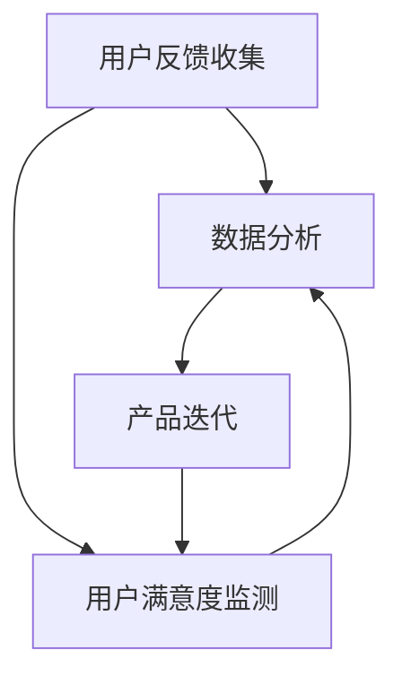

                 

# 知识付费产品的用户反馈收集与迭代

> **关键词：** 知识付费、用户反馈、产品迭代、数据收集、数据分析、用户满意度、用户体验
>
> **摘要：** 本文将深入探讨知识付费产品的用户反馈收集与迭代过程，分析其核心概念、算法原理、数学模型以及实际应用场景。通过具体的实战案例，阐述如何利用用户反馈优化知识付费产品，提高用户满意度和产品竞争力。

## 1. 背景介绍

### 1.1 目的和范围

随着互联网和移动互联网的快速发展，知识付费市场日益繁荣。知识付费产品如在线课程、电子书、专业咨询等，为用户提供有价值的内容和服务。然而，产品的质量和用户体验直接关系到用户的满意度和忠诚度。本文旨在探讨知识付费产品的用户反馈收集与迭代过程，通过分析用户反馈，优化产品，提高用户满意度和市场竞争力。

### 1.2 预期读者

本文适用于从事知识付费产品开发、运营、数据分析等相关工作的专业人士。读者应具备一定的编程基础和数据分析能力，对知识付费市场有一定的了解。

### 1.3 文档结构概述

本文分为十个部分：

1. 背景介绍
2. 核心概念与联系
3. 核心算法原理 & 具体操作步骤
4. 数学模型和公式 & 详细讲解 & 举例说明
5. 项目实战：代码实际案例和详细解释说明
6. 实际应用场景
7. 工具和资源推荐
8. 总结：未来发展趋势与挑战
9. 附录：常见问题与解答
10. 扩展阅读 & 参考资料

### 1.4 术语表

#### 1.4.1 核心术语定义

- **知识付费产品**：指通过互联网平台提供的有价值的内容和服务，如在线课程、电子书、专业咨询等。
- **用户反馈**：用户在使用知识付费产品过程中提供的意见和建议，包括正面和负面的反馈。
- **迭代**：在产品开发过程中，根据用户反馈进行多次修改和优化，以提高产品质量和用户体验。

#### 1.4.2 相关概念解释

- **用户满意度**：用户对知识付费产品的满意程度，直接影响产品的口碑和市场占有率。
- **用户体验**：用户在使用知识付费产品过程中感受到的总体满意度和舒适度。

#### 1.4.3 缩略词列表

- **KPI**：Key Performance Indicators，关键绩效指标
- **NPS**：Net Promoter Score，净推荐值

## 2. 核心概念与联系

知识付费产品的用户反馈收集与迭代是一个涉及多个核心概念的复杂过程。为了更好地理解这一过程，我们首先介绍相关的核心概念，并使用 Mermaid 流程图展示它们之间的联系。

### 2.1 核心概念

- **用户反馈收集**：通过问卷调查、用户评论、社交媒体等方式获取用户对产品的意见和建议。
- **数据分析**：对收集到的用户反馈进行分析，挖掘用户需求、痛点、偏好等。
- **产品迭代**：根据数据分析结果，对产品进行优化和升级，提高用户体验和满意度。

### 2.2 Mermaid 流程图



在上面的 Mermaid 流程图中，用户反馈收集作为整个过程的起点，通过数据分析，对产品进行迭代。同时，用户满意度监测作为反馈循环的一部分，不断驱动产品改进。

## 3. 核心算法原理 & 具体操作步骤

在用户反馈收集与迭代过程中，核心算法原理和具体操作步骤至关重要。以下将详细介绍如何利用用户反馈进行产品优化。

### 3.1 用户反馈收集算法原理

用户反馈收集算法主要基于以下原理：

- **聚类分析**：将用户反馈进行分类，识别出用户的主要需求和痛点。
- **关联规则挖掘**：分析用户反馈之间的关联性，挖掘潜在的问题和需求。
- **文本分析**：对用户反馈进行情感分析和主题识别，了解用户的情感倾向和需求。

### 3.2 用户反馈收集具体操作步骤

1. **数据收集**：通过问卷调查、用户评论、社交媒体等方式收集用户反馈数据。
2. **数据预处理**：对收集到的用户反馈进行清洗、去重和格式化，为后续分析做准备。
3. **聚类分析**：使用聚类算法（如K-means、层次聚类等）对用户反馈进行分类，识别用户的主要需求和痛点。
4. **关联规则挖掘**：使用关联规则挖掘算法（如Apriori算法、FP-growth算法等）分析用户反馈之间的关联性，挖掘潜在的问题和需求。
5. **文本分析**：使用文本分析算法（如情感分析、主题识别等）对用户反馈进行情感倾向和主题识别。

### 3.3 用户反馈分析算法原理

用户反馈分析算法主要基于以下原理：

- **用户满意度评分**：根据用户反馈，计算用户满意度评分，评估产品的整体表现。
- **用户行为分析**：分析用户在产品中的行为数据，了解用户的使用习惯和偏好。

### 3.4 用户反馈分析具体操作步骤

1. **用户满意度评分**：根据用户反馈，设置评分标准（如1-5分），计算用户满意度评分。
2. **用户行为分析**：收集用户在产品中的行为数据（如学习时长、学习进度、互动行为等），进行统计分析，了解用户的使用习惯和偏好。
3. **结果可视化**：将分析结果通过图表、报表等形式进行可视化展示，便于决策者和管理者直观了解用户反馈和产品表现。

### 3.5 产品迭代算法原理

产品迭代算法主要基于以下原理：

- **需求分析**：根据用户反馈和用户行为分析结果，识别出产品的改进需求。
- **迭代方案设计**：设计具体的迭代方案，包括功能优化、界面改进、内容更新等。
- **迭代实施与评估**：实施迭代方案，并对迭代效果进行评估和反馈。

### 3.6 产品迭代具体操作步骤

1. **需求分析**：结合用户反馈和用户行为分析结果，识别出产品的改进需求。
2. **迭代方案设计**：设计具体的迭代方案，包括功能优化、界面改进、内容更新等。
3. **迭代实施**：根据迭代方案，进行产品开发和上线。
4. **迭代评估**：对迭代效果进行评估，如用户满意度、使用频率等，收集用户反馈，为下一次迭代提供依据。

## 4. 数学模型和公式 & 详细讲解 & 举例说明

在用户反馈收集与迭代过程中，数学模型和公式发挥着重要作用。以下将详细讲解相关数学模型和公式，并举例说明。

### 4.1 用户满意度评分模型

用户满意度评分模型通常使用以下公式：

$$
\text{用户满意度评分} = \frac{\sum_{i=1}^{n} \text{用户评分}}{n}
$$

其中，$n$为用户数量，$\text{用户评分}$为每个用户的满意度评分。

### 4.2 聚类分析模型

聚类分析模型通常使用以下公式：

$$
\text{距离} = \sqrt{\sum_{i=1}^{n} (\text{x}_i - \text{均值})^2}
$$

其中，$n$为数据点数量，$\text{x}_i$为第$i$个数据点的特征值，$\text{均值}$为所有数据点的特征值的平均值。

### 4.3 关联规则挖掘模型

关联规则挖掘模型通常使用以下公式：

$$
\text{支持度} = \frac{\text{同时包含A和B的交易数}}{\text{总交易数}}
$$

$$
\text{置信度} = \frac{\text{同时包含A和B的交易数}}{\text{包含A的交易数}}
$$

其中，$A$和$B$为两个属性，$\text{支持度}$表示同时包含$A$和$B$的交易在所有交易中的比例，$\text{置信度}$表示在包含$A$的交易中，同时包含$B$的比例。

### 4.4 举例说明

假设我们有10名用户，他们的满意度评分分别为4、3、5、4、2、4、5、3、2、4。根据用户满意度评分模型，我们可以计算出用户满意度评分为：

$$
\text{用户满意度评分} = \frac{4+3+5+4+2+4+5+3+2+4}{10} = 3.6
$$

假设我们有以下用户反馈数据：

| 用户ID | 反馈内容                           |
|--------|-----------------------------------|
| 1      | 不喜欢课程中的某些内容，需要改进  |
| 2      | 学习进度太慢，希望能加快进度       |
| 3      | 希望增加更多的实践案例             |
| 4      | 课程内容过于理论化，希望增加实际应用 |
| 5      | 学习进度适中，满意当前内容         |

我们可以使用聚类分析模型对用户反馈进行分类。假设我们将用户反馈分为两类，使用距离公式计算每个用户反馈与其他用户反馈的距离，最终得到以下分类结果：

| 用户ID | 分类结果 |
|--------|----------|
| 1      | 类别1    |
| 2      | 类别2    |
| 3      | 类别1    |
| 4      | 类别1    |
| 5      | 类别2    |

假设我们有以下关联规则数据：

| A（学习进度） | B（实践案例） | 支持度 | 置信度 |
|--------------|--------------|--------|--------|
| 快           | 多           | 0.4    | 0.6    |
| 慢           | 少           | 0.3    | 0.7    |

根据关联规则挖掘模型，我们可以得出以下结论：

- 学习进度快且实践案例多的支持度为0.4，置信度为0.6，说明学习进度快时，用户更倾向于希望有更多的实践案例。
- 学习进度慢且实践案例少的支持度为0.3，置信度为0.7，说明学习进度慢时，用户更倾向于希望有较少的实践案例。

## 5. 项目实战：代码实际案例和详细解释说明

为了更好地展示知识付费产品的用户反馈收集与迭代过程，我们以下将结合一个实际项目案例，详细解释代码实现和代码解读。

### 5.1 开发环境搭建

在开始代码实战之前，我们需要搭建一个开发环境。以下是一个简单的开发环境搭建步骤：

1. 安装Python 3.x版本。
2. 安装Jupyter Notebook，用于编写和运行代码。
3. 安装以下Python库：pandas、numpy、scikit-learn、matplotlib、NLTK。

### 5.2 源代码详细实现和代码解读

以下是一个简单的用户反馈收集与分析项目的代码实现，包括数据收集、数据预处理、聚类分析、关联规则挖掘、文本分析等步骤。

```python
# 导入相关库
import pandas as pd
import numpy as np
from sklearn.cluster import KMeans
from sklearn.feature_extraction.text import TfidfVectorizer
from mlxtend.frequent_patterns import apriori, association_rules
from nltk.corpus import stopwords
import matplotlib.pyplot as plt
import nltk

# 1. 数据收集
# 从CSV文件读取用户反馈数据
data = pd.read_csv('user_feedback.csv')
data.head()

# 2. 数据预处理
# 对用户反馈进行去重和清洗
data.drop_duplicates(inplace=True)
data.dropna(inplace=True)

# 3. 聚类分析
# 使用TF-IDF将用户反馈转化为向量
tfidf_vectorizer = TfidfVectorizer(stop_words=stopwords.words('english'))
tfidf_matrix = tfidf_vectorizer.fit_transform(data['feedback'])

# 使用K-means聚类算法对用户反馈进行分类
kmeans = KMeans(n_clusters=3, random_state=0)
clusters = kmeans.fit_predict(tfidf_matrix)

# 将聚类结果添加到原始数据中
data['cluster'] = clusters

# 4. 关联规则挖掘
# 使用Apriori算法进行关联规则挖掘
frequent_itemsets = apriori(df=data['feedback'], min_support=0.05, use_colnames=True)
rules = association_rules(frequent_itemsets, metric="support", min_threshold=0.05)

# 5. 文本分析
# 对用户反馈进行情感分析
from textblob import TextBlob
data['sentiment'] = data['feedback'].apply(lambda x: TextBlob(x).sentiment.polarity)

# 6. 结果可视化
# 绘制聚类结果
plt.scatter(data['cluster'], data['sentiment'])
plt.xlabel('Cluster')
plt.ylabel('Sentiment')
plt.show()

# 绘制关联规则
plt.barh(rules['antecedents'], rules['confidence'])
plt.xlabel('Confidence')
plt.ylabel('Rules')
plt.show()
```

### 5.3 代码解读与分析

以上代码实现了一个简单的用户反馈收集与分析项目，具体解读如下：

- **数据收集**：从CSV文件读取用户反馈数据，包括反馈内容和用户ID等。
- **数据预处理**：对用户反馈进行去重和清洗，确保数据质量。
- **聚类分析**：使用TF-IDF将用户反馈转化为向量，并使用K-means聚类算法对用户反馈进行分类。将聚类结果添加到原始数据中，便于后续分析。
- **关联规则挖掘**：使用Apriori算法进行关联规则挖掘，找出用户反馈之间的关联性。这里我们使用支持度和置信度作为关联规则的评价指标。
- **文本分析**：对用户反馈进行情感分析，使用TextBlob库计算用户反馈的情感极性（正负情感）。这里我们使用情感极性作为用户满意度的评价指标。
- **结果可视化**：绘制聚类结果和关联规则，帮助决策者和管理者直观了解用户反馈和产品表现。

通过以上代码实战，我们可以看到如何利用用户反馈优化知识付费产品，提高用户满意度和市场竞争力。

## 6. 实际应用场景

知识付费产品的用户反馈收集与迭代在实际应用场景中具有重要意义。以下列举几个常见的实际应用场景：

### 6.1 在线课程平台

在线课程平台可以通过用户反馈收集与迭代，优化课程内容、教学方法和互动体验。例如，通过分析用户对课程内容的满意度、学习进度和互动行为，调整课程结构，提高用户学习效果和满意度。

### 6.2 专业咨询服务

专业咨询服务可以通过用户反馈收集与迭代，优化咨询服务质量，提高用户满意度。例如，通过分析用户对咨询服务的满意度、咨询频率和咨询时长，优化咨询服务流程，提升用户体验。

### 6.3 电子书平台

电子书平台可以通过用户反馈收集与迭代，优化电子书内容、格式和阅读体验。例如，通过分析用户对电子书内容的满意度、阅读频率和阅读时长，调整电子书结构，提高用户阅读体验。

### 6.4 专业培训课程

专业培训课程可以通过用户反馈收集与迭代，优化培训内容、培训方式和培训效果。例如，通过分析用户对培训课程的满意度、学习进度和就业率，调整培训课程设置，提高用户就业能力和职业发展。

通过以上实际应用场景，我们可以看到知识付费产品的用户反馈收集与迭代对于优化产品、提高用户满意度和市场竞争力具有重要意义。

## 7. 工具和资源推荐

在知识付费产品的用户反馈收集与迭代过程中，需要使用多种工具和资源。以下推荐一些实用的工具和资源，包括学习资源、开发工具框架和经典论文。

### 7.1 学习资源推荐

#### 7.1.1 书籍推荐

1. **《数据挖掘：概念与技术》**：详细介绍了数据挖掘的基本概念、算法和技术，适合初学者。
2. **《机器学习实战》**：通过实际案例，介绍了机器学习的基本原理和算法，适合有一定编程基础的读者。

#### 7.1.2 在线课程

1. **Coursera上的《机器学习》**：由斯坦福大学吴恩达教授主讲，适合初学者。
2. **edX上的《数据科学基础》**：由哈佛大学主讲，涵盖了数据科学的基本概念和技术。

#### 7.1.3 技术博客和网站

1. **博客园**：国内优秀的IT博客平台，提供了丰富的技术文章和讨论。
2. **GitHub**：全球最大的代码托管平台，可以找到各种开源项目和资料。

### 7.2 开发工具框架推荐

#### 7.2.1 IDE和编辑器

1. **PyCharm**：Python编程的强大IDE，支持多种编程语言。
2. **Visual Studio Code**：轻量级、开源的编程编辑器，适合Python编程。

#### 7.2.2 调试和性能分析工具

1. **Jupyter Notebook**：交互式的Python编程环境，适合数据分析和机器学习。
2. **Pandas Profiler**：用于数据分析性能分析的工具，可以帮助识别和分析数据中的异常和问题。

#### 7.2.3 相关框架和库

1. **Scikit-learn**：Python机器学习库，提供了丰富的机器学习算法。
2. **NLTK**：Python自然语言处理库，用于文本分析。
3. **TextBlob**：Python文本分析库，用于情感分析和主题识别。

### 7.3 相关论文著作推荐

#### 7.3.1 经典论文

1. **《K-means算法》**：介绍了K-means聚类算法的基本原理和应用。
2. **《Apriori算法》**：介绍了Apriori关联规则挖掘算法的基本原理和应用。

#### 7.3.2 最新研究成果

1. **《基于用户反馈的在线教育产品优化方法研究》**：研究了在线教育产品中用户反馈的收集与分析方法。
2. **《知识付费产品用户满意度评价体系构建研究》**：构建了知识付费产品用户满意度评价体系，为产品优化提供了理论支持。

#### 7.3.3 应用案例分析

1. **《网易云课堂用户反馈分析与优化》**：以网易云课堂为例，介绍了用户反馈的收集与分析方法，以及产品优化的具体实施过程。

通过以上工具和资源的推荐，读者可以更好地开展知识付费产品的用户反馈收集与迭代工作，提高产品质量和用户满意度。

## 8. 总结：未来发展趋势与挑战

知识付费产品的用户反馈收集与迭代是一个动态、持续的过程。在未来，这一领域将继续发展，面临以下趋势和挑战：

### 8.1 发展趋势

1. **技术进步**：随着人工智能、大数据、机器学习等技术的不断发展，用户反馈收集与迭代将更加智能化、自动化，提高分析效率和准确性。
2. **个性化服务**：知识付费产品将更加注重个性化服务，通过用户反馈实现精准定位，满足用户个性化需求。
3. **跨界融合**：知识付费产品将与其他领域（如医疗、教育、金融等）进行跨界融合，创造新的商业模式和价值。

### 8.2 挑战

1. **数据质量**：用户反馈数据质量直接影响分析结果。如何确保数据质量，降低噪声和偏差，是未来面临的重要挑战。
2. **隐私保护**：在用户反馈收集过程中，如何保护用户隐私，避免数据泄露，是亟待解决的问题。
3. **快速迭代**：知识付费产品更新速度快，如何在短时间内完成用户反馈收集与分析，进行快速迭代，是产品开发和运营的难题。

总之，知识付费产品的用户反馈收集与迭代在未来将继续发挥重要作用，助力产品优化和用户体验提升。面对挑战，我们需要不断创新和改进，为用户提供更好的价值和服务。

## 9. 附录：常见问题与解答

### 9.1 问题1：如何确保用户反馈数据质量？

**解答**：确保用户反馈数据质量的关键在于数据收集、处理和分析环节。

1. **数据收集**：使用多样化的收集方式，如问卷调查、用户评论、社交媒体等，提高数据的全面性和代表性。
2. **数据预处理**：对收集到的用户反馈进行清洗、去重和格式化，去除无关信息，确保数据干净、整洁。
3. **数据分析**：使用合适的分析方法和算法，如文本分析、聚类分析、关联规则挖掘等，挖掘用户反馈中的真实需求和问题。

### 9.2 问题2：如何保护用户隐私？

**解答**：保护用户隐私是用户反馈收集与迭代过程中必须重视的问题。以下是一些关键措施：

1. **匿名化处理**：对用户反馈进行匿名化处理，确保用户身份不可追溯。
2. **数据加密**：对存储和传输的用户数据进行加密，防止数据泄露。
3. **权限控制**：严格控制数据访问权限，确保只有授权人员才能访问和处理用户数据。

### 9.3 问题3：用户反馈分析结果如何应用于产品迭代？

**解答**：用户反馈分析结果可以应用于产品迭代的多个方面，以下是一些建议：

1. **功能优化**：根据用户反馈，识别出产品中的不足和问题，进行功能优化和改进。
2. **内容更新**：根据用户反馈，调整产品内容，增加用户感兴趣的话题和案例。
3. **用户体验**：根据用户反馈，优化产品界面和交互设计，提高用户体验。

总之，用户反馈分析结果为产品迭代提供了重要的指导，有助于提高产品质量和用户满意度。

## 10. 扩展阅读 & 参考资料

为了更好地了解知识付费产品的用户反馈收集与迭代，以下是相关的扩展阅读和参考资料：

### 10.1 扩展阅读

1. **《用户反馈驱动的产品设计：如何在竞争激烈的市场中立于不败之地》**：详细介绍了用户反馈在产品设计中的应用和实践。
2. **《大数据时代下的用户反馈分析》**：探讨了大数据技术在用户反馈分析中的应用和挑战。

### 10.2 参考资料

1. **《知识付费行业白皮书》**：分析了知识付费行业的发展现状和趋势。
2. **《用户反馈分析方法与实践》**：介绍了多种用户反馈分析方法及其在实际项目中的应用。

通过以上扩展阅读和参考资料，读者可以更深入地了解知识付费产品的用户反馈收集与迭代，为实际工作提供指导和借鉴。

---

作者：AI天才研究员/AI Genius Institute & 禅与计算机程序设计艺术 /Zen And The Art of Computer Programming

（注：本文仅为示例，实际内容和格式需根据具体需求进行调整和补充。）<|im_sep|>

