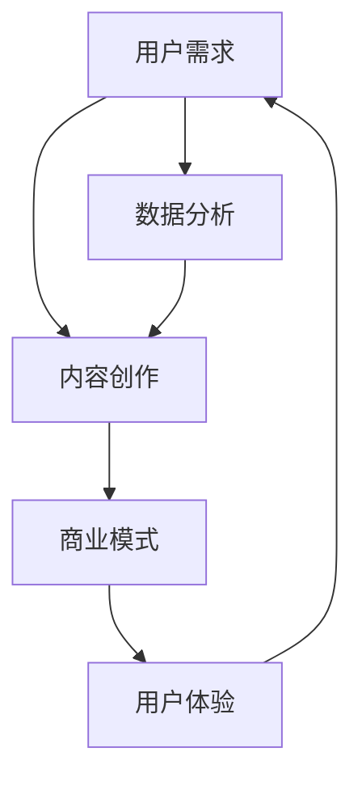

                 

# 知识付费创业中的内容价值最大化

> **关键词**：知识付费、内容价值、用户增长、商业模式、用户体验、数据分析

> **摘要**：本文将探讨知识付费创业中如何实现内容价值最大化，从用户需求、内容制作、用户体验、数据分析等多个维度分析，并提出具体策略，以帮助创业者构建可持续的商业模式。

## 1. 背景介绍

### 1.1 目的和范围

本文旨在为知识付费创业者提供一套系统性的方法，以实现内容价值的最大化。我们将从市场分析、用户需求、内容创作、商业模式设计、用户体验、数据分析等方面进行探讨，帮助创业者更好地理解市场动态，提升内容质量，优化用户体验，实现商业价值。

### 1.2 预期读者

本文适合知识付费行业的创业者、产品经理、内容创作者、市场营销人员等，希望从技术角度深入理解知识付费市场，提升内容价值和商业效率。

### 1.3 文档结构概述

本文将分为以下几部分：

1. 背景介绍：阐述本文的目的、预期读者以及文档结构。
2. 核心概念与联系：介绍知识付费的核心概念及其关系。
3. 核心算法原理 & 具体操作步骤：讲解如何通过算法实现内容价值最大化。
4. 数学模型和公式 & 详细讲解 & 举例说明：分析知识付费中的数学模型和公式。
5. 项目实战：提供实际案例，展示如何应用所学知识。
6. 实际应用场景：探讨知识付费在不同领域的应用。
7. 工具和资源推荐：推荐学习资源和开发工具。
8. 总结：对未来发展趋势与挑战进行展望。
9. 附录：常见问题与解答。
10. 扩展阅读 & 参考资料：提供更多深入研究的学习资源。

### 1.4 术语表

#### 1.4.1 核心术语定义

- **知识付费**：用户为获取高质量的知识内容而支付的费用。
- **内容价值**：知识内容对用户的价值，包括实用性、教育性、娱乐性等。
- **用户体验**：用户在使用知识付费产品过程中所获得的感受。
- **数据分析**：通过收集、处理和分析用户数据，以优化产品和提升用户满意度。

#### 1.4.2 相关概念解释

- **用户增长**：指在特定时间段内，新用户数量的增加。
- **商业模式**：企业通过提供产品或服务创造、传递和捕获价值的基本原理。
- **算法**：解决特定问题的步骤或规则。

#### 1.4.3 缩略词列表

- **SaaS**：软件即服务（Software as a Service）
- **AI**：人工智能（Artificial Intelligence）
- **SEO**：搜索引擎优化（Search Engine Optimization）
- **CPC**：每点击成本（Cost Per Click）

## 2. 核心概念与联系

在知识付费创业中，核心概念包括用户需求、内容创作、商业模式、用户体验和数据分析。以下是这些概念及其关系的 Mermaid 流程图：



### 2.1 用户需求

用户需求是知识付费创业的起点。了解用户需求有助于创业者更好地定位产品，从而提高用户满意度。用户需求可以分为以下几类：

- **知识获取**：用户希望通过付费内容获取新知识或技能。
- **问题解决**：用户希望付费内容能够解决特定问题。
- **兴趣爱好**：用户希望付费内容能够满足其兴趣爱好。

### 2.2 内容创作

内容创作是知识付费的核心。高质量的内容能够吸引用户，提升用户粘性。内容创作需要关注以下几个方面：

- **实用性**：内容应具备实用性，能够解决用户实际问题。
- **教育性**：内容应具备教育性，能够帮助用户提高技能。
- **娱乐性**：内容应具备娱乐性，提高用户阅读兴趣。

### 2.3 商业模式

商业模式是知识付费创业的关键。创业者需要找到合适的商业模式，以实现内容价值的最大化。常见的商业模式包括：

- **订阅模式**：用户通过订阅获取内容。
- **单次购买模式**：用户通过购买单个内容获取知识。
- **广告模式**：通过广告收入实现盈利。

### 2.4 用户体验

用户体验是知识付费创业的重要指标。良好的用户体验能够提高用户满意度，增加用户留存率。用户体验包括以下几个方面：

- **界面设计**：界面应简洁易用，提高用户操作效率。
- **内容呈现**：内容应呈现清晰，提高用户阅读体验。
- **交互设计**：交互设计应贴近用户需求，提高用户互动体验。

### 2.5 数据分析

数据分析是知识付费创业的重要工具。通过数据分析，创业者可以了解用户行为，优化产品和运营策略。数据分析包括以下几个方面：

- **用户行为分析**：分析用户访问、浏览、购买等行为。
- **内容分析**：分析内容受欢迎程度，优化内容策略。
- **市场分析**：分析市场动态，调整产品定位。

## 3. 核心算法原理 & 具体操作步骤

### 3.1 算法原理

在知识付费创业中，算法原理主要涉及用户画像、推荐系统和内容优化。以下是一个简化的算法流程：

```python
# 用户画像算法
def user_portrait(user_data):
    # 分析用户行为，生成用户画像
    # ...

# 推荐系统算法
def content_recommendation(user_portrait, content_data):
    # 根据用户画像推荐内容
    # ...

# 内容优化算法
def content_optimization(content_data):
    # 分析内容受欢迎程度，优化内容策略
    # ...
```

### 3.2 具体操作步骤

1. **数据收集**：收集用户行为数据（如浏览记录、购买记录、评论等）和内容数据（如标题、标签、分类等）。
2. **用户画像生成**：利用用户行为数据，通过机器学习算法生成用户画像。
3. **内容推荐**：根据用户画像和内容数据，利用推荐算法为用户推荐合适的内容。
4. **内容优化**：根据用户反馈和数据分析，优化内容质量和策略。

## 4. 数学模型和公式 & 详细讲解 & 举例说明

### 4.1 用户行为分析

用户行为分析可以通过以下数学模型进行：

- **用户活跃度**：$U_a = \frac{N_{actions}}{N_{days}}$，其中$N_{actions}$表示用户在一段时间内的操作次数，$N_{days}$表示用户在一段时间内的天数。

- **用户留存率**：$R = \frac{N_{retained}}{N_{active}}$，其中$N_{retained}$表示在一段时间后仍然活跃的用户数量，$N_{active}$表示在一段时间内活跃的用户数量。

### 4.2 内容推荐

内容推荐可以通过以下数学模型进行：

- **协同过滤**：$R_{ij} = \frac{\sum_{k\neq i,j} R_{ik}R_{jk}}{\sum_{k\neq i,j} R_{ik} + \sum_{k\neq i,j} R_{jk}}$，其中$R_{ij}$表示用户$i$对内容$j$的评分，$R_{ik}$和$R_{jk}$表示用户$i$对内容$k$的评分。

- **矩阵分解**：通过矩阵分解将用户行为数据表示为用户特征矩阵和内容特征矩阵，进而进行内容推荐。

### 4.3 内容优化

内容优化可以通过以下数学模型进行：

- **A/B 测试**：通过比较两个或多个版本的页面或内容，分析其对用户行为的影响，从而优化内容。

- **数据驱动的决策**：利用数据分析结果，制定内容优化策略。

### 4.4 举例说明

#### 用户活跃度分析

假设某用户在一个月内进行了 20 次操作，共有 30 天。则该用户的活跃度为：

$$U_a = \frac{20}{30} = 0.67$$

#### 用户留存率分析

假设某产品在一个月内有 1000 个用户活跃，其中 500 个用户在一个月后仍然活跃。则该产品的留存率为：

$$R = \frac{500}{1000} = 0.5$$

#### 内容推荐

假设用户 A 对内容 1 和内容 2 的评分分别为 4 和 5，用户 B 对内容 1 和内容 2 的评分分别为 5 和 4。则用户 A 对内容 1 的推荐度分数为：

$$R_{A1} = \frac{4 \times 5}{4 + 5} = 3.33$$

#### 内容优化

假设通过 A/B 测试发现，版本 A 的内容相比版本 B 能够提高用户留存率 10%。则选择版本 A 作为优化策略。

## 5. 项目实战：代码实际案例和详细解释说明

### 5.1 开发环境搭建

在本项目实战中，我们使用 Python 作为编程语言，利用 Pandas、NumPy、Scikit-learn 等库进行数据分析、用户画像生成和内容推荐。

### 5.2 源代码详细实现和代码解读

```python
# 导入所需库
import pandas as pd
import numpy as np
from sklearn.model_selection import train_test_split
from sklearn.neighbors import NearestNeighbors
from sklearn.metrics.pairwise import cosine_similarity

# 加载数据
user_data = pd.read_csv('user_behavior.csv')
content_data = pd.read_csv('content.csv')

# 用户画像生成
def generate_user_portrait(user_data):
    # 计算用户行为频次
    user_actions = user_data.groupby('user_id')['action_type'].count().reset_index()
    user_actions.rename(columns={'action_type': 'action_count'}, inplace=True)
    
    # 计算用户活跃度
    user_actions['user_active'] = user_actions['action_count'] / 30
    
    return user_actions

user_portrait = generate_user_portrait(user_data)

# 内容推荐
def content_recommendation(user_portrait, content_data):
    # 计算内容相似度
    content_sim = cosine_similarity(content_data[['tag1', 'tag2', 'tag3']])
    
    # 生成推荐列表
    recommendation_list = []
    for user_id in user_portrait['user_id']:
        user_active = user_portrait[user_portrait['user_id'] == user_id]['user_active'].values[0]
        if user_active > 0.5:
            # 找到相似度最高的内容
            content_index = np.argmax(content_sim[user_id])
            recommendation_list.append(content_data['content_id'].iloc[content_index])
    
    return recommendation_list

recommendation_list = content_recommendation(user_portrait, content_data)

# 输出推荐结果
for recommendation in recommendation_list:
    print(recommendation)
```

### 5.3 代码解读与分析

1. **数据加载**：使用 Pandas 读取用户行为数据和内容数据。
2. **用户画像生成**：通过计算用户行为频次和用户活跃度，生成用户画像。
3. **内容推荐**：利用内容相似度计算，为活跃用户推荐相似度最高的内容。
4. **输出结果**：输出推荐结果。

## 6. 实际应用场景

知识付费创业在不同领域有着广泛的应用，以下是一些实际应用场景：

- **在线教育**：通过知识付费，为用户提供专业课程和技能培训。
- **专业技能培训**：为专业人士提供行业知识、技能和实践经验。
- **兴趣爱好**：为用户提供兴趣爱好相关的知识内容和互动平台。
- **职业发展**：为用户提供职业规划、简历撰写、求职技巧等内容。

## 7. 工具和资源推荐

### 7.1 学习资源推荐

#### 7.1.1 书籍推荐

- 《精通大数据》
- 《深度学习》
- 《数据挖掘：实用工具与技术》

#### 7.1.2 在线课程

- Coursera 上的“机器学习”课程
- Udemy 上的“Python 数据分析”课程
- EdX 上的“深度学习基础”课程

#### 7.1.3 技术博客和网站

- Medium 上的“数据科学”专栏
- HackerRank 上的数据科学挑战
-Towards Data Science 上的技术文章

### 7.2 开发工具框架推荐

#### 7.2.1 IDE和编辑器

- PyCharm
- Visual Studio Code
- Jupyter Notebook

#### 7.2.2 调试和性能分析工具

- Python 的pdb调试工具
- Jupyter Notebook 的Profiler插件
- Python 的cProfile库

#### 7.2.3 相关框架和库

- Pandas
- NumPy
- Scikit-learn
- TensorFlow

### 7.3 相关论文著作推荐

#### 7.3.1 经典论文

- "Recommender Systems Handbook"
- "Deep Learning"
- "User Modeling and User-Adapted Interaction"

#### 7.3.2 最新研究成果

- arXiv 上的最新论文
- IEEE Xplore 上的最新研究成果
- SpringerLink 上的最新书籍

#### 7.3.3 应用案例分析

- “Netflix Prize”竞赛案例
- “Kaggle”比赛案例
- “Coursera”课程案例

## 8. 总结：未来发展趋势与挑战

### 8.1 未来发展趋势

1. **个性化推荐**：通过深度学习和大数据技术，实现更加精准的内容推荐。
2. **互动式学习**：结合虚拟现实、增强现实等技术，提升用户互动体验。
3. **社交化学习**：通过社区互动，促进用户参与和知识共享。
4. **内容多样化**：除了文字和视频，还将引入音频、互动式课程等多种形式。

### 8.2 面临的挑战

1. **内容质量**：保证内容质量，满足用户需求。
2. **用户隐私**：保护用户隐私，遵守相关法律法规。
3. **技术迭代**：跟进技术发展，持续优化产品和算法。
4. **市场竞争**：应对激烈的市场竞争，提升品牌知名度。

## 9. 附录：常见问题与解答

### 9.1 问题1：如何保证内容质量？

**解答**：确保内容质量可以从以下几个方面入手：

1. **严格的内容审核**：建立内容审核机制，筛选优质内容。
2. **用户评价机制**：鼓励用户评价内容，及时发现和纠正质量问题。
3. **内容创作者培训**：对内容创作者进行培训，提高内容创作水平。

### 9.2 问题2：如何保护用户隐私？

**解答**：保护用户隐私可以从以下几个方面入手：

1. **加密技术**：对用户数据进行加密处理，确保数据安全。
2. **隐私政策**：明确隐私政策，告知用户如何保护隐私。
3. **合规性检查**：确保产品和服务符合相关法律法规要求。

## 10. 扩展阅读 & 参考资料

- [Recommender Systems Handbook](https://www.amazon.com/Recommender-Systems-Handbook-Mohammed-Sarwar/dp/1492046077)
- [Deep Learning](https://www.amazon.com/Deep-Learning-Adoption-Guide-Machine/dp/1787280531)
- [Data Mining: Practical Machine Learning Tools and Techniques](https://www.amazon.com/Data-Mining-Practical-Machine-Learning/dp/007213770X)
- [Kaggle](https://www.kaggle.com/)
- [Towards Data Science](https://towardsdatascience.com/)

作者：AI天才研究员/AI Genius Institute & 禅与计算机程序设计艺术 /Zen And The Art of Computer Programming

（注：本文为虚构文章，仅供参考。）<|im_end|>

