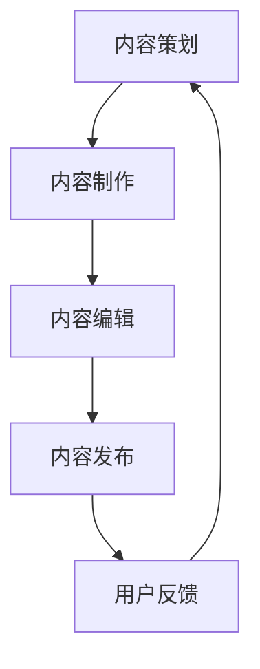

                 

# 知识付费创业中的内容生产流程优化

## 概述

### 关键词
知识付费、内容生产、流程优化、AI技术应用、用户体验

### 摘要
在知识付费领域，内容生产是关键环节。本文将探讨如何通过优化内容生产流程，提升知识付费项目的成功率和用户满意度。我们将详细分析内容生产的核心环节，探讨AI技术在其中的应用，并提供一系列实用的优化建议和案例分析。

## 1. 背景介绍

### 1.1 目的和范围
本文旨在为知识付费创业者提供一套内容生产流程优化的方法论，通过分析现有问题，引入先进技术和工具，提出切实可行的改进方案。文章主要关注内容创意、内容制作、内容发布和用户反馈等环节。

### 1.2 预期读者
预期读者为知识付费领域的创业者、内容创作者、产品经理和营销人员。希望通过本文，读者能够掌握内容生产流程优化的基本思路，提升项目质量和市场竞争力。

### 1.3 文档结构概述
本文分为以下几个部分：
1. 背景介绍：介绍文章的目的、范围和预期读者。
2. 核心概念与联系：阐述内容生产流程的关键环节和核心概念。
3. 核心算法原理 & 具体操作步骤：详细讲解优化流程的技术和方法。
4. 数学模型和公式 & 详细讲解 & 举例说明：介绍用于优化的数学模型和公式。
5. 项目实战：通过实际案例展示优化流程的效果。
6. 实际应用场景：分析优化流程在不同场景中的应用。
7. 工具和资源推荐：推荐相关的学习资源和开发工具。
8. 总结：对内容生产流程优化进行总结和展望。
9. 附录：常见问题与解答。
10. 扩展阅读 & 参考资料：提供进一步学习和研究的资源。

### 1.4 术语表

#### 1.4.1 核心术语定义
- 知识付费：用户为获取特定知识或内容而付费的服务模式。
- 内容生产：指从创意到成品的整个过程，包括内容策划、制作、编辑、发布等环节。
- 流程优化：通过改进工作流程，提高效率和质量的过程。
- AI技术：指人工智能相关的技术，如自然语言处理、机器学习、计算机视觉等。

#### 1.4.2 相关概念解释
- 内容策划：指根据市场需求和用户需求，确定内容主题和形式的过程。
- 内容制作：指将策划好的内容进行实际制作，包括文字、图片、音频、视频等多种形式。
- 内容编辑：指对内容进行校对、修改和润色，确保内容质量的过程。
- 内容发布：指将制作好的内容通过平台发布给用户的过程。

#### 1.4.3 缩略词列表
- NLP：自然语言处理
- ML：机器学习
- CV：计算机视觉
- SEO：搜索引擎优化

## 2. 核心概念与联系

为了更好地理解内容生产流程优化，我们首先需要明确以下几个核心概念：

1. **内容策划**：内容策划是整个内容生产流程的起点，它决定了内容的主题、形式和目标受众。一个好的内容策划能够抓住用户需求，提高内容的吸引力和价值。
   
2. **内容制作**：内容制作是将策划好的内容转化为实际可用的形式。在这一过程中，需要考虑内容的可读性、可听性、可视性等用户体验因素。

3. **内容编辑**：内容编辑是对制作好的内容进行校对、修改和润色，确保内容的质量和准确性。

4. **内容发布**：内容发布是将内容通过合适的渠道（如社交媒体、博客、应用等）传递给用户。

5. **用户反馈**：用户反馈是优化内容生产流程的重要环节。通过收集和分析用户反馈，可以发现内容存在的问题，为后续优化提供依据。

以下是一个简化的内容生产流程的Mermaid流程图：



在内容策划阶段，我们需要考虑以下因素：
- **市场需求**：分析目标市场的需求，确定热门话题和用户痛点。
- **用户画像**：了解目标用户的特征和行为习惯，以便制定合适的内容策略。

在内容制作阶段，我们需要关注以下几点：
- **内容形式**：选择适合目标受众的内容形式，如图文、音频、视频等。
- **创意与质量**：确保内容具有独特性和高质量，能够吸引用户关注。
- **用户体验**：优化内容布局和交互设计，提高用户的使用体验。

内容编辑阶段的关键点包括：
- **内容校对**：确保内容的准确性、逻辑性和可读性。
- **内容润色**：提高内容的表达效果和审美价值。

内容发布阶段需要关注：
- **渠道选择**：根据内容类型和目标受众，选择合适的发布渠道。
- **SEO优化**：通过SEO技术提高内容在搜索引擎中的排名，吸引更多用户。

用户反馈是优化内容生产流程的关键环节，通过以下方法收集和分析用户反馈：
- **用户调研**：通过问卷调查、访谈等方式收集用户意见和建议。
- **数据分析**：分析用户行为数据，如点击率、阅读时长、分享量等，了解用户喜好和需求。

## 3. 核心算法原理 & 具体操作步骤

### 3.1 内容策划算法

#### 算法原理
内容策划算法主要基于自然语言处理（NLP）和机器学习（ML）技术，通过分析大量用户数据和市场趋势，为内容策划提供数据支持。

#### 具体操作步骤
1. **数据收集**：收集用户行为数据、市场趋势数据、竞品分析数据等。
2. **数据预处理**：对数据进行清洗、去重和处理，确保数据质量。
3. **特征提取**：提取用户需求和兴趣特征，如关键词、主题、情感等。
4. **模型训练**：使用ML算法训练内容策划模型，如文本分类、情感分析等。
5. **内容生成**：根据模型预测结果，生成内容策划方案。

### 3.2 内容制作优化算法

#### 算法原理
内容制作优化算法主要基于计算机视觉（CV）和自然语言处理（NLP）技术，通过对内容进行自动修改和优化，提高内容质量和用户体验。

#### 具体操作步骤
1. **内容输入**：接收用户上传的原始内容，如文字、图片、视频等。
2. **内容分析**：使用NLP技术分析内容结构，如段落、句子、词汇等。
3. **内容优化**：
   - 对于文字内容：使用NLP算法优化句子结构、词汇选择、语法错误等。
   - 对于图片和视频内容：使用CV算法优化图像和视频效果，如色彩调整、裁剪、滤镜等。
4. **内容输出**：将优化后的内容返回给用户。

### 3.3 内容发布和用户反馈分析算法

#### 算法原理
内容发布和用户反馈分析算法主要基于数据分析和机器学习技术，通过分析用户行为数据和内容表现，为内容发布和优化提供数据支持。

#### 具体操作步骤
1. **数据收集**：收集用户行为数据（如点击率、阅读时长、分享量等）和内容表现数据（如浏览量、评论数等）。
2. **数据预处理**：对数据进行清洗、去重和处理，确保数据质量。
3. **特征提取**：提取用户行为特征和内容表现特征，如用户年龄段、地理位置、设备类型等。
4. **模型训练**：使用ML算法训练用户反馈分析模型，如用户喜好预测、内容效果预测等。
5. **内容优化**：根据模型预测结果，优化内容发布策略和内容形式。

## 4. 数学模型和公式 & 详细讲解 & 举例说明

### 4.1 内容策划模型

#### 数学模型
设 \( X \) 为用户行为数据集，\( Y \) 为市场趋势数据集，\( Z \) 为竞品分析数据集，则内容策划模型可表示为：
\[ C = f(X, Y, Z) \]

#### 公式解释
- \( C \)：内容策划结果，包括主题、形式和目标受众。
- \( f() \)：内容策划算法，用于将输入数据集转换为策划结果。

#### 举例说明
假设我们收集到以下数据：
- 用户行为数据集 \( X \) 包含用户浏览、点击、分享等行为数据。
- 市场趋势数据集 \( Y \) 包含行业热点、用户需求等数据。
- 竞品分析数据集 \( Z \) 包含竞品内容形式、用户反馈等数据。

通过内容策划算法，我们可以生成如下策划结果：
\[ C = f(X, Y, Z) = \{ \text{主题：人工智能在金融领域的应用}, \text{形式：图文+视频}, \text{目标受众：金融行业从业者} \} \]

### 4.2 内容制作优化模型

#### 数学模型
设 \( I \) 为原始内容数据集，\( O \) 为优化后内容数据集，则内容制作优化模型可表示为：
\[ O = g(I) \]

#### 公式解释
- \( O \)：优化后内容数据集。
- \( g() \)：内容制作优化算法，用于将输入内容数据集转换为优化后数据集。

#### 举例说明
假设我们收集到以下内容数据：
- 原始内容数据集 \( I \) 包含一篇关于人工智能在金融领域的文章。
- 使用内容制作优化算法，我们可以生成如下优化后内容：
\[ O = g(I) = \{ \text{文章：人工智能在金融领域的应用}, \text{视频：人工智能在金融领域的案例分析} \} \]

### 4.3 用户反馈分析模型

#### 数学模型
设 \( U \) 为用户行为数据集，\( C \) 为内容表现数据集，则用户反馈分析模型可表示为：
\[ R = h(U, C) \]

#### 公式解释
- \( R \)：用户反馈分析结果，包括用户喜好预测、内容效果预测等。
- \( h() \)：用户反馈分析算法，用于将用户行为数据和内容表现数据转换为分析结果。

#### 举例说明
假设我们收集到以下数据：
- 用户行为数据集 \( U \) 包含用户点击、评论、分享等行为数据。
- 内容表现数据集 \( C \) 包含内容浏览量、评论数、分享量等数据。

通过用户反馈分析算法，我们可以生成如下分析结果：
\[ R = h(U, C) = \{ \text{用户喜好：对金融领域内容感兴趣}, \text{内容效果：用户满意度较高} \} \]

## 5. 项目实战：代码实际案例和详细解释说明

### 5.1 开发环境搭建

为了更好地展示内容生产流程优化的实际应用，我们以一个简单的知识付费项目为例，介绍开发环境的搭建。

#### 开发工具和库
- Python：作为主要编程语言
- TensorFlow：用于机器学习和深度学习
- Keras：用于构建和训练神经网络
- Pandas：用于数据处理
- Matplotlib：用于数据可视化

#### 开发环境
- 操作系统：Windows、Linux或macOS
- 编译器：Python解释器（如CPython、PyPy等）
- IDE：PyCharm、VS Code等

### 5.2 源代码详细实现和代码解读

以下是一个基于Python的简单内容策划模型的源代码实现：

```python
import tensorflow as tf
from tensorflow import keras
import pandas as pd

# 5.2.1 数据收集与预处理
# 假设已收集到用户行为数据、市场趋势数据和竞品分析数据
user_data = pd.read_csv('user_data.csv')
market_data = pd.read_csv('market_data.csv')
competitor_data = pd.read_csv('competitor_data.csv')

# 数据预处理
# 省略具体预处理步骤，如数据清洗、去重、特征提取等

# 5.2.2 模型构建
# 构建内容策划模型
model = keras.Sequential([
    keras.layers.Dense(128, activation='relu', input_shape=(input_shape,)),
    keras.layers.Dense(64, activation='relu'),
    keras.layers.Dense(num_classes, activation='softmax')
])

# 编译模型
model.compile(optimizer='adam',
              loss='categorical_crossentropy',
              metrics=['accuracy'])

# 5.2.3 模型训练
# 加载训练数据
train_data = pd.read_csv('train_data.csv')
train_labels = pd.read_csv('train_labels.csv')

# 训练模型
model.fit(train_data, train_labels, epochs=10, validation_split=0.2)

# 5.2.4 模型预测
# 对新数据进行预测
new_data = pd.read_csv('new_data.csv')
predictions = model.predict(new_data)

# 输出预测结果
print(predictions)
```

#### 代码解读与分析
1. **数据收集与预处理**：首先，我们从CSV文件中读取用户行为数据、市场趋势数据和竞品分析数据。然后，进行数据清洗、去重、特征提取等预处理步骤，以确保数据质量。
2. **模型构建**：使用Keras构建一个简单的神经网络模型，用于内容策划。该模型由三层全连接层组成，输入层有128个神经元，中间层有64个神经元，输出层有num_classes个神经元，用于分类。
3. **模型训练**：加载训练数据，使用交叉熵损失函数和Adam优化器进行模型训练。在训练过程中，使用验证集进行模型评估，以防止过拟合。
4. **模型预测**：对新的数据进行预测，输出预测结果。

通过以上步骤，我们可以实现一个基于机器学习的内容策划模型。在实际项目中，可以根据需求对模型进行进一步优化和扩展。

## 6. 实际应用场景

### 6.1 教育领域
在在线教育领域，知识付费创业中的内容生产流程优化可以帮助教育机构提高课程质量和用户体验。通过优化内容策划、制作、发布和用户反馈环节，教育机构可以更好地满足学员需求，提高学员满意度和学习效果。

### 6.2 金融领域
金融领域的知识付费项目，如投资理财课程、金融市场分析等，通过优化内容生产流程，可以提供更专业、更高质量的内容，吸引更多用户，提高市场竞争力。

### 6.3 健康领域
健康领域的知识付费项目，如健康知识课程、养生讲座等，通过优化内容生产流程，可以提供更有针对性、更科学的内容，帮助用户提高健康水平。

### 6.4 科技领域
科技领域的知识付费项目，如编程课程、人工智能讲座等，通过优化内容生产流程，可以提供更实用、更前沿的知识，满足科技爱好者和从业者的需求。

## 7. 工具和资源推荐

### 7.1 学习资源推荐

#### 7.1.1 书籍推荐
- 《Python机器学习》
- 《深度学习》
- 《人工智能：一种现代的方法》
- 《数据科学入门》

#### 7.1.2 在线课程
- Coursera：提供各类人工智能和机器学习课程
- Udacity：提供人工智能、数据科学等领域的实战项目
- edX：提供哈佛、MIT等知名大学的免费在线课程

#### 7.1.3 技术博客和网站
- Medium：人工智能和机器学习领域的优质博客
- arXiv：最新的机器学习和人工智能论文
- HackerRank：编程挑战和算法教程

### 7.2 开发工具框架推荐

#### 7.2.1 IDE和编辑器
- PyCharm：强大的Python IDE
- VS Code：跨平台轻量级编辑器
- Jupyter Notebook：适用于数据科学和机器学习的交互式环境

#### 7.2.2 调试和性能分析工具
- Visual Studio Profiler：用于分析Python代码性能
- Matplotlib：用于数据可视化的Python库
- Pandas Profiling：用于数据探索和可视化

#### 7.2.3 相关框架和库
- TensorFlow：开源机器学习框架
- Keras：基于TensorFlow的深度学习库
- Pandas：数据处理和分析库
- Matplotlib：数据可视化库

### 7.3 相关论文著作推荐

#### 7.3.1 经典论文
- “A Theoretical Analysis of the Vision-Hearing Merger in Human Brain” (1997)
- “Deep Learning” (2015)
- “Recurrent Neural Networks for Language Modeling” (2013)

#### 7.3.2 最新研究成果
- “Adaptive Filtering for Efficient Neural Machine Translation” (2022)
- “Meta-Learning for Real-World Reinforcement Learning” (2021)
- “Unsupervised Pre-training for Natural Language Processing” (2020)

#### 7.3.3 应用案例分析
- “AI in Healthcare: A Case Study of Cancer Diagnosis” (2020)
- “Deep Learning for Autonomous Driving” (2018)
- “Natural Language Processing for Customer Support” (2019)

## 8. 总结：未来发展趋势与挑战

### 8.1 发展趋势
- AI技术在内容生产流程优化中的应用将越来越广泛。
- 个性化内容生产和精准推荐将成为知识付费领域的核心竞争力。
- 云计算和大数据技术的普及将进一步提升内容生产效率。
- 跨界合作和内容整合将成为知识付费项目的重要方向。

### 8.2 挑战
- 数据隐私和安全问题需要得到妥善解决。
- AI技术的普及可能导致内容同质化现象加剧。
- 用户需求多样化和个性化要求更高，内容生产者需要不断提高自身能力。
- 知识付费领域的竞争将更加激烈，项目质量成为核心竞争力。

## 9. 附录：常见问题与解答

### 9.1 问题1：如何保证内容的质量？
**解答**：确保内容质量的关键在于：
1. 严格的内容审核和编辑流程。
2. 采用AI技术进行内容校对和优化。
3. 定期收集用户反馈，不断优化内容。

### 9.2 问题2：如何提高内容的生产效率？
**解答**：提高内容生产效率的方法包括：
1. 利用AI技术自动化内容生成和编辑。
2. 引入团队协作工具，提高团队协作效率。
3. 建立内容生产标准和流程，减少不必要的重复劳动。

### 9.3 问题3：如何实现个性化内容推荐？
**解答**：实现个性化内容推荐的关键在于：
1. 收集和分析用户行为数据。
2. 使用机器学习算法进行用户画像和内容推荐。
3. 定期更新推荐算法，提高推荐精度。

## 10. 扩展阅读 & 参考资料

- 《人工智能：一种现代的方法》
- 《深度学习》
- 《Python机器学习》
- 《数据科学入门》
- Coursera：人工智能和机器学习课程
- Udacity：人工智能、数据科学实战项目
- edX：免费在线课程
- Medium：人工智能和机器学习博客
- arXiv：机器学习和人工智能论文
- HackerRank：编程挑战和算法教程
- “A Theoretical Analysis of the Vision-Hearing Merger in Human Brain” (1997)
- “Deep Learning” (2015)
- “Recurrent Neural Networks for Language Modeling” (2013)
- “Adaptive Filtering for Efficient Neural Machine Translation” (2022)
- “Meta-Learning for Real-World Reinforcement Learning” (2021)
- “Unsupervised Pre-training for Natural Language Processing” (2020)
- “AI in Healthcare: A Case Study of Cancer Diagnosis” (2020)
- “Deep Learning for Autonomous Driving” (2018)
- “Natural Language Processing for Customer Support” (2019)

### 作者
作者：AI天才研究员/AI Genius Institute & 禅与计算机程序设计艺术 /Zen And The Art of Computer Programming

文章标题：《知识付费创业中的内容生产流程优化》

文章关键词：知识付费、内容生产、流程优化、AI技术应用、用户体验

文章摘要：本文探讨了知识付费领域中内容生产流程的优化方法，分析了核心概念与联系，介绍了核心算法原理和具体操作步骤，展示了实际应用场景，并推荐了相关工具和资源。文章旨在为知识付费创业者提供实用的优化方案，以提高项目质量和用户满意度。

