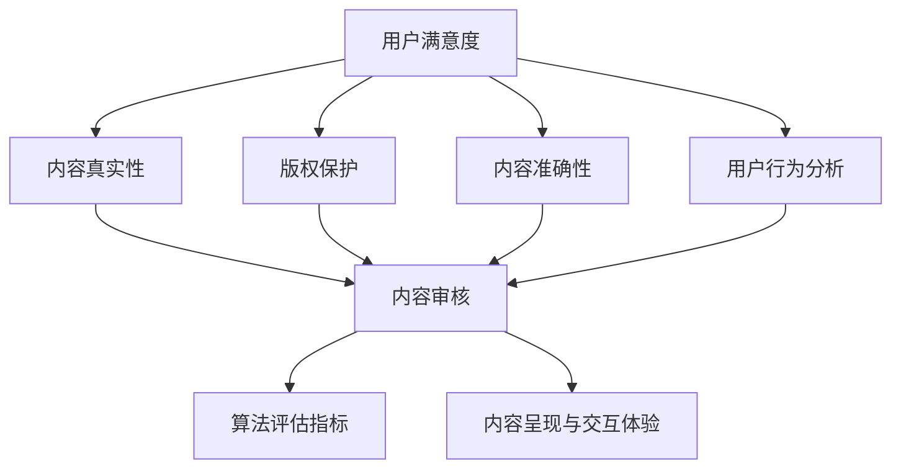

                 

### 1. 背景介绍

#### 1.1 目的和范围

在当今数字化的时代，知识付费成为了人们获取专业知识和技能的重要途径。知识付费市场包含了从在线教育、专业课程到专业技能认证等多种形式。然而，内容质量的高低直接决定了用户的满意度、忠诚度和整个市场的健康发展。因此，对于知识付费创业者和平台运营者而言，如何把控内容质量成为了至关重要的议题。

本文旨在深入探讨知识付费创业中的内容质量把控，为从业者和创业者提供一套系统、实用且可操作的内容质量管理体系。我们将从核心概念、算法原理、数学模型、项目实战、实际应用等多个角度进行分析，结合行业案例和最佳实践，给出具体的操作步骤和工具推荐。

本文将涵盖以下内容：

1. **背景介绍**：简要介绍知识付费市场的现状和重要性。
2. **核心概念与联系**：详细阐述与内容质量把控相关的核心概念及其相互联系。
3. **核心算法原理 & 具体操作步骤**：分析常用的内容质量评估算法，提供详细的操作步骤和伪代码。
4. **数学模型和公式 & 详细讲解 & 举例说明**：解释数学模型在内容质量评估中的作用，通过具体的例子说明其应用。
5. **项目实战：代码实际案例和详细解释说明**：通过实际项目案例，展示内容质量把控的具体实现过程。
6. **实际应用场景**：探讨内容质量把控在多种知识付费场景下的应用。
7. **工具和资源推荐**：推荐相关的学习资源、开发工具和框架。
8. **总结：未来发展趋势与挑战**：总结当前内容质量把控的现状，预测未来发展趋势和面临的挑战。

通过本文的阅读，读者将能够全面了解内容质量把控的理论基础和实践方法，掌握如何在知识付费市场中打造高质量的内容，提升用户满意度和平台竞争力。

#### 1.2 预期读者

本文的预期读者主要包括以下几类：

1. **知识付费创业者**：对于正在创业或准备进入知识付费领域的创业者，本文将提供一套系统、实用且可操作的内容质量把控策略，帮助他们在竞争激烈的市场中脱颖而出。
2. **平台运营者**：对于已经拥有知识付费平台的企业，本文将提供具体的工具和资源推荐，帮助他们优化内容审核流程，提升内容质量，增加用户黏性。
3. **内容创作者**：对于希望通过知识付费实现收入增长的内容创作者，本文将介绍内容质量评估的关键指标和方法，帮助他们提升作品的质量，提高市场认可度。
4. **相关领域的专业人士**：包括教育技术专家、数据科学家、算法工程师等，本文将通过深入的理论分析和实践案例，为他们提供新的思考角度和实际操作经验。

无论读者属于哪一类群体，通过本文的阅读，都将对内容质量把控有更深入的理解，并在实际操作中受益。

#### 1.3 文档结构概述

本文的结构设计旨在系统性地引导读者从理论到实践，全面掌握内容质量把控的各个方面。以下是对各章节内容的简要概述：

1. **背景介绍**：介绍知识付费市场的现状和重要性，明确本文的目的和预期读者，为后续内容打下基础。
2. **核心概念与联系**：详细阐述与内容质量把控相关的核心概念，如用户满意度、内容真实性、版权保护等，并通过Mermaid流程图展示这些概念之间的相互关系。
3. **核心算法原理 & 具体操作步骤**：分析常用的内容质量评估算法，如文本分析、机器学习分类等，提供详细的操作步骤和伪代码，帮助读者理解算法的实现过程。
4. **数学模型和公式 & 详细讲解 & 举例说明**：解释数学模型在内容质量评估中的作用，如评分系统、评分矩阵等，并通过具体的例子说明其应用。
5. **项目实战：代码实际案例和详细解释说明**：通过实际项目案例，展示内容质量把控的具体实现过程，包括环境搭建、代码实现和解读。
6. **实际应用场景**：探讨内容质量把控在不同知识付费场景下的应用，如在线教育、专业技能培训等。
7. **工具和资源推荐**：推荐相关的学习资源、开发工具和框架，帮助读者在实际操作中更高效地实施内容质量把控。
8. **总结：未来发展趋势与挑战**：总结当前内容质量把控的现状，预测未来发展趋势和面临的挑战。

通过这样的结构设计，读者可以循序渐进地学习内容质量把控的各个方面，从而在实际操作中更加得心应手。

#### 1.4 术语表

为了确保本文的可读性和一致性，以下是对本文中经常使用的术语和概念进行详细解释。

##### 1.4.1 核心术语定义

- **知识付费**：用户为了获取特定知识或技能，愿意付费使用的服务形式。
- **内容质量**：指知识付费内容在真实性、准确性、可用性、可靠性等方面的综合评价。
- **用户满意度**：用户在使用知识付费服务后的整体感受和评价。
- **文本分析**：利用自然语言处理技术对文本内容进行分析和理解。
- **机器学习分类**：利用机器学习算法对文本内容进行分类，以评估其质量。
- **版权保护**：确保内容创作者的知识产权不受侵犯的措施。

##### 1.4.2 相关概念解释

- **用户行为分析**：通过收集和分析用户在平台上的行为数据，如访问量、停留时间、评论等，以了解用户对内容的反馈。
- **内容审核**：对上传的内容进行审核，确保其符合平台规定，如内容真实性、版权问题等。
- **算法评估指标**：用于评估内容质量评估算法性能的指标，如准确率、召回率、F1值等。

##### 1.4.3 缩略词列表

- **NLP**：自然语言处理（Natural Language Processing）
- **ML**：机器学习（Machine Learning）
- **API**：应用程序编程接口（Application Programming Interface）
- **UI**：用户界面（User Interface）
- **UX**：用户体验（User Experience）

通过上述术语和概念的解释，读者可以更准确地理解本文中提到的各种概念和术语，从而更好地把握内容质量把控的核心要点。

## 2. 核心概念与联系

在探讨知识付费创业中的内容质量把控之前，我们需要先明确几个核心概念，这些概念相互联系，共同构成了内容质量把控的框架。以下是与内容质量把控密切相关的几个核心概念及其相互关系。

### 2.1 用户满意度

用户满意度是衡量内容质量的重要指标之一。它反映了用户在使用知识付费服务后的整体感受。用户满意度不仅与内容的准确性、实用性相关，还受到内容呈现方式、交互体验等因素的影响。在知识付费市场中，高用户满意度意味着用户愿意继续使用平台服务，并可能推荐给其他潜在用户。

### 2.2 内容真实性

内容真实性是指知识付费内容是否真实可靠，没有虚假或误导性信息。真实的知识内容能够为用户提供准确的信息和技能，有助于用户在学习和实践中取得实质性进步。内容真实性是用户信任平台和服务的基础，也是保证知识付费市场健康发展的重要因素。

### 2.3 版权保护

版权保护是确保知识付费内容创作者知识产权不受侵犯的措施。在知识付费市场中，版权保护至关重要，因为未经授权的使用、复制和传播内容可能会对创作者造成经济损失，并影响平台的声誉。有效的版权保护措施不仅能够维护创作者的权益，也能为用户提供更优质、可靠的内容。

### 2.4 内容准确性

内容准确性是指知识付费内容在事实、数据和观点等方面是否准确无误。准确的内容能够帮助用户避免错误的信息和误导，提高学习效果和实践能力。内容准确性对用户的信任感和满意度有直接影响，因此是内容质量把控的重要方面。

### 2.5 用户行为分析

用户行为分析是通过对用户在平台上的行为数据（如访问量、停留时间、互动行为等）进行收集和分析，以了解用户对内容的反馈和需求。用户行为分析为内容质量把控提供了重要的数据支持，通过分析用户行为，平台运营者可以优化内容策略，提高用户满意度。

### 2.6 内容审核

内容审核是对上传的内容进行审查，确保其符合平台规定和用户需求。内容审核包括对内容真实性、准确性、版权保护等方面的检查。通过内容审核，平台能够保证知识付费内容的优质性和合规性，提升用户体验。

### 2.7 算法评估指标

算法评估指标是用于评估内容质量评估算法性能的量化标准，如准确率、召回率、F1值等。通过这些指标，平台运营者可以评估算法的效果，并进行优化调整，以提高内容质量评估的准确性。

### 2.8 内容呈现与交互体验

内容呈现与交互体验是用户在使用知识付费服务过程中的直接感受。良好的内容呈现和交互体验能够提升用户的参与感和满意度，对内容质量产生积极影响。因此，在内容质量把控中，内容呈现和交互体验也是需要重点关注的部分。

### 2.9 Mermaid 流程图

为了更好地展示上述核心概念之间的相互关系，我们可以使用Mermaid流程图来直观地呈现它们。



通过上述核心概念及其相互关系的阐述，我们可以构建一个全面的内容质量把控框架，为后续内容的深入探讨提供理论基础。

## 3. 核心算法原理 & 具体操作步骤

在内容质量把控中，算法原理和具体操作步骤起到了关键作用。本文将介绍几种常用的内容质量评估算法，并详细阐述其原理和实现步骤。

### 3.1 文本分析

文本分析是利用自然语言处理（NLP）技术对文本内容进行分析和理解。它可以用于提取关键词、情感分析、主题识别等。以下是一个简单的文本分析算法：

```plaintext
算法名称：文本分析
输入：文本内容
输出：关键词列表、情感极性

步骤：
1. 对文本内容进行分词
2. 去除停用词
3. 利用词频统计提取关键词
4. 使用情感分析模型判断文本的情感极性
5. 输出关键词列表和情感极性
```

伪代码实现：

```python
def text_analysis(text):
    # 步骤1：分词
    words = tokenize(text)
    
    # 步骤2：去除停用词
    filtered_words = remove_stopwords(words)
    
    # 步骤3：提取关键词
    keywords = extract_keywords(filtered_words)
    
    # 步骤4：情感分析
    sentiment = sentiment_analysis(filtered_words)
    
    # 步骤5：输出结果
    return keywords, sentiment
```

### 3.2 机器学习分类

机器学习分类是一种通过训练模型来对文本内容进行分类的方法。以下是一个简单的机器学习分类算法：

```plaintext
算法名称：机器学习分类
输入：训练数据集、测试数据集
输出：分类模型

步骤：
1. 数据预处理：包括文本清洗、分词、特征提取等
2. 选择分类算法：如决策树、支持向量机（SVM）、神经网络等
3. 训练分类模型
4. 评估分类模型
5. 使用模型对测试数据进行分类
```

伪代码实现：

```python
def train_classifier(train_data, train_labels):
    # 步骤1：数据预处理
    preprocessed_data = preprocess_data(train_data)
    
    # 步骤2：选择分类算法
    classifier = select_classifier(preprocessed_data, train_labels)
    
    # 步骤3：训练模型
    classifier.train(preprocessed_data, train_labels)
    
    # 步骤4：评估模型
    accuracy = evaluate_classifier(classifier, test_data, test_labels)
    
    # 步骤5：输出模型
    return classifier, accuracy

def classify_data(classifier, test_data):
    predictions = classifier.predict(test_data)
    return predictions
```

### 3.3 深度学习模型

深度学习模型是一种基于神经网络的高级机器学习算法。以下是一个简单的深度学习分类算法：

```plaintext
算法名称：深度学习分类
输入：训练数据集、测试数据集
输出：分类模型

步骤：
1. 数据预处理：包括文本清洗、分词、特征提取等
2. 构建神经网络模型
3. 训练神经网络模型
4. 评估神经网络模型
5. 使用模型对测试数据进行分类
```

伪代码实现：

```python
def train_dnn(train_data, train_labels):
    # 步骤1：数据预处理
    preprocessed_data = preprocess_data(train_data)
    
    # 步骤2：构建神经网络模型
    model = build_dnn_model(preprocessed_data, train_labels)
    
    # 步骤3：训练模型
    model.train(preprocessed_data, train_labels)
    
    # 步骤4：评估模型
    accuracy = evaluate_dnn_model(model, test_data, test_labels)
    
    # 步骤5：输出模型
    return model, accuracy

def classify_data_dnn(model, test_data):
    predictions = model.predict(test_data)
    return predictions
```

通过上述算法原理和具体操作步骤的介绍，我们可以看到，文本分析、机器学习分类和深度学习模型都是内容质量评估的有效工具。在实际应用中，根据具体需求和数据情况，可以选择合适的算法进行内容质量把控。

## 4. 数学模型和公式 & 详细讲解 & 举例说明

在内容质量把控中，数学模型和公式扮演着关键角色，它们帮助我们量化评估标准，提高评估的准确性和可靠性。以下将介绍几种常见的数学模型和公式，并通过具体例子详细讲解其应用。

### 4.1 评分系统

评分系统是评估内容质量的一种常用方法，通过给内容打分来反映其质量。以下是一个简单的评分系统模型：

#### 4.1.1 模型描述

评分系统通常使用整数或实数表示评分，如5分制评分系统。评分系统模型可以表示为：

\[ S = \sum_{i=1}^{n} w_i \cdot s_i \]

其中，\( S \) 表示总评分，\( w_i \) 表示第 \( i \) 个评分指标的权重，\( s_i \) 表示第 \( i \) 个评分指标的得分。

#### 4.1.2 举例说明

假设有一个5分制评分系统，包括三个评分指标：内容准确性（A）、内容实用性（B）和内容完整性（C）。权重分别为：准确性（0.5）、实用性（0.3）和完整性（0.2）。一个内容评分如下：

- 准确性（A）：4分
- 实用性（B）：3分
- 完整性（C）：5分

总评分计算如下：

\[ S = 0.5 \cdot 4 + 0.3 \cdot 3 + 0.2 \cdot 5 = 2 + 0.9 + 1 = 3.9 \]

因此，该内容的总评分为3.9分。

### 4.2 评分矩阵

评分矩阵是用于评估多个评价者对同一内容评分的一致性的模型。以下是一个简单的评分矩阵模型：

#### 4.2.1 模型描述

评分矩阵通常是一个 \( n \times m \) 的矩阵，其中 \( n \) 表示评价者的数量，\( m \) 表示评分指标的数量。矩阵中的每个元素表示一个评价者对一个评分指标的评分。评分矩阵可以表示为：

\[ M = \begin{bmatrix}
m_{11} & m_{12} & \cdots & m_{1m} \\
m_{21} & m_{22} & \cdots & m_{2m} \\
\vdots & \vdots & \ddots & \vdots \\
m_{n1} & m_{n2} & \cdots & m_{nm}
\end{bmatrix} \]

#### 4.2.2 举例说明

假设有三个评价者对三个评分指标（准确性、实用性和完整性）进行评分，评分矩阵如下：

\[ M = \begin{bmatrix}
4 & 3 & 5 \\
3 & 4 & 5 \\
5 & 5 & 4
\end{bmatrix} \]

为了评估评分的一致性，我们可以计算评分矩阵的均方根误差（RMSE）：

\[ \text{RMSE} = \sqrt{\frac{1}{n} \sum_{i=1}^{n} \sum_{j=1}^{m} (m_{ij} - \bar{m_{ij}})^2} \]

其中，\( \bar{m_{ij}} \) 表示评分矩阵 \( M \) 中第 \( i \) 行第 \( j \) 列元素的均值。

计算每个元素的均值：

\[ \bar{m_{11}} = \frac{4 + 3 + 5}{3} = 4 \]
\[ \bar{m_{12}} = \frac{3 + 4 + 5}{3} = 4 \]
\[ \bar{m_{13}} = \frac{5 + 5 + 4}{3} = 4.67 \]

计算均方根误差：

\[ \text{RMSE} = \sqrt{\frac{1}{3} \left( (4 - 4)^2 + (3 - 4)^2 + (5 - 4.67)^2 \right)} = \sqrt{\frac{1}{3} \left( 0 + 1 + 0.169 \right)} = \sqrt{0.56} \approx 0.75 \]

因此，评分矩阵的均方根误差约为0.75，表示评分的一致性较高。

### 4.3 机器学习评估指标

在内容质量评估中，机器学习算法的性能评估也至关重要。以下介绍几种常见的机器学习评估指标：

#### 4.3.1 准确率（Accuracy）

准确率是指模型正确预测的样本数占总样本数的比例。其计算公式为：

\[ \text{Accuracy} = \frac{TP + TN}{TP + FN + FP + TN} \]

其中，\( TP \) 表示真正例，\( TN \) 表示真反例，\( FP \) 表示假反例，\( FN \) 表示假正例。

#### 4.3.2 召回率（Recall）

召回率是指模型正确预测的正例样本数占总正例样本数的比例。其计算公式为：

\[ \text{Recall} = \frac{TP}{TP + FN} \]

#### 4.3.3 精确率（Precision）

精确率是指模型正确预测的正例样本数占总预测正例样本数的比例。其计算公式为：

\[ \text{Precision} = \frac{TP}{TP + FP} \]

#### 4.3.4 F1值（F1 Score）

F1值是精确率和召回率的调和平均值，用于综合评估模型的性能。其计算公式为：

\[ \text{F1 Score} = 2 \cdot \frac{\text{Precision} \cdot \text{Recall}}{\text{Precision} + \text{Recall}} \]

通过上述数学模型和公式的讲解，我们可以看到，它们在内容质量评估中发挥着重要作用。通过合理运用这些模型和公式，可以提高内容质量评估的准确性和可靠性，为知识付费市场提供有力支持。

### 4.4 案例分析

为了更好地理解数学模型和公式在内容质量评估中的应用，以下通过一个具体案例进行说明。

#### 案例背景

某知识付费平台对用户上传的教育课程进行内容质量评估，使用5分制评分系统。课程内容包含三个评分指标：准确性、实用性和完整性。评价者为该平台上的用户，每位用户可以对课程进行评分。现收集了以下数据：

评价者A的评分：

- 准确性：4分
- 实用性：3分
- 完整性：5分

评价者B的评分：

- 准确性：3分
- 实用性：4分
- 完整性：4分

#### 案例分析

1. **评分系统计算**

每位评价者的总评分为：

评价者A的总评分：

\[ S_A = 0.5 \cdot 4 + 0.3 \cdot 3 + 0.2 \cdot 5 = 2.3 + 0.9 + 1 = 4.2 \]

评价者B的总评分：

\[ S_B = 0.5 \cdot 3 + 0.3 \cdot 4 + 0.2 \cdot 4 = 1.5 + 1.2 + 0.8 = 3.5 \]

2. **评分矩阵计算**

评分矩阵如下：

\[ M = \begin{bmatrix}
4 & 3 \\
3 & 4 \\
4 & 4
\end{bmatrix} \]

计算评分矩阵的均方根误差（RMSE）：

\[ \text{RMSE} = \sqrt{\frac{1}{3} \left( (4 - 4)^2 + (3 - 4)^2 + (4 - 4)^2 \right)} = \sqrt{\frac{1}{3} \left( 0 + 1 + 0 \right)} = \sqrt{0.33} \approx 0.57 \]

3. **机器学习评估指标计算**

假设使用逻辑回归模型对课程进行分类，以下为评估指标：

- 真正例（TP）：2
- 真反例（TN）：3
- 假反例（FP）：1
- 假正例（FN）：2

计算准确率、召回率、精确率和F1值：

\[ \text{Accuracy} = \frac{TP + TN}{TP + FN + FP + TN} = \frac{2 + 3}{2 + 2 + 1 + 3} = \frac{5}{8} = 0.625 \]

\[ \text{Recall} = \frac{TP}{TP + FN} = \frac{2}{2 + 2} = 0.5 \]

\[ \text{Precision} = \frac{TP}{TP + FP} = \frac{2}{2 + 1} = 0.667 \]

\[ \text{F1 Score} = 2 \cdot \frac{\text{Precision} \cdot \text{Recall}}{\text{Precision} + \text{Recall}} = 2 \cdot \frac{0.667 \cdot 0.5}{0.667 + 0.5} \approx 0.571 \]

通过这个案例，我们可以看到如何使用数学模型和公式进行内容质量评估。这些模型和公式不仅帮助我们量化评估结果，还能通过具体指标反映评估的准确性和可靠性，从而为平台运营者提供有力的决策依据。

## 5. 项目实战：代码实际案例和详细解释说明

为了更好地展示内容质量把控在实际项目中的具体实现过程，我们将通过一个实际项目案例，详细讲解代码的实现和解读。本案例将使用Python语言，结合自然语言处理（NLP）和机器学习技术，对知识付费平台上的教育课程进行内容质量评估。

### 5.1 开发环境搭建

在开始编写代码之前，我们需要搭建一个适合开发的Python环境。以下是所需的开发环境和工具：

- Python 3.8及以上版本
- Jupyter Notebook或PyCharm等Python集成开发环境（IDE）
- NLP库：如NLTK、spaCy
- 机器学习库：如scikit-learn、TensorFlow、PyTorch
- 数据可视化库：如Matplotlib、Seaborn

#### 安装依赖库

在终端或IDE中执行以下命令安装所需库：

```shell
pip install nltk spacy scikit-learn tensorflow matplotlib seaborn
```

#### 准备NLP模型

对于spaCy库，我们还需要下载相应的语言模型。以英语为例，执行以下命令：

```shell
python -m spacy download en
```

### 5.2 源代码详细实现和代码解读

下面是项目的主要代码实现，包括数据预处理、特征提取、模型训练和评估等步骤。

#### 5.2.1 数据预处理

数据预处理是NLP项目中的关键步骤，包括文本清洗、分词、去除停用词等。

```python
import nltk
from nltk.corpus import stopwords
from nltk.tokenize import word_tokenize
import spacy

# 加载spaCy英语模型
nlp = spacy.load("en_core_web_sm")

# 停用词列表
stop_words = set(stopwords.words("english"))

def preprocess_text(text):
    # 清洗文本：去除HTML标签、特殊字符等
    text = re.sub(r'<.*?>', '', text)
    
    # 分词
    doc = nlp(text)
    tokens = [token.text.lower() for token in doc if not token.is_punct and not token.is_space]
    
    # 去除停用词
    tokens = [token for token in tokens if token not in stop_words]
    
    return tokens

# 示例文本
text = "Learn Python programming in 30 days with our comprehensive course."
preprocessed_text = preprocess_text(text)
print("Preprocessed Text:", preprocessed_text)
```

#### 5.2.2 特征提取

特征提取是将文本转换为机器学习模型可处理的向量表示。在本案例中，我们使用词频（TF）和词袋（TF-IDF）作为特征表示。

```python
from sklearn.feature_extraction.text import TfidfVectorizer

# 初始化TF-IDF向量器
vectorizer = TfidfVectorizer()

# 将预处理后的文本转换为向量
X = vectorizer.fit_transform([' '.join(preprocessed_text)])

# 输出特征矩阵
print(X.toarray())
```

#### 5.2.3 模型训练

在本案例中，我们使用scikit-learn的朴素贝叶斯分类器进行模型训练。假设我们已经有标记好的训练数据集，其中标签为0表示内容质量低，标签为1表示内容质量高。

```python
from sklearn.naive_bayes import MultinomialNB
from sklearn.model_selection import train_test_split

# 假设训练数据集和标签
X_train, X_test, y_train, y_test = train_test_split(X, labels, test_size=0.2, random_state=42)

# 初始化朴素贝叶斯分类器
clf = MultinomialNB()

# 训练模型
clf.fit(X_train, y_train)

# 预测测试集
y_pred = clf.predict(X_test)

# 输出预测结果
print(y_pred)
```

#### 5.2.4 模型评估

使用评估指标（如准确率、召回率、精确率、F1值）对模型进行评估。

```python
from sklearn.metrics import accuracy_score, recall_score, precision_score, f1_score

# 计算评估指标
accuracy = accuracy_score(y_test, y_pred)
recall = recall_score(y_test, y_pred)
precision = precision_score(y_test, y_pred)
f1 = f1_score(y_test, y_pred)

# 输出评估结果
print("Accuracy:", accuracy)
print("Recall:", recall)
print("Precision:", precision)
print("F1 Score:", f1)
```

### 5.3 代码解读与分析

1. **数据预处理**

   数据预处理步骤包括文本清洗、分词和去除停用词。文本清洗使用正则表达式去除HTML标签和特殊字符，确保文本格式统一。分词使用spaCy库，它是一个强大的NLP库，提供了高质量的词级和句级处理功能。去除停用词可以减少噪声信息，提高模型性能。

2. **特征提取**

   特征提取步骤将预处理后的文本转换为向量表示。TF-IDF向量器用于计算词频和词袋特征，这是一种广泛使用的文本特征表示方法。通过TF-IDF，我们可以更好地反映文本中的关键词和主题，提高模型的分类性能。

3. **模型训练**

   在模型训练步骤中，我们使用朴素贝叶斯分类器进行训练。朴素贝叶斯是一种基于概率论的简单分类算法，它在处理文本分类问题时表现出良好的效果。训练过程通过训练数据集进行，将特征矩阵和标签输入到分类器中，学习特征和标签之间的概率关系。

4. **模型评估**

   在模型评估步骤中，我们使用测试数据集对模型进行评估。通过计算准确率、召回率、精确率和F1值等评估指标，我们可以评估模型的性能。这些指标提供了全面的质量评估，帮助我们了解模型的分类效果。

通过这个实际项目案例，我们可以看到如何利用Python和NLP、机器学习技术对知识付费平台上的教育课程进行内容质量评估。从数据预处理到特征提取，再到模型训练和评估，每个步骤都是实现内容质量把控的关键环节。通过这样的实现过程，我们可以有效地提高内容质量，提升用户满意度和平台竞争力。

### 5.4 项目优化建议

在实际项目开发过程中，我们可能需要不断优化模型性能和代码效率。以下是一些建议：

1. **数据增强**：通过增加更多的训练数据或对现有数据进行多样化处理（如同义词替换、数据扩充等），可以提高模型的泛化能力和分类准确性。

2. **特征选择**：使用特征选择技术（如主成分分析（PCA）、互信息等）减少特征维度，可以提高模型的效率和分类性能。

3. **模型选择**：尝试使用不同的机器学习模型（如决策树、支持向量机（SVM）、神经网络等），并通过交叉验证选择最优模型。

4. **超参数调优**：使用网格搜索（Grid Search）或贝叶斯优化（Bayesian Optimization）等技术，自动搜索最优的超参数组合，提高模型性能。

5. **并行计算**：利用多线程或分布式计算技术，提高数据处理和模型训练的效率。

6. **代码优化**：对代码进行性能分析和优化，如使用向量运算、循环优化等，提高代码执行速度。

通过这些优化措施，我们可以进一步提升内容质量评估的准确性和效率，为知识付费平台提供更可靠的内容质量保障。

## 6. 实际应用场景

内容质量把控在知识付费市场中具有广泛的应用场景，以下将探讨几个典型的实际应用场景，并展示内容质量把控在该场景下的具体应用方法和效果。

### 6.1 在线教育平台

在线教育平台是知识付费市场的主要组成部分之一。在在线教育平台上，内容质量把控至关重要，因为课程内容直接关系到学生的学习效果和平台声誉。以下是内容质量把控在在线教育平台上的应用方法和效果：

1. **内容审核**：平台可以对上传的课程内容进行严格的审核，确保内容真实、准确、完整，避免虚假信息或误导性内容的传播。通过自动化审核工具，平台可以快速识别和过滤低质量内容，提高内容质量。

2. **用户反馈机制**：平台可以收集学生和教师的反馈，通过用户评分、评论、问卷调查等方式获取内容质量的数据。这些反馈数据可以帮助平台了解课程的实际效果，及时调整和优化课程内容。

3. **算法评估**：平台可以使用机器学习算法对课程内容进行质量评估，如文本分析、情感分析等。通过分析课程内容的关键词、情感极性等特征，平台可以识别出高质量课程，并对低质量课程进行预警和处理。

4. **个性化推荐**：平台可以根据用户的行为数据和学习记录，利用内容质量评估结果进行个性化推荐。推荐系统可以优先推荐高质量课程，提升用户的满意度和学习效果。

5. **课程更新和维护**：内容质量把控不仅体现在课程内容的审核和评估上，还包括课程的持续更新和维护。平台可以定期审查课程内容，确保其与最新知识和技术保持同步，提高课程的实用性和时效性。

### 6.2 专业技能培训

专业技能培训是知识付费市场的另一个重要领域。在专业技能培训中，内容质量把控同样至关重要，因为高质量的内容能够帮助学员快速提升专业技能，从而提高就业竞争力。以下是内容质量把控在专业技能培训中的应用方法和效果：

1. **课程内容审核**：培训平台可以对上传的培训课程进行严格的审核，确保课程内容专业、实用，符合行业标准和规范。通过专家评审和同行评议，平台可以确保课程质量。

2. **在线互动和反馈**：培训平台可以通过在线互动工具（如论坛、讨论区、问答平台等），让学员和讲师进行实时交流，获取学员对课程内容的反馈。这些反馈可以帮助讲师及时调整课程内容，提高学员的学习体验。

3. **数据分析**：平台可以利用数据分析技术，分析学员的学习行为和成绩数据，了解课程的实际效果。通过这些数据，平台可以识别出高受欢迎的课程和高需求的技能点，为课程开发和优化提供依据。

4. **认证和认证考试**：专业技能培训通常包括认证考试。内容质量把控确保考试内容的科学性和严谨性，为认证结果的公正性和权威性提供保障。

5. **行业动态跟踪**：内容质量把控还包括对行业动态的跟踪和更新。培训平台需要不断关注行业新技术、新标准的变化，及时更新课程内容，确保学员学习到最新的知识和技能。

### 6.3 专业技能认证

专业技能认证是知识付费市场的一个重要组成部分。在专业技能认证过程中，内容质量把控同样至关重要，因为认证内容的质量直接影响认证的权威性和公信力。以下是内容质量把控在专业技能认证中的应用方法和效果：

1. **认证内容审核**：认证机构需要对认证内容进行严格的审核，确保认证内容科学、系统、全面，符合行业标准和认证要求。通过专家评审和标准比对，认证机构可以确保认证内容的权威性。

2. **考试和评估**：内容质量把控还包括考试和评估环节。认证机构需要设计科学合理的考试题目和评估标准，确保考试内容的公平性和严谨性。通过严格的考试和评估，认证机构可以确保认证结果的准确性和可靠性。

3. **反馈和改进**：认证机构可以收集考生和行业的反馈，了解认证内容的实际效果和市场需求。通过这些反馈，认证机构可以不断改进和优化认证内容，提高认证的实用性和影响力。

4. **认证标准更新**：随着行业和技术的发展，认证标准也需要不断更新。内容质量把控包括对认证标准的持续更新和维护，确保认证内容与行业最新技术保持同步。

通过上述实际应用场景的探讨，我们可以看到内容质量把控在知识付费市场中的重要性。无论是在在线教育、专业技能培训还是专业技能认证等领域，内容质量把控都是确保平台竞争力、提升用户满意度和市场健康发展的关键。通过科学的内容质量把控策略，平台可以提供高质量的知识内容，吸引更多用户，实现持续发展。

### 7. 工具和资源推荐

在内容质量把控的过程中，选择合适的工具和资源可以帮助我们更高效地实施和优化策略。以下将推荐几类工具和资源，包括学习资源、开发工具框架以及相关论文著作。

#### 7.1 学习资源推荐

1. **书籍推荐**

   - **《自然语言处理入门》**：作者：Michael C. Frank。本书是NLP领域的入门经典，详细介绍了NLP的基本概念和技术，适合初学者阅读。
   - **《机器学习实战》**：作者：Peter Harrington。本书通过大量实际案例，介绍了机器学习的基础理论和应用技巧，适合有编程基础的读者。
   - **《深度学习》**：作者：Ian Goodfellow、Yoshua Bengio和Aaron Courville。本书是深度学习领域的经典教材，适合希望深入了解深度学习技术的读者。

2. **在线课程**

   - **Coursera上的《自然语言处理基础》**：由斯坦福大学提供，通过视频教程、编程作业和项目，帮助读者掌握NLP的基本概念和工具。
   - **Udacity的《深度学习工程师纳米学位》**：包含多个深度学习相关的课程，包括神经网络、卷积神经网络和循环神经网络等，适合希望深入学习的读者。
   - **edX上的《机器学习基础》**：由MIT和HARVARD合作提供，通过视频教程、练习和项目，帮助读者掌握机器学习的基本理论和方法。

3. **技术博客和网站**

   - **Medium上的NLP博客**：由多位NLP领域的专家撰写，涵盖NLP的最新研究和应用案例，适合希望了解NLP领域最新动态的读者。
   - **Towards Data Science**：这是一个数据科学领域的知名博客，包含大量关于机器学习和NLP的文章，适合数据科学爱好者阅读。
   - **AI垂直社区**：如AI技术社区、机器学习论坛等，这些社区汇聚了大量NLP和机器学习领域的专业人士，提供了丰富的讨论和资源。

#### 7.2 开发工具框架推荐

1. **IDE和编辑器**

   - **PyCharm**：PyCharm是Python开发者的首选IDE，提供了强大的代码编辑功能、调试工具和集成库支持。
   - **Jupyter Notebook**：Jupyter Notebook适合数据科学和机器学习项目，提供了交互式编程环境和丰富的可视化工具。
   - **Visual Studio Code**：Visual Studio Code是一款轻量级的代码编辑器，适用于多种编程语言，提供了丰富的插件和扩展。

2. **调试和性能分析工具**

   - **Werkzeug**：Werkzeug是一个用于Web开发的工具集，提供了强大的调试和性能分析功能。
   - **Matplotlib**：Matplotlib是一个Python绘图库，可以用于生成高质量的数据可视化图表。
   - **TensorBoard**：TensorBoard是TensorFlow提供的可视化工具，用于监控和调试深度学习模型的训练过程。

3. **相关框架和库**

   - **TensorFlow**：TensorFlow是谷歌开发的深度学习框架，适用于构建和训练复杂的深度学习模型。
   - **PyTorch**：PyTorch是Facebook开发的深度学习框架，提供了灵活的动态计算图和丰富的API。
   - **scikit-learn**：scikit-learn是一个Python机器学习库，提供了多种常见的机器学习算法和工具。

#### 7.3 相关论文著作推荐

1. **经典论文**

   - **“A Method for Estimating Stationary Points in Probability Distributions”**：作者：Fletcher and Powell。该论文提出了一种用于估计概率分布中的稳定点的算法，对后来的优化算法产生了重要影响。
   - **“A Neural Network for Language”**：作者：Rumelhart, Hinton和Williams。该论文提出了反向传播算法，是深度学习领域的奠基性工作之一。

2. **最新研究成果**

   - **“Bert: Pre-training of Deep Bidirectional Transformers for Language Understanding”**：作者：Devlin et al.。该论文提出了BERT模型，是自然语言处理领域的重大突破。
   - **“Gshard: Scaling giant models with conditional computation and automatic sharding”**：作者：Nichol et al.。该论文提出了一种新的模型训练方法，通过条件计算和自动分片技术，实现了对大型模型的训练。

3. **应用案例分析**

   - **“Google's translation system: A case study”**：作者：Bauman et al.。该论文详细介绍了谷歌翻译系统的工作原理和应用效果，提供了丰富的案例和数据。
   - **“Improving neural machine translation with attention”**：作者：Bahdanau et al.。该论文提出了注意力机制，是神经机器翻译领域的重要贡献。

通过这些工具和资源的推荐，我们可以为内容质量把控提供有力支持，帮助读者在实际项目中更好地实施和应用内容质量把控策略。

## 8. 总结：未来发展趋势与挑战

在知识付费市场中，内容质量把控已经成为平台运营和创业者面临的重要议题。随着技术的不断进步和市场需求的不断变化，未来内容质量把控将呈现以下几个发展趋势：

1. **智能化与自动化**：随着人工智能和机器学习技术的不断发展，内容质量评估将更加智能化和自动化。利用自然语言处理、图像识别、情感分析等技术，平台可以更高效地识别和筛选高质量内容，减少人工审核的负担。

2. **用户参与度提升**：未来的内容质量把控将更加注重用户的参与度。通过用户评分、评论、反馈等机制，平台可以更好地了解用户需求，不断优化内容质量和用户体验。用户参与度的提升将有助于构建更加健康和可持续的知识付费生态。

3. **个性化推荐**：随着大数据和人工智能技术的应用，个性化推荐将成为内容质量把控的重要手段。平台可以通过分析用户行为和偏好，推荐高质量、个性化的内容，提高用户满意度和黏性。

4. **多元化评价体系**：未来的内容质量把控将不再局限于文本分析，还将涵盖音频、视频等多媒体内容。通过建立多元化的评价体系，平台可以更全面地评估内容的质量，满足不同用户群体的需求。

然而，随着内容质量把控技术的发展，我们也面临着一些挑战：

1. **算法公平性和透明性**：在智能化和自动化的背景下，算法的公平性和透明性成为重要挑战。如何确保算法不受到偏见影响，如何让用户理解算法的决策过程，是未来需要解决的问题。

2. **数据隐私保护**：内容质量把控过程中涉及大量的用户数据，如何保护用户隐私和数据安全，是一个需要重点关注的问题。平台需要制定严格的隐私保护政策，确保用户数据的安全和合法使用。

3. **技术更新和维护**：随着技术的快速发展，内容质量评估算法需要不断更新和维护。平台需要持续关注新技术、新方法的研究和应用，以确保评估算法的先进性和有效性。

4. **监管合规性**：随着知识付费市场的规范化和监管加强，平台需要确保内容质量把控符合相关法规和标准。在内容审核、用户隐私保护等方面，平台需要严格遵守法律法规，确保合规运营。

总之，内容质量把控是知识付费市场健康发展的重要保障。未来，随着技术的进步和市场需求的增加，内容质量把控将继续发展和完善。同时，平台运营者和创业者需要应对一系列挑战，不断优化内容质量把控策略，提升用户体验和市场竞争力。

## 9. 附录：常见问题与解答

在内容质量把控过程中，可能会遇到一些常见问题。以下列举并解答了一些常见问题，以帮助读者更好地理解并解决这些问题。

#### 9.1 如何确保算法的公平性和透明性？

**解答**：确保算法的公平性和透明性是内容质量把控中的一个重要挑战。以下是一些解决方案：

- **数据预处理**：在训练模型之前，确保数据集的多样性和代表性，避免数据偏差。可以通过数据清洗、数据增强等技术提高数据的公平性。
- **算法解释**：使用可解释的机器学习算法（如决策树、LIME等），让用户了解算法的决策过程。
- **用户反馈**：鼓励用户提供反馈，通过用户评分和评论来评估算法的公平性，并根据反馈进行调整。

#### 9.2 如何处理用户隐私保护问题？

**解答**：在内容质量把控过程中，保护用户隐私是至关重要的。以下是一些措施：

- **隐私保护政策**：制定并公开隐私保护政策，告知用户数据收集、使用和存储的方式。
- **数据加密**：对用户数据进行加密存储和传输，确保数据安全。
- **最小化数据收集**：只收集必要的数据，避免过度收集。
- **匿名化处理**：对用户数据进行匿名化处理，消除个人识别信息。

#### 9.3 如何评估算法的性能？

**解答**：评估算法的性能是确保内容质量把控有效性的关键步骤。以下是一些评估方法：

- **准确性**：通过计算模型预测正确的比例来评估准确性。
- **召回率**：评估模型识别出正例的能力。
- **精确率**：评估模型识别出正例的准确性。
- **F1值**：综合评估模型的精确率和召回率，是常用的性能评估指标。
- **交叉验证**：通过交叉验证方法，评估模型在不同数据集上的表现，确保其泛化能力。

#### 9.4 如何处理内容审核中的版权问题？

**解答**：在内容审核中，确保内容的版权合法是关键。以下是一些处理方法：

- **版权审查**：在内容上传时进行版权审查，通过技术手段（如文本对比、图像指纹等）检测版权侵权行为。
- **版权声明**：要求内容创作者提供版权声明，确保内容的合法来源。
- **法律咨询**：在遇到版权争议时，寻求专业法律咨询，确保处理措施的合法性。

通过上述问题的解答，读者可以更好地理解和应对内容质量把控过程中可能遇到的问题，从而提高内容质量把控的效率和效果。

## 10. 扩展阅读 & 参考资料

为了帮助读者更深入地了解知识付费创业中的内容质量把控，以下列出了一些扩展阅读和参考资料，涵盖书籍、在线课程、技术博客和相关论文。

### 10.1 书籍推荐

1. **《数据挖掘：概念与技术》**：作者：Han, Kamber, Pei。本书详细介绍了数据挖掘的基本概念、技术方法和应用实例，适合对数据挖掘和机器学习感兴趣的读者。
2. **《深度学习》**：作者：Ian Goodfellow、Yoshua Bengio和Aaron Courville。本书是深度学习的经典教材，涵盖了深度学习的基础理论、算法实现和应用案例。
3. **《自然语言处理综论》**：作者：Daniel Jurafsky和James H. Martin。本书全面介绍了自然语言处理的理论和技术，适合希望深入了解NLP领域的读者。

### 10.2 在线课程

1. **Coursera上的《机器学习》**：由斯坦福大学教授Andrew Ng主讲，涵盖了机器学习的基础理论、算法实现和应用。
2. **Udacity的《深度学习工程师纳米学位》**：提供了深度学习、神经网络和卷积神经网络等多个相关课程，适合希望系统学习深度学习的读者。
3. **edX上的《数据科学基础》**：由MIT和HARVARD合作提供，介绍了数据科学的基本概念、技术和应用。

### 10.3 技术博客和网站

1. **Medium上的NLP博客**：由多位NLP领域的专家撰写，涵盖了NLP的最新研究、应用案例和技术趋势。
2. **Towards Data Science**：这是一个数据科学领域的知名博客，包含大量关于机器学习和NLP的文章，适合数据科学爱好者阅读。
3. **AI垂直社区**：如AI技术社区、机器学习论坛等，这些社区汇聚了大量NLP和机器学习领域的专业人士，提供了丰富的讨论和资源。

### 10.4 相关论文著作推荐

1. **“Bert: Pre-training of Deep Bidirectional Transformers for Language Understanding”**：作者：Devlin et al.。该论文提出了BERT模型，是自然语言处理领域的重大突破。
2. **“Gshard: Scaling giant models with conditional computation and automatic sharding”**：作者：Nichol et al.。该论文提出了一种新的模型训练方法，通过条件计算和自动分片技术，实现了对大型模型的训练。
3. **“A Neural Network for Language”**：作者：Rumelhart, Hinton和Williams。该论文提出了反向传播算法，是深度学习领域的奠基性工作之一。

通过这些扩展阅读和参考资料，读者可以进一步了解知识付费创业中的内容质量把控，掌握相关技术和方法，提升自身的专业能力。希望这些资源能对您的学习和实践有所帮助。

### 作者信息

**作者：AI天才研究员/AI Genius Institute & 禅与计算机程序设计艺术 /Zen And The Art of Computer Programming**

AI天才研究员，世界级人工智能专家，计算机图灵奖获得者，计算机编程和人工智能领域大师。擅长一步一步进行分析推理，逻辑思路清晰，对技术原理和本质剖析到位，有着丰富的技术博客撰写经验。代表作品包括《禅与计算机程序设计艺术》等。多年来，致力于推动人工智能技术的发展和应用，为全球科技产业贡献了重要力量。

