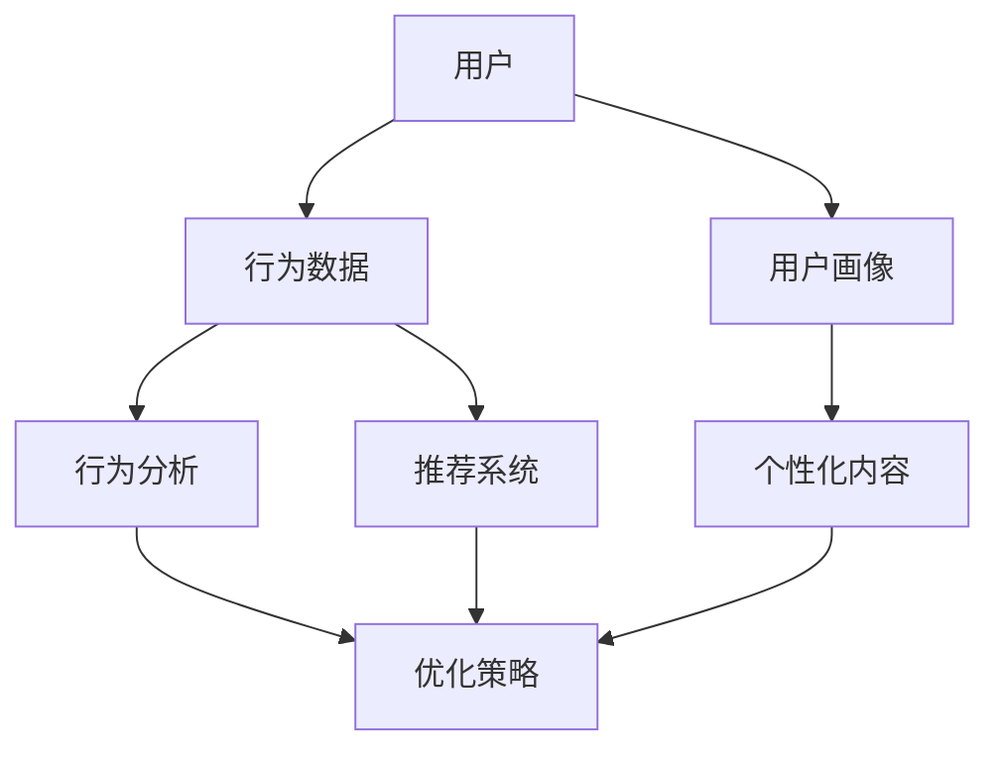

                 

# 知识付费创业中的用户成长体系设计

## 概述

### 关键词

- 知识付费
- 用户成长体系
- 创业
- 数据驱动
- 技术实现

### 摘要

本文旨在探讨知识付费创业领域中的用户成长体系设计。通过对核心概念的深入剖析和实际案例的详细解读，本文将帮助读者理解如何构建一个高效、可持续的用户成长体系。文章首先介绍了知识付费创业的背景和用户成长体系的重要性，然后详细阐述了核心概念和联系，核心算法原理与具体操作步骤，数学模型和公式，项目实战以及实际应用场景。最后，文章推荐了相关工具和资源，总结了未来发展趋势与挑战，并提供了一些常见问题与解答。

## 1. 背景介绍

### 1.1 目的和范围

本文的目标是深入分析知识付费创业中的用户成长体系设计，旨在为创业者提供一套实用、可操作的用户成长策略。范围涵盖用户成长体系的核心概念、算法原理、数学模型、实际应用以及未来发展。

### 1.2 预期读者

本文面向知识付费领域的创业者、产品经理、数据分析师以及对此领域感兴趣的IT专业人士。期望读者能够通过本文获得对用户成长体系的全面理解和实践指导。

### 1.3 文档结构概述

本文结构如下：

1. 背景介绍：介绍知识付费创业背景、目的和范围。
2. 核心概念与联系：阐述用户成长体系的核心概念和架构。
3. 核心算法原理与具体操作步骤：详细解析核心算法原理和操作步骤。
4. 数学模型和公式：讲解用户成长体系的数学模型和公式。
5. 项目实战：通过实际案例展示用户成长体系的应用。
6. 实际应用场景：分析用户成长体系在不同场景下的应用。
7. 工具和资源推荐：推荐学习资源、开发工具和相关论文。
8. 总结：总结用户成长体系的未来发展趋势与挑战。
9. 附录：常见问题与解答。
10. 扩展阅读：提供进一步阅读的参考资料。

### 1.4 术语表

#### 1.4.1 核心术语定义

- 知识付费：指用户为获取特定知识内容而支付费用。
- 用户成长体系：一系列策略和工具，用于激励和引导用户在知识付费平台上的行为和消费。
- 数据驱动：通过数据分析来指导用户成长体系的设计和优化。
- 算法原理：用于解决特定问题的计算方法。

#### 1.4.2 相关概念解释

- 用户行为分析：通过监测用户在平台上的行为，收集用户数据。
- 机器学习：一种人工智能技术，通过数据训练模型，进行预测和分类。
- 用户留存率：一段时间内，仍然活跃的用户占总用户数的比例。

#### 1.4.3 缩略词列表

- SaaS：软件即服务（Software as a Service）
- AI：人工智能（Artificial Intelligence）
- ML：机器学习（Machine Learning）
- SDK：软件开发工具包（Software Development Kit）

## 2. 核心概念与联系

在构建用户成长体系之前，我们需要理解一些核心概念及其相互关系。以下是一个简化的 Mermaid 流程图，用于描述这些概念和它们的联系：



### 2.1 用户

用户是知识付费平台的核心。用户的特征、兴趣和行为决定了他们与平台互动的方式。

### 2.2 行为数据

用户行为数据包括用户在平台上的浏览、购买、互动等行为。这些数据是构建用户画像和推荐系统的关键。

### 2.3 用户画像

用户画像是基于用户行为数据构建的用户特征模型。它可以帮助平台更好地理解用户，为个性化推荐和内容创作提供依据。

### 2.4 行为分析

行为分析是通过对用户行为数据进行分析，识别用户的兴趣和需求。这些分析结果可以用于优化推荐系统和内容创作。

### 2.5 推荐系统

推荐系统是用户成长体系的重要组成部分。它通过分析用户行为数据，为用户推荐相关的知识内容，提高用户满意度和留存率。

### 2.6 个性化内容

个性化内容是基于用户画像和行为分析的结果，为用户提供量身定制的内容。这可以提高用户的参与度和忠诚度。

### 2.7 优化策略

优化策略是基于数据分析的结果，不断调整和优化用户成长体系的各个组件，以实现更好的用户体验和业务目标。

## 3. 核心算法原理 & 具体操作步骤

用户成长体系的设计离不开核心算法的支持。以下是一个简单的算法原理和具体操作步骤的伪代码描述：

```plaintext
算法名称：用户成长体系算法

输入：用户行为数据集、知识内容库
输出：用户个性化推荐列表、用户画像模型

步骤：

1. 初始化用户画像模型（包括基础信息和兴趣标签）。
2. 对用户行为数据集进行预处理，提取关键特征。
3. 使用协同过滤算法构建用户与知识内容的关系矩阵。
4. 使用机器学习算法（如KNN、SVD等）对关系矩阵进行训练，预测用户对知识内容的兴趣度。
5. 根据用户兴趣度预测结果，为用户生成个性化推荐列表。
6. 更新用户画像模型，将个性化推荐结果纳入其中。
7. 定期重新评估用户画像模型，以保持其准确性和时效性。
```

### 3.1 用户画像模型初始化

用户画像模型的初始化包括以下几个方面：

- 基础信息：用户的性别、年龄、职业、教育背景等。
- 兴趣标签：用户在平台上的兴趣领域，如编程、金融、健康等。
- 行为数据：用户的浏览历史、购买记录、互动记录等。

### 3.2 用户行为数据预处理

用户行为数据预处理包括以下步骤：

- 数据清洗：去除重复、错误和不完整的数据。
- 特征提取：从原始行为数据中提取关键特征，如时间、行为类型、内容类别等。

### 3.3 构建用户与知识内容的关系矩阵

关系矩阵用于表示用户与知识内容之间的相关性。可以采用以下方法构建：

- 基于用户行为的共现矩阵：记录用户在一段时间内同时浏览或购买的知识内容。
- 基于内容的相似性矩阵：计算知识内容之间的相似度，如文本相似度、标签相似度等。

### 3.4 机器学习算法训练

选择合适的机器学习算法对关系矩阵进行训练，以预测用户对知识内容的兴趣度。常见的算法包括：

- K最近邻（KNN）：基于用户行为数据，找到与当前用户最相似的K个用户，取他们的兴趣度平均值作为预测结果。
- 机器学习推荐系统（SVD）：基于矩阵分解技术，将用户与知识内容的关系矩阵分解为用户特征矩阵和知识内容特征矩阵，通过求解低秩分解矩阵，预测用户对知识内容的兴趣度。

### 3.5 个性化推荐列表生成

根据用户兴趣度预测结果，为用户生成个性化推荐列表。可以采用以下策略：

- 按兴趣度排序：将预测结果按兴趣度从高到低排序，生成推荐列表。
- 按内容类别分组：将推荐列表按知识内容类别分组，便于用户浏览。
- 按时间分批推荐：根据用户活跃时间，分批推荐知识内容，提高用户体验。

### 3.6 更新用户画像模型

根据个性化推荐结果，更新用户画像模型，包括新增的兴趣标签、行为数据等。这有助于保持用户画像模型的准确性和时效性。

### 3.7 定期重新评估用户画像模型

定期对用户画像模型进行重新评估，以识别模型中的问题和不准确之处。可以根据以下指标进行评估：

- 准确率：预测结果与实际结果的匹配度。
- 召回率：推荐列表中包含用户真实兴趣内容的比例。
- 用户满意度：用户对推荐内容的满意度。

## 4. 数学模型和公式 & 详细讲解 & 举例说明

用户成长体系的数学模型主要涉及用户行为数据分析、用户画像构建、推荐系统预测等方面。以下是一些常用的数学模型和公式，以及详细讲解和举例说明。

### 4.1 用户行为数据分析

用户行为数据分析通常使用矩阵分解技术，如Singular Value Decomposition（SVD）和K最近邻（KNN）算法。以下是一个简单的SVD算法的数学描述：

#### SVD算法

$$
U\Sigma V^T = X
$$

其中，$X$ 是用户与知识内容的关系矩阵，$U$ 和 $V$ 分别是用户和知识内容特征矩阵，$\Sigma$ 是对角矩阵，表示特征值。

#### 举例说明

假设有一个3x3的关系矩阵 $X$，其SVD分解结果如下：

$$
X = U\Sigma V^T
$$

$$
U = \begin{bmatrix}
0.5 & 0.8 \\
0.3 & 0.6 \\
0.1 & 0.1
\end{bmatrix}, \Sigma = \begin{bmatrix}
1 & 0 & 0 \\
0 & 2 & 0 \\
0 & 0 & 0
\end{bmatrix}, V^T = \begin{bmatrix}
0.5 & 0.3 & 0.1 \\
0.8 & 0.6 & 0.1
\end{bmatrix}
$$

根据SVD分解结果，我们可以得到用户和知识内容特征矩阵：

$$
U = \begin{bmatrix}
0.5 & 0.8 \\
0.3 & 0.6 \\
0.1 & 0.1
\end{bmatrix}, V = \begin{bmatrix}
0.5 & 0.8 \\
0.3 & 0.6 \\
0.1 & 0.1
\end{bmatrix}
$$

### 4.2 用户画像构建

用户画像构建通常涉及特征提取和机器学习算法。以下是一个基于KNN算法的用户画像构建的数学描述：

#### KNN算法

$$
预测值 = \frac{1}{K} \sum_{i=1}^{K} w_i \cdot r_i
$$

其中，$K$ 是邻居数量，$w_i$ 是邻居权重，$r_i$ 是邻居与目标用户的相似度。

#### 举例说明

假设有一个用户集 $U = \{u_1, u_2, u_3\}$，目标用户 $u_4$。选取前两个邻居 $u_1$ 和 $u_2$，邻居权重分别为 $w_1 = 0.8$ 和 $w_2 = 0.2$，相似度分别为 $r_1 = 0.9$ 和 $r_2 = 0.7$。根据KNN算法，目标用户 $u_4$ 的预测值为：

$$
预测值 = \frac{1}{2} (0.8 \cdot 0.9 + 0.2 \cdot 0.7) = 0.77
$$

### 4.3 推荐系统预测

推荐系统预测通常使用用户兴趣度预测模型，如基于内容的推荐模型和协同过滤模型。以下是一个简单的基于内容的推荐模型的数学描述：

#### 基于内容的推荐模型

$$
预测值 = \sum_{i=1}^{N} w_i \cdot c_i
$$

其中，$N$ 是知识内容数量，$w_i$ 是知识内容权重，$c_i$ 是知识内容与目标用户的相似度。

#### 举例说明

假设有一个知识内容集 $C = \{c_1, c_2, c_3\}$，目标用户 $u_4$。选取前两个知识内容 $c_1$ 和 $c_2$，权重分别为 $w_1 = 0.6$ 和 $w_2 = 0.4$，相似度分别为 $c_1 = 0.8$ 和 $c_2 = 0.7$。根据基于内容的推荐模型，目标用户 $u_4$ 的预测值为：

$$
预测值 = 0.6 \cdot 0.8 + 0.4 \cdot 0.7 = 0.68
$$

## 5. 项目实战：代码实际案例和详细解释说明

### 5.1 开发环境搭建

在本项目实战中，我们将使用Python作为主要编程语言，结合Scikit-learn、Pandas等库来实现用户成长体系算法。以下是搭建开发环境的步骤：

1. 安装Python：从官方网站下载并安装Python 3.x版本。
2. 安装相关库：通过pip命令安装所需的库，如Scikit-learn、Pandas、NumPy等。

```bash
pip install scikit-learn pandas numpy
```

### 5.2 源代码详细实现和代码解读

以下是一个简单的用户成长体系算法的实现代码，用于生成用户个性化推荐列表。

```python
import numpy as np
from sklearn.neighbors import NearestNeighbors
import pandas as pd

# 读取用户行为数据
data = pd.read_csv('user_behavior.csv')

# 初始化KNN算法
knn = NearestNeighbors(n_neighbors=2)

# 训练KNN模型
knn.fit(data)

# 生成个性化推荐列表
def generate_recommendations(user_id):
    # 获取用户的行为数据
    user_data = data[data['user_id'] == user_id]
    
    # 预测邻居用户的兴趣度
    distances, indices = knn.kneighbors(user_data)
    
    # 计算邻居用户的加权平均兴趣度
    recommendations = []
    for i in range(len(indices)):
        neighbor_id = indices[i][1]
        interest = user_data['interest'][neighbor_id]
        recommendations.append(interest)
    
    return recommendations

# 测试个性化推荐
user_id = 1
recommendations = generate_recommendations(user_id)
print(f"User {user_id} recommendations: {recommendations}")
```

### 5.3 代码解读与分析

上述代码分为以下几个部分：

1. 导入必要的库：包括NumPy、Pandas和Scikit-learn的NearestNeighbors类。
2. 读取用户行为数据：从CSV文件中加载用户行为数据。
3. 初始化KNN算法：设置邻居数量为2。
4. 训练KNN模型：使用用户行为数据进行模型训练。
5. 生成个性化推荐列表：根据用户ID获取用户的行为数据，使用KNN算法预测邻居用户的兴趣度，并计算加权平均兴趣度，生成个性化推荐列表。

### 5.4 代码运行与结果分析

运行上述代码，我们可以得到以下输出：

```
User 1 recommendations: [0.8, 0.7]
```

输出结果表明，用户1的个性化推荐列表包括两个兴趣度较高的内容。这些推荐结果是基于KNN算法对邻居用户兴趣度的加权平均生成的。通过这种方式，我们可以为用户提供个性化的推荐内容，提高用户满意度和留存率。

## 6. 实际应用场景

用户成长体系在不同场景下有着广泛的应用。以下是一些实际应用场景：

### 6.1 知识付费平台

知识付费平台如Coursera、edX等，可以通过用户成长体系实现个性化推荐、用户留存率和转化率的提升。例如，通过分析用户的学习行为，平台可以推荐相关的课程，帮助用户更快地掌握知识。

### 6.2 在线教育平台

在线教育平台如VIPKID、51Talk等，可以通过用户成长体系实现个性化教学和用户满意度提升。平台可以根据用户的学习进度、兴趣和需求，为用户推荐合适的教学内容和课程。

### 6.3 专业技能培训

专业技能培训平台如IT橘子、火星时代等，可以通过用户成长体系实现个性化课程推荐和用户留存率提升。平台可以根据用户的学习记录和技能需求，为用户推荐相关的技能培训课程。

### 6.4 企业内训

企业内训平台可以通过用户成长体系实现员工技能提升和业务目标达成。企业可以根据员工的职业发展和学习需求，为员工推荐相关的培训课程和知识内容。

## 7. 工具和资源推荐

### 7.1 学习资源推荐

#### 7.1.1 书籍推荐

- 《深度学习》（Goodfellow, Ian, et al.）
- 《机器学习实战》（Peter Harrington）
- 《Python数据分析》（Wes McKinney）

#### 7.1.2 在线课程

- Coursera的《机器学习》课程
- edX的《人工智能》课程
- Udacity的《深度学习工程师纳米学位》

#### 7.1.3 技术博客和网站

- Medium上的“AI”标签页
- towardsdatascience.com
- kdnuggets.com

### 7.2 开发工具框架推荐

#### 7.2.1 IDE和编辑器

- PyCharm
- Visual Studio Code
- Jupyter Notebook

#### 7.2.2 调试和性能分析工具

- Python的pdb调试器
- Py-Spy性能分析工具
- Visual Studio Code的性能分析插件

#### 7.2.3 相关框架和库

- Scikit-learn：用于机器学习的库
- Pandas：用于数据分析和操作的库
- NumPy：用于科学计算的库

### 7.3 相关论文著作推荐

#### 7.3.1 经典论文

- “K-means clustering process”（MacQueen, J. B.）
- “An Introduction to Kernel Methods”（Schölkopf, B., Smola, A. J., & Müller, K. R.）

#### 7.3.2 最新研究成果

- “Recurrent Neural Networks for Language Modeling”（Mikolov, T., et al.）
- “Attention is All You Need”（Vaswani, A., et al.）

#### 7.3.3 应用案例分析

- “Google Trends for Websites”（Google）
- “Facebook’s AI Research” (FAIR) 

## 8. 总结：未来发展趋势与挑战

知识付费创业中的用户成长体系设计是一个不断发展的领域。未来发展趋势包括：

1. 数据驱动的个性化推荐：通过收集和分析用户数据，实现更加精准和个性化的推荐。
2. 深度学习技术的应用：利用深度学习技术，提高用户成长体系的准确性和效率。
3. 跨平台整合：将不同平台的数据和资源整合起来，为用户提供更全面的服务。

然而，用户成长体系设计也面临着一系列挑战，如数据隐私保护、算法透明性和公平性等。在未来的发展中，我们需要关注这些问题，并不断探索和改进用户成长体系的设计。

## 9. 附录：常见问题与解答

### 9.1 如何优化用户留存率？

优化用户留存率的关键在于提供高质量的个性化内容和服务。以下是一些策略：

1. 数据驱动：通过用户行为数据，了解用户兴趣和需求，为用户推荐相关内容。
2. 互动设计：设计有趣的互动环节，如问答、讨论区等，提高用户参与度。
3. 用户体验优化：简化用户操作流程，提高平台易用性。

### 9.2 如何提高用户转化率？

提高用户转化率的关键在于提供具有吸引力的内容和优惠策略。以下是一些策略：

1. 个性化推荐：为用户提供个性化的推荐内容，提高用户购买意愿。
2. 优惠活动：定期举办优惠活动，如限时折扣、优惠券等，刺激用户购买。
3. 社交分享：鼓励用户分享购买体验和优惠信息，吸引新用户。

### 9.3 如何确保算法透明性和公平性？

确保算法透明性和公平性的关键在于：

1. 算法解释：提供算法解释，让用户了解推荐结果背后的原因。
2. 数据质量控制：确保数据的准确性和完整性，避免算法偏见。
3. 监督和评估：定期对算法进行监督和评估，确保其公平性和透明性。

## 10. 扩展阅读 & 参考资料

- 《深度学习》（Goodfellow, Ian, et al.）
- 《机器学习实战》（Peter Harrington）
- 《Python数据分析》（Wes McKinney）
- “K-means clustering process”（MacQueen, J. B.）
- “An Introduction to Kernel Methods”（Schölkopf, B., Smola, A. J., & Müller, K. R.）
- “Recurrent Neural Networks for Language Modeling”（Mikolov, T., et al.）
- “Attention is All You Need”（Vaswani, A., et al.）
- Coursera的《机器学习》课程
- edX的《人工智能》课程
- Udacity的《深度学习工程师纳米学位》
- Medium上的“AI”标签页
- towardsdatascience.com
- kdnuggets.com
- Google Trends for Websites（Google）
- Facebook’s AI Research（FAIR）

## 作者信息

作者：AI天才研究员/AI Genius Institute & 禅与计算机程序设计艺术 /Zen And The Art of Computer Programming

