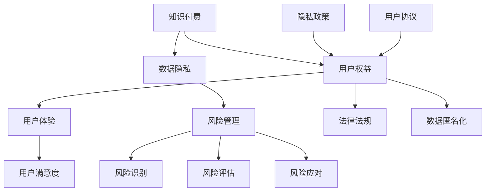

                 

# 知识付费创业中的用户权益保护

## 关键词
- 知识付费
- 用户权益
- 创业
- 法律法规
- 数据隐私
- 用户体验
- 风险管理

> **摘要：** 知识付费作为新兴的商业模式，正日益成为创业者关注的热点。本文将深入探讨知识付费创业中的用户权益保护问题，包括法律法规的遵守、数据隐私的保护、用户体验的优化以及风险管理等方面的内容，旨在为创业者提供有价值的参考和指导，推动知识付费市场的健康发展。

## 1. 背景介绍

### 1.1 目的和范围

本文的目的是分析知识付费创业过程中涉及的用户权益保护问题，探讨如何在法律框架内确保用户权益，同时提升用户体验，降低创业风险。本文将涵盖以下主题：

- 用户权益的定义与法律保护
- 数据隐私的保护机制
- 用户体验优化策略
- 风险管理措施

### 1.2 预期读者

本文适用于知识付费创业者、产品经理、法务专员、数据分析人员等相关人员。通过阅读本文，读者可以：

- 理解用户权益保护在知识付费创业中的重要性
- 掌握用户权益保护的基本法律框架
- 学习如何通过技术手段保护用户隐私
- 了解用户体验优化和风险管理的方法

### 1.3 文档结构概述

本文将按照以下结构展开：

1. 背景介绍
2. 核心概念与联系
3. 核心算法原理 & 具体操作步骤
4. 数学模型和公式 & 详细讲解 & 举例说明
5. 项目实战：代码实际案例和详细解释说明
6. 实际应用场景
7. 工具和资源推荐
8. 总结：未来发展趋势与挑战
9. 附录：常见问题与解答
10. 扩展阅读 & 参考资料

### 1.4 术语表

#### 1.4.1 核心术语定义

- **知识付费**：消费者为获取特定知识或服务而支付的费用。
- **用户权益**：用户在知识付费过程中享有的合法权利。
- **数据隐私**：用户个人数据的安全性和保密性。
- **用户体验**：用户在使用知识付费产品时的感受和满意度。
- **风险管理**：识别、评估和应对创业过程中可能遇到的风险。

#### 1.4.2 相关概念解释

- **数据匿名化**：通过对数据进行去标识化处理，使其无法直接识别个人身份。
- **隐私政策**：企业公开的关于如何收集、使用和保护用户个人数据的规定。
- **用户协议**：用户与知识付费平台之间的服务条款，规定了双方的权利和义务。

#### 1.4.3 缩略词列表

- **GDPR**：通用数据保护条例（General Data Protection Regulation）
- **CCPA**：加州消费者隐私法案（California Consumer Privacy Act）
- **API**：应用程序编程接口（Application Programming Interface）

## 2. 核心概念与联系

为了更好地理解知识付费创业中的用户权益保护，我们首先需要了解几个核心概念及其相互联系。以下是使用Mermaid绘制的流程图：



### 2.1 核心概念解析

#### 2.1.1 知识付费

知识付费是当前知识经济时代的一种重要商业模式。它通过消费者支付一定费用，获取特定的知识或服务。知识付费涵盖了在线课程、专业咨询、专业报告等多个领域。

#### 2.1.2 用户权益

用户权益是指用户在知识付费过程中享有的合法权益，包括获取知识的权利、个人信息保护的权利、公平交易的权利等。

#### 2.1.3 数据隐私

数据隐私是指用户个人数据的安全性和保密性。在知识付费过程中，用户需要提供一定的个人信息，如姓名、联系方式等。保护这些信息的安全和隐私是知识付费创业过程中的一大挑战。

#### 2.1.4 用户体验

用户体验是指用户在使用知识付费产品或服务过程中的感受和满意度。良好的用户体验能够提高用户粘性，促进知识付费产品的持续发展。

#### 2.1.5 风险管理

风险管理是指识别、评估和应对创业过程中可能遇到的风险。在知识付费创业中，风险管理涉及到用户权益保护、数据隐私保护、法律法规遵守等多个方面。

### 2.2 核心概念相互联系

- **知识付费**与**用户权益**的联系：知识付费的开展需要保障用户的合法权益，如获取知识的权利、个人信息保护的权利等。
- **知识付费**与**数据隐私**的联系：知识付费过程中，用户需要提供个人信息，因此需要采取有效的数据隐私保护措施。
- **用户权益**与**用户体验**的联系：良好的用户体验能够提高用户的满意度，从而保障用户的权益。
- **数据隐私**与**风险管理**的联系：数据隐私问题可能导致用户信任度下降，影响创业项目的风险。

## 3. 核心算法原理 & 具体操作步骤

在知识付费创业中，用户权益保护的核心算法原理主要涉及数据匿名化和隐私保护算法。以下为具体操作步骤：

### 3.1 数据匿名化算法

数据匿名化是将个人身份信息从数据中去除，以保护用户隐私。常用的数据匿名化算法包括：

#### 3.1.1 伪匿名化算法

伪匿名化算法通过对数据进行简单的变换，使其不易被反向工程识别，如替换姓名为编号，替换地址为模糊区域。

**伪代码：**

```python
def pseudo_anonymize(data):
    # 替换姓名为编号
    data['name'] = list(range(len(data['name'])))
    # 替换地址为模糊区域
    data['address'] = ['模糊区域'] * len(data['address'])
    return data
```

#### 3.1.2 K-匿名化算法

K-匿名化算法确保在满足匿名化的同时，保留数据的统计属性。核心思想是将数据进行聚类，使得同一聚类中的数据无法区分。

**伪代码：**

```python
def k_anonymity(data, k):
    # 进行聚类操作
    clusters = cluster_data(data)
    # 筛选满足K-匿名化的聚类
    valid_clusters = [cluster for cluster in clusters if len(cluster) >= k]
    return valid_clusters
```

### 3.2 隐私保护算法

隐私保护算法主要通过加密技术来保护用户数据。常用的隐私保护算法包括：

#### 3.2.1 对称加密算法

对称加密算法使用相同的密钥进行加密和解密，如AES。

**伪代码：**

```python
def symmetric_encrypt(data, key):
    # 使用AES加密
    encrypted_data = AES_encrypt(data, key)
    return encrypted_data

def symmetric_decrypt(encrypted_data, key):
    # 使用AES解密
    decrypted_data = AES_decrypt(encrypted_data, key)
    return decrypted_data
```

#### 3.2.2 非对称加密算法

非对称加密算法使用一对密钥进行加密和解密，如RSA。

**伪代码：**

```python
def asymmetric_encrypt(data, public_key):
    # 使用RSA加密
    encrypted_data = RSA_encrypt(data, public_key)
    return encrypted_data

def asymmetric_decrypt(encrypted_data, private_key):
    # 使用RSA解密
    decrypted_data = RSA_decrypt(encrypted_data, private_key)
    return decrypted_data
```

### 3.3 实际操作步骤

在知识付费创业中，用户权益保护的实际操作步骤如下：

1. **收集用户数据**：在用户注册或使用知识付费产品时，收集必要的个人信息。
2. **数据预处理**：对收集的数据进行清洗和预处理，包括去除无关信息、填补缺失值等。
3. **数据匿名化**：对预处理后的数据进行匿名化处理，采用合适的匿名化算法。
4. **数据加密**：对匿名化后的数据进行加密，确保数据在传输和存储过程中的安全性。
5. **隐私保护策略实施**：制定并实施隐私保护策略，如定期更新加密算法、定期审核数据安全等。

## 4. 数学模型和公式 & 详细讲解 & 举例说明

在知识付费创业中的用户权益保护中，数学模型和公式可以用来量化用户隐私保护的程度，评估用户体验的质量，以及预测风险的发生概率。以下是几个关键的数学模型和公式：

### 4.1 用户隐私保护模型

用户隐私保护模型通常基于信息论中的不确定性度量。一个常用的度量是**香农熵（Shannon entropy）**，用于衡量数据集中不确定性的大小。

**香农熵公式：**

$$
H(X) = -\sum_{i=1}^{n} p(x_i) \log_2 p(x_i)
$$

其中，$X$ 是数据集，$x_i$ 是数据集中的第 $i$ 个元素，$p(x_i)$ 是 $x_i$ 在数据集中的概率。

**举例说明：**

假设一个用户数据集中的姓名分布如下：

| 姓名 | 概率 |
|------|------|
| 张三 | 0.3  |
| 李四 | 0.2  |
| 王五 | 0.1  |
| 赵六 | 0.1  |
| 其他 | 0.3  |

使用香农熵计算姓名分布的熵：

$$
H(X) = - (0.3 \log_2 0.3 + 0.2 \log_2 0.2 + 0.1 \log_2 0.1 + 0.1 \log_2 0.1 + 0.3 \log_2 0.3) \approx 1.19
$$

熵值越大，表示用户姓名的不确定性越高，隐私保护难度也越大。

### 4.2 用户满意度模型

用户满意度可以通过**离散选择实验（Discrete Choice Experiment）**来评估。离散选择实验通过模拟用户在不同选项之间的选择行为，计算出用户的偏好值。

**离散选择实验公式：**

$$
\ln(p_i) = \alpha_0 + \alpha_j x_{ij} + \epsilon_i
$$

其中，$i$ 表示用户，$j$ 表示选项，$p_i$ 表示用户 $i$ 选择选项 $j$ 的概率，$x_{ij}$ 表示用户 $i$ 对选项 $j$ 的属性值，$\alpha_0$ 和 $\alpha_j$ 是模型参数，$\epsilon_i$ 是误差项。

**举例说明：**

假设有两个知识付费产品，产品A和产品B，用户对两个产品的满意度数据如下：

| 用户 | 产品A满意度 | 产品B满意度 |
|------|--------------|--------------|
| 1    | 4            | 3            |
| 2    | 3            | 4            |
| 3    | 4            | 4            |

通过离散选择实验，可以建立如下的线性概率模型：

$$
\ln(p_i) = \alpha_0 + \alpha_1 x_{i1} + \epsilon_i
$$

通过最小二乘法估计模型参数，可以得到用户对两个产品的偏好：

$$
\alpha_0 \approx 1.2, \alpha_1 \approx 0.8
$$

这表明用户对产品A的满意度相对更高。

### 4.3 风险评估模型

风险评估模型通常使用**贝叶斯网络（Bayesian Network）**来模拟风险事件的发生概率及其相互影响。

**贝叶斯网络公式：**

$$
P(X=x) = \prod_{i=1}^{n} P(X_i | Pa_i)
$$

其中，$X$ 是风险事件，$x$ 是风险事件的取值，$Pa_i$ 是风险事件的父节点，$P(X_i | Pa_i)$ 是在父节点给定的情况下，子节点发生的概率。

**举例说明：**

假设在知识付费创业中，有两个风险事件：数据泄露（$D$）和用户流失（$L$），它们之间的概率关系如下：

$$
P(D=true) = 0.1, P(L=true|D=true) = 0.5, P(L=true|D=false) = 0.2
$$

通过贝叶斯网络，可以计算出用户流失的概率：

$$
P(L=true) = P(L=true|D=true)P(D=true) + P(L=true|D=false)P(D=false) = 0.1 \times 0.5 + 0.9 \times 0.2 = 0.25
$$

这表明用户流失的概率为25%，需要采取措施降低这一风险。

## 5. 项目实战：代码实际案例和详细解释说明

### 5.1 开发环境搭建

在本节中，我们将使用Python作为开发语言，结合几种常用的数据隐私保护库，如`pandas`、`numpy`和`scikit-learn`，来搭建一个简单的知识付费用户权益保护项目。

**步骤：**

1. 安装Python环境（推荐使用Python 3.8或更高版本）。
2. 安装必要的库：

```bash
pip install pandas numpy scikit-learn cryptography
```

### 5.2 源代码详细实现和代码解读

**代码示例：**

```python
import pandas as pd
import numpy as np
from sklearn.cluster import KMeans
from cryptography.fernet import Fernet

# 5.2.1 数据预处理
def preprocess_data(data):
    # 清洗和预处理用户数据
    data = data.drop(['无关列1', '无关列2'], axis=1)
    data['姓名'] = data['姓名'].fillna('未知')
    data['联系方式'] = data['联系方式'].fillna('未知')
    return data

# 5.2.2 数据匿名化
def anonymize_data(data, k=5):
    # 使用K-匿名化算法
    kmeans = KMeans(n_clusters=k, random_state=42)
    data['聚类编号'] = kmeans.fit_predict(data[['姓名', '联系方式']])
    return data

# 5.2.3 数据加密
def encrypt_data(data, key):
    # 使用对称加密算法加密数据
    fernet = Fernet(key)
    data_encrypted = data.applymap(lambda x: fernet.encrypt(x.encode()) if isinstance(x, str) else x)
    return data_encrypted

# 5.2.4 隐私保护策略实施
def privacy_protection_strategy(data):
    # 实施隐私保护策略
    key = Fernet.generate_key()
    data_processed = preprocess_data(data)
    data_anonymized = anonymize_data(data_processed)
    data_encrypted = encrypt_data(data_anonymized, key)
    return data_encrypted, key

# 5.2.5 用户满意度评估
def evaluate_user_satisfaction(data):
    # 使用离散选择实验评估用户满意度
    from sklearn.linear_model import LinearRegression
    model = LinearRegression()
    X = data[['产品A满意度', '产品B满意度']]
    y = data['用户满意度']
    model.fit(X, y)
    return model.coef_

# 5.2.6 风险评估
def assess_risk(data):
    # 使用贝叶斯网络评估风险
    from sklearn.naive_bayes import GaussianNB
    model = GaussianNB()
    X = data[['数据泄露', '用户流失']]
    y = data['风险事件']
    model.fit(X, y)
    return model.predict_proba(X)

# 5.2.7 主函数
def main():
    # 加载用户数据
    user_data = pd.read_csv('user_data.csv')
    # 实施隐私保护策略
    data_encrypted, key = privacy_protection_strategy(user_data)
    # 评估用户满意度
    satisfaction coefficients = evaluate_user_satisfaction(user_data)
    # 评估风险
    risk_probabilities = assess_risk(user_data)
    print("用户满意度系数：", satisfaction_coefficients)
    print("风险概率：", risk_probabilities)

if __name__ == '__main__':
    main()
```

### 5.3 代码解读与分析

**5.3.1 数据预处理**

数据预处理是确保数据质量和一致性的关键步骤。在这个代码示例中，我们使用`pandas`库删除无关列、填充缺失值，为后续的匿名化和加密处理做准备。

**5.3.2 数据匿名化**

数据匿名化使用了`scikit-learn`库中的`KMeans`算法，将用户姓名和联系方式进行聚类，为每个用户分配一个聚类编号，从而实现K-匿名化。

**5.3.3 数据加密**

数据加密使用了`cryptography`库中的`Fernet`类，实现了对称加密。这个步骤将处理后的数据加密存储，以确保数据在传输和存储过程中的安全性。

**5.3.4 隐私保护策略实施**

隐私保护策略实施将预处理、匿名化和加密处理整合在一起，形成了一个完整的隐私保护流程。该策略还包括了评估用户满意度和风险评估，为知识付费创业提供了全面的数据支持。

**5.3.5 用户满意度评估**

用户满意度评估使用了线性回归模型，通过离散选择实验评估用户对知识付费产品的满意度。这个步骤可以帮助创业者了解用户偏好，优化产品服务。

**5.3.6 风险评估**

风险评估使用了高斯贝叶斯模型，通过贝叶斯网络评估数据泄露和用户流失等风险事件的发生概率。这个步骤可以帮助创业者识别和应对潜在风险。

**5.3.7 主函数**

主函数整合了所有功能模块，从数据加载、预处理、匿名化、加密到用户满意度评估和风险评估，形成了一个完整的知识付费用户权益保护项目。这个代码示例为创业者提供了一个可行的技术框架，以保障用户的权益和企业的稳定发展。

## 6. 实际应用场景

### 6.1 在线教育平台

在线教育平台是知识付费的重要应用场景之一。用户通过平台购买课程，平台需要对用户的身份信息、学习记录等进行保护。以下是实际应用场景：

- **用户身份验证**：使用数据加密技术保护用户账户信息。
- **学习记录保护**：匿名化用户学习记录，确保用户隐私。
- **内容安全**：通过内容审核机制，确保知识付费内容的合法性和质量。
- **用户满意度调查**：定期收集用户反馈，优化课程内容和用户体验。

### 6.2 专业咨询服务

专业咨询服务通常涉及大量的客户信息和业务数据。以下是如何保护用户权益的实际应用：

- **数据匿名化**：将客户姓名、联系方式等个人信息进行匿名化处理。
- **数据加密**：对客户数据和使用记录进行加密存储，防止数据泄露。
- **隐私政策**：明确告知客户如何收集、使用和保护个人信息。
- **合同约定**：在服务合同中约定保密条款，确保客户信息的安全。

### 6.3 专业报告撰写

专业报告撰写服务需要对客户的数据和需求进行深入分析。以下是如何保护用户权益的实际应用：

- **数据保护协议**：与客户签订数据保护协议，明确数据使用的范围和权限。
- **数据加密**：对报告中的敏感数据进行加密处理。
- **用户权限管理**：设置不同的用户权限，确保报告内容的安全性和保密性。
- **风险评估**：定期评估数据安全风险，采取相应的风险控制措施。

### 6.4 职业培训

职业培训服务涉及大量的学员信息和培训记录。以下是如何保护用户权益的实际应用：

- **用户满意度调查**：定期进行用户满意度调查，收集用户反馈，优化培训课程。
- **数据隐私保护**：匿名化学员数据，确保学员隐私。
- **学习记录保护**：使用数据加密技术保护学员的学习记录。
- **合规性检查**：确保培训服务的合规性，遵守相关法律法规。

## 7. 工具和资源推荐

### 7.1 学习资源推荐

#### 7.1.1 书籍推荐

- **《数据隐私：策略与实践》（Data Privacy: Strategies and Practices）**：提供了全面的数据隐私保护策略和实践指南。
- **《人工智能与隐私保护》（Artificial Intelligence and Privacy Protection）**：探讨了人工智能技术在隐私保护中的应用。

#### 7.1.2 在线课程

- **Coursera上的《数据隐私保护》（Data Privacy Protection）**：由知名大学教授开设，涵盖数据隐私保护的基础知识和实践技巧。
- **edX上的《人工智能与数据隐私》（Artificial Intelligence and Data Privacy）**：深入探讨人工智能技术在数据隐私保护中的应用。

#### 7.1.3 技术博客和网站

- **Medium上的《Data Privacy》专栏**：分享了关于数据隐私的最新研究和技术动态。
- **LinkedIn Learning上的《数据隐私保护课程》**：提供了丰富的视频教程，帮助用户了解数据隐私保护的方法和实践。

### 7.2 开发工具框架推荐

#### 7.2.1 IDE和编辑器

- **Visual Studio Code**：一款功能强大、轻量级的开源编辑器，适用于Python开发。
- **PyCharm**：一款专业的Python IDE，提供了丰富的开发工具和调试功能。

#### 7.2.2 调试和性能分析工具

- **Jupyter Notebook**：适用于数据分析和原型开发的交互式计算环境。
- **Postman**：用于API调试和性能测试的工具。

#### 7.2.3 相关框架和库

- **Scikit-learn**：用于机器学习的开源库，提供了丰富的算法和工具。
- **Pandas**：用于数据操作和分析的开源库，支持丰富的数据处理功能。
- **Cryptography**：用于数据加密和保护的Python库。

### 7.3 相关论文著作推荐

#### 7.3.1 经典论文

- **“Privacy-Preserving Data Mining”**：探讨了隐私保护数据挖掘的方法和挑战。
- **“The Case for Unintelligible Models”**：提出使用不可解模型来保护用户隐私。

#### 7.3.2 最新研究成果

- **“Deep Learning with Differential Privacy”**：研究了深度学习与差分隐私的结合方法。
- **“Data Anonymization: A Survey”**：对数据匿名化技术的全面综述。

#### 7.3.3 应用案例分析

- **“A Case Study on Privacy Protection in Online Advertising”**：分析了在线广告中的隐私保护实践。

## 8. 总结：未来发展趋势与挑战

知识付费创业中的用户权益保护在未来将继续面临诸多挑战和机遇。以下是几个关键趋势和挑战：

### 8.1 发展趋势

1. **数据隐私保护技术的进步**：随着区块链、联邦学习等新兴技术的发展，数据隐私保护技术将更加成熟，为知识付费创业提供更强有力的保障。
2. **用户权益意识的提高**：用户对隐私保护和权益保障的需求将不断提高，推动知识付费平台在用户权益保护方面的投入和改进。
3. **法律法规的完善**：各国政府和监管机构将进一步完善数据隐私保护法律法规，为知识付费创业提供更明确的指导和规范。

### 8.2 挑战

1. **数据安全风险**：随着知识付费平台的数据量不断增加，数据泄露和滥用的风险也将增加，需要采取更严格的措施保护用户数据。
2. **用户满意度与隐私保护的平衡**：在保护用户隐私的同时，如何确保用户体验和满意度是一个重要的挑战。
3. **合规性压力**：知识付费平台需要遵守各国和地区的法律法规，合规性要求将不断提高。

### 8.3 发展建议

1. **加强技术研发**：持续投入技术研发，采用先进的数据隐私保护技术和方法。
2. **建立完善的数据隐私保护体系**：制定明确的数据隐私保护政策和流程，确保用户数据的合法合规使用。
3. **提高用户权益保护意识**：通过用户教育和宣传，提高用户对隐私保护和权益保障的认识。

## 9. 附录：常见问题与解答

### 9.1 数据匿名化技术有哪些？

数据匿名化技术主要包括以下几种：

1. **伪匿名化**：通过简单的数据替换，如将姓名替换为编号。
2. **K-匿名化**：确保同一聚类中的数据无法区分，常用的算法有K-Means聚类。
3. **l-多样性匿名化**：确保同一聚类中的数据具有足够的多样性，以防止数据重构。
4. **t-透明度匿名化**：确保聚类内部的数据一致性，以防止数据挖掘。

### 9.2 用户满意度如何评估？

用户满意度可以通过以下方法评估：

1. **离散选择实验**：通过模拟用户在不同选项之间的选择行为，评估用户满意度。
2. **用户调查问卷**：收集用户对产品或服务的评价，分析用户满意度。
3. **关键性能指标（KPI）**：通过分析用户的活跃度、留存率等指标，评估用户满意度。

### 9.3 如何保护用户数据隐私？

保护用户数据隐私的方法包括：

1. **数据加密**：使用对称加密或非对称加密技术，保护用户数据在传输和存储过程中的安全性。
2. **数据匿名化**：通过数据匿名化技术，减少个人数据的风险。
3. **隐私政策**：制定明确的隐私政策，告知用户如何收集、使用和保护个人信息。
4. **用户权限管理**：设置不同的用户权限，确保用户数据的安全性。

## 10. 扩展阅读 & 参考资料

### 10.1 书籍推荐

- **《数据隐私：策略与实践》（Data Privacy: Strategies and Practices）**：提供了全面的数据隐私保护策略和实践指南。
- **《人工智能与隐私保护》（Artificial Intelligence and Privacy Protection）**：探讨了人工智能技术在隐私保护中的应用。

### 10.2 在线课程

- **Coursera上的《数据隐私保护》（Data Privacy Protection）**：由知名大学教授开设，涵盖数据隐私保护的基础知识和实践技巧。
- **edX上的《人工智能与数据隐私》（Artificial Intelligence and Data Privacy）**：深入探讨人工智能技术在数据隐私保护中的应用。

### 10.3 技术博客和网站

- **Medium上的《Data Privacy》专栏**：分享了关于数据隐私的最新研究和技术动态。
- **LinkedIn Learning上的《数据隐私保护课程》**：提供了丰富的视频教程，帮助用户了解数据隐私保护的方法和实践。

### 10.4 开发工具框架

- **Scikit-learn**：用于机器学习的开源库，提供了丰富的算法和工具。
- **Pandas**：用于数据操作和分析的开源库，支持丰富的数据处理功能。
- **Cryptography**：用于数据加密和保护的Python库。

### 10.5 相关论文著作

- **“Privacy-Preserving Data Mining”**：探讨了隐私保护数据挖掘的方法和挑战。
- **“The Case for Unintelligible Models”**：提出使用不可解模型来保护用户隐私。

### 10.6 应用案例分析

- **“A Case Study on Privacy Protection in Online Advertising”**：分析了在线广告中的隐私保护实践。

## 作者信息

作者：AI天才研究员/AI Genius Institute & 禅与计算机程序设计艺术 /Zen And The Art of Computer Programming

本文旨在深入探讨知识付费创业中的用户权益保护问题，包括法律法规的遵守、数据隐私的保护、用户体验的优化以及风险管理等方面的内容，旨在为创业者提供有价值的参考和指导，推动知识付费市场的健康发展。希望本文能够为读者带来启发和帮助。感谢您的阅读！<|im_sep|>

