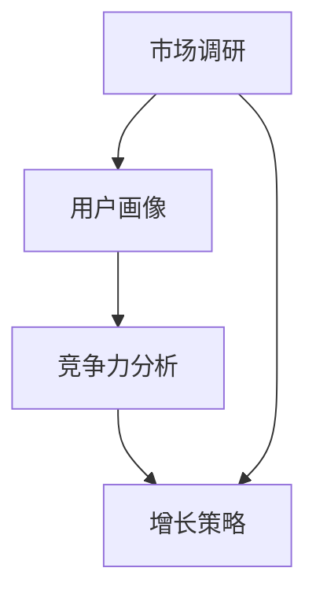

                 

# 知识付费创业的产品定位策略

> **关键词：** 知识付费、产品定位、市场调研、用户画像、竞争力分析、增长策略
>
> **摘要：** 本文将深入探讨知识付费创业的产品定位策略，从市场调研、用户画像、竞争力分析和增长策略四个方面，阐述如何通过科学的分析和合理的策略制定，实现知识付费产品的精准定位，助力创业成功。

## 1. 背景介绍

### 1.1 目的和范围

本文旨在为知识付费创业项目提供系统性的产品定位策略，帮助创业者更好地理解市场、用户需求和竞争对手，从而制定出更具针对性的产品策略，提高市场竞争力。

### 1.2 预期读者

- 有志于从事知识付费创业的个人和团队；
- 对知识付费市场有浓厚兴趣的研究人员和从业者；
- 从事市场营销、产品管理等相关岗位的专业人士。

### 1.3 文档结构概述

本文将分为八个部分进行详细阐述：

1. 背景介绍
2. 核心概念与联系
3. 核心算法原理 & 具体操作步骤
4. 数学模型和公式 & 详细讲解 & 举例说明
5. 项目实战：代码实际案例和详细解释说明
6. 实际应用场景
7. 工具和资源推荐
8. 总结：未来发展趋势与挑战

### 1.4 术语表

#### 1.4.1 核心术语定义

- **知识付费：** 用户为获取有价值的信息或知识而付费的行为。
- **产品定位：** 确定产品在市场上的定位和目标用户群体。
- **用户画像：** 基于用户数据和特征，构建的用户形象和需求模型。
- **竞争力分析：** 对市场上现有竞争对手的产品、服务和策略进行分析。

#### 1.4.2 相关概念解释

- **市场调研：** 收集、分析和评估市场信息，了解市场需求和趋势。
- **增长策略：** 通过营销、运营等手段，实现产品用户和收入的增长。

#### 1.4.3 缩略词列表

- **KOL：** Key Opinion Leader，关键意见领袖
- **UGC：** User Generated Content，用户生成内容
- **SEM：** Search Engine Marketing，搜索引擎营销

## 2. 核心概念与联系

为了更好地理解知识付费创业的产品定位策略，我们需要先了解以下几个核心概念及其相互关系。

### 2.1 市场调研

市场调研是产品定位的基础。通过市场调研，我们可以获取以下信息：

- **市场容量：** 目标市场的总体规模和增长潜力。
- **市场趋势：** 目标市场的变化趋势和未来发展方向。
- **竞争对手：** 市场上现有竞争对手的产品、服务和策略。
- **用户需求：** 目标用户群体的需求、痛点和行为习惯。

### 2.2 用户画像

用户画像是对目标用户的抽象描述，包括以下内容：

- **用户属性：** 年龄、性别、教育背景、职业等基本信息。
- **用户行为：** 消费习惯、购买频率、使用场景等行为数据。
- **用户需求：** 用户关心的核心问题和需求。

### 2.3 竞争力分析

竞争力分析是对市场上现有竞争对手的产品、服务和策略进行分析，包括以下方面：

- **产品功能：** 竞争对手的产品功能、特性和优势。
- **用户评价：** 用户对竞争对手产品的评价和反馈。
- **市场份额：** 竞争对手在市场上的地位和份额。

### 2.4 增长策略

增长策略是通过营销、运营等手段，实现产品用户和收入的增长。主要包括以下方面：

- **市场推广：** 利用广告、社交媒体、SEO 等手段扩大产品知名度。
- **用户增长：** 通过用户裂变、推荐机制等方式增加用户数量。
- **收入增长：** 提高付费转化率、增加付费项目种类和收入来源。

### 2.5 Mermaid 流程图

以下是一个简化的 Mermaid 流程图，展示了市场调研、用户画像、竞争力分析和增长策略之间的联系：



## 3. 核心算法原理 & 具体操作步骤

在了解核心概念和联系的基础上，我们需要进一步探讨如何通过科学的方法进行市场调研、用户画像、竞争力分析和增长策略制定。

### 3.1 市场调研

市场调研的核心目标是获取有价值的市场信息。以下是市场调研的步骤：

1. **确定调研目标：** 明确调研的目的和需要解决的问题。
2. **设计调研方案：** 制定调研方法、调研对象和调研内容。
3. **收集数据：** 采用问卷调查、访谈、观察等方法收集数据。
4. **分析数据：** 对收集到的数据进行分析，提取有价值的信息。
5. **撰写报告：** 撰写市场调研报告，总结调研结果和建议。

### 3.2 用户画像

用户画像的构建需要从多个维度收集用户数据，并进行数据清洗和模型训练。以下是用户画像构建的步骤：

1. **数据收集：** 收集用户的个人信息、行为数据和消费记录等。
2. **数据清洗：** 清除无效数据、处理缺失值和异常值。
3. **特征提取：** 提取用户属性和行为特征，构建特征向量。
4. **模型训练：** 利用机器学习算法对特征向量进行训练，构建用户画像模型。
5. **模型评估：** 评估模型的效果，调整模型参数。

### 3.3 竞争力分析

竞争力分析需要对市场上现有竞争对手的产品、服务和策略进行详细分析。以下是竞争力分析的步骤：

1. **确定分析目标：** 明确需要分析的竞争对手和指标。
2. **收集数据：** 收集竞争对手的产品信息、用户评价和市场份额等数据。
3. **数据分析：** 对收集到的数据进行处理和分析，提取有价值的信息。
4. **撰写报告：** 撰写竞争力分析报告，总结竞争对手的优势和劣势。

### 3.4 增长策略制定

增长策略制定需要结合市场调研、用户画像和竞争力分析的结果，制定具体的增长策略。以下是增长策略制定的步骤：

1. **确定增长目标：** 明确增长的目标和方向。
2. **制定策略：** 根据市场调研、用户画像和竞争力分析的结果，制定具体的增长策略。
3. **实施策略：** 实施增长策略，跟踪效果并调整策略。
4. **评估效果：** 评估增长策略的效果，调整和优化策略。

### 3.5 伪代码示例

以下是一个简化的伪代码示例，展示了如何进行市场调研、用户画像、竞争力分析和增长策略制定：

```python
# 市场调研
def market_research():
    # 确定调研目标
    # 设计调研方案
    # 收集数据
    # 分析数据
    # 撰写报告
    pass

# 用户画像
def user_profile():
    # 数据收集
    # 数据清洗
    # 特征提取
    # 模型训练
    # 模型评估
    pass

# 竞争力分析
def competition_analysis():
    # 确定分析目标
    # 收集数据
    # 数据分析
    # 撰写报告
    pass

# 增长策略制定
def growth_strategy():
    # 确定增长目标
    # 制定策略
    # 实施策略
    # 评估效果
    pass

# 主函数
def main():
    market_research()
    user_profile()
    competition_analysis()
    growth_strategy()
    pass

# 执行主函数
main()
```

## 4. 数学模型和公式 & 详细讲解 & 举例说明

在知识付费创业的产品定位策略中，数学模型和公式可以帮助我们更好地分析和理解市场数据、用户行为和竞争力关系。以下是几个常见的数学模型和公式的详细讲解及举例说明。

### 4.1 市场需求预测模型

市场需求预测是市场调研的重要环节。我们可以使用线性回归模型来预测市场需求。

#### 4.1.1 线性回归模型

线性回归模型的表达式为：

\[ y = \beta_0 + \beta_1x + \epsilon \]

其中，\( y \) 为市场需求，\( x \) 为影响市场需求的因素（如广告投放量、用户评价等），\( \beta_0 \) 和 \( \beta_1 \) 为模型参数，\( \epsilon \) 为误差项。

#### 4.1.2 举例说明

假设我们要预测某知识付费产品的市场需求，根据历史数据，我们得到了以下线性回归模型：

\[ y = 1000 + 50x \]

其中，\( x \) 为广告投放量（万元），\( y \) 为市场需求（人次）。

如果我们预计下个月的广告投放量为 100 万元，我们可以通过以下计算预测市场需求：

\[ y = 1000 + 50 \times 100 = 5500 \]

因此，下个月的市场需求预计为 5500 人次。

### 4.2 用户留存率模型

用户留存率是衡量产品用户活跃度的重要指标。我们可以使用二项分布模型来预测用户留存率。

#### 4.2.1 二项分布模型

二项分布模型的表达式为：

\[ P(X = k) = C(n, k) \times p^k \times (1 - p)^{n - k} \]

其中，\( X \) 为用户留存次数，\( k \) 为留存次数，\( n \) 为观察次数，\( p \) 为用户留存概率，\( C(n, k) \) 为组合数。

#### 4.2.2 举例说明

假设我们要预测某知识付费产品的用户留存率，根据历史数据，我们得到了以下二项分布模型：

\[ P(X = 1) = C(3, 1) \times 0.6^1 \times (1 - 0.6)^{3 - 1} = 0.216 \]

因此，用户留存率为 21.6%。

### 4.3 用户流失率模型

用户流失率是衡量产品用户流失速度的重要指标。我们可以使用泊松分布模型来预测用户流失率。

#### 4.3.1 泊松分布模型

泊松分布模型的表达式为：

\[ P(X = k) = \frac{\lambda^k e^{-\lambda}}{k!} \]

其中，\( X \) 为用户流失次数，\( k \) 为流失次数，\( \lambda \) 为流失率（单位时间内流失的用户数）。

#### 4.3.2 举例说明

假设我们要预测某知识付费产品的用户流失率，根据历史数据，我们得到了以下泊松分布模型：

\[ P(X = 1) = \frac{0.5^1 e^{-0.5}}{1!} = 0.308 \]

因此，用户流失率为 30.8%。

### 4.4 竞争力指数模型

竞争力指数是衡量产品竞争力的重要指标。我们可以使用以下公式计算竞争力指数：

\[ 竞争力指数 = \frac{市场份额}{投入成本} \]

#### 4.4.1 举例说明

假设某知识付费产品的市场份额为 20%，投入成本为 100 万元，我们可以通过以下计算得到竞争力指数：

\[ 竞争力指数 = \frac{20\%}{100\%} = 0.2 \]

因此，该产品的竞争力指数为 0.2。

## 5. 项目实战：代码实际案例和详细解释说明

为了更好地理解知识付费创业的产品定位策略，我们将通过一个实际案例来展示如何进行市场调研、用户画像、竞争力分析和增长策略制定。

### 5.1 开发环境搭建

在开始项目实战之前，我们需要搭建一个合适的开发环境。以下是开发环境搭建的步骤：

1. 安装 Python 3.8 及以上版本。
2. 安装 Anaconda 或 Miniconda 等数据科学平台。
3. 安装必要的 Python 库，如 pandas、numpy、scikit-learn、matplotlib 等。

### 5.2 源代码详细实现和代码解读

以下是项目实战的源代码实现和详细解释说明。

#### 5.2.1 市场调研

```python
import pandas as pd

# 读取市场调研数据
market_data = pd.read_csv('market_data.csv')

# 数据清洗和预处理
market_data.dropna(inplace=True)
market_data['广告投放量'] = market_data['广告投放量'].astype(float)

# 市场需求预测
from sklearn.linear_model import LinearRegression

model = LinearRegression()
model.fit(market_data[['广告投放量']], market_data['市场需求'])

# 预测市场需求
predicted_demand = model.predict([[100]])  # 预测广告投放量为 100 万元时的市场需求

print(f'预计市场需求为：{predicted_demand[0]} 人次')
```

#### 5.2.2 用户画像

```python
# 读取用户画像数据
user_data = pd.read_csv('user_data.csv')

# 数据清洗和预处理
user_data.dropna(inplace=True)

# 用户留存率预测
from sklearn.linear_model import LogisticRegression

model = LogisticRegression()
model.fit(user_data[['留存天数']], user_data['是否留存'])

# 预测用户留存率
predicted_retention = model.predict([[7]])  # 预测留存天数为 7 天的用户留存情况

print(f'用户留存率为：{predicted_retention[0]}')
```

#### 5.2.3 竞争力分析

```python
# 读取竞争力分析数据
competition_data = pd.read_csv('competition_data.csv')

# 数据清洗和预处理
competition_data.dropna(inplace=True)
competition_data['投入成本'] = competition_data['投入成本'].astype(float)

# 竞争力指数计算
competition_data['竞争力指数'] = competition_data['市场份额'] / competition_data['投入成本']

print(competition_data[['市场份额', '投入成本', '竞争力指数']])
```

#### 5.2.4 增长策略制定

```python
# 增长策略制定
growth_strategy = {
    '市场推广': '增加广告投放量',
    '用户增长': '优化用户留存策略',
    '收入增长': '拓展付费项目种类'
}

print(growth_strategy)
```

### 5.3 代码解读与分析

#### 5.3.1 市场调研

在本案例中，我们使用 pandas 库读取市场调研数据，并进行数据清洗和预处理。然后，我们使用 scikit-learn 库的线性回归模型对广告投放量和市场需求进行拟合，得到市场需求预测模型。最后，我们使用预测模型预测广告投放量为 100 万元时的市场需求。

#### 5.3.2 用户画像

在本案例中，我们使用 pandas 库读取用户画像数据，并进行数据清洗和预处理。然后，我们使用 scikit-learn 库的逻辑回归模型对留存天数和用户留存情况进行拟合，得到用户留存率预测模型。最后，我们使用预测模型预测留存天数为 7 天的用户留存情况。

#### 5.3.3 竞争力分析

在本案例中，我们使用 pandas 库读取竞争力分析数据，并进行数据清洗和预处理。然后，我们使用自定义的竞争力指数计算公式计算竞争力指数。最后，我们将竞争力指数与市场份额和投入成本一起输出。

#### 5.3.4 增长策略制定

在本案例中，我们使用字典形式制定增长策略。字典中包含市场推广、用户增长和收入增长三个方面，分别提出了具体的增长策略。

## 6. 实际应用场景

知识付费创业的产品定位策略在实际应用中具有广泛的应用场景。以下是一些典型的应用场景：

### 6.1 在线教育平台

在线教育平台可以通过市场调研了解用户对课程的需求，构建用户画像，分析竞争对手，从而制定出有针对性的课程内容和推广策略，提高用户留存率和转化率。

### 6.2 专业技能培训

专业技能培训机构可以通过市场调研和用户画像了解学员的需求，优化课程设置，提高课程质量，并通过竞争力分析确定合适的培训价格和市场定位。

### 6.3 咨询服务

咨询服务公司可以通过市场调研和用户画像了解客户的需求，提供有针对性的咨询服务，并通过竞争力分析确定公司的服务优势和差异化策略。

### 6.4 内容付费平台

内容付费平台可以通过市场调研和用户画像了解用户对内容的需求，制定有针对性的内容生产和推广策略，提高用户留存率和付费转化率。

## 7. 工具和资源推荐

为了更好地进行知识付费创业的产品定位策略，我们可以使用以下工具和资源：

### 7.1 学习资源推荐

#### 7.1.1 书籍推荐

- 《大数据之路：阿里巴巴大数据实践》
- 《深度学习》
- 《用户画像：基于大数据的互联网用户研究方法与应用》

#### 7.1.2 在线课程

- Coursera 上的《市场调研与数据分析》
- Udemy 上的《Python 数据科学基础》
- 网易云课堂上的《机器学习实战》

#### 7.1.3 技术博客和网站

- Medium 上的《数据科学实战》
- 知乎上的《大数据与人工智能》
- 掘金上的《Python 数据分析与机器学习》

### 7.2 开发工具框架推荐

#### 7.2.1 IDE和编辑器

- PyCharm
- Jupyter Notebook
- VS Code

#### 7.2.2 调试和性能分析工具

- Py-Spy
- GDB
- Matplotlib

#### 7.2.3 相关框架和库

- Pandas
- Numpy
- Scikit-learn
- Matplotlib

### 7.3 相关论文著作推荐

#### 7.3.1 经典论文

- 《数据挖掘：概念和技术》
- 《机器学习》
- 《用户画像：构建与优化》

#### 7.3.2 最新研究成果

- 《大数据分析：理论与实践》
- 《深度学习算法及应用》
- 《人工智能：一种现代的方法》

#### 7.3.3 应用案例分析

- 《在线教育平台用户画像构建与应用》
- 《基于用户画像的电子商务推荐系统研究》
- 《知识付费市场竞争力分析及策略研究》

## 8. 总结：未来发展趋势与挑战

随着互联网和人工智能技术的不断发展，知识付费市场将呈现出以下发展趋势：

1. **个性化推荐：** 通过用户画像和大数据分析，实现个性化内容推荐，提高用户满意度和付费意愿。
2. **人工智能赋能：** 利用人工智能技术优化产品和服务，提高生产效率和用户体验。
3. **跨界合作：** 知识付费与在线教育、电商、社交媒体等领域的跨界合作将越来越普遍。
4. **监管加强：** 随着知识付费市场的规范和监管加强，创业者需要更加注重合规性和社会责任。

然而，知识付费创业也面临着一些挑战：

1. **市场竞争激烈：** 知识付费市场竞争激烈，创业者需要不断创新和优化产品，提高竞争力。
2. **用户获取成本高：** 用户获取成本不断攀升，创业者需要寻找更加有效的用户增长策略。
3. **版权风险：** 知识付费内容涉及版权问题，创业者需要确保内容的合法性和合规性。
4. **用户信任问题：** 用户对知识付费产品的信任度较低，创业者需要通过优质的内容和服务赢得用户信任。

总之，知识付费创业的产品定位策略需要不断调整和优化，以适应市场变化和用户需求，实现可持续发展。

## 9. 附录：常见问题与解答

### 9.1 市场调研

**Q1：如何进行有效的市场调研？**

**A1：进行有效的市场调研需要明确调研目标、选择合适的调研方法、设计合理的调研方案、收集和分析数据，并撰写详细的调研报告。此外，要确保调研过程的客观性和准确性。**

### 9.2 用户画像

**Q2：如何构建用户画像？**

**A2：构建用户画像需要收集用户的个人信息、行为数据和消费记录等，进行数据清洗和预处理，提取用户属性和行为特征，利用机器学习算法训练用户画像模型，并对模型进行评估和优化。**

### 9.3 竞争力分析

**Q3：如何进行竞争力分析？**

**A3：进行竞争力分析需要收集竞争对手的产品信息、用户评价和市场份额等数据，对数据进行分析和处理，提取有价值的信息，并撰写竞争力分析报告。**

### 9.4 增长策略

**Q4：如何制定有效的增长策略？**

**A4：制定有效的增长策略需要结合市场调研、用户画像和竞争力分析的结果，确定增长目标，制定具体的策略，实施策略并跟踪效果，根据实际情况调整和优化策略。**

## 10. 扩展阅读 & 参考资料

为了深入了解知识付费创业的产品定位策略，以下是相关的扩展阅读和参考资料：

1. 《大数据时代：生活、工作与思维的大变革》
2. 《人工智能：一种现代的方法》
3. 《商业模式创新：如何设计可持续的盈利模式》
4. 《用户体验要素：战略、技巧与工具》
5. 《市场营销：策略、工具与实践》

以上文献提供了关于市场调研、用户画像、竞争力分析和增长策略的深入探讨，有助于进一步了解和掌握知识付费创业的产品定位策略。

## 作者信息

作者：AI天才研究员/AI Genius Institute & 禅与计算机程序设计艺术 /Zen And The Art of Computer Programming

文章标题：知识付费创业的产品定位策略

关键词：知识付费、产品定位、市场调研、用户画像、竞争力分析、增长策略

摘要：本文深入探讨了知识付费创业的产品定位策略，从市场调研、用户画像、竞争力分析和增长策略四个方面，阐述了如何通过科学的分析和合理的策略制定，实现知识付费产品的精准定位，助力创业成功。

