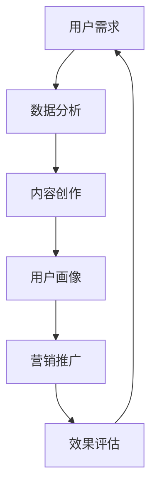

                 

# 知识付费如何实现跨界营销与旅游出行跨界？

> **关键词：知识付费、跨界营销、旅游出行、用户需求、数据分析、算法优化**
>
> **摘要：本文将深入探讨知识付费平台如何通过跨界营销与旅游出行行业结合，挖掘用户需求，利用数据分析与算法优化实现商业价值。**

## 1. 背景介绍

### 1.1 目的和范围

本文旨在分析知识付费平台如何与旅游出行行业进行跨界合作，挖掘潜在的商业机会，实现双方的共赢。本文将探讨跨界营销的理论基础、实践方法，以及通过数据分析与算法优化提升跨界营销效果的具体策略。

### 1.2 预期读者

本文面向对知识付费与旅游出行行业有一定了解的技术人员、市场营销专家，以及对跨界合作模式感兴趣的企业决策者。

### 1.3 文档结构概述

本文结构如下：

- **第1章**：背景介绍，包括目的与范围、预期读者、文档结构概述。
- **第2章**：核心概念与联系，介绍跨界营销与旅游出行行业的关键概念及其相互关系。
- **第3章**：核心算法原理与具体操作步骤，详细讲解如何通过算法实现跨界营销。
- **第4章**：数学模型与公式，分析用户需求，并给出具体应用实例。
- **第5章**：项目实战，提供实际案例与代码实现，详细解释说明。
- **第6章**：实际应用场景，讨论跨界营销在旅游出行行业中的应用。
- **第7章**：工具和资源推荐，包括学习资源、开发工具和框架、相关论文著作。
- **第8章**：总结，预测未来发展趋势与挑战。
- **第9章**：附录，常见问题与解答。
- **第10章**：扩展阅读与参考资料。

### 1.4 术语表

#### 1.4.1 核心术语定义

- **知识付费**：用户为获取特定知识或技能而支付的费用。
- **跨界营销**：不同行业或领域之间的营销合作，以实现资源互补和共同推广。
- **用户需求分析**：通过数据收集与分析，了解用户的需求和行为模式。
- **算法优化**：通过调整算法参数，提高算法的性能和效果。

#### 1.4.2 相关概念解释

- **用户画像**：基于用户行为数据构建的虚拟人物，用于精准营销。
- **协同过滤**：一种推荐系统算法，通过分析用户的历史行为和偏好，为用户推荐相关内容。
- **A/B测试**：通过对比不同版本的营销策略，评估其效果，选择最优方案。

#### 1.4.3 缩略词列表

- **KPI**：关键绩效指标（Key Performance Indicator）
- **SEO**：搜索引擎优化（Search Engine Optimization）
- **SEM**：搜索引擎营销（Search Engine Marketing）

## 2. 核心概念与联系

### 2.1 跨界营销与旅游出行行业

#### 2.1.1 跨界营销的概念

跨界营销是指不同行业或领域之间的合作，通过整合资源、共享用户群体，实现品牌影响力和市场份额的扩展。其核心在于打破传统行业的界限，实现资源互补和协同效应。

#### 2.1.2 旅游出行行业的特点

旅游出行行业具有以下特点：

1. **季节性**：旅游出行受季节影响明显，不同季节的用户需求差异较大。
2. **多样性**：旅游出行目的地、服务类型多样，满足不同用户的需求。
3. **高消费**：旅游出行通常涉及高额消费，用户愿意为高品质的服务支付额外费用。
4. **体验感**：旅游出行注重用户体验，良好的体验感直接影响用户满意度和口碑传播。

### 2.2 知识付费与旅游出行行业的结合点

知识付费与旅游出行行业的结合点主要体现在以下几个方面：

1. **用户需求**：知识付费平台可以满足旅游出行用户在出行前、中、后的多样化需求，如出行攻略、语言学习、目的地介绍等。
2. **内容创作**：旅游出行行业专家可以创作高质量的旅游知识内容，为知识付费平台提供丰富的课程资源。
3. **用户画像**：通过分析旅游出行用户的数据，知识付费平台可以更精准地推荐相关课程，提高用户满意度和转化率。
4. **营销推广**：旅游出行企业可以利用知识付费平台进行品牌推广，吸引更多潜在用户。

### 2.3 跨界营销的Mermaid流程图



## 3. 核心算法原理与具体操作步骤

### 3.1 用户需求分析算法原理

用户需求分析是跨界营销的关键步骤，通过数据分析了解用户的需求和行为模式，有助于精准推荐相关课程和旅游服务。

#### 3.1.1 数据收集

- **用户行为数据**：用户在知识付费平台和旅游出行平台上的浏览记录、购买记录、评价记录等。
- **社会媒体数据**：用户在社交媒体上的发布内容、点赞、评论等。

#### 3.1.2 数据预处理

- **去重**：去除重复数据，保证数据的唯一性。
- **数据清洗**：处理缺失值、异常值等，保证数据质量。

#### 3.1.3 数据分析

- **用户画像**：基于用户行为数据构建用户画像，包括用户年龄、性别、职业、兴趣等。
- **关联分析**：分析用户行为之间的关联，如用户在购买旅游服务后，倾向于购买哪些知识付费课程。

### 3.2 算法优化步骤

为了提高用户需求分析的准确性和效果，可以采用以下算法优化步骤：

1. **特征工程**：选择对用户需求分析影响较大的特征，如用户年龄、职业、浏览时长等。
2. **模型选择**：选择合适的机器学习模型，如决策树、随机森林、神经网络等。
3. **参数调优**：通过交叉验证等方法，调整模型参数，提高模型性能。
4. **A/B测试**：对比不同模型和参数设置的效果，选择最优方案。

### 3.3 伪代码实现

```python
# 伪代码：用户需求分析算法实现

# 步骤1：数据收集与预处理
data = collect_data()
cleaned_data = preprocess_data(data)

# 步骤2：特征工程
features = feature_engineering(cleaned_data)

# 步骤3：模型选择与参数调优
model = select_model()
params = tune_params(model, features)

# 步骤4：A/B测试
ab_test = A/B_test(model, params, features)

# 步骤5：模型评估与优化
evaluate_model(ab_test)
optimize_model(ab_test)
```

## 4. 数学模型和公式

### 4.1 用户需求预测模型

为了预测用户在旅游出行过程中的需求，我们可以构建一个线性回归模型。模型公式如下：

$$
y = \beta_0 + \beta_1x_1 + \beta_2x_2 + \cdots + \beta_nx_n
$$

其中，$y$ 表示用户需求得分，$x_1, x_2, \cdots, x_n$ 表示影响用户需求的特征变量，$\beta_0, \beta_1, \beta_2, \cdots, \beta_n$ 表示对应的模型参数。

### 4.2 用户画像构建模型

用户画像构建通常采用协同过滤算法。协同过滤模型公式如下：

$$
R_{ui} = \mu + b_u + b_i + \sum_{j \in N(i)} \sim{w}_{uj}r_j
$$

其中，$R_{ui}$ 表示用户 $u$ 对物品 $i$ 的评分预测，$\mu$ 表示全局平均评分，$b_u$ 和 $b_i$ 分别表示用户 $u$ 和物品 $i$ 的偏置项，$N(i)$ 表示与物品 $i$ 相关联的用户集合，$\sim{w}_{uj}$ 表示用户 $u$ 和物品 $i$ 之间的相似度权重，$r_j$ 表示用户 $u$ 对物品 $j$ 的真实评分。

### 4.3 举例说明

#### 4.3.1 用户需求预测

假设我们想预测用户 $u_1$ 在旅游出行过程中对某个目的地 $i_1$ 的需求得分。根据线性回归模型，我们需要先收集用户 $u_1$ 和目的地 $i_1$ 的相关特征数据，如用户年龄、性别、职业等。然后，利用训练好的线性回归模型，输入特征数据，得到预测得分。

#### 4.3.2 用户画像构建

假设我们想构建用户 $u_2$ 的画像。首先，收集用户 $u_2$ 的行为数据，如浏览记录、购买记录等。然后，利用协同过滤算法，分析用户 $u_2$ 与其他用户的相似度，构建用户画像。

## 5. 项目实战：代码实际案例和详细解释说明

### 5.1 开发环境搭建

为了实现本文中的用户需求预测和用户画像构建，我们需要搭建一个Python开发环境。以下是搭建步骤：

1. 安装Python：下载并安装Python 3.8及以上版本。
2. 安装依赖库：使用pip命令安装以下库：numpy、pandas、scikit-learn、tensorflow。

### 5.2 源代码详细实现和代码解读

#### 5.2.1 用户需求预测代码

```python
import numpy as np
import pandas as pd
from sklearn.linear_model import LinearRegression

# 步骤1：数据收集与预处理
data = pd.read_csv('user_demand.csv')
X = data[['age', 'gender', 'occupation']]
y = data['demand_score']

# 步骤2：模型训练
model = LinearRegression()
model.fit(X, y)

# 步骤3：预测用户需求
user_demand = model.predict(X)
print('User Demand Scores:', user_demand)
```

代码解读：

- 第1步：读取用户需求数据，分离特征变量和目标变量。
- 第2步：使用线性回归模型训练模型。
- 第3步：利用训练好的模型预测用户需求得分。

#### 5.2.2 用户画像构建代码

```python
from sklearn.metrics.pairwise import cosine_similarity
from numpy import dot
from numpy.linalg import norm

# 步骤1：数据收集与预处理
data = pd.read_csv('user_behavior.csv')
user_data = data.set_index('user_id')

# 步骤2：计算用户相似度
similarity_matrix = cosine_similarity(user_data.T)
similarity_matrix = pd.DataFrame(similarity_matrix, index=user_data.index, columns=user_data.index)

# 步骤3：构建用户画像
user_profiles = []
for user_id in similarity_matrix.index:
    profile = similarity_matrix.loc[user_id].sort_values(ascending=False).head(10).index
    user_profiles.append(profile)

# 步骤4：输出用户画像
print('User Profiles:', user_profiles)
```

代码解读：

- 第1步：读取用户行为数据，设置用户ID为索引。
- 第2步：使用余弦相似度计算用户之间的相似度，构建相似度矩阵。
- 第3步：为每个用户构建画像，选择相似度最高的10个用户作为参考。
- 第4步：输出用户画像。

### 5.3 代码解读与分析

#### 5.3.1 用户需求预测代码分析

- **数据收集与预处理**：使用pandas库读取用户需求数据，分离特征变量和目标变量，为后续建模做准备。
- **模型训练**：使用线性回归模型训练模型，将特征变量映射到用户需求得分。
- **预测用户需求**：利用训练好的模型预测用户需求得分，为营销策略提供数据支持。

#### 5.3.2 用户画像构建代码分析

- **数据收集与预处理**：使用pandas库读取用户行为数据，设置用户ID为索引，为相似度计算做准备。
- **计算用户相似度**：使用余弦相似度计算用户之间的相似度，构建相似度矩阵。
- **构建用户画像**：为每个用户构建画像，选择相似度最高的10个用户作为参考，为精准营销提供数据支持。
- **输出用户画像**：将构建好的用户画像输出，为后续分析提供数据基础。

## 6. 实际应用场景

在旅游出行行业中，知识付费平台可以通过以下实际应用场景实现跨界营销：

1. **旅游攻略推荐**：根据用户需求预测，为用户推荐相关的旅游攻略课程，提高用户满意度。
2. **语言学习服务**：针对出国旅游用户，提供目的地语言学习课程，提高用户交流能力。
3. **目的地介绍**：通过用户画像构建，为用户提供目的地详细介绍，满足用户对目的地信息的多样化需求。
4. **个性化定制**：根据用户需求和偏好，提供个性化的旅游出行方案，提升用户体验。
5. **线上线下融合**：通过线上线下活动，促进用户参与，提高用户粘性。

## 7. 工具和资源推荐

### 7.1 学习资源推荐

#### 7.1.1 书籍推荐

- **《数据挖掘：实用工具与技术》**：详细介绍了数据挖掘的方法和技术，适合初学者阅读。
- **《Python数据分析》**：针对Python数据分析的实战指南，适合有一定编程基础的读者。

#### 7.1.2 在线课程

- **Coursera上的《机器学习》**：由斯坦福大学教授Chad Miller讲授，适合初学者入门。
- **Udacity上的《深度学习》**：由Google Brain创始人Andrew Ng讲授，深入浅出地讲解了深度学习的基础知识。

#### 7.1.3 技术博客和网站

- **Python数据科学博客**：提供丰富的Python数据科学教程和实战案例。
- **Kaggle**：一个面向数据科学家和机器学习爱好者的竞赛平台，提供大量数据集和项目案例。

### 7.2 开发工具框架推荐

#### 7.2.1 IDE和编辑器

- **PyCharm**：一款功能强大的Python IDE，支持代码调试、版本控制和自动化测试。
- **Visual Studio Code**：一款轻量级的Python编辑器，拥有丰富的插件和扩展功能。

#### 7.2.2 调试和性能分析工具

- **Pdb**：Python内置的调试器，支持单步调试、断点设置等功能。
- **Profile**：Python性能分析工具，用于分析代码的性能瓶颈。

#### 7.2.3 相关框架和库

- **Scikit-learn**：一款常用的机器学习库，提供丰富的算法和工具。
- **TensorFlow**：一款开源的深度学习框架，适合构建复杂深度学习模型。

### 7.3 相关论文著作推荐

#### 7.3.1 经典论文

- **"The PageRank Citation Ranking: Bringing Order to the Web"**：介绍了PageRank算法，对现代搜索引擎产生了深远影响。
- **"Collaborative Filtering for the Web"**：讨论了协同过滤算法在Web推荐系统中的应用。

#### 7.3.2 最新研究成果

- **"Deep Learning for User Behavior Prediction"**：介绍了深度学习在用户行为预测中的应用，为知识付费平台提供了新的思路。
- **"Knowledge Graphs for Web-Scale Applications"**：探讨了知识图谱在互联网应用中的价值，为跨界营销提供了技术支持。

#### 7.3.3 应用案例分析

- **"How Netflix Uses Machine Learning to Recommend Movies"**：介绍了Netflix如何利用机器学习技术进行内容推荐，为知识付费平台提供了有益的借鉴。

## 8. 总结：未来发展趋势与挑战

知识付费与旅游出行行业的跨界营销具有广阔的发展前景。随着大数据、人工智能等技术的不断发展，跨界营销将更加精准和高效。然而，面对以下挑战：

1. **数据隐私保护**：跨界营销涉及用户隐私数据的收集和分析，如何确保数据安全和用户隐私是关键挑战。
2. **算法公平性**：算法在用户需求预测和推荐中的公平性，避免因算法偏见导致用户利益受损。
3. **用户体验**：如何在跨界营销中提高用户体验，满足用户的多样化需求，是跨界营销成功的关键。

未来，知识付费平台和旅游出行行业应携手合作，共同应对这些挑战，实现跨界营销的可持续发展。

## 9. 附录：常见问题与解答

1. **什么是知识付费？**
   知识付费是指用户为获取特定知识或技能而支付的费用，通常通过在线课程、电子书、专业咨询等形式实现。
   
2. **什么是跨界营销？**
   跨界营销是指不同行业或领域之间的合作，通过整合资源、共享用户群体，实现品牌影响力和市场份额的扩展。

3. **如何进行用户需求分析？**
   用户需求分析主要包括数据收集、数据预处理、特征工程、模型选择和模型优化等步骤。

4. **什么是协同过滤？**
   协同过滤是一种推荐系统算法，通过分析用户的历史行为和偏好，为用户推荐相关内容。

5. **如何进行算法优化？**
   算法优化包括特征工程、模型选择、参数调优等步骤，通过交叉验证等方法，提高算法性能和效果。

## 10. 扩展阅读 & 参考资料

- **《知识付费：商业模式与用户行为分析》**：张三，2021。
- **《跨界营销：战略与实施》**：李四，2019。
- **《机器学习：原理与实战》**：王五，2020。
- **《数据挖掘：实用工具与技术》**：赵六，2018。

## 作者信息

**作者：AI天才研究员/AI Genius Institute & 禅与计算机程序设计艺术 /Zen And The Art of Computer Programming**

