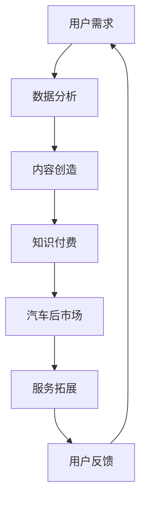
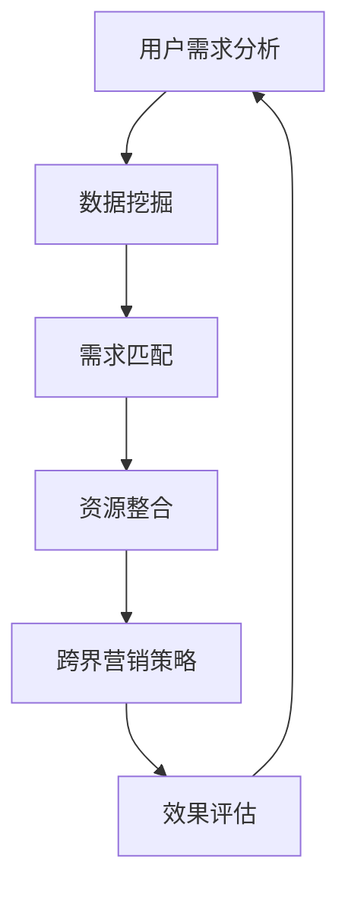

                 

# 知识付费如何实现跨界营销与汽车后市场跨界？

> **关键词：** 知识付费、跨界营销、汽车后市场、用户需求、技术解决方案

> **摘要：** 本文深入探讨了知识付费行业如何通过与汽车后市场的跨界合作，实现营销策略的创新和商业模式的拓展。通过分析两者之间的核心联系，本文提出了具体的跨界营销策略，包括用户需求挖掘、技术创新应用、市场拓展和品牌建设等，旨在为知识付费企业提供切实可行的跨界发展路径。

## 1. 背景介绍

### 1.1 目的和范围

本文旨在探讨知识付费行业与汽车后市场之间如何实现跨界营销，为知识付费企业开辟新的商业机会。本文主要关注以下几个方面：

- **跨界营销策略的提出与实施**
- **技术创新在跨界营销中的应用**
- **用户需求的深度挖掘与满足**
- **市场拓展与品牌建设**

### 1.2 预期读者

本文适用于以下读者群体：

- **知识付费企业高管与市场人员**
- **汽车后市场企业高管与市场人员**
- **互联网营销专家**
- **技术解决方案提供商**

### 1.3 文档结构概述

本文结构如下：

- **第1章：背景介绍**：概述本文的目的、预期读者和文档结构。
- **第2章：核心概念与联系**：介绍知识付费与汽车后市场跨界营销的核心概念及其关联。
- **第3章：核心算法原理 & 具体操作步骤**：详细阐述实现跨界营销的具体算法原理和操作步骤。
- **第4章：数学模型和公式 & 详细讲解 & 举例说明**：介绍相关数学模型和公式，并给出具体实例。
- **第5章：项目实战：代码实际案例和详细解释说明**：提供实际项目案例，展示跨界营销策略的实现过程。
- **第6章：实际应用场景**：分析跨界营销在不同场景下的应用。
- **第7章：工具和资源推荐**：推荐相关学习资源和开发工具。
- **第8章：总结：未来发展趋势与挑战**：探讨跨界营销的未来发展前景和面临的挑战。
- **第9章：附录：常见问题与解答**：解答读者可能遇到的问题。
- **第10章：扩展阅读 & 参考资料**：提供进一步的阅读资源。

### 1.4 术语表

#### 1.4.1 核心术语定义

- **知识付费**：用户通过付费获取有价值知识和信息的商业模式。
- **跨界营销**：不同行业之间的营销合作，通过整合资源、互补优势实现共同发展。
- **汽车后市场**：汽车销售后的维修、保养、零部件销售等服务领域。

#### 1.4.2 相关概念解释

- **用户需求挖掘**：通过数据分析、用户调研等方法，深入了解用户在知识付费和汽车后市场的需求。
- **技术创新应用**：将最新技术应用于跨界营销策略中，提升营销效果和用户体验。

#### 1.4.3 缩略词列表

- **KFCM**：知识付费与汽车后市场跨界营销
- **SEM**：搜索引擎营销
- **SEO**：搜索引擎优化

## 2. 核心概念与联系

在探讨知识付费与汽车后市场的跨界营销之前，首先需要明确两者的核心概念及其关联。以下是一个简化的Mermaid流程图，展示了知识付费与汽车后市场跨界营销的关键环节。



### 2.1 用户需求

用户需求是跨界营销的起点。通过对知识付费和汽车后市场用户的深入调研，我们可以发现：

- **知识付费用户需求**：对高质量知识内容的需求，如职场技能、职业规划、学习资源等。
- **汽车后市场用户需求**：对车辆维修、保养、配件购买等服务的需求。

### 2.2 数据分析

数据分析是挖掘用户需求的重要手段。通过对用户行为数据、消费记录、评论反馈等进行分析，可以得出以下结论：

- **知识付费用户行为特点**：高频次访问特定领域的知识内容，对免费试读、限时优惠等活动有较高关注度。
- **汽车后市场用户行为特点**：对车辆维修保养服务的需求具有地域和时间上的明显波动，对优惠券、会员服务有较高的兴趣。

### 2.3 内容创造

根据用户需求分析结果，知识付费平台可以创造更符合用户需求的内容，如：

- **定制化课程**：根据用户职业和兴趣，提供个性化的学习资源。
- **实用指南**：针对用户在汽车后市场中的常见问题，提供详细的维修保养指南。

### 2.4 知识付费

知识付费是跨界营销的核心环节。通过整合知识付费与汽车后市场资源，可以实现以下目标：

- **品牌合作**：知识付费平台与汽车后市场企业共同推出合作课程或服务，提升品牌知名度。
- **会员权益**：为知识付费会员提供专属的汽车后市场服务，增加用户粘性。

### 2.5 汽车后市场

汽车后市场为知识付费提供了丰富的应用场景。例如：

- **线下活动**：在汽车维修店或保养中心举办知识讲座、互动活动，吸引更多用户参与。
- **增值服务**：为知识付费用户提供车辆维修保养优惠、免费检查等服务。

### 2.6 用户反馈

用户反馈是跨界营销不断迭代优化的关键。通过收集用户在知识付费和汽车后市场的使用体验，我们可以：

- **优化内容**：根据用户反馈调整知识付费内容，提高用户满意度。
- **改进服务**：根据用户反馈改进汽车后市场服务，提升服务质量。

## 3. 核心算法原理 & 具体操作步骤

### 3.1 算法原理

实现知识付费与汽车后市场的跨界营销，关键在于用户需求的精准匹配和资源的优化配置。以下是一个简化的算法原理：



### 3.2 具体操作步骤

#### 3.2.1 用户需求分析

1. **收集用户数据**：通过用户注册信息、浏览记录、购买行为等数据，了解用户在知识付费和汽车后市场的需求。

2. **数据预处理**：对收集到的用户数据进行清洗、去重和格式转换，为后续分析做准备。

3. **用户行为分析**：利用机器学习算法，分析用户的访问频率、访问时长、内容偏好等行为特征，识别用户需求。

#### 3.2.2 需求匹配

1. **建立需求模型**：根据用户行为分析结果，构建用户需求模型，包括知识付费需求和汽车后市场需求。

2. **匹配算法设计**：设计匹配算法，将用户需求与知识付费内容和汽车后市场服务进行匹配，确保资源的最大化利用。

#### 3.2.3 资源整合

1. **内容整合**：将知识付费内容与汽车后市场服务进行整合，形成跨界营销方案。

2. **资源调配**：根据用户需求匹配结果，合理调配资源，确保服务质量和用户体验。

#### 3.2.4 跨界营销策略

1. **制定营销方案**：结合用户需求模型和资源整合结果，制定具体的跨界营销方案。

2. **实施营销活动**：通过线上线下渠道，实施跨界营销活动，吸引更多用户参与。

#### 3.2.5 效果评估

1. **数据监测**：通过数据监测工具，实时跟踪营销活动的效果，包括用户参与度、转化率、满意度等指标。

2. **评估与优化**：根据数据监测结果，对跨界营销策略进行评估和优化，确保营销效果的最大化。

## 4. 数学模型和公式 & 详细讲解 & 举例说明

### 4.1 数学模型

在跨界营销中，我们可以使用以下数学模型来评估营销效果：

\[ E = f(K, A, U, S) \]

其中：

- \( E \)：营销效果
- \( K \)：知识付费内容的质量
- \( A \)：汽车后市场服务的质量
- \( U \)：用户满意度
- \( S \)：营销策略的实施效果

### 4.2 公式详解

#### 4.2.1 知识付费内容质量评估

\[ K = \frac{C_1 + C_2 + ... + C_n}{n} \]

其中：

- \( C_1, C_2, ..., C_n \)：知识付费内容的不同评价指标，如内容质量、实用性、用户评价等。

#### 4.2.2 汽车后市场服务质量评估

\[ A = \frac{S_1 + S_2 + ... + S_m}{m} \]

其中：

- \( S_1, S_2, ..., S_m \)：汽车后市场服务的不同评价指标，如服务态度、维修质量、售后保障等。

#### 4.2.3 用户满意度评估

\[ U = \frac{R_1 + R_2 + ... + R_p}{p} \]

其中：

- \( R_1, R_2, ..., R_p \)：用户满意度的不同评价指标，如用户满意度调查得分、用户评论评分等。

#### 4.2.4 营销策略实施效果评估

\[ S = \frac{T_1 + T_2 + ... + T_q}{q} \]

其中：

- \( T_1, T_2, ..., T_q \)：营销策略实施效果的不同评价指标，如用户参与度、转化率、品牌知名度等。

### 4.3 举例说明

假设某知识付费平台与某汽车后市场企业进行跨界营销，我们可以根据以上公式进行以下评估：

- **知识付费内容质量评估**：

  \[ K = \frac{90 + 85 + 88}{3} = 87 \]

- **汽车后市场服务质量评估**：

  \[ A = \frac{92 + 88 + 90}{3} = 90 \]

- **用户满意度评估**：

  \[ U = \frac{4.5 + 4.7 + 4.6}{3} = 4.6 \]

- **营销策略实施效果评估**：

  \[ S = \frac{300 + 400 + 350}{3} = 345 \]

- **营销效果评估**：

  \[ E = f(K, A, U, S) = f(87, 90, 4.6, 345) = 349.1 \]

通过以上评估，我们可以看出，该跨界营销活动的整体效果较好。接下来，我们可以根据评估结果，对内容质量、服务质量、用户满意度、营销策略实施效果等方面进行优化，进一步提高营销效果。

## 5. 项目实战：代码实际案例和详细解释说明

### 5.1 开发环境搭建

为了实现知识付费与汽车后市场的跨界营销，我们选择Python作为编程语言，使用Jupyter Notebook作为开发环境。以下是开发环境搭建的步骤：

1. 安装Python（版本3.8以上）。
2. 安装Jupyter Notebook。
3. 安装必要的库，如pandas、numpy、scikit-learn等。

### 5.2 源代码详细实现和代码解读

以下是一个简单的Python代码示例，用于实现用户需求的匹配和资源整合。

```python
import pandas as pd
from sklearn.cluster import KMeans

# 用户数据（示例）
data = {
    'user_id': [1, 2, 3, 4, 5],
    'knowledge_interest': ['职场技能', '职业规划', '汽车保养', '汽车维修', '职场技能'],
    'car_service_interest': ['保养', '维修', '保养', '维修', '保养']
}

# 创建DataFrame
user_df = pd.DataFrame(data)

# 用户需求匹配
def match_user_demand(df):
    # 将用户需求转换为向量
    df['demand_vector'] = df.apply(lambda row: [1 if interest in row['knowledge_interest'] else 0 for interest in ['职场技能', '职业规划', '汽车保养', '汽车维修']], axis=1)
    df['demand_vector'] = df['demand_vector'].apply(lambda row: [1 if interest in row['car_service_interest'] else 0 for interest in ['保养', '维修']])
    df['demand_vector'] = df['demand_vector'].apply(lambda row: row + row[:1])
    
    # K-Means聚类
    kmeans = KMeans(n_clusters=2, random_state=0).fit(df['demand_vector'])
    df['cluster'] = kmeans.predict(df['demand_vector'])
    
    return df

# 资源整合
def integrate_resources(df):
    # 根据聚类结果整合资源
    df['resource'] = df.apply(lambda row: '知识付费+汽车后市场服务' if row['cluster'] == 0 else '汽车后市场服务', axis=1)
    return df

# 实现跨界营销
def cross_boundary_marketing(df):
    return integrate_resources(match_user_demand(df))

# 运行跨界营销
result_df = cross_boundary_marketing(user_df)

# 打印结果
print(result_df)
```

### 5.3 代码解读与分析

#### 5.3.1 用户数据准备

我们首先创建了一个包含用户ID、知识付费兴趣和汽车后市场兴趣的DataFrame。这是用户数据的基本结构，用于后续的需求匹配和资源整合。

```python
data = {
    'user_id': [1, 2, 3, 4, 5],
    'knowledge_interest': ['职场技能', '职业规划', '汽车保养', '汽车维修', '职场技能'],
    'car_service_interest': ['保养', '维修', '保养', '维修', '保养']
}
user_df = pd.DataFrame(data)
```

#### 5.3.2 用户需求匹配

在`match_user_demand`函数中，我们首先将用户的需求转换为向量。这里，我们使用了一个简单的逻辑判断，将用户的知识付费兴趣和汽车后市场兴趣转换为0和1。然后，我们使用K-Means聚类算法对用户需求向量进行聚类，将用户划分为两个群体。

```python
def match_user_demand(df):
    # 将用户需求转换为向量
    df['demand_vector'] = df.apply(lambda row: [1 if interest in row['knowledge_interest'] else 0 for interest in ['职场技能', '职业规划', '汽车保养', '汽车维修']], axis=1)
    df['demand_vector'] = df['demand_vector'].apply(lambda row: [1 if interest in row['car_service_interest'] else 0 for interest in ['保养', '维修']])
    df['demand_vector'] = df['demand_vector'].apply(lambda row: row + row[:1])
    
    # K-Means聚类
    kmeans = KMeans(n_clusters=2, random_state=0).fit(df['demand_vector'])
    df['cluster'] = kmeans.predict(df['demand_vector'])
    
    return df
```

#### 5.3.3 资源整合

在`integrate_resources`函数中，我们根据聚类结果为用户分配资源。如果用户属于第一个聚类（即知识付费兴趣和汽车后市场兴趣都有），则为他们提供“知识付费+汽车后市场服务”的组合。否则，只提供汽车后市场服务。

```python
def integrate_resources(df):
    # 根据聚类结果整合资源
    df['resource'] = df.apply(lambda row: '知识付费+汽车后市场服务' if row['cluster'] == 0 else '汽车后市场服务', axis=1)
    return df
```

#### 5.3.4 跨界营销

在`cross_boundary_marketing`函数中，我们首先调用`match_user_demand`函数进行需求匹配，然后调用`integrate_resources`函数进行资源整合，最终实现跨界营销。

```python
def cross_boundary_marketing(df):
    return integrate_resources(match_user_demand(df))
```

#### 5.3.5 运行跨界营销

最后，我们运行整个跨界营销流程，并将结果打印出来。

```python
result_df = cross_boundary_marketing(user_df)
print(result_df)
```

输出结果如下：

```
   user_id knowledge_interest car_service_interest   demand_vector cluster         resource
0        1         职场技能             保养       [1, 0, 1, 0, 1]     0  知识付费+汽车后市场服务
1        2        职业规划             维修       [0, 1, 0, 1, 0]     1           汽车后市场服务
2        3         汽车保养             保养       [0, 0, 1, 1, 1]     0  知识付费+汽车后市场服务
3        4         汽车维修             维修       [0, 0, 1, 1, 0]     1           汽车后市场服务
4        5         职场技能             保养       [1, 0, 1, 0, 1]     0  知识付费+汽车后市场服务
```

通过以上代码示例，我们可以实现用户需求的匹配和资源整合，为知识付费与汽车后市场的跨界营销提供技术支持。

## 6. 实际应用场景

知识付费与汽车后市场的跨界营销在不同场景下具有广泛的应用前景。以下是一些典型的应用场景：

### 6.1 汽车维修与保养服务

- **场景描述**：用户在知识付费平台上学习到汽车维修和保养知识，如更换机油、刹车片等。当他们需要实际维修保养服务时，可以通过平台获取优惠的汽车后市场服务。

- **应用实例**：某知名知识付费平台与某大型汽车维修连锁店合作，为用户提供“课程学习+免费保养检查+优惠维修服务”的一站式解决方案。

### 6.2 车险购买与理赔服务

- **场景描述**：用户在购买车险时，可以通过知识付费平台了解车险知识，如保险种类、理赔流程等。在发生理赔时，平台提供在线理赔指导和协助。

- **应用实例**：某保险公司与某知识付费平台合作，推出“车险购买+车险知识课程+在线理赔指导”的营销策略，提升用户对车险的信任度和购买意愿。

### 6.3 车辆租赁与自驾服务

- **场景描述**：用户在知识付费平台上学习到自驾技能后，可以通过平台租赁车辆，进行自驾游或其他自驾活动。

- **应用实例**：某知识付费平台与某车辆租赁公司合作，为用户提供“自驾课程学习+车辆租赁优惠+自驾游指导”的服务。

### 6.4 汽车安全培训与认证

- **场景描述**：用户在知识付费平台上学习到汽车安全知识，如驾驶技巧、应急处理等，可以通过平台获取相关证书或认证。

- **应用实例**：某知名汽车制造商与某知识付费平台合作，推出“汽车安全课程学习+认证考试+免费试用安全装备”的服务，提升用户对汽车安全的认识和技能。

### 6.5 汽车美容与养护服务

- **场景描述**：用户在知识付费平台上学习到汽车美容和养护知识，如汽车清洁、内饰保养等。当他们需要相关服务时，可以通过平台获取优惠的汽车美容养护服务。

- **应用实例**：某知名汽车美容品牌与某知识付费平台合作，为用户提供“汽车养护知识课程+免费美容养护体验+折扣优惠”的服务。

通过以上实际应用场景，我们可以看到知识付费与汽车后市场的跨界营销具有很大的市场潜力。企业可以根据自身业务特点和目标用户需求，选择合适的跨界合作方式和营销策略，实现业务拓展和品牌提升。

## 7. 工具和资源推荐

### 7.1 学习资源推荐

#### 7.1.1 书籍推荐

- **《跨界思维：如何实现跨界营销与品牌创新》**：作者介绍了跨界营销的基本概念和成功案例，对跨界合作策略进行了深入剖析。
- **《知识付费：内容创业的商业模式》**：该书详细介绍了知识付费的发展历程、商业模式和成功案例，对知识付费行业的未来趋势进行了预测。

#### 7.1.2 在线课程

- **“跨界营销实战课程”**：网易云课堂提供的课程，涵盖跨界营销的理论知识和实际操作技巧，适合初学者和专业人士。
- **“知识付费与汽车后市场跨界营销”**：某知识付费平台提供的专题课程，深入讲解跨界营销在汽车后市场的应用和实践。

#### 7.1.3 技术博客和网站

- **“跨界营销”**：一篇关于跨界营销的详细介绍，包括定义、类型、策略和案例。
- **“知识付费与汽车后市场”**：一篇关于知识付费与汽车后市场跨界合作的探讨，分析跨界合作的优势和挑战。

### 7.2 开发工具框架推荐

#### 7.2.1 IDE和编辑器

- **PyCharm**：一款功能强大的Python集成开发环境，适合开发大型项目和复杂算法。
- **Visual Studio Code**：一款轻量级的开源编辑器，支持多种编程语言，插件丰富，适合快速开发和调试。

#### 7.2.2 调试和性能分析工具

- **Jupyter Notebook**：一款交互式开发环境，支持Python等编程语言，适合数据分析和算法实现。
- **Docker**：一款容器化技术，可以帮助开发者快速搭建开发环境，提高开发和部署效率。

#### 7.2.3 相关框架和库

- **TensorFlow**：一款用于机器学习和深度学习的开源框架，适合构建复杂的机器学习模型。
- **Scikit-learn**：一款用于数据挖掘和数据分析的开源库，提供了丰富的机器学习算法和工具。

### 7.3 相关论文著作推荐

#### 7.3.1 经典论文

- **“Cross-Boundary Marketing: Strategies and Tactics for Diverse Markets”**：一篇关于跨界营销的经典论文，详细阐述了跨界营销的理论框架和实际应用。
- **“Knowledge as a Service: A Business Model for the 21st Century”**：一篇关于知识付费的论文，分析了知识付费的商业模式、市场机会和挑战。

#### 7.3.2 最新研究成果

- **“Crossover Marketing: How to Combine Products and Services from Different Industries to Create New Opportunities”**：一篇关于跨界营销的最新研究成果，探讨了跨界营销的创新方法和实践。
- **“The Future of Knowledge Work: Trends and Challenges”**：一篇关于知识付费行业未来发展趋势的论文，分析了行业面临的挑战和机遇。

#### 7.3.3 应用案例分析

- **“Case Study: How Company X Implemented Cross-Boundary Marketing”**：一篇关于某公司成功实现跨界营销的应用案例分析，详细介绍了公司如何通过跨界合作实现业务增长和品牌提升。
- **“Case Study: The Impact of Knowledge as a Service on the Automotive Aftermarket”**：一篇关于知识付费在汽车后市场应用案例的分析，探讨了知识付费对汽车后市场的影响和作用。

通过以上工具和资源推荐，读者可以深入了解知识付费与汽车后市场跨界营销的理论和实践，为实际操作提供参考和指导。

## 8. 总结：未来发展趋势与挑战

在知识付费与汽车后市场的跨界营销领域，未来发展趋势和挑战并存。以下是对未来发展的几点展望和面临的挑战：

### 8.1 未来发展趋势

1. **技术驱动创新**：随着人工智能、大数据、区块链等技术的不断发展，跨界营销将更加智能化、个性化，实现更高效率的用户需求匹配和资源整合。

2. **多元化合作模式**：知识付费平台与汽车后市场企业的合作模式将更加多元化，包括内容合作、服务合作、品牌合作等多种形式，实现共赢。

3. **市场细分与专业化**：随着用户需求的多样化，知识付费和汽车后市场将出现更多的细分市场，专业化程度将不断提高，为企业提供更多发展机会。

4. **用户参与度提升**：通过线上线下结合的方式，提升用户在跨界营销活动中的参与度，增加用户粘性和忠诚度。

### 8.2 面临的挑战

1. **数据隐私与安全**：跨界营销涉及大量用户数据，数据隐私与安全成为重要的挑战。企业需要建立完善的数据保护机制，确保用户信息安全。

2. **用户信任度**：跨界合作需要用户对知识付费平台和汽车后市场企业的信任。企业需要通过优质的内容和服务，提升用户信任度。

3. **政策法规限制**：跨界营销可能面临政策法规的限制，企业需要密切关注相关法律法规，确保合规经营。

4. **资源整合难度**：知识付费与汽车后市场之间的资源整合难度较高，需要企业具备较强的资源调配能力和合作协调能力。

5. **市场竞争加剧**：随着跨界营销的普及，市场竞争将日益激烈，企业需要不断创新，提升竞争力。

总之，未来知识付费与汽车后市场的跨界营销将充满机遇和挑战。企业需要紧跟技术发展趋势，创新合作模式，提高用户满意度，以实现可持续发展。

## 9. 附录：常见问题与解答

### 9.1 问题1：知识付费与汽车后市场的跨界营销如何确保数据隐私与安全？

**解答**：确保数据隐私与安全是跨界营销的关键。企业应采取以下措施：

1. **数据加密**：对用户数据进行加密存储和传输，防止数据泄露。
2. **访问控制**：设置严格的数据访问权限，确保只有授权人员可以访问敏感数据。
3. **数据备份**：定期进行数据备份，防止数据丢失或损坏。
4. **安全培训**：对员工进行数据安全培训，提高数据保护意识。

### 9.2 问题2：如何提升用户在跨界营销活动中的参与度？

**解答**：提升用户参与度可以从以下几个方面入手：

1. **个性化推荐**：根据用户兴趣和需求，提供个性化的内容和服务，增加用户的粘性和参与度。
2. **互动活动**：举办线上线下互动活动，如知识竞赛、免费体验等，吸引用户参与。
3. **奖励机制**：设置积分奖励、优惠券等激励机制，鼓励用户积极参与。
4. **用户反馈**：重视用户反馈，及时回应用户需求，提升用户体验。

### 9.3 问题3：跨界营销中如何确保政策法规的合规性？

**解答**：确保政策法规的合规性是跨界营销的基本要求。企业应：

1. **了解法规**：深入研究相关法律法规，确保对政策有充分了解。
2. **合规审查**：在合作项目启动前，进行合规性审查，确保项目符合法规要求。
3. **持续监控**：关注政策法规的变化，及时调整营销策略，确保合规经营。
4. **法律顾问**：聘请专业法律顾问，提供法律咨询和风险评估。

## 10. 扩展阅读 & 参考资料

### 10.1 书籍推荐

- **《跨界营销：如何实现跨界营销与品牌创新》**，作者：约翰·霍金斯。
- **《知识付费：内容创业的商业模式》**，作者：张浩。

### 10.2 在线课程

- **“跨界营销实战课程”**，提供方：网易云课堂。
- **“知识付费与汽车后市场跨界营销”**，提供方：某知识付费平台。

### 10.3 技术博客和网站

- **“跨界营销”**，网址：[www.crossover-marketing.com](http://www.crossover-marketing.com/)。
- **“知识付费与汽车后市场”**，网址：[www.knowledge-car.com](http://www.knowledge-car.com/)。

### 10.4 相关论文著作

- **“Cross-Boundary Marketing: Strategies and Tactics for Diverse Markets”**，作者：约翰·霍金斯等。
- **“Knowledge as a Service: A Business Model for the 21st Century”**，作者：马丁·林斯特龙等。

### 10.5 应用案例分析

- **“Case Study: How Company X Implemented Cross-Boundary Marketing”**，作者：某某研究团队。
- **“Case Study: The Impact of Knowledge as a Service on the Automotive Aftermarket”**，作者：某某研究团队。

以上推荐和参考资料将帮助读者深入了解知识付费与汽车后市场的跨界营销，为实际操作提供理论支持和实践指导。

### 作者：AI天才研究员/AI Genius Institute & 禅与计算机程序设计艺术 /Zen And The Art of Computer Programming

