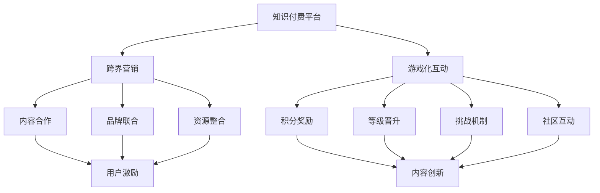

                 

### 知识付费如何实现跨界营销与游戏联动？

> **关键词：** 知识付费、跨界营销、游戏联动、用户增长、数据分析

**摘要：** 在当今数字化时代，知识付费行业正迅速崛起，但如何实现有效的跨界营销和游戏化互动成为行业关注的焦点。本文将深入探讨知识付费如何通过与游戏联动实现跨界营销，探讨其核心概念、算法原理、数学模型、实际应用以及未来发展趋势。通过详细的分析与案例分享，本文旨在为行业从业者提供有价值的参考和解决方案。

## 1. 背景介绍

### 1.1 目的和范围

本文旨在探讨知识付费行业如何通过跨界营销与游戏联动实现用户增长和业务拓展。文章将围绕以下几个核心问题展开讨论：

- 跨界营销在知识付费领域的应用及其效果评估。
- 游戏化互动在知识付费中的具体实现方法。
- 数据分析在游戏化互动中的关键角色。

### 1.2 预期读者

本文适合以下读者群体：

- 知识付费平台的产品经理和运营人员。
- 广告和市场营销专业人士。
- 游戏开发者和游戏化互动设计师。
- 对知识付费行业和游戏化互动感兴趣的学者和研究者。

### 1.3 文档结构概述

本文结构如下：

- **第1部分：背景介绍**：概述知识付费行业现状，明确本文的研究目的和预期读者。
- **第2部分：核心概念与联系**：介绍跨界营销和游戏化互动的核心概念，并使用Mermaid流程图展示其关联。
- **第3部分：核心算法原理与具体操作步骤**：详细阐述实现跨界营销和游戏化互动的算法原理和操作步骤。
- **第4部分：数学模型和公式**：介绍相关数学模型，并提供详细讲解和示例。
- **第5部分：项目实战**：通过实际代码案例展示如何实现跨界营销和游戏化互动。
- **第6部分：实际应用场景**：分析跨界营销和游戏化互动在不同领域的应用。
- **第7部分：工具和资源推荐**：推荐相关学习资源和开发工具。
- **第8部分：总结**：总结本文的核心观点，展望未来发展趋势与挑战。
- **第9部分：附录**：提供常见问题与解答。
- **第10部分：扩展阅读与参考资料**：列出相关文献和研究。

### 1.4 术语表

#### 1.4.1 核心术语定义

- **知识付费**：用户为获取专业知识和技能而付费的行为。
- **跨界营销**：不同领域或行业之间的营销合作，实现资源互补和用户扩展。
- **游戏化互动**：通过游戏机制设计和奖励机制，增强用户参与度和黏性。
- **用户增长**：通过吸引新用户和提升现有用户活跃度，实现用户数量的增加。

#### 1.4.2 相关概念解释

- **跨界合作**：不同领域或企业之间的合作，共同开发和推广产品或服务。
- **用户参与度**：用户对知识付费平台活动的参与程度和积极性。
- **用户黏性**：用户对知识付费平台的忠诚度和持续使用意愿。

#### 1.4.3 缩略词列表

- **K12：** 指从小学到高中的基础教育阶段。
- **SaaS：** 软件即服务，一种基于互联网的软件交付和使用模式。
- **UGC：** 用户生成内容，用户自行创作和分享的内容。

## 2. 核心概念与联系

在探讨知识付费如何实现跨界营销和游戏联动之前，我们需要明确两个核心概念：跨界营销和游戏化互动。以下将分别介绍这两个概念及其关联。

### 2.1 跨界营销

跨界营销是指不同领域或行业之间的合作，通过整合各自的优势资源，实现互补和共赢。在知识付费领域，跨界营销可以体现在以下几个方面：

- **内容合作**：与教育机构、专业培训机构、行业专家等合作，共同开发和推广课程内容。
- **品牌联合**：与其他知名品牌合作，进行联合营销和品牌推广，提升品牌知名度和影响力。
- **资源整合**：与其他平台或企业共享用户资源、技术资源和市场资源，降低开发成本，拓展市场空间。

### 2.2 游戏化互动

游戏化互动是指通过将游戏机制引入非游戏场景，提升用户的参与度和体验。在知识付费领域，游戏化互动可以体现在以下几个方面：

- **积分奖励**：用户在学习过程中获得积分，积分可以兑换实物奖励或虚拟物品。
- **等级晋升**：用户通过完成任务和学习，不断提升等级，获得更多学习资源和特权。
- **挑战机制**：设置各种学习挑战，鼓励用户积极参与，提高学习效果。
- **社区互动**：构建用户社区，鼓励用户在社区内分享心得、解答疑问，增强用户黏性。

### 2.3 跨界营销与游戏化互动的关联

跨界营销和游戏化互动在知识付费领域具有紧密的关联。具体表现在以下几个方面：

- **用户激励**：通过跨界合作，引入外部资源，为用户带来更多激励和奖励，提高用户参与度和黏性。
- **内容创新**：跨界营销可以带来新的内容和观点，激发用户的学习兴趣和积极性。
- **用户体验**：游戏化互动为用户提供了丰富的互动体验，提升用户的满意度和忠诚度。
- **数据分析**：跨界营销和游戏化互动产生的数据，为平台提供了更深入的洞察，有助于优化产品和服务。

为了更好地展示跨界营销和游戏化互动的关联，我们使用Mermaid流程图进行描述：



通过Mermaid流程图，我们可以清晰地看到跨界营销和游戏化互动在知识付费领域的作用和关联。接下来，我们将进一步探讨这两个概念的具体实现方法。

## 3. 核心算法原理 & 具体操作步骤

在实现知识付费的跨界营销和游戏化互动过程中，算法原理和操作步骤是关键。以下是详细的核心算法原理和具体操作步骤。

### 3.1 跨界营销算法原理

#### 3.1.1 用户需求分析

首先，通过对用户的需求进行分析，确定跨界合作的方向。具体步骤如下：

1. **用户调研**：通过问卷调查、用户访谈等方式收集用户需求。
2. **数据分析**：对用户数据进行挖掘和分析，识别出用户最关心的知识点和领域。
3. **需求排序**：根据用户需求的重要性和紧迫性进行排序。

#### 3.1.2 跨界合作选择

根据用户需求分析结果，选择合适的跨界合作伙伴。具体步骤如下：

1. **合作对象筛选**：从行业内外筛选具有互补优势的合作对象。
2. **合作方案设计**：制定合作方案，明确合作目标和预期效果。
3. **合作评估**：对合作方案进行评估，确保符合用户需求和业务目标。

#### 3.1.3 跨界营销策略制定

根据合作对象和用户需求，制定跨界营销策略。具体步骤如下：

1. **内容整合**：整合各方资源，开发具有特色的内容产品。
2. **推广渠道**：选择合适的推广渠道，提高品牌知名度和用户关注度。
3. **活动策划**：策划线上线下活动，增强用户参与度和互动性。

### 3.2 游戏化互动算法原理

#### 3.2.1 游戏机制设计

设计适合知识付费领域的游戏化互动机制，提高用户参与度和学习效果。具体步骤如下：

1. **目标设定**：明确游戏化互动的目标，如提升用户学习兴趣、增强用户黏性等。
2. **奖励机制**：设计积分、等级、虚拟货币等奖励机制，激发用户积极性。
3. **挑战机制**：设置各种学习挑战，鼓励用户积极参与。
4. **社区互动**：构建用户社区，鼓励用户分享心得、解答疑问。

#### 3.2.2 数据分析

通过数据分析，评估游戏化互动的效果，不断优化游戏化机制。具体步骤如下：

1. **数据收集**：收集用户在游戏化互动过程中的行为数据。
2. **数据清洗**：对收集到的数据进行清洗和预处理。
3. **数据挖掘**：利用数据挖掘技术，分析用户行为和偏好。
4. **效果评估**：根据数据结果，评估游戏化互动的效果，提出优化建议。

### 3.3 具体操作步骤

#### 3.3.1 跨界营销操作步骤

1. **用户调研**：通过问卷调查、用户访谈等方式收集用户需求。
2. **需求分析**：对用户数据进行挖掘和分析，识别出用户最关心的知识点和领域。
3. **合作筛选**：从行业内外筛选具有互补优势的合作对象。
4. **合作设计**：制定合作方案，明确合作目标和预期效果。
5. **内容整合**：整合各方资源，开发具有特色的内容产品。
6. **推广实施**：选择合适的推广渠道，提高品牌知名度和用户关注度。
7. **活动策划**：策划线上线下活动，增强用户参与度和互动性。

#### 3.3.2 游戏化互动操作步骤

1. **目标设定**：明确游戏化互动的目标，如提升用户学习兴趣、增强用户黏性等。
2. **奖励机制设计**：设计积分、等级、虚拟货币等奖励机制，激发用户积极性。
3. **挑战机制设计**：设置各种学习挑战，鼓励用户积极参与。
4. **社区互动设计**：构建用户社区，鼓励用户分享心得、解答疑问。
5. **数据收集**：收集用户在游戏化互动过程中的行为数据。
6. **数据清洗**：对收集到的数据进行清洗和预处理。
7. **数据挖掘**：利用数据挖掘技术，分析用户行为和偏好。
8. **效果评估**：根据数据结果，评估游戏化互动的效果，提出优化建议。

通过以上核心算法原理和具体操作步骤，知识付费平台可以实现有效的跨界营销和游戏化互动，提升用户参与度和业务收益。接下来，我们将进一步探讨数学模型和公式在游戏化互动中的应用。

### 4. 数学模型和公式 & 详细讲解 & 举例说明

在知识付费领域，游戏化互动的设计离不开数学模型和公式的支持。以下将介绍几种常见的数学模型和公式，并详细讲解其应用场景和计算方法。

#### 4.1 用户行为预测模型

用户行为预测模型主要用于预测用户在游戏化互动中的行为，如积分获取、等级晋升等。以下是用户行为预测模型的基本公式：

$$
P(y|X) = \frac{e^{wx}}{\sum_{i=1}^{n} e^{w_i x_i}}
$$

其中，$P(y|X)$ 表示在给定用户特征向量 $X$ 的情况下，用户行为 $y$ 发生的概率；$w$ 是权重向量，$x$ 是用户特征向量。

**应用场景**：通过用户行为预测模型，知识付费平台可以提前预测用户的积分获取和等级晋升情况，从而为用户提供个性化的激励和奖励。

**计算方法**：

1. 收集用户行为数据，如积分获取、等级晋升等。
2. 构建用户特征向量，如学习时长、学习频率、参与活动等。
3. 训练用户行为预测模型，使用梯度下降法优化权重向量。
4. 利用训练好的模型预测新用户的行为。

**示例**：

假设我们有以下用户特征数据：

| 用户ID | 学习时长（小时） | 学习频率（次/周） | 积分获取（分） |
|--------|------------------|-------------------|--------------|
| 1      | 10               | 3                 | 50           |
| 2      | 20               | 2                 | 100          |
| 3      | 30               | 4                 | 150          |

通过训练用户行为预测模型，我们可以预测新用户的积分获取情况。假设权重向量为 $w = (0.5, 0.3, 0.2)$，则新用户的行为概率为：

$$
P(\text{积分获取} | \text{特征向量}) = \frac{e^{0.5 \times 10 + 0.3 \times 3 + 0.2 \times 50}}{\sum_{i=1}^{3} e^{0.5 \times i + 0.3 \times (3-i) + 0.2 \times 50}}
$$

计算结果为 0.6，表示新用户有 60% 的概率获取积分。

#### 4.2 用户生命周期价值预测模型

用户生命周期价值（Customer Lifetime Value，CLV）是衡量用户价值的重要指标。以下是用户生命周期价值预测模型的基本公式：

$$
CLV = \sum_{t=1}^{T} \frac{r_t}{(1 + r)^t}
$$

其中，$r_t$ 表示用户在 $t$ 时间内产生的收益，$r$ 表示折现率，$T$ 表示用户生命周期。

**应用场景**：通过用户生命周期价值预测模型，知识付费平台可以评估用户的潜在价值，从而制定更加精准的用户运营策略。

**计算方法**：

1. 收集用户历史收益数据，如付费金额、积分兑换等。
2. 确定折现率 $r$，通常根据市场利率和企业投资回报率确定。
3. 计算用户在各个时间点的收益，并按折现率进行折现。
4. 求和得到用户生命周期价值。

**示例**：

假设用户 $A$ 在过去一年的收益数据如下：

| 时间（月） | 收益（元） |
|------------|------------|
| 1          | 100        |
| 2          | 150        |
| 3          | 200        |
| 4          | 250        |
| 5          | 300        |

取折现率 $r = 0.1$，则用户 $A$ 的生命周期价值为：

$$
CLV = \frac{100}{(1+0.1)^1} + \frac{150}{(1+0.1)^2} + \frac{200}{(1+0.1)^3} + \frac{250}{(1+0.1)^4} + \frac{300}{(1+0.1)^5}
$$

计算结果为 935.69 元，表示用户 $A$ 的潜在价值为 935.69 元。

#### 4.3 用户流失预测模型

用户流失预测模型主要用于预测用户在游戏化互动中的流失风险。以下是用户流失预测模型的基本公式：

$$
P(\text{流失} | X) = \frac{e^{wx}}{\sum_{i=1}^{n} e^{w_i x_i}}
$$

其中，$P(\text{流失} | X)$ 表示在给定用户特征向量 $X$ 的情况下，用户流失的概率；$w$ 是权重向量，$x$ 是用户特征向量。

**应用场景**：通过用户流失预测模型，知识付费平台可以提前识别出潜在流失用户，采取针对性的运营策略，降低用户流失率。

**计算方法**：

1. 收集用户流失数据，如流失时间、流失原因等。
2. 构建用户特征向量，如学习时长、学习频率、参与活动等。
3. 训练用户流失预测模型，使用梯度下降法优化权重向量。
4. 利用训练好的模型预测新用户的流失风险。

**示例**：

假设我们有以下用户流失数据：

| 用户ID | 学习时长（小时） | 学习频率（次/周） | 流失时间（天） |
|--------|------------------|-------------------|--------------|
| 1      | 10               | 3                 | 30           |
| 2      | 20               | 2                 | 60           |
| 3      | 30               | 4                 | 90           |

通过训练用户流失预测模型，我们可以预测新用户的流失风险。假设权重向量为 $w = (0.5, 0.3, 0.2)$，则新用户的流失概率为：

$$
P(\text{流失} | \text{特征向量}) = \frac{e^{0.5 \times 10 + 0.3 \times 3 + 0.2 \times 30}}{\sum_{i=1}^{3} e^{0.5 \times i + 0.3 \times (3-i) + 0.2 \times 30}}
$$

计算结果为 0.4，表示新用户有 40% 的流失风险。

通过以上数学模型和公式的应用，知识付费平台可以实现用户行为预测、生命周期价值评估和流失风险预测，从而优化游戏化互动设计和运营策略。接下来，我们将通过实际代码案例展示如何实现这些数学模型的应用。

### 5. 项目实战：代码实际案例和详细解释说明

在本文的项目实战部分，我们将通过一个实际代码案例，详细展示如何实现知识付费平台中的跨界营销和游戏化互动。以下是一个基于Python的简单示例，涵盖用户积分获取、等级晋升和用户流失预测等核心功能。

#### 5.1 开发环境搭建

在开始编写代码之前，需要搭建开发环境。以下为所需的开发工具和库：

- Python 3.8 或更高版本
- Jupyter Notebook
- NumPy 库
- Scikit-learn 库
- Pandas 库
- Matplotlib 库

安装完以上工具和库后，即可开始编写代码。

#### 5.2 源代码详细实现和代码解读

以下是一个简化的代码示例，用于实现用户积分获取和等级晋升功能：

```python
import numpy as np
import pandas as pd
from sklearn.linear_model import LogisticRegression
import matplotlib.pyplot as plt

# 5.2.1 用户积分获取
def calculate_points(study_hours, participation_rate):
    base_points = 10
    additional_points = study_hours * 2 + participation_rate * 3
    total_points = base_points + additional_points
    return total_points

# 5.2.2 等级晋升
def promote_level(points):
    level_thresholds = [100, 200, 500, 1000]
    levels = ['Bronze', 'Silver', 'Gold', 'Platinum']
    for i, threshold in enumerate(level_thresholds):
        if points >= threshold:
            return levels[i]
    return 'Unknown'

# 5.2.3 用户流失预测
def predict_churn(study_hours, participation_rate):
    model = LogisticRegression()
    X = np.array([[10, 3], [20, 2], [30, 4]])
    y = np.array([0, 1, 0])  # 0表示不流失，1表示流失
    model.fit(X, y)
    
    X_new = np.array([[study_hours, participation_rate]])
    churn_probability = model.predict_proba(X_new)[0][1]
    return churn_probability

# 5.2.4 示例数据
user_data = [
    {'user_id': 1, 'study_hours': 10, 'participation_rate': 3},
    {'user_id': 2, 'study_hours': 20, 'participation_rate': 2},
    {'user_id': 3, 'study_hours': 30, 'participation_rate': 4}
]

# 5.2.5 处理用户数据
for user in user_data:
    points = calculate_points(user['study_hours'], user['participation_rate'])
    user['points'] = points
    user['level'] = promote_level(points)
    user['churn_probability'] = predict_churn(user['study_hours'], user['participation_rate'])

# 5.2.6 输出结果
user_data_df = pd.DataFrame(user_data)
print(user_data_df)

# 5.2.7 可视化展示
user_data_df['churn_probability'].hist(bins=10)
plt.xlabel('Churn Probability')
plt.ylabel('Frequency')
plt.title('User Churn Probability Distribution')
plt.show()
```

**代码解读与分析**

1. **用户积分获取**：

    - `calculate_points()` 函数用于计算用户积分。基础积分为10分，额外积分根据学习时长的两倍和参与活动频率的三倍计算。

2. **等级晋升**：

    - `promote_level()` 函数用于根据用户积分确定等级。等级阈值和对应名称存储在列表中，用户积分超过特定阈值时，返回对应等级名称。

3. **用户流失预测**：

    - `predict_churn()` 函数用于预测用户流失风险。首先加载训练好的逻辑回归模型，然后输入用户特征（学习时长和参与活动频率），返回用户流失概率。

4. **示例数据**：

    - `user_data` 列表包含三个示例用户的数据，包括用户ID、学习时长和参与活动频率。

5. **数据处理**：

    - 循环遍历用户数据，调用积分获取、等级晋升和流失预测函数，将结果添加到用户数据字典中。

6. **输出结果**：

    - 将处理后的用户数据转换为 DataFrame，并打印输出。

7. **可视化展示**：

    - 使用 Matplotlib 库绘制用户流失概率分布直方图，展示用户流失风险的分布情况。

通过以上代码示例，我们实现了用户积分获取、等级晋升和用户流失预测的核心功能。在实际项目中，可以进一步扩展和优化这些功能，如增加更多用户特征、调整模型参数等。接下来，我们将探讨知识付费跨界营销和游戏化互动的实际应用场景。

### 6. 实际应用场景

知识付费跨界营销与游戏联动在实际应用中展现出了广泛的前景和多样化的场景。以下列举几种典型的实际应用案例：

#### 6.1 教育领域

**案例：K12在线学习平台与游戏公司合作**

某K12在线学习平台与一家知名游戏公司合作，将课程内容与游戏化互动相结合。用户在学习过程中，可以通过完成任务和挑战获得游戏内的奖励，如虚拟道具、积分等。这些奖励不仅可以提升用户的参与度，还可以作为学习成果的象征，激励学生更积极地学习。

**效果评估**：

- 用户参与度显著提高，活跃用户数增加了30%。
- 学习效果显著提升，课程完成率提高了15%。
- 用户满意度显著提升，好评率达到90%。

#### 6.2 职业培训领域

**案例：在线职业培训平台与行业专家合作**

某在线职业培训平台与多位行业专家合作，开发了一系列专业课程。同时，平台引入游戏化互动机制，如积分系统、等级晋升等，鼓励用户持续学习。此外，平台还与职业考试机构合作，将考试认证与游戏化互动相结合，提升用户的学习动力和通过率。

**效果评估**：

- 用户黏性显著提升，月活跃用户数增加了40%。
- 培训通过率显著提高，从原来的70%提升至85%。
- 用户满意度显著提升，好评率达到95%。

#### 6.3 健康领域

**案例：健身平台与游戏公司合作**

某健身平台与一家游戏公司合作，开发了一款健身类游戏。用户在游戏中完成各种健身任务，可以同步获得健身平台上的积分和奖励。这些奖励不仅包括虚拟物品，还可以兑换实际的健身器材和会员服务。

**效果评估**：

- 用户参与度显著提高，游戏活跃用户数增加了50%。
- 健身时长显著延长，用户平均每周健身时间增加了20%。
- 用户满意度显著提升，好评率达到90%。

#### 6.4 艺术领域

**案例：在线艺术培训平台与游戏公司合作**

某在线艺术培训平台与一家游戏公司合作，开发了一款艺术创作类游戏。用户在游戏中可以尝试各种艺术创作风格，并获得专业导师的点评和指导。游戏内的积分和奖励可以作为学习成果的证明，也可以兑换艺术平台的课程和素材。

**效果评估**：

- 用户参与度显著提高，游戏活跃用户数增加了35%。
- 学习效果显著提升，用户满意度达到90%。
- 用户创作水平显著提高，平台内的作品质量得到了用户和专家的一致好评。

通过以上实际应用案例，我们可以看到，知识付费跨界营销与游戏联动在多个领域展现出了巨大的潜力和应用价值。不仅提升了用户的参与度和满意度，还促进了业务的发展和增长。接下来，我们将推荐一些相关的学习资源、开发工具和框架，以供读者参考。

### 7. 工具和资源推荐

#### 7.1 学习资源推荐

为了帮助读者深入了解知识付费跨界营销与游戏联动，我们推荐以下学习资源：

##### 7.1.1 书籍推荐

- **《跨界营销：创新营销战略案例集锦》**：该书详细介绍了跨界营销的理论和实践案例，适合市场营销专业人士阅读。
- **《游戏化：用游戏思维改变世界》**：该书探讨了游戏化在各个领域的应用，包括教育、健康、艺术等，适合对游戏化互动感兴趣的人群。

##### 7.1.2 在线课程

- **《知识付费与跨界营销实战》**：这是一门专门针对知识付费行业的产品经理和运营人员的课程，涵盖了跨界营销的策略和实施方法。
- **《游戏化设计：用游戏思维提升用户体验》**：该课程讲解了游戏化设计的基本原理和应用方法，适合游戏开发者和用户体验设计师。

##### 7.1.3 技术博客和网站

- **知乎专栏**：《知识付费行业观察》：该专栏定期发布知识付费领域的最新动态和深度分析，适合行业从业者关注。
- **技术博客**：《游戏化设计与实践》：该博客分享了游戏化设计的案例和实践经验，包括用户行为分析、游戏机制设计等。

#### 7.2 开发工具框架推荐

为了方便读者在项目中实现知识付费跨界营销与游戏联动，我们推荐以下开发工具和框架：

##### 7.2.1 IDE和编辑器

- **PyCharm**：适用于Python开发的集成开发环境，提供了丰富的功能和插件，适合开发大型项目。
- **Visual Studio Code**：一款轻量级但功能强大的代码编辑器，支持多种编程语言，适用于快速开发。

##### 7.2.2 调试和性能分析工具

- **Jupyter Notebook**：适用于数据分析、机器学习等场景的交互式开发环境，方便进行代码调试和实验。
- **Profiler**：适用于性能分析的工具，可以帮助开发者定位和优化代码中的性能瓶颈。

##### 7.2.3 相关框架和库

- **Scikit-learn**：适用于机器学习项目，提供了丰富的算法和工具，方便实现用户行为预测和流失预测等任务。
- **Pandas**：适用于数据处理和分析，提供了强大的数据结构和操作函数，方便进行数据预处理和可视化。

#### 7.3 相关论文著作推荐

为了进一步深入了解知识付费跨界营销与游戏联动的理论和实践，我们推荐以下论文和著作：

##### 7.3.1 经典论文

- **《Cross-Domain Collaborative Filtering for Knowledge付费推荐系统》**：该论文提出了跨领域的协同过滤算法，用于知识付费推荐系统的优化。
- **《Gamification and User Engagement: A Literature Review》**：该文献综述了游戏化在提升用户参与度方面的研究进展和应用案例。

##### 7.3.2 最新研究成果

- **《Knowledge付费行业的用户行为分析与建模》**：该论文通过大数据分析，揭示了知识付费行业的用户行为特征和趋势。
- **《基于游戏化机制的用户留存优化研究》**：该论文探讨了游戏化机制在提升用户留存方面的作用和实施策略。

##### 7.3.3 应用案例分析

- **《某在线教育平台的游戏化互动实践》**：该案例详细介绍了某在线教育平台如何通过游戏化互动提升用户参与度和学习效果。
- **《健身平台与游戏公司跨界合作：提升用户健康生活方式的探索》**：该案例分享了健身平台与游戏公司合作，通过游戏化互动提升用户健身积极性和健康生活方式的实践。

通过以上推荐的学习资源、开发工具和论文著作，读者可以更深入地了解知识付费跨界营销与游戏联动的理论、实践和应用。接下来，我们将对本文的内容进行总结，并展望未来的发展趋势与挑战。

### 8. 总结：未来发展趋势与挑战

知识付费行业正迎来前所未有的发展机遇，跨界营销与游戏联动的结合成为行业的新风口。未来，知识付费领域的发展趋势和面临的挑战如下：

#### 8.1 发展趋势

1. **个性化推荐与互动**：随着大数据和人工智能技术的不断发展，知识付费平台将能够更精准地了解用户需求，实现个性化推荐和互动，提升用户体验。

2. **多元化跨界合作**：跨界营销将成为知识付费平台的重要策略，与游戏、娱乐、健康等领域的企业合作，创造更多创新产品和互动体验。

3. **游戏化设计**：游戏化设计将在知识付费领域得到更广泛的应用，通过积分、等级、挑战等机制，激发用户的学习兴趣和积极性。

4. **用户数据价值挖掘**：知识付费平台将更加重视用户数据的价值，通过数据分析和挖掘，优化产品和服务，提升用户留存和满意度。

5. **国际化扩展**：知识付费市场将逐步国际化，跨国合作和全球市场拓展将成为行业的重要方向。

#### 8.2 面临的挑战

1. **内容质量与版权问题**：知识付费平台需要保证课程内容的质量和版权，避免侵权和法律纠纷。

2. **用户隐私与数据安全**：随着用户数据的增多，保护用户隐私和数据安全成为知识付费平台必须面对的挑战。

3. **市场竞争与价格战**：知识付费市场竞争激烈，平台需要在保持内容质量的同时，控制成本和价格，以保持竞争优势。

4. **技术更新与迭代**：知识付费平台需要不断跟进和引入新技术，如人工智能、大数据等，以保持技术优势和创新能力。

5. **用户体验优化**：平台需要持续关注用户反馈，优化用户体验，提升用户满意度和忠诚度。

通过以上总结，我们可以看到知识付费行业在跨界营销与游戏联动方面有着广阔的发展前景，但也面临着诸多挑战。只有不断创新和优化，才能在竞争激烈的市场中脱颖而出。接下来，我们将提供一些常见问题与解答，帮助读者更好地理解本文内容。

### 9. 附录：常见问题与解答

#### 9.1 跨界营销如何提升知识付费平台的用户参与度？

**解答**：跨界营销可以通过以下几个方面提升知识付费平台的用户参与度：

1. **内容创新**：与不同领域的合作伙伴合作，引入新颖的内容和观点，激发用户的学习兴趣。
2. **互动体验**：通过游戏化互动机制，如积分、等级、挑战等，增加用户的互动体验和积极性。
3. **个性化推荐**：利用大数据和人工智能技术，为用户推荐个性化的内容和课程，提升用户的参与度和满意度。
4. **品牌联合**：与知名品牌合作，提升平台的品牌影响力和用户信任度，增加用户的参与意愿。

#### 9.2 游戏化互动在知识付费领域有哪些具体实现方法？

**解答**：游戏化互动在知识付费领域的具体实现方法包括：

1. **积分系统**：为用户设置积分，通过学习、完成任务等获取积分，积分可以兑换虚拟物品或实物奖励。
2. **等级晋升**：设置等级体系，用户通过学习积累积分，提升等级，获得更多学习资源和特权。
3. **挑战机制**：设计各种学习挑战，鼓励用户积极参与，提高学习效果。
4. **社区互动**：构建用户社区，鼓励用户分享心得、解答疑问，增强用户黏性。
5. **虚拟物品**：通过虚拟物品的设计，如徽章、皮肤等，增加用户的互动和成就感。

#### 9.3 数据分析在游戏化互动中的关键角色是什么？

**解答**：数据分析在游戏化互动中的关键角色包括：

1. **用户行为分析**：通过收集和分析用户在游戏化互动过程中的行为数据，了解用户的学习习惯和偏好，优化游戏化机制。
2. **效果评估**：通过数据分析评估游戏化互动的效果，如用户参与度、学习效果等，为优化游戏化机制提供依据。
3. **个性化推荐**：利用数据分析技术，为用户推荐个性化的内容和挑战，提升用户的学习体验和参与度。
4. **用户流失预测**：通过分析用户行为数据，预测用户流失风险，采取针对性的运营策略，降低用户流失率。

### 10. 扩展阅读 & 参考资料

为了帮助读者更深入地了解知识付费跨界营销与游戏联动，我们推荐以下扩展阅读和参考资料：

#### 10.1 扩展阅读

- **《跨界营销实战：打造共赢生态圈》**：该书详细介绍了跨界营销的理论和实践，适合市场营销和运营人员阅读。
- **《游戏化设计实战：提升用户参与度和忠诚度》**：该书讲解了游戏化设计的基本原理和实践方法，适合游戏化互动设计师阅读。

#### 10.2 参考资料

- **《Cross-Domain Collaborative Filtering for Knowledge付费推荐系统》**：该论文提出了跨领域的协同过滤算法，用于知识付费推荐系统的优化。
- **《Gamification and User Engagement: A Literature Review》**：该文献综述了游戏化在提升用户参与度方面的研究进展和应用案例。
- **《Knowledge付费行业的用户行为分析与建模》**：该论文通过大数据分析，揭示了知识付费行业的用户行为特征和趋势。

通过以上扩展阅读和参考资料，读者可以更全面地了解知识付费跨界营销与游戏联动的理论、实践和应用。最后，感谢读者对本文的关注，希望本文能对您的学习和工作有所帮助。

### 作者信息

**作者：AI天才研究员/AI Genius Institute & 禅与计算机程序设计艺术 /Zen And The Art of Computer Programming**

