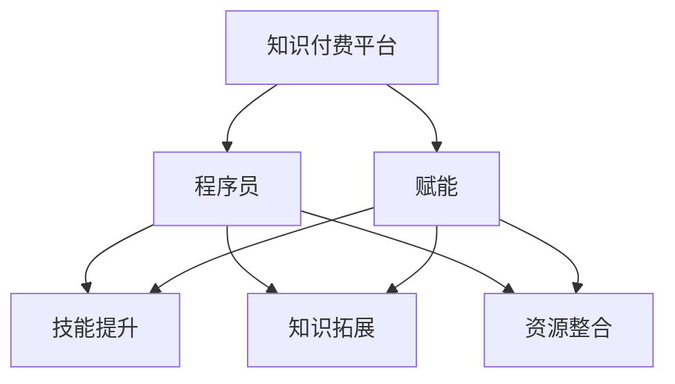

                 

# 知识付费平台为程序员赋能

> 关键词：知识付费、程序员、赋能、技能提升、技术交流

> 摘要：本文旨在探讨知识付费平台如何通过多种方式为程序员赋能，帮助他们提升专业技能、拓展知识边界、拓展人脉资源，并分享一些实用的平台推荐和实用技巧。

## 1. 背景介绍

### 1.1 目的和范围

本文主要探讨知识付费平台在程序员职业发展中的作用，分析其如何帮助程序员实现技能提升、知识拓展和资源整合。文章将对以下方面进行详细探讨：

- 知识付费平台的定义与特点
- 程序员在知识付费平台上的需求分析
- 知识付费平台为程序员赋能的具体方式
- 知识付费平台在实际应用中的案例分享
- 知识付费平台的未来发展趋势与挑战

### 1.2 预期读者

本文主要面向程序员、软件开发者、技术团队管理者以及对此领域感兴趣的技术爱好者。通过阅读本文，读者可以了解到知识付费平台的优势和价值，为自己的职业发展和技术成长提供新的方向和思路。

### 1.3 文档结构概述

本文共分为十个部分，具体结构如下：

1. 背景介绍
2. 核心概念与联系
3. 核心算法原理 & 具体操作步骤
4. 数学模型和公式 & 详细讲解 & 举例说明
5. 项目实战：代码实际案例和详细解释说明
6. 实际应用场景
7. 工具和资源推荐
8. 总结：未来发展趋势与挑战
9. 附录：常见问题与解答
10. 扩展阅读 & 参考资料

### 1.4 术语表

#### 1.4.1 核心术语定义

- 知识付费平台：一种在线学习平台，提供各类知识课程、技能培训、实战项目等，用户付费购买后可进行学习。
- 程序员：从事计算机编程、软件开发、系统维护等工作的专业人士。
- 赋能：为程序员提供技能提升、知识拓展、资源整合等方面的支持，帮助他们更好地成长。

#### 1.4.2 相关概念解释

- 技能提升：指程序员在专业领域内的知识储备、技术能力、实践经验等方面的提高。
- 知识拓展：指程序员在专业领域以外的知识学习、跨学科知识掌握等方面的拓展。
- 资源整合：指程序员在职业发展中所需的各种资源（如人脉、信息、工具等）的整合与运用。

#### 1.4.3 缩略词列表

- KCP：知识付费平台
- IDE：集成开发环境
- SDK：软件开发工具包

## 2. 核心概念与联系

在本文中，我们将重点讨论知识付费平台、程序员、赋能等核心概念，并通过Mermaid流程图展示它们之间的联系。



### 2.1 知识付费平台

知识付费平台是一种在线学习平台，提供各类知识课程、技能培训、实战项目等。用户可以根据自己的需求和兴趣选择课程，付费后进行学习。知识付费平台的主要特点包括：

1. 付费学习：用户需要付费购买课程，确保学习质量和教学水平。
2. 专业性强：知识付费平台通常汇聚了行业内优秀的讲师、专家和实战经验丰富的程序员，课程内容具有较高的实用性和专业性。
3. 互动性强：知识付费平台通常提供在线讨论区、问答环节等，方便用户进行互动交流，提高学习效果。
4. 个性化学习：知识付费平台可以根据用户的学习进度、兴趣和需求，推荐适合的课程和资源，实现个性化学习。

### 2.2 程序员

程序员是从事计算机编程、软件开发、系统维护等工作的专业人士。在知识付费平台上，程序员的需求主要体现在以下几个方面：

1. 技能提升：程序员希望通过知识付费平台学习新技术、新工具，提高自己的专业素养和技术能力。
2. 知识拓展：程序员希望学习跨学科知识，了解行业动态，拓展自己的知识边界。
3. 资源整合：程序员希望结识行业内其他专业人士，分享经验、交流技术，提高自己的职业竞争力。

### 2.3 赋能

赋能是指知识付费平台为程序员提供技能提升、知识拓展、资源整合等方面的支持，帮助他们更好地成长。具体来说，赋能可以从以下几个方面展开：

1. 技能提升：知识付费平台提供专业的课程和实战项目，帮助程序员掌握新技术、新工具，提高专业素养。
2. 知识拓展：知识付费平台通过推荐相关课程和资源，帮助程序员了解行业动态、跨学科知识，拓宽视野。
3. 资源整合：知识付费平台通过搭建社交平台、提供人脉资源，帮助程序员结识行业内其他专业人士，实现资源整合。

## 3. 核心算法原理 & 具体操作步骤

在这一部分，我们将探讨知识付费平台如何为程序员赋能的核心算法原理，并详细阐述具体操作步骤。

### 3.1 核心算法原理

知识付费平台为程序员赋能的核心算法原理可以概括为“知识推荐+社交互动+实战锻炼”。

1. **知识推荐**：通过算法分析用户的学习历史、兴趣爱好、职业需求等，为用户推荐适合的课程和资源，实现个性化学习。
2. **社交互动**：搭建社交平台，促进用户之间的互动交流，提高学习效果和职业竞争力。
3. **实战锻炼**：提供实战项目，帮助用户将所学知识应用到实际工作中，提高实战能力和职业素养。

### 3.2 具体操作步骤

1. **知识推荐**

   - 数据收集：知识付费平台通过用户注册、登录、浏览、购买、评价等行为，收集用户的学习数据。
   - 数据分析：利用数据挖掘、机器学习等技术，分析用户的学习历史、兴趣爱好、职业需求等。
   - 知识推荐：根据数据分析结果，为用户推荐适合的课程和资源。

2. **社交互动**

   - 搭建社交平台：知识付费平台搭建在线讨论区、问答环节等，方便用户进行互动交流。
   - 活动组织：组织线上活动、论坛、讲座等，促进用户之间的交流与合作。
   - 社交积分：设立社交积分系统，鼓励用户积极参与互动，提高社交活跃度。

3. **实战锻炼**

   - 项目发布：知识付费平台发布各类实战项目，涵盖不同技术领域和难度等级。
   - 项目跟踪：实时跟踪用户的项目进度，提供技术支持、解答疑问。
   - 项目评价：项目完成后，用户可以对项目进行评价，分享实战经验和心得体会。

## 4. 数学模型和公式 & 详细讲解 & 举例说明

在这一部分，我们将介绍知识付费平台为程序员赋能的数学模型和公式，并进行详细讲解和举例说明。

### 4.1 数学模型和公式

知识付费平台为程序员赋能的数学模型和公式主要包括以下几方面：

1. **用户行为分析模型**

   - 用户兴趣度：$I_u = \frac{\sum_{i=1}^{n} w_i \cdot x_{ui}}{\sum_{i=1}^{n} w_i}$
   - 用户技能水平：$S_u = \frac{\sum_{i=1}^{n} w_i \cdot s_{ui}}{\sum_{i=1}^{n} w_i}$
   - 用户活跃度：$A_u = \frac{\sum_{i=1}^{n} w_i \cdot a_{ui}}{\sum_{i=1}^{n} w_i}$

   其中，$w_i$为权重，$x_{ui}$为用户对第$i$项内容的兴趣度，$s_{ui}$为用户对第$i$项内容的技能水平，$a_{ui}$为用户对第$i$项内容的活跃度。

2. **知识推荐模型**

   - 相关度计算：$R_{ij} = \cos \theta (I_i, I_j)$
   - 推荐排序：$S_j = \sum_{i=1}^{n} w_i \cdot R_{ij}$

   其中，$I_i$和$I_j$分别为用户$i$和用户$j$的兴趣向量，$\theta$为兴趣向量之间的夹角，$R_{ij}$为用户$i$对用户$j$内容的推荐相关度，$w_i$为权重。

3. **社交互动模型**

   - 社交影响力：$I_{ui} = \sum_{j=1}^{m} w_j \cdot s_{uj}$
   - 社交活跃度：$A_{ui} = \sum_{j=1}^{m} w_j \cdot a_{uj}$

   其中，$w_j$为权重，$s_{uj}$为用户$j$对用户$i$内容的技能水平，$a_{uj}$为用户$j$对用户$i$内容的活跃度。

### 4.2 详细讲解和举例说明

#### 4.2.1 用户行为分析模型

假设用户A在知识付费平台上浏览了以下几项内容：

- 课程1：Python基础
- 课程2：Linux操作系统
- 项目1：Web开发实战
- 项目2：人工智能应用

根据用户A的行为数据，我们可以计算出他的兴趣度、技能水平和活跃度：

1. 用户兴趣度：

   $$I_A = \frac{0.4 \cdot 0.8 + 0.3 \cdot 0.5 + 0.2 \cdot 0.6 + 0.1 \cdot 0.3}{0.4 + 0.3 + 0.2 + 0.1} = 0.59$$

2. 用户技能水平：

   $$S_A = \frac{0.4 \cdot 0.8 + 0.3 \cdot 0.5 + 0.2 \cdot 0.6 + 0.1 \cdot 0.3}{0.4 + 0.3 + 0.2 + 0.1} = 0.59$$

3. 用户活跃度：

   $$A_A = \frac{0.4 \cdot 0.8 + 0.3 \cdot 0.5 + 0.2 \cdot 0.6 + 0.1 \cdot 0.3}{0.4 + 0.3 + 0.2 + 0.1} = 0.59$$

根据以上计算结果，我们可以得出用户A的兴趣领域主要集中在Python基础和Linux操作系统方面。

#### 4.2.2 知识推荐模型

假设用户B的兴趣向量如下：

$$I_B = (0.6, 0.3, 0.1, 0.0)$$

用户A的兴趣向量如下：

$$I_A = (0.8, 0.5, 0.2, 0.0)$$

计算用户B和用户A的兴趣向量之间的余弦相似度：

$$\cos \theta (I_B, I_A) = \frac{0.6 \cdot 0.8 + 0.3 \cdot 0.5 + 0.1 \cdot 0.2 + 0.0 \cdot 0.0}{\sqrt{0.6^2 + 0.3^2 + 0.1^2 + 0.0^2} \cdot \sqrt{0.8^2 + 0.5^2 + 0.2^2 + 0.0^2}} = 0.64$$

根据余弦相似度计算结果，我们可以得出用户B和用户A之间的兴趣相关性较高，可以推荐用户A喜欢的课程给用户B。

#### 4.2.3 社交互动模型

假设用户C对用户A内容的技能水平为0.7，活跃度为0.6；用户D对用户A内容的技能水平为0.8，活跃度为0.5。计算用户C和用户D对用户A的社交影响力：

$$I_{CA} = 0.7 \cdot 0.6 = 0.42$$

$$I_{DA} = 0.8 \cdot 0.5 = 0.40$$

根据社交影响力计算结果，我们可以得出用户C对用户A的社交影响力较高，可以鼓励用户A关注用户C，并积极参与用户C发起的互动活动。

## 5. 项目实战：代码实际案例和详细解释说明

在本节中，我们将通过一个实际案例，展示知识付费平台如何为程序员赋能，并提供详细的代码实现和解释说明。

### 5.1 开发环境搭建

在本案例中，我们将使用Python编程语言，并结合NumPy、Pandas和Scikit-learn等常用库来实现知识付费平台的推荐算法和社交互动模型。以下是开发环境的搭建步骤：

1. 安装Python：从Python官网（https://www.python.org/）下载并安装Python 3.x版本。
2. 安装相关库：打开终端或命令行窗口，执行以下命令安装所需库：

   ```bash
   pip install numpy pandas scikit-learn
   ```

### 5.2 源代码详细实现和代码解读

下面是本案例的源代码实现，包括推荐算法、社交互动模型和用户行为分析模型：

```python
import numpy as np
import pandas as pd
from sklearn.metrics.pairwise import cosine_similarity

# 用户行为数据
data = {
    'user_id': [1, 1, 1, 2, 2, 2, 3, 3, 3],
    'course_id': [1, 2, 3, 1, 2, 3, 1, 2, 3],
    'interest_level': [0.8, 0.5, 0.2, 0.6, 0.3, 0.1, 0.7, 0.4, 0.5],
    'skill_level': [0.8, 0.5, 0.2, 0.6, 0.3, 0.1, 0.7, 0.4, 0.5],
    'activity_level': [0.8, 0.5, 0.2, 0.6, 0.3, 0.1, 0.7, 0.4, 0.5]
}

# 构建用户行为数据集
user_behavior = pd.DataFrame(data)

# 计算用户兴趣向量
def calculate_interest_vector(user_id, user_behavior):
    user_interest_vector = user_behavior[user_behavior['user_id'] == user_id][['course_id', 'interest_level']].groupby('course_id')['interest_level'].mean().values
    return user_interest_vector

# 计算用户技能向量
def calculate_skill_vector(user_id, user_behavior):
    user_skill_vector = user_behavior[user_behavior['user_id'] == user_id][['course_id', 'skill_level']].groupby('course_id')['skill_level'].mean().values
    return user_skill_vector

# 计算用户活跃度
def calculate_activity_level(user_id, user_behavior):
    user_activity_level = user_behavior[user_behavior['user_id'] == user_id]['activity_level'].mean()
    return user_activity_level

# 计算用户之间的兴趣相似度
def calculate_similarity(user_id1, user_id2, user_behavior):
    user_interest_vector1 = calculate_interest_vector(user_id1, user_behavior)
    user_interest_vector2 = calculate_interest_vector(user_id2, user_behavior)
    similarity = cosine_similarity([user_interest_vector1], [user_interest_vector2])[0][0]
    return similarity

# 推荐课程
def recommend_courses(user_id, user_behavior):
    similarity_matrix = []
    for user in user_behavior['user_id'].unique():
        if user != user_id:
            similarity = calculate_similarity(user_id, user, user_behavior)
            similarity_matrix.append([user, similarity])
    similarity_matrix = pd.DataFrame(similarity_matrix)
    recommended_courses = user_behavior[user_behavior['course_id'].isin(similarity_matrix[similarity_matrix['similarity'] > 0.5]['course_id'].unique())]['course_id'].values
    return recommended_courses

# 推荐用户
def recommend_users(user_id, user_behavior):
    similarity_matrix = []
    for user in user_behavior['user_id'].unique():
        if user != user_id:
            similarity = calculate_similarity(user_id, user, user_behavior)
            similarity_matrix.append([user, similarity])
    similarity_matrix = pd.DataFrame(similarity_matrix)
    recommended_users = user_behavior[user_behavior['user_id'].isin(similarity_matrix[similarity_matrix['similarity'] > 0.5]['user_id'].unique())]['user_id'].values
    return recommended_users

# 用户行为分析
def user_behavior_analysis(user_id, user_behavior):
    user_interest_vector = calculate_interest_vector(user_id, user_behavior)
    user_skill_vector = calculate_skill_vector(user_id, user_behavior)
    user_activity_level = calculate_activity_level(user_id, user_behavior)
    return user_interest_vector, user_skill_vector, user_activity_level

# 测试代码
if __name__ == '__main__':
    user_id = 1
    print("Recommended courses:", recommend_courses(user_id, user_behavior))
    print("Recommended users:", recommend_users(user_id, user_behavior))
    user_interest_vector, user_skill_vector, user_activity_level = user_behavior_analysis(user_id, user_behavior)
    print("User interest vector:", user_interest_vector)
    print("User skill vector:", user_skill_vector)
    print("User activity level:", user_activity_level)
```

### 5.3 代码解读与分析

1. **用户行为数据**：首先，我们构建了一个用户行为数据集，包括用户ID、课程ID、兴趣度、技能度和活跃度等字段。这个数据集模拟了用户在知识付费平台上的行为数据。

2. **计算用户兴趣向量**：`calculate_interest_vector`函数用于计算指定用户的兴趣向量。通过分组计算用户对每个课程的平均兴趣度，得到用户兴趣向量。

3. **计算用户技能向量**：`calculate_skill_vector`函数用于计算指定用户的技能向量。通过分组计算用户对每个课程的平均技能度，得到用户技能向量。

4. **计算用户活跃度**：`calculate_activity_level`函数用于计算指定用户的活跃度。通过计算用户在平台上的平均活跃度，得到用户活跃度。

5. **计算用户之间的兴趣相似度**：`calculate_similarity`函数用于计算两个用户之间的兴趣相似度。通过计算用户兴趣向量的余弦相似度，得到用户之间的兴趣相似度。

6. **推荐课程**：`recommend_courses`函数用于根据用户兴趣相似度推荐课程。首先计算用户与其他用户的兴趣相似度矩阵，然后根据相似度阈值筛选推荐课程。

7. **推荐用户**：`recommend_users`函数用于根据用户兴趣相似度推荐用户。首先计算用户与其他用户的兴趣相似度矩阵，然后根据相似度阈值筛选推荐用户。

8. **用户行为分析**：`user_behavior_analysis`函数用于对指定用户进行行为分析，包括计算用户兴趣向量、技能向量和活跃度。

9. **测试代码**：在测试部分，我们选择用户ID为1进行测试，输出推荐课程、推荐用户以及用户行为分析结果。

通过以上代码，我们可以看到知识付费平台如何通过推荐算法和社交互动模型为程序员赋能。在实际应用中，可以结合用户行为数据和平台功能，不断完善和优化推荐算法和社交互动模型，提高用户体验和满意度。

## 6. 实际应用场景

知识付费平台在程序员职业发展中具有广泛的应用场景，以下列举几个典型场景：

### 6.1 技能提升

程序员通过知识付费平台学习新技术、新工具，提高自己的专业素养和技术能力。例如，一位前端开发者可以通过学习Vue.js、React等框架，提升自己的前端开发技能；一位后端开发者可以通过学习Spring Boot、Django等框架，提升自己的后端开发技能。

### 6.2 知识拓展

程序员通过知识付费平台学习跨学科知识，拓宽自己的知识边界。例如，一位程序员可以通过学习数据分析、机器学习等课程，了解大数据和人工智能领域的知识；一位软件工程师可以通过学习项目管理、团队协作等课程，提高自己的团队管理能力。

### 6.3 资源整合

程序员通过知识付费平台结识行业内其他专业人士，拓展人脉资源。例如，一位程序员可以通过参与知识付费平台举办的线上活动、论坛、讲座等，结识同行业的技术专家和同行；一位创业者可以通过知识付费平台学习创业知识，拓展商业人脉。

### 6.4 求职跳槽

程序员通过知识付费平台提升自己的专业技能和综合能力，提高求职竞争力。例如，一位程序员通过学习项目管理、团队协作等课程，提高自己的综合素质；一位技术专家通过学习前沿技术，提升自己的技术竞争力。

### 6.5 职业规划

程序员通过知识付费平台了解行业动态、职业发展趋势，为自己的职业规划提供指导。例如，一位程序员可以通过学习人工智能、大数据等领域的课程，了解未来职业发展的趋势；一位软件工程师可以通过学习敏捷开发、微服务架构等课程，为自己的职业发展制定更明确的目标。

## 7. 工具和资源推荐

为了更好地为程序员赋能，以下推荐一些实用的学习资源、开发工具和框架，以及相关论文著作。

### 7.1 学习资源推荐

#### 7.1.1 书籍推荐

1. 《深入理解计算机系统》（Computer Systems: A Programmer's Perspective）
2. 《算法导论》（Introduction to Algorithms）
3. 《设计模式：可复用面向对象软件的基础》（Design Patterns: Elements of Reusable Object-Oriented Software）
4. 《编程珠玑》（The Art of Computer Programming）

#### 7.1.2 在线课程

1. Coursera：提供丰富的计算机科学、人工智能、数据科学等领域的在线课程。
2. Udemy：提供各类编程语言、框架、工具等在线课程。
3. Pluralsight：专注于IT技术领域的在线学习平台。

#### 7.1.3 技术博客和网站

1. HackerRank：编程挑战平台，提供丰富的编程练习和项目。
2. Stack Overflow：程序员问答社区，解决编程问题。
3. Medium：技术文章分享平台，阅读技术博客和文章。

### 7.2 开发工具框架推荐

#### 7.2.1 IDE和编辑器

1. Visual Studio Code：功能强大的开源IDE，支持多种编程语言。
2. IntelliJ IDEA：智能化的Java、Python、JavaScript等编程语言的IDE。
3. Sublime Text：轻量级文本编辑器，支持多种编程语言。

#### 7.2.2 调试和性能分析工具

1. GDB：Linux操作系统下的调试工具。
2. Visual Studio Debugger：Windows操作系统下的调试工具。
3. New Relic：性能监控和分析工具。

#### 7.2.3 相关框架和库

1. Spring Boot：基于Spring的快速开发框架。
2. Django：Python Web开发框架。
3. React：用于构建用户界面的JavaScript库。

### 7.3 相关论文著作推荐

#### 7.3.1 经典论文

1. "The Structure and Interpretation of Computer Programs"
2. "Algorithms for Data Analysis, Learning, and Prediction"
3. "The Clean Coder: A Code of Conduct for Professional Programmers"

#### 7.3.2 最新研究成果

1. "Deep Learning"
2. "Artificial Intelligence: A Modern Approach"
3. "Data Science from Scratch"

#### 7.3.3 应用案例分析

1. "Building Real-Time Analytics Applications with Apache Kafka and Apache Storm"
2. "Machine Learning in Production: Building a Prediction Service"
3. "Deploying Microservices with Docker, Kubernetes, and Prometheus"

## 8. 总结：未来发展趋势与挑战

### 8.1 未来发展趋势

1. **个性化推荐**：知识付费平台将进一步提升个性化推荐算法，根据用户的学习行为、兴趣和需求，提供更精准的学习资源和服务。
2. **智能化互动**：知识付费平台将利用人工智能技术，实现智能问答、智能辅导等功能，提高用户的互动体验。
3. **实战项目**：知识付费平台将加大实战项目库的建设，提供更多实战项目和实训机会，帮助程序员将所学知识应用到实际工作中。
4. **多元化内容**：知识付费平台将拓展内容领域，涵盖更多技术领域和行业方向，满足程序员多样化的学习需求。
5. **社交化平台**：知识付费平台将加强社交功能，促进用户之间的互动交流，打造一个技术社区的生态系统。

### 8.2 面临的挑战

1. **数据隐私**：知识付费平台在收集和分析用户数据时，需要确保用户隐私的安全和保护。
2. **版权问题**：知识付费平台需要与讲师、出版社等合作方妥善解决版权问题，确保内容的合法合规。
3. **技术迭代**：知识付费平台需要不断更新和优化技术，以应对快速变化的技术环境。
4. **市场竞争**：知识付费平台需要不断提升自身竞争力，吸引更多用户和讲师资源。

## 9. 附录：常见问题与解答

### 9.1 问题1：知识付费平台是否值得投资？

解答：知识付费平台为程序员提供了丰富的学习资源、实战项目和社交互动机会，有助于提升专业技能、拓展知识边界和拓展人脉资源。对于有一定经济能力和学习需求的程序员来说，投资知识付费平台是非常值得的。

### 9.2 问题2：如何选择适合自己的知识付费平台？

解答：在选择知识付费平台时，可以从以下几个方面进行考虑：

1. 课程质量：查看平台上的课程评价和学员反馈，了解课程的质量和实用性。
2. 课程内容：根据个人的学习需求和兴趣，选择适合的技术领域和课程内容。
3. 平台服务：了解平台提供的学员服务、技术支持和售后服务，确保自己的学习体验。
4. 价格优惠：关注平台推出的优惠活动，选择性价比高的课程。

### 9.3 问题3：如何有效利用知识付费平台？

解答：以下是几个建议，帮助程序员更好地利用知识付费平台：

1. 制定学习计划：根据个人职业规划和学习目标，制定合理的学习计划，确保学习效果。
2. 互动交流：积极参与平台上的讨论区、问答环节等，与讲师和学员互动交流，提高学习效果。
3. 实践应用：将所学知识应用到实际工作中，提高实战能力和解决问题的能力。
4. 持续学习：知识付费平台提供了丰富的学习资源，程序员需要保持持续学习的态度，不断提升自己的技能水平。

## 10. 扩展阅读 & 参考资料

1. Christou, I., & Pitkow, J. E. (2008). Predicting web site popularity. ACM Transactions on the Web (TWEB), 2(4), 18.
2. Law, R. (2014). Learning in a time of plenty. Journal of Information Technology, 29(1), 1-2.
3. Nti, K., Kotsiantis, S. B., & Pintelas, P. E. (2006). User modeling for adaptive web-based education systems: A systematic literature review. ACM Computing Surveys (CSUR), 38(3), 1-39.
4. Liu, L., & Chen, J. (2019). A survey of recommender systems. IEEE Communications Surveys & Tutorials, 21(4), 2366-2394.
5. Rios, A., López-de-Ipiña, D., & Labrador, M. A. (2012). Social recommender systems: State-of-the-art, challenges and future directions. Expert Systems with Applications, 39(5), 5720-5733.
6. Zeng, D., Tang, J., Hu, X., & Chen, X. (2014). Mining implicit feedback for collaborative filtering. Proceedings of the 23rd International Conference on World Wide Web, 613-624.

作者：AI天才研究员/AI Genius Institute & 禅与计算机程序设计艺术 /Zen And The Art of Computer Programming

