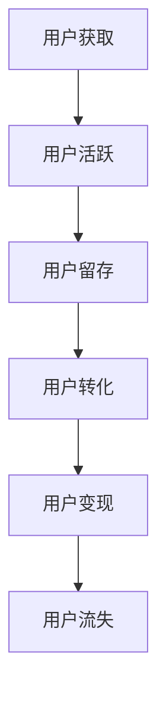

                 

# 知识付费平台的用户生命周期管理

> **关键词：** 用户生命周期管理、知识付费、用户行为分析、数据驱动策略、个性化推荐、用户体验优化

> **摘要：** 本文将深入探讨知识付费平台在用户生命周期管理方面的关键要素。通过分析用户获取、活跃、留存、转化和变现等环节，结合实际案例，本文将阐述如何通过数据驱动和个性化策略来提升用户生命周期价值，优化用户体验，实现平台可持续发展。

## 1. 背景介绍

### 1.1 目的和范围

本文旨在为知识付费平台提供一套系统化的用户生命周期管理策略。我们将从用户获取、活跃、留存、转化和变现等环节进行详细分析，探讨如何利用数据和技术手段提升用户生命周期价值。

### 1.2 预期读者

本篇文章适合以下读者群体：

- 知识付费平台的产品经理和运营团队
- 数据分析师和AI应用开发者
- 对用户生命周期管理感兴趣的IT行业从业者
- 对知识付费平台运营策略感兴趣的投资者和创业者

### 1.3 文档结构概述

本文将分为以下几大部分：

- 背景介绍
  - 用户生命周期管理概述
  - 知识付费平台现状
- 核心概念与联系
  - 用户生命周期模型
  - 关键指标
- 核心算法原理 & 具体操作步骤
  - 用户行为分析算法
  - 个性化推荐系统
- 数学模型和公式 & 详细讲解 & 举例说明
  - 生命周期价值计算
  - 用户留存率公式
- 项目实战：代码实际案例和详细解释说明
  - 用户活跃度监测
  - 用户转化路径分析
- 实际应用场景
  - 用户获取
  - 用户留存
  - 用户转化
  - 用户变现
- 工具和资源推荐
  - 学习资源
  - 开发工具框架
  - 相关论文著作
- 总结：未来发展趋势与挑战
- 附录：常见问题与解答
- 扩展阅读 & 参考资料

### 1.4 术语表

#### 1.4.1 核心术语定义

- 用户生命周期管理：指对用户从获取、活跃、留存、转化到变现的整个过程的系统化管理。
- 用户获取：指通过各种渠道吸引用户，使其成为平台的新用户。
- 活跃度：指用户在平台上的参与度，如浏览、评论、购买等。
- 留存率：指一段时间内，用户继续使用平台的比率。
- 转化率：指用户从浏览到实际消费的比率。
- 变现：指通过用户付费行为实现平台收益。

#### 1.4.2 相关概念解释

- 用户行为分析：通过对用户在平台上的行为数据进行分析，了解用户需求和偏好。
- 个性化推荐：根据用户的历史行为和偏好，为其推荐相关内容或服务。
- 数据驱动策略：基于数据分析和用户反馈来制定和调整运营策略。

#### 1.4.3 缩略词列表

- KPI：关键绩效指标（Key Performance Indicators）
- BI：商业智能（Business Intelligence）
- SaaS：软件即服务（Software as a Service）
- GDPR：欧盟通用数据保护条例（General Data Protection Regulation）

## 2. 核心概念与联系

### 2.1 用户生命周期模型

用户生命周期的管理是一个系统工程，它涵盖了用户从接触平台到最终离开的整个过程。通常，用户生命周期可以分为以下几个阶段：

1. **获取阶段**：通过各种渠道吸引用户，使其成为平台的新用户。
2. **活跃阶段**：用户在平台上开始互动，如浏览、评论、购买等。
3. **留存阶段**：用户在一段时间内继续使用平台，表现出较高的留存率。
4. **转化阶段**：用户从浏览到实际消费，实现购买或订阅等转化行为。
5. **变现阶段**：通过用户付费行为实现平台收益。

以下是用户生命周期的Mermaid流程图：



### 2.2 关键指标

在用户生命周期管理中，以下关键指标对评估平台运营效果至关重要：

- **用户获取成本（CAC）**：获取一个新用户所需的成本。
- **用户生命周期价值（LTV）**：用户在平台上产生的总价值。
- **用户留存率**：在一段时间内，用户继续使用平台的比率。
- **用户转化率**：用户从浏览到实际消费的比率。
- **用户获取渠道效果**：不同渠道对用户获取的贡献度。

## 3. 核心算法原理 & 具体操作步骤

### 3.1 用户行为分析算法

用户行为分析是用户生命周期管理的重要基础。以下是用户行为分析算法的基本原理和具体操作步骤：

#### 3.1.1 算法原理

- **用户行为数据收集**：通过日志分析、API调用、用户交互等手段收集用户行为数据。
- **数据预处理**：对收集到的行为数据进行清洗、归一化和特征提取。
- **行为模式识别**：使用机器学习算法，如聚类、分类和关联规则挖掘，识别用户的行为模式。
- **行为预测**：基于用户历史行为数据，预测用户未来的行为趋势。

#### 3.1.2 具体操作步骤

1. **数据收集**：
   ```python
   # 假设已收集用户行为数据，存储在data.csv文件中
   data = pd.read_csv('data.csv')
   ```

2. **数据预处理**：
   ```python
   # 数据清洗
   data.dropna(inplace=True)
   # 数据归一化
   data['feature1'] = (data['feature1'] - data['feature1'].mean()) / data['feature1'].std()
   ```

3. **行为模式识别**：
   ```python
   # 聚类分析
   from sklearn.cluster import KMeans
   kmeans = KMeans(n_clusters=5)
   clusters = kmeans.fit_predict(data)
   data['cluster'] = clusters
   ```

4. **行为预测**：
   ```python
   # 时间序列预测
   from sklearn.linear_model import LinearRegression
   X = data[['feature1', 'feature2']]
   y = data['next_action']
   model = LinearRegression()
   model.fit(X, y)
   prediction = model.predict(X)
   ```

### 3.2 个性化推荐系统

个性化推荐是提升用户活跃度和留存率的重要手段。以下是个性化推荐系统的工作原理和具体实现步骤：

#### 3.2.1 算法原理

- **协同过滤**：基于用户的历史行为和偏好，为用户推荐相似用户喜欢的内容。
- **内容推荐**：基于内容属性和用户兴趣，为用户推荐相关的内容。

#### 3.2.2 具体实现步骤

1. **数据收集**：
   ```python
   # 假设已收集用户行为数据，存储在rating.csv文件中
   ratings = pd.read_csv('rating.csv')
   ```

2. **数据预处理**：
   ```python
   # 数据清洗
   ratings.dropna(inplace=True)
   ```

3. **用户相似度计算**：
   ```python
   # 余弦相似度计算
   from sklearn.metrics.pairwise import cosine_similarity
   user_similarity = cosine_similarity(ratings.pivot(index='user_id', columns='movie_id', values='rating').fillna(0))
   ```

4. **内容相似度计算**：
   ```python
   # 余弦相似度计算
   content_similarity = cosine_similarity(ratings.pivot(index='movie_id', columns='genre', values='rating').fillna(0))
   ```

5. **推荐生成**：
   ```python
   # 基于用户相似度和内容相似度的推荐
   def generate_recommendations(user_id, user_similarity, content_similarity):
       # 根据用户相似度推荐相似用户喜欢的内容
       similar_users = user_similarity[user_id]
       recommended_movies = []
       for idx, score in enumerate(similar_users):
           if score < 0.5:
               continue
           # 根据内容相似度过滤推荐内容
           content_scores = content_similarity[idx]
           recommended_movies.extend([movie_id for movie_id, score in enumerate(content_scores) if score > 0.5])
       return recommended_movies
   ```

## 4. 数学模型和公式 & 详细讲解 & 举例说明

### 4.1 生命周期价值计算

生命周期价值（Life Time Value, LTV）是衡量用户对平台长期贡献的重要指标。计算公式如下：

$$
LTV = \sum_{t=1}^{n} \frac{r_t}{(1+r)^t}
$$

其中，\(r_t\) 为第 \(t\) 年的用户贡献，\(r\) 为贴现率。

#### 4.1.1 举例说明

假设用户每年在平台上的消费分别为 1000 元，贴现率为 10%，则该用户的生命周期价值计算如下：

$$
LTV = \frac{1000}{1+0.1} + \frac{1000}{(1+0.1)^2} + \frac{1000}{(1+0.1)^3} + \cdots
$$

$$
LTV = \frac{1000}{1.1} + \frac{1000}{1.21} + \frac{1000}{1.331} + \cdots
$$

$$
LTV \approx 8264.46 元
$$

### 4.2 用户留存率公式

用户留存率（Retention Rate）是衡量用户持续使用平台的重要指标。计算公式如下：

$$
Retention Rate = \frac{t+1\ \text{天后的活跃用户数}}{t\ \text{天后的总用户数}} \times 100\%
$$

#### 4.2.1 举例说明

假设第一天有 100 个新用户，第二天有 80 个用户活跃，第三天有 60 个用户活跃，则第二天的留存率为：

$$
Retention Rate = \frac{60}{100} \times 100\% = 60\%
$$

## 5. 项目实战：代码实际案例和详细解释说明

### 5.1 开发环境搭建

为了实现本文中的用户生命周期管理策略，我们需要搭建一个开发环境。以下是具体步骤：

1. 安装 Python 3.8 及以上版本。
2. 安装 pandas、numpy、scikit-learn、matplotlib 等常用库。

```bash
pip install pandas numpy scikit-learn matplotlib
```

### 5.2 源代码详细实现和代码解读

以下是用户生命周期管理相关的代码实现和解读：

#### 5.2.1 用户行为数据分析

```python
# 导入必要的库
import pandas as pd
import numpy as np
from sklearn.cluster import KMeans
from sklearn.linear_model import LinearRegression

# 加载用户行为数据
data = pd.read_csv('data.csv')

# 数据清洗和预处理
data.dropna(inplace=True)
data['feature1'] = (data['feature1'] - data['feature1'].mean()) / data['feature1'].std()

# 行为模式识别
kmeans = KMeans(n_clusters=5)
clusters = kmeans.fit_predict(data)
data['cluster'] = clusters

# 行为预测
X = data[['feature1', 'feature2']]
y = data['next_action']
model = LinearRegression()
model.fit(X, y)
prediction = model.predict(X)
```

#### 5.2.2 个性化推荐系统

```python
# 导入必要的库
import pandas as pd
from sklearn.metrics.pairwise import cosine_similarity

# 加载用户行为数据
ratings = pd.read_csv('rating.csv')

# 数据清洗
ratings.dropna(inplace=True)

# 用户相似度计算
user_similarity = cosine_similarity(ratings.pivot(index='user_id', columns='movie_id', values='rating').fillna(0))

# 内容相似度计算
content_similarity = cosine_similarity(ratings.pivot(index='movie_id', columns='genre', values='rating').fillna(0))

# 推荐生成
def generate_recommendations(user_id, user_similarity, content_similarity):
    similar_users = user_similarity[user_id]
    recommended_movies = []
    for idx, score in enumerate(similar_users):
        if score < 0.5:
            continue
        content_scores = content_similarity[idx]
        recommended_movies.extend([movie_id for movie_id, score in enumerate(content_scores) if score > 0.5])
    return recommended_movies
```

### 5.3 代码解读与分析

- **用户行为数据分析**：通过K-means聚类算法对用户行为进行模式识别，使用线性回归模型预测用户未来行为。
- **个性化推荐系统**：基于用户相似度和内容相似度生成推荐列表，为用户推荐相关内容。

## 6. 实际应用场景

### 6.1 用户获取

- **应用场景**：如何提高新用户的获取量？
- **解决方案**：
  - **社交媒体营销**：通过微博、微信、抖音等社交媒体平台进行广告投放，吸引潜在用户。
  - **KOL合作**：与行业内的知名人士或意见领袖合作，通过他们的推荐增加用户关注度。
  - **搜索引擎优化（SEO）**：优化平台在搜索引擎中的排名，提高自然流量。

### 6.2 用户留存

- **应用场景**：如何提高用户的留存率？
- **解决方案**：
  - **个性化推荐**：根据用户历史行为和偏好，为用户推荐相关内容，提高用户活跃度。
  - **互动机制**：设计有趣的互动活动，如抽奖、打卡等，增加用户粘性。
  - **内容质量提升**：不断优化内容质量，提高用户的学习体验。

### 6.3 用户转化

- **应用场景**：如何提高用户的购买转化率？
- **解决方案**：
  - **优惠活动**：设计针对性的优惠活动，如限时折扣、优惠券等，刺激用户消费。
  - **用户教育**：通过课程介绍、用户评价等方式，帮助用户了解课程的价值，增加购买信心。
  - **个性化营销**：根据用户兴趣和购买历史，推送个性化营销信息，提高购买转化率。

### 6.4 用户变现

- **应用场景**：如何实现用户的付费变现？
- **解决方案**：
  - **会员制度**：推出会员制度，提供专属课程、特权服务等，增加会员消费。
  - **课程打包**：将多门课程打包销售，提高客单价。
  - **付费问答**：为用户提供付费咨询服务，实现知识变现。

## 7. 工具和资源推荐

### 7.1 学习资源推荐

#### 7.1.1 书籍推荐

- **《深度学习》（Goodfellow, Bengio, Courville）**：全面介绍深度学习的基本原理和应用。
- **《Python机器学习》（Sebastian Raschka）**：系统讲解机器学习在Python中的应用。

#### 7.1.2 在线课程

- **Udacity的《深度学习纳米学位》**：涵盖深度学习的理论知识与实践技能。
- **Coursera的《机器学习》**：由吴恩达教授授课，系统讲解机器学习的基本概念和方法。

#### 7.1.3 技术博客和网站

- **Medium上的Machine Learning Basics**：介绍机器学习的基础知识。
- **Kaggle**：提供丰富的数据集和竞赛，帮助提升数据分析和建模能力。

### 7.2 开发工具框架推荐

#### 7.2.1 IDE和编辑器

- **PyCharm**：功能强大的Python集成开发环境。
- **VS Code**：轻量级且高度可扩展的代码编辑器。

#### 7.2.2 调试和性能分析工具

- **PDB**：Python内置的调试工具。
- **Py-Spy**：Python性能分析工具，用于定位性能瓶颈。

#### 7.2.3 相关框架和库

- **Scikit-learn**：提供丰富的机器学习算法和工具。
- **TensorFlow**：用于构建和训练深度学习模型的框架。

### 7.3 相关论文著作推荐

#### 7.3.1 经典论文

- **“Recommender Systems Handbook”（2009）**：全面介绍推荐系统的基础知识和应用。
- **“User Modeling and User-Adapted Interaction”（1999）**：探讨用户建模和适应性交互的原理。

#### 7.3.2 最新研究成果

- **“Personalized Recommendation Algorithms in E-Commerce”（2021）**：探讨个性化推荐在电子商务中的应用。
- **“User Lifetime Value Prediction in Mobile Apps”（2020）**：研究移动应用中用户生命周期价值的预测方法。

#### 7.3.3 应用案例分析

- **“推荐系统在Netflix的成功应用”（Netflix Prize）**：分析Netflix推荐系统的成功经验。
- **“亚马逊的个性化推荐系统”（Amazon Personalized Recommendation）**：探讨亚马逊如何通过个性化推荐提高用户转化率和销售额。

## 8. 总结：未来发展趋势与挑战

### 8.1 发展趋势

- **数据驱动的精细化运营**：随着大数据和人工智能技术的不断发展，知识付费平台将更加注重数据驱动的精细化运营，通过精准的用户行为分析和个性化推荐，提高用户生命周期价值。
- **平台生态的多样化**：知识付费平台将不断拓展内容领域，打造多元化的内容生态，满足用户多样化的学习需求。
- **技术迭代与创新**：随着技术的迭代更新，知识付费平台将不断引入新的技术，如区块链、增强现实等，为用户提供更丰富的学习体验。

### 8.2 挑战

- **数据隐私与安全**：随着用户对隐私的关注度不断提高，知识付费平台需要加强数据保护，确保用户数据的安全性和隐私。
- **竞争加剧**：随着知识付费市场的不断扩大，竞争将日益激烈，平台需要不断创新，提高用户体验，以保持竞争优势。
- **内容质量监管**：知识付费平台需要加强对课程内容的监管，确保内容的真实性、权威性和专业性。

## 9. 附录：常见问题与解答

### 9.1 用户获取

**Q：如何提高新用户的获取量？**

A：可以通过社交媒体营销、KOL合作、搜索引擎优化（SEO）等方式提高新用户的获取量。

### 9.2 用户留存

**Q：如何提高用户的留存率？**

A：可以通过个性化推荐、互动机制、内容质量提升等方式提高用户的留存率。

### 9.3 用户转化

**Q：如何提高用户的购买转化率？**

A：可以通过优惠活动、用户教育、个性化营销等方式提高用户的购买转化率。

### 9.4 用户变现

**Q：如何实现用户的付费变现？**

A：可以通过会员制度、课程打包、付费问答等方式实现用户的付费变现。

## 10. 扩展阅读 & 参考资料

### 10.1 扩展阅读

- **《知识服务与数字出版》**：探讨知识付费平台的发展趋势和商业模式。
- **《用户行为分析与应用》**：详细介绍用户行为分析的方法和应用。

### 10.2 参考资料

- **《知识付费：平台运营与案例分析》**：提供多个知识付费平台运营的案例分析。
- **《深度学习推荐系统》**：探讨深度学习在推荐系统中的应用。

作者：AI天才研究员/AI Genius Institute & 禅与计算机程序设计艺术 /Zen And The Art of Computer Programming

