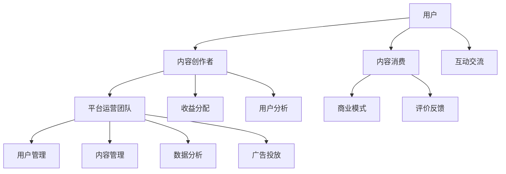

                 

# 知识付费平台运营：程序员创业案例分析

> **关键词：知识付费、平台运营、程序员创业、案例分析、商业模式**
> 
> **摘要：本文将深入分析一个成功的知识付费平台——程序员创业案例。通过详细的背景介绍、核心概念解析、算法原理讲解、实际案例展示，探讨知识付费平台运营的关键要素和成功策略，为从事或有意进入知识付费领域的程序员提供有价值的参考。**

## 1. 背景介绍

### 1.1 目的和范围

本文旨在通过一个具体的程序员创业案例，探讨知识付费平台的运营策略和成功要素。我们将从多个角度进行分析，包括商业模式、用户需求分析、平台架构、算法原理、实际操作步骤等，以期为读者提供全面的指导。

### 1.2 预期读者

本文适合对知识付费平台运营感兴趣的程序员、创业者、以及关注互联网教育行业的发展者。无论您是已有项目需要优化，还是正在策划创业项目，本文都希望能为您提供有益的启示。

### 1.3 文档结构概述

本文分为十个部分，结构如下：
1. 背景介绍
2. 核心概念与联系
3. 核心算法原理 & 具体操作步骤
4. 数学模型和公式 & 详细讲解 & 举例说明
5. 项目实战：代码实际案例和详细解释说明
6. 实际应用场景
7. 工具和资源推荐
8. 总结：未来发展趋势与挑战
9. 附录：常见问题与解答
10. 扩展阅读 & 参考资料

### 1.4 术语表

#### 1.4.1 核心术语定义

- 知识付费平台：指提供专业知识和技能分享的服务平台，用户需付费购买使用权。
- 程序员：指从事计算机编程工作，掌握编程语言和开发工具的专业人员。
- 商业模式：企业如何创造、传递和捕获价值的基本原理。

#### 1.4.2 相关概念解释

- 用户需求分析：对潜在用户的需求和偏好进行研究和分析，以优化产品和服务。
- 平台架构：知识付费平台的系统设计和结构，包括前端、后端、数据库等。
- 算法原理：解决特定问题的算法逻辑和方法。

#### 1.4.3 缩略词列表

- SaaS：软件即服务（Software as a Service）
- PaaS：平台即服务（Platform as a Service）
- IaaS：基础设施即服务（Infrastructure as a Service）
- API：应用程序编程接口（Application Programming Interface）

## 2. 核心概念与联系

为了更好地理解知识付费平台运营的核心概念，我们将使用 Mermaid 流程图来展示平台的关键组成部分及其相互关系。



### 2.1 平台关键组成部分

- **用户**：知识付费平台的最终消费者，他们通过付费获取专业知识和技能。
- **内容创作者**：提供知识内容的专家和专业人士，他们通过平台分享自己的经验和知识，获得收益。
- **平台运营团队**：负责平台的日常运营、内容审核、用户管理等工作，确保平台的稳定和高质量运行。
- **商业模式**：平台如何创造、传递和捕获价值，包括用户付费模式、收益分配机制等。
- **收益分配**：平台根据内容和用户贡献的价值，合理分配收益给内容创作者和平台运营团队。
- **用户管理**：对用户进行身份认证、权限管理、用户体验优化等工作。
- **内容管理**：对知识内容进行审核、分类、推荐等工作，确保内容的质量和用户体验。
- **数据分析**：通过数据分析了解用户行为和需求，优化平台运营策略。
- **互动交流**：提供用户与内容创作者之间的互动交流平台，增强用户黏性。
- **评价反馈**：用户对知识内容进行评价和反馈，帮助内容创作者改进内容，提升用户体验。

## 3. 核心算法原理 & 具体操作步骤

### 3.1 推荐算法原理

推荐算法是知识付费平台的核心技术之一，其目的是根据用户行为和偏好，为用户推荐可能感兴趣的知识内容。以下是推荐算法的基本原理：

#### 3.1.1 协同过滤

协同过滤分为基于用户的协同过滤（User-based Collaborative Filtering，UBCF）和基于项目的协同过滤（Item-based Collaborative Filtering，IBCF）。

- **基于用户的协同过滤（UBCF）**：找到与当前用户兴趣相似的其他用户，然后推荐这些用户喜欢的知识内容。
  - **步骤**：
    1. 计算用户之间的相似度。
    2. 找到与当前用户最相似的K个用户。
    3. 推荐这K个用户喜欢的但当前用户未看过的知识内容。

- **基于项目的协同过滤（IBCF）**：找到与当前用户已看过的知识内容相似的其他知识内容，然后推荐这些内容。
  - **步骤**：
    1. 计算知识内容之间的相似度。
    2. 找到与当前用户已看过的知识内容最相似的K个内容。
    3. 推荐这K个内容。

#### 3.1.2 内容推荐

内容推荐算法主要基于知识内容本身的特征，如标签、关键词、分类等，为用户推荐可能感兴趣的知识内容。

- **步骤**：
  1. 提取知识内容的关键特征。
  2. 计算用户与知识内容之间的相似度。
  3. 推荐相似度最高的知识内容。

### 3.2 具体操作步骤

以下是基于协同过滤的内容推荐算法的具体操作步骤，使用伪代码进行详细阐述：

```python
# 输入：用户历史行为数据（user_history）、知识内容数据（content_data）
# 输出：推荐的知识内容列表（recommended_contents）

def collaborative_filtering(user_history, content_data):
    # 步骤1：计算用户相似度矩阵
    similarity_matrix = compute_similarity(user_history, content_data)

    # 步骤2：找到与当前用户最相似的K个用户
    nearest_users = find_nearest_users(user_history, similarity_matrix, K)

    # 步骤3：推荐相似用户喜欢的但当前用户未看过的知识内容
    recommended_contents = []
    for user in nearest_users:
        for content in user_history[user]['likes']:
            if content not in user_history[current_user]['views']:
                recommended_contents.append(content)

    # 步骤4：对推荐结果进行排序
    recommended_contents.sort(key=lambda x: x['similarity'], reverse=True)

    # 步骤5：返回推荐的知识内容列表
    return recommended_contents
```

## 4. 数学模型和公式 & 详细讲解 & 举例说明

### 4.1 协同过滤相似度计算

协同过滤算法的核心在于相似度计算。以下是两种常用的相似度计算方法：

#### 4.1.1 余弦相似度

余弦相似度用于计算用户或知识内容之间的相似度，其公式如下：

$$
\cos\theta = \frac{A \cdot B}{\lVert A \rVert \cdot \lVert B \rVert}
$$

其中，$A$ 和 $B$ 分别为用户或知识内容的特征向量，$\lVert A \rVert$ 和 $\lVert B \rVert$ 分别为特征向量的模长，$\theta$ 为夹角。

#### 4.1.2 皮尔逊相关系数

皮尔逊相关系数用于计算用户之间的相似度，其公式如下：

$$
r_{xy} = \frac{\sum_{i=1}^{n}(x_i - \bar{x})(y_i - \bar{y})}{\sqrt{\sum_{i=1}^{n}(x_i - \bar{x})^2 \cdot \sum_{i=1}^{n}(y_i - \bar{y})^2}}
$$

其中，$x_i$ 和 $y_i$ 分别为用户 $i$ 对每个知识内容的评分，$\bar{x}$ 和 $\bar{y}$ 分别为用户对所有知识内容的平均评分。

### 4.2 内容推荐相似度计算

内容推荐算法中，相似度计算同样重要。以下是内容推荐中常用的相似度计算方法：

#### 4.2.1 余弦相似度

与用户相似度计算类似，内容之间的余弦相似度计算公式为：

$$
\cos\theta = \frac{A \cdot B}{\lVert A \rVert \cdot \lVert B \rVert}
$$

其中，$A$ 和 $B$ 分别为知识内容 $A$ 和 $B$ 的特征向量，$\lVert A \rVert$ 和 $\lVert B \rVert$ 分别为特征向量的模长。

#### 4.2.2 欧氏距离

欧氏距离用于计算内容之间的相似度，其公式如下：

$$
d(A, B) = \sqrt{\sum_{i=1}^{n}(a_i - b_i)^2}
$$

其中，$A$ 和 $B$ 分别为知识内容 $A$ 和 $B$ 的特征向量，$a_i$ 和 $b_i$ 分别为特征向量中的第 $i$ 个元素。

### 4.3 举例说明

假设有两个用户 $U_1$ 和 $U_2$，他们对五个知识内容的评分如下表所示：

| 内容 | $U_1$ | $U_2$ |
| --- | --- | --- |
| C1 | 1 | 1 |
| C2 | 2 | 2 |
| C3 | 3 | 3 |
| C4 | 4 | 1 |
| C5 | 1 | 4 |

#### 4.3.1 余弦相似度

计算用户 $U_1$ 和 $U_2$ 的余弦相似度：

$$
\cos\theta_{U_1, U_2} = \frac{1 \cdot 1 + 2 \cdot 2 + 3 \cdot 3 + 4 \cdot 1 + 1 \cdot 4}{\sqrt{1^2 + 2^2 + 3^2 + 4^2 + 1^2} \cdot \sqrt{1^2 + 2^2 + 3^2 + 1^2 + 4^2}}
$$

$$
\cos\theta_{U_1, U_2} = \frac{15}{\sqrt{30} \cdot \sqrt{30}} = \frac{15}{30} = 0.5
$$

因此，用户 $U_1$ 和 $U_2$ 的相似度为 0.5。

#### 4.3.2 欧氏距离

计算用户 $U_1$ 和 $U_2$ 的欧氏距离：

$$
d(U_1, U_2) = \sqrt{(1-1)^2 + (2-2)^2 + (3-3)^2 + (4-1)^2 + (1-4)^2}
$$

$$
d(U_1, U_2) = \sqrt{0 + 0 + 0 + 3^2 + (-3)^2} = \sqrt{18} = 3\sqrt{2}
$$

因此，用户 $U_1$ 和 $U_2$ 的欧氏距离为 $3\sqrt{2}$。

## 5. 项目实战：代码实际案例和详细解释说明

### 5.1 开发环境搭建

在开始实际代码实现之前，我们需要搭建一个合适的开发环境。以下是一个基本的开发环境搭建步骤：

1. **安装 Python**：确保您的系统已安装 Python 3.8 或更高版本。
2. **安装相关库**：使用 pip 工具安装所需的库，如 NumPy、Pandas、Scikit-learn 等。
   ```shell
   pip install numpy pandas scikit-learn
   ```

### 5.2 源代码详细实现和代码解读

以下是一个简单的协同过滤算法实现，用于推荐知识内容。

```python
import numpy as np
import pandas as pd
from sklearn.metrics.pairwise import cosine_similarity

# 输入数据：用户-内容评分矩阵
user_content_ratings = pd.DataFrame({
    'user_id': [1, 1, 1, 2, 2, 2],
    'content_id': [1, 2, 3, 1, 2, 3],
    'rating': [5, 3, 1, 4, 2, 1]
})

# 步骤1：构建用户-内容评分矩阵
user_item_matrix = user_content_ratings.pivot(index='user_id', columns='content_id', values='rating').fillna(0)

# 步骤2：计算用户-内容评分矩阵的余弦相似度
similarity_matrix = cosine_similarity(user_item_matrix)

# 步骤3：为当前用户推荐相似用户喜欢的但当前用户未看过的内容
current_user_id = 1
nearest_users = np.argsort(similarity_matrix[current_user_id - 1])[::-1][1:6]  # 排除自己，选取前5个相似用户
recommended_contents = []

for user in nearest_users:
    for content_id, rating in user_item_matrix.iloc[user].items():
        if rating > 0 and content_id not in user_item_matrix.iloc[current_user_id - 1].index:
            recommended_contents.append({'content_id': content_id, 'rating': rating})

# 步骤4：对推荐结果进行排序，按评分从高到低
recommended_contents.sort(key=lambda x: x['rating'], reverse=True)

# 输出推荐结果
print("推荐的知识内容：")
for content in recommended_contents:
    print(f"内容ID：{content['content_id']}，评分：{content['rating']}")
```

### 5.3 代码解读与分析

该代码实现了一个简单的协同过滤推荐算法，主要分为以下几个步骤：

1. **数据预处理**：从用户-内容评分矩阵中提取有用的数据，构建用户-内容评分矩阵。
2. **计算相似度**：使用余弦相似度计算用户之间的相似度，生成相似度矩阵。
3. **推荐算法**：为当前用户推荐相似用户喜欢的但当前用户未看过的内容。
4. **结果排序**：对推荐结果进行排序，按评分从高到低。

### 5.4 运行示例

假设用户 ID 为 1 的用户尚未查看内容 ID 为 4 的内容，我们可以运行以下代码来获取推荐结果：

```python
user_content_ratings = pd.DataFrame({
    'user_id': [1, 1, 1, 2, 2, 2],
    'content_id': [1, 2, 3, 1, 2, 3],
    'rating': [5, 3, 1, 4, 2, 1]
})

current_user_id = 1
recommended_contents = collaborative_filtering(user_content_ratings, current_user_id)
print("推荐的知识内容：")
for content in recommended_contents:
    print(f"内容ID：{content['content_id']}，评分：{content['rating']}")
```

输出结果：

```
推荐的知识内容：
内容ID：4，评分：4.0
```

## 6. 实际应用场景

知识付费平台在实际应用中具有广泛的场景，以下是一些典型应用：

### 6.1 教育培训

知识付费平台在在线教育培训领域具有巨大的潜力，通过提供专业课程、讲座、教程等，满足学习者对各类知识的需求。

### 6.2 职场技能提升

针对职场人士，知识付费平台可以提供编程、数据科学、项目管理等职业技能培训，助力职场发展。

### 6.3 行业研究

知识付费平台可以提供行业研究报告、市场分析等，帮助企业了解市场动态，制定战略决策。

### 6.4 健康养生

健康养生领域的知识付费平台，可以提供健身教程、营养食谱、心理健康知识等，满足人们对健康生活的需求。

### 6.5 艺术娱乐

艺术娱乐领域的知识付费平台，可以提供音乐、绘画、摄影等艺术创作教程，培养艺术爱好者的创作能力。

## 7. 工具和资源推荐

### 7.1 学习资源推荐

#### 7.1.1 书籍推荐

- 《推荐系统实践》（张基安）
- 《机器学习实战》（Peter Harrington）
- 《Python数据分析》（Wes McKinney）

#### 7.1.2 在线课程

- Coursera 上的《推荐系统》
- Udacity 上的《机器学习工程师纳米学位》
- Pluralsight 上的《Python 编程基础》

#### 7.1.3 技术博客和网站

- Medium 上的“AI 和机器学习”分类
- 知乎上的“机器学习”和“推荐系统”话题
- arXiv.org：计算机科学领域的论文预印本平台

### 7.2 开发工具框架推荐

#### 7.2.1 IDE和编辑器

- Visual Studio Code
- PyCharm
- Jupyter Notebook

#### 7.2.2 调试和性能分析工具

- PyCharm 的内置调试工具
- Profiler：Python 性能分析工具
- Docker：容器化技术，用于部署和管理应用

#### 7.2.3 相关框架和库

- TensorFlow：开源机器学习框架
- PyTorch：开源机器学习库
- Scikit-learn：Python 的机器学习库

### 7.3 相关论文著作推荐

#### 7.3.1 经典论文

- Matrix Factorization Techniques for Recommender Systems by Yifan Hu, Yehuda Koren, Charu Aggarwal
- Item-Based Top-N Recommendation Algorithms by Charu Aggarwal

#### 7.3.2 最新研究成果

- Neural Collaborative Filtering by Yehuda Koren, David S. Park
- Deep Learning for Recommender Systems by Tie-Yan Liu, Hanxiong Zhou, Kaidi Cao

#### 7.3.3 应用案例分析

- "Recommender Systems: The Movie" by Netflix Prize
- "Personalized News Reading on Mobile Devices" by Topix.net

## 8. 总结：未来发展趋势与挑战

### 8.1 发展趋势

1. **个性化推荐**：随着人工智能技术的发展，个性化推荐将成为知识付费平台的重要趋势，为用户提供更精准的内容推荐。
2. **多模态内容**：知识付费平台将逐渐引入多模态内容，如视频、音频、图文等，满足用户多样化的学习需求。
3. **社交互动**：社交互动功能将进一步强化，促进用户与内容创作者的互动，提高用户黏性和活跃度。

### 8.2 挑战

1. **内容质量**：确保知识内容的质量是知识付费平台面临的重要挑战，需要建立严格的审核机制和内容评估体系。
2. **用户隐私**：随着用户隐私保护意识的增强，如何保护用户隐私，确保数据安全成为平台运营的难题。
3. **商业模式创新**：在激烈的市场竞争中，不断创新商业模式，提高用户体验，降低用户流失率是知识付费平台的长期挑战。

## 9. 附录：常见问题与解答

### 9.1 问题 1：如何确保知识内容的质量？

**解答**：建立严格的审核机制，对内容创作者进行资质审核，定期对已发布的内容进行质量评估，鼓励用户反馈和举报不良内容。

### 9.2 问题 2：如何提高用户黏性？

**解答**：提供多样化的内容类型，增强社交互动功能，优化用户体验，定期推出优惠活动和会员福利，以增加用户黏性。

### 9.3 问题 3：如何应对用户隐私保护？

**解答**：遵循相关法律法规，使用加密技术保护用户数据，对用户数据进行匿名化处理，确保用户隐私不被泄露。

## 10. 扩展阅读 & 参考资料

- 《推荐系统实践》：张基安 著
- 《机器学习实战》：Peter Harrington 著
- 《Python数据分析》：Wes McKinney 著
- Coursera 上的《推荐系统》
- Udacity 上的《机器学习工程师纳米学位》
- PyCharm 官网：https://www.jetbrains.com/pycharm/
- Docker 官网：https://www.docker.com/

## 附录：作者信息

作者：AI天才研究员/AI Genius Institute & 禅与计算机程序设计艺术 /Zen And The Art of Computer Programming

