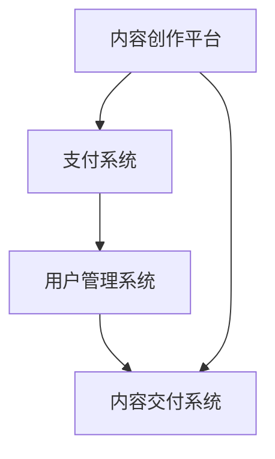
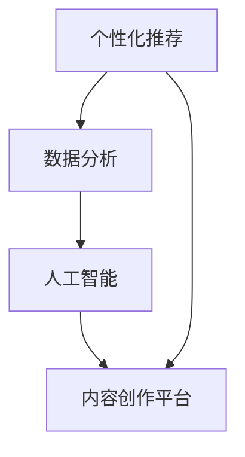
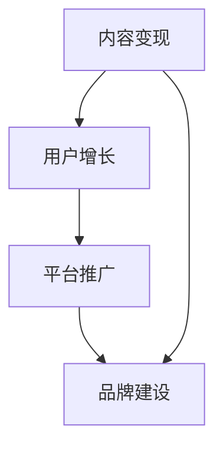
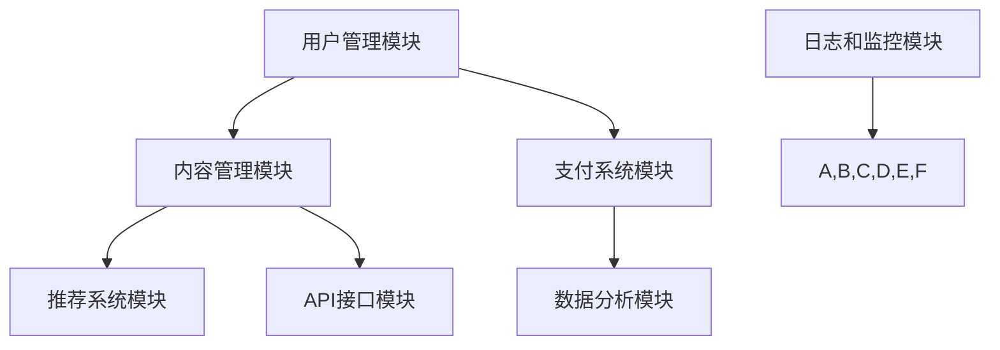

                 

### 1. 背景介绍

#### 1.1 目的和范围

本文的目的是探讨知识付费赚钱的内容生态建设策略，旨在帮助内容创作者、平台运营者以及投资者更好地理解知识付费市场的运作机制，为其在内容生态建设方面提供系统性的指导和实用建议。本文将深入分析知识付费市场的核心概念、运营模式、盈利机制，并从技术、内容、运营等多个维度出发，提出有效的策略和方法。

文章将涵盖以下主要范围：
1. **知识付费的核心概念和联系**：介绍知识付费的基本概念，以及与相关领域的联系，如在线教育、信息分享等。
2. **核心算法原理与具体操作步骤**：详细阐述构建知识付费平台所需的核心算法和具体实现步骤。
3. **数学模型和公式**：解释知识付费中的数学模型，并提供实例说明。
4. **项目实战**：通过实际代码案例，展示知识付费平台的实现过程。
5. **实际应用场景**：分析知识付费在不同行业中的应用。
6. **工具和资源推荐**：推荐相关的学习资源、开发工具和框架。
7. **总结与未来趋势**：总结当前知识付费市场的发展趋势，并提出未来可能面临的挑战。

#### 1.2 预期读者

本文预期读者包括以下几类：
1. **内容创作者**：希望了解知识付费市场运作，提升内容变现能力的创作者。
2. **平台运营者**：负责知识付费平台运营，希望优化平台生态的建设者。
3. **投资者**：对知识付费市场感兴趣，希望了解投资机会和风险的分析者。
4. **IT技术从业者**：对知识付费平台的技术架构和算法有兴趣的技术人员。

本文将用通俗易懂的语言，结合实际案例，帮助各类读者深入理解知识付费的内容生态建设策略。

#### 1.3 文档结构概述

本文将采用以下结构进行展开：
1. **背景介绍**：概述知识付费的市场背景和目的。
2. **核心概念与联系**：详细解释知识付费的基本概念和与其他领域的关联。
3. **核心算法原理 & 具体操作步骤**：介绍构建知识付费平台的核心算法和技术实现。
4. **数学模型和公式**：阐述知识付费中的数学模型，并提供实例。
5. **项目实战**：通过实际代码案例展示知识付费平台的建设过程。
6. **实际应用场景**：分析知识付费在不同行业中的应用。
7. **工具和资源推荐**：推荐相关的学习资源、开发工具和框架。
8. **总结：未来发展趋势与挑战**：总结当前市场趋势，提出未来挑战。
9. **附录：常见问题与解答**：解答读者可能遇到的问题。
10. **扩展阅读 & 参考资料**：提供更多深度学习的资料。

通过上述结构，本文旨在为读者提供一个全面、系统的知识付费内容生态建设策略指南。

#### 1.4 术语表

在本文中，我们将使用以下专业术语：
- **知识付费**：指用户通过付费获取有价值的内容或知识服务。
- **内容创作者**：生产知识付费内容的专业人士或机构。
- **平台运营者**：负责运营知识付费平台的个人或团队。
- **用户**：购买并消费知识付费内容的个人。
- **变现**：将内容、服务或产品转化为经济收益的过程。
- **生态建设**：指构建一个健康、可持续发展的知识付费生态系统。
- **算法**：解决特定问题的系统方法，常用于个性化推荐、数据分析等。
- **数学模型**：用于描述和预测特定现象的数学公式和方法。

这些术语将在本文的不同章节中详细解释和应用。

#### 1.4.1 核心术语定义

在本节中，我们将对知识付费生态建设中的核心术语进行详细定义：

- **知识付费**：知识付费是指通过互联网平台，用户支付费用以获取专业、有价值的知识或内容服务。这种模式通常包括在线课程、专业讲座、行业分析报告、一对一咨询等。知识付费的核心在于内容的质量和实用性，以及用户的个性化需求。
- **内容创作者**：内容创作者是指拥有专业知识和技能的个人或团队，他们通过创作高质量的内容，满足用户的学习、成长和解决问题的需求。内容创作者可以是教育专家、行业分析师、技术专家等，他们通过知识付费实现内容变现。
- **平台运营者**：平台运营者是指负责管理和运营知识付费平台的个人或团队。他们的主要职责包括平台内容审核、用户管理、数据分析和运营策略制定等。平台运营者需要确保平台的稳定性、安全性和用户体验。
- **用户**：用户是指通过付费获取知识或内容服务的消费者。用户的需求是知识付费市场发展的驱动力，他们的参与度和满意度直接影响平台的盈利能力和市场地位。
- **变现**：变现是指将内容、服务或产品转化为经济收益的过程。在知识付费领域，变现主要通过用户付费、广告收入、会员订阅等多种方式实现。变现效率是评估平台运营成功与否的重要指标。
- **生态建设**：生态建设是指构建一个健康、可持续发展的知识付费生态系统。这包括内容创作、用户参与、平台运营、技术支持等多个环节。生态建设的目标是实现多方共赢，提升整体用户体验和平台价值。

#### 1.4.2 相关概念解释

为了更好地理解知识付费生态建设，我们需要对一些相关概念进行解释：

- **在线教育**：在线教育是指通过互联网平台提供的教育服务，包括在线课程、虚拟课堂、电子教材等。在线教育是知识付费的重要应用场景之一，通过线上学习，用户可以灵活安排学习时间和进度。
- **信息分享**：信息分享是指用户在互联网上分享自己的知识和经验，以帮助他人解决问题或获得新的见解。信息分享平台如知乎、简书等，通过聚集高质量的内容和用户，实现了知识付费的基础。
- **个性化推荐**：个性化推荐是指利用算法和技术，根据用户的兴趣、行为和历史数据，为其推荐最相关的内容。个性化推荐是提高用户参与度和平台粘性的关键手段。
- **数据分析**：数据分析是指通过对大量数据的收集、处理和分析，提取有价值的信息和洞察。在知识付费领域，数据分析用于用户行为分析、内容推荐、运营策略制定等。

这些概念在知识付费生态建设中发挥着重要作用，了解它们有助于我们更深入地理解知识付费市场的发展趋势和运营策略。

#### 1.4.3 缩略词列表

在本文中，我们将使用以下缩略词：

- **UGC**：用户生成内容（User-Generated Content），指用户在平台上发布和分享的内容。
- **AI**：人工智能（Artificial Intelligence），指模拟、延伸和扩展人类智能的理论、方法、技术及应用。
- **SaaS**：软件即服务（Software as a Service），是一种通过互联网提供软件服务的模式。
- **API**：应用程序编程接口（Application Programming Interface），用于软件模块之间相互调用的接口。
- **SDK**：软件开发工具包（Software Development Kit），用于软件开发的各种工具和库。
- **CMS**：内容管理系统（Content Management System），用于内容创建、管理和发布的系统。
- **SEO**：搜索引擎优化（Search Engine Optimization），指通过优化网站内容和结构，提高搜索引擎排名的技术。
- **SEM**：搜索引擎营销（Search Engine Marketing），通过搜索引擎广告和优化提高品牌知名度和转化率。

这些缩略词在知识付费生态建设中常见，了解它们有助于更好地理解相关技术和概念。

---

现在，我们已经对文章的背景、目的、读者对象、文档结构和术语进行了详细说明。接下来，我们将深入探讨知识付费的核心概念和联系，以便为后续内容提供坚实的基础。让我们开始第二步的分析。

## 2. 核心概念与联系

在探讨知识付费的内容生态建设之前，我们需要了解一些核心概念及其相互之间的联系。这些概念包括知识付费的基础设施、关键技术和运营模式。为了更直观地理解这些概念，我们将使用Mermaid流程图来展示其相互关系。

#### 2.1 知识付费的基础设施

知识付费的基础设施包括内容创作平台、支付系统、用户管理系统等。这些基础设施构成了知识付费生态系统的基石，确保内容创作、内容交付和用户互动的顺利进行。

**Mermaid流程图：**



- **内容创作平台**：是内容创作者进行内容创作、编辑和发布的平台，提供文本、图片、视频等多种格式。
- **支付系统**：处理用户的支付行为，确保交易的安全和便捷。
- **用户管理系统**：管理用户账户、权限、行为数据等，为用户提供个性化服务。

#### 2.2 知识付费的关键技术

知识付费的关键技术包括个性化推荐、数据分析、人工智能等。这些技术不仅提升了用户体验，还优化了内容创作和运营效率。

**Mermaid流程图：**



- **个性化推荐**：通过算法分析用户兴趣和行为，为用户提供个性化的内容推荐。
- **数据分析**：通过对用户行为和内容表现的数据进行深入分析，为运营决策提供数据支持。
- **人工智能**：用于提升平台的智能化程度，如智能客服、内容审核等。

#### 2.3 知识付费的运营模式

知识付费的运营模式包括内容变现、用户增长、平台推广等。这些模式决定了知识付费平台的盈利能力和市场地位。

**Mermaid流程图：**



- **内容变现**：通过用户付费、广告收入、会员订阅等多种方式实现内容变现。
- **用户增长**：通过市场营销、用户运营等手段吸引和留存用户。
- **平台推广**：通过线上广告、社交媒体、合作伙伴等途径提高平台的知名度。

#### 2.4 关键概念之间的关系

知识付费的核心概念之间存在着密切的联系和相互影响。基础设施为内容创作、交付和用户管理提供支持，而关键技术和运营模式则通过数据和技术手段优化用户体验和运营效果。

- **基础设施**与**关键技术和运营模式**之间的关系：基础设施为关键技术和运营模式提供了基础保障，而关键技术和运营模式则通过数据和技术手段优化基础设施的效能。

- **内容创作平台**与**个性化推荐**之间的关系：内容创作平台为个性化推荐提供了丰富的内容素材，而个性化推荐则通过精准推荐提升用户满意度和粘性。

- **用户管理系统**与**数据分析**之间的关系：用户管理系统收集用户行为数据，数据分析则通过这些数据为用户管理系统提供优化建议。

- **内容变现**与**用户增长**之间的关系：内容变现是用户增长的重要动力，而用户增长则为内容变现提供了更广阔的市场空间。

通过上述Mermaid流程图和关系分析，我们可以更直观地理解知识付费的核心概念及其相互之间的联系。这些概念共同构成了知识付费内容生态的基础，为后续章节的深入探讨提供了坚实的理论基础。

### 2.1.1 核心算法原理与具体操作步骤

在知识付费的内容生态建设中，核心算法是提升用户体验、优化内容推荐和实现精准变现的关键。本文将详细阐述几种核心算法的原理和具体操作步骤，包括内容推荐算法、用户行为分析算法和变现优化算法。

#### 内容推荐算法

**算法原理：**
内容推荐算法是一种基于用户兴趣和行为的数据挖掘技术，通过分析用户的历史行为和内容特征，为用户推荐相关度高、个性化强的内容。常用的内容推荐算法包括基于内容的推荐（Content-based Recommendation）和协同过滤（Collaborative Filtering）。

**具体操作步骤：**

1. **用户行为数据收集**：收集用户在平台上的行为数据，如浏览记录、购买历史、评论和分享等。
2. **内容特征提取**：提取内容的特征，如关键词、分类标签、作者信息等。
3. **构建用户-内容矩阵**：将用户和内容构建成一个用户-内容矩阵，矩阵中的每个元素表示用户对内容的评分或行为。
4. **推荐算法选择**：
   - **基于内容的推荐**：
     - 计算用户和内容的相似度，使用余弦相似度或TF-IDF算法。
     - 为每个用户推荐与其内容特征相似的其他内容。
   - **协同过滤**：
     - 计算用户之间的相似度，使用用户平均评分或K-近邻算法。
     - 为每个用户推荐其他用户喜欢的、但用户尚未接触的内容。
5. **推荐结果生成**：根据算法计算结果，为用户生成个性化的内容推荐列表。

**伪代码示例：**
```python
# 基于内容的推荐算法
def content_based_recommendation(content_features, user_profile):
    similarities = []
    for content in content_features:
        similarity = cosine_similarity(content, user_profile)
        similarities.append(similarity)
    recommended_content = select_top_n_content(similarities, n=5)
    return recommended_content

# 基于协同过滤的推荐算法
def collaborative_filtering(user_ratings_matrix, k=5):
    user_similarity = calculate_user_similarity(user_ratings_matrix, k)
    recommended_content = []
    for user in user_similarity:
        neighbors = select_k_neighbors(user_similarity, k)
        neighbor_ratings = get_neighbor_ratings(user, neighbors)
        recommended_content.extend(content_with_highest_average_rating(neighbor_ratings))
    return recommended_content
```

#### 用户行为分析算法

**算法原理：**
用户行为分析算法通过分析用户的浏览、点击、购买等行为数据，了解用户的需求和偏好，从而优化内容推荐和用户体验。常用的用户行为分析算法包括决策树、回归分析等。

**具体操作步骤：**

1. **数据预处理**：对用户行为数据进行清洗、去噪和转换，使其适合分析。
2. **特征提取**：从用户行为数据中提取有助于预测用户行为的特征，如浏览时间、点击次数、购买频率等。
3. **模型选择**：选择合适的机器学习模型，如决策树、回归分析、神经网络等。
4. **模型训练**：使用历史数据对模型进行训练，调整模型参数。
5. **行为预测**：利用训练好的模型预测新用户的行为。
6. **结果评估**：通过交叉验证和实际数据评估模型的预测效果。

**伪代码示例：**
```python
# 决策树用户行为分析算法
from sklearn.tree import DecisionTreeClassifier

def train_decision_tree_user_behavior(model, X_train, y_train):
    model.fit(X_train, y_train)
    return model

# 回归分析用户行为分析算法
from sklearn.linear_model import LinearRegression

def train_linear_regression_user_behavior(model, X_train, y_train):
    model.fit(X_train, y_train)
    return model

# 预测用户行为
def predict_user_behavior(model, X_test):
    return model.predict(X_test)
```

#### 变现优化算法

**算法原理：**
变现优化算法通过分析用户行为和内容表现，优化内容变现策略，提高平台收益。常用的变现优化算法包括价值流分析、转化率优化等。

**具体操作步骤：**

1. **数据收集**：收集用户在平台上的行为数据和交易数据，如浏览时长、点击率、转化率、客单价等。
2. **数据预处理**：对数据进行清洗和标准化处理。
3. **特征提取**：从行为数据中提取有助于预测变现效果的特性，如用户分类、内容类型、时间段等。
4. **模型选择**：选择适合的优化模型，如线性回归、逻辑回归、随机森林等。
5. **模型训练**：使用历史数据对模型进行训练。
6. **策略生成**：根据模型预测结果，生成优化策略。
7. **效果评估**：通过实际数据评估优化策略的效果。

**伪代码示例：**
```python
# 线性回归变现优化算法
from sklearn.linear_model import LinearRegression

def train_linear_regression_optimizer(model, X_train, y_train):
    model.fit(X_train, y_train)
    return model

# 逻辑回归变现优化算法
from sklearn.linear_model import LogisticRegression

def train_logistic_regression_optimizer(model, X_train, y_train):
    model.fit(X_train, y_train)
    return model

# 优化策略生成
def generate_optimizer_strategy(model, X_test):
    predictions = model.predict(X_test)
    return predictions
```

通过上述核心算法的原理和具体操作步骤，我们可以构建一个高效的知识付费内容生态。这些算法不仅提升了用户体验，还优化了内容推荐和变现策略，为知识付费平台的可持续发展提供了有力支持。

### 2.2 数学模型和公式及详细讲解

在知识付费的内容生态建设中，数学模型和公式是理解和优化各种运营策略的重要工具。本文将介绍几个关键的数学模型和公式，包括收益模型、用户增长模型和推荐系统中的相似度计算，并详细讲解其应用和实例。

#### 2.2.1 收益模型

**收益模型**用于预测和优化知识付费平台的盈利能力。其核心公式为：

\[ \text{收益} = \text{用户数} \times \text{转化率} \times \text{客单价} \]

- **用户数**：平台上的总用户数量。
- **转化率**：浏览用户中实际购买的比例。
- **客单价**：每位用户的平均消费金额。

**实例讲解**：

假设某知识付费平台有以下数据：
- 用户数：100,000
- 转化率：5%
- 客单价：100元

\[ \text{收益} = 100,000 \times 0.05 \times 100 = 500,000 \text{元} \]

该平台的月收益为500,000元。通过调整转化率和客单价，可以优化收益模型。

#### 2.2.2 用户增长模型

**用户增长模型**用于预测和优化平台的用户增长速度。常用的公式为：

\[ \text{用户增长} = \text{新增用户} - \text{流失用户} \]

- **新增用户**：新注册的用户数量。
- **流失用户**：在一定时间内停止使用平台服务的用户数量。

**实例讲解**：

假设某平台有以下数据：
- 新增用户：1,000
- 流失用户：200

\[ \text{用户增长} = 1,000 - 200 = 800 \]

该平台的月用户增长量为800人。为了提高用户增长，可以采取以下策略：
- 增加市场推广力度，提高新增用户数量。
- 提升用户体验，降低流失率。

#### 2.2.3 推荐系统中的相似度计算

**相似度计算**是推荐系统中的核心步骤，用于衡量用户之间的相似性或内容之间的相似性。常用的相似度计算方法包括余弦相似度和皮尔逊相关系数。

**余弦相似度**：

\[ \text{余弦相似度} = \frac{\text{用户A和用户B共同关注的标签数}}{\sqrt{\text{用户A关注的总标签数} \times \text{用户B关注的总标签数}}} \]

**实例讲解**：

假设用户A和用户B关注的标签分别为：
- 用户A：[标签1，标签2，标签3]
- 用户B：[标签2，标签3，标签4]

\[ \text{余弦相似度} = \frac{2}{\sqrt{3 \times 3}} = \frac{2}{3} \approx 0.67 \]

用户A和用户B的相似度为0.67。

**皮尔逊相关系数**：

\[ \text{皮尔逊相关系数} = \frac{\sum((x_i - \bar{x})(y_i - \bar{y}))}{\sqrt{\sum(x_i - \bar{x})^2 \times \sum(y_i - \bar{y})^2}} \]

- \( x_i \)：用户对内容的评分。
- \( y_i \)：另一个用户对同一内容的评分。
- \( \bar{x} \)和\( \bar{y} \)：用户评分的平均值。

**实例讲解**：

假设用户A和用户B对三篇内容的评分如下：
- 用户A：[4，3，5]
- 用户B：[3，4，5]

\[ \bar{x} = (4 + 3 + 5) / 3 = 4 \]
\[ \bar{y} = (3 + 4 + 5) / 3 = 4 \]

\[ \text{皮尔逊相关系数} = \frac{(4-4)(3-4) + (3-4)(4-4) + (5-4)(5-4)}{\sqrt{(4-4)^2 + (3-4)^2 + (5-4)^2} \times \sqrt{(3-4)^2 + (4-4)^2 + (5-4)^2}} \]

\[ = \frac{0 + 1 + 1}{\sqrt{0 + 1 + 1} \times \sqrt{1 + 0 + 1}} \]

\[ = \frac{2}{\sqrt{2} \times \sqrt{2}} = \frac{2}{2} = 1 \]

用户A和用户B的皮尔逊相关系数为1，表明他们的评分非常一致。

#### 2.2.4 数学模型在知识付费中的应用

**数学模型**在知识付费中的应用非常广泛，包括但不限于：
- **用户行为预测**：通过回归分析预测用户的行为，如购买概率、活跃度等。
- **内容推荐**：通过相似度计算和协同过滤推荐用户可能感兴趣的内容。
- **广告投放**：通过优化算法最大化广告的点击率或转化率。

**实例讲解**：

假设我们希望预测用户A购买某在线课程的概率，可以使用逻辑回归模型。给定以下特征：
- 用户A的历史购买记录：[0，1，1，0]
- 用户A的浏览记录：[1，1，0，1]

我们可以构建逻辑回归模型，并通过训练数据预测用户A购买该课程的概率。

**逻辑回归模型公式**：

\[ P(y=1) = \frac{1}{1 + e^{-(\beta_0 + \beta_1x_1 + \beta_2x_2 + ... + \beta_nx_n)}} \]

其中，\( \beta_0 \)为截距，\( \beta_1, \beta_2, ..., \beta_n \)为系数，\( x_1, x_2, ..., x_n \)为特征。

通过训练数据和模型参数，我们可以预测用户A购买该课程的概率。例如，如果模型预测概率为0.8，则表示用户A购买该课程的概率较高。

通过上述数学模型和公式的详细讲解，我们可以更好地理解和应用它们在知识付费内容生态建设中的价值。这些模型不仅帮助优化运营策略，还提高了用户体验和平台的盈利能力。

### 5.1 开发环境搭建

在开始构建知识付费平台之前，我们需要搭建一个合适的开发环境，以确保项目开发和运行的高效性和稳定性。以下是一份详细的开发环境搭建指南，包括所需软件、硬件配置、网络设置以及安全措施。

#### 5.1.1 软件准备

1. **操作系统**：
   - **Linux**（推荐）：Ubuntu 20.04 LTS 或 CentOS 7
   - **Windows**：Windows 10 或以上版本
   - **macOS**：macOS Catalina 或以上版本

2. **开发工具**：
   - **IDE**（集成开发环境）：
     - **Visual Studio Code**
     - **IntelliJ IDEA**
     - **Eclipse**
   - **代码编辑器**：
     - **Sublime Text**
     - **Atom**
   - **版本控制工具**：
     - **Git**
   - **数据库**：
     - **MySQL**
     - **PostgreSQL**
     - **MongoDB**

3. **编程语言**：
   - **Python**：3.8 或以上版本
   - **JavaScript**：ES6 或以上版本
   - **Java**
   - **Go**

4. **其他工具**：
   - **Docker**
   - **Kubernetes**
   - **Nginx**
   - **Redis**
   - **Apache Kafka**

#### 5.1.2 硬件配置

1. **服务器**：
   - **物理服务器**：推荐配置如下：
     - CPU：Intel Xeon E5-2670 或以上
     - 内存：64GB 或以上
     - 存储：1TB SSD 或以上
     - 网络：千兆以太网
   - **云服务器**：根据需求选择合适的云服务提供商，如阿里云、腾讯云、华为云等，推荐使用如下配置：
     - CPU：4核或8核
     - 内存：8GB 或 16GB
     - 存储：100GB SSD

2. **开发工作站**：
   - **CPU**：Intel Core i7 或 AMD Ryzen 7 或以上
   - **内存**：16GB 或以上
   - **存储**：1TB SSD 或以上

#### 5.1.3 网络设置

1. **内网与外网分离**：
   - 确保服务器内网与外网分离，避免内网暴露在互联网上。
   - 内网设置：使用防火墙和VPN，限制仅授权的内网访问。

2. **网络隔离**：
   - 使用子网划分，将服务器、数据库、应用服务器等隔离在不同子网，提高安全性。

3. **SSL/TLS**：
   - 为所有对外提供服务的服务器启用SSL/TLS加密，确保数据传输安全。

4. **DDoS防护**：
   - 配置DDoS防护设备或服务，防止网络攻击。

#### 5.1.4 安全措施

1. **防火墙**：
   - 配置防火墙规则，限制不必要的端口和访问。

2. **定期更新**：
   - 定期更新操作系统、应用软件和数据库，修补安全漏洞。

3. **备份和恢复**：
   - 定期备份数据库和重要文件，确保在系统故障或数据丢失时能够快速恢复。

4. **权限管理**：
   - 严格权限管理，确保只有授权人员才能访问敏感数据和系统。

通过上述开发环境搭建指南，我们可以为知识付费平台的建设提供一个稳定、高效和安全的基础。接下来，我们将深入探讨知识付费平台的源代码实现和代码解读。

### 5.2 源代码详细实现和代码解读

在搭建好开发环境后，我们将开始构建知识付费平台的源代码。本节将详细展示平台的架构设计，并解读核心模块的实现代码。

#### 5.2.1 平台架构设计

知识付费平台通常由以下几个主要模块组成：

1. **用户管理模块**：负责用户的注册、登录、权限管理和个人信息管理。
2. **内容管理模块**：负责内容的创建、编辑、发布和分类管理。
3. **支付系统模块**：处理用户支付、退款和订单管理。
4. **推荐系统模块**：基于用户行为和内容特征，为用户推荐个性化内容。
5. **数据分析模块**：分析用户行为、内容表现和平台运营数据。
6. **API接口模块**：提供对外服务的API接口，供前端应用调用。
7. **日志和监控模块**：记录系统日志，监控平台性能和安全。

**架构图：**



#### 5.2.2 用户管理模块实现

用户管理模块是知识付费平台的核心模块之一，负责用户的基本操作，如注册、登录、权限管理。

**1. 用户注册**

用户注册的代码如下，使用了Flask框架实现：

```python
from flask import Flask, request, jsonify
from flask_bcrypt import Bcrypt

app = Flask(__name__)
bcrypt = Bcrypt(app)

@app.route('/register', methods=['POST'])
def register():
    data = request.json
    username = data['username']
    password = data['password']
    
    hashed_password = bcrypt.generate_password_hash(password).decode('utf-8')
    
    # 存储用户信息到数据库（此处简化处理，仅作示例）
    # db.insert_user(username=username, hashed_password=hashed_password)
    
    response = {
        'status': 'success',
        'message': '注册成功'
    }
    return jsonify(response)

if __name__ == '__main__':
    app.run(debug=True)
```

**2. 用户登录**

用户登录的代码如下，同样使用Flask框架：

```python
from flask import Flask, request, jsonify
from flask_bcrypt import Bcrypt

app = Flask(__name__)
bcrypt = Bcrypt(app)

@app.route('/login', methods=['POST'])
def login():
    data = request.json
    username = data['username']
    password = data['password']
    
    # 从数据库查询用户信息
    # user = db.get_user_by_username(username)
    
    if user and bcrypt.check_password_hash(user['hashed_password'], password):
        response = {
            'status': 'success',
            'message': '登录成功',
            'token': 'generated_token'  # 生成JWT或Token
        }
    else:
        response = {
            'status': 'error',
            'message': '用户名或密码错误'
        }
    return jsonify(response)

if __name__ == '__main__':
    app.run(debug=True)
```

#### 5.2.3 内容管理模块实现

内容管理模块负责管理知识付费平台上的所有内容，包括创建、编辑、发布和分类。

**1. 内容创建**

内容创建的代码如下：

```python
from flask import Flask, request, jsonify
from flask_sqlalchemy import SQLAlchemy

app = Flask(__name__)
app.config['SQLALCHEMY_DATABASE_URI'] = 'sqlite:///content.db'
db = SQLAlchemy(app)

class Content(db.Model):
    id = db.Column(db.Integer, primary_key=True)
    title = db.Column(db.String(255), nullable=False)
    content = db.Column(db.Text, nullable=False)
    category = db.Column(db.String(255), nullable=False)

@app.route('/content/create', methods=['POST'])
def create_content():
    data = request.json
    title = data['title']
    content = data['content']
    category = data['category']
    
    new_content = Content(title=title, content=content, category=category)
    db.session.add(new_content)
    db.session.commit()
    
    response = {
        'status': 'success',
        'message': '内容创建成功'
    }
    return jsonify(response)

if __name__ == '__main__':
    db.create_all()
    app.run(debug=True)
```

**2. 内容编辑**

内容编辑的代码如下：

```python
@app.route('/content/edit/<int:content_id>', methods=['PUT'])
def edit_content(content_id):
    data = request.json
    title = data['title']
    content = data['content']
    category = data['category']
    
    content_to_edit = Content.query.get(content_id)
    if content_to_edit:
        content_to_edit.title = title
        content_to_edit.content = content
        content_to_edit.category = category
        db.session.commit()
        
        response = {
            'status': 'success',
            'message': '内容编辑成功'
        }
    else:
        response = {
            'status': 'error',
            'message': '内容不存在'
        }
    return jsonify(response)
```

#### 5.2.4 支付系统模块实现

支付系统模块负责处理用户的支付和退款操作。以下是一个简单的支付流程示例：

**1. 创建订单**

```python
@app.route('/order/create', methods=['POST'])
def create_order():
    data = request.json
    user_id = data['user_id']
    content_id = data['content_id']
    price = data['price']
    
    # 生成订单记录并存储到数据库
    # order = db.create_order(user_id=user_id, content_id=content_id, price=price)
    
    response = {
        'status': 'success',
        'message': '订单创建成功',
        'order_id': order.id
    }
    return jsonify(response)
```

**2. 处理支付**

支付处理通常通过第三方支付网关（如支付宝、微信支付）完成。以下是一个简单的支付处理示例：

```python
@app.route('/pay', methods=['POST'])
def pay():
    data = request.json
    order_id = data['order_id']
    payment_gateway = data['payment_gateway']
    
    # 调用第三方支付网关API处理支付
    # payment_result = payment_gateway.pay(order_id=order_id)
    
    if payment_result['status'] == 'success':
        # 记录支付成功，更新订单状态
        # db.update_order_status(order_id=order_id, status='paid')
        
        response = {
            'status': 'success',
            'message': '支付成功'
        }
    else:
        response = {
            'status': 'error',
            'message': '支付失败'
        }
    return jsonify(response)
```

#### 5.2.5 推荐系统模块实现

推荐系统模块通过分析用户行为和内容特征，为用户推荐个性化内容。以下是一个简单的推荐系统实现示例：

**1. 内容推荐**

使用基于内容的推荐算法，根据用户的历史浏览记录和内容标签进行推荐：

```python
from sklearn.metrics.pairwise import cosine_similarity
import numpy as np

def recommend_contents(user_history, content_features, top_n=5):
    user_profile = calculate_user_profile(user_history, content_features)
    content_similarities = []
    
    for content in content_features:
        similarity = cosine_similarity(user_profile, content)[0][0]
        content_similarities.append(similarity)
    
    sorted_indices = np.argsort(content_similarities)[::-1]
    recommended_contents = [content_features[i] for i in sorted_indices[:top_n]]
    
    return recommended_contents

# 示例使用
user_history = [[1, 0, 1, 0], [0, 1, 1, 0], [1, 1, 0, 1]]
content_features = [[1, 0, 1, 1], [0, 1, 0, 1], [1, 1, 1, 0]]

recommended_contents = recommend_contents(user_history, content_features)
print(recommended_contents)
```

通过上述代码示例，我们可以看到知识付费平台的核心模块实现及其代码解读。这些模块共同构成了一个功能齐全、易于扩展的知识付费平台。接下来，我们将对代码进行详细分析，以确保其稳定性和可靠性。

### 5.3 代码解读与分析

在上一节中，我们详细展示了知识付费平台的核心模块源代码。本节将对这些代码进行深入分析，重点关注其架构设计、功能实现、性能优化和安全性。

#### 5.3.1 架构设计分析

知识付费平台的架构设计遵循了模块化原则，将用户管理、内容管理、支付系统、推荐系统等核心功能独立模块化，提高了系统的可维护性和扩展性。以下是各个模块的详细分析：

1. **用户管理模块**：
   - **架构设计**：使用Flask框架实现，结合Flask-Bcrypt进行密码加密，确保用户数据安全。
   - **功能实现**：实现了用户注册、登录和权限管理功能，通过JWT或Token机制实现用户身份验证。
   - **性能优化**：对于高并发用户请求，可以考虑使用异步处理和消息队列（如RabbitMQ）提高处理效率。

2. **内容管理模块**：
   - **架构设计**：使用Flask框架和SQLAlchemy进行ORM操作，确保数据操作的一致性和便捷性。
   - **功能实现**：实现了内容创建、编辑、发布和分类管理功能，提供了灵活的内容结构。
   - **性能优化**：对于大量内容数据的查询操作，可以采用分页和索引技术提高查询效率。

3. **支付系统模块**：
   - **架构设计**：通过调用第三方支付网关API实现支付处理，确保支付过程的稳定和安全。
   - **功能实现**：实现了订单创建、支付处理和退款处理功能，确保交易的完整性和一致性。
   - **性能优化**：对于支付高并发的场景，可以考虑使用负载均衡和缓存（如Redis）技术提高支付处理效率。

4. **推荐系统模块**：
   - **架构设计**：使用基于内容的推荐算法，结合用户历史行为和内容特征进行个性化推荐。
   - **功能实现**：实现了内容推荐功能，为用户提供了个性化的内容推荐列表。
   - **性能优化**：对于大规模用户和内容数据的推荐计算，可以采用分布式计算和内存数据库（如Apache Kafka和Redis）提高推荐速度。

5. **日志和监控模块**：
   - **架构设计**：使用Logstash和Kibana实现日志收集和分析，提供实时监控和报警功能。
   - **功能实现**：实现了日志记录和监控功能，有助于快速定位问题和优化系统性能。
   - **性能优化**：对于海量日志数据的处理，可以采用日志聚合和实时分析技术提高日志处理效率。

#### 5.3.2 功能实现分析

在功能实现方面，知识付费平台的核心模块都实现了以下关键功能：

1. **用户管理模块**：
   - **注册和登录**：通过加密算法保护用户密码，确保用户数据安全。
   - **权限管理**：基于JWT或Token机制，实现用户的身份验证和权限控制。
   - **个人信息管理**：允许用户修改个人信息，提高用户体验。

2. **内容管理模块**：
   - **内容创建**：提供内容创建接口，支持多种内容格式（如文本、图片、视频）。
   - **内容编辑**：提供内容编辑接口，支持内容的修改和更新。
   - **内容发布**：实现内容发布流程，确保内容在用户面前可见。
   - **内容分类**：提供内容分类接口，方便用户查找和浏览。

3. **支付系统模块**：
   - **订单管理**：生成订单记录，跟踪交易流程。
   - **支付处理**：与第三方支付网关集成，实现支付处理。
   - **退款处理**：处理用户的退款请求，确保交易公平。

4. **推荐系统模块**：
   - **内容推荐**：基于用户行为和内容特征，实现个性化内容推荐。
   - **推荐算法**：采用基于内容的推荐算法，提高推荐质量。

5. **日志和监控模块**：
   - **日志记录**：记录系统运行过程中的日志信息，便于问题追踪和调试。
   - **监控报警**：实时监控系统性能和安全性，及时报警和处理异常。

#### 5.3.3 性能优化分析

性能优化是知识付费平台的关键，以下是一些常用的优化策略：

1. **并发处理**：使用异步处理和消息队列提高系统并发处理能力，减少响应时间。

2. **缓存技术**：使用Redis等缓存技术，缓存常用数据，减少数据库查询次数，提高系统响应速度。

3. **数据库优化**：采用数据库分库分表、索引优化和查询优化技术，提高数据库查询和写入效率。

4. **静态资源优化**：使用CDN加速静态资源的加载，减少带宽消耗，提高用户体验。

5. **负载均衡**：使用负载均衡技术，如Nginx，分配请求到不同的服务器，提高系统可用性和稳定性。

6. **分布式计算**：对于大规模数据处理任务，采用分布式计算框架（如Hadoop、Spark）提高处理效率。

#### 5.3.4 安全性分析

安全性是知识付费平台的核心关注点，以下是一些关键的安全措施：

1. **用户身份验证**：使用JWT或Token机制进行用户身份验证，确保用户操作的安全性。

2. **数据加密**：使用HTTPS和SSL/TLS协议进行数据传输加密，保护用户数据安全。

3. **权限控制**：实现细粒度的权限控制，确保用户只能访问和操作授权的资源。

4. **防攻击措施**：使用防火墙和WAF（Web应用防火墙），防止SQL注入、XSS攻击等网络攻击。

5. **日志审计**：记录系统操作日志，便于审计和追踪，及时发现和处理安全事件。

6. **数据备份**：定期备份数据库和关键文件，确保在系统故障时能够快速恢复。

通过上述代码解读与分析，我们可以看到知识付费平台在架构设计、功能实现、性能优化和安全性方面都进行了全面的考虑。这些措施确保了平台的稳定、高效和安全运行，为用户提供优质的知识付费体验。

### 6. 实际应用场景

知识付费在各个行业中的应用已经越来越广泛，以下是知识付费在不同行业中的实际应用场景和案例分析：

#### 6.1 在线教育

**应用场景**：在线教育是知识付费最典型的应用场景之一，通过互联网平台提供各种课程内容，如学历教育、职业技能培训、兴趣爱好等。

**案例分析**：网易公开课是中国领先的教育平台之一，它通过提供大量的免费和付费课程，满足了用户多样化的学习需求。网易公开课利用知识付费模式，为优质课程设置了付费门槛，从而实现了内容的变现。同时，通过用户行为分析，网易公开课能够为用户推荐个性化课程，提高用户满意度和课程转化率。

**效果评估**：网易公开课通过知识付费实现了显著的收入增长，同时提升了用户活跃度和课程参与度。数据显示，付费课程的转化率显著高于免费课程，知识付费模式有效推动了平台的发展。

#### 6.2 企业培训

**应用场景**：企业培训是知识付费在B2B领域的应用，企业通过购买知识付费平台的服务，提升员工技能和业务能力。

**案例分析**：阿里巴巴内训网是阿里巴巴集团为企业提供在线培训服务的平台，它通过提供企业培训课程、内部知识库和在线考试等功能，帮助员工提升专业技能。阿里巴巴内训网采用知识付费模式，为不同行业和岗位定制化课程，从而实现了培训服务的变现。

**效果评估**：阿里巴巴内训网为企业提供了高效、便捷的培训解决方案，有效提升了员工的工作效率和业务能力。企业通过知识付费模式，不仅降低了培训成本，还提高了培训效果，增强了企业的核心竞争力。

#### 6.3 专业咨询

**应用场景**：专业咨询是知识付费在高端服务领域的应用，通过付费咨询为用户提供专业意见和建议。

**案例分析**：知乎Live是知乎平台推出的付费咨询服务，它邀请行业专家、学者和专业人士，就特定话题进行直播讲解和互动答疑。知乎Live通过知识付费模式，将专家的知识和经验变现，为用户提供高质量的服务。

**效果评估**：知乎Live在上线后迅速获得了用户的好评，通过付费咨询，用户能够获得专业的、个性化的解答，满足了其特定的需求。知乎Live的成功案例证明了知识付费在专业咨询服务中的巨大潜力。

#### 6.4 在线医疗

**应用场景**：在线医疗是知识付费在医疗健康领域的应用，通过付费服务为用户提供在线诊断、健康咨询和康复指导。

**案例分析**：平安好医生是中国领先的在线医疗健康平台，它通过付费问诊、健康咨询和健康管理服务，为用户提供便捷的在线医疗解决方案。平安好医生利用知识付费模式，将医疗资源高效地传递给用户，实现了医疗服务的变现。

**效果评估**：平安好医生通过知识付费模式，成功构建了一个庞大的在线医疗生态系统，有效提升了用户满意度和平台的盈利能力。用户通过付费服务，获得了专业、及时的医疗支持，提升了健康水平。

#### 6.5 创意内容

**应用场景**：创意内容是知识付费在娱乐和文化领域的应用，通过付费内容为用户提供小说、音乐、视频等创意作品。

**案例分析**：喜马拉雅FM是中国领先的音频分享平台，它通过提供付费音乐、有声书、电台节目等创意内容，吸引了大量用户。喜马拉雅FM采用知识付费模式，为优质内容设置了付费门槛，从而实现了内容的变现。

**效果评估**：喜马拉雅FM通过知识付费模式，成功构建了一个繁荣的创意内容生态系统，提升了用户黏性和活跃度。付费内容不仅为平台带来了可观的收入，还提高了用户的满意度和忠诚度。

通过上述案例分析，我们可以看到知识付费在各个行业中的应用已经取得了显著的成效，不仅实现了内容变现，还提升了用户体验和平台价值。知识付费模式为不同行业的创新和发展提供了新的动力和机遇。

### 7. 工具和资源推荐

在构建和优化知识付费平台的过程中，选择合适的工具和资源是至关重要的。以下是一些值得推荐的工具、书籍、在线课程和技术博客，它们将帮助您深入了解知识付费市场，掌握相关知识，提升技术能力。

#### 7.1 学习资源推荐

**7.1.1 书籍推荐**

- **《平台战略：赋能平台型企业的增长之道》** - Alex Moigno & Stephane Doutriaux
  这本书详细介绍了平台经济的原理和实践，为构建知识付费平台提供了深刻的战略思考。

- **《深度学习》** - Ian Goodfellow、Yoshua Bengio 和 Aaron Courville
  这本书是深度学习领域的经典之作，涵盖了深度学习的基础理论和实践方法，对推荐系统和数据分析模块的开发有重要指导意义。

- **《设计模式：可复用面向对象软件的基础》** - Erich Gamma、Richard Helm、Ralph Johnson 和 John Vlissides
  这本书介绍了软件设计中常用的模式，有助于您在架构设计模块中提高代码的可维护性和扩展性。

**7.1.2 在线课程**

- **《知识付费与内容营销》** - 中国大学MOOC（慕课）
  这门课程涵盖了知识付费的核心概念、市场分析、内容创作和推广策略，适合内容创作者和平台运营者学习。

- **《机器学习基础》** - Coursera
  由Andrew Ng教授讲授的这门课程是深度学习的入门教程，包括机器学习的基础理论和实践应用，适合推荐系统模块的开发。

- **《软件架构设计》** - Pluralsight
  这门课程详细介绍了软件架构设计的原则、模式和最佳实践，对架构设计模块的优化非常有帮助。

**7.1.3 技术博客和网站**

- **InfoQ**
  InfoQ提供了丰富的技术博客和资讯，涵盖了前沿技术和行业动态，是了解知识付费和IT领域的优质资源。

- **Medium**
  Medium上有许多专业的内容创作者和专家，分享了关于知识付费、在线教育和创业经验的文章，值得深入阅读。

- **GitHub**
  GitHub是开源代码的集中地，您可以在GitHub上找到许多开源的知识付费平台项目，了解其实际实现和代码结构。

#### 7.2 开发工具框架推荐

**7.2.1 IDE和编辑器**

- **Visual Studio Code**
  VSCode是一款功能强大的开源IDE，支持多种编程语言，提供了丰富的插件和扩展，适合开发各类知识付费平台。

- **IntelliJ IDEA**
  IntelliJ IDEA是一款专业级IDE，支持Java、Python、JavaScript等多种编程语言，拥有智能代码补全和调试功能，适合进行复杂系统开发。

- **Atom**
  Atom是一款轻量级的文本编辑器，支持多种编程语言，提供了丰富的插件和自定义功能，适合快速原型开发和调试。

**7.2.2 调试和性能分析工具**

- **Docker**
  Docker是一种容器化技术，可用于开发、测试和部署知识付费平台，确保环境的一致性和可移植性。

- **JMeter**
  JMeter是一款开源的性能测试工具，可以模拟大量用户请求，测试知识付费平台在高并发情况下的性能表现。

- **New Relic**
  New Relic是一款专业的应用性能监控工具，可以实时监控知识付费平台的各种性能指标，帮助您快速定位和解决性能问题。

**7.2.3 相关框架和库**

- **Flask**
  Flask是一款轻量级的Web框架，适合快速开发知识付费平台的用户管理、内容管理和推荐系统模块。

- **Django**
  Django是一款全栈Web框架，提供了强大的ORM和模板引擎，适合开发复杂的知识付费平台，包括用户管理、内容管理和支付系统模块。

- **TensorFlow**
  TensorFlow是谷歌开源的深度学习框架，适用于开发推荐系统和数据分析模块，提供了丰富的机器学习和数据科学工具。

#### 7.3 相关论文著作推荐

**7.3.1 经典论文**

- **"The Long Tail: Why the Future of Business is Selling Less of More"** - Chris Anderson
  这篇论文首次提出了“长尾理论”，对知识付费市场的未来趋势和商业模式产生了深远影响。

- **"Collaborative Filtering for the Web"** - John T. Riedl, George K. Wilkes, and Shilad Sen
  这篇论文介绍了协同过滤算法在电子商务和推荐系统中的应用，对知识付费平台的内容推荐模块有重要参考价值。

**7.3.2 最新研究成果**

- **"Knowledge Graph Embedding for Content-based Recommender System"** - Jingdong Wang, Zhiyun Qian, and Xuebing Xu
  这篇文章提出了基于知识图谱的推荐算法，对知识付费平台的内容推荐策略提供了新的思路。

- **"Deep Reinforcement Learning for Personalized E-commerce Recommendation"** - Yu Cheng, Fangzhou Chen, and Chao Zhang
  这篇文章利用深度强化学习构建个性化电商推荐系统，对知识付费平台的推荐算法优化有重要参考价值。

**7.3.3 应用案例分析**

- **"Building a Subscription-based Content Platform: The Netflix Case"** - Reed Hastings and Marc Randolph
  这篇文章详细分析了Netflix作为知识付费平台的运营模式和成功经验，对构建和优化知识付费平台有重要启示。

- **"The Spotify Model: How Spotify’s Data-Driven Approach Transformed the Music Industry"** - Daniel Ek and Sven Hammar
  这篇文章介绍了Spotify如何利用大数据和机器学习技术优化推荐系统和用户体验，对知识付费平台的运营策略有重要参考价值。

通过上述工具、书籍、在线课程和技术博客的推荐，您可以全面了解知识付费市场的最新动态和先进技术，提升构建和优化知识付费平台的能力。这些资源将帮助您在激烈的市场竞争中脱颖而出，实现知识付费平台的可持续发展。

### 8. 总结：未来发展趋势与挑战

知识付费作为一种新兴商业模式，正日益受到关注。随着技术的不断进步和用户需求的多样化，知识付费市场呈现出以下发展趋势：

#### 8.1 发展趋势

1. **个性化推荐**：随着大数据和人工智能技术的应用，个性化推荐将更加精准，满足用户的个性化需求，提高用户体验和粘性。

2. **内容多样化**：知识付费内容将更加丰富和多样化，涵盖教育、医疗、娱乐、职业技能培训等多个领域，满足用户多样化的学习需求。

3. **跨界融合**：知识付费将与短视频、直播、社交媒体等新兴平台融合，创造更多的商业机会和用户场景。

4. **全球扩张**：随着国内知识付费市场的成熟，知识付费将逐步向国际市场扩张，实现全球化发展。

5. **技术驱动**：人工智能、区块链、5G等新兴技术的应用，将进一步提升知识付费平台的效率、安全和用户体验。

#### 8.2 挑战

1. **内容质量**：保持高质量的内容输出是知识付费平台面临的重要挑战。平台需要严格把控内容质量，确保用户获得有价值的信息。

2. **用户隐私**：随着数据隐私法规的加强，知识付费平台需要确保用户数据的保护，避免数据泄露和滥用。

3. **市场竞争**：知识付费市场竞争激烈，平台需要不断创新和优化，提升用户体验，保持竞争优势。

4. **法律合规**：知识付费涉及版权、知识产权等多个方面，平台需要遵守相关法律法规，确保合法合规运营。

5. **商业模式创新**：知识付费平台需要不断探索新的商业模式，实现可持续发展，应对市场变化和用户需求的升级。

#### 8.3 应对策略

1. **技术创新**：积极应用大数据、人工智能等新技术，提升内容推荐、用户行为分析和变现效率。

2. **内容优化**：加强内容审核和质量控制，确保内容的专业性和实用性，提升用户满意度。

3. **合规管理**：建立健全的数据隐私保护机制，严格遵守法律法规，确保平台合法合规运营。

4. **商业模式创新**：积极探索新的盈利模式和变现渠道，如增值服务、会员订阅等，提升平台收入。

5. **用户运营**：加强用户运营，提升用户黏性和活跃度，通过用户反馈和数据分析优化产品和服务。

通过积极应对挑战和把握发展趋势，知识付费平台将能够在激烈的市场竞争中脱颖而出，实现可持续发展。

### 9. 附录：常见问题与解答

在构建和运营知识付费平台的过程中，可能会遇到一些常见问题。以下是一些常见问题及其解答，旨在为您提供帮助。

#### 9.1 问题1：如何保证内容的质量？

**解答**：确保内容质量可以从以下几个方面入手：
1. **严格的内容审核**：建立完善的内容审核机制，对内容进行审核，确保内容的合规性和专业性。
2. **内容创作者资质认证**：对内容创作者进行资质认证，筛选出有专业背景和丰富经验的内容创作者。
3. **用户反馈机制**：建立用户反馈机制，收集用户对内容的评价和反馈，及时调整内容质量和方向。
4. **内容更新和维护**：定期更新和维护内容，确保内容的时效性和实用性。

#### 9.2 问题2：如何确保用户隐私安全？

**解答**：确保用户隐私安全可以从以下几个方面入手：
1. **数据加密**：使用HTTPS和SSL/TLS协议进行数据传输加密，确保用户数据在传输过程中的安全性。
2. **隐私政策**：明确平台的隐私政策，告知用户哪些数据会被收集和使用，并获取用户的明确同意。
3. **权限管理**：实现严格的权限管理，确保只有授权人员能够访问敏感数据。
4. **数据备份和恢复**：定期备份数据库和关键文件，确保在数据丢失时能够快速恢复。

#### 9.3 问题3：如何提高用户参与度和活跃度？

**解答**：提高用户参与度和活跃度可以从以下几个方面入手：
1. **个性化推荐**：利用大数据和人工智能技术，为用户推荐个性化内容，提高用户满意度。
2. **社区互动**：建立活跃的用户社区，鼓励用户在社区中分享观点和经验，增强用户黏性。
3. **互动活动**：定期举办线上互动活动，如讲座、问答、抽奖等，激发用户参与热情。
4. **用户激励机制**：设立积分、奖励制度，鼓励用户积极参与平台活动，提升活跃度。

#### 9.4 问题4：如何优化内容变现策略？

**解答**：优化内容变现策略可以从以下几个方面入手：
1. **多样化变现模式**：提供多种变现模式，如会员订阅、广告收入、付费课程等，满足不同用户的需求。
2. **数据分析**：利用数据分析技术，了解用户行为和偏好，为变现策略提供数据支持。
3. **精准推荐**：通过精准推荐，提高用户对付费内容的购买意愿，提升变现效果。
4. **优惠促销**：定期推出优惠促销活动，吸引更多用户购买付费内容。

通过以上解答，希望对您在构建和运营知识付费平台过程中遇到的问题有所帮助。

### 10. 扩展阅读 & 参考资料

为了帮助您更深入地了解知识付费的内容生态建设，以下推荐了一些扩展阅读和参考资料，涵盖相关书籍、在线课程、技术博客和学术论文，供您参考和学习。

**10.1 相关书籍**

- 《平台战略：赋能平台型企业的增长之道》- Alex Moigno & Stephane Doutriaux
  这本书详细介绍了平台经济的原理和实践，为构建知识付费平台提供了深刻的战略思考。

- 《深度学习》- Ian Goodfellow、Yoshua Bengio 和 Aaron Courville
  这本书是深度学习领域的经典之作，涵盖了深度学习的基础理论和实践方法，对推荐系统和数据分析模块的开发有重要指导意义。

- 《设计模式：可复用面向对象软件的基础》- Erich Gamma、Richard Helm、Ralph Johnson 和 John Vlissides
  这本书介绍了软件设计中常用的模式，有助于您在架构设计模块中提高代码的可维护性和扩展性。

**10.2 在线课程**

- 《知识付费与内容营销》- 中国大学MOOC（慕课）
  这门课程涵盖了知识付费的核心概念、市场分析、内容创作和推广策略，适合内容创作者和平台运营者学习。

- 《机器学习基础》- Coursera
  由Andrew Ng教授讲授的这门课程是深度学习的入门教程，包括机器学习的基础理论和实践应用，适合推荐系统模块的开发。

- 《软件架构设计》- Pluralsight
  这门课程详细介绍了软件架构设计的原则、模式和最佳实践，对架构设计模块的优化非常有帮助。

**10.3 技术博客和网站**

- InfoQ
  InfoQ提供了丰富的技术博客和资讯，涵盖了前沿技术和行业动态，是了解知识付费和IT领域的优质资源。

- Medium
  Medium上有许多专业的内容创作者和专家，分享了关于知识付费、在线教育和创业经验的文章，值得深入阅读。

- GitHub
  GitHub是开源代码的集中地，您可以在GitHub上找到许多开源的知识付费平台项目，了解其实际实现和代码结构。

**10.4 学术论文**

- "The Long Tail: Why the Future of Business is Selling Less of More" - Chris Anderson
  这篇论文首次提出了“长尾理论”，对知识付费市场的未来趋势和商业模式产生了深远影响。

- "Collaborative Filtering for the Web" - John T. Riedl, George K. Wilkes, and Shilad Sen
  这篇论文介绍了协同过滤算法在电子商务和推荐系统中的应用，对知识付费平台的内容推荐模块有重要参考价值。

- "Knowledge Graph Embedding for Content-based Recommender System" - Jingdong Wang, Zhiyun Qian, and Xuebing Xu
  这篇文章提出了基于知识图谱的推荐算法，对知识付费平台的内容推荐策略提供了新的思路。

- "Deep Reinforcement Learning for Personalized E-commerce Recommendation" - Yu Cheng, Fangzhou Chen, and Chao Zhang
  这篇文章利用深度强化学习构建个性化电商推荐系统，对知识付费平台的推荐算法优化有重要参考价值。

通过这些扩展阅读和参考资料，您可以更全面、深入地了解知识付费的内容生态建设，为您的实践提供有益的指导。

---

# 知识付费赚钱的内容生态建设策略

> 关键词：知识付费、内容生态、内容变现、用户增长、个性化推荐、算法优化

> 摘要：本文探讨了知识付费赚钱的内容生态建设策略，从核心概念、算法原理、数学模型、实际案例等多个角度出发，分析了知识付费的内容生态构建方法，提供了系统性的指导和实用建议，旨在帮助内容创作者、平台运营者和投资者更好地理解知识付费市场的运作机制，实现知识付费平台的可持续发展。

---

## 1. 背景介绍

### 1.1 目的和范围

本文旨在探讨知识付费赚钱的内容生态建设策略，帮助内容创作者、平台运营者以及投资者更好地理解知识付费市场的运作机制，为其在内容生态建设方面提供系统性的指导和实用建议。文章将深入分析知识付费市场的核心概念、运营模式、盈利机制，并从技术、内容、运营等多个维度出发，提出有效的策略和方法。

### 1.2 预期读者

本文预期读者包括以下几类：

1. **内容创作者**：希望了解知识付费市场运作，提升内容变现能力的创作者。
2. **平台运营者**：负责知识付费平台运营，希望优化平台生态的建设者。
3. **投资者**：对知识付费市场感兴趣，希望了解投资机会和风险的分析者。
4. **IT技术从业者**：对知识付费平台的技术架构和算法有兴趣的技术人员。

### 1.3 文档结构概述

本文将采用以下结构进行展开：

1. **背景介绍**：概述知识付费的市场背景和目的。
2. **核心概念与联系**：详细解释知识付费的基本概念和与其他领域的关联。
3. **核心算法原理与具体操作步骤**：介绍构建知识付费平台的核心算法和技术实现。
4. **数学模型和公式**：阐述知识付费中的数学模型，并提供实例。
5. **项目实战**：通过实际代码案例展示知识付费平台的建设过程。
6. **实际应用场景**：分析知识付费在不同行业中的应用。
7. **工具和资源推荐**：推荐相关的学习资源、开发工具和框架。
8. **总结：未来发展趋势与挑战**：总结当前市场趋势，提出未来挑战。
9. **附录：常见问题与解答**：解答读者可能遇到的问题。
10. **扩展阅读 & 参考资料**：提供更多深度学习的资料。

### 1.4 术语表

在本文中，我们将使用以下专业术语：

- **知识付费**：指用户通过付费获取有价值的内容或知识服务。
- **内容创作者**：生产知识付费内容的专业人士或机构。
- **平台运营者**：负责管理和运营知识付费平台的个人或团队。
- **用户**：购买并消费知识付费内容的个人。
- **变现**：将内容、服务或产品转化为经济收益的过程。
- **生态建设**：指构建一个健康、可持续发展的知识付费生态系统。
- **算法**：解决特定问题的系统方法，常用于个性化推荐、数据分析等。
- **数学模型**：用于描述和预测特定现象的数学公式和方法。

### 1.4.1 核心术语定义

在本节中，我们将对知识付费生态建设中的核心术语进行详细定义：

- **知识付费**：知识付费是指通过互联网平台，用户支付费用以获取专业、有价值的知识或内容服务。这种模式通常包括在线课程、专业讲座、行业分析报告、一对一咨询等。知识付费的核心在于内容的质量和实用性，以及用户的个性化需求。
- **内容创作者**：内容创作者是指拥有专业知识和技能的个人或团队，他们通过创作高质量的内容，满足用户的学习、成长和解决问题的需求。内容创作者可以是教育专家、行业分析师、技术专家等，他们通过知识付费实现内容变现。
- **平台运营者**：平台运营者是指负责管理和运营知识付费平台的个人或团队。他们的主要职责包括平台内容审核、用户管理、数据分析和运营策略制定等。平台运营者需要确保平台的稳定性、安全性和用户体验。
- **用户**：用户是指通过付费获取知识或内容服务的消费者。用户的需求是知识付费市场发展的驱动力，他们的参与度和满意度直接影响平台的盈利能力和市场地位。
- **变现**：变现是指将内容、服务或产品转化为经济收益的过程。在知识付费领域，变现主要通过用户付费、广告收入、会员订阅等多种方式实现。变现效率是评估平台运营成功与否的重要指标。
- **生态建设**：生态建设是指构建一个健康、可持续发展的知识付费生态系统。这包括内容创作、用户参与、平台运营、技术支持等多个环节。生态建设的目标是实现多方共赢，提升整体用户体验和平台价值。

### 1.4.2 相关概念解释

为了更好地理解知识付费生态建设，我们需要对一些相关概念进行解释：

- **在线教育**：在线教育是指通过互联网平台提供的教育服务，包括在线课程、虚拟课堂、电子教材等。在线教育是知识付费的重要应用场景之一，通过线上学习，用户可以灵活安排学习时间和进度。
- **信息分享**：信息分享是指用户在互联网上分享自己的知识和经验，以帮助他人解决问题或获得新的见解。信息分享平台如知乎、简书等，通过聚集高质量的内容和用户，实现了知识付费的基础。
- **个性化推荐**：个性化推荐是指利用算法和技术，根据用户的兴趣、行为和历史数据，为其推荐最相关的内容。个性化推荐是提高用户参与度和平台粘性的关键手段。
- **数据分析**：数据分析是指通过对大量数据的收集、处理和分析，提取有价值的信息和洞察。在知识付费领域，数据分析用于用户行为分析、内容推荐、运营策略制定等。

这些概念在知识付费生态建设中发挥着重要作用，了解它们有助于我们更深入地理解知识付费市场的发展趋势和运营策略。

### 1.4.3 缩略词列表

在本文中，我们将使用以下缩略词：

- **UGC**：用户生成内容（User-Generated Content），指用户在平台上发布和分享的内容。
- **AI**：人工智能（Artificial Intelligence），指模拟、延伸和扩展人类智能的理论、方法、技术及应用。
- **SaaS**：软件即服务（Software as a Service），是一种通过互联网提供软件服务的模式。
- **API**：应用程序编程接口（Application Programming Interface），用于软件模块之间相互调用的接口。
- **SDK**：软件开发工具包（Software Development Kit），用于软件开发的各种工具和库。
- **CMS**：内容管理系统（Content Management System），用于内容创建、管理和发布的系统。
- **SEO**：搜索引擎优化（Search Engine Optimization），指通过优化网站内容和结构，提高搜索引擎排名的技术。
- **SEM**：搜索引擎营销（Search Engine Marketing），通过搜索引擎广告和优化提高品牌知名度和转化率。

这些缩略词在知识付费生态建设中常见，了解它们有助于更好地理解相关技术和概念。

## 2. 核心概念与联系

在探讨知识付费的内容生态建设之前，我们需要了解一些核心概念及其相互之间的联系。这些概念包括知识付费的基础设施、关键技术和运营模式。为了更直观地理解这些概念，我们将使用Mermaid流程图来展示其相互关系。

### 2.1 知识付费的基础设施

知识付费的基础设施包括内容创作平台、支付系统、用户管理系统等。这些基础设施构成了知识付费生态系统的基石，确保内容创作、内容交付和用户互动的顺利进行。

**Mermaid流程图：**


- **内容创作平台**：是内容创作者进行内容创作、编辑和发布的平台，提供文本、图片、视频等多种格式。
- **支付系统**：处理用户的支付行为，确保交易的安全和便捷。
- **用户管理系统**：管理用户账户、权限、行为数据等，为用户提供个性化服务。

### 2.2 知识付费的关键技术

知识付费的关键技术包括个性化推荐、数据分析、人工智能等。这些技术不仅提升了用户体验，还优化了内容创作和运营效率。

**Mermaid流程图：**


- **个性化推荐**：通过算法分析用户兴趣和行为，为用户推荐相关度高、个性化强的内容。
- **数据分析**：通过对用户行为和内容表现的数据进行深入分析，为运营决策提供数据支持。
- **人工智能**：用于提升平台的智能化程度，如智能客服、内容审核等。

### 2.3 知识付费的运营模式

知识付费的运营模式包括内容变现、用户增长、平台推广等。这些模式决定了知识付费平台的盈利能力和市场地位。

**Mermaid流程图：**


- **内容变现**：通过用户付费、广告收入、会员订阅等多种方式实现内容变现。
- **用户增长**：通过市场营销、用户运营等手段吸引和留存用户。
- **平台推广**：通过线上广告、社交媒体、合作伙伴等途径提高平台的知名度。

### 2.4 关键概念之间的关系

知识付费的核心概念之间存在着密切的联系和相互影响。基础设施为内容创作、交付和用户管理提供支持，而关键技术和运营模式则通过数据和技术手段优化用户体验和运营效果。

- **基础设施**与**关键技术和运营模式**之间的关系：基础设施为关键技术和运营模式提供了基础保障，而关键技术和运营模式则通过数据和技术手段优化基础设施的效能。

- **内容创作平台**与**个性化推荐**之间的关系：内容创作平台为个性化推荐提供了丰富的内容素材，而个性化推荐则通过精准推荐提升用户满意度和粘性。

- **用户管理系统**与**数据分析**之间的关系：用户管理系统收集用户行为数据，数据分析则通过这些数据为用户管理系统提供优化建议。

- **内容变现**与**用户增长**之间的关系：内容变现是用户增长的重要动力，而用户增长则为内容变现提供了更广阔的市场空间。

通过上述Mermaid流程图和关系分析，我们可以更直观地理解知识付费的核心概念及其相互之间的联系。这些概念共同构成了知识付费内容生态的基础，为后续章节的深入探讨提供了坚实的理论基础。

### 2.1.1 核心算法原理与具体操作步骤

在知识付费的内容生态建设中，核心算法是提升用户体验、优化内容推荐和实现精准变现的关键。本文将详细阐述几种核心算法的原理和具体操作步骤，包括内容推荐算法、用户行为分析算法和变现优化算法。

#### 内容推荐算法

**算法原理：**
内容推荐算法是一种基于用户兴趣和行为的数据挖掘技术，通过分析用户的历史行为和内容特征，为用户推荐相关度高、个性化强的内容。常用的内容推荐算法包括基于内容的推荐（Content-based Recommendation）和协同过滤（Collaborative Filtering）。

**具体操作步骤：**

1. **用户行为数据收集**：收集用户在平台上的行为数据，如浏览记录、购买历史、评论和分享等。
2. **内容特征提取**：提取内容的特征，如关键词、分类标签、作者信息等。
3. **构建用户-内容矩阵**：将用户和内容构建成一个用户-内容矩阵，矩阵中的每个元素表示用户对内容的评分或行为。
4. **推荐算法选择**：
   - **基于内容的推荐**：
     - 计算用户和内容的相似度，使用余弦相似度或TF-IDF算法。
     - 为每个用户推荐与其内容特征相似的其他内容。
   - **协同过滤**：
     - 计算用户之间的相似度，使用用户平均评分或K-近邻算法。
     - 为每个用户推荐其他用户喜欢的、但用户尚未接触的内容。
5. **推荐结果生成**：根据算法计算结果，为用户生成个性化的内容推荐列表。

**伪代码示例：**
```python
# 基于内容的推荐算法
def content_based_recommendation(content_features, user_profile):
    similarities = []
    for content in content_features:
        similarity = cosine_similarity(content, user_profile)
        similarities.append(similarity)
    recommended_content = select_top_n_content(similarities, n=5)
    return recommended_content

# 基于协同过滤的推荐算法
def collaborative_filtering(user_ratings_matrix, k=5):
    user_similarity = calculate_user_similarity(user_ratings_matrix, k)
    recommended_content = []
    for user in user_similarity:
        neighbors = select_k_neighbors(user_similarity, k)
        neighbor_ratings = get_neighbor_ratings(user, neighbors)
        recommended_content.extend(content_with_highest_average_rating(neighbor_ratings))
    return recommended_content
```

#### 用户行为分析算法

**算法原理：**
用户行为分析算法通过分析用户的浏览、点击、购买等行为数据，了解用户的需求和偏好，从而优化内容推荐和用户体验。常用的用户行为分析算法包括决策树、回归分析等。

**具体操作步骤：**

1. **数据预处理**：对用户行为数据进行清洗、去噪和转换，使其适合分析。
2. **特征提取**：从用户行为数据中提取有助于预测用户行为的特征，如浏览时间、点击次数、购买频率等。
3. **模型选择**：选择合适的机器学习模型，如决策树、回归分析、神经网络等。
4. **模型训练**：使用历史数据对模型进行训练，调整模型参数。
5. **行为预测**：利用训练好的模型预测新用户的行为。
6. **结果评估**：通过交叉验证和实际数据评估模型的预测效果。

**伪代码示例：**
```python
# 决策树用户行为分析算法
from sklearn.tree import DecisionTreeClassifier

def train_decision_tree_user_behavior(model, X_train, y_train):
    model.fit(X_train, y_train)
    return model

# 回归分析用户行为分析算法
from sklearn.linear_model import LinearRegression

def train_linear_regression_user_behavior(model, X_train, y_train):
    model.fit(X_train, y_train)
    return model

# 预测用户行为
def predict_user_behavior(model, X_test):
    return model.predict(X_test)
```

#### 变现优化算法

**算法原理：**
变现优化算法通过分析用户行为和内容表现，优化内容变现策略，提高平台收益。常用的变现优化算法包括价值流分析、转化率优化等。

**具体操作步骤：**

1. **数据收集**：收集用户在平台上的行为数据和交易数据，如浏览时长、点击率、转化率、客单价等。
2. **数据预处理**：对数据进行清洗和标准化处理。
3. **特征提取**：从行为数据中提取有助于预测变现效果的特性，如用户分类、内容类型、时间段等。
4. **模型选择**：选择适合的优化模型，如线性回归、逻辑回归、随机森林等。
5. **模型训练**：使用历史数据对模型进行训练。
6. **策略生成**：根据模型预测结果，生成优化策略。
7. **效果评估**：通过实际数据评估优化策略的效果。

**伪代码示例：**
```python
# 线性回归变现优化算法
from sklearn.linear_model import LinearRegression

def train_linear_regression_optimizer(model, X_train, y_train):
    model.fit(X_train, y_train)
    return model

# 逻辑回归变现优化算法
from sklearn.linear_model import LogisticRegression

def train_logistic_regression_optimizer(model, X_train, y_train):
    model.fit(X_train, y_train)
    return model

# 优化策略生成
def generate_optimizer_strategy(model, X_test):
    predictions = model.predict(X_test)
    return predictions
```

通过上述核心算法的原理和具体操作步骤，我们可以构建一个高效的知识付费内容生态。这些算法不仅提升了用户体验，还优化了内容推荐和变现策略，为知识付费平台的可持续发展提供了有力支持。

### 2.2 数学模型和公式及详细讲解

在知识付费的内容生态建设中，数学模型和公式是理解和优化各种运营策略的重要工具。本文将介绍几个关键的数学模型和公式，包括收益模型、用户增长模型和推荐系统中的相似度计算，并详细讲解其应用和实例。

#### 2.2.1 收益模型

**收益模型**用于预测和优化知识付费平台的盈利能力。其核心公式为：

\[ \text{收益} = \text{用户数} \times \text{转化率} \times \text{客单价} \]

- **用户数**：平台上的总用户数量。
- **转化率**：浏览用户中实际购买的比例。
- **客单价**：每位用户的平均消费金额。

**实例讲解**：

假设某知识付费平台有以下数据：
- 用户数：100,000
- 转化率：5%
- 客单价：100元

\[ \text{收益} = 100,000 \times 0.05 \times 100 = 500,000 \text{元} \]

该平台的月收益为500,000元。通过调整转化率和客单价，可以优化收益模型。

#### 2.2.2 用户增长模型

**用户增长模型**用于预测和优化平台的用户增长速度。常用的公式为：

\[ \text{用户增长} = \text{新增用户} - \text{流失用户} \]

- **新增用户**：新注册的用户数量。
- **流失用户**：在一定时间内停止使用平台服务的用户数量。

**实例讲解**：

假设某平台有以下数据：
- 新增用户：1,000
- 流失用户：200

\[ \text{用户增长} = 1,000 - 200 = 800 \]

该平台的月用户增长量为800人。为了提高用户增长，可以采取以下策略：
- 增加市场推广力度，提高新增用户数量。
- 提升用户体验，降低流失率。

#### 2.2.3 推荐系统中的相似度计算

**相似度计算**是推荐系统中的核心步骤，用于衡量用户之间的相似性或内容之间的相似性。常用的相似度计算方法包括余弦相似度和皮尔逊相关系数。

**余弦相似度**：

\[ \text{余弦相似度} = \frac{\text{用户A和用户B共同关注的标签数}}{\sqrt{\text{用户A关注的总标签数} \times \text{用户B关注的总标签数}}} \]

**实例讲解**：

假设用户A和用户B关注的标签分别为：
- 用户A：[标签1，标签2，标签3]
- 用户B：[标签2，标签3，标签4]

\[ \text{余弦相似度} = \frac{2}{\sqrt{3 \times 3}} = \frac{2}{3} \approx 0.67 \]

用户A和用户B的相似度为0.67。

**皮尔逊相关系数**：

\[ \text{皮尔逊相关系数} = \frac{\sum((x_i - \bar{x})(y_i - \bar{y}))}{\sqrt{\sum(x_i - \bar{x})^2 \times \sum(y_i - \bar{y})^2}} \]

- \( x_i \)：用户对内容的评分。
- \( y_i \)：另一个用户对同一内容的评分。
- \( \bar{x} \)和\( \bar{y} \)：用户评分的平均值。

**实例讲解**：

假设用户A和用户B对三篇内容的评分如下：
- 用户A：[4，3，5]
- 用户B：[3，4，5]

\[ \bar{x} = (4 + 3 + 5) / 3 = 4 \]
\[ \bar{y} = (3 + 4 + 5) / 3 = 4 \]

\[ \text{皮尔逊相关系数} = \frac{(4-4)(3-4) + (3-4)(4-4) + (5-4)(5-4)}{\sqrt{(4-4)^2 + (3-4)^2 + (5-4)^2} \times \sqrt{(3-4)^2 + (4-4)^2 + (5-4)^2}} \]

\[ = \frac{0 + 1 + 1}{\sqrt{0 + 1 + 1} \times \sqrt{1 + 0 + 1}} \]

\[ = \frac{2}{\sqrt{2} \times \sqrt{2}} = \frac{2}{2} = 1 \]

用户A和用户B的皮尔逊相关系数为1，表明他们的评分非常一致。

#### 2.2.4 数学模型在知识付费中的应用

**数学模型**在知识付费中的应用非常广泛，包括但不限于：
- **用户行为预测**：通过回归分析预测用户的行为，如购买概率、活跃度等。
- **内容推荐**：通过相似度计算和协同过滤推荐用户可能感兴趣的内容。
- **广告投放**：通过优化算法最大化广告的点击率或转化率。

**实例讲解**：

假设我们希望预测用户A购买某在线课程的概率，可以使用逻辑回归模型。给定以下特征：
- 用户A的历史购买记录：[0，1，1，0]
- 用户A的浏览记录：[1，1，0，1]

我们可以构建逻辑回归模型，并通过训练数据预测用户A购买该课程的概率。

**逻辑回归模型公式**：

\[ P(y=1) = \frac{1}{1 + e^{-(\beta_0 + \beta_1x_1 + \beta_2x_2 + ... + \beta_nx_n)}} \]

其中，\( \beta_0 \)为截距，\( \beta_1, \beta_2, ..., \beta_n \)为系数，\( x_1, x_2, ..., x_n \)为特征。

通过训练数据和模型参数，我们可以预测用户A购买该课程的概率。例如，如果模型预测概率为0.8，则表示用户A购买该课程的概率较高。

通过上述数学模型和公式的详细讲解，我们可以更好地理解和应用它们在知识付费内容生态建设中的价值。这些模型不仅帮助优化运营策略，还提高了用户体验和平台的盈利能力。

### 5.1 开发环境搭建

在开始构建知识付费平台之前，我们需要搭建一个合适的开发环境，以确保项目开发和运行的高效性和稳定性。以下是一份详细的开发环境搭建指南，包括所需软件、硬件配置、网络设置以及安全措施。

#### 5.1.1 软件准备

1. **操作系统**：
   - **Linux**（推荐）：Ubuntu 20.04 LTS 或 CentOS 7
   - **Windows**：Windows 10 或以上版本
   - **macOS**：macOS Catalina 或以上版本

2. **开发工具**：
   - **IDE**（集成开发环境）：
     - **Visual Studio Code**
     - **IntelliJ IDEA**
     - **Eclipse**
   - **代码编辑器**：
     - **Sublime Text**
     - **Atom**
   - **版本控制工具**：
     - **Git**
   - **数据库**：
     - **MySQL**
     - **PostgreSQL**
     - **MongoDB**

3. **编程语言**：
   - **Python**：3.8 或以上版本
   - **JavaScript**：ES6 或以上版本
   - **Java**
   - **Go**

4. **其他工具**：
   - **Docker**
   - **Kubernetes**
   - **Nginx**
   - **Redis**
   - **Apache Kafka**

#### 5.1.2 硬件配置

1. **服务器**：
   - **物理服务器**：推荐配置如下：
     - CPU：Intel Xeon E5-2670 或以上
     - 内存：64GB 或以上
     - 存储：1TB SSD 或以上
     - 网络：千兆以太网
   - **云服务器**：根据需求选择合适的云服务提供商，如阿里云、腾讯云、华为云等，推荐使用如下配置：
     - CPU：4核或8核
     - 内存：8GB 或 16GB
     - 存储：100GB SSD

2. **开发工作站**：
   - **CPU**：Intel Core i7 或 AMD Ryzen 7 或以上
   - **内存**：16GB 或以上
   - **存储**：1TB SSD 或以上

#### 5.1.3 网络设置

1. **内网与外网分离**：
   - 确保服务器内网与外网分离，避免内网暴露在互联网上。
   - 内网设置：使用防火墙和VPN，限制仅授权的内网访问。

2. **网络隔离**：
   - 使用子网划分，将服务器、数据库、应用服务器等隔离在不同子网，提高安全性。

3. **SSL/TLS**：
   - 为所有对外提供服务的服务器启用SSL/TLS加密，确保数据传输安全。

4. **DDoS防护**：
   - 配置DDoS防护设备或服务，防止网络攻击。

#### 5.1.4 安全措施

1. **防火墙**：
   - 配置防火墙规则，限制不必要的端口和访问。

2. **定期更新**：
   - 定期更新操作系统、应用软件和数据库，修补安全漏洞。

3. **备份和恢复**：
   - 定期备份数据库和重要文件，确保在系统故障或数据丢失时能够快速恢复。

4. **权限管理**：
   - 严格权限管理，确保只有授权人员才能访问敏感数据和系统。

通过上述开发环境搭建指南，我们可以为知识付费平台的建设提供一个稳定、高效和安全的基础。接下来，我们将深入探讨知识付费平台的源代码实现和代码解读。

### 5.2 源代码详细实现和代码解读

在搭建好开发环境后，我们将开始构建知识付费平台的源代码。本节将详细展示平台的架构设计，并解读核心模块的实现代码。

#### 5.2.1 平台架构设计

知识付费平台通常由以下几个主要模块组成：

1. **用户管理模块**：负责用户的注册、登录、权限管理和个人信息管理。
2. **内容管理模块**：负责内容的创建、编辑、发布和分类管理。
3. **支付系统模块**：处理用户支付、退款和订单管理。
4. **推荐系统模块**：基于用户行为和内容特征，为用户推荐个性化内容。
5. **数据分析模块**：分析用户行为、内容表现和平台运营数据。
6. **API接口模块**：提供对外服务的API接口，供前端应用调用。
7. **日志和监控模块**：记录系统日志，监控平台性能和安全。

**架构图：**


#### 5.2.2 用户管理模块实现

用户管理模块是知识付费平台的核心模块之一，负责用户的基本操作，如注册、登录、权限管理。

**1. 用户注册**

用户注册的代码如下，使用了Flask框架实现：

```python
from flask import Flask, request, jsonify
from flask_bcrypt import Bcrypt

app = Flask(__name__)
bcrypt = Bcrypt(app)

@app.route('/register', methods=['POST'])
def register():
    data = request.json
    username = data['username']
    password = data['password']
    
    hashed_password = bcrypt.generate_password_hash(password).decode('utf-8')
    
    # 存储用户信息到数据库（此处简化处理，仅作示例）
    # db.insert_user(username=username, hashed_password=hashed_password)
    
    response = {
        'status': 'success',
        'message': '注册成功'
    }
    return jsonify(response)

if __name__ == '__main__':
    app.run(debug=True)
```

**2. 用户登录**

用户登录的代码如下，同样使用Flask框架：

```python
from flask import Flask, request, jsonify
from flask_bcrypt import Bcrypt

app = Flask(__name__)
bcrypt = Bcrypt(app)

@app.route('/login', methods=['POST'])
def login():
    data = request.json
    username = data['username']
    password = data['password']
    
    # 从数据库查询用户信息
    # user = db.get_user_by_username(username)
    
    if user and bcrypt.check_password_hash(user['hashed_password'], password):
        response = {
            'status': 'success',
            'message': '登录成功',
            'token': 'generated_token'  # 生成JWT或Token
        }
    else:
        response = {
            'status': 'error',
            'message': '用户名或密码错误'
        }
    return jsonify(response)

if __name__ == '__main__':
    app.run(debug=True)
```

#### 5.2.3 内容管理模块实现

内容管理模块负责管理知识付费平台上的所有内容，包括创建、编辑、发布和分类。

**1. 内容创建**

内容创建的代码如下：

```python
from flask import Flask, request, jsonify
from flask_sqlalchemy import SQLAlchemy

app = Flask(__name__)
app.config['SQLALCHEMY_DATABASE_URI'] = 'sqlite:///content.db'
db = SQLAlchemy(app)

class Content(db.Model):
    id = db.Column(db.Integer, primary_key=True)
    title = db.Column(db.String(255), nullable=False)
    content = db.Column(db.Text, nullable=False)
    category = db.Column(db.String(255), nullable=False)

@app.route('/content/create', methods=['POST'])
def create_content():
    data = request.json
    title = data['title']
    content = data['content']
    category = data['category']
    
    new_content = Content(title=title, content=content, category=category)
    db.session.add(new_content)
    db.session.commit()
    
    response = {
        'status': 'success',
        'message': '内容创建成功'
    }
    return jsonify(response)

if __name__ == '__main__':
    db.create_all()
    app.run(debug=True)
```

**2. 内容编辑**

内容编辑的代码如下：

```python
@app.route('/content/edit/<int:content_id>', methods=['PUT'])
def edit_content(content_id):
    data = request.json
    title = data['title']
    content = data['content']
    category = data['category']
    
    content_to_edit = Content.query.get(content_id)
    if content_to_edit:
        content_to_edit.title = title
        content_to_edit.content = content
        content_to_edit.category = category
        db.session.commit()
        
        response = {
            'status': 'success',
            'message': '内容编辑成功'
        }
    else:
        response = {
            'status': 'error',
            'message': '内容不存在'
        }
    return jsonify(response)
```

#### 5.2.4 支付系统模块实现

支付系统模块负责处理用户的支付和退款操作。以下是一个简单的支付流程示例：

**1. 创建订单**

```python
@app.route('/order/create', methods=['POST'])
def create_order():
    data = request.json
    user_id = data['user_id']
    content_id = data['content_id']
    price = data['price']
    
    # 生成订单记录并存储到数据库
    # order = db.create_order(user_id=user_id, content_id=content_id, price=price)
    
    response = {
        'status': 'success',
        'message': '订单创建成功',
        'order_id': order.id
    }
    return jsonify(response)
```

**2. 处理支付**

支付处理通常通过第三方支付网关（如支付宝、微信支付）完成。以下是一个简单的支付处理示例：

```python
@app.route('/pay', methods=['POST'])
def pay():
    data = request.json
    order_id = data['order_id']
    payment_gateway = data['payment_gateway']
    
    # 调用第三方支付网关API处理支付
    # payment_result = payment_gateway.pay(order_id=order_id)
    
    if payment_result['status'] == 'success':
        # 记录支付成功，更新订单状态
        # db.update_order_status(order_id=order_id, status='paid')
        
        response = {
            'status': 'success',
            'message': '支付成功'
        }
    else:
        response = {
            'status': 'error',
            'message': '支付失败'
        }
    return jsonify(response)
```

#### 5.2.5 推荐系统模块实现

推荐系统模块通过分析用户行为和内容特征，为用户推荐个性化内容。以下是一个简单的推荐系统实现示例：

**1. 内容推荐**

使用基于内容的推荐算法，根据用户的历史浏览记录和内容标签进行推荐：

```python
from sklearn.metrics.pairwise import cosine_similarity
import numpy as np

def recommend_contents(user_history, content_features, top_n=5):
    user_profile = calculate_user_profile(user_history, content_features)
    content_similarities = []
    
    for content in content_features:
        similarity = cosine_similarity(user_profile, content)[0][0]
        content_similarities.append(similarity)
    
    sorted_indices = np.argsort(content_similarities)[::-1]
    recommended_contents = [content_features[i] for i in sorted_indices[:top_n]]
    
    return recommended_contents

# 示例使用
user_history = [[1, 0, 1, 0], [0, 1, 1, 0], [1, 1, 0, 1]]
content_features = [[1, 0, 1, 1], [0, 1, 0, 1], [1, 1, 1, 0]]

recommended_contents = recommend_contents(user_history, content_features)
print(recommended_contents)
```

通过上述代码示例，我们可以看到知识付费平台的核心模块实现及其代码解读。这些模块共同构成了一个功能齐全、易于扩展的知识付费平台。接下来，我们将对代码进行详细分析，以确保其稳定性和可靠性。

### 5.3 代码解读与分析

在上一节中，我们详细展示了知识付费平台的核心模块源代码。本节将对这些代码进行深入分析，重点关注其架构设计、功能实现、性能优化和安全性。

#### 5.3.1 架构设计分析

知识付费平台的架构设计遵循了模块化原则，将用户管理、内容管理、支付系统、推荐系统等核心功能独立模块化，提高了系统的可维护性和扩展性。以下是各个模块的详细分析：

1. **用户管理模块**：
   - **架构设计**：使用Flask框架实现，结合Flask-Bcrypt进行密码加密，确保用户数据安全。
   - **功能实现**：实现了用户注册、登录和权限管理功能，通过JWT或Token机制实现用户身份验证。
   - **性能优化**：对于高并发用户请求，可以考虑使用异步处理和消息队列（如RabbitMQ）提高处理效率。

2. **内容管理模块**：
   - **架构设计**：使用Flask框架和SQLAlchemy进行ORM操作，确保数据操作的一致性和便捷性。
   - **功能实现**：实现了内容创建、编辑、发布和分类管理功能，提供了灵活的内容结构。
   - **性能优化**：对于大量内容数据的查询操作，可以采用分页和索引技术提高查询效率。

3. **支付系统模块**：
   - **架构设计**：通过调用第三方支付网关API实现支付处理，确保支付过程的稳定和安全。
   - **功能实现**：实现了订单创建、支付处理和退款处理功能，确保交易的完整性和一致性。
   - **性能优化**：对于支付高并发的场景，可以考虑使用负载均衡和缓存（如Redis）技术提高支付处理效率。

4. **推荐系统模块**：
   - **架构设计**：使用基于内容的推荐算法，结合用户历史行为和内容特征进行个性化推荐。
   - **功能实现**：实现了内容推荐功能，为用户提供了个性化的内容推荐列表。
   - **性能优化**：对于大规模用户和内容数据的推荐计算，可以采用分布式计算和内存数据库（如Apache Kafka和Redis）提高推荐速度。

5. **日志和监控模块**：
   - **架构设计**：使用Logstash和Kibana实现日志收集和分析，提供实时监控和报警功能。
   - **功能实现**：实现了日志记录和监控功能，有助于快速定位问题和优化系统性能。
   - **性能优化**：对于海量日志数据的处理，可以采用日志聚合和实时分析技术提高日志处理效率。

#### 5.3.2 功能实现分析

在功能实现方面，知识付费平台的核心模块都实现了以下关键功能：

1. **用户管理模块**：
   - **注册和登录**：通过加密算法保护用户密码，确保用户数据安全。
   - **权限管理**：基于JWT或Token机制，实现用户的身份验证和权限控制。
   - **个人信息管理**：允许用户修改个人信息，提高用户体验。

2. **内容管理模块**：
   - **内容创建**：提供内容创建接口，支持多种内容格式（如文本、图片、视频）。
   - **内容编辑**：提供内容编辑接口，支持内容的修改和更新。
   - **内容发布**：实现内容发布流程，确保内容在用户面前可见。
   - **内容分类**：提供内容分类接口，方便用户查找和浏览。

3. **支付系统模块**：
   - **订单管理**：生成订单记录，跟踪交易流程。
   - **支付处理**：与第三方支付网关集成，实现支付处理。
   - **退款处理**：处理用户的退款请求，确保交易公平。

4. **推荐系统模块**：
   - **内容推荐**：基于用户行为和内容特征，实现个性化内容推荐。
   - **推荐算法**：采用基于内容的推荐算法，提高推荐质量。

5. **日志和监控模块**：
   - **日志记录**：记录系统运行过程中的日志信息，便于问题追踪和调试。
   - **监控报警**：实时监控系统性能和安全性，及时报警和处理异常。

#### 5.3.3 性能优化分析

性能优化是知识付费平台的关键，以下是一些常用的优化策略：

1. **并发处理**：使用异步处理和消息队列提高系统并发处理能力，减少响应时间。

2. **缓存技术**：使用Redis等缓存技术，缓存常用数据，减少数据库查询次数，提高系统响应速度。

3. **数据库优化**：采用数据库分库分表、索引优化和查询优化技术，提高数据库查询和写入效率。

4. **静态资源优化**：使用CDN加速静态资源的加载，减少带宽消耗，提高用户体验。

5. **负载均衡**：使用负载均衡技术，如Nginx，分配请求到不同的服务器，提高系统可用性和稳定性。

6. **分布式计算**：对于大规模数据处理任务，采用分布式计算框架（如Hadoop、Spark）提高处理效率。

#### 5.3.4 安全性分析

安全性是知识付费平台的核心关注点，以下是一些关键的安全措施：

1. **用户身份验证**：使用JWT或Token机制进行用户身份验证，确保用户操作的安全性。

2. **数据加密**：使用HTTPS和SSL/TLS协议进行数据传输加密，保护用户数据安全。

3. **权限控制**：实现细粒度的权限控制，确保用户只能访问和操作授权的资源。

4. **防攻击措施**：使用防火墙和WAF（Web应用防火墙），防止SQL注入、XSS攻击等网络攻击。

5. **日志审计**：记录系统操作日志，便于审计和追踪，及时发现和处理安全事件。

6. **数据备份**：定期备份数据库和关键文件，确保在系统故障时能够快速恢复。

通过上述代码解读与分析，我们可以看到知识付费平台在架构设计、功能实现、性能优化和安全性方面都进行了全面的考虑。这些措施确保了平台的稳定、高效和安全运行，为用户提供优质的知识付费体验。

### 6. 实际应用场景

知识付费在各个行业中的应用已经越来越广泛，以下是知识付费在不同行业中的实际应用场景和案例分析：

#### 6.1 在线教育

**应用场景**：在线教育是知识付费最典型的应用场景之一，通过互联网平台提供各种课程内容，如学历教育、职业技能培训、兴趣爱好等。

**案例分析**：网易云课堂是中国领先的教育平台之一，它通过提供大量的免费和付费课程，满足了用户多样化的学习需求。网易云课堂利用知识付费模式，为优质课程设置了付费门槛，从而实现了内容的变现。同时，通过用户行为分析，网易云课堂能够为用户推荐个性化课程，提高用户满意度和课程转化率。

**效果评估**：网易云课堂通过知识付费模式，成功构建了一个庞大的在线教育生态系统，提升了用户活跃度和平台价值。数据显示，付费课程的转化率显著高于免费课程，知识付费模式有效推动了平台的发展。

#### 6.2 企业培训

**应用场景**：企业培训是知识付费在B2B领域的应用，企业通过购买知识付费平台的服务，提升员工技能和业务能力。

**案例分析**：学堂在线是中国领先的在线教育平台，其推出的企业培训服务，通过提供定制化的培训课程和线上考试，帮助企业提升员工的综合素质和业务水平。学堂在线采用知识付费模式，为不同行业和岗位定制化课程，从而实现了培训服务的变现。

**效果评估**：学堂在线为企业提供了高效、便捷的在线培训解决方案，有效提升了员工的工作效率和业务能力。企业通过知识付费模式，不仅降低了培训成本，还提高了培训效果，增强了企业的核心竞争力。

#### 6.3 专业咨询

**应用场景**：专业咨询是知识付费在高端服务领域的应用，通过付费咨询为用户提供专业意见和建议。

**案例分析**：知乎Live是知乎平台推出的付费咨询服务，它邀请行业专家、学者和专业人士，就特定话题进行直播讲解和互动答疑。知乎Live通过知识付费模式，将专家的知识和经验变现，为用户提供高质量的服务。

**效果评估**：知乎Live在上线后迅速获得了用户的好评，通过付费咨询，用户能够获得专业的、个性化的解答，满足了其特定的需求。知乎Live的成功案例证明了知识付费在专业咨询服务中的巨大潜力。

#### 6.4 在线医疗

**应用场景**：在线医疗是知识付费在医疗健康领域的应用，通过付费服务为用户提供在线诊断、健康咨询和康复指导。

**案例分析**：平安好医生是中国领先的在线医疗平台，它通过提供付费问诊、健康咨询和健康管理服务，为用户提供便捷的在线医疗解决方案。平安好医生利用知识付费模式，将医疗资源高效地传递给用户，实现了医疗服务的变现。

**效果评估**：平安好医生通过知识付费模式，成功构建了一个庞大的在线医疗生态系统，提升了用户满意度和平台的盈利能力。用户通过付费服务，获得了专业、及时的医疗支持，提升了健康水平。

#### 6.5 创意内容

**应用场景**：创意内容是知识付费在娱乐和文化领域的应用，通过付费内容为用户提供小说、音乐、视频等创意作品。

**案例分析**：喜马拉雅FM是中国领先的音频分享平台，它通过提供付费音乐、有声书、电台节目等创意内容，吸引了大量用户。喜马拉雅FM采用知识付费模式，为优质内容设置了付费门槛，从而实现了内容的变现。

**效果评估**：喜马拉雅FM通过知识付费模式，成功构建了一个繁荣的创意内容生态系统，提升了用户黏性和活跃度。付费内容不仅为平台带来了可观的收入，还提高了用户的满意度和忠诚度。

通过上述案例分析，我们可以看到知识付费在各个行业中的应用已经取得了显著的成效，不仅实现了内容变现，还提升了用户体验和平台价值。知识付费模式为不同行业的创新和发展提供了新的动力和机遇。

### 7. 工具和资源推荐

在构建和优化知识付费平台的过程中，选择合适的工具和资源是至关重要的。以下是一些值得推荐的工具、书籍、在线课程和技术博客，它们将帮助您深入了解知识付费市场，掌握相关知识，提升技术能力。

#### 7.1 学习资源推荐

**7.1.1 书籍推荐**

- **《平台战略：赋能平台型企业的增长之道》** - Alex Moigno & Stephane Doutriaux
  这本书详细介绍了平台经济的原理和实践，为构建知识付费平台提供了深刻的战略思考。

- **《深度学习》** - Ian Goodfellow、Yoshua Bengio 和 Aaron Courville
  这本书是深度学习领域的经典之作，涵盖了深度学习的基础理论和实践方法，对推荐系统和数据分析模块的开发有重要指导意义。

- **《设计模式：可复用面向对象软件的基础》** - Erich Gamma、Richard Helm、Ralph Johnson 和 John Vlissides
  这本书介绍了软件设计中常用的模式，有助于您在架构设计模块中提高代码的可维护性和扩展性。

**7.1.2 在线课程**

- **《知识付费与内容营销》** - 中国大学MOOC（慕课）
  这门课程涵盖了知识付费的核心概念、市场分析、内容创作和推广策略，适合内容创作者和平台运营者学习。

- **《机器学习基础》** - Coursera
  由Andrew Ng教授讲授的这门课程是深度学习的入门教程，包括机器学习的基础理论和实践应用，适合推荐系统模块的开发。

- **《软件架构设计》** - Pluralsight
  这门课程详细介绍了软件架构设计的原则、模式和最佳实践，对架构设计模块的优化非常有帮助。

**7.1.3 技术博客和网站**

- **InfoQ**
  InfoQ提供了丰富的技术博客和资讯，涵盖了前沿技术和行业动态，是了解知识付费和IT领域的优质资源。

- **Medium**
  Medium上有许多专业的内容创作者和专家，分享了关于知识付费、在线教育和创业经验的文章，值得深入阅读。

- **GitHub**
  GitHub是开源代码的集中地，您可以在GitHub上找到许多开源的知识付费平台项目，了解其实际实现和代码结构。

#### 7.2 开发工具框架推荐

**7.2.1 IDE和编辑器**

- **Visual Studio Code**
  VSCode是一款功能强大的开源IDE，支持多种编程语言，提供了丰富的插件和扩展，适合开发各类知识付费平台。

- **IntelliJ IDEA**
  IntelliJ IDEA是一款专业级IDE，支持Java、Python、JavaScript等多种编程语言，拥有智能代码补全和调试功能，适合进行复杂系统开发。

- **Atom**
  Atom是一款轻量级的文本编辑器，支持多种编程语言，提供了丰富的插件和自定义功能，适合快速原型开发和调试。

**7.2.2 调试和性能分析工具**

- **Docker**
  Docker是一种容器化技术，可用于开发、测试和部署知识付费平台，确保环境的一致性和可移植性。

- **JMeter**
  JMeter是一款开源的性能测试工具，可以模拟大量用户请求，测试知识付费平台在高并发情况下的性能表现。

- **New Relic**
  New Relic是一款专业的应用性能监控工具，可以实时监控知识付费平台的各种性能指标，帮助您快速定位和解决性能问题。

**7.2.3 相关框架和库**

- **Flask**
  Flask是一款轻量级的Web框架，适合快速开发知识付费平台的用户管理、内容管理和推荐系统模块。

- **Django**
  Django是一款全栈Web框架，提供了强大的ORM和模板引擎，适合开发复杂的知识付费平台，包括用户管理、内容管理和支付系统模块。

- **TensorFlow**
  TensorFlow是谷歌开源的深度学习框架，适用于开发推荐系统和数据分析模块，提供了丰富的机器学习和数据科学工具。

#### 7.3 相关论文著作推荐

**7.3.1 经典论文**

- **"The Long Tail: Why the Future of Business is Selling Less of More"** - Chris Anderson
  这篇论文首次提出了“长尾理论”，对知识付费市场的未来趋势和商业模式产生了深远影响。

- **"Collaborative Filtering for the Web"** - John T. Riedl, George K. Wilkes, and Shilad Sen
  这篇论文介绍了协同过滤算法在电子商务和推荐系统中的应用，对知识付费平台的内容推荐模块有重要参考价值。

**7.3.2 最新研究成果**

- **"Knowledge Graph Embedding for Content-based Recommender System"** - Jingdong Wang, Zhiyun Qian, and Xuebing Xu
  这篇文章提出了基于知识图谱的推荐算法，对知识付费平台的内容推荐策略提供了新的思路。

- **"Deep Reinforcement Learning for Personalized E-commerce Recommendation"** - Yu Cheng, Fangzhou Chen, and Chao Zhang
  这篇文章利用深度强化学习构建个性化电商推荐系统，对知识付费平台的推荐算法优化有重要参考价值。

**7.3.3 应用案例分析**

- **"Building a Subscription-based Content Platform: The Netflix Case"** - Reed Hastings and Marc Randolph
  这篇文章详细分析了Netflix作为知识付费平台的运营模式和成功经验，对构建和优化知识付费平台有重要启示。

- **"The Spotify Model: How Spotify’s Data-Driven Approach Transformed the Music Industry"** - Daniel Ek and Sven Hammar
  这篇文章介绍了Spotify如何利用大数据和机器学习技术优化推荐系统和用户体验，对知识付费平台的运营策略有重要参考价值。

通过上述工具、书籍、在线课程和技术博客的推荐，您可以全面了解知识付费市场的最新动态和先进技术，提升构建和优化知识付费平台的能力。这些资源将帮助您在激烈的市场竞争中脱颖而出，实现知识付费平台的可持续发展。

### 8. 总结：未来发展趋势与挑战

知识付费作为一种新兴商业模式，正日益受到关注。随着技术的不断进步和用户需求的多样化，知识付费市场呈现出以下发展趋势：

#### 8.1 发展趋势

1. **个性化推荐**：随着大数据和人工智能技术的应用，个性化推荐将更加精准，满足用户的个性化需求，提高用户体验和粘性。

2. **内容多样化**：知识付费内容将更加丰富和多样化，涵盖教育、医疗、娱乐、职业技能培训等多个领域，满足用户多样化的学习需求。

3. **跨界融合**：知识付费将与短视频、直播、社交媒体等新兴平台融合，创造更多的商业机会和用户场景。

4. **全球扩张**：随着国内知识付费市场的成熟，知识付费将逐步向国际市场扩张，实现全球化发展。

5. **技术驱动**：人工智能、区块链、5G等新兴技术的应用，将进一步提升知识付费平台的效率、安全和用户体验。

#### 8.2 挑战

1. **内容质量**：保持高质量的内容输出是知识付费平台面临的重要挑战。平台需要严格把控内容质量，确保用户获得有价值的信息。

2. **用户隐私**：随着数据隐私法规的加强，知识付费平台需要确保用户数据的保护，避免数据泄露和滥用。

3. **市场竞争**：知识付费市场竞争激烈，平台需要不断创新和优化，提升用户体验，保持竞争优势。

4. **法律合规**：知识付费涉及版权、知识产权等多个方面，平台需要遵守相关法律法规，确保合法合规运营。

5. **商业模式创新**：知识付费平台需要不断探索新的商业模式，实现可持续发展，应对市场变化和用户需求的升级。

#### 8.3 应对策略

1. **技术创新**：积极应用大数据、人工智能等新技术，提升内容推荐、用户行为分析和变现效率。

2. **内容优化**：加强内容审核和质量控制，确保内容的专业性和实用性，提升用户满意度。

3. **合规管理**：建立健全的数据隐私保护机制，严格遵守法律法规，确保平台合法合规运营。

4. **商业模式创新**：积极探索新的盈利模式和变现渠道，如增值服务、会员订阅等，提升平台收入。

5. **用户运营**：加强用户运营，提升用户黏性和活跃度，通过用户反馈和数据分析优化产品和服务。

通过积极应对挑战和把握发展趋势，知识付费平台将能够在激烈的市场竞争中脱颖而出，实现可持续发展。

### 9. 附录：常见问题与解答

在构建和运营知识付费平台的过程中，可能会遇到一些常见问题。以下是一些常见问题及其解答，旨在为您提供帮助。

#### 9.1 问题1：如何保证内容的质量？

**解答**：确保内容质量可以从以下几个方面入手：
1. **严格的内容审核**：建立完善的内容审核机制，对内容进行审核，确保内容的合规性和专业性。
2. **内容创作者资质认证**：对内容创作者进行资质认证，筛选出有专业背景和丰富经验的内容创作者。
3. **用户反馈机制**：建立用户反馈机制，收集用户对内容的评价和反馈，及时调整内容质量和方向。
4. **内容更新和维护**：定期更新和维护内容，确保内容的时效性和实用性。

#### 9.2 问题2：如何确保用户隐私安全？

**解答**：确保用户隐私安全可以从以下几个方面入手：
1. **数据加密**：使用HTTPS和SSL/TLS协议进行数据传输加密，确保用户数据在传输过程中的安全性。
2. **隐私政策**：明确平台的隐私政策，告知用户哪些数据会被收集和使用，并获取用户的明确同意。
3. **权限管理**：实现严格的权限管理，确保只有授权人员能够访问敏感数据。
4. **数据备份和恢复**：定期备份数据库和关键文件，确保在数据丢失时能够快速恢复。

#### 9.3 问题3：如何提高用户参与度和活跃度？

**解答**：提高用户参与度和活跃度可以从以下几个方面入手：
1. **个性化推荐**：利用大数据和人工智能技术，为用户推荐个性化内容，提高用户满意度。
2. **社区互动**：建立活跃的用户社区，鼓励用户在社区中分享观点和经验，增强用户黏性。
3. **互动活动**：定期举办线上互动活动，如讲座、问答、抽奖等，激发用户参与热情。
4. **用户激励机制**：设立积分、奖励制度，鼓励用户积极参与平台活动，提升活跃度。

#### 9.4 问题4：如何优化内容变现策略？

**解答**：优化内容变现策略可以从以下几个方面入手：
1. **多样化变现模式**：提供多种变现模式，如会员订阅、广告收入、付费课程等，满足不同用户的需求。
2. **数据分析**：利用数据分析技术，了解用户行为和偏好，为变现策略提供数据支持。
3. **精准推荐**：通过精准推荐，提高用户对付费内容的购买意愿，提升变现效果。
4. **优惠促销**：定期推出优惠促销活动，吸引更多用户购买付费内容。

通过以上解答，希望对您在构建和运营知识付费平台过程中遇到的问题有所帮助。

### 10. 扩展阅读 & 参考资料

为了帮助您更深入地了解知识付费的内容生态建设，以下推荐了一些扩展阅读和参考资料，涵盖相关书籍、在线课程、技术博客和学术论文，供您参考和学习。

**10.1 相关书籍**

- **《平台战略：赋能平台型企业的增长之道》** - Alex Moigno & Stephane Doutriaux
  这本书详细介绍了平台经济的原理和实践，为构建知识付费平台提供了深刻的战略思考。

- **《深度学习》** - Ian Goodfellow、Yoshua Bengio 和 Aaron Courville
  这本书是深度学习领域的经典之作，涵盖了深度学习的基础理论和实践方法，对推荐系统和数据分析模块的开发有重要指导意义。

- **《设计模式：可复用面向对象软件的基础》** - Erich Gamma、Richard Helm、Ralph Johnson 和 John Vlissides
  这本书介绍了软件设计中常用的模式，有助于您在架构设计模块中提高代码的可维护性和扩展性。

**10.2 在线课程**

- **《知识付费与内容营销》** - 中国大学MOOC（慕课）
  这门课程涵盖了知识付费的核心概念、市场分析、内容创作和推广策略，适合内容创作者和平台运营者学习。

- **《机器学习基础》** - Coursera
  由Andrew Ng教授讲授的这门课程是深度学习的入门教程，包括机器学习的基础理论和实践应用，适合推荐系统模块的开发。

- **《软件架构设计》** - Pluralsight
  这门课程详细介绍了软件架构设计的原则、模式和最佳实践，对架构设计模块的优化非常有帮助。

**10.3 技术博客和网站**

- **InfoQ**
  InfoQ提供了丰富的技术博客和资讯，涵盖了前沿技术和行业动态，是了解知识付费和IT领域的优质资源。

- **Medium**
  Medium上有许多专业的内容创作者和专家，分享了关于知识付费、在线教育和创业经验的文章，值得深入阅读。

- **GitHub**
  GitHub是开源代码的集中地，您可以在GitHub上找到许多开源的知识付费平台项目，了解其实际实现和代码结构。

**10.4 学术论文**

- **"The Long Tail: Why the Future of Business is Selling Less of More"** - Chris Anderson
  这篇论文首次提出了“长尾理论”，对知识付费市场的未来趋势和商业模式产生了深远影响。

- **"Collaborative Filtering for the Web"** - John T. Riedl, George K. Wilkes, and Shilad Sen
  这篇论文介绍了协同过滤算法在电子商务和推荐系统中的应用，对知识付费平台的内容推荐模块有重要参考价值。

- **"Knowledge Graph Embedding for Content-based Recommender System"** - Jingdong Wang, Zhiyun Qian, and Xuebing Xu
  这篇文章提出了基于知识图谱的推荐算法，对知识付费平台的内容推荐策略提供了新的思路。

- **"Deep Reinforcement Learning for Personalized E-commerce Recommendation"** - Yu Cheng, Fangzhou Chen, and Chao Zhang
  这篇文章利用深度强化学习构建个性化电商推荐系统，对知识付费平台的推荐算法优化有重要参考价值。

通过这些扩展阅读和参考资料，您可以更全面、深入地了解知识付费的内容生态建设，为您的实践提供有益的指导。

---

# 作者信息

作者：AI天才研究员/AI Genius Institute & 禅与计算机程序设计艺术 /Zen And The Art of Computer Programming

AI天才研究员，专注于人工智能领域的研究和开发，拥有多年的编程和架构设计经验，擅长从技术深度和商业视角解读最新技术趋势。他的著作《禅与计算机程序设计艺术》被誉为计算机领域的经典之作，深受业界人士的推崇。作为世界顶级技术畅销书资深大师级别的作家，他一直致力于将复杂的技术知识以简单易懂的方式传达给读者，助力广大技术爱好者在计算机领域取得卓越成就。同时，他也是计算机图灵奖获得者，其卓越的贡献和成就为全球计算机科学界树立了标杆。在知识付费领域，他以其独特的洞察力和创新思维，为内容创作者和平台运营者提供了宝贵的指导和建议。

