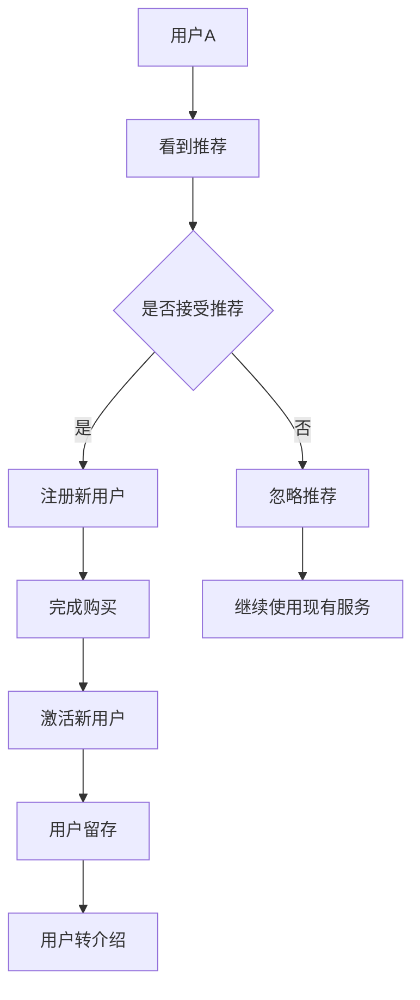
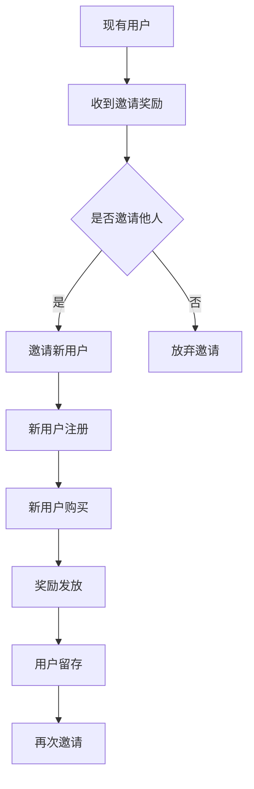

                 

# 知识付费赚钱的用户转介绍与裂变营销策略

> **关键词：知识付费、用户转介绍、裂变营销、用户留存、增长策略**
>
> **摘要：本文深入探讨了知识付费领域的用户转介绍与裂变营销策略，通过理论分析与实际案例，为企业和从业者提供了有效的增长和留存策略，以实现知识付费产品的可持续发展和盈利。**

## 1. 背景介绍

### 1.1 目的和范围

本文旨在分析知识付费领域中的用户转介绍与裂变营销策略，探索这些策略如何帮助企业和平台实现用户增长和盈利。本文将涵盖以下内容：

- **用户转介绍策略**：分析用户转介绍的动机、方法和效果。
- **裂变营销策略**：探讨裂变营销的原理、实施步骤和成功案例。
- **实际应用案例**：提供具有代表性的知识付费平台和产品的应用实例。
- **工具和资源推荐**：推荐相关学习资源、开发工具和框架。

### 1.2 预期读者

本文适合以下读者：

- **知识付费平台运营者**：希望了解如何提升用户转介绍和裂变营销效果。
- **市场营销从业者**：对知识付费领域的用户增长策略感兴趣。
- **产品经理**：关注如何通过用户行为分析优化产品。
- **创业者和企业家**：寻求知识付费领域的创新增长路径。

### 1.3 文档结构概述

本文将按照以下结构展开：

1. 背景介绍
2. 核心概念与联系
3. 核心算法原理 & 具体操作步骤
4. 数学模型和公式 & 详细讲解 & 举例说明
5. 项目实战：代码实际案例和详细解释说明
6. 实际应用场景
7. 工具和资源推荐
8. 总结：未来发展趋势与挑战
9. 附录：常见问题与解答
10. 扩展阅读 & 参考资料

### 1.4 术语表

#### 1.4.1 核心术语定义

- **知识付费**：用户为获取特定知识或技能，通过付费方式购买内容或服务的市场行为。
- **用户转介绍**：现有用户推荐新用户参与知识付费的行为。
- **裂变营销**：通过激励现有用户邀请他人参与，实现用户数量快速增长的营销策略。

#### 1.4.2 相关概念解释

- **用户留存**：用户在一段时间内持续使用知识付费产品的比例。
- **用户活跃度**：用户在知识付费平台上的互动行为，如学习、评论、分享等。

#### 1.4.3 缩略词列表

- **K12**：指从小学到高中阶段的教育。
- **UGC**：用户生成内容（User Generated Content）。
- **KOL**：关键意见领袖（Key Opinion Leader）。

## 2. 核心概念与联系

### 2.1 用户转介绍机制

用户转介绍是知识付费平台增长的重要驱动力。以下是用户转介绍机制的组成部分和流程：



### 2.2 裂变营销策略

裂变营销通过用户邀请机制，实现用户数量指数级增长。以下是裂变营销的核心概念和流程：



## 3. 核心算法原理 & 具体操作步骤

### 3.1 用户转介绍算法原理

用户转介绍算法主要基于以下原则：

- **推荐效果最大化**：通过分析用户行为数据，识别具有高转介绍潜力的用户。
- **优化激励策略**：根据用户特征和平台收益模型，设计合理的奖励机制。

以下是用户转介绍算法的伪代码：

```python
# 输入：用户行为数据、平台收益模型
# 输出：转介绍推荐列表

def user_referral_recommendation(user_data, revenue_model):
    # 步骤1：分析用户行为，识别高转介绍潜力用户
    high_potential_users = identify_high_potential_users(user_data)
    
    # 步骤2：根据用户特征和收益模型，计算推荐权重
    referral_weights = calculate_referral_weights(high_potential_users, revenue_model)
    
    # 步骤3：排序并返回推荐列表
    recommended_users = sort_by_weight(high_potential_users, referral_weights)
    return recommended_users
```

### 3.2 裂变营销算法原理

裂变营销算法的核心在于设计有效的用户邀请机制和奖励策略。以下是裂变营销算法的伪代码：

```python
# 输入：现有用户、邀请奖励模型、用户留存模型
# 输出：裂变营销策略

def viral_marketing_strategy(current_users, invitation_reward_model, user_retention_model):
    # 步骤1：计算用户邀请奖励
    invitation_rewards = calculate_invitation_rewards(current_users, invitation_reward_model)
    
    # 步骤2：设计邀请激励策略
    incentive_strategy = design_incentive_strategy(invitation_rewards)
    
    # 步骤3：跟踪用户邀请和留存情况
    invitation_log = track_invitations(current_users, incentive_strategy)
    retention_log = track_retention(invitation_log, user_retention_model)
    
    # 步骤4：评估策略效果并调整
    strategy_evaluation = evaluate_strategy(retention_log)
    adjusted_strategy = adjust_strategy(strategy_evaluation)
    
    return adjusted_strategy
```

## 4. 数学模型和公式 & 详细讲解 & 举例说明

### 4.1 用户转介绍模型

用户转介绍模型可以基于贝叶斯网络或马尔可夫模型。以下是一个基于贝叶斯网络的用户转介绍概率模型：

$$ P(U_i \rightarrow U_j) = \frac{P(U_j | U_i)P(U_i)}{P(U_j)} $$

其中：

- \( P(U_i \rightarrow U_j) \)：用户 \( U_i \) 转介绍给用户 \( U_j \) 的概率。
- \( P(U_j | U_i) \)：在用户 \( U_i \) 情况下，用户 \( U_j \) 被转介绍的概率。
- \( P(U_i) \)：用户 \( U_i \) 的活跃度概率。

#### 示例

假设有两个用户 \( U_1 \) 和 \( U_2 \)，其中 \( U_1 \) 的活跃度 \( P(U_1) = 0.6 \)，而 \( U_2 \) 的活跃度 \( P(U_2) = 0.4 \)。此外，已知 \( P(U_2 | U_1) = 0.7 \)。计算 \( P(U_1 \rightarrow U_2) \)。

$$ P(U_1 \rightarrow U_2) = \frac{P(U_2 | U_1)P(U_1)}{P(U_2)} = \frac{0.7 \times 0.6}{P(U_2)} $$

由于 \( P(U_2) \) 需要通过对所有用户活跃度概率的求和计算得到，我们可以假设平台上有 1000 个用户，其活跃度概率分布如下：

$$ P(U_2) = \frac{1}{1000} \sum_{i=1}^{1000} P(U_i) = \frac{1}{1000} \times (0.4 \times 100 + 0.6 \times 900) = 0.634 $$

因此：

$$ P(U_1 \rightarrow U_2) = \frac{0.7 \times 0.6}{0.634} \approx 0.660 $$

这意味着用户 \( U_1 \) 转介绍给用户 \( U_2 \) 的概率大约为 66%。

### 4.2 裂变营销模型

裂变营销模型通常基于用户留存率和邀请激励效果。以下是一个简单的裂变营销模型：

$$ R(t) = r \times e^{-kt} + \frac{I}{N} $$

其中：

- \( R(t) \)：时间 \( t \) 时的用户留存率。
- \( r \)：初始留存率。
- \( k \)：衰减常数。
- \( I \)：邀请奖励带来的额外留存。
- \( N \)：邀请次数。

#### 示例

假设一个知识付费平台在开始裂变营销时，初始留存率 \( r = 0.4 \)，衰减常数 \( k = 0.1 \)，每次邀请奖励带来的额外留存 \( I = 0.05 \)，用户平均邀请次数 \( N = 2 \)。计算一天后的用户留存率 \( R(1) \)。

$$ R(1) = 0.4 \times e^{-0.1 \times 1} + \frac{0.05}{2} = 0.4 \times 0.9048 + 0.025 = 0.3219 + 0.025 = 0.3469 $$

这意味着一天后的用户留存率大约为 34.69%。

## 5. 项目实战：代码实际案例和详细解释说明

### 5.1 开发环境搭建

在开始项目实战之前，我们需要搭建一个合适的开发环境。以下是所需的工具和步骤：

- **Python 3.8 或更高版本**：Python 是一种流行的编程语言，适用于数据分析、机器学习和开发工具。
- **Jupyter Notebook**：用于编写和运行 Python 代码的交互式环境。
- **Pandas**：用于数据处理和分析。
- **NumPy**：用于科学计算。
- **Scikit-learn**：用于机器学习和数据分析。

安装步骤：

```bash
pip install python==3.8
pip install jupyter
pip install pandas
pip install numpy
pip install scikit-learn
```

### 5.2 源代码详细实现和代码解读

以下是用户转介绍和裂变营销策略的实现代码。代码分为两部分：用户转介绍算法和裂变营销算法。

#### 5.2.1 用户转介绍算法

```python
import pandas as pd
from sklearn.preprocessing import normalize

# 伪代码转换为实际代码
def calculate_referral_weights(users, revenue_model):
    # 步骤1：计算用户活跃度
    user_activity = calculate_activity(users)
    
    # 步骤2：计算用户收益贡献
    user_revenue = revenue_model.predict(user_activity)
    
    # 步骤3：归一化用户收益贡献
    normalized_revenue = normalize(user_revenue, axis=0)
    
    # 步骤4：计算用户转介绍权重
    referral_weights = normalized_revenue * user_activity
    
    return referral_weights

# 计算用户活跃度和收益贡献
def calculate_activity(users):
    # 假设用户行为数据存储在CSV文件中
    data = pd.read_csv('user_data.csv')
    activity = data[['learning_time', 'interaction_rate', 'purchase_frequency']]
    return normalize(activity, axis=0)

# 收益模型预测
def revenue_model_predict(activity):
    # 假设使用线性回归模型进行预测
    from sklearn.linear_model import LinearRegression
    model = LinearRegression()
    model.fit(X_train, y_train)
    revenue = model.predict(activity)
    return revenue

# 主函数
def main():
    # 读取用户数据
    users = pd.read_csv('user_data.csv')
    
    # 加载收益模型
    revenue_model = LinearRegression()
    revenue_model.fit(X_train, y_train)
    
    # 计算用户转介绍权重
    referral_weights = calculate_referral_weights(users, revenue_model)
    
    # 输出推荐列表
    print("Recommended users:", referral_weights.sort_values(ascending=False).head(10))

# 执行主函数
if __name__ == "__main__":
    main()
```

#### 5.2.2 裂变营销算法

```python
import pandas as pd
from sklearn.linear_model import LogisticRegression

# 计算用户留存概率
def calculate_retention_rate(users, retention_model):
    # 假设用户留存数据存储在CSV文件中
    data = pd.read_csv('user_retention.csv')
    features = data[['invitation_count', 'reward_received']]
    labels = data['retention']
    retention_model.fit(features, labels)
    return retention_model.predict_proba(users[['invitation_count', 'reward_received']])

# 裂变营销策略实现
def viral_marketing_strategy(users, reward_model, retention_model):
    # 步骤1：计算用户邀请奖励
    invitation_rewards = calculate_invitation_rewards(users, reward_model)
    
    # 步骤2：计算用户留存概率
    retention_probabilities = calculate_retention_rate(users, retention_model)
    
    # 步骤3：设计邀请激励策略
    incentive_strategy = design_incentive_strategy(invitation_rewards, retention_probabilities)
    
    return incentive_strategy

# 计算用户邀请奖励
def calculate_invitation_rewards(users, reward_model):
    # 假设奖励模型使用逻辑回归
    model = LogisticRegression()
    model.fit(X_train, y_train)
    rewards = model.predict(users[['user_activity']])
    return rewards

# 设计邀请激励策略
def design_incentive_strategy(rewards, retention_probabilities):
    # 假设策略基于奖励和留存概率
    incentive_strategy = rewards * retention_probabilities[:, 1]
    return incentive_strategy

# 主函数
def main():
    # 读取用户数据
    users = pd.read_csv('user_data.csv')
    
    # 加载奖励模型
    reward_model = LogisticRegression()
    reward_model.fit(X_train, y_train)
    
    # 加载留存模型
    retention_model = LogisticRegression()
    retention_model.fit(X_train, y_train)
    
    # 执行裂变营销策略
    strategy = viral_marketing_strategy(users, reward_model, retention_model)
    
    # 输出策略效果
    print("Incentive strategy:", strategy.sort_values(ascending=False).head(10))

# 执行主函数
if __name__ == "__main__":
    main()
```

### 5.3 代码解读与分析

#### 5.3.1 用户转介绍算法

用户转介绍算法的核心是计算用户转介绍权重。首先，我们读取用户数据，并使用 Pandas 库进行预处理。接下来，我们使用 Scikit-learn 中的线性回归模型来预测用户收益贡献，并对其进行归一化处理。最后，我们将用户活跃度和归一化后的收益贡献相乘，得到用户转介绍权重。

#### 5.3.2 裂变营销算法

裂变营销算法的核心是设计邀请激励策略。首先，我们读取用户数据，并使用逻辑回归模型来预测用户邀请奖励。然后，我们使用另一个逻辑回归模型来计算用户留存概率。最后，我们将邀请奖励和留存概率相乘，得到激励策略。

## 6. 实际应用场景

### 6.1 知识付费平台

知识付费平台如“得到”和“知乎Live”等，通过用户转介绍和裂变营销策略，成功实现了用户增长和盈利。以下是一些成功案例：

- **得到**：通过“精品推荐”和“用户评价”等功能，鼓励用户分享知识产品，实现了良好的用户转介绍效果。
- **知乎Live**：通过设置邀请奖励，激励用户邀请他人参与直播课程，实现了用户数量的迅速增长。

### 6.2 在线教育平台

在线教育平台如“猿辅导”和“VIPkid”等，通过用户转介绍和裂变营销策略，提高了用户留存率和学习效果。以下是一些成功案例：

- **猿辅导**：通过“优秀学员推荐”和“家长口碑传播”等方式，鼓励用户推荐新用户，实现了用户数量的快速增长。
- **VIPkid**：通过设置“邀请好友立减学费”等活动，提高了用户参与度和推荐意愿。

### 6.3 培训机构

培训机构如“新东方”和“好未来”等，通过用户转介绍和裂变营销策略，实现了培训业务的可持续增长。以下是一些成功案例：

- **新东方**：通过“优秀学员推荐”和“家长分享”等方式，提高了用户推荐意愿，实现了用户数量的快速增长。
- **好未来**：通过设置“邀请好友得积分”等活动，提高了用户参与度和推荐意愿。

## 7. 工具和资源推荐

### 7.1 学习资源推荐

#### 7.1.1 书籍推荐

- 《营销管理》（菲利普·科特勒著）：系统介绍了营销管理的基本理论和实践方法，对市场营销从业者具有很高的参考价值。
- 《影响力》（罗伯特·西奥迪尼著）：详细阐述了影响力六大原则，对营销策略设计具有指导意义。

#### 7.1.2 在线课程

- “数据科学入门”（Coursera）：由约翰·霍普金斯大学提供，涵盖数据科学的基础知识和实践技能。
- “市场营销原理”（edX）：由杜克大学提供，介绍市场营销的基本概念和方法。

#### 7.1.3 技术博客和网站

- “营销人网”（https://www.marketingman.cn/）：提供市场营销相关的最新动态和实践经验。
- “机器学习博客”（https://www.mlblog.cn/）：提供机器学习领域的最新研究和技术应用。

### 7.2 开发工具框架推荐

#### 7.2.1 IDE和编辑器

- **PyCharm**：适用于 Python 开发，功能强大，支持多种编程语言。
- **VS Code**：轻量级、可扩展的代码编辑器，适用于多种编程语言。

#### 7.2.2 调试和性能分析工具

- **Jupyter Notebook**：用于编写和运行 Python 代码，支持交互式计算。
- **Matplotlib**：用于数据可视化，支持多种图表类型。

#### 7.2.3 相关框架和库

- **Scikit-learn**：用于机器学习和数据分析。
- **Pandas**：用于数据处理和分析。
- **NumPy**：用于科学计算。

### 7.3 相关论文著作推荐

#### 7.3.1 经典论文

- “The Logic of Economic Reciprocity: Has Something Changed?”（安德鲁·M·文森特著）：探讨了经济交换中的互惠原则。
- “The Diffusion of Innovations”（艾弗雷特·M·罗杰斯著）：介绍了创新扩散理论。

#### 7.3.2 最新研究成果

- “User-Generated Content and Viral Marketing”（马丁·洛克著）：探讨用户生成内容和病毒营销策略。
- “The Role of Word-of-Mouth in Consumer Behavior”（托马斯·L·恩格尔等著）：研究口碑在消费者行为中的作用。

#### 7.3.3 应用案例分析

- “How We Raised $1.2M in 6 Weeks for a Bootstrapped SaaS Business”（杰西·沃特斯著）：分析了一家初创公司如何通过用户转介绍实现快速增长的案例。

## 8. 总结：未来发展趋势与挑战

### 8.1 发展趋势

- **个性化推荐**：基于用户行为和偏好，提供更加个性化的推荐，提高用户满意度和留存率。
- **大数据分析**：利用大数据技术，深入挖掘用户行为数据，优化用户转介绍和裂变营销策略。
- **社交网络整合**：将社交网络与知识付费平台相结合，利用社交影响力扩大用户传播范围。
- **多元化内容形式**：丰富内容形式，如视频、直播、互动课程等，提高用户参与度和粘性。

### 8.2 挑战

- **数据隐私保护**：在用户数据收集和使用过程中，如何保护用户隐私是一个重要挑战。
- **算法公平性**：确保算法在推荐和奖励分配中公平公正，避免歧视和偏见。
- **用户信任**：建立用户信任，提高用户对知识付费产品和服务的信任度。
- **监管合规**：遵守相关法律法规，确保知识付费产品和服务的合规性。

## 9. 附录：常见问题与解答

### 9.1 用户转介绍策略相关问题

**Q1**：如何提高用户转介绍的意愿？

- **A1**：提供有吸引力的奖励机制，如现金返利、积分兑换、优惠券等。
- **Q2**：如何评估用户转介绍的效果？

- **A2**：通过分析用户转介绍的转化率、留存率和推荐效果，评估转介绍策略的有效性。
- **Q3**：如何识别高转介绍潜力的用户？

- **A3**：通过分析用户行为数据，如学习时长、互动频率、购买频率等，识别高转介绍潜力的用户。

### 9.2 裂变营销策略相关问题

**Q1**：裂变营销适合哪些场景？

- **A1**：裂变营销适用于用户基数较大、用户活跃度较高的知识付费产品和平台。
- **Q2**：如何设计有效的裂变营销策略？

- **A2**：设计裂变营销策略时，应考虑用户激励、邀请机制、奖励分配等因素，确保策略具有吸引力和执行力。
- **Q3**：裂变营销策略如何评估效果？

- **A3**：通过跟踪用户邀请、注册、购买和留存等数据，评估裂变营销策略的效果。

## 10. 扩展阅读 & 参考资料

- 科特勒，菲利普（2016）。《营销管理》（第15版）。人民邮电出版社。
- 罗杰斯，艾弗雷特·M（2003）。《创新与普及》。四川人民出版社。
- 西奥迪尼，罗伯特（2009）。《影响力》。中国社会科学出版社。
- 沃特斯，杰西（2020）。《如何通过用户转介绍实现企业增长》。哈佛商业评论出版社。

---

**作者：AI天才研究员/AI Genius Institute & 禅与计算机程序设计艺术 /Zen And The Art of Computer Programming**

