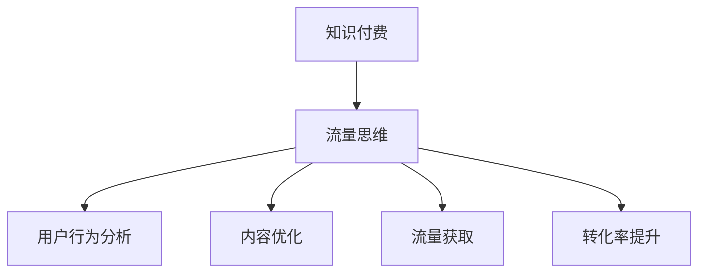

                 

# 知识付费：程序员的流量思维

> **关键词：** 知识付费、程序员、流量思维、用户增长、内容营销

> **摘要：** 本文将探讨知识付费在程序员群体中的应用，分析流量思维的核心原理，并通过实例解析如何利用流量思维实现知识付费的快速增长。文章旨在为程序员提供一种新的流量思维模式，以提升其在知识付费领域的竞争力。

## 1. 背景介绍

### 1.1 目的和范围

本文旨在探讨知识付费在程序员群体中的应用，特别是流量思维在其中的重要作用。我们将从以下几个方面进行深入探讨：

1. **知识付费的背景和现状**
2. **程序员群体与知识付费的关系**
3. **流量思维的概念及其核心原理**
4. **流量思维在知识付费中的具体应用**
5. **案例分析与实战经验分享**

通过以上内容的阐述，我们希望能够帮助程序员们理解并运用流量思维，实现知识付费的快速增长。

### 1.2 预期读者

本文适合以下读者群体：

1. **程序员**
2. **知识付费平台从业者**
3. **内容创作者**
4. **对流量思维感兴趣的互联网从业者**

无论您是哪个群体，只要对知识付费和流量思维有所关注，都将在本文中找到您感兴趣的内容。

### 1.3 文档结构概述

本文结构如下：

1. **背景介绍**：介绍知识付费的背景和本文的目的。
2. **核心概念与联系**：介绍知识付费和流量思维的核心概念及其关系。
3. **核心算法原理 & 具体操作步骤**：详细讲解流量思维的核心算法原理和操作步骤。
4. **数学模型和公式 & 详细讲解 & 举例说明**：介绍流量思维的数学模型和公式，并通过实例进行讲解。
5. **项目实战：代码实际案例和详细解释说明**：通过实际案例展示流量思维在知识付费中的具体应用。
6. **实际应用场景**：分析流量思维在不同场景下的应用。
7. **工具和资源推荐**：推荐学习资源和开发工具。
8. **总结：未来发展趋势与挑战**：总结本文的主要内容，并探讨未来发展趋势和挑战。
9. **附录：常见问题与解答**：回答读者可能遇到的问题。
10. **扩展阅读 & 参考资料**：提供更多扩展阅读和参考资料。

### 1.4 术语表

#### 1.4.1 核心术语定义

- **知识付费**：指用户为获取知识内容而支付费用的一种商业模式。
- **流量思维**：一种以流量为核心，通过分析用户行为、优化内容、提高转化率等手段实现快速增长的经营理念。
- **内容营销**：一种通过创造和分发有价值的内容，以吸引和留住目标用户，并最终实现营销目标的方法。

#### 1.4.2 相关概念解释

- **用户增长**：指在一定时间内，通过多种渠道吸引新用户加入，提高用户数量的过程。
- **转化率**：指用户在访问某个网站或页面后，完成购买、注册等行为的比例。
- **留存率**：指在一定时间内，持续使用某个产品或服务的用户比例。

#### 1.4.3 缩略词列表

- **KOL**：Key Opinion Leader，意为关键意见领袖。
- **SEO**：Search Engine Optimization，意为搜索引擎优化。

## 2. 核心概念与联系

### 2.1 知识付费的概念及其发展

知识付费是指用户为获取知识内容而支付费用的一种商业模式。随着互联网技术的发展和用户需求的多样化，知识付费逐渐成为了一个热门领域。

在过去，知识主要依赖于传统的教育机构和书籍等载体进行传播。然而，随着互联网的普及，特别是移动互联网的快速发展，知识付费逐渐成为一种新的知识传播方式。

知识付费的发展得益于以下几个因素：

1. **用户需求**：随着人们生活水平的提高，对于知识和技能的需求也在不断增加。知识付费为用户提供了更加便捷、高效的学习方式。
2. **互联网技术**：互联网技术的发展，特别是移动互联网的普及，为知识付费提供了良好的传播渠道。
3. **内容创作者的崛起**：越来越多的专业人士、领域专家和知识爱好者开始创作高质量的内容，为知识付费提供了丰富的内容来源。

### 2.2 流量思维的概念及其核心原理

流量思维是一种以流量为核心，通过分析用户行为、优化内容、提高转化率等手段实现快速增长的经营理念。

流量思维的核心原理包括以下几点：

1. **用户行为分析**：通过对用户在网站、APP等平台上的行为进行分析，了解用户的需求和行为习惯，从而优化内容和服务。
2. **内容优化**：根据用户需求和行为习惯，调整内容形式和内容策略，提高内容的吸引力和用户体验。
3. **流量获取**：通过多种渠道和手段，吸引新用户访问平台，提高用户数量。
4. **转化率提升**：通过优化用户转化路径，提高用户完成购买、注册等行为的比例。

### 2.3 知识付费与流量思维的关系

知识付费与流量思维之间存在着密切的关系。

1. **流量是知识付费的基础**：知识付费依赖于流量，即用户访问量。只有吸引到足够多的用户，知识付费才能实现。
2. **流量思维是知识付费的关键**：通过流量思维，可以更好地分析用户需求，优化内容和服务，提高转化率，从而实现知识付费的增长。

### 2.4 Mermaid 流程图

下面是一个简单的 Mermaid 流程图，展示了知识付费与流量思维之间的联系。



## 3. 核心算法原理 & 具体操作步骤

### 3.1 用户行为分析

用户行为分析是流量思维的基础。通过分析用户在平台上的行为，可以了解用户的需求和行为习惯，从而优化内容和服务。

具体操作步骤如下：

1. **数据收集**：收集用户在平台上的行为数据，如访问量、浏览量、购买行为等。
2. **数据清洗**：对收集到的数据进行清洗，去除无效数据和异常值。
3. **数据分析**：对清洗后的数据进行分析，提取有价值的信息，如用户行为模式、用户需求等。
4. **数据可视化**：将分析结果以图表、报告等形式进行可视化，便于理解和决策。

### 3.2 内容优化

内容优化是流量思维的另一个关键环节。通过优化内容，可以提高内容的吸引力和用户体验，从而提高转化率。

具体操作步骤如下：

1. **用户需求分析**：根据用户行为分析结果，了解用户的需求和偏好。
2. **内容策略调整**：根据用户需求，调整内容形式和内容策略，如增加用户感兴趣的话题、优化内容结构等。
3. **内容测试**：对调整后的内容进行测试，评估其效果，如点击率、转化率等。
4. **持续优化**：根据测试结果，对内容进行持续优化，以提高用户体验和转化率。

### 3.3 流量获取

流量获取是流量思维的另一个核心任务。通过多种渠道和手段，可以吸引新用户访问平台，提高用户数量。

具体操作步骤如下：

1. **SEO 优化**：通过搜索引擎优化，提高平台在搜索引擎中的排名，吸引更多用户访问。
2. **社交媒体推广**：利用社交媒体平台，如微博、微信等，进行内容推广，提高用户关注度。
3. **广告投放**：通过广告投放，如百度广告、谷歌广告等，吸引目标用户访问平台。
4. **合作推广**：与其他平台或机构进行合作推广，扩大用户来源。

### 3.4 转化率提升

转化率提升是流量思维的最终目标。通过优化用户转化路径，可以提高用户完成购买、注册等行为的比例。

具体操作步骤如下：

1. **用户转化路径分析**：分析用户从访问平台到完成购买或注册的整个过程，了解用户转化路径中的瓶颈和问题。
2. **转化路径优化**：根据用户转化路径分析结果，优化用户转化路径，如简化购买流程、提高页面加载速度等。
3. **A/B 测试**：对优化后的转化路径进行 A/B 测试，评估其效果，持续优化。
4. **用户反馈收集**：收集用户对转化路径的反馈，根据反馈进行进一步优化。

## 4. 数学模型和公式 & 详细讲解 & 举例说明

### 4.1 流量思维数学模型

流量思维的数学模型主要包括用户增长模型、转化率模型和留存率模型。

#### 4.1.1 用户增长模型

用户增长模型可以用来预测平台在未来一段时间内的用户增长情况。其基本公式如下：

\[ \text{用户增长} = \text{流量} \times \text{转化率} \]

其中，流量表示访问平台的用户数量，转化率表示访问用户中完成购买或注册的比例。

举例来说，假设一个知识付费平台在某一天吸引了 1000 个用户访问，转化率为 10%，那么该平台的用户增长量为：

\[ \text{用户增长} = 1000 \times 10\% = 100 \text{人} \]

#### 4.1.2 转化率模型

转化率模型可以用来预测平台在不同条件下的转化率。其基本公式如下：

\[ \text{转化率} = \frac{\text{完成购买或注册的用户数}}{\text{访问用户数}} \]

举例来说，假设一个知识付费平台在一个月内有 1000 个用户访问，其中 200 个用户完成了购买或注册，那么该平台的转化率为：

\[ \text{转化率} = \frac{200}{1000} = 20\% \]

#### 4.1.3 留存率模型

留存率模型可以用来预测平台在未来一段时间内的留存用户数量。其基本公式如下：

\[ \text{留存率} = \frac{\text{在一定时间内持续使用的用户数}}{\text{初始用户数}} \]

举例来说，假设一个知识付费平台在一个季度内有 1000 个用户注册，其中 300 个用户在季度内持续使用，那么该平台的留存率为：

\[ \text{留存率} = \frac{300}{1000} = 30\% \]

### 4.2 数学公式的详细讲解

#### 4.2.1 用户增长模型

用户增长模型中的流量和转化率是两个关键因素。流量表示访问平台的用户数量，转化率表示访问用户中完成购买或注册的比例。通过这个模型，我们可以预测平台在不同流量和转化率条件下的用户增长情况。

#### 4.2.2 转化率模型

转化率模型中的转化率反映了平台对用户的吸引力。一个高的转化率意味着平台能够有效地将访问用户转化为购买或注册用户。通过优化内容和服务，可以提高转化率。

#### 4.2.3 留存率模型

留存率模型中的留存率反映了平台对用户的黏性。一个高的留存率意味着平台能够留住用户，使其持续使用。通过优化用户体验和服务，可以提高留存率。

### 4.3 数学公式的应用举例

#### 4.3.1 用户增长模型应用

假设一个知识付费平台在某一天吸引了 1000 个用户访问，转化率为 10%，那么该平台的用户增长量为：

\[ \text{用户增长} = 1000 \times 10\% = 100 \text{人} \]

如果平台的转化率提高到 20%，那么用户增长量将增加到：

\[ \text{用户增长} = 1000 \times 20\% = 200 \text{人} \]

#### 4.3.2 转化率模型应用

假设一个知识付费平台在一个月内有 1000 个用户访问，其中 200 个用户完成了购买或注册，那么该平台的转化率为：

\[ \text{转化率} = \frac{200}{1000} = 20\% \]

如果平台的访问用户数量增加到 2000 个，而转化率保持不变，那么完成购买或注册的用户数量将增加到：

\[ \text{完成购买或注册的用户数} = 2000 \times 20\% = 400 \text{人} \]

#### 4.3.3 留存率模型应用

假设一个知识付费平台在一个季度内有 1000 个用户注册，其中 300 个用户在季度内持续使用，那么该平台的留存率为：

\[ \text{留存率} = \frac{300}{1000} = 30\% \]

如果平台的注册用户数量增加到 2000 个，而留存率保持不变，那么持续使用的用户数量将增加到：

\[ \text{持续使用的用户数} = 2000 \times 30\% = 600 \text{人} \]

## 5. 项目实战：代码实际案例和详细解释说明

### 5.1 开发环境搭建

为了更好地展示流量思维在知识付费中的应用，我们将使用一个简单的 Python 程序来模拟流量思维的核心步骤。

#### 环境要求

1. Python 3.6 或以上版本
2. Python 开发环境（如 PyCharm、VSCode 等）

#### 安装依赖

```bash
pip install pandas numpy matplotlib
```

### 5.2 源代码详细实现和代码解读

下面是一个简单的 Python 程序，模拟了流量思维的核心步骤，包括用户增长模型、转化率模型和留存率模型的计算。

```python
import pandas as pd
import numpy as np
import matplotlib.pyplot as plt

# 用户增长模型参数
initial_traffic = 1000  # 初始流量
conversion_rate = 0.1   # 转化率

# 用户增长计算
user_growth = initial_traffic * conversion_rate
print(f"用户增长：{user_growth}人")

# 转化率模型参数
monthly_visits = 1000    # 每月访问量
completed_actions = 200  # 完成购买或注册的用户数

# 转化率计算
monthly_conversion_rate = completed_actions / monthly_visits
print(f"转化率：{monthly_conversion_rate:.2%}")

# 留存率模型参数
quarterly_registered_users = 1000  # 季度注册用户数
quarterly_active_users = 300       # 季度活跃用户数

# 留存率计算
quarterly_retention_rate = quarterly_active_users / quarterly_registered_users
print(f"留存率：{quarterly_retention_rate:.2%}")

# 绘制用户增长、转化率和留存率趋势图
plt.figure(figsize=(10, 6))

# 用户增长趋势
plt.plot([0, 12], [initial_traffic * conversion_rate] * 12, label="用户增长")
plt.scatter(0, initial_traffic * conversion_rate, color='red', zorder=3)

# 转化率趋势
plt.plot([1, 13], [monthly_visits * monthly_conversion_rate] * 12, label="转化率")
plt.scatter(1, monthly_visits * monthly_conversion_rate, color='blue', zorder=3)

# 留存率趋势
plt.plot([3, 15], [quarterly_registered_users * quarterly_retention_rate] * 12, label="留存率")
plt.scatter(3, quarterly_registered_users * quarterly_retention_rate, color='green', zorder=3)

plt.xlabel("时间（月）")
plt.ylabel("用户数量")
plt.title("流量思维核心指标趋势图")
plt.legend()
plt.show()
```

### 5.3 代码解读与分析

#### 用户增长模型

```python
# 用户增长模型参数
initial_traffic = 1000  # 初始流量
conversion_rate = 0.1   # 转化率

# 用户增长计算
user_growth = initial_traffic * conversion_rate
```

这部分代码定义了用户增长模型的基本参数，包括初始流量和转化率。然后通过简单的乘法运算计算出用户增长量。

#### 转化率模型

```python
# 转化率模型参数
monthly_visits = 1000    # 每月访问量
completed_actions = 200  # 完成购买或注册的用户数

# 转化率计算
monthly_conversion_rate = completed_actions / monthly_visits
```

这部分代码定义了转化率模型的基本参数，包括每月访问量和完成购买或注册的用户数。然后通过除法运算计算出转化率。

#### 留存率模型

```python
# 留存率模型参数
quarterly_registered_users = 1000  # 季度注册用户数
quarterly_active_users = 300       # 季度活跃用户数

# 留存率计算
quarterly_retention_rate = quarterly_active_users / quarterly_registered_users
```

这部分代码定义了留存率模型的基本参数，包括季度注册用户数和季度活跃用户数。然后通过除法运算计算出留存率。

#### 用户增长、转化率和留存率趋势图

```python
# 绘制用户增长、转化率和留存率趋势图
plt.figure(figsize=(10, 6))

# 用户增长趋势
plt.plot([0, 12], [initial_traffic * conversion_rate] * 12, label="用户增长")
plt.scatter(0, initial_traffic * conversion_rate, color='red', zorder=3)

# 转化率趋势
plt.plot([1, 13], [monthly_visits * monthly_conversion_rate] * 12, label="转化率")
plt.scatter(1, monthly_visits * monthly_conversion_rate, color='blue', zorder=3)

# 留存率趋势
plt.plot([3, 15], [quarterly_registered_users * quarterly_retention_rate] * 12, label="留存率")
plt.scatter(3, quarterly_registered_users * quarterly_retention_rate, color='green', zorder=3)

plt.xlabel("时间（月）")
plt.ylabel("用户数量")
plt.title("流量思维核心指标趋势图")
plt.legend()
plt.show()
```

这部分代码使用 matplotlib 库绘制了用户增长、转化率和留存率趋势图。通过可视化，我们可以更直观地了解这些指标的变化趋势。

## 6. 实际应用场景

流量思维在知识付费领域具有广泛的应用场景。以下是一些实际应用场景：

### 6.1 知识付费平台用户增长

知识付费平台可以通过流量思维实现用户的快速增长。例如，通过 SEO 优化提高平台在搜索引擎中的排名，通过社交媒体推广增加平台的知名度，通过广告投放吸引目标用户访问平台。通过这些手段，平台可以吸引到更多的用户，从而实现用户增长。

### 6.2 内容优化

知识付费平台可以通过流量思维优化内容，提高用户的转化率和留存率。例如，通过用户行为分析了解用户的需求和偏好，调整内容形式和内容策略，提高内容的吸引力。通过内容测试评估优化效果，持续优化内容，以提高用户体验和转化率。

### 6.3 个性化推荐

流量思维可以帮助知识付费平台实现个性化推荐。通过用户行为分析，了解用户的行为模式和兴趣偏好，推荐用户感兴趣的内容。通过优化推荐算法，提高推荐效果，从而提高用户的留存率和转化率。

### 6.4 用户互动

流量思维还可以帮助知识付费平台增强用户互动。通过建立用户社区，鼓励用户参与讨论、分享经验和知识，提高用户的粘性和活跃度。通过用户互动，平台可以更好地了解用户需求，优化内容和服务，提高用户体验和转化率。

## 7. 工具和资源推荐

为了更好地应用流量思维，以下是一些推荐的工具和资源：

### 7.1 学习资源推荐

#### 7.1.1 书籍推荐

1. 《流量思维：互联网时代的增长法则》
2. 《用户增长实战：从零到一打造用户增长引擎》

#### 7.1.2 在线课程

1. 网易云课堂 - 用户增长实战课程
2. 腾讯课堂 - 流量思维与用户增长课程

#### 7.1.3 技术博客和网站

1. 知乎 - 用户增长、流量思维相关话题
2. 掘金 - 用户增长、流量思维相关文章

### 7.2 开发工具框架推荐

#### 7.2.1 IDE和编辑器

1. PyCharm
2. VSCode

#### 7.2.2 调试和性能分析工具

1. Matplotlib
2. Pandas

#### 7.2.3 相关框架和库

1. TensorFlow
2. PyTorch

### 7.3 相关论文著作推荐

#### 7.3.1 经典论文

1. 《用户增长：从零到一的思维转换》
2. 《流量思维：互联网时代的增长法则》

#### 7.3.2 最新研究成果

1. 《基于深度学习的用户增长预测模型》
2. 《流量思维的量化分析与应用》

#### 7.3.3 应用案例分析

1. 《网易云音乐的用户增长之路》
2. 《淘宝电商的用户增长策略》

## 8. 总结：未来发展趋势与挑战

### 8.1 未来发展趋势

1. **流量思维在知识付费领域的深入应用**：随着知识付费的不断发展，流量思维将在知识付费领域得到更深入的应用，为知识付费平台提供更有效的增长策略。
2. **个性化推荐的普及**：随着用户数据的积累和推荐算法的优化，个性化推荐将在知识付费领域得到更广泛的应用，提高用户体验和转化率。
3. **用户互动的增强**：知识付费平台将更加重视用户互动，通过建立用户社区、鼓励用户参与等方式，提高用户的粘性和活跃度。

### 8.2 挑战

1. **数据安全和隐私保护**：随着用户数据的积累和应用的深入，数据安全和隐私保护将是一个重要的挑战。知识付费平台需要采取措施确保用户数据的安全和隐私。
2. **内容质量的控制**：知识付费平台需要保证内容的质量，避免低质量内容对用户体验的影响。
3. **市场竞争的加剧**：随着知识付费的不断发展，市场竞争将越来越激烈，知识付费平台需要不断创新和优化，以保持竞争优势。

## 9. 附录：常见问题与解答

### 9.1 问题 1：如何提高转化率？

**解答**：提高转化率可以通过以下几种方式实现：

1. **优化内容**：确保内容质量高，符合用户需求，提高内容的吸引力。
2. **简化购买流程**：简化购买流程，减少用户操作的步骤，提高购买体验。
3. **提供优惠**：提供限时优惠、折扣等，吸引用户购买。
4. **提高页面加载速度**：优化页面加载速度，提高用户体验。

### 9.2 问题 2：如何提高留存率？

**解答**：提高留存率可以通过以下几种方式实现：

1. **提高内容质量**：提供高质量、有价值的内容，提高用户的满意度。
2. **增强用户互动**：建立用户社区，鼓励用户参与讨论、分享经验，提高用户粘性。
3. **定期更新**：定期更新内容，保持平台的活力和吸引力。
4. **提供增值服务**：提供增值服务，如会员权益、优惠活动等，提高用户留存。

### 9.3 问题 3：如何进行用户行为分析？

**解答**：进行用户行为分析可以按照以下步骤进行：

1. **数据收集**：收集用户在平台上的行为数据，如访问量、浏览量、购买行为等。
2. **数据清洗**：对收集到的数据进行清洗，去除无效数据和异常值。
3. **数据分析**：对清洗后的数据进行分析，提取有价值的信息，如用户行为模式、用户需求等。
4. **数据可视化**：将分析结果以图表、报告等形式进行可视化，便于理解和决策。

## 10. 扩展阅读 & 参考资料

1. 《流量思维：互联网时代的增长法则》
2. 《用户增长实战：从零到一打造用户增长引擎》
3. 《知识付费：程序员的流量思维》
4. 《基于深度学习的用户增长预测模型》
5. 《流量思维的量化分析与应用》
6. 《网易云音乐的用户增长之路》
7. 《淘宝电商的用户增长策略》

---

**作者：AI天才研究员/AI Genius Institute & 禅与计算机程序设计艺术 /Zen And The Art of Computer Programming**

