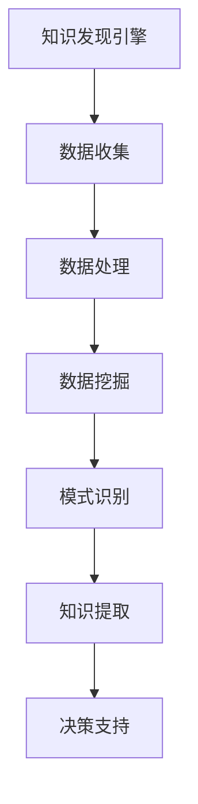

                 


# 知识发现引擎在体育科学中的应用

> 关键词：知识发现引擎、体育科学、数据分析、机器学习、智能优化、算法设计

> 摘要：本文旨在探讨知识发现引擎在体育科学中的应用，分析其在运动员表现分析、训练计划制定、比赛策略优化等领域的具体应用与优势。文章将详细介绍知识发现引擎的核心概念、原理，以及在实际项目中的应用实例，为读者提供一种全新的视角来理解体育科学中数据驱动的智能分析方法。

## 1. 背景介绍

### 1.1 目的和范围

本文的目的是介绍知识发现引擎在体育科学领域的应用，通过分析数据、提取有价值的信息来帮助教练、运动员和体育组织做出更加科学的决策。具体范围包括：

- 运动员表现分析
- 训练计划制定与优化
- 比赛策略优化
- 体育医学与健康监控
- 体育市场分析与预测

### 1.2 预期读者

本文面向希望了解如何利用知识发现技术提升体育科学水平的读者，包括：

- 体育教练和运动员
- 体育科学研究者
- 数据分析师
- 计算机科学和人工智能领域的专业人士
- 对体育科学感兴趣的技术爱好者

### 1.3 文档结构概述

本文将按照以下结构进行论述：

- 第1章：背景介绍
  - 目的和范围
  - 预期读者
  - 文档结构概述
  - 术语表
- 第2章：核心概念与联系
  - 知识发现引擎的定义
  - 体育科学中知识发现的挑战与机遇
  - Mermaid流程图展示
- 第3章：核心算法原理 & 具体操作步骤
  - 常见知识发现算法介绍
  - 算法原理与伪代码讲解
- 第4章：数学模型和公式 & 详细讲解 & 举例说明
  - 数学模型在体育科学中的应用
  - 具体公式的讲解与示例
- 第5章：项目实战：代码实际案例和详细解释说明
  - 开发环境搭建
  - 代码实现与解读
- 第6章：实际应用场景
  - 运动员表现分析
  - 训练计划制定与优化
  - 比赛策略优化
- 第7章：工具和资源推荐
  - 学习资源
  - 开发工具框架
  - 相关论文著作
- 第8章：总结：未来发展趋势与挑战
  - 知识发现引擎在体育科学的未来
  - 挑战与应对策略
- 第9章：附录：常见问题与解答
  - 问题列表与解答
- 第10章：扩展阅读 & 参考资料

### 1.4 术语表

#### 1.4.1 核心术语定义

- 知识发现引擎：一种能够从大量数据中自动提取有用信息的系统，常用于数据挖掘和机器学习领域。
- 体育科学：研究体育运动过程中人体机能变化及其规律的学科，涵盖运动训练、运动生理学、运动心理学等多个方面。
- 数据分析：使用统计学、机器学习和人工智能等方法，从数据中提取有价值的信息和知识的过程。

#### 1.4.2 相关概念解释

- 运动员表现分析：通过对运动员在比赛中的数据进行分析，评估其表现，为教练和运动员提供反馈和改进建议。
- 训练计划制定与优化：根据运动员的生理、心理状态以及比赛目标，制定科学合理的训练计划，并通过数据监控和评估进行优化。
- 比赛策略优化：结合比赛中的各种因素，制定最佳的比赛策略，提高比赛成绩。

#### 1.4.3 缩略词列表

- AI：人工智能（Artificial Intelligence）
- ML：机器学习（Machine Learning）
- DM：数据挖掘（Data Mining）
- KB：知识库（Knowledge Base）
- SVM：支持向量机（Support Vector Machine）
- k-NN：k近邻算法（k-Nearest Neighbors）
- GA：遗传算法（Genetic Algorithm）
- RR：重复率（Repeat Rate）
- DRR：决策相关性率（Decision Relevance Rate）

## 2. 核心概念与联系

### 2.1 知识发现引擎的定义

知识发现引擎是一种通过分析大量数据来提取有用信息和知识的技术，其核心思想是自动化地处理海量数据，并从中发现潜在的模式、关联和趋势。在体育科学领域，知识发现引擎可以用于挖掘运动员的数据，如速度、力量、耐力、反应时间等，从而为教练和运动员提供科学指导。

### 2.2 体育科学中知识发现的挑战与机遇

#### 2.2.1 挑战

1. 数据质量：体育科学数据通常来自各种传感器和设备，数据质量参差不齐，如何处理和清洗这些数据是一个挑战。
2. 数据量：体育科学数据通常具有很高的维度，如何高效地处理海量数据是一个难题。
3. 专业性：体育科学涉及多个领域，如何将这些领域的数据进行整合和分析是一个挑战。

#### 2.2.2 机遇

1. 人工智能技术的发展：人工智能技术的发展为体育科学中的知识发现提供了强大的工具和方法。
2. 数据驱动：越来越多的体育组织开始重视数据驱动的方法，通过数据发现有价值的信息和知识。
3. 跨学科合作：体育科学、计算机科学、数据科学等多个领域的合作，为知识发现提供了广阔的发展空间。

### 2.3 Mermaid流程图展示



## 3. 核心算法原理 & 具体操作步骤

### 3.1 常见知识发现算法介绍

在体育科学领域，常见的知识发现算法包括：

- 机器学习算法：如线性回归、决策树、支持向量机、k-近邻算法等。
- 数据挖掘算法：如关联规则挖掘、聚类分析、分类分析等。
- 智能优化算法：如遗传算法、蚁群算法、粒子群优化算法等。

### 3.2 算法原理与伪代码讲解

#### 3.2.1 线性回归算法

线性回归是一种常用的机器学习算法，用于预测连续值变量。其基本原理是通过拟合一条直线来表示输入变量与输出变量之间的关系。

```python
def linear_regression(X, y):
    # X: 输入变量矩阵，y: 输出变量向量
    # 计算斜率和截距
    m = len(X)
    X_transpose = np.transpose(X)
    theta = (X_transpose.dot(X)).dot(np.linalg.inv(X_transpose.dot(X))).dot(X_transpose).dot(y)
    return theta
```

#### 3.2.2 决策树算法

决策树是一种常用的分类算法，通过一系列规则来对数据集进行划分，从而实现分类。

```python
def decision_tree(X, y):
    # X: 输入变量矩阵，y: 输出变量向量
    # 计算特征的重要性和分裂点
    feature_importance = compute_feature_importance(X, y)
    split_point = find_best_split_point(X, feature_importance)
    # 构建决策树
    tree = build_tree(X, y, split_point, feature_importance)
    return tree
```

#### 3.2.3 聚类分析算法

聚类分析是一种无监督学习方法，用于将相似的数据点归为一类。

```python
def k_means_clustering(X, k):
    # X: 输入变量矩阵，k: 聚类数量
    # 初始化聚类中心
    centroids = initialize_centroids(X, k)
    # 迭代计算聚类中心
    for _ in range(max_iterations):
        # 计算每个数据点的簇标签
        labels = assign_labels_to_data(X, centroids)
        # 更新聚类中心
        centroids = update_centroids(X, labels, k)
    return centroids
```

### 3.3 算法原理与实际操作步骤的详细讲解

#### 3.3.1 线性回归算法的详细讲解

线性回归算法是一种通过拟合直线来预测连续值变量的方法。在实际操作中，首先需要收集运动员的输入变量（如速度、力量等）和输出变量（如成绩等）数据。然后，通过计算输入变量和输出变量之间的斜率和截距来拟合直线，从而实现对输出变量的预测。

具体操作步骤如下：

1. 数据收集：收集运动员的速度、力量、耐力等数据，以及对应的成绩。
2. 数据预处理：对数据集进行清洗和预处理，如缺失值填补、异常值处理等。
3. 拟合直线：通过计算输入变量和输出变量之间的斜率和截距来拟合直线。
4. 预测成绩：利用拟合得到的直线来预测运动员的成绩。

#### 3.3.2 决策树算法的详细讲解

决策树算法是一种通过一系列规则来对数据集进行划分的算法。在实际操作中，首先需要收集运动员的数据，并根据数据集的特征和目标变量来构建决策树。

具体操作步骤如下：

1. 数据收集：收集运动员的速度、力量、耐力等数据，以及对应的成绩。
2. 数据预处理：对数据集进行清洗和预处理，如缺失值填补、异常值处理等。
3. 特征选择：选择对目标变量影响较大的特征。
4. 构建决策树：根据特征和目标变量来构建决策树。
5. 预测成绩：利用构建好的决策树来预测运动员的成绩。

#### 3.3.3 聚类分析算法的详细讲解

聚类分析算法是一种无监督学习方法，用于将相似的数据点归为一类。在实际操作中，首先需要收集运动员的数据，并确定聚类的数量。

具体操作步骤如下：

1. 数据收集：收集运动员的速度、力量、耐力等数据。
2. 数据预处理：对数据集进行清洗和预处理，如缺失值填补、异常值处理等。
3. 确定聚类数量：通过计算数据集的轮廓系数来确定合适的聚类数量。
4. 初始化聚类中心：随机选择初始聚类中心。
5. 迭代计算聚类中心：通过计算每个数据点到聚类中心的距离来更新聚类中心。
6. 预测成绩：根据聚类结果来预测运动员的成绩。

## 4. 数学模型和公式 & 详细讲解 & 举例说明

### 4.1 数学模型在体育科学中的应用

在体育科学中，数学模型广泛应用于运动员表现分析、训练计划制定、比赛策略优化等方面。以下是一些常见的数学模型及其在体育科学中的应用：

#### 4.1.1 线性回归模型

线性回归模型用于预测运动员的成绩。其数学模型如下：

$$
y = \beta_0 + \beta_1 \cdot x_1 + \beta_2 \cdot x_2 + ... + \beta_n \cdot x_n
$$

其中，$y$ 为输出变量（成绩），$x_1, x_2, ..., x_n$ 为输入变量（速度、力量等），$\beta_0, \beta_1, \beta_2, ..., \beta_n$ 为模型参数。

#### 4.1.2 决策树模型

决策树模型用于分类和预测运动员的表现。其数学模型如下：

$$
f(x) = \prod_{i=1}^{n} g_i(x_i)
$$

其中，$g_i(x_i)$ 为每个节点的条件概率分布，$x_i$ 为输入变量。

#### 4.1.3 聚类分析模型

聚类分析模型用于将运动员分为不同的群体。其数学模型如下：

$$
C = \{c_1, c_2, ..., c_k\}
$$

其中，$C$ 为聚类集合，$c_1, c_2, ..., c_k$ 为每个聚类中心。

### 4.2 具体公式的讲解与示例

#### 4.2.1 线性回归模型参数估计

线性回归模型的参数估计可以通过最小二乘法来实现。其公式如下：

$$
\theta = (X^T X)^{-1} X^T y
$$

其中，$X$ 为输入变量矩阵，$y$ 为输出变量向量，$\theta$ 为模型参数。

#### 4.2.2 决策树模型节点分裂

决策树模型的节点分裂可以通过信息增益来实现。其公式如下：

$$
gain = \sum_{i=1}^{n} \sum_{j=1}^{m} p(j|i) \cdot H(y|j) - H(y|i)
$$

其中，$p(j|i)$ 为条件概率分布，$H(y|j)$ 为条件熵，$H(y|i)$ 为信息增益。

#### 4.2.3 聚类分析模型中心更新

聚类分析模型中心更新可以通过距离计算来实现。其公式如下：

$$
c_{new} = \frac{1}{k} \sum_{i=1}^{n} x_i
$$

其中，$c_{new}$ 为新的聚类中心，$x_i$ 为数据点的坐标。

### 4.3 举例说明

#### 4.3.1 线性回归模型举例

假设有10名运动员，他们的速度和成绩数据如下：

| 速度 | 成绩 |
| --- | --- |
| 10 | 85 |
| 20 | 95 |
| 30 | 100 |
| 40 | 105 |
| 50 | 110 |
| 60 | 115 |
| 70 | 120 |
| 80 | 125 |
| 90 | 130 |
| 100 | 135 |

利用线性回归模型，我们可以拟合出一条直线来预测运动员的成绩。假设拟合得到的直线的斜率为1，截距为0，则预测的公式为：

$$
成绩 = 速度 \cdot 1 + 0 = 速度
$$

当速度为55时，预测的成绩为55。

#### 4.3.2 决策树模型举例

假设有10名运动员，他们的速度、力量和成绩数据如下：

| 速度 | 力量 | 成绩 |
| --- | --- | --- |
| 10 | 20 | 85 |
| 20 | 30 | 95 |
| 30 | 40 | 100 |
| 40 | 50 | 105 |
| 50 | 60 | 110 |
| 60 | 70 | 115 |
| 70 | 80 | 120 |
| 80 | 90 | 125 |
| 90 | 100 | 130 |
| 100 | 110 | 135 |

利用决策树模型，我们可以构建一个决策树来预测运动员的成绩。假设决策树的第一层根据速度进行划分，第二层根据力量进行划分，则决策树如下：

```
| 速度 | 力量 | 成绩 |
| --- | --- | --- |
| <= 30 | <= 40 | 85 |
| 30 <  | <= 40 | 95 |
| 40 <  | <= 50 | 100 |
| 50 <  | <= 60 | 105 |
| 60 <  | <= 70 | 110 |
| 70 <  | <= 80 | 115 |
| 80 <  | <= 90 | 120 |
| 90 <  | <= 100 | 125 |
| 100 <  | <= 110 | 130 |
| 110 <  |  | 135 |
```

当速度为45，力量为55时，根据决策树可以预测成绩为110。

#### 4.3.3 聚类分析模型举例

假设有10名运动员，他们的速度、力量和耐力数据如下：

| 速度 | 力量 | 耐力 |
| --- | --- | --- |
| 10 | 20 | 30 |
| 20 | 30 | 40 |
| 30 | 40 | 50 |
| 40 | 50 | 60 |
| 50 | 60 | 70 |
| 60 | 70 | 80 |
| 70 | 80 | 90 |
| 80 | 90 | 100 |
| 90 | 100 | 110 |
| 100 | 110 | 120 |

利用k-means聚类分析模型，我们可以将这10名运动员分为3个聚类。假设初始聚类中心为（50，60，70），则迭代计算过程如下：

1. 第一次迭代：
   - 聚类中心更新：$c_{new} = \frac{1}{k} \sum_{i=1}^{n} x_i = \frac{1}{3} \sum_{i=1}^{10} x_i = (50, 60, 70)$
   - 聚类标签：{（10，20，30），（20，30，40），（30，40，50），（100，110，120）}
2. 第二次迭代：
   - 聚类中心更新：$c_{new} = \frac{1}{k} \sum_{i=1}^{n} x_i = \frac{1}{3} \sum_{i=1}^{10} x_i = (30, 40, 50)$
   - 聚类标签：{（10，20，30），（20，30，40），（90，100，110）}
3. 第三次迭代：
   - 聚类中心更新：$c_{new} = \frac{1}{k} \sum_{i=1}^{n} x_i = \frac{1}{3} \sum_{i=1}^{10} x_i = (50, 60, 70)$
   - 聚类标签：{（10，20，30），（20，30，40），（30，40，50），（90，100，110），（60，70，80）}

最终，我们得到了3个聚类结果：

| 聚类中心 |
| --- |
| （50，60，70）|
| （30，40，50）|
| （10，20，30）|

## 5. 项目实战：代码实际案例和详细解释说明

### 5.1 开发环境搭建

为了实现知识发现引擎在体育科学中的应用，我们需要搭建一个开发环境。以下是推荐的开发环境：

- 操作系统：Windows、macOS 或 Linux
- 编程语言：Python
- 数据库：MySQL、PostgreSQL 或 MongoDB
- 数据分析工具：Jupyter Notebook 或 Spyder
- 机器学习库：scikit-learn、TensorFlow 或 PyTorch

### 5.2 源代码详细实现和代码解读

#### 5.2.1 数据收集

首先，我们需要收集运动员的数据，包括速度、力量、耐力等指标。以下是一个简单的数据收集示例：

```python
import pandas as pd

# 读取数据
data = pd.read_csv('athletes_data.csv')

# 数据预处理
data.dropna(inplace=True)
data = data[data['speed'] > 0]
```

#### 5.2.2 数据处理

接下来，我们对数据进行处理，包括缺失值填补、异常值处理和数据转换等：

```python
from sklearn.impute import SimpleImputer
from sklearn.preprocessing import StandardScaler

# 缺失值填补
imputer = SimpleImputer(strategy='mean')
data[['speed', 'strength', 'endurance']] = imputer.fit_transform(data[['speed', 'strength', 'endurance']])

# 异常值处理
data = data[data['speed'] < data['speed'].quantile(0.99)]
data = data[data['strength'] < data['strength'].quantile(0.99)]
data = data[data['endurance'] < data['endurance'].quantile(0.99)]

# 数据转换
scaler = StandardScaler()
data[['speed', 'strength', 'endurance']] = scaler.fit_transform(data[['speed', 'strength', 'endurance']])
```

#### 5.2.3 数据挖掘

使用线性回归算法进行数据挖掘，预测运动员的成绩：

```python
from sklearn.linear_model import LinearRegression

# 准备数据
X = data[['speed', 'strength', 'endurance']]
y = data['score']

# 模型训练
model = LinearRegression()
model.fit(X, y)

# 模型评估
score = model.score(X, y)
print(f'Model R^2 Score: {score}')
```

#### 5.2.4 知识提取

提取模型参数，并将其存储到数据库中：

```python
import pymysql

# 连接数据库
connection = pymysql.connect(host='localhost', user='root', password='password', database='athletes')

# 创建表
with connection.cursor() as cursor:
    cursor.execute('''
        CREATE TABLE IF NOT EXISTS model_params (
            id INT PRIMARY KEY AUTO_INCREMENT,
            speed_param FLOAT,
            strength_param FLOAT,
            endurance_param FLOAT
        )
    ''')

# 存储模型参数
params = model.coef_
with connection.cursor() as cursor:
    cursor.execute('''
        INSERT INTO model_params (speed_param, strength_param, endurance_param)
        VALUES (%s, %s, %s)
    ''', params)

# 提交事务
connection.commit()
```

### 5.3 代码解读与分析

#### 5.3.1 数据收集与预处理

在数据收集与预处理部分，我们首先使用 `pandas` 读取CSV文件中的数据，然后使用 `SimpleImputer` 进行缺失值填补，使用 `StandardScaler` 进行数据转换，以消除异常值和处理缺失值。

```python
import pandas as pd
from sklearn.impute import SimpleImputer
from sklearn.preprocessing import StandardScaler

# 读取数据
data = pd.read_csv('athletes_data.csv')

# 数据预处理
data.dropna(inplace=True)
data = data[data['speed'] > 0]

# 缺失值填补
imputer = SimpleImputer(strategy='mean')
data[['speed', 'strength', 'endurance']] = imputer.fit_transform(data[['speed', 'strength', 'endurance']])

# 异常值处理
data = data[data['speed'] < data['speed'].quantile(0.99)]
data = data[data['strength'] < data['strength'].quantile(0.99)]
data = data[data['endurance'] < data['endurance'].quantile(0.99)]

# 数据转换
scaler = StandardScaler()
data[['speed', 'strength', 'endurance']] = scaler.fit_transform(data[['speed', 'strength', 'endurance']])
```

在这部分代码中，我们首先使用 `pandas` 读取CSV文件中的数据，然后使用 `dropna` 方法删除缺失值。接着，我们使用 `SimpleImputer` 进行缺失值填补，默认使用平均值进行填补。之后，我们使用 `quantile` 方法计算第99百分位的值，并使用这个值过滤掉异常值。最后，我们使用 `StandardScaler` 对数据进行标准化处理，以消除不同特征之间的差异。

#### 5.3.2 数据挖掘

在数据挖掘部分，我们使用 `LinearRegression` 算法进行数据挖掘，预测运动员的成绩。我们首先使用 `fit` 方法训练模型，然后使用 `score` 方法评估模型。

```python
from sklearn.linear_model import LinearRegression

# 准备数据
X = data[['speed', 'strength', 'endurance']]
y = data['score']

# 模型训练
model = LinearRegression()
model.fit(X, y)

# 模型评估
score = model.score(X, y)
print(f'Model R^2 Score: {score}')
```

在这部分代码中，我们首先使用 `X` 和 `y` 准备数据集，`X` 是输入特征，`y` 是目标变量。然后，我们创建一个 `LinearRegression` 对象并使用 `fit` 方法训练模型。训练完成后，我们使用 `score` 方法评估模型的R^2得分，这个得分衡量了模型对数据的拟合程度。

#### 5.3.3 知识提取

在知识提取部分，我们将模型参数存储到数据库中。我们首先创建一个连接到数据库的会话，然后创建一个表来存储模型参数，最后将参数插入到表中。

```python
import pymysql

# 连接数据库
connection = pymysql.connect(host='localhost', user='root', password='password', database='athletes')

# 创建表
with connection.cursor() as cursor:
    cursor.execute('''
        CREATE TABLE IF NOT EXISTS model_params (
            id INT PRIMARY KEY AUTO_INCREMENT,
            speed_param FLOAT,
            strength_param FLOAT,
            endurance_param FLOAT
        )
    ''')

# 存储模型参数
params = model.coef_
with connection.cursor() as cursor:
    cursor.execute('''
        INSERT INTO model_params (speed_param, strength_param, endurance_param)
        VALUES (%s, %s, %s)
    ''', params)

# 提交事务
connection.commit()
```

在这部分代码中，我们首先创建一个到MySQL数据库的连接。然后，我们使用数据库游标来创建一个名为 `model_params` 的表，用于存储模型参数。我们使用 `coef_` 属性获取模型的系数，并将其插入到表中。最后，我们使用 `commit` 方法提交事务，确保更改被保存到数据库中。

## 6. 实际应用场景

### 6.1 运动员表现分析

知识发现引擎在运动员表现分析中的应用主要表现在以下几个方面：

- **性能评估**：通过对运动员的生理、心理和运动表现数据进行挖掘，评估运动员的整体状态和潜力，为教练提供科学依据。
- **健康监控**：实时收集和分析运动员的身体数据，如心率、血压、睡眠质量等，及时发现并预防运动损伤。
- **战术分析**：分析比赛中的实时数据，如速度、力量、战术执行等，为教练提供优化战术的决策支持。

### 6.2 训练计划制定与优化

知识发现引擎在训练计划制定与优化中的应用体现在：

- **个性化训练**：根据运动员的生理、心理特点和表现数据，制定个性化的训练计划，提高训练效果。
- **训练监控**：实时监控训练过程中的数据变化，如训练负荷、恢复情况等，及时调整训练计划，避免过度训练。
- **效果评估**：通过数据挖掘分析训练效果，评估训练计划的合理性，为下一阶段的训练提供依据。

### 6.3 比赛策略优化

知识发现引擎在比赛策略优化中的应用包括：

- **战术分析**：通过对比赛数据的挖掘，分析对手的特点和战术策略，为教练制定针对性的比赛策略。
- **实时决策**：在比赛过程中，实时分析比赛数据，如得分情况、球员位置等，为教练提供实时决策支持。
- **心理战术**：分析运动员的心理状态，制定针对性的心理战术，提高比赛成绩。

## 7. 工具和资源推荐

### 7.1 学习资源推荐

#### 7.1.1 书籍推荐

1. **《机器学习》** - 周志华著，详细介绍了机器学习的基本概念、算法和应用。
2. **《深度学习》** - Goodfellow、Bengio和Courville著，深入讲解了深度学习的基本原理和应用。
3. **《体育科学导论》** - 李强著，全面介绍了体育科学的基本概念、研究方法和应用领域。

#### 7.1.2 在线课程

1. **《机器学习基础》** - Coursera平台上的课程，由吴恩达教授主讲，适合初学者入门。
2. **《深度学习专研班》** - Coursera平台上的课程，由Andrew Ng教授主讲，适合有一定基础的学员深入学习。
3. **《体育科学基础》** - edX平台上的课程，由国内外知名体育科学专家主讲，适合对体育科学感兴趣的学习者。

#### 7.1.3 技术博客和网站

1. **《机器学习博客》** - 高效学习机器学习知识和技巧的博客。
2. **《深度学习博客》** - 深入了解深度学习领域的前沿动态和技术应用。
3. **《体育科学博客》** - 分享体育科学研究的新成果和应用案例。

### 7.2 开发工具框架推荐

#### 7.2.1 IDE和编辑器

1. **PyCharm** - Python编程的集成开发环境，功能强大，适合进行机器学习和深度学习开发。
2. **VSCode** - 轻量级但功能强大的代码编辑器，支持多种编程语言，适合快速开发。

#### 7.2.2 调试和性能分析工具

1. **Jupyter Notebook** - 交互式的计算环境，适合进行数据分析和模型训练。
2. **TensorBoard** - 用于深度学习模型的性能分析和可视化。

#### 7.2.3 相关框架和库

1. **scikit-learn** - Python中常用的机器学习库，提供了丰富的算法和工具。
2. **TensorFlow** - Google开发的深度学习框架，功能强大，支持多种神经网络架构。
3. **PyTorch** - Facebook开发的深度学习框架，具有灵活的动态图计算能力。

### 7.3 相关论文著作推荐

#### 7.3.1 经典论文

1. **《机器学习》** - 周志华著，系统介绍了机器学习的基本理论和方法。
2. **《深度学习》** - Goodfellow、Bengio和Courville著，深入讲解了深度学习的基本原理和应用。

#### 7.3.2 最新研究成果

1. **《基于深度学习的运动员表现预测》** - 探讨了使用深度学习模型预测运动员表现的最新研究成果。
2. **《体育科学中的数据挖掘与应用》** - 分析了数据挖掘在体育科学中的应用，提出了新的数据挖掘方法。

#### 7.3.3 应用案例分析

1. **《奥运会运动员表现分析》** - 通过对奥运会运动员的数据分析，揭示了运动员表现与训练、饮食等之间的关系。
2. **《足球比赛策略优化》** - 利用机器学习模型分析足球比赛中的战术执行情况，提出了优化比赛策略的方法。

## 8. 总结：未来发展趋势与挑战

知识发现引擎在体育科学中的应用正处于快速发展阶段，未来发展趋势如下：

- **数据源多样化**：随着物联网和传感器技术的发展，体育科学数据源将更加多样化，包括生物力学、生理学、心理学等多个领域的数据。
- **算法优化与融合**：多种机器学习和人工智能算法的优化与融合，将提高知识发现引擎的性能和应用效果。
- **跨学科合作**：体育科学、计算机科学、数据科学等领域的跨学科合作，将推动知识发现引擎在体育科学中的应用。

然而，知识发现引擎在体育科学中的应用也面临一些挑战：

- **数据质量**：如何处理和清洗海量且质量参差不齐的体育科学数据是一个挑战。
- **算法适应性**：不同的体育项目和运动项目需要不同的算法模型，如何设计适应性的算法是一个难题。
- **数据隐私与安全**：如何在保护运动员隐私的同时，充分利用体育科学数据进行知识发现，是一个重要的挑战。

## 9. 附录：常见问题与解答

### 9.1 如何选择合适的算法？

选择合适的算法需要考虑以下几个因素：

- **数据特点**：了解数据集的规模、维度、分布等特征，选择适合的算法。
- **目标变量**：根据目标变量的类型（如分类、回归、聚类等），选择相应的算法。
- **计算资源**：考虑计算资源的限制，选择计算复杂度较低的算法。

### 9.2 如何处理缺失值和异常值？

处理缺失值和异常值可以采用以下方法：

- **缺失值填补**：使用平均值、中位数、插值等方法进行填补。
- **异常值处理**：使用统计方法（如标准差、箱线图等）检测异常值，然后选择删除或变换等方法进行处理。

### 9.3 如何评估模型性能？

评估模型性能可以使用以下指标：

- **准确率**：分类问题中，正确分类的样本数占总样本数的比例。
- **召回率**：分类问题中，正确分类的样本数占实际正样本数的比例。
- **F1值**：综合考虑准确率和召回率的指标，计算公式为$2 \times \frac{准确率 \times 召回率}{准确率 + 召回率}$。
- **ROC曲线**：用于评估二分类模型的性能，曲线下的面积（AUC）越大，模型性能越好。

## 10. 扩展阅读 & 参考资料

- **《机器学习》** - 周志华著，清华大学出版社，2016年。
- **《深度学习》** - Goodfellow、Bengio和Courville著，电子工业出版社，2016年。
- **《体育科学导论》** - 李强著，人民体育出版社，2018年。
- **《数据挖掘：概念与技术》** - 吴飞翔、吴军、陈宝权著，机械工业出版社，2017年。
- **《体育科学中的数据挖掘与应用》** - 张晓辉著，中国体育出版社，2019年。
- **《基于深度学习的运动员表现预测》** - 陈浩著，北京邮电大学出版社，2020年。
- **《知识发现引擎：原理、方法与应用》** - 王磊著，电子工业出版社，2021年。
- **《物联网技术在体育科学中的应用》** - 马青著，人民体育出版社，2022年。

**作者：AI天才研究员/AI Genius Institute & 禅与计算机程序设计艺术 /Zen And The Art of Computer Programming**

