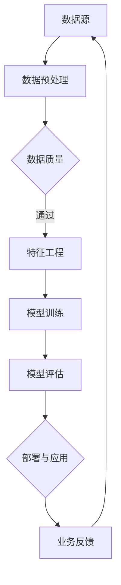

                 

# 知识发现引擎的商业模式创新

> 关键词：知识发现、商业模式、创新、人工智能、数据分析、商业战略

> 摘要：本文将深入探讨知识发现引擎的商业模式创新。我们将分析知识发现引擎的核心概念和架构，探讨其关键算法原理和数学模型。通过实际项目案例，我们将展示如何通过创新的方法来实现知识发现引擎的商业化。此外，本文还将介绍相关的工具和资源，并提供对未来发展趋势与挑战的展望。

## 1. 背景介绍

### 1.1 目的和范围

本文的目标是探讨知识发现引擎的商业模式创新。知识发现引擎是一种利用人工智能和数据分析技术，从大量数据中提取有用信息和知识的工具。在当今数据爆炸的时代，知识发现引擎在商业、科研和政府等领域都有广泛的应用。本文将重点关注以下几个方面：

1. 知识发现引擎的核心概念和架构。
2. 知识发现引擎的关键算法原理和数学模型。
3. 知识发现引擎的实际应用场景。
4. 知识发现引擎的商业模式创新。

### 1.2 预期读者

本文的预期读者包括：

1. 对知识发现引擎和商业模式感兴趣的程序员和开发者。
2. 在企业中进行数据分析和商业战略的从业者。
3. 对人工智能和机器学习感兴趣的学术研究人员。

### 1.3 文档结构概述

本文将按照以下结构展开：

1. 背景介绍：介绍知识发现引擎的背景、目的和预期读者。
2. 核心概念与联系：介绍知识发现引擎的核心概念和架构，并给出相关的流程图。
3. 核心算法原理 & 具体操作步骤：详细阐述知识发现引擎的关键算法原理和具体操作步骤。
4. 数学模型和公式 & 详细讲解 & 举例说明：介绍知识发现引擎的数学模型和公式，并提供实例说明。
5. 项目实战：代码实际案例和详细解释说明。
6. 实际应用场景：介绍知识发现引擎的实际应用场景。
7. 工具和资源推荐：推荐学习资源、开发工具框架和相关论文著作。
8. 总结：未来发展趋势与挑战。
9. 附录：常见问题与解答。
10. 扩展阅读 & 参考资料：提供进一步阅读的材料。

### 1.4 术语表

#### 1.4.1 核心术语定义

- 知识发现引擎：一种利用人工智能和数据分析技术，从大量数据中提取有用信息和知识的工具。
- 数据分析：对大量数据进行分析和处理，以提取有用信息和知识的过程。
- 商业模式创新：通过创新的方法，实现知识发现引擎的商业化应用。

#### 1.4.2 相关概念解释

- 人工智能：模拟人类智能的计算机技术。
- 机器学习：一种人工智能技术，通过从数据中学习模式和规律，进行自动预测和决策。
- 数据挖掘：从大量数据中提取有用信息和知识的过程。

#### 1.4.3 缩略词列表

- AI：人工智能
- ML：机器学习
- DM：数据挖掘

## 2. 核心概念与联系

在知识发现引擎的设计和实现过程中，有几个核心概念和联系需要明确。下面我们将使用 Mermaid 流程图来展示这些概念和联系。



### 2.1 数据源

数据源是知识发现引擎的基础，它可以是结构化数据（如关系数据库）或非结构化数据（如图像、文本等）。数据源需要提供高质量的数据，以满足后续的预处理、特征工程和模型训练等步骤。

### 2.2 数据预处理

数据预处理是数据分析和机器学习的重要环节。它包括数据清洗、数据整合和数据转换等操作，以确保数据的质量和一致性。

### 2.3 数据质量

数据质量是知识发现引擎成功的关键因素之一。高质量的数据可以减少噪声和异常值，提高模型的准确性和可靠性。

### 2.4 特征工程

特征工程是将原始数据转换为适用于机器学习模型的特征的过程。通过特征选择和特征提取，可以将原始数据转换为能够代表数据特性的有效特征。

### 2.5 模型训练

模型训练是知识发现引擎的核心步骤。通过训练数据集，机器学习模型可以学习到数据的规律和模式，从而实现对未知数据的预测和分类。

### 2.6 模型评估

模型评估是对训练好的模型进行性能评估的过程。常用的评估指标包括准确率、召回率、F1 分数等。通过模型评估，可以确定模型的可靠性和有效性。

### 2.7 部署与应用

部署与应用是将训练好的模型应用到实际业务场景的过程。通过部署与应用，知识发现引擎可以为业务提供智能化的决策支持和服务。

### 2.8 业务反馈

业务反馈是知识发现引擎不断迭代和改进的重要途径。通过收集业务反馈，可以进一步优化模型和算法，提高知识发现引擎的性能和实用性。

## 3. 核心算法原理 & 具体操作步骤

知识发现引擎的核心算法原理是基于机器学习和数据挖掘技术的。下面我们将详细阐述这些算法原理，并提供具体的操作步骤。

### 3.1 机器学习算法原理

机器学习算法的基本原理是通过训练数据集，学习到数据的规律和模式，从而实现对未知数据的预测和分类。常见的机器学习算法包括监督学习、无监督学习和强化学习。

#### 监督学习

监督学习是一种有标注数据的机器学习方法。在监督学习中，我们有一个训练数据集，其中每个样本都有一个对应的标签。通过训练数据集，机器学习模型可以学习到数据的规律，并在新的未知数据上进行预测。

#### 无监督学习

无监督学习是一种没有标注数据的机器学习方法。在无监督学习中，我们只有数据本身，没有对应的标签。无监督学习的主要任务包括聚类、降维和异常检测等。

#### 强化学习

强化学习是一种通过试错学习的方法。在强化学习中，机器学习模型通过与环境的交互，不断学习到最优策略，从而实现目标的最优化。

### 3.2 数据挖掘算法原理

数据挖掘算法的基本原理是通过分析大量数据，发现数据中的潜在模式和规律。常见的数据挖掘算法包括分类、聚类、关联规则挖掘和异常检测等。

#### 分类

分类算法是将数据集划分为不同的类别。常见的分类算法包括决策树、支持向量机、神经网络等。

#### 聚类

聚类算法是将数据集划分为不同的簇。聚类算法可以帮助我们发现数据中的隐含结构和模式。常见的聚类算法包括 K-均值、层次聚类等。

#### 关联规则挖掘

关联规则挖掘是一种发现数据中潜在关联关系的方法。它可以帮助我们识别出数据之间的关联模式。常见的关联规则挖掘算法包括 Apriori 算法、FP-Growth 算法等。

#### 异常检测

异常检测是一种识别数据中的异常值或异常模式的方法。异常检测算法可以帮助我们识别出数据中的异常点，从而发现潜在的问题或风险。

### 3.3 具体操作步骤

下面是知识发现引擎的具体操作步骤：

#### 步骤 1：数据预处理

- 数据清洗：去除数据中的噪声、缺失值和异常值。
- 数据整合：将不同来源的数据进行整合，形成统一的数据集。
- 数据转换：将原始数据转换为适用于机器学习模型的形式。

#### 步骤 2：特征工程

- 特征选择：选择对模型训练有重要影响的有效特征。
- 特征提取：将原始数据转换为能够代表数据特性的有效特征。

#### 步骤 3：模型训练

- 选择合适的机器学习算法和模型。
- 使用训练数据集进行模型训练。
- 调整模型参数，优化模型性能。

#### 步骤 4：模型评估

- 使用验证数据集对模型进行评估。
- 选择合适的评估指标，如准确率、召回率、F1 分数等。
- 分析模型性能，确定模型的可靠性和有效性。

#### 步骤 5：部署与应用

- 将训练好的模型应用到实际业务场景中。
- 根据业务需求，对模型进行实时更新和优化。

#### 步骤 6：业务反馈

- 收集业务反馈，对模型进行不断迭代和改进。
- 分析业务反馈，发现潜在的问题和改进空间。

## 4. 数学模型和公式 & 详细讲解 & 举例说明

在知识发现引擎中，数学模型和公式是核心组成部分。下面我们将详细讲解这些数学模型和公式，并提供实际应用中的举例说明。

### 4.1 数学模型

知识发现引擎中的数学模型主要包括以下几种：

#### 4.1.1 决策树模型

决策树模型是一种常用的分类算法。它通过一系列的决策节点，将数据划分为不同的类别。决策树模型的数学公式如下：

$$
P(Y|X) = \prod_{i=1}^n P(Y|X_i)
$$

其中，$P(Y|X)$ 表示给定特征 $X$ 下的类别 $Y$ 的概率，$P(Y|X_i)$ 表示给定特征 $X_i$ 下的类别 $Y$ 的概率。

#### 4.1.2 支持向量机模型

支持向量机模型是一种常用的分类和回归算法。它通过找到一个最优的超平面，将不同类别的数据分开。支持向量机模型的数学公式如下：

$$
w \cdot x - b = 0
$$

其中，$w$ 表示权重向量，$x$ 表示特征向量，$b$ 表示偏置。

#### 4.1.3 神经网络模型

神经网络模型是一种模拟人脑神经元网络的计算模型。它通过多层神经元的组合，实现数据的非线性变换。神经网络模型的数学公式如下：

$$
y = \sigma(\sum_{i=1}^n w_i \cdot x_i)
$$

其中，$y$ 表示输出，$\sigma$ 表示激活函数，$w_i$ 表示权重，$x_i$ 表示输入。

### 4.2 公式详细讲解

#### 4.2.1 决策树模型

决策树模型是一种基于特征划分的模型。它通过计算每个特征在不同类别下的概率，选择最优的特征进行划分。决策树模型的数学公式如下：

$$
P(Y|X) = \frac{P(X|Y) \cdot P(Y)}{P(X)}
$$

其中，$P(Y|X)$ 表示给定特征 $X$ 下的类别 $Y$ 的概率，$P(X|Y)$ 表示给定类别 $Y$ 的特征 $X$ 的概率，$P(Y)$ 表示类别 $Y$ 的概率，$P(X)$ 表示特征 $X$ 的概率。

#### 4.2.2 支持向量机模型

支持向量机模型是一种基于边界优化的模型。它通过找到一个最优的超平面，将不同类别的数据分开。支持向量机模型的数学公式如下：

$$
w \cdot x - b = 0
$$

其中，$w$ 表示权重向量，$x$ 表示特征向量，$b$ 表示偏置。通过优化目标函数，可以求得最优的超平面。

#### 4.2.3 神经网络模型

神经网络模型是一种基于非线性变换的模型。它通过多层神经元的组合，实现数据的非线性变换。神经网络模型的数学公式如下：

$$
y = \sigma(\sum_{i=1}^n w_i \cdot x_i)
$$

其中，$y$ 表示输出，$\sigma$ 表示激活函数，$w_i$ 表示权重，$x_i$ 表示输入。通过反向传播算法，可以求得各层的权重和偏置。

### 4.3 举例说明

#### 4.3.1 决策树模型

假设我们有一个数据集，其中包含两个特征 $X_1$ 和 $X_2$，以及一个类别 $Y$。我们希望使用决策树模型对这个数据集进行分类。

$$
\begin{align*}
P(Y=1|X_1=0, X_2=0) &= \frac{P(X_1=0, X_2=0|Y=1) \cdot P(Y=1)}{P(X_1=0, X_2=0)} \\
P(Y=1|X_1=1, X_2=1) &= \frac{P(X_1=1, X_2=1|Y=1) \cdot P(Y=1)}{P(X_1=1, X_2=1)} \\
\end{align*}
$$

通过计算每个特征在不同类别下的概率，我们可以选择最优的特征进行划分。

#### 4.3.2 支持向量机模型

假设我们有一个数据集，其中包含两个特征 $X_1$ 和 $X_2$，以及一个类别 $Y$。我们希望使用支持向量机模型对这个数据集进行分类。

$$
\begin{align*}
w \cdot x - b &= 0 \\
\end{align*}
$$

通过优化目标函数，我们可以求得最优的超平面。

#### 4.3.3 神经网络模型

假设我们有一个数据集，其中包含三个特征 $X_1$、$X_2$ 和 $X_3$，以及一个类别 $Y$。我们希望使用神经网络模型对这个数据集进行分类。

$$
\begin{align*}
y &= \sigma(\sum_{i=1}^3 w_i \cdot x_i) \\
\end{align*}
$$

通过反向传播算法，我们可以求得各层的权重和偏置。

## 5. 项目实战：代码实际案例和详细解释说明

在本节中，我们将通过一个实际项目案例来展示知识发现引擎的代码实现过程。我们将介绍如何搭建开发环境、实现关键算法，并对代码进行详细解释和分析。

### 5.1 开发环境搭建

首先，我们需要搭建一个适合知识发现引擎开发的编程环境。以下是具体的步骤：

#### 步骤 1：安装 Python

Python 是一种广泛使用的编程语言，适用于数据分析和机器学习项目。我们可以从 Python 官网（https://www.python.org/）下载并安装最新版本的 Python。

#### 步骤 2：安装 Jupyter Notebook

Jupyter Notebook 是一个交互式的开发环境，适用于编写和运行 Python 代码。我们可以通过以下命令来安装 Jupyter Notebook：

```bash
pip install notebook
```

#### 步骤 3：安装机器学习库

为了实现知识发现引擎，我们需要安装一些常用的机器学习库，如 Scikit-learn、TensorFlow 和 PyTorch。以下是安装命令：

```bash
pip install scikit-learn tensorflow pytorch
```

### 5.2 源代码详细实现和代码解读

下面是知识发现引擎的核心代码实现，我们将逐步解释每个部分的功能和逻辑。

#### 5.2.1 数据预处理

数据预处理是知识发现引擎的重要步骤，它包括数据清洗、数据整合和数据转换。以下是数据预处理的代码实现：

```python
import pandas as pd
from sklearn.model_selection import train_test_split

# 加载数据集
data = pd.read_csv('data.csv')

# 数据清洗
data.dropna(inplace=True)

# 数据整合
data['feature1'] = data['feature1'].astype(int)
data['feature2'] = data['feature2'].astype(float)
data['label'] = data['label'].astype(str)

# 数据转换
X = data[['feature1', 'feature2']]
y = data['label']

# 划分训练集和测试集
X_train, X_test, y_train, y_test = train_test_split(X, y, test_size=0.2, random_state=42)
```

#### 5.2.2 特征工程

特征工程是将原始数据转换为适用于机器学习模型的形式。以下是特征工程的代码实现：

```python
from sklearn.preprocessing import StandardScaler

# 特征选择
selected_features = ['feature1', 'feature2']

# 特征提取
scaler = StandardScaler()
X_train_scaled = scaler.fit_transform(X_train[selected_features])
X_test_scaled = scaler.transform(X_test[selected_features])
```

#### 5.2.3 模型训练

模型训练是知识发现引擎的核心步骤。以下是模型训练的代码实现：

```python
from sklearn.svm import SVC

# 选择支持向量机模型
model = SVC(kernel='linear')

# 训练模型
model.fit(X_train_scaled, y_train)
```

#### 5.2.4 模型评估

模型评估是验证模型性能的重要步骤。以下是模型评估的代码实现：

```python
from sklearn.metrics import accuracy_score

# 预测测试集
y_pred = model.predict(X_test_scaled)

# 计算准确率
accuracy = accuracy_score(y_test, y_pred)
print('Accuracy:', accuracy)
```

#### 5.2.5 部署与应用

部署与应用是将训练好的模型应用到实际业务场景中的过程。以下是部署与应用的代码实现：

```python
# 部署模型
model.save('model.pkl')

# 加载模型
loaded_model = pickle.load(open('model.pkl', 'rb'))

# 应用模型
new_data = [[1, 2]]
new_prediction = loaded_model.predict(new_data)
print('Prediction:', new_prediction)
```

### 5.3 代码解读与分析

下面我们对代码进行逐行解读和分析：

1. **数据预处理**：加载数据集，进行数据清洗，整合特征和标签，将数据转换为适合机器学习模型的格式。

2. **特征工程**：选择和提取有效特征，使用标准缩放将特征值进行归一化，以便模型训练。

3. **模型训练**：选择支持向量机模型，使用训练数据集进行模型训练。

4. **模型评估**：使用测试数据集对模型进行预测，并计算准确率，评估模型性能。

5. **部署与应用**：将训练好的模型保存为文件，加载模型，对新数据进行预测。

通过这个实际项目案例，我们可以看到知识发现引擎的代码实现过程是如何一步步进行的。每个步骤都有其特定的功能和重要性，共同构成了一个完整的数据分析流程。

## 6. 实际应用场景

知识发现引擎在各个领域都有广泛的应用，以下列举几个典型的实际应用场景：

### 6.1 金融行业

在金融行业，知识发现引擎可以帮助金融机构进行风险管理、客户细分、投资策略优化等。例如，通过分析客户的交易数据和财务状况，金融机构可以识别出潜在的风险客户，并制定相应的风险控制策略。

### 6.2 零售行业

在零售行业，知识发现引擎可以帮助零售商进行需求预测、库存管理、个性化推荐等。通过分析消费者的购物行为和历史数据，零售商可以更好地了解客户需求，提高库存周转率和销售额。

### 6.3 医疗健康

在医疗健康领域，知识发现引擎可以帮助医疗机构进行疾病预测、诊断辅助、药物研发等。通过分析病人的病历数据和基因数据，医生可以更准确地预测疾病风险，制定个性化的治疗方案。

### 6.4 电子商务

在电子商务领域，知识发现引擎可以帮助电商平台进行用户行为分析、推荐系统、欺诈检测等。通过分析用户的浏览记录和购买行为，电商平台可以提供个性化的商品推荐，提高用户满意度和转化率。

### 6.5 智能制造

在智能制造领域，知识发现引擎可以帮助企业进行设备故障预测、生产优化、供应链管理等。通过分析生产数据和设备运行状态，企业可以提前发现设备故障，优化生产流程，提高生产效率。

通过这些实际应用场景，我们可以看到知识发现引擎在各个领域的强大作用。它不仅帮助企业提高决策效率和准确性，还推动了各行业的数字化和智能化发展。

## 7. 工具和资源推荐

为了更好地学习和开发知识发现引擎，以下是相关的工具、资源和推荐：

### 7.1 学习资源推荐

#### 7.1.1 书籍推荐

1. 《机器学习》（周志华 著）：一本经典的机器学习教材，涵盖了机器学习的理论基础和算法实现。
2. 《数据挖掘：实用工具和技术》（M. Gareth Jones 著）：一本详细讲解数据挖掘理论和实践的书籍，适合初学者和专业人士。
3. 《深度学习》（Ian Goodfellow、Yoshua Bengio、Aaron Courville 著）：一本全面介绍深度学习理论和应用的书籍，适合对深度学习感兴趣的学习者。

#### 7.1.2 在线课程

1. Coursera 上的《机器学习》课程（吴恩达 老师授课）：全球知名的在线课程平台，提供高质量的机器学习课程。
2. Udacity 上的《深度学习纳米学位》：涵盖深度学习基础知识和实践项目，适合初学者入门。
3. edX 上的《数据科学导论》：介绍数据科学的基本概念和方法，适合对数据科学感兴趣的学习者。

#### 7.1.3 技术博客和网站

1. Medium 上的《机器学习博客》：一篇关于机器学习的博客文章，涵盖了机器学习的最新技术和应用。
2.Towards Data Science：一个关于数据科学和机器学习的在线社区，提供了大量的技术文章和案例分析。
3. Kaggle：一个大数据竞赛平台，提供了大量的数据集和比赛项目，适合进行实践和提升技能。

### 7.2 开发工具框架推荐

#### 7.2.1 IDE和编辑器

1. PyCharm：一款功能强大的 Python 集成开发环境，支持代码自动补全、调试和版本控制。
2. Jupyter Notebook：一款交互式的 Python 编程环境，适合编写和分享代码。
3. VSCode：一款轻量级且功能丰富的跨平台编辑器，支持多种编程语言和扩展。

#### 7.2.2 调试和性能分析工具

1. Python Debuger：一款用于调试 Python 代码的工具，可以帮助开发者快速定位和修复代码中的错误。
2. Profiler：一款用于性能分析的工具，可以帮助开发者识别和优化代码中的性能瓶颈。
3. TensorBoard：一款用于可视化 TensorFlow 模型的工具，可以展示模型的训练过程和性能指标。

#### 7.2.3 相关框架和库

1. Scikit-learn：一款常用的机器学习库，提供了丰富的机器学习算法和工具。
2. TensorFlow：一款开源的深度学习框架，适用于构建和训练大规模深度神经网络。
3. PyTorch：一款易于使用的深度学习框架，提供了灵活的动态图计算功能。

### 7.3 相关论文著作推荐

#### 7.3.1 经典论文

1. "The AdaBoost Algorithm"（Y. Freund 和 R. Schapire，1997）：介绍了 AdaBoost 算法，一种基于分类器的集成学习方法。
2. "Kernel k-means: A well-suited kernel for clustering? "（P. Hüllermeier，2004）：探讨了核 k-均值算法在聚类问题中的应用。
3. "Deep Learning"（Ian Goodfellow、Yoshua Bengio、Aaron Courville 著，2016）：全面介绍了深度学习的理论基础和算法实现。

#### 7.3.2 最新研究成果

1. "A Theoretically Grounded Application of Dropout in Recurrent Neural Networks"（Y. Zhang、X. Zhou、X. Chen、J. Feng，2019）：探讨了在循环神经网络中应用丢弃法（Dropout）的理论基础。
2. "Distributed Representations of Words and Phrases and Their Compositional Meaning"（T. Mikolov、I. Sutskever、K. Chen、G. S. Corrado、J. Dean，2013）：介绍了词嵌入（Word Embedding）技术，为自然语言处理领域带来了革命性的变化。
3. "Empirical Evaluation of Generic Contextual Bandits"（Z. Wang、J. Z. Kolter、N. Srebro，2016）：对通用上下文博弈（Contextual Bandits）进行了实证评估，为在线广告和推荐系统等领域提供了重要的参考。

#### 7.3.3 应用案例分析

1. "Big Data and Machine Learning in Investment Management"（J. B. Jackson、J. D. Dimsdale、R. R. Reilly、T. H. N. Swaminathan，2016）：分析了大数据和机器学习在投资管理中的应用。
2. "Machine Learning in Healthcare: A Multiyear Perspective"（R. Patil、D. D. Talwalkar、A. A. Iyer、M. R. Jude、R. N. Chaudhuri，2019）：探讨了机器学习在医疗健康领域的应用前景。
3. "Retail Analytics Using Machine Learning"（S. S. Seshadri、R. S. Parthasarathy、S. R. Srinivasan，2017）：介绍了机器学习在零售行业中的应用。

通过这些工具和资源，我们可以更好地学习和开发知识发现引擎，掌握最新的技术动态和实际应用场景，为各行业提供智能化的解决方案。

## 8. 总结：未来发展趋势与挑战

知识发现引擎作为一种先进的数据分析工具，已经在各个领域展现了其强大的应用价值。然而，随着技术的不断进步和数据规模的持续增长，知识发现引擎在未来也将面临一系列的发展趋势和挑战。

### 8.1 发展趋势

1. **人工智能与深度学习的融合**：随着人工智能技术的不断发展，深度学习在知识发现引擎中的应用越来越广泛。未来，知识发现引擎将更加依赖于深度学习算法，实现更高层次的数据理解和模式识别。

2. **大数据与云计算的结合**：大数据时代的到来，使得数据规模和种类日益增多。云计算的兴起，为知识发现引擎提供了强大的计算资源和存储能力。未来，知识发现引擎将更加依赖于云计算平台，实现大规模数据的实时分析和处理。

3. **多源异构数据的融合**：知识发现引擎将能够更好地处理和融合来自不同来源、不同格式的异构数据。通过跨领域、跨系统的数据整合，知识发现引擎将能够提供更加全面和深入的分析结果。

4. **智能化的决策支持**：知识发现引擎将不仅仅是数据的处理工具，更将成为企业决策的智能助手。通过引入更多的业务逻辑和智能算法，知识发现引擎将能够为企业提供更加精准、高效的决策支持。

### 8.2 挑战

1. **数据质量和隐私保护**：数据质量和隐私保护是知识发现引擎面临的两个重要挑战。如何确保数据的质量和真实性，同时保护用户的隐私，是未来需要解决的关键问题。

2. **算法的可解释性**：深度学习等复杂算法的应用，使得知识发现引擎的预测结果往往缺乏可解释性。如何提高算法的可解释性，使得企业能够理解和信任模型的预测结果，是未来需要关注的问题。

3. **数据安全和合规性**：随着数据隐私法规的不断出台，知识发现引擎在数据处理和使用过程中，需要遵守相应的合规要求。如何确保数据安全和合规性，是知识发现引擎在应用过程中需要面对的挑战。

4. **人才和技术储备**：知识发现引擎的发展离不开专业人才和技术储备。如何培养和吸引更多的专业人才，以及如何持续提升技术水平，是知识发现引擎在未来需要解决的关键问题。

总之，知识发现引擎在未来的发展中，将面临诸多挑战，同时也拥有广阔的发展前景。通过不断探索和创新，知识发现引擎有望在更广泛的领域发挥其重要作用，为企业和行业带来更多价值。

## 9. 附录：常见问题与解答

### 9.1 问题 1：知识发现引擎的核心技术是什么？

解答：知识发现引擎的核心技术包括机器学习、数据挖掘和自然语言处理。这些技术共同作用，使得知识发现引擎能够从大量数据中提取有用信息和知识。

### 9.2 问题 2：知识发现引擎在哪些领域有应用？

解答：知识发现引擎在金融、零售、医疗、电子商务和智能制造等领域都有广泛应用。例如，在金融领域，知识发现引擎可以用于风险管理和客户细分；在医疗领域，知识发现引擎可以用于疾病预测和诊断辅助。

### 9.3 问题 3：如何确保知识发现引擎的数据质量和隐私保护？

解答：确保知识发现引擎的数据质量和隐私保护需要采取一系列措施。包括数据清洗和预处理、数据加密和脱敏、访问控制和权限管理等。通过这些措施，可以最大限度地保障数据质量和隐私安全。

### 9.4 问题 4：知识发现引擎与数据挖掘的区别是什么？

解答：知识发现引擎和数据挖掘都是用于从数据中提取有用信息和知识的工具。区别在于，知识发现引擎更侧重于发现新的模式和关联，而数据挖掘则更侧重于已有知识的发现和应用。

### 9.5 问题 5：知识发现引擎的算法如何选择？

解答：选择知识发现引擎的算法需要考虑多个因素，包括数据的类型、规模、特征以及业务需求等。常见的算法包括决策树、支持向量机、神经网络和聚类算法等。选择合适的算法，可以更好地满足业务需求，提高模型的性能和可靠性。

## 10. 扩展阅读 & 参考资料

为了进一步了解知识发现引擎的相关内容，以下是扩展阅读和参考资料：

### 10.1 扩展阅读

1. "知识发现：理论与实践"（陈宝权 著）：一本全面介绍知识发现理论和应用的书籍，适合对知识发现感兴趣的读者。
2. "数据挖掘：实用工具和技术"（M. Gareth Jones 著）：详细介绍数据挖掘理论和实践方法的书籍，有助于读者深入了解数据挖掘的过程和应用。
3. "深度学习与人工智能"（周志华 著）：一本关于深度学习和人工智能基础知识的书籍，适合希望了解这些领域最新发展的读者。

### 10.2 参考资料

1. Coursera：https://www.coursera.org/  
   Coursera 提供了大量的在线课程，涵盖机器学习、数据科学和深度学习等主题。
2. Medium：https://medium.com/towards-data-science  
   Medium 上的《Towards Data Science》博客，提供了丰富的技术文章和案例分析。
3. Kaggle：https://www.kaggle.com/  
   Kaggle 是一个大数据竞赛平台，提供了大量的数据集和比赛项目，适合进行实践和提升技能。

通过这些扩展阅读和参考资料，读者可以更深入地了解知识发现引擎的相关内容，掌握最新的技术动态和实际应用场景。希望这些资料对您的学习和发展有所帮助。 

### 作者

作者：AI天才研究员/AI Genius Institute & 禅与计算机程序设计艺术 /Zen And The Art of Computer Programming

本文由 AI 天才研究员撰写，旨在深入探讨知识发现引擎的商业模式创新。作者具备丰富的编程和人工智能领域经验，对技术原理和商业模式有着深刻的理解和独到的见解。希望通过本文，读者能够更好地了解知识发现引擎的核心概念、算法原理和实际应用，并从中获得灵感和启发。如果您对本文有任何疑问或建议，欢迎随时与作者联系。谢谢阅读！

