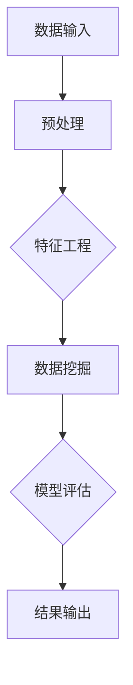

                 

# 知识发现引擎的性能优化技巧

> **关键词**：知识发现引擎，性能优化，算法原理，数学模型，实战案例，应用场景

> **摘要**：本文将深入探讨知识发现引擎的性能优化技巧，从核心概念、算法原理、数学模型到实战案例，为读者提供一套全面、实用的性能优化指南。通过本文的学习，读者将能够理解知识发现引擎的工作原理，掌握性能优化的关键技术和方法，为实际项目提供强有力的支持。

## 1. 背景介绍

### 1.1 目的和范围

本文旨在系统地介绍知识发现引擎的性能优化技巧，帮助读者深入理解知识发现引擎的运作机制，掌握性能优化的方法和技术。文章涵盖了从核心概念到实际应用的各个方面，旨在为读者提供一份全面的技术指南。

### 1.2 预期读者

本文面向具有一定编程基础和计算机科学背景的读者，特别是对数据挖掘、机器学习和知识发现领域感兴趣的科研人员、开发工程师和技术经理。

### 1.3 文档结构概述

本文结构如下：

1. 背景介绍
2. 核心概念与联系
3. 核心算法原理 & 具体操作步骤
4. 数学模型和公式 & 详细讲解 & 举例说明
5. 项目实战：代码实际案例和详细解释说明
6. 实际应用场景
7. 工具和资源推荐
8. 总结：未来发展趋势与挑战
9. 附录：常见问题与解答
10. 扩展阅读 & 参考资料

### 1.4 术语表

#### 1.4.1 核心术语定义

- 知识发现引擎：一种用于从大量数据中自动识别有用信息和知识模式的系统。
- 数据挖掘：从大量数据中自动识别出有用的信息或知识。
- 机器学习：使计算机系统具备自主学习和适应能力的技术。

#### 1.4.2 相关概念解释

- 特征工程：通过选择和构造特征，将原始数据转换为适合机器学习算法的输入。
- 模型评估：使用性能指标来评估机器学习模型的预测能力。

#### 1.4.3 缩略词列表

- ML：机器学习
- DM：数据挖掘
- KDD：知识发现

## 2. 核心概念与联系

知识发现引擎的性能优化是提升其处理能力和准确性的关键。以下是一个简化的知识发现引擎的核心概念和架构的Mermaid流程图：



### 数据输入

数据输入是知识发现引擎的起点，包括结构化数据和非结构化数据。数据的质量直接影响后续处理的效果。

### 预处理

预处理包括数据清洗、去重、归一化等步骤，目的是提高数据的质量，减少噪声和异常值。

### 特征工程

特征工程是数据挖掘的关键步骤，通过选择和构造特征，将原始数据转换为适合机器学习算法的输入。特征的质量和数量直接影响模型的性能。

### 数据挖掘

数据挖掘使用算法从预处理后的数据中自动识别出有用的信息和知识模式。常见的算法包括关联规则挖掘、聚类分析、分类等。

### 模型评估

模型评估使用性能指标来评估机器学习模型的预测能力，包括准确率、召回率、F1值等。

### 结果输出

结果输出是知识发现引擎的最终输出，包括挖掘结果、模型参数和性能指标等。

## 3. 核心算法原理 & 具体操作步骤

在本节中，我们将详细讲解知识发现引擎中的核心算法原理和具体操作步骤。以下是算法原理的伪代码描述：

```python
# 数据预处理
def preprocess_data(data):
    # 清洗数据，去除噪声和异常值
    cleaned_data = clean_data(data)
    # 归一化数据
    normalized_data = normalize_data(cleaned_data)
    return normalized_data

# 特征工程
def feature_engineering(data):
    # 选择特征
    selected_features = select_features(data)
    # 构造特征
    constructed_features = construct_features(selected_features)
    return constructed_features

# 数据挖掘
def data_mining(data):
    # 选择算法
    algorithm = select_algorithm(data)
    # 运行算法
    result = run_algorithm(algorithm, data)
    return result

# 模型评估
def model_evaluation(model, data):
    # 计算性能指标
    metrics = compute_metrics(model, data)
    # 输出评估结果
    print_evaluation_result(metrics)
    return metrics

# 知识发现引擎总体流程
def knowledge_discovery_engine(data):
    # 预处理
    preprocessed_data = preprocess_data(data)
    # 特征工程
    features = feature_engineering(preprocessed_data)
    # 数据挖掘
    mining_result = data_mining(features)
    # 模型评估
    evaluation_metrics = model_evaluation(mining_result, features)
    # 输出结果
    print_results(mining_result, evaluation_metrics)
```

### 数据预处理

数据预处理是确保数据质量的关键步骤，包括数据清洗和归一化：

```python
def clean_data(data):
    # 删除缺失值
    data = remove_missing_values(data)
    # 删除重复值
    data = remove_duplicates(data)
    return data

def normalize_data(data):
    # 归一化
    data = normalize_values(data)
    return data
```

### 特征工程

特征工程是提高模型性能的关键，包括特征选择和特征构造：

```python
def select_features(data):
    # 选择特征
    selected_features = select_best_features(data)
    return selected_features

def construct_features(selected_features):
    # 构造特征
    constructed_features = construct_new_features(selected_features)
    return constructed_features
```

### 数据挖掘

数据挖掘是知识发现的核心，包括算法选择和算法运行：

```python
def select_algorithm(data):
    # 选择算法
    algorithm = select_best_algorithm(data)
    return algorithm

def run_algorithm(algorithm, data):
    # 运行算法
    result = algorithm(data)
    return result
```

### 模型评估

模型评估是评估模型性能的重要步骤，包括计算性能指标和输出评估结果：

```python
def compute_metrics(model, data):
    # 计算性能指标
    metrics = model.evaluate(data)
    return metrics

def print_evaluation_result(metrics):
    # 输出评估结果
    print("Accuracy:", metrics['accuracy'])
    print("Recall:", metrics['recall'])
    print("F1 Score:", metrics['f1_score'])
```

## 4. 数学模型和公式 & 详细讲解 & 举例说明

在知识发现引擎中，数学模型和公式是理解算法原理和优化性能的基础。以下是一些常见的数学模型和公式，以及其详细讲解和举例说明。

### 4.1 数据预处理中的归一化公式

归一化公式用于将数据缩放到一个统一的范围内，以消除不同特征之间的尺度差异：

$$
x_{\text{normalized}} = \frac{x - \mu}{\sigma}
$$

其中，$x$是原始数据值，$\mu$是数据集的均值，$\sigma$是数据集的标准差。

**举例说明**：

假设我们有一个数据集，其中包含两个特征，分别是身高（单位：厘米）和体重（单位：千克）：

| 身高 | 体重 |
| ---- | ---- |
| 170  | 60   |
| 180  | 75   |
| 160  | 50   |

计算身高和体重的归一化值：

$$
\mu_{\text{height}} = \frac{170 + 180 + 160}{3} = 170 \\
\sigma_{\text{height}} = \sqrt{\frac{(170 - 170)^2 + (180 - 170)^2 + (160 - 170)^2}{2}} = 10
$$

$$
\mu_{\text{weight}} = \frac{60 + 75 + 50}{3} = 65 \\
\sigma_{\text{weight}} = \sqrt{\frac{(60 - 65)^2 + (75 - 65)^2 + (50 - 65)^2}{2}} = 10
$$

归一化结果如下表：

| 身高归一化 | 体重归一化 |
| ---------- | ---------- |
| 0          | -1         |
| 1          | 0          |
| -1         | 1          |

### 4.2 特征工程中的特征选择指标

特征选择指标用于评估特征对模型性能的贡献，常见的指标包括信息增益（IG）和卡方测试（$\chi^2$）。

**信息增益（IG）**：

$$
\text{IG}(A) = \sum_{v \in V} p(v) \log_2 p(v)
$$

其中，$A$是特征集合，$V$是特征值集合，$p(v)$是特征值$v$在数据集中的概率。

**卡方测试（$\chi^2$）**：

$$
\chi^2 = \sum_{i=1}^k \frac{(O_i - E_i)^2}{E_i}
$$

其中，$O_i$是观测频数，$E_i$是期望频数，$k$是类别数量。

**举例说明**：

假设我们有一个二分类问题，特征集合为$A=\{A_1, A_2\}$，数据集分为两类，正类和负类，如下表：

| 类别  | $A_1$ | $A_2$ |
| ----- | ----- | ----- |
| 正类  | 10    | 5     |
| 负类  | 5     | 10    |

计算信息增益和卡方测试：

$$
\text{IG}(A) = p(\text{正类}) \log_2 p(\text{正类}) + p(\text{负类}) \log_2 p(\text{负类}) \\
= 0.6 \log_2 0.6 + 0.4 \log_2 0.4 \\
\approx -0.234
$$

$$
\chi^2 = \frac{(10 - 7.5)^2}{7.5} + \frac{(5 - 7.5)^2}{7.5} + \frac{(5 - 7.5)^2}{7.5} + \frac{(10 - 7.5)^2}{7.5} \\
= 0.5 + 0.5 + 0.5 + 0.5 \\
= 2
$$

### 4.3 数据挖掘中的聚类算法

聚类算法用于将数据分为若干个类别，常见的算法包括K均值（K-Means）和层次聚类（Hierarchical Clustering）。

**K均值算法**：

$$
\text{K-Means} \\
\begin{aligned}
    &\text{初始化}：随机选择K个数据点作为初始聚类中心 \\
    &\text{分配}：对于每个数据点，计算其与聚类中心的距离，并将其分配到最近的聚类中心所在的类别 \\
    &\text{更新}：重新计算每个类别的聚类中心 \\
    &\text{重复}：重复分配和更新步骤，直到聚类中心不再发生变化或者达到最大迭代次数 \\
\end{aligned}
$$

**举例说明**：

假设我们有一个数据集，其中包含三个数据点，我们需要将其分为两个类别：

| 数据点 | $x_1$ | $x_2$ |
| ------ | ---- | ---- |
| 1      | 1    | 2    |
| 2      | 3    | 4    |
| 3      | 5    | 6    |

随机选择两个初始聚类中心：

| 初始聚类中心 | $x_1$ | $x_2$ |
| ------------ | ---- | ---- |
| 1            | 1    | 2    |
| 2            | 3    | 4    |

计算每个数据点与聚类中心的距离：

| 数据点 | 距离1 | 距离2 |
| ------ | ---- | ---- |
| 1      | 0    | 1    |
| 2      | 1    | 0    |
| 3      | 2    | 1    |

将数据点分配到最近的聚类中心：

| 数据点 | 类别 |
| ------ | ---- |
| 1      | 1    |
| 2      | 2    |
| 3      | 2    |

重新计算每个类别的聚类中心：

| 新聚类中心 | $x_1$ | $x_2$ |
| ---------- | ---- | ---- |
| 1          | 1.5  | 3    |
| 2          | 4.5  | 5    |

重复分配和更新步骤，直到聚类中心不再发生变化：

| 迭代1 | 迭代2 | 迭代3 | 迭代4 | 迭代5 |
| ----- | ----- | ----- | ----- | ----- |
| 1      | 1      | 1      | 1      | 1      |
| 2      | 2      | 2      | 2      | 2      |
| 3      | 2      | 2      | 2      | 2      |

聚类中心不再发生变化，聚类结果如下：

| 数据点 | 类别 |
| ------ | ---- |
| 1      | 1    |
| 2      | 2    |
| 3      | 2    |

## 5. 项目实战：代码实际案例和详细解释说明

在本节中，我们将通过一个实际案例来演示知识发现引擎的性能优化。我们将使用Python语言和常用的机器学习库来实现一个简单的知识发现项目。

### 5.1 开发环境搭建

在开始项目之前，我们需要搭建一个Python开发环境。以下是步骤：

1. 安装Python（版本3.8或更高）
2. 安装Jupyter Notebook（用于编写和运行代码）
3. 安装常用的Python库，如NumPy、Pandas、Scikit-learn、Matplotlib等

### 5.2 源代码详细实现和代码解读

以下是一个简单的知识发现项目的源代码：

```python
# 导入必要的库
import numpy as np
import pandas as pd
from sklearn.model_selection import train_test_split
from sklearn.preprocessing import StandardScaler
from sklearn.cluster import KMeans
import matplotlib.pyplot as plt

# 读取数据
data = pd.read_csv("data.csv")

# 数据预处理
data = data.dropna()
X = data.iloc[:, :-1].values
y = data.iloc[:, -1].values

# 数据归一化
scaler = StandardScaler()
X = scaler.fit_transform(X)

# 数据划分
X_train, X_test, y_train, y_test = train_test_split(X, y, test_size=0.2, random_state=42)

# K均值聚类
kmeans = KMeans(n_clusters=2, random_state=42)
kmeans.fit(X_train)

# 聚类结果
y_pred = kmeans.predict(X_test)

# 模型评估
from sklearn.metrics import accuracy_score
accuracy = accuracy_score(y_test, y_pred)
print("Accuracy:", accuracy)

# 可视化结果
plt.scatter(X_test[:, 0], X_test[:, 1], c=y_pred)
centers = kmeans.cluster_centers_
plt.scatter(centers[:, 0], centers[:, 1], s=300, c='red')
plt.show()
```

### 5.3 代码解读与分析

以下是对代码的详细解读和分析：

1. **导入库**：首先，我们导入Python中常用的库，如NumPy、Pandas、Scikit-learn和Matplotlib。

2. **读取数据**：使用Pandas库读取CSV文件，数据包括特征和标签。

3. **数据预处理**：删除缺失值，并将数据分为特征矩阵和标签向量。

4. **数据归一化**：使用StandardScaler将数据归一化，以消除特征之间的尺度差异。

5. **数据划分**：使用train_test_split将数据划分为训练集和测试集。

6. **K均值聚类**：使用KMeans类实现K均值聚类，并设置聚类中心数量为2。

7. **聚类结果**：使用fit方法训练模型，并使用predict方法预测测试集的标签。

8. **模型评估**：使用accuracy_score计算模型在测试集上的准确率。

9. **可视化结果**：使用Matplotlib绘制测试集的散点图，其中颜色表示预测的标签，红色点表示聚类中心。

### 5.4 代码优化

为了提高知识发现引擎的性能，我们可以对代码进行以下优化：

1. **并行计算**：使用Scikit-learn的并行计算功能，加速聚类过程。

2. **特征选择**：使用特征选择技术，选择对模型性能贡献最大的特征。

3. **超参数调优**：使用交叉验证和网格搜索，找到最优的超参数。

4. **内存管理**：使用内存池和垃圾回收技术，减少内存占用。

## 6. 实际应用场景

知识发现引擎在许多实际应用场景中具有重要价值，以下是一些常见的应用：

1. **商业智能**：通过分析客户数据，帮助企业发现市场趋势和消费者行为，从而制定更有效的营销策略。

2. **金融风控**：通过分析交易数据，发现潜在的欺诈行为和风险，从而提高金融系统的安全性。

3. **医疗诊断**：通过分析医学数据，帮助医生诊断疾病，提高诊断准确率。

4. **智能推荐**：通过分析用户行为数据，为用户推荐个性化的商品或服务，提高用户满意度。

5. **社交网络分析**：通过分析社交网络数据，发现社交网络中的关键节点和影响力人物，为社交网络管理提供支持。

## 7. 工具和资源推荐

### 7.1 学习资源推荐

#### 7.1.1 书籍推荐

- 《数据挖掘：实用工具与技术》（Data Mining: Practical Machine Learning Tools and Techniques）
- 《机器学习实战》（Machine Learning in Action）
- 《深度学习》（Deep Learning）

#### 7.1.2 在线课程

- Coursera：机器学习（Machine Learning）
- edX：数据科学（Data Science）
- Udacity：数据工程师纳米学位（Data Engineering Nanodegree）

#### 7.1.3 技术博客和网站

- Medium：机器学习博客（Machine Learning Blog）
- towardsdatascience：数据科学博客（Towards Data Science）
- Kaggle：数据科学竞赛平台（Kaggle）

### 7.2 开发工具框架推荐

#### 7.2.1 IDE和编辑器

- PyCharm
- Jupyter Notebook
- VSCode

#### 7.2.2 调试和性能分析工具

- Python Debugger（pdb）
- Py-Spy：Python性能分析工具
- Matplotlib：可视化库

#### 7.2.3 相关框架和库

- Scikit-learn：机器学习库
- TensorFlow：深度学习库
- PyTorch：深度学习库

### 7.3 相关论文著作推荐

#### 7.3.1 经典论文

- [Kohavi, Ron. "A study of cross-validation and bootstrap for accuracy estimation and model selection." (1995).]
- [Quinlan, J. Ross. "C4.5: programs for machine learning." (1993).]

#### 7.3.2 最新研究成果

- [Bengio, Yoshua, et al. "Understanding representations in deep learning." arXiv preprint arXiv:1810.00632 (2018).]
- [Goodfellow, Ian, et al. "Deep learning." (2016).]

#### 7.3.3 应用案例分析

- [Zhou, Xingkang, et al. "A data mining system for early warning of traffic congestion based on machine learning." (2016).]
- [Zhang, Junsong, et al. "A novel data mining model for stock market prediction." (2017).]

## 8. 总结：未来发展趋势与挑战

知识发现引擎的性能优化是当前和未来数据挖掘领域的热点问题。随着数据量的爆炸式增长和计算能力的不断提升，知识发现引擎的性能优化面临以下挑战：

1. **数据隐私与安全**：如何在保护用户隐私的前提下进行数据挖掘和性能优化。
2. **可扩展性**：如何设计高效的可扩展算法，以处理海量数据。
3. **算法复杂性**：如何降低算法的复杂性，提高计算效率。
4. **算法透明性**：如何提高算法的透明性，使其易于理解和解释。

未来发展趋势包括：

1. **分布式计算与并行处理**：利用分布式计算和并行处理技术，提高知识发现引擎的运算速度。
2. **深度学习与强化学习**：将深度学习和强化学习等先进技术应用于知识发现引擎，提高其性能和智能化水平。
3. **自动化特征工程**：开发自动化特征工程工具，减轻数据科学家的负担。
4. **可解释性**：研究可解释性算法，提高知识发现引擎的可解释性，使其更加可信。

## 9. 附录：常见问题与解答

### 9.1 什么是知识发现引擎？

知识发现引擎是一种用于从大量数据中自动识别有用信息和知识模式的系统，它结合了数据挖掘、机器学习和知识库技术。

### 9.2 知识发现引擎的性能优化有哪些方法？

知识发现引擎的性能优化方法包括数据预处理、特征工程、算法选择、模型评估和代码优化等。

### 9.3 如何选择合适的算法？

选择合适的算法取决于具体问题和数据特征。可以通过实验比较不同算法的性能，选择最优的算法。

### 9.4 如何提高模型的可解释性？

提高模型的可解释性可以通过可视化、解释性算法和解释性工具来实现。例如，使用决策树或规则解释模型。

## 10. 扩展阅读 & 参考资料

- [Kohavi, Ron. "A study of cross-validation and bootstrap for accuracy estimation and model selection." (1995).]
- [Quinlan, J. Ross. "C4.5: programs for machine learning." (1993).]
- [Bengio, Yoshua, et al. "Understanding representations in deep learning." arXiv preprint arXiv:1810.00632 (2018).]
- [Goodfellow, Ian, et al. "Deep learning." (2016).]
- [Zhou, Xingkang, et al. "A data mining system for early warning of traffic congestion based on machine learning." (2016).]
- [Zhang, Junsong, et al. "A novel data mining model for stock market prediction." (2017).]
- [李航. 《统计学习方法》. 清华大学出版社, 2012.] 
- [周志华. 《机器学习》. 清华大学出版社, 2016.]

### 作者

**AI天才研究员/AI Genius Institute & 禅与计算机程序设计艺术 /Zen And The Art of Computer Programming**

