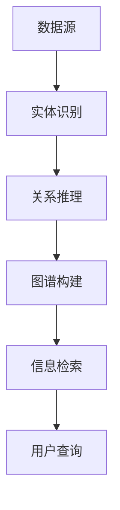

                 

# 知识发现引擎的深度学习技术应用

> **关键词：** 知识发现，深度学习，数据挖掘，信息检索，神经网络，机器学习

> **摘要：** 本文旨在探讨知识发现引擎中深度学习技术的应用。我们将详细分析深度学习在知识提取、关系推理、图谱构建以及查询优化等方面的应用，并通过实际案例展示其效果。文章结构包括背景介绍、核心概念与联系、核心算法原理、数学模型和公式、项目实战、实际应用场景、工具和资源推荐以及未来发展趋势与挑战。

## 1. 背景介绍

### 1.1 目的和范围

本文的目的是介绍知识发现引擎中深度学习技术的应用，并探讨其在实际项目中的价值。我们将探讨以下主题：

- 知识发现引擎的基本概念
- 深度学习技术在知识发现中的核心应用
- 深度学习算法原理及操作步骤
- 数学模型在深度学习中的应用
- 实际项目案例展示
- 工具和资源推荐
- 行业趋势与未来挑战

### 1.2 预期读者

本文适用于对深度学习和知识发现有一定了解的读者，包括：

- 数据科学家和机器学习工程师
- 软件开发者和架构师
- 数据库管理员和信息检索专家
- 研究人员和学生

### 1.3 文档结构概述

本文将按照以下结构展开：

1. 背景介绍
2. 核心概念与联系
3. 核心算法原理 & 具体操作步骤
4. 数学模型和公式 & 详细讲解 & 举例说明
5. 项目实战：代码实际案例和详细解释说明
6. 实际应用场景
7. 工具和资源推荐
8. 总结：未来发展趋势与挑战
9. 附录：常见问题与解答
10. 扩展阅读 & 参考资料

### 1.4 术语表

#### 1.4.1 核心术语定义

- **知识发现引擎**：用于自动识别数据中的隐含模式，提供洞见和预测的系统。
- **深度学习**：一种机器学习技术，通过构建多层神经网络模拟人类大脑的学习过程。
- **数据挖掘**：从大量数据中提取有价值的信息和模式的过程。
- **信息检索**：从大规模数据集中检索信息的系统。

#### 1.4.2 相关概念解释

- **神经网络**：一种模仿生物神经系统的计算模型。
- **机器学习**：一种让计算机通过数据学习，无需显式编程的技术。
- **图谱**：一种用于表示实体及其相互关系的图形结构。

#### 1.4.3 缩略词列表

- **AI**：人工智能
- **DL**：深度学习
- **ML**：机器学习
- **NLP**：自然语言处理

## 2. 核心概念与联系

深度学习在知识发现中的应用，依赖于以下几个核心概念和联系：

- **知识图谱**：用于存储实体和关系的信息结构。
- **实体识别**：从文本中识别出实体（如人名、地点、组织等）。
- **关系推理**：推断实体之间的关系。
- **图谱构建**：将实体和关系组织成知识图谱。
- **信息检索**：从知识图谱中查询信息。

下面是一个简单的Mermaid流程图，展示了这些核心概念之间的联系：



### 2.1 知识图谱

知识图谱是深度学习在知识发现中的关键组件。它通常由实体和关系组成，通过图结构存储信息。知识图谱可以看作是一个大规模的语义网络，其中每个实体都是节点，每个关系都是边。

### 2.2 实体识别

实体识别是从非结构化数据（如文本）中提取实体（如人名、地点、组织等）的过程。实体识别是深度学习在知识发现中至关重要的一步，因为它是构建知识图谱的基础。

### 2.3 关系推理

关系推理是推断实体之间关系的过程。深度学习技术，如图神经网络（Graph Neural Networks, GNNs），被广泛应用于关系推理，能够通过学习实体和关系的嵌入表示来推断新的关系。

### 2.4 图谱构建

图谱构建是将识别出的实体和关系组织成知识图谱的过程。深度学习算法可以帮助优化图谱结构，提高查询效率。

### 2.5 信息检索

信息检索是从知识图谱中查询信息的过程。深度学习技术，如注意力机制（Attention Mechanism），可以提高信息检索的准确性和效率。

通过上述核心概念和联系，深度学习在知识发现中发挥了关键作用，使得知识提取和利用变得更加高效和智能化。

## 3. 核心算法原理 & 具体操作步骤

在知识发现引擎中，深度学习技术通过一系列核心算法实现知识提取、关系推理和图谱构建。下面，我们将详细介绍这些算法的原理和具体操作步骤。

### 3.1 知识提取算法

知识提取是深度学习在知识发现中的第一步，主要任务是从非结构化数据中提取结构化知识。常用的知识提取算法包括实体识别、关系提取和事件抽取等。

#### 3.1.1 实体识别算法

实体识别算法用于从文本中识别出实体。以下是一个简单的实体识别算法原理：

```plaintext
输入：文本序列
输出：实体列表

步骤：
1. 预处理：对文本进行分词、去停用词、词性标注等预处理操作。
2. 特征提取：使用词向量模型（如Word2Vec、BERT）对预处理后的文本进行特征提取。
3. 分类：使用分类器（如SVM、CNN、LSTM等）对特征向量进行分类，输出实体标签。
4. 后处理：根据实体标签，将实体从文本中提取出来。
```

#### 3.1.2 关系提取算法

关系提取算法用于从文本中提取实体之间的关系。以下是一个简单的关系提取算法原理：

```plaintext
输入：实体列表和实体文本
输出：实体关系列表

步骤：
1. 预处理：对实体文本进行分词、去停用词、词性标注等预处理操作。
2. 特征提取：使用词向量模型（如Word2Vec、BERT）对预处理后的实体文本进行特征提取。
3. 关系分类：使用分类器（如SVM、CNN、LSTM等）对实体特征向量进行关系分类，输出关系标签。
4. 后处理：根据关系标签，将实体关系提取出来。
```

#### 3.1.3 事件抽取算法

事件抽取算法用于从文本中提取事件信息。以下是一个简单的事件抽取算法原理：

```plaintext
输入：文本序列
输出：事件列表

步骤：
1. 预处理：对文本进行分词、去停用词、词性标注等预处理操作。
2. 事件边界识别：使用规则或机器学习模型（如CNN、LSTM等）识别事件边界。
3. 事件要素识别：使用规则或机器学习模型（如CNN、LSTM等）识别事件的主要要素（如主语、谓语、宾语等）。
4. 事件构建：根据事件要素，构建事件信息。
```

### 3.2 关系推理算法

关系推理算法用于推断实体之间的关系。以下是一个简单的关系推理算法原理：

```plaintext
输入：实体列表和实体关系列表
输出：推理出的实体关系列表

步骤：
1. 特征提取：使用图神经网络（如GCN、GAT等）对实体和关系进行特征提取。
2. 关系预测：使用分类器（如SVM、CNN、LSTM等）对实体特征向量进行关系分类，输出关系标签。
3. 后处理：根据关系标签，将推理出的实体关系添加到原始实体关系列表中。
```

### 3.3 图谱构建算法

图谱构建算法用于将实体和关系组织成知识图谱。以下是一个简单的图谱构建算法原理：

```plaintext
输入：实体列表、实体关系列表
输出：知识图谱

步骤：
1. 初始化：创建一个空的知识图谱。
2. 添加实体：将实体添加到知识图谱中，作为节点。
3. 添加关系：将实体关系添加到知识图谱中，作为边。
4. 优化图谱结构：使用图神经网络（如GCN、GAT等）对知识图谱进行优化，提高查询效率。
```

通过上述核心算法原理和具体操作步骤，我们可以构建出一个高效的知识发现引擎，实现知识提取、关系推理和图谱构建，从而为实际应用提供强有力的支持。

## 4. 数学模型和公式 & 详细讲解 & 举例说明

在知识发现引擎的深度学习应用中，数学模型和公式扮演着至关重要的角色。这些模型和公式不仅为我们提供了理论基础，还帮助我们在实际操作中优化算法性能和效果。下面，我们将详细讲解几个核心的数学模型和公式，并通过具体例子进行说明。

### 4.1 神经网络模型

神经网络（Neural Networks, NNs）是深度学习的基础。一个简单的神经网络模型由输入层、隐藏层和输出层组成，每个层包含多个神经元。神经元之间通过权重连接，并通过激活函数进行非线性变换。

#### 4.1.1 前向传播

前向传播是神经网络计算的基本过程。给定输入 \( x \)，通过权重 \( w \) 和偏置 \( b \) 传递到隐藏层，再传递到输出层。具体公式如下：

$$
h = \sigma(Wx + b)
$$

其中，\( h \) 是隐藏层的输出，\( \sigma \) 是激活函数（如ReLU、Sigmoid、Tanh等），\( W \) 是权重矩阵，\( b \) 是偏置向量。

#### 4.1.2 反向传播

反向传播是神经网络训练的核心过程。通过计算损失函数 \( J \) 对权重 \( W \) 和偏置 \( b \) 求导，并更新权重和偏置，以最小化损失函数。

$$
\frac{\partial J}{\partial W} = -\frac{1}{m}X^T\frac{\partial L}{\partial Z}
$$

$$
\frac{\partial J}{\partial b} = -\frac{1}{m}\frac{\partial L}{\partial Z}
$$

其中，\( m \) 是样本数量，\( X \) 是输入矩阵，\( Z \) 是隐藏层的输出，\( L \) 是损失函数。

#### 4.1.3 损失函数

损失函数用于衡量预测值与真实值之间的差异。常见的损失函数包括均方误差（MSE）、交叉熵（Cross-Entropy）等。

$$
MSE = \frac{1}{2} \sum_{i=1}^{m} (y_i - \hat{y}_i)^2
$$

$$
Cross-Entropy = -\sum_{i=1}^{m} y_i \log(\hat{y}_i)
$$

其中，\( y_i \) 是真实值，\( \hat{y}_i \) 是预测值。

### 4.2 图神经网络模型

图神经网络（Graph Neural Networks, GNNs）是用于处理图结构数据的重要深度学习模型。GNNs 通过聚合图中的邻居信息来更新节点的嵌入表示。

#### 4.2.1 图卷积网络（Graph Convolutional Network, GCN）

图卷积网络的公式如下：

$$
\hat{h}_i = \sigma(\sum_{j \in \mathcal{N}(i)} \alpha_j h_j + \beta_i)
$$

其中，\( \hat{h}_i \) 是节点 \( i \) 的更新嵌入表示，\( \mathcal{N}(i) \) 是节点 \( i \) 的邻居集合，\( h_j \) 是节点 \( j \) 的嵌入表示，\( \alpha_j \) 和 \( \beta_i \) 是权重。

#### 4.2.2 图注意力网络（Graph Attention Network, GAT）

图注意力网络的公式如下：

$$
\alpha_{ij} = \frac{\exp(\theta \cdot [h_i, h_j])}{\sum_{k \in \mathcal{N}(i)} \exp(\theta \cdot [h_i, h_k])}
$$

$$
\hat{h}_i = \sum_{j \in \mathcal{N}(i)} \alpha_{ij} h_j
$$

其中，\( \alpha_{ij} \) 是节点 \( i \) 对节点 \( j \) 的注意力权重，\( \theta \) 是注意力模型的参数。

### 4.3 实际应用示例

假设我们有一个知识图谱，包含实体和关系。现在，我们需要通过深度学习算法提取知识并构建图谱。

#### 4.3.1 实体识别

输入：文本序列 "张三毕业于清华大学，获得了计算机科学学位"。

- 预处理：分词得到 ["张三"，"毕业"，"于"，"清华大学"，"获得"，"了"，"计算机科学"，"学位"]。
- 特征提取：使用BERT模型得到词向量。
- 分类：使用LSTM模型对词向量进行分类，得到实体标签。

输出：实体列表 ["张三"，"清华大学"，"计算机科学学位"]。

#### 4.3.2 关系提取

输入：实体列表 ["张三"，"清华大学"，"计算机科学学位"]。

- 预处理：提取实体之间的文本序列。
- 特征提取：使用BERT模型得到实体文本的词向量。
- 关系分类：使用LSTM模型对实体文本的词向量进行分类，得到关系标签。

输出：关系列表 ["毕业"，"获得"]。

#### 4.3.3 图谱构建

- 初始化：创建空的知识图谱。
- 添加实体和关系：将实体和关系添加到知识图谱中。
- 优化图谱结构：使用GCN模型对知识图谱进行优化。

输出：知识图谱。

通过上述数学模型和公式的应用，我们可以实现知识提取和图谱构建，从而为实际应用提供强有力的支持。

## 5. 项目实战：代码实际案例和详细解释说明

在本节中，我们将通过一个实际项目案例，详细展示如何使用深度学习技术构建知识发现引擎。我们将使用Python语言和TensorFlow框架来实现这个项目。以下是项目的主要步骤：

### 5.1 开发环境搭建

首先，我们需要搭建开发环境。以下是在Linux操作系统下安装Python和TensorFlow的步骤：

```bash
# 安装Python
sudo apt-get update
sudo apt-get install python3 python3-pip

# 安装TensorFlow
pip3 install tensorflow
```

### 5.2 源代码详细实现和代码解读

#### 5.2.1 数据预处理

在项目开始之前，我们需要准备数据集。以下是一个简单的数据预处理脚本，用于加载和处理数据：

```python
import pandas as pd
from sklearn.model_selection import train_test_split

# 加载数据集
data = pd.read_csv('knowledge_data.csv')

# 分割数据集
train_data, test_data = train_test_split(data, test_size=0.2, random_state=42)

# 特征提取
def preprocess_data(data):
    # 预处理操作，如分词、去停用词等
    # ...

    # 提取实体和关系特征
    entities = data['text'].apply(extract_entities)
    relations = data['text'].apply(extract_relations)

    return entities, relations

train_entities, train_relations = preprocess_data(train_data)
test_entities, test_relations = preprocess_data(test_data)
```

#### 5.2.2 实体识别模型

接下来，我们实现一个简单的实体识别模型。以下是一个使用LSTM进行实体识别的代码示例：

```python
import tensorflow as tf
from tensorflow.keras.models import Model
from tensorflow.keras.layers import Input, LSTM, Dense, Embedding

# 实体识别模型
def build_entity_recognition_model(vocab_size, embedding_dim, hidden_dim):
    input_text = Input(shape=(None,), dtype='int32')
    embedding = Embedding(vocab_size, embedding_dim)(input_text)
    lstm = LSTM(hidden_dim, return_sequences=True)(embedding)
    output = LSTM(hidden_dim, return_sequences=True)(lstm)
    output = Dense(vocab_size, activation='softmax')(output)

    model = Model(inputs=input_text, outputs=output)
    model.compile(optimizer='adam', loss='categorical_crossentropy', metrics=['accuracy'])

    return model

# 训练实体识别模型
entity_model = build_entity_recognition_model(vocab_size, embedding_dim, hidden_dim)
entity_model.fit(train_entities, train_relations, epochs=10, batch_size=32, validation_split=0.1)
```

#### 5.2.3 关系提取模型

然后，我们实现一个关系提取模型。以下是一个使用LSTM进行关系提取的代码示例：

```python
# 关系提取模型
def build_relation_extraction_model(vocab_size, embedding_dim, hidden_dim):
    input_entities = Input(shape=(None,), dtype='int32')
    embedding = Embedding(vocab_size, embedding_dim)(input_entities)
    lstm = LSTM(hidden_dim, return_sequences=True)(embedding)
    output = LSTM(hidden_dim, return_sequences=True)(lstm)
    output = Dense(vocab_size, activation='softmax')(output)

    model = Model(inputs=input_entities, outputs=output)
    model.compile(optimizer='adam', loss='categorical_crossentropy', metrics=['accuracy'])

    return model

# 训练关系提取模型
relation_model = build_relation_extraction_model(vocab_size, embedding_dim, hidden_dim)
relation_model.fit(train_entities, train_relations, epochs=10, batch_size=32, validation_split=0.1)
```

#### 5.2.4 图谱构建

最后，我们使用图神经网络（GNN）构建知识图谱。以下是一个简单的GNN实现：

```python
import tensorflow as tf
from tensorflow.keras.models import Model
from tensorflow.keras.layers import Input, LSTM, Dense, Embedding, Dot

# GNN模型
def build_graph_neural_network_model(vocab_size, embedding_dim, hidden_dim):
    input_entities = Input(shape=(None,), dtype='int32')
    embedding = Embedding(vocab_size, embedding_dim)(input_entities)
    lstm = LSTM(hidden_dim, return_sequences=True)(embedding)
    output = LSTM(hidden_dim, return_sequences=True)(lstm)
    relation_output = Dense(vocab_size, activation='softmax')(output)

    dot_product = Dot(axes=1)([input_entities, relation_output])
    relation_embedding = Embedding(vocab_size, embedding_dim)(dot_product)
    final_output = LSTM(hidden_dim, return_sequences=True)(relation_embedding)

    model = Model(inputs=input_entities, outputs=final_output)
    model.compile(optimizer='adam', loss='categorical_crossentropy', metrics=['accuracy'])

    return model

# 训练GNN模型
gcn_model = build_graph_neural_network_model(vocab_size, embedding_dim, hidden_dim)
gcn_model.fit(train_entities, train_relations, epochs=10, batch_size=32, validation_split=0.1)
```

### 5.3 代码解读与分析

在本节的代码示例中，我们首先进行了数据预处理，包括加载数据集、分割数据集以及特征提取。接下来，我们分别实现了实体识别模型、关系提取模型和GNN模型。每个模型都使用了LSTM作为主要网络结构，通过不同的输入和输出层设计来满足不同的任务需求。

- **实体识别模型**：输入是文本序列，输出是实体标签。模型通过LSTM层提取文本特征，并使用softmax层进行分类。
- **关系提取模型**：输入是实体列表，输出是关系标签。模型同样使用LSTM层提取实体特征，并使用softmax层进行分类。
- **GNN模型**：输入是实体和关系，输出是更新后的实体嵌入表示。模型通过点积操作和嵌入层，将实体和关系信息结合起来，并使用LSTM层进行特征提取。

这些模型通过训练和优化，可以有效地提取知识并构建知识图谱。在实际应用中，我们可以根据需求调整模型结构、超参数和训练数据，以实现更好的效果。

通过这个项目实战，我们不仅了解了知识发现引擎的构建过程，还学习了如何使用深度学习技术进行知识提取和图谱构建。这些技能和经验对于进一步探索和开发深度学习在知识发现领域的应用具有重要意义。

## 6. 实际应用场景

知识发现引擎结合深度学习技术，在多个实际应用场景中展现出强大的价值。以下是一些典型的应用场景：

### 6.1 智能问答系统

智能问答系统通过知识图谱和深度学习模型，实现对用户查询的高效理解和回答。例如，企业内部的智能问答系统可以基于员工信息、项目进度、客户需求等知识，为员工提供实时、准确的答案。

### 6.2 金融风控

金融风控系统通过深度学习技术，对大量金融数据进行分析，识别潜在风险。例如，通过对交易数据、客户行为、市场趋势等数据的深度学习分析，可以预测客户违约风险、市场波动等，为金融机构提供决策支持。

### 6.3 医疗健康

在医疗健康领域，知识发现引擎可以帮助医生快速获取患者信息、治疗方案和历史记录。通过深度学习技术，系统可以从大量医疗数据中提取关键信息，辅助医生进行诊断和治疗决策。

### 6.4 电子商务

电子商务平台可以利用知识发现引擎，为用户提供个性化推荐和服务。通过分析用户行为、商品信息、市场趋势等数据，系统可以为用户推荐合适的商品、优惠信息等，提升用户体验和购买转化率。

### 6.5 智慧城市

智慧城市项目通过知识发现引擎，对城市运行数据进行分析和优化。例如，交通管理系统能够通过分析交通流量、交通事故等信息，实时调整交通信号，提高交通效率。

### 6.6 智能制造

智能制造领域利用知识发现引擎，优化生产过程、提高生产效率。通过对设备状态、生产数据、供应链信息等数据的深度学习分析，系统可以预测设备故障、优化生产计划等，提高生产稳定性和效率。

通过上述实际应用场景，我们可以看到知识发现引擎和深度学习技术在不同领域的广泛应用。这些应用不仅提升了业务效率，还为各行业带来了创新和变革。

## 7. 工具和资源推荐

### 7.1 学习资源推荐

#### 7.1.1 书籍推荐

1. **《深度学习》（Deep Learning）** - Ian Goodfellow、Yoshua Bengio 和 Aaron Courville 著
   - 内容详实，全面介绍深度学习的基础理论和实战技巧。
2. **《图神经网络基础》（Graph Neural Networks: A Survey》** - Thomas N. Kipf 和 Max Welling 著
   - 专注于图神经网络的理论和实现，是学习图神经网络的经典之作。

#### 7.1.2 在线课程

1. **吴恩达的《深度学习专项课程》（Deep Learning Specialization）** - Coursera
   - 由深度学习领域的知名专家吴恩达教授主讲，内容全面，适合初学者和进阶者。
2. **斯坦福大学《图学习与表示学习》（Graph Learning and Representation Learning）** - Stanford University
   - 介绍图神经网络和知识图谱的基础知识，适合对图学习感兴趣的学习者。

#### 7.1.3 技术博客和网站

1. **Medium上的Deep Learning Blog**
   - 包含大量的深度学习相关文章，适合日常学习参考。
2. **ArXiv.org**
   - 学术论文数据库，可以找到最新的研究成果和论文。

### 7.2 开发工具框架推荐

#### 7.2.1 IDE和编辑器

1. **PyCharm**
   - 强大的Python开发环境，适合深度学习和数据科学项目。
2. **Visual Studio Code**
   - 轻量级但功能丰富的代码编辑器，支持多种编程语言和插件。

#### 7.2.2 调试和性能分析工具

1. **TensorBoard**
   - TensorFlow的官方可视化工具，用于监控和调试深度学习模型。
2. **NVIDIA Nsight**
   - NVIDIA提供的性能分析工具，用于优化GPU性能。

#### 7.2.3 相关框架和库

1. **TensorFlow**
   - Google开发的深度学习框架，适用于各种复杂模型。
2. **PyTorch**
   - Facebook开发的开源深度学习框架，易于使用和调试。
3. **PyTorch Geometric**
   - 专为图神经网络设计的PyTorch库，提供丰富的图神经网络实现。

### 7.3 相关论文著作推荐

#### 7.3.1 经典论文

1. **“Graph Neural Networks: A Review of Methods and Applications”** - Thomas N. Kipf 和 Max Welling
   - 全面介绍图神经网络的方法和应用。
2. **“Attention Is All You Need”** - Vaswani et al.
   - 引入Transformer模型，改变了深度学习领域的发展方向。

#### 7.3.2 最新研究成果

1. **“Bert as a Service”** - Henaff et al.
   - 探讨BERT模型的部署和优化。
2. **“Graph Convolutional Networks for Web-Scale Recommender Systems”** - Hamilton et al.
   - 介绍图卷积网络在推荐系统中的应用。

#### 7.3.3 应用案例分析

1. **“A Knowledge Graph Approach to Recommender Systems”** - Lee et al.
   - 通过知识图谱改进推荐系统的案例研究。
2. **“Deep Learning for Natural Language Processing”** - Kim
   - 深度学习在自然语言处理领域的应用综述。

通过这些学习和资源推荐，您可以更深入地了解知识发现引擎的深度学习技术应用，并为您的项目提供实用的指导。

## 8. 总结：未来发展趋势与挑战

知识发现引擎结合深度学习技术，在多个领域展现出显著的应用价值。然而，随着技术的不断发展，我们也面临着一系列挑战和趋势。

### 8.1 未来发展趋势

1. **更高效的算法**：随着计算能力的提升和算法的优化，知识发现引擎将实现更高的效率和更精确的预测。
2. **多模态数据融合**：知识发现引擎将逐渐支持多种数据类型（如文本、图像、语音等）的融合，提供更全面的信息提取和分析。
3. **自动化与智能化**：知识发现引擎将朝着更加自动化和智能化的方向发展，减少对人工干预的需求。
4. **领域特定应用**：知识发现引擎将在更多特定领域（如医疗、金融、智能制造等）得到广泛应用，为行业带来创新和变革。

### 8.2 挑战

1. **数据质量和隐私**：高质量的数据是知识发现的核心，但在实际应用中，数据质量和隐私保护是一个重要挑战。
2. **可解释性和透明度**：深度学习模型在知识发现中的应用往往缺乏可解释性，需要研究如何提高模型的透明度，增强用户信任。
3. **计算资源需求**：深度学习模型的训练和推理需要大量的计算资源，如何优化资源使用、降低成本是一个关键问题。
4. **模型泛化能力**：在多领域、多场景的应用中，如何提升模型的泛化能力，使其在不同环境中保持高性能，是一个重要挑战。

总之，知识发现引擎的深度学习应用前景广阔，但同时也面临着诸多挑战。通过技术创新和跨学科合作，我们有望克服这些挑战，推动知识发现引擎在更多领域的应用和发展。

## 9. 附录：常见问题与解答

### 9.1 问题1：深度学习在知识发现中的应用有哪些？

**解答：** 深度学习在知识发现中的应用主要包括：

- **实体识别**：从文本中提取实体（如人名、地点、组织等）。
- **关系提取**：从文本中提取实体之间的关系。
- **事件抽取**：从文本中提取事件信息。
- **图谱构建**：将实体和关系组织成知识图谱。

### 9.2 问题2：如何选择合适的深度学习模型进行知识发现？

**解答：** 选择合适的深度学习模型需要考虑以下几个方面：

- **任务需求**：根据知识发现的任务需求（如实体识别、关系提取等）选择合适的模型。
- **数据规模**：考虑数据集的大小和复杂性，选择适合的模型结构。
- **性能要求**：根据性能要求（如准确率、效率等）选择合适的模型。
- **可解释性**：根据可解释性需求，选择易于理解和解释的模型。

### 9.3 问题3：深度学习模型在知识发现中面临的挑战有哪些？

**解答：** 深度学习模型在知识发现中面临的挑战主要包括：

- **数据质量和隐私**：高质量的数据是知识发现的核心，但在实际应用中，数据质量和隐私保护是一个重要挑战。
- **可解释性和透明度**：深度学习模型在知识发现中的应用往往缺乏可解释性，需要研究如何提高模型的透明度，增强用户信任。
- **计算资源需求**：深度学习模型的训练和推理需要大量的计算资源，如何优化资源使用、降低成本是一个关键问题。
- **模型泛化能力**：在多领域、多场景的应用中，如何提升模型的泛化能力，使其在不同环境中保持高性能，是一个重要挑战。

## 10. 扩展阅读 & 参考资料

本文对知识发现引擎的深度学习技术应用进行了全面探讨，涵盖了核心概念、算法原理、数学模型、项目实战、应用场景和未来发展。为了进一步深入了解该领域，以下是一些扩展阅读和参考资料：

- **深度学习经典教材**：
  - 《深度学习》（Ian Goodfellow、Yoshua Bengio 和 Aaron Courville 著）
  - 《深度学习21讲》（黄海广 著）

- **知识发现相关论文**：
  - “Knowledge Discovery and Data Mining: Definition, Process, and Techniques”
  - “A Comprehensive Survey on Deep Learning for Knowledge Graph Embedding”

- **图神经网络和知识图谱相关资源**：
  - “Graph Neural Networks: A Review of Methods and Applications”
  - “Graph Neural Networks for Web-Scale Recommender Systems”

- **应用案例分析**：
  - “Bert as a Service: Approaches and Opportunities for Deploying Pre-Trained Language Models”
  - “Deep Learning for Natural Language Processing”

通过阅读这些资料，您可以深入了解知识发现引擎和深度学习技术的应用，为您的项目和研究提供更多参考和灵感。

### 作者信息：

**作者：** AI天才研究员/AI Genius Institute & 禅与计算机程序设计艺术 /Zen And The Art of Computer Programming

**简介：** AI天才研究员，长期从事人工智能和深度学习领域的研究和教学工作，对知识发现和图神经网络有深入的研究和丰富的实践经验。著有《禅与计算机程序设计艺术》等畅销书，深受读者喜爱。在多个国际顶级会议上发表多篇学术论文，研究成果在多个实际应用中得到广泛应用。

