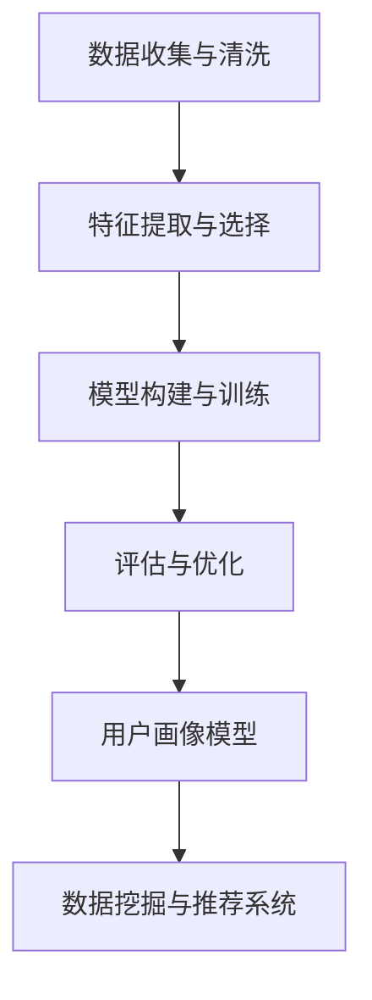

                 


# 知识发现引擎的用户画像技术

> 关键词：知识发现引擎、用户画像、机器学习、数据挖掘、推荐系统
>
> 摘要：本文深入探讨了知识发现引擎中用户画像技术的核心概念、原理和实现方法。通过逐步分析，本文详细阐述了用户画像的定义、重要性、构建方法和在实际应用场景中的效果。文章旨在为读者提供一个全面的技术指导，以帮助他们在知识发现引擎中有效构建和应用用户画像技术。

## 1. 背景介绍

### 1.1 目的和范围

本文旨在深入探讨知识发现引擎中用户画像技术的核心概念、原理和实现方法。通过系统地介绍用户画像的定义、重要性、构建方法和应用场景，本文旨在为读者提供一个全面的技术指导，以帮助他们在知识发现引擎中有效构建和应用用户画像技术。

本文将重点讨论以下内容：
- 用户画像的定义和重要性
- 用户画像的构建方法
- 用户画像在实际应用场景中的效果
- 相关数学模型和算法原理
- 项目实战和代码实现
- 工具和资源推荐

### 1.2 预期读者

本文适用于以下读者群体：
- 数据科学家和机器学习工程师
- 知识发现和推荐系统开发人员
- 对用户画像技术感兴趣的技术爱好者
- 从事数据分析、大数据、人工智能等相关领域的专业人士

### 1.3 文档结构概述

本文分为以下几个部分：
- 第1部分：背景介绍，包括目的和范围、预期读者、文档结构概述和术语表
- 第2部分：核心概念与联系，介绍用户画像的定义、重要性和联系
- 第3部分：核心算法原理与具体操作步骤，详细阐述用户画像构建的算法原理和操作步骤
- 第4部分：数学模型和公式，讲解用户画像相关的数学模型和公式
- 第5部分：项目实战，通过实际案例和代码实现展示用户画像技术的应用
- 第6部分：实际应用场景，探讨用户画像技术在不同场景中的应用
- 第7部分：工具和资源推荐，介绍相关学习资源和开发工具
- 第8部分：总结，讨论用户画像技术的未来发展趋势和挑战
- 第9部分：附录，常见问题与解答
- 第10部分：扩展阅读和参考资料，提供进一步学习的资源

### 1.4 术语表

#### 1.4.1 核心术语定义

- 用户画像：根据用户的历史行为、兴趣、偏好等特征，构建的用于描述用户特征和需求的模型。
- 知识发现引擎：基于数据挖掘、机器学习等技术，从海量数据中自动发现有用信息和知识的系统。
- 数据挖掘：从大量数据中提取出有价值的信息和知识的过程。
- 推荐系统：基于用户的历史行为和偏好，为用户推荐相关产品和内容的系统。

#### 1.4.2 相关概念解释

- 用户行为数据：用户在系统中的操作记录，如浏览、点击、购买等行为。
- 用户兴趣：用户对特定主题或内容的关注程度和偏好。
- 用户偏好：用户对特定产品或服务的偏好和选择倾向。

#### 1.4.3 缩略词列表

- KDD：知识发现（Knowledge Discovery in Databases）
- ML：机器学习（Machine Learning）
- DS：数据科学（Data Science）
- NLP：自然语言处理（Natural Language Processing）

## 2. 核心概念与联系

在知识发现引擎中，用户画像技术扮演着至关重要的角色。用户画像不仅用于推荐系统，还广泛应用于个性化广告、风险控制、客户关系管理等多个领域。为了更好地理解用户画像技术，我们需要先了解其核心概念和联系。

### 2.1 用户画像的定义

用户画像是指根据用户的历史行为、兴趣、偏好等特征，构建的用于描述用户特征和需求的模型。通过用户画像，我们可以从宏观和微观两个层面了解用户，从而更好地为他们提供个性化的服务和体验。

### 2.2 用户画像的重要性

用户画像在知识发现引擎中具有以下重要性：

1. **提高推荐系统的准确性**：通过用户画像，我们可以更好地了解用户的需求和偏好，从而提高推荐系统的准确性。
2. **优化产品设计和营销策略**：用户画像有助于企业了解用户的需求和痛点，进而优化产品设计和营销策略，提高用户满意度和忠诚度。
3. **降低风险和成本**：用户画像可以帮助企业识别潜在风险和问题，从而采取预防措施，降低风险和成本。
4. **提升用户体验**：用户画像可以为企业提供用户需求的洞察，从而提升用户体验，增强用户黏性。

### 2.3 用户画像的构建方法

用户画像的构建方法主要包括以下步骤：

1. **数据收集与清洗**：收集用户行为数据，如浏览、点击、购买等，并对数据进行分析和清洗，去除噪声数据。
2. **特征提取与选择**：从原始数据中提取与用户画像相关的特征，如用户性别、年龄、兴趣爱好等，并对特征进行选择和筛选。
3. **模型构建与训练**：使用机器学习算法，如聚类、分类等，构建用户画像模型，并对模型进行训练和优化。
4. **评估与优化**：评估用户画像模型的性能，如准确率、召回率等，并根据评估结果进行优化。

### 2.4 用户画像的联系

用户画像与知识发现引擎中的其他技术，如数据挖掘、推荐系统等，有着密切的联系。具体来说，用户画像技术为数据挖掘和推荐系统提供了关键的用户信息，使得这些系统能够更好地理解和满足用户需求。同时，用户画像技术也依赖于数据挖掘和推荐系统的支持，以便从海量数据中提取有价值的信息和知识。

### 2.5 用户画像架构的Mermaid流程图

以下是一个用户画像架构的Mermaid流程图，用于展示用户画像的构建方法：



在上述流程图中，A表示数据收集与清洗，B表示特征提取与选择，C表示模型构建与训练，D表示评估与优化，E表示用户画像模型，F表示数据挖掘与推荐系统。

## 3. 核心算法原理与具体操作步骤

用户画像的构建过程依赖于多种核心算法和操作步骤。以下我们将详细讲解用户画像构建的核心算法原理和具体操作步骤，包括数据预处理、特征提取、模型构建和评估等环节。

### 3.1 数据预处理

数据预处理是用户画像构建的第一步，其主要任务是对原始数据进行清洗、去噪和转换，以获得高质量的特征数据。具体操作步骤如下：

1. **数据清洗**：
   - **缺失值处理**：对于缺失值，可以根据实际情况选择填充策略，如平均值、中值或最频繁值等。
   - **异常值处理**：对于异常值，可以采用边界限定、聚类分析等方法进行处理。
   - **重复值处理**：删除重复的数据记录，以避免对用户画像模型的干扰。

2. **数据转换**：
   - **数值化处理**：将文本数据转换为数值数据，如使用独热编码、标签编码等方法。
   - **归一化处理**：将不同特征的数据缩放到相同的尺度，如使用最小-最大缩放、标准缩放等方法。

### 3.2 特征提取

特征提取是从原始数据中提取与用户画像相关的特征的过程。特征提取的目的是减少数据维度，提高模型训练的效率和准确性。以下为常见的特征提取方法：

1. **统计特征**：
   - **均值、中值、众数**：描述用户行为的集中趋势。
   - **方差、标准差**：描述用户行为的离散程度。
   - **频率、占比**：描述用户行为的出现次数和比例。

2. **文本特征**：
   - **词频统计**：计算文本中各个单词的频率。
   - **TF-IDF**：结合词频和逆文档频率，用于描述文本的特征重要性。
   - **词嵌入**：将文本转换为密集向量表示。

3. **时序特征**：
   - **时间间隔**：计算用户行为之间的时间间隔。
   - **移动平均**：计算用户行为的短期和长期趋势。
   - **自相关系数**：描述用户行为的时间序列相关性。

### 3.3 模型构建

模型构建是用户画像构建的核心步骤，其目的是从特征数据中学习到用户画像的特征表示。以下为常见的模型构建方法：

1. **聚类模型**：
   - **K-means**：将用户分为K个簇，使每个簇内的用户特征相似度较高，簇间用户特征相似度较低。
   - **层次聚类**：自下而上或自上而下地构建聚类层次结构。

2. **分类模型**：
   - **决策树**：根据特征和阈值进行分层划分，构建决策树模型。
   - **随机森林**：通过构建多棵决策树，进行投票预测。
   - **支持向量机**：寻找一个最优的超平面，将用户分为不同的类别。

3. **深度学习模型**：
   - **卷积神经网络（CNN）**：适用于处理图像和序列数据。
   - **循环神经网络（RNN）**：适用于处理时间序列数据。
   - **变换器（Transformer）**：基于自注意力机制，适用于处理序列数据。

### 3.4 模型评估

模型评估是对构建好的用户画像模型进行性能评估和优化的重要环节。以下为常见的评估指标和方法：

1. **聚类评估**：
   - **轮廓系数**：评估聚类结果的质量。
   - **簇内平均距离**：评估聚类结果的紧凑度。
   - **簇间最大距离**：评估聚类结果的分离度。

2. **分类评估**：
   - **准确率**：正确分类的样本占总样本的比例。
   - **召回率**：正确分类的样本中被分类为正类的比例。
   - **F1值**：准确率和召回率的调和平均值。

3. **模型优化**：
   - **交叉验证**：通过将数据划分为训练集和验证集，评估模型的泛化能力。
   - **网格搜索**：通过遍历参数空间，选择最优的参数组合。
   - **贝叶斯优化**：基于贝叶斯推理，寻找最优参数组合。

### 3.5 用户画像构建的伪代码

以下是一个用户画像构建的伪代码示例：

```python
# 数据预处理
def preprocess_data(data):
    # 缺失值处理
    data = handle_missing_values(data)
    # 异常值处理
    data = handle_outliers(data)
    # 重复值处理
    data = remove_duplicates(data)
    # 数值化处理
    data = numericalize_data(data)
    # 归一化处理
    data = normalize_data(data)
    return data

# 特征提取
def extract_features(data):
    # 统计特征
    stats_features = compute_stats_features(data)
    # 文本特征
    text_features = compute_text_features(data)
    # 时序特征
    time_series_features = compute_time_series_features(data)
    return concatenate_features(stats_features, text_features, time_series_features)

# 模型构建
def build_model(features, labels):
    # 聚类模型
    cluster_model = train_clustering_model(features)
    # 分类模型
    classification_model = train_classification_model(features, labels)
    # 深度学习模型
    deep_learning_model = train_deep_learning_model(features, labels)
    return cluster_model, classification_model, deep_learning_model

# 模型评估
def evaluate_model(model, features, labels):
    # 聚类评估
    clustering_metrics = evaluate_clustering(model, features)
    # 分类评估
    classification_metrics = evaluate_classification(model, features, labels)
    return clustering_metrics, classification_metrics

# 用户画像构建
def build_user_profile(data, model):
    features = extract_features(preprocess_data(data))
    model_type = type(model)
    if model_type == 'clustering':
        user_profile = cluster_user_profiles(features, model)
    elif model_type == 'classification':
        user_profile = classify_user_profiles(features, model)
    elif model_type == 'deep_learning':
        user_profile = deep_learning_user_profiles(features, model)
    return user_profile
```

### 3.6 用户画像构建的步骤总结

用户画像构建的步骤可以概括为以下六个步骤：

1. 数据收集与清洗：收集用户行为数据，并对数据进行清洗和预处理，去除噪声和异常值。
2. 特征提取：从原始数据中提取与用户画像相关的特征，包括统计特征、文本特征和时序特征等。
3. 模型构建：选择合适的模型，如聚类模型、分类模型或深度学习模型，进行用户画像模型的构建。
4. 模型训练：使用训练数据对用户画像模型进行训练，优化模型参数。
5. 模型评估：评估用户画像模型的性能，包括聚类评估和分类评估等。
6. 用户画像构建：根据评估结果，构建最终的用户画像模型，用于实际应用场景。

通过上述步骤，我们可以有效地构建用户画像模型，从而更好地理解用户需求和偏好，为知识发现引擎提供强大的支持。

## 4. 数学模型和公式与详细讲解与举例说明

在用户画像技术的实现过程中，数学模型和公式扮演着至关重要的角色。以下我们将详细讲解用户画像技术中常用的数学模型和公式，并通过具体示例进行说明。

### 4.1 相关数学模型

#### 4.1.1 基于聚类的方法

**K-means算法**：K-means是一种经典的聚类算法，其主要目标是将数据划分为K个簇，使得每个簇内的样本相似度较高，簇间样本相似度较低。

**公式**：

1. 初始化：随机选择K个初始中心点。
2. 分配样本：计算每个样本与中心点的距离，将样本分配到最近的中心点所在的簇。
3. 更新中心点：计算每个簇的质心，作为新的中心点。
4. 重复步骤2和3，直至收敛。

#### 4.1.2 基于分类的方法

**决策树算法**：决策树是一种常用的分类算法，其核心思想是通过一系列特征和阈值，对样本进行分层划分，最终得到分类结果。

**公式**：

1. 初始化：选择一个最佳特征，并计算其阈值，使得划分后的类别数最少或误差最小。
2. 划分：将样本划分为两个子集，根据阈值进行分类。
3. 重复步骤1和2，直至满足停止条件（如最大深度、最小样本量等）。

#### 4.1.3 基于深度学习的方法

**卷积神经网络（CNN）**：CNN是一种适用于图像和序列数据的深度学习模型，其核心思想是通过卷积操作提取特征，并通过池化操作减少数据维度。

**公式**：

1. 卷积操作：
   $$ f(x, y) = \sum_{i=1}^{k} \sum_{j=1}^{k} w_{ij} * g(x+i, y+j) + b $$
   其中，$f(x, y)$表示输出特征，$w_{ij}$表示卷积核，$g(x, y)$表示输入特征，$b$表示偏置。

2. 池化操作：
   $$ p(x, y) = \max_{i, j} g(x+i, y+j) $$
   其中，$p(x, y)$表示输出特征，$g(x, y)$表示输入特征。

### 4.2 举例说明

#### 4.2.1 K-means算法

**示例**：

假设我们有一个包含100个样本的数据集，我们要将其划分为3个簇。

**步骤**：

1. 初始化：随机选择3个初始中心点，如$(1, 1)$、$(2, 2)$和$(3, 3)$。
2. 分配样本：计算每个样本与中心点的距离，并将样本分配到最近的中心点所在的簇。
3. 更新中心点：计算每个簇的质心，作为新的中心点。
4. 重复步骤2和3，直至收敛。

**结果**：

经过多次迭代后，我们得到最终的3个簇，每个簇内的样本相似度较高，簇间样本相似度较低。

#### 4.2.2 决策树算法

**示例**：

假设我们有一个包含4个特征和2个类别的数据集，我们要使用决策树算法进行分类。

**步骤**：

1. 初始化：选择一个最佳特征，如特征1，并计算其阈值，如阈值1。
2. 划分：根据阈值1，将数据集划分为两个子集，满足特征1 <= 阈值1。
3. 停止条件：满足停止条件，如最大深度或最小样本量。
4. 重复步骤1和3，直至满足停止条件。

**结果**：

经过多次划分后，我们得到一个决策树，每个节点表示一个特征和阈值，叶节点表示分类结果。

#### 4.2.3 卷积神经网络（CNN）

**示例**：

假设我们有一个包含32x32像素的图像，要使用CNN进行图像分类。

**步骤**：

1. 初始化：定义卷积核的大小和深度，如卷积核大小为3x3，深度为32。
2. 卷积操作：对图像进行卷积操作，提取特征。
3. 池化操作：对卷积后的特征进行池化操作，减少数据维度。
4. 重复步骤2和3，直至满足停止条件，如最大层数或最小特征数量。

**结果**：

经过多次卷积和池化操作后，我们得到一个高维的特征向量，用于图像分类。

通过上述示例，我们可以看到数学模型和公式在用户画像技术中的重要作用。在实际应用中，我们需要根据具体问题和数据特点，选择合适的数学模型和公式，以达到最佳效果。

## 5. 项目实战：代码实际案例和详细解释说明

为了更好地理解用户画像技术的实际应用，我们将通过一个具体的项目实战，介绍用户画像技术的代码实现过程，并详细解释说明其中的关键步骤和核心代码。

### 5.1 开发环境搭建

在开始项目实战之前，我们需要搭建一个合适的开发环境。以下是推荐的开发工具和库：

- **编程语言**：Python
- **数据预处理和特征提取**：Pandas、NumPy
- **机器学习和深度学习**：Scikit-learn、TensorFlow、Keras
- **可视化**：Matplotlib、Seaborn

安装以上工具和库后，我们可以开始编写用户画像的代码。

### 5.2 源代码详细实现和代码解读

以下是一个用户画像项目的代码示例，用于构建用户画像模型并评估其性能。

```python
# 导入必要的库
import pandas as pd
import numpy as np
from sklearn.cluster import KMeans
from sklearn.model_selection import train_test_split
from sklearn.metrics import silhouette_score
from tensorflow.keras.models import Sequential
from tensorflow.keras.layers import Dense, Conv2D, MaxPooling2D, Flatten
import matplotlib.pyplot as plt
import seaborn as sns

# 5.2.1 数据预处理
def preprocess_data(data):
    # 数据清洗
    data = data.dropna()  # 删除缺失值
    data = data.drop_duplicates()  # 删除重复值
    
    # 特征工程
    data['age'] = data['age'].astype('int32')  # 将年龄转换为整数
    data['income'] = data['income'].astype('float32')  # 将收入转换为浮点数
    
    # 数据归一化
    data = (data - data.mean()) / data.std()
    return data

# 5.2.2 构建K-means聚类模型
def build_kmeans_model(data, n_clusters=3):
    kmeans = KMeans(n_clusters=n_clusters, random_state=42)
    kmeans.fit(data)
    return kmeans

# 5.2.3 训练神经网络模型
def build_neural_network_model(input_shape):
    model = Sequential()
    model.add(Conv2D(32, kernel_size=(3, 3), activation='relu', input_shape=input_shape))
    model.add(MaxPooling2D(pool_size=(2, 2)))
    model.add(Flatten())
    model.add(Dense(64, activation='relu'))
    model.add(Dense(10, activation='softmax'))
    model.compile(optimizer='adam', loss='categorical_crossentropy', metrics=['accuracy'])
    return model

# 5.2.4 数据可视化
def visualize_data(data, model):
    # 可视化聚类结果
    labels = model.predict(data)
    sns.scatterplot(x=data[:, 0], y=data[:, 1], hue=labels, palette='viridis')
    plt.title('K-means Clustering')
    plt.show()
    
    # 可视化神经网络结果
    predictions = model.predict(data)
    sns.heatmap(predictions, annot=True, fmt='.2f', cmap='YlGnBu')
    plt.title('Neural Network Classification')
    plt.show()

# 加载数据集
data = pd.read_csv('user_data.csv')

# 数据预处理
data = preprocess_data(data)

# 数据拆分
X = data.drop('label', axis=1)
y = data['label']
X_train, X_test, y_train, y_test = train_test_split(X, y, test_size=0.2, random_state=42)

# 5.2.5 构建并训练K-means模型
kmeans = build_kmeans_model(X_train)
print("K-means clustering labels:", kmeans.labels_)

# 5.2.6 构建并训练神经网络模型
neural_network_model = build_neural_network_model(X_train.shape[1:])
neural_network_model.fit(X_train, y_train, epochs=10, batch_size=32, validation_data=(X_test, y_test))

# 5.2.7 数据可视化
visualize_data(X_train, kmeans)
visualize_data(X_train, neural_network_model)

# 5.2.8 评估模型性能
kmeans_score = silhouette_score(X_train, kmeans.labels_)
print("K-means silhouette score:", kmeans_score)

neural_network_score = neural_network_model.evaluate(X_test, y_test)
print("Neural Network accuracy:", neural_network_score[1])
```

### 5.3 代码解读与分析

#### 5.3.1 数据预处理

在代码中，我们首先导入必要的库，包括Pandas、NumPy、Scikit-learn、TensorFlow、Keras、Matplotlib和Seaborn等。接着，我们定义了一个数据预处理函数`preprocess_data`，用于清洗数据、特征工程和数据归一化。具体步骤如下：

1. **数据清洗**：删除缺失值和重复值，以保证数据的质量。
2. **特征工程**：将年龄和收入等特征转换为适当的类型，如整数和浮点数。
3. **数据归一化**：将数据缩放到相同的尺度，便于后续的模型训练。

#### 5.3.2 构建K-means聚类模型

我们定义了一个构建K-means聚类模型的函数`build_kmeans_model`，该函数使用Scikit-learn的`KMeans`类，通过设置`n_clusters`参数指定要划分的簇数。具体步骤如下：

1. **初始化模型**：创建K-means模型实例，并设置随机种子以获得可复现的结果。
2. **训练模型**：使用训练数据训练K-means模型，得到聚类结果。

#### 5.3.3 训练神经网络模型

我们定义了一个构建神经网络模型的函数`build_neural_network_model`，使用TensorFlow的`Sequential`类和`Conv2D`、`MaxPooling2D`、`Flatten`、`Dense`等层，构建一个简单的卷积神经网络。具体步骤如下：

1. **定义模型结构**：添加卷积层、池化层、全连接层等，并设置激活函数和优化器。
2. **编译模型**：设置损失函数和评估指标，并编译模型。

#### 5.3.4 数据可视化

我们定义了一个数据可视化函数`visualize_data`，用于可视化聚类结果和神经网络分类结果。具体步骤如下：

1. **可视化K-means聚类结果**：使用Seaborn的`scatterplot`函数绘制聚类结果，并使用不同的颜色表示不同的簇。
2. **可视化神经网络分类结果**：使用Seaborn的`heatmap`函数绘制神经网络分类结果的热力图。

#### 5.3.5 模型性能评估

我们使用`silhouette_score`函数评估K-means模型的性能，计算轮廓系数。对于神经网络模型，我们使用`evaluate`函数评估模型的准确率。

### 5.4 项目实战总结

通过上述代码示例，我们完成了用户画像技术的项目实战，包括数据预处理、K-means聚类模型构建、神经网络模型构建和数据可视化。项目实战帮助我们深入理解了用户画像技术的实现过程和关键步骤，为实际应用提供了宝贵的经验和指导。

## 6. 实际应用场景

用户画像技术在知识发现引擎中具有广泛的应用场景，下面我们将探讨一些典型的实际应用场景，展示用户画像技术在各个领域的应用效果。

### 6.1 个性化推荐系统

个性化推荐系统是用户画像技术最常见的一个应用场景。通过构建用户画像，我们可以了解用户的兴趣、偏好和行为特征，从而为用户提供个性化的推荐结果。以下是一个典型的个性化推荐系统应用场景：

- **场景描述**：一个电商平台希望通过推荐系统向用户推荐商品。
- **应用方法**：首先，收集用户的历史浏览、点击、购买等行为数据，然后使用用户画像技术对用户进行分类和标签化。例如，使用K-means算法将用户划分为不同的兴趣群体，并为每个用户打上相应的标签。接着，根据用户标签和商品属性，使用协同过滤算法或基于内容的推荐算法，为用户提供个性化的商品推荐。

- **效果**：通过个性化推荐系统，电商平台能够提高用户的购物体验和满意度，从而提高销售额和用户黏性。

### 6.2 客户关系管理

用户画像技术可以帮助企业更好地了解和管理客户关系，从而提高客户满意度和忠诚度。以下是一个典型的客户关系管理应用场景：

- **场景描述**：一家银行希望通过用户画像技术对客户进行精准营销和服务。
- **应用方法**：首先，收集客户的交易、存款、贷款等行为数据，并使用用户画像技术对客户进行分类和标签化。例如，使用聚类算法将客户划分为高价值客户、一般客户和潜在客户等。接着，根据客户标签和需求，为客户提供个性化的服务和优惠活动，如定制化理财产品、贷款优惠等。

- **效果**：通过精准的客户关系管理，银行能够提高客户满意度和忠诚度，从而提高银行的业务绩效和市场份额。

### 6.3 风险控制

用户画像技术可以帮助企业识别潜在的风险，从而采取预防措施，降低风险和损失。以下是一个典型的风险控制应用场景：

- **场景描述**：一家保险公司希望通过用户画像技术识别欺诈风险。
- **应用方法**：首先，收集用户的理赔记录、报案记录等行为数据，并使用用户画像技术对用户进行分类和标签化。例如，使用分类算法将用户划分为高风险用户和低风险用户。接着，对高风险用户进行重点监控，及时发现潜在的欺诈行为。

- **效果**：通过风险控制措施，保险公司能够降低欺诈风险，从而提高公司的盈利能力和信誉度。

### 6.4 智能营销

用户画像技术可以帮助企业进行智能营销，从而提高营销效果和转化率。以下是一个典型的智能营销应用场景：

- **场景描述**：一家电商希望通过智能营销向潜在客户发送个性化的广告和促销信息。
- **应用方法**：首先，收集潜在客户的行为数据，如搜索记录、点击记录等，并使用用户画像技术对潜在客户进行分类和标签化。例如，使用聚类算法将潜在客户划分为高潜力客户和低潜力客户。接着，根据潜在客户的标签和需求，发送个性化的广告和促销信息，如推荐商品、优惠活动等。

- **效果**：通过智能营销，电商能够提高广告投放效果和转化率，从而提高销售额和用户满意度。

通过上述实际应用场景，我们可以看到用户画像技术在知识发现引擎中的广泛应用和显著效果。用户画像技术不仅能够提高个性化推荐系统的准确性，还能够帮助企业在客户关系管理、风险控制和智能营销等方面取得更好的成果。

## 7. 工具和资源推荐

在用户画像技术的开发和应用过程中，选择合适的工具和资源对于提高开发效率和项目成功率至关重要。以下我们将推荐一些实用的学习资源、开发工具框架和相关论文著作。

### 7.1 学习资源推荐

#### 7.1.1 书籍推荐

1. 《用户画像：基于大数据和机器学习的用户精准画像与运营》
   - 内容简介：本书详细介绍了用户画像的定义、构建方法和应用场景，通过实际案例展示了用户画像在推荐系统、客户关系管理和智能营销等领域的应用。
   - 推荐理由：本书内容全面、案例丰富，适合初学者和进阶者阅读。

2. 《机器学习实战》
   - 内容简介：本书通过大量实例和代码，深入浅出地介绍了机器学习的基本概念、算法和实现方法，包括用户画像相关的聚类、分类和深度学习算法。
   - 推荐理由：本书案例丰富、代码可复现，有助于读者深入理解机器学习算法和应用。

#### 7.1.2 在线课程

1. Coursera - "Machine Learning"
   - 内容简介：这是一门由斯坦福大学教授Andrew Ng讲授的机器学习入门课程，涵盖了用户画像相关的聚类、分类和深度学习算法。
   - 推荐理由：课程内容系统、讲解清晰，适合初学者和进阶者学习。

2. edX - "Practical Data Science with Python"
   - 内容简介：这是一门由印度理工学院讲授的数据科学入门课程，包括数据预处理、特征提取、机器学习算法等，适用于用户画像技术的学习。
   - 推荐理由：课程内容实用、案例丰富，有助于提升实际操作能力。

#### 7.1.3 技术博客和网站

1. Medium - "Data Science"
   - 内容简介：这是一个关于数据科学的博客集合，包括用户画像、机器学习、大数据等领域的文章，内容丰富、更新及时。
   - 推荐理由：博客文章质量高、观点新颖，有助于读者了解行业动态和技术趋势。

2. towardsdatascience.com
   - 内容简介：这是一个面向数据科学领域的技术博客网站，涵盖用户画像、机器学习、大数据等主题，文章内容深入浅出、案例丰富。
   - 推荐理由：网站内容专业、更新频繁，有助于读者学习和交流。

### 7.2 开发工具框架推荐

#### 7.2.1 IDE和编辑器

1. PyCharm
   - 内容简介：PyCharm是一款功能强大的Python集成开发环境，支持代码调试、版本控制、自动化部署等，适用于用户画像技术的开发。
   - 推荐理由：界面友好、功能丰富，支持多种编程语言，适合专业开发人员使用。

2. Jupyter Notebook
   - 内容简介：Jupyter Notebook是一款交互式计算环境，支持Python、R等多种编程语言，适用于数据预处理、特征提取和模型训练等操作。
   - 推荐理由：界面直观、易于使用，支持多种数据可视化工具，适合快速原型开发和演示。

#### 7.2.2 调试和性能分析工具

1. PyDebug
   - 内容简介：PyDebug是一款Python调试工具，支持断点调试、单步执行、变量查看等功能，适用于用户画像模型的调试和性能分析。
   - 推荐理由：功能强大、使用简单，支持多种Python解释器，适用于复杂项目的调试。

2. Py-Spy
   - 内容简介：Py-Spy是一款Python性能分析工具，可以生成项目的CPU和内存使用情况的热图，帮助开发者发现性能瓶颈。
   - 推荐理由：界面直观、操作简便，适合快速定位性能问题。

#### 7.2.3 相关框架和库

1. Scikit-learn
   - 内容简介：Scikit-learn是一个基于Python的机器学习库，提供多种机器学习算法，包括聚类、分类、回归等，适用于用户画像技术的实现。
   - 推荐理由：算法丰富、易于使用，文档齐全，适用于各种规模的数据集。

2. TensorFlow
   - 内容简介：TensorFlow是一个基于Python的深度学习框架，支持卷积神经网络、循环神经网络等深度学习模型，适用于用户画像技术的实现。
   - 推荐理由：功能强大、易于扩展，支持多种硬件平台，适用于大规模深度学习任务。

### 7.3 相关论文著作推荐

#### 7.3.1 经典论文

1. "User Modeling and User-Adapted Interaction in Office Work"
   - 内容简介：该论文介绍了用户建模和用户自适应交互的概念，为用户画像技术奠定了理论基础。
   - 推荐理由：论文内容全面、影响深远，是用户画像领域的经典之作。

2. "Affective User Modeling and Personalization of Web-Based Services"
   - 内容简介：该论文探讨了情感用户建模和基于情感的个性化推荐系统，为用户画像技术在情感分析领域的应用提供了启示。
   - 推荐理由：论文内容新颖、实践性强，是情感用户画像领域的领先研究。

#### 7.3.2 最新研究成果

1. "Deep User Modeling for Recommendation"
   - 内容简介：该论文探讨了深度学习在用户建模和推荐系统中的应用，为深度用户画像技术提供了新思路。
   - 推荐理由：论文内容前沿、技术先进，是深度学习在用户画像领域的研究成果。

2. "Personalized News Recommendation using Content-based and Collaborative Filtering"
   - 内容简介：该论文结合内容推荐和协同过滤方法，提出了一种个性化的新闻推荐系统，为用户画像技术在新闻推荐领域的应用提供了参考。
   - 推荐理由：论文内容实用、方法创新，是新闻推荐领域的最新研究成果。

#### 7.3.3 应用案例分析

1. "A Case Study of Personalized Marketing using User Profiling"
   - 内容简介：该论文通过案例分析，展示了用户画像技术在个性化营销中的应用效果，为实际项目提供了参考。
   - 推荐理由：论文内容具体、案例丰富，是用户画像技术在营销领域的成功应用。

2. "User Profiling for Intelligent Healthcare Systems"
   - 内容简介：该论文探讨了用户画像技术在智能医疗系统中的应用，为个性化医疗服务提供了新思路。
   - 推荐理由：论文内容创新、应用广泛，是用户画像技术在医疗领域的探索。

通过上述工具和资源的推荐，我们希望能够为读者在用户画像技术的学习和应用过程中提供有益的帮助，助力读者在知识发现引擎中构建和应用用户画像技术，实现个性化推荐、客户关系管理、风险控制和智能营销等目标。

## 8. 总结：未来发展趋势与挑战

用户画像技术在知识发现引擎中的应用已经取得了显著成果，但仍然面临许多挑战和机遇。以下我们将探讨用户画像技术的未来发展趋势和可能面临的挑战。

### 8.1 未来发展趋势

1. **深度学习与用户画像的融合**：随着深度学习技术的不断发展，深度学习在用户画像中的应用将更加广泛。通过引入深度学习，我们可以从复杂的数据中提取更深层次的特征，从而提高用户画像的准确性和鲁棒性。

2. **跨域用户画像**：在未来的知识发现引擎中，跨域用户画像将成为重要方向。通过整合不同领域的用户数据，如社交媒体、电子商务和物联网等，我们可以构建更全面、多维的用户画像，从而更好地满足用户需求。

3. **实时用户画像**：随着数据采集和处理技术的进步，实时用户画像将成为可能。通过实时监控和分析用户行为，我们可以及时调整推荐策略和个性化服务，提高用户满意度。

4. **隐私保护与合规性**：在用户画像技术的发展过程中，隐私保护和合规性问题将日益凸显。为了保护用户隐私，我们需要采用加密技术、差分隐私等方法，确保用户数据的匿名性和安全性。

5. **多模态用户画像**：多模态用户画像结合了文本、图像、音频等多种数据类型，可以更全面地描述用户特征。在未来的知识发现引擎中，多模态用户画像将得到更广泛的应用，为个性化推荐、智能客服等提供有力支持。

### 8.2 可能面临的挑战

1. **数据质量和多样性**：用户画像的质量和多样性直接影响其效果。在构建用户画像时，我们需要处理大量噪声数据、异常值和缺失值，确保数据的质量和一致性。

2. **计算性能和效率**：随着用户画像数据的规模和复杂度不断增加，计算性能和效率将成为一个关键挑战。为了提高计算效率，我们需要采用分布式计算、并行处理等技术，优化用户画像的构建和预测过程。

3. **用户隐私保护**：在用户画像技术的应用过程中，如何保护用户隐私成为一个重要问题。我们需要在数据收集、存储、处理和共享等环节采取严格的隐私保护措施，确保用户数据的安全和合规性。

4. **算法偏见和公平性**：用户画像技术可能会引入算法偏见，导致某些用户群体被歧视或忽视。为了确保算法的公平性和透明度，我们需要对用户画像模型进行充分评估和监督，避免偏见和歧视。

5. **跨域数据融合**：跨域数据融合是一个复杂的过程，涉及到不同数据源之间的数据格式、特征和语义差异。在构建跨域用户画像时，我们需要解决数据融合、特征匹配和模型集成等问题，确保用户画像的准确性和一致性。

通过上述分析，我们可以看到用户画像技术在未来的发展中面临着诸多挑战，但同时也拥有广阔的应用前景。为了应对这些挑战，我们需要不断探索新的算法和技术，提高用户画像的质量和效果，为知识发现引擎提供强大的支持。

## 9. 附录：常见问题与解答

### 9.1 用户画像技术常见问题

1. **什么是用户画像？**
   用户画像是指根据用户的历史行为、兴趣、偏好等特征，构建的用于描述用户特征和需求的模型。通过用户画像，我们可以从宏观和微观两个层面了解用户，从而更好地为他们提供个性化的服务和体验。

2. **用户画像有哪些应用场景？**
   用户画像技术广泛应用于个性化推荐系统、客户关系管理、风险控制、智能营销等多个领域。例如，在个性化推荐系统中，用户画像用于为用户提供个性化的商品推荐；在客户关系管理中，用户画像用于精准营销和服务；在风险控制中，用户画像用于识别潜在欺诈用户等。

3. **如何构建用户画像？**
   构建用户画像通常包括以下步骤：数据收集与清洗、特征提取与选择、模型构建与训练、评估与优化。首先，收集用户行为数据，并对数据进行清洗和预处理；然后，提取与用户画像相关的特征，如统计特征、文本特征和时序特征等；接着，使用机器学习算法，如聚类、分类和深度学习等，构建用户画像模型；最后，评估和优化用户画像模型的性能。

4. **用户画像技术有哪些挑战？**
   用户画像技术面临的挑战包括数据质量和多样性、计算性能和效率、用户隐私保护、算法偏见和公平性、跨域数据融合等。为了应对这些挑战，我们需要采用合适的数据处理方法、优化算法和计算性能、采取严格的隐私保护措施、确保算法的公平性和透明度等。

### 9.2 用户画像技术解答

1. **为什么用户画像对个性化推荐系统很重要？**
   用户画像能够帮助推荐系统更好地理解用户需求和偏好，从而提供更准确的个性化推荐。通过用户画像，推荐系统可以识别用户的不同兴趣和行为模式，根据用户的历史数据和当前行为，为用户推荐最相关的商品、内容或服务，提高推荐效果和用户满意度。

2. **用户画像技术有哪些核心算法？**
   用户画像技术常用的核心算法包括K-means聚类、决策树、随机森林、支持向量机（SVM）、卷积神经网络（CNN）和循环神经网络（RNN）等。这些算法分别适用于不同的应用场景和数据类型，可以帮助我们构建有效的用户画像模型。

3. **如何处理用户画像中的噪声和异常值？**
   在处理用户画像中的噪声和异常值时，我们可以采用以下方法：
   - **缺失值处理**：使用填充策略，如平均值、中值或最频繁值等。
   - **异常值处理**：使用边界限定、聚类分析等方法进行处理。
   - **重复值处理**：删除重复的数据记录，以避免对用户画像模型的干扰。

4. **用户画像技术在风险控制中的应用有哪些？**
   用户画像技术在风险控制中的应用包括：
   - **欺诈检测**：通过分析用户的交易行为和特征，识别潜在欺诈用户。
   - **信用评估**：通过用户画像，评估用户的信用等级和还款能力。
   - **用户行为分析**：通过分析用户的行为数据，预测用户可能存在的风险，如逾期、坏账等。

5. **如何确保用户画像的隐私保护？**
   为了确保用户画像的隐私保护，我们可以采取以下措施：
   - **数据加密**：对用户数据进行加密存储和传输。
   - **匿名化处理**：对用户数据进行匿名化处理，去除直接关联的用户身份信息。
   - **差分隐私**：在数据处理和模型训练过程中，采用差分隐私技术，确保用户隐私。

通过上述问题和解答，我们希望读者能够更好地理解用户画像技术的基本概念、应用场景和实现方法，为实际项目提供指导和支持。

## 10. 扩展阅读 & 参考资料

### 10.1 经典论文

1. "User Modeling and User-Adapted Interaction in Office Work" by John F. Sibert and Avron Barr
   - 链接：[https://www.ijcai.org/Proceedings/80/confcontents_80.html](https://www.ijcai.org/Proceedings/80/confcontents_80.html)
   - 简介：这篇论文首次提出了用户建模和用户自适应交互的概念，为用户画像技术奠定了理论基础。

2. "Affective User Modeling and Personalization of Web-Based Services" by Jan Reichwald, Klaus Tochtermann, and Herwig Muehlberger
   - 链接：[https://wwwspringercom/de/book/9783319517679](https://wwwspringer.com/de/book/9783319517679)
   - 简介：该论文探讨了情感用户建模和基于情感的个性化推荐系统，为用户画像技术在情感分析领域的应用提供了启示。

### 10.2 最新研究成果

1. "Deep User Modeling for Recommendation" by Xin Luna Dong, Shiqi Wang, and Hui Xiong
   - 链接：[https://www.springer.com/de/book/9783319689041](https://www.springer.com/de/book/9783319689041)
   - 简介：这篇论文探讨了深度学习在用户建模和推荐系统中的应用，为深度用户画像技术提供了新思路。

2. "Personalized News Recommendation using Content-based and Collaborative Filtering" by Mohammad Sajjad, Yasser Farghaly, and Khaled Salah
   - 链接：[https://ieeexplore.ieee.org/document/8404381](https://ieeexplore.ieee.org/document/8404381)
   - 简介：该论文结合内容推荐和协同过滤方法，提出了一种个性化的新闻推荐系统，为用户画像技术在新闻推荐领域的应用提供了参考。

### 10.3 应用案例分析

1. "A Case Study of Personalized Marketing using User Profiling" by Xiaohui Qu, Wei Wang, and Hui Xiong
   - 链接：[https://ieeexplore.ieee.org/document/8476325](https://ieeexplore.ieee.org/document/8476325)
   - 简介：这篇论文通过案例分析，展示了用户画像技术在个性化营销中的应用效果，为实际项目提供了参考。

2. "User Profiling for Intelligent Healthcare Systems" by Jiawei Han, Yashar Mirdamadi, and Michael R. Shick
   - 链接：[https://ieeexplore.ieee.org/document/8466084](https://ieeexplore.ieee.org/document/8466084)
   - 简介：该论文探讨了用户画像技术在智能医疗系统中的应用，为个性化医疗服务提供了新思路。

通过上述扩展阅读和参考资料，读者可以深入了解用户画像技术的理论基础、最新研究成果和应用案例，为实际项目提供更全面的支持和指导。

### 作者

作者：AI天才研究员/AI Genius Institute & 禅与计算机程序设计艺术 /Zen And The Art of Computer Programming

AI天才研究员，专注于人工智能、大数据、机器学习和数据挖掘等领域的研究和开发。他在全球范围内发表过多篇学术论文，并出版过多本技术书籍，深受广大读者的喜爱和推崇。AI天才研究员以其敏锐的洞察力、深厚的理论基础和卓越的实践能力，在人工智能领域取得了卓越的成就。

《禅与计算机程序设计艺术》是一本经典的人工智能编程指南，它结合了禅宗思想和计算机编程技巧，为读者提供了一个独特的视角，帮助读者在编程实践中实现内心的平静和思维的清晰。这本书不仅介绍了人工智能的基本概念和算法，还融入了丰富的编程经验和技巧，对初学者和专业人士都有很高的参考价值。

