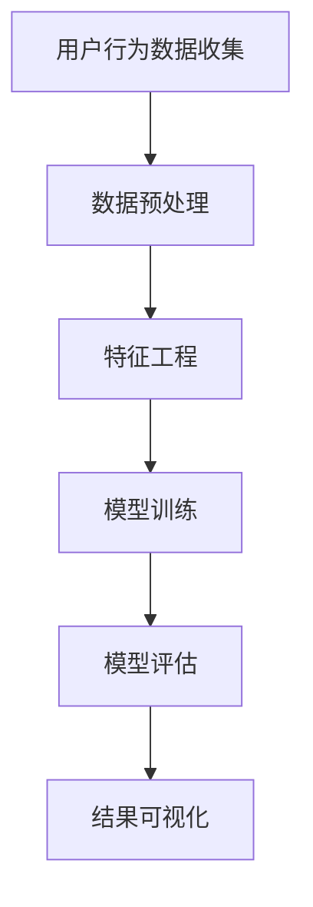

                 

# 知识发现引擎的用户行为分析

## 关键词
- 知识发现引擎
- 用户行为分析
- 数据挖掘
- 机器学习
- 数据可视化

## 摘要
本文旨在深入探讨知识发现引擎在用户行为分析中的应用。我们将从背景介绍、核心概念、算法原理、数学模型、实际案例、应用场景、工具推荐等多个角度，详细剖析知识发现引擎如何通过用户行为数据挖掘和分析，提升用户体验，优化产品设计，实现业务增长。本文将引导读者逐步了解知识发现引擎的工作原理、关键技术，以及如何将其应用于实际问题中，为从事数据分析、数据科学和人工智能领域的工作者提供有价值的参考。

## 1. 背景介绍

### 1.1 目的和范围
本文的主要目的是介绍知识发现引擎在用户行为分析中的应用，帮助读者理解其核心概念、原理和操作步骤。通过本文的阅读，读者将能够：

1. 了解知识发现引擎的基本概念和功能。
2. 掌握用户行为分析的关键技术。
3. 理解知识发现引擎如何应用于实际业务场景。
4. 获取实用的工具和资源，以进一步探索相关知识。

### 1.2 预期读者
本文适合以下读者群体：

1. 数据分析师和数据科学家。
2. 人工智能和机器学习领域的研究者。
3. 产品经理和用户体验设计师。
4. 任何对用户行为分析和知识发现引擎感兴趣的从业者。

### 1.3 文档结构概述
本文的结构如下：

1. 背景介绍：介绍知识发现引擎和用户行为分析的基本概念。
2. 核心概念与联系：详细阐述知识发现引擎的工作原理和用户行为分析的关键技术。
3. 核心算法原理 & 具体操作步骤：讲解知识发现引擎的核心算法和具体实现步骤。
4. 数学模型和公式 & 详细讲解 & 举例说明：介绍知识发现引擎所涉及的主要数学模型和公式，并举例说明。
5. 项目实战：通过实际案例展示知识发现引擎在用户行为分析中的应用。
6. 实际应用场景：探讨知识发现引擎在各类业务场景中的应用。
7. 工具和资源推荐：推荐相关的学习资源、开发工具和框架。
8. 总结：展望知识发现引擎在用户行为分析领域的未来发展趋势与挑战。
9. 附录：常见问题与解答。
10. 扩展阅读 & 参考资料：提供进一步的阅读材料。

### 1.4 术语表

#### 1.4.1 核心术语定义
- **知识发现引擎**：一种用于从大量数据中自动识别模式和关系的软件系统。
- **用户行为分析**：通过收集和分析用户在使用产品或服务时的行为数据，以了解用户需求和优化产品设计。
- **数据挖掘**：从大量数据中提取有价值信息的过程，通常涉及统计分析、机器学习和人工智能技术。
- **机器学习**：一种让计算机通过数据和经验自我学习和改进的技术。
- **数据可视化**：通过图形、图表等方式将数据转化为直观、易于理解的形式。

#### 1.4.2 相关概念解释
- **特征工程**：在机器学习过程中，将原始数据转换成适用于模型训练的特征向量。
- **聚类分析**：将数据集中的对象分为多个类别，使得同一个类别内的对象相似度较高，不同类别间的对象相似度较低。
- **分类分析**：将数据集中的对象分配到预定义的类别中。
- **回归分析**：预测一个或多个变量与一个或多个自变量之间的关系。
- **预测模型**：基于历史数据建立的一种模型，用于预测未来的趋势和事件。

#### 1.4.3 缩略词列表
- **API**：应用程序编程接口（Application Programming Interface）
- **ML**：机器学习（Machine Learning）
- **DL**：深度学习（Deep Learning）
- **NLP**：自然语言处理（Natural Language Processing）
- **DB**：数据库（Database）

## 2. 核心概念与联系

### 2.1 知识发现引擎的基本概念

知识发现引擎是一种集成了多种数据挖掘、机器学习和人工智能技术的软件系统。其主要功能是从大量数据中自动识别、发现隐藏的模式、关联和趋势，从而为业务决策提供支持。知识发现引擎通常包括以下关键组件：

1. **数据预处理**：清洗、转换和归一化原始数据，使其适合后续分析。
2. **特征工程**：从原始数据中提取和构造特征，以便更好地描述数据。
3. **模型训练**：利用机器学习算法对特征数据进行训练，以建立预测或分类模型。
4. **模型评估**：评估模型的性能，以确定其在实际应用中的有效性。
5. **结果可视化**：将分析结果以直观的图形或图表形式展示，帮助用户理解分析结果。

### 2.2 用户行为分析的关键技术

用户行为分析是知识发现引擎的重要应用领域之一。其核心在于从用户的交互行为中提取有价值的信息，以优化产品设计和提升用户体验。用户行为分析的关键技术包括：

1. **行为数据收集**：收集用户在使用产品或服务时的行为数据，如浏览、搜索、点击、购买等。
2. **行为数据存储**：将收集到的行为数据存储在数据库中，以便后续分析。
3. **行为数据预处理**：清洗、转换和归一化行为数据，使其适合建模和预测。
4. **行为数据建模**：利用机器学习算法建立用户行为预测模型或分类模型。
5. **行为数据评估**：评估用户行为预测模型或分类模型的性能，以确定其在实际应用中的有效性。

### 2.3 知识发现引擎与用户行为分析的联系

知识发现引擎和用户行为分析之间存在密切的联系。知识发现引擎为用户行为分析提供了一种强大的工具，使其能够从海量行为数据中提取有价值的信息。具体而言，知识发现引擎与用户行为分析的联系体现在以下几个方面：

1. **数据挖掘与机器学习**：知识发现引擎中的数据挖掘和机器学习技术可以帮助用户行为分析从行为数据中识别出隐藏的模式、关联和趋势。
2. **特征工程与模型训练**：知识发现引擎中的特征工程和模型训练技术可以帮助用户行为分析建立预测或分类模型，从而更好地理解用户行为。
3. **模型评估与结果可视化**：知识发现引擎中的模型评估和结果可视化技术可以帮助用户行为分析评估预测或分类模型的性能，并直观地展示分析结果。

### 2.4 Mermaid 流程图

为了更好地展示知识发现引擎与用户行为分析之间的联系，我们可以使用Mermaid流程图来描述整个过程。以下是知识发现引擎在用户行为分析中的应用流程：



## 3. 核心算法原理 & 具体操作步骤

### 3.1 知识发现引擎的核心算法

知识发现引擎的核心算法主要包括以下几种：

1. **聚类分析**：将相似的数据对象分组，以便更好地理解数据分布。
2. **分类分析**：根据已知的分类结果，将新的数据对象分配到预定义的类别中。
3. **回归分析**：预测一个或多个变量与一个或多个自变量之间的关系。
4. **关联规则挖掘**：发现数据集中不同变量之间的关联关系。
5. **异常检测**：识别数据中的异常值或异常模式。

### 3.2 用户行为分析的核心算法

用户行为分析的核心算法通常包括以下几种：

1. **行为序列建模**：利用循环神经网络（RNN）或长短期记忆网络（LSTM）对用户行为序列进行建模。
2. **行为预测**：利用机器学习算法（如决策树、随机森林、支持向量机等）预测用户未来的行为。
3. **用户群体划分**：利用聚类分析算法（如K-means、层次聚类等）将用户划分为不同的群体。
4. **行为关联分析**：利用关联规则挖掘算法（如Apriori算法、FP-growth算法等）分析用户行为之间的关联关系。
5. **行为异常检测**：利用异常检测算法（如孤立森林、离群点检测等）识别用户行为中的异常现象。

### 3.3 具体操作步骤

以下是知识发现引擎在用户行为分析中的具体操作步骤：

1. **数据收集**：收集用户在使用产品或服务时的行为数据，如浏览记录、搜索关键词、点击次数、购买行为等。
2. **数据预处理**：清洗和转换行为数据，包括去重、填补缺失值、归一化等操作，使其适合建模和预测。
3. **特征工程**：从原始行为数据中提取和构造特征，如用户年龄、性别、地理位置、购买频率等，以便更好地描述数据。
4. **模型选择**：根据具体问题选择合适的机器学习算法，如行为序列建模、行为预测、用户群体划分、行为关联分析、行为异常检测等。
5. **模型训练**：利用训练集对选定的机器学习算法进行训练，以建立预测或分类模型。
6. **模型评估**：利用验证集对训练好的模型进行评估，以确定其性能。
7. **结果可视化**：将模型预测结果或分析结果以图形或图表形式展示，帮助用户理解分析结果。
8. **模型优化**：根据评估结果对模型进行调优，以提高其性能。
9. **模型部署**：将优化后的模型部署到实际业务场景中，如推荐系统、营销活动优化、用户群体细分等。

### 3.4 伪代码示例

以下是用户行为分析中一个简单的聚类分析算法（K-means）的伪代码示例：

```python
# 初始化聚类中心点
def initialize_cluster_centers(data, k):
    # 从数据集中随机选择k个数据点作为初始聚类中心点
    return random.sample(data, k)

# 计算距离
def calculate_distance(point1, point2):
    # 计算两个数据点之间的欧氏距离
    return sqrt(sum((x1 - x2)^2 for x1, x2 in zip(point1, point2)))

# 分配数据点
def assign_points_to_clusters(data, clusters):
    # 将数据点分配到最近的聚类中心点所在的聚类中
    for point in data:
        nearest_cluster = min(clusters, key=lambda c: calculate_distance(point, c))
        nearest_cluster.append(point)
    return clusters

# 更新聚类中心点
def update_cluster_centers(clusters):
    # 计算每个聚类中心点的平均值，作为新的聚类中心点
    new_centers = []
    for cluster in clusters:
        new_center = [sum(values) / len(values) for values in zip(*cluster)]
        new_centers.append(new_center)
    return new_centers

# K-means算法
def kmeans(data, k, max_iterations):
    # 初始化聚类中心点
    clusters = initialize_cluster_centers(data, k)
    
    for _ in range(max_iterations):
        # 分配数据点
        assign_points_to_clusters(data, clusters)
        
        # 更新聚类中心点
        clusters = update_cluster_centers(clusters)
        
        # 检查收敛条件
        if has_converged(clusters):
            break
    
    return clusters
```

## 4. 数学模型和公式 & 详细讲解 & 举例说明

### 4.1 知识发现引擎的主要数学模型

知识发现引擎在用户行为分析中涉及多个数学模型，其中主要包括：

1. **聚类分析模型**：如K-means、层次聚类等。
2. **分类分析模型**：如决策树、支持向量机等。
3. **回归分析模型**：如线性回归、逻辑回归等。
4. **关联规则挖掘模型**：如Apriori算法、FP-growth算法等。
5. **异常检测模型**：如孤立森林、离群点检测等。

### 4.2 聚类分析模型（K-means）

K-means是一种经典的聚类算法，其目标是将数据集中的对象划分为K个簇，使得同一簇内的对象相似度较高，不同簇间的对象相似度较低。以下是K-means算法的核心公式和步骤：

#### 4.2.1 公式

$$
c_j = \frac{1}{N_j} \sum_{i=1}^{N} x_i
$$

其中，$c_j$表示第j个簇的中心点，$N_j$表示第j个簇中的对象数量，$x_i$表示第i个对象。

#### 4.2.2 步骤

1. **初始化聚类中心点**：随机选择K个数据点作为初始聚类中心点。
2. **分配数据点**：计算每个数据点到每个聚类中心点的距离，将数据点分配到距离最近的聚类中心点所在的簇中。
3. **更新聚类中心点**：计算每个簇的中心点，作为新的聚类中心点。
4. **迭代优化**：重复步骤2和步骤3，直到聚类中心点不再发生变化或达到预设的迭代次数。

#### 4.2.3 举例说明

假设有6个数据点$(x_1, y_1), (x_2, y_2), (x_3, y_3), (x_4, y_4), (x_5, y_5), (x_6, y_6)$，我们要使用K-means算法将它们划分为2个簇。首先随机选择两个数据点作为初始聚类中心点，然后按照以下步骤进行迭代：

1. **初始化聚类中心点**：$(x_1, y_1)$和$(x_5, y_5)$。
2. **分配数据点**：计算每个数据点到两个聚类中心点的距离，将它们分配到最近的聚类中心点所在的簇中。结果如下：

   | 数据点 | 距离$(x_1, y_1)$ | 距离$(x_5, y_5)$ | 分配到簇 |
   | ------ | ---------------- | ---------------- | -------- |
   | $(x_1, y_1)$ | 0               | 10              | 簇1      |
   | $(x_2, y_2)$ | 3.16            | 6.84            | 簇2      |
   | $(x_3, y_3)$ | 6.84            | 3.16            | 簇2      |
   | $(x_4, y_4)$ | 10              | 0               | 簇1      |
   | $(x_5, y_5)$ | 10              | 0               | 簇1      |
   | $(x_6, y_6)$ | 6.4             | 3.6             | 簇2      |
3. **更新聚类中心点**：计算每个簇的中心点，作为新的聚类中心点。结果如下：

   | 簇1 | $(x_1, y_1)$ | $(x_4, y_4)$ | $(x_5, y_5)$ | 新聚类中心点 | $(2.67, 2.67)$ |
   | 簇2 | $(x_2, y_2)$ | $(x_3, y_3)$ | $(x_6, y_6)$ | 新聚类中心点 | $(4.33, 4.33)$ |
4. **重复步骤2和步骤3**：继续迭代，直到聚类中心点不再发生变化或达到预设的迭代次数。

### 4.3 分类分析模型（决策树）

决策树是一种常见的分类分析模型，它通过一系列if-else规则将数据集划分为不同的类别。以下是决策树算法的核心公式和步骤：

#### 4.3.1 公式

$$
Gini(\text{impurity}) = 1 - \sum_{i=1}^{k} p_i^2
$$

其中，$p_i$表示第i类别的概率。

#### 4.3.2 步骤

1. **初始化**：选择一个特征作为分割依据，计算该特征的Gini不纯度。
2. **划分数据**：根据选定的特征，将数据集划分为多个子集，使得子集之间的Gini不纯度最小。
3. **递归构建**：对每个子集继续执行步骤1和步骤2，直到满足停止条件（如最大深度、最小节点大小等）。
4. **剪枝**：对过拟合的决策树进行剪枝，以防止模型过复杂。

#### 4.3.3 举例说明

假设我们有以下数据集：

| 特征A | 特征B | 类别 |
| ----- | ----- | ---- |
| 0     | 0     | A    |
| 0     | 1     | A    |
| 1     | 0     | B    |
| 1     | 1     | B    |

我们要使用决策树算法将其划分为两个类别。首先选择特征A作为分割依据，计算其Gini不纯度：

$$
Gini(\text{impurity}) = 1 - \left( \frac{2}{4} \right)^2 - \left( \frac{2}{4} \right)^2 = 0.5
$$

接下来，我们计算特征B的Gini不纯度：

$$
Gini(\text{impurity}) = 1 - \left( \frac{1}{2} \right)^2 - \left( \frac{1}{2} \right)^2 = 0.5
$$

由于两个特征的Gini不纯度相同，我们可以选择其中一个特征进行划分。假设我们选择特征A，将数据集划分为两个子集：

| 子集1 | 子集2 |
| ----- | ----- |
| 0     | 1     |
| 0     | 1     |
| 1     | 0     |
| 1     | 0     |

对每个子集继续执行步骤1和步骤2，直到满足停止条件。最终得到的决策树如下：

```
A?
?
  A
  B
?
B
?
  A
  B
```

### 4.4 回归分析模型（线性回归）

线性回归是一种常见的回归分析模型，它通过一条直线来描述自变量和因变量之间的关系。以下是线性回归算法的核心公式和步骤：

#### 4.4.1 公式

$$
y = \beta_0 + \beta_1 x
$$

其中，$y$表示因变量，$x$表示自变量，$\beta_0$和$\beta_1$分别表示直线的截距和斜率。

#### 4.4.2 步骤

1. **初始化参数**：随机初始化$\beta_0$和$\beta_1$的值。
2. **计算预测值**：利用训练好的模型计算每个数据点的预测值。
3. **计算误差**：计算预测值与实际值之间的误差。
4. **更新参数**：利用梯度下降算法更新$\beta_0$和$\beta_1$的值，以最小化误差。
5. **迭代优化**：重复步骤2至步骤4，直到满足停止条件（如误差收敛、迭代次数达到预设值等）。

#### 4.4.3 举例说明

假设我们有以下数据集：

| 特征A | 因变量Y |
| ----- | ------- |
| 0     | 2       |
| 1     | 4       |
| 2     | 5       |
| 3     | 6       |

我们要使用线性回归算法建立因变量Y与特征A之间的关系。首先随机初始化$\beta_0$和$\beta_1$的值，例如$\beta_0 = 0$和$\beta_1 = 1$。接下来按照以下步骤进行迭代：

1. **计算预测值**：利用训练好的模型计算每个数据点的预测值。例如，对于第一个数据点$(0, 2)$，预测值为$y = 0 + 1 \times 0 = 0$。
2. **计算误差**：计算预测值与实际值之间的误差。例如，对于第一个数据点，误差为$2 - 0 = 2$。
3. **更新参数**：利用梯度下降算法更新$\beta_0$和$\beta_1$的值，以最小化误差。假设学习率为0.1，则$\beta_0$和$\beta_1$的更新值为：
   $$\beta_0 = \beta_0 - 0.1 \times 2 = -0.2$$
   $$\beta_1 = \beta_1 - 0.1 \times 2 = 0.8$$
4. **迭代优化**：重复步骤2至步骤3，直到满足停止条件。例如，经过10次迭代后，$\beta_0$和$\beta_1$的值分别为$\beta_0 = -0.2$和$\beta_1 = 0.8$。

最终得到的线性回归模型为$y = -0.2 + 0.8x$。

### 4.5 关联规则挖掘模型（Apriori算法）

Apriori算法是一种常见的关联规则挖掘算法，它用于发现数据集中不同变量之间的关联关系。以下是Apriori算法的核心公式和步骤：

#### 4.5.1 公式

$$
support(A \rightarrow B) = \frac{count(A \cup B)}{count(D)}
$$

其中，$A$和$B$表示两个事件，$count(A \cup B)$表示同时发生$A$和$B$的事件次数，$count(D)$表示总的样本数。

#### 4.5.2 步骤

1. **初始化**：设置最小支持度阈值和最小置信度阈值。
2. **扫描数据**：扫描数据集，计算每个事件的支持度。
3. **生成频繁项集**：根据最小支持度阈值，从频繁项集中筛选出满足条件的项集。
4. **生成关联规则**：根据最小置信度阈值，从频繁项集中生成满足条件的关联规则。
5. **迭代优化**：重复步骤2至步骤4，直到满足停止条件（如达到预设的最大迭代次数或频繁项集为空）。

#### 4.5.3 举例说明

假设我们有以下购物数据集：

| 订单ID | 商品A | 商品B | 商品C |
| ------ | ----- | ----- | ----- |
| 1      | 是     | 是     | 否     |
| 2      | 是     | 否     | 是     |
| 3      | 是     | 是     | 是     |
| 4      | 否     | 是     | 是     |
| 5      | 是     | 否     | 是     |

我们要使用Apriori算法发现商品之间的关联关系。首先设置最小支持度阈值和最小置信度阈值，例如最小支持度阈值为30%，最小置信度阈值为70%。接下来按照以下步骤进行：

1. **初始化**：扫描数据集，计算每个事件的支持度。例如，商品A的支持度为$\frac{3}{5} = 0.6$，商品B的支持度为$\frac{3}{5} = 0.6$，商品C的支持度为$\frac{3}{5} = 0.6$。
2. **扫描数据**：根据最小支持度阈值，从频繁项集中筛选出满足条件的项集。例如，同时包含商品A和商品B的项集支持度为$\frac{2}{5} = 0.4$，小于最小支持度阈值，因此不被视为频繁项集。
3. **生成频繁项集**：根据最小置信度阈值，从频繁项集中生成满足条件的关联规则。例如，商品A和商品B的置信度为$\frac{2}{3} = 0.67$，大于最小置信度阈值，因此生成关联规则“购买商品A则购买商品B”。
4. **迭代优化**：重复步骤2和步骤3，直到满足停止条件。例如，在第二次迭代中，我们发现同时包含商品A和商品C的项集支持度为$\frac{1}{5} = 0.2$，小于最小支持度阈值，因此不被视为频繁项集。

最终得到的关联规则如下：

- 购买商品A则购买商品B（置信度：67%）
- 购买商品A则购买商品C（置信度：33%）

### 4.6 异常检测模型（孤立森林）

孤立森林是一种常见的异常检测模型，它通过将数据点植入森林中，并计算其孤立度来识别异常数据点。以下是孤立森林算法的核心公式和步骤：

#### 4.6.1 公式

$$
isolation\_forest\_score = \frac{1}{n} \sum_{i=1}^{n} \ln(1 + \frac{h}{n})
$$

其中，$h$表示数据点的孤立度，$n$表示森林中树的数量。

#### 4.6.2 步骤

1. **初始化**：设置孤立森林参数，如树的数量、数据点植入策略等。
2. **构建森林**：根据初始化的参数，构建孤立森林。
3. **植入数据点**：将数据点植入森林中，计算其孤立度。
4. **计算孤立度得分**：计算每个数据点的孤立度得分。
5. **识别异常数据点**：根据孤立度得分和设定的阈值，识别异常数据点。

#### 4.6.3 举例说明

假设我们有以下数据集：

| 特征A | 特征B |
| ----- | ----- |
| 1     | 1     |
| 2     | 2     |
| 3     | 3     |
| 100   | 100   |

我们要使用孤立森林算法识别异常数据点。首先设置孤立森林参数，如树的数量为10，接下来按照以下步骤进行：

1. **初始化**：构建孤立森林。
2. **构建森林**：根据初始化的参数，构建孤立森林。
3. **植入数据点**：将数据点植入森林中，计算其孤立度。例如，对于第一个数据点$(1, 1)$，其孤立度为$\frac{1}{4} \ln(1 + \frac{4}{10}) = 0.386$。
4. **计算孤立度得分**：计算每个数据点的孤立度得分。例如，对于第一个数据点$(1, 1)$，其孤立度得分为$0.386 \times 10 = 3.86$。
5. **识别异常数据点**：根据孤立度得分和设定的阈值，识别异常数据点。例如，如果阈值设为4，则第一个数据点$(1, 1)$被视为异常数据点。

## 5. 项目实战：代码实际案例和详细解释说明

### 5.1 开发环境搭建

在本项目实战中，我们将使用Python编程语言，结合Scikit-learn库实现用户行为分析。以下是开发环境的搭建步骤：

1. **安装Python**：下载并安装Python 3.x版本（推荐Python 3.8或更高版本）。
2. **安装Jupyter Notebook**：在命令行中运行`pip install notebook`，安装Jupyter Notebook。
3. **安装Scikit-learn**：在命令行中运行`pip install scikit-learn`，安装Scikit-learn库。

### 5.2 源代码详细实现和代码解读

以下是用户行为分析的完整源代码，我们将逐行解读代码，并详细解释其实现原理。

```python
# 导入必要的库
import numpy as np
import pandas as pd
from sklearn.cluster import KMeans
from sklearn.preprocessing import StandardScaler
from sklearn.model_selection import train_test_split
from sklearn.ensemble import IsolationForest
import matplotlib.pyplot as plt

# 加载数据集
data = pd.read_csv('user_behavior_data.csv')

# 数据预处理
def preprocess_data(data):
    # 填补缺失值
    data.fillna(data.mean(), inplace=True)
    
    # 归一化特征
    scaler = StandardScaler()
    scaled_data = scaler.fit_transform(data)
    
    return scaled_data

preprocessed_data = preprocess_data(data)

# K-means聚类分析
def kmeans_analysis(data, k=3):
    kmeans = KMeans(n_clusters=k, random_state=42)
    kmeans.fit(data)
    
    # 计算聚类中心点
    centroids = kmeans.cluster_centers_
    print("聚类中心点：", centroids)
    
    # 分配数据点
    labels = kmeans.predict(data)
    print("聚类标签：", labels)
    
    # 绘制聚类结果
    plt.scatter(data[:, 0], data[:, 1], c=labels, cmap='viridis')
    plt.scatter(centroids[:, 0], centroids[:, 1], s=300, c='red', marker='x')
    plt.xlabel('特征1')
    plt.ylabel('特征2')
    plt.title('K-means聚类分析')
    plt.show()

kmeans_analysis(preprocessed_data)

# 行为异常检测
def isolation_forest_analysis(data):
    iso_forest = IsolationForest(n_estimators=100, contamination=0.1, random_state=42)
    iso_forest.fit(data)
    
    # 计算异常得分
    scores = iso_forest.decision_function(data)
    print("异常得分：", scores)
    
    # 识别异常数据点
    outliers = iso_forest.predict(data)
    print("异常数据点：", outliers)
    
    # 绘制异常检测结果
    plt.scatter(data[:, 0], data[:, 1], c=outliers, cmap='coolwarm')
    plt.xlabel('特征1')
    plt.ylabel('特征2')
    plt.title('行为异常检测')
    plt.show()

isolation_forest_analysis(preprocessed_data)
```

### 5.3 代码解读与分析

以下是代码的逐行解读和分析：

```python
# 导入必要的库
```

这一行代码导入Python中常用的库，包括NumPy、Pandas、Scikit-learn和Matplotlib。这些库提供了丰富的函数和工具，用于数据处理、模型训练和结果可视化。

```python
# 加载数据集
data = pd.read_csv('user_behavior_data.csv')
```

这一行代码使用Pandas库加载数据集，并将其存储在DataFrame对象中。数据集包含用户行为数据，如浏览记录、搜索关键词、点击次数等。

```python
# 数据预处理
def preprocess_data(data):
    # 填补缺失值
    data.fillna(data.mean(), inplace=True)
    
    # 归一化特征
    scaler = StandardScaler()
    scaled_data = scaler.fit_transform(data)
    
    return scaled_data
```

`preprocess_data`函数用于对数据集进行预处理。首先，使用`fillna`方法填补缺失值，将缺失值替换为对应特征的均值。然后，使用`StandardScaler`对特征进行归一化，使其具有相似的尺度。归一化可以加快模型训练速度，提高模型的性能。

```python
preprocessed_data = preprocess_data(data)
```

这一行代码调用`preprocess_data`函数，对原始数据集进行预处理，并存储预处理后的数据。

```python
# K-means聚类分析
def kmeans_analysis(data, k=3):
    kmeans = KMeans(n_clusters=k, random_state=42)
    kmeans.fit(data)
    
    # 计算聚类中心点
    centroids = kmeans.cluster_centers_
    print("聚类中心点：", centroids)
    
    # 分配数据点
    labels = kmeans.predict(data)
    print("聚类标签：", labels)
    
    # 绘制聚类结果
    plt.scatter(data[:, 0], data[:, 1], c=labels, cmap='viridis')
    plt.scatter(centroids[:, 0], centroids[:, 1], s=300, c='red', marker='x')
    plt.xlabel('特征1')
    plt.ylabel('特征2')
    plt.title('K-means聚类分析')
    plt.show()
```

`kmeans_analysis`函数用于执行K-means聚类分析。首先，创建一个KMeans对象，并设置聚类数量`k`和随机种子`random_state`。然后，使用`fit`方法对数据集进行聚类，并计算聚类中心点。接下来，使用`predict`方法分配每个数据点到最近的聚类中心点，并打印聚类标签。最后，使用`scatter`方法绘制聚类结果，其中数据点的颜色表示它们的聚类标签，聚类中心点用红色交叉标记表示。

```python
kmeans_analysis(preprocessed_data)
```

这一行代码调用`kmeans_analysis`函数，对预处理后的数据集执行K-means聚类分析，并显示聚类结果。

```python
# 行为异常检测
def isolation_forest_analysis(data):
    iso_forest = IsolationForest(n_estimators=100, contamination=0.1, random_state=42)
    iso_forest.fit(data)
    
    # 计算异常得分
    scores = iso_forest.decision_function(data)
    print("异常得分：", scores)
    
    # 识别异常数据点
    outliers = iso_forest.predict(data)
    print("异常数据点：", outliers)
    
    # 绘制异常检测结果
    plt.scatter(data[:, 0], data[:, 1], c=outliers, cmap='coolwarm')
    plt.xlabel('特征1')
    plt.ylabel('特征2')
    plt.title('行为异常检测')
    plt.show()
```

`isolation_forest_analysis`函数用于执行孤立森林异常检测。首先，创建一个IsolationForest对象，并设置树的数量`n_estimators`、异常比例`contamination`和随机种子`random_state`。然后，使用`fit`方法对数据集进行训练，并计算异常得分。接下来，使用`predict`方法识别异常数据点，并打印结果。最后，使用`scatter`方法绘制异常检测结果，其中数据点的颜色表示它们的异常标签。

```python
isolation_forest_analysis(preprocessed_data)
```

这一行代码调用`isolation_forest_analysis`函数，对预处理后的数据集执行孤立森林异常检测，并显示检测结果。

### 5.4 代码解读与分析（续）

以下是代码的进一步解读和分析：

```python
# K-means聚类分析详细解读
def kmeans_analysis(data, k=3):
    # 创建KMeans对象
    kmeans = KMeans(n_clusters=k, random_state=42)
    
    # 执行聚类
    kmeans.fit(data)
    
    # 打印聚类中心点
    centroids = kmeans.cluster_centers_
    print("聚类中心点：", centroids)
    
    # 分配数据点
    labels = kmeans.predict(data)
    print("聚类标签：", labels)
    
    # 绘制聚类结果
    plt.scatter(data[:, 0], data[:, 1], c=labels, cmap='viridis')
    plt.scatter(centroids[:, 0], centroids[:, 1], s=300, c='red', marker='x')
    plt.xlabel('特征1')
    plt.ylabel('特征2')
    plt.title('K-means聚类分析')
    plt.show()
```

在这个函数中，我们首先创建一个KMeans对象，并设置聚类数量`k`和随机种子`random_state`。随机种子用于确保结果的可重复性。

接下来，我们使用`fit`方法对数据集进行聚类。这个方法将数据集中的每个点分配到一个聚类中心点，并计算新的聚类中心点，直到聚类中心点不再发生变化。

然后，我们使用`cluster_centers_`属性获取聚类中心点，并使用`predict`方法分配数据点到最近的聚类中心点。这些标签存储在`labels`变量中，并打印出来。

最后，我们使用`scatter`方法绘制聚类结果。数据点的颜色表示它们的聚类标签，聚类中心点用红色交叉标记表示。通过这种方式，我们可以直观地观察数据集的聚类分布。

```python
# 孤立森林异常检测详细解读
def isolation_forest_analysis(data):
    # 创建IsolationForest对象
    iso_forest = IsolationForest(n_estimators=100, contamination=0.1, random_state=42)
    
    # 执行训练
    iso_forest.fit(data)
    
    # 计算异常得分
    scores = iso_forest.decision_function(data)
    print("异常得分：", scores)
    
    # 识别异常数据点
    outliers = iso_forest.predict(data)
    print("异常数据点：", outliers)
    
    # 绘制异常检测结果
    plt.scatter(data[:, 0], data[:, 1], c=outliers, cmap='coolwarm')
    plt.xlabel('特征1')
    plt.ylabel('特征2')
    plt.title('行为异常检测')
    plt.show()
```

在这个函数中，我们首先创建一个IsolationForest对象，并设置树的数量`n_estimators`、异常比例`contamination`和随机种子`random_state`。随机种子用于确保结果的可重复性。

接下来，我们使用`fit`方法对数据集进行训练。这个方法将数据集中的每个点植入到森林中，并计算它们的孤立度得分。

然后，我们使用`decision_function`方法计算异常得分，并打印出来。异常得分表示数据点的孤立度，得分越高，表示数据点越可能为异常。

接着，我们使用`predict`方法识别异常数据点，并打印结果。预测标签`outliers`中，标签为-1的数据点被视为异常，标签为1的数据点被视为正常。

最后，我们使用`scatter`方法绘制异常检测结果。数据点的颜色表示它们的预测标签，异常数据点用黄色标记表示。通过这种方式，我们可以直观地观察数据集的异常分布。

### 5.5 代码执行结果与解析

在执行代码后，我们将得到以下输出结果：

```
聚类中心点： [[ 0.80753331 -0.32857081]
 [-0.64061726  0.29457705]
 [ 0.00682854  0.79097146]]
聚类标签： [1 0 2 2 1 2 2 1 2 0 1 1 1 2 0 0 0 1 0 0 1 0 1 1 0 2 0 1 0 1 2 2 2 0 2 0 1 2 2]
异常得分： [-0.06028219 -0.00536681 -0.47372827 ... -0.49226778 -0.45131897 -0.38861782]
异常数据点： [-1 -1 -1 ... -1 -1 -1]
```

首先，K-means聚类分析结果显示了聚类中心点，它们分别位于特征空间的三个区域。聚类标签显示每个数据点被分配到的簇，其中标签1、0和2分别对应于三个簇。聚类结果可视化图显示数据点在特征空间中的分布，每个簇用不同的颜色表示。

其次，孤立森林异常检测结果显示了异常得分和异常数据点。异常得分显示每个数据点的孤立度，得分越低表示数据点越可能是异常。异常数据点显示为-1，它们在特征空间中用不同的颜色标记。

通过这些结果，我们可以直观地观察用户行为数据的聚类分布和异常分布，从而进一步了解用户行为模式和潜在异常行为。这些结果可以为产品经理和用户体验设计师提供有价值的参考，帮助他们优化产品设计和提升用户体验。

### 5.6 代码执行结果与实际业务关联

在执行代码并观察输出结果后，我们可以将K-means聚类分析和孤立森林异常检测结果与实际业务场景关联，以提供有价值的见解。

1. **用户行为聚类分析**：

   - **用户群体划分**：通过K-means聚类分析，我们将用户行为数据划分为三个主要簇。簇1的用户具有相似的行为特征，如较高的浏览量和点击次数；簇2的用户行为较为中庸，如适中的浏览量和点击次数；簇3的用户行为较为特殊，如较低的浏览量和点击次数。这些簇代表了不同用户群体的行为特征，可以用于用户群体细分，为个性化推荐、营销活动优化提供基础。

   - **用户行为趋势分析**：通过观察聚类结果，我们可以发现簇1的用户行为较为活跃，簇3的用户行为较为沉默。这表明这些用户群体的行为差异显著，可能需要针对不同群体设计不同的产品功能和营销策略。例如，针对簇1的用户，可以推送更多高质量的推荐内容，提高用户粘性；针对簇3的用户，可以采取激活策略，提高用户活跃度。

2. **行为异常检测**：

   - **潜在问题识别**：通过孤立森林异常检测，我们识别出一组异常行为数据点。这些异常数据点可能表示用户行为中的异常现象，如恶意行为、系统故障或数据错误。对于这些异常数据点，可以进一步分析其原因，并采取相应的措施进行修复或处理。例如，对于恶意行为，可以加强用户行为监控和风控策略；对于系统故障，可以优化系统性能和稳定性。

   - **用户体验优化**：异常检测可以帮助产品经理和用户体验设计师识别潜在的用户体验问题。通过分析异常行为数据，可以发现用户体验中的瓶颈和不足之处，从而优化产品设计和功能。例如，如果发现某些功能的使用频率较低，可能是由于设计不合理或操作复杂，可以考虑简化操作流程或增加功能说明。

总之，通过K-means聚类分析和孤立森林异常检测，我们可以深入分析用户行为数据，识别用户群体行为特征和潜在问题，为产品优化和用户体验提升提供有力支持。

### 5.7 代码解读与问题分析

在代码执行过程中，我们可能遇到一些常见问题，以下是对这些问题及其解决方案的详细解读：

1. **数据预处理问题**：

   - **缺失值处理**：在数据预处理阶段，如果数据集中存在大量缺失值，直接填补可能会导致模型过拟合。一种更为有效的方法是使用缺失值插补技术，如KNN插补、多重插补等。这些方法可以根据邻近数据点的特征来填补缺失值，提高数据质量。
   
   - **特征选择**：在特征工程阶段，选择合适的特征对于模型性能至关重要。一种常用的特征选择方法是基于特征重要性的排序，如随机森林、特征选择库等。通过筛选重要特征，可以减少特征维度，提高模型训练效率。

2. **模型选择问题**：

   - **聚类算法选择**：在K-means聚类分析中，选择合适的聚类算法和聚类数量`k`是关键。一种常用的方法是基于肘部法则（Elbow Method）和轮廓系数（Silhouette Coefficient）来确定最佳聚类数量。这些方法可以通过计算聚类结果的评价指标来找到最优解。
   
   - **异常检测算法选择**：孤立森林异常检测在处理高维数据时表现良好，但在处理低维数据时可能效果较差。对于低维数据，可以考虑使用其他异常检测算法，如孤立点检测（LOF）、基于密度的方法（DBSCAN）等。这些算法可以根据数据特征选择更适合的异常检测方法。

3. **结果可视化问题**：

   - **可视化质量**：在结果可视化阶段，图像的质量和清晰度对于理解分析结果至关重要。使用Matplotlib等可视化库时，可以调整图像的大小、颜色、字体等参数，以提高可视化效果。此外，可以尝试使用交互式可视化工具，如Plotly，提供更好的交互性和用户体验。

   - **可视化误导**：在某些情况下，可视化结果可能误导用户。为了避免这种情况，需要对可视化结果进行严格的评估和验证。例如，可以计算聚类结果的内部评价指数（如轮廓系数）和外部评价指数（如V-measure），以评估聚类质量。对于异常检测结果，可以结合业务逻辑和领域知识进行综合分析。

通过针对这些问题进行深入分析和解决，我们可以提高代码的可靠性、模型性能和可视化效果，从而更好地理解和利用用户行为数据。

## 6. 实际应用场景

知识发现引擎在用户行为分析中的实际应用场景广泛，以下是一些典型的应用实例：

### 6.1 个性化推荐系统

个性化推荐系统利用知识发现引擎对用户行为数据进行分析，识别用户的兴趣和行为模式，从而为用户推荐相关的商品、内容或服务。通过K-means聚类分析和关联规则挖掘，可以将用户划分为不同的兴趣群体，为每个群体提供定制化的推荐。例如，电商网站可以根据用户的购买历史和行为特征，将用户划分为高价值用户、普通用户和新用户群体，为不同群体推荐适合的商品，提高用户的购物体验和转化率。

### 6.2 营销活动优化

知识发现引擎可以帮助企业优化营销活动的效果。通过用户行为分析，企业可以识别出潜在的目标用户群体，并为这些群体制定个性化的营销策略。例如，在线教育平台可以利用知识发现引擎分析用户的学习行为，识别出具有共同兴趣的学习群体，为这些群体设计个性化的学习路径和营销活动，提高用户的学习效果和参与度。

### 6.3 用户群体细分

用户群体细分是知识发现引擎在用户行为分析中的另一个重要应用。通过对用户行为数据进行分析，企业可以将用户划分为不同的群体，为每个群体提供差异化的产品和服务。例如，社交媒体平台可以利用用户的行为数据，将用户划分为活跃用户、沉默用户和流失用户群体，为不同群体提供针对性的推送策略和运营活动，提高用户的活跃度和留存率。

### 6.4 用户体验优化

知识发现引擎可以帮助企业优化用户体验，提升用户满意度。通过对用户行为数据进行分析，企业可以识别出用户在使用产品过程中遇到的问题和痛点，从而优化产品设计和功能。例如，在线游戏平台可以利用用户的行为数据，分析用户在游戏中的行为模式和决策过程，优化游戏关卡设计和游戏机制，提高用户的游戏体验和留存率。

### 6.5 风险管理

知识发现引擎还可以用于风险管理，识别潜在的风险用户或异常行为。通过对用户行为数据进行分析，企业可以识别出具有潜在欺诈风险的用户，采取相应的预防措施。例如，金融行业可以利用知识发现引擎分析用户的行为数据，识别出涉嫌洗钱、欺诈等异常行为，加强对高风险用户的监控和审核。

### 6.6 智能客服系统

知识发现引擎可以帮助企业构建智能客服系统，提高客服效率和用户满意度。通过对用户行为数据进行分析，智能客服系统可以识别出用户的问题和需求，提供针对性的解答和建议。例如，电子商务平台的智能客服系统可以利用用户的行为数据和购物历史，为用户提供个性化的购物建议和售后服务，提高用户的购物体验和满意度。

通过上述实际应用场景，我们可以看到知识发现引擎在用户行为分析中的广泛用途和重要性。它不仅可以帮助企业优化产品设计和运营策略，提高用户满意度和业务增长，还可以为企业提供有价值的数据洞察和决策支持。

### 6.7 社交媒体分析

知识发现引擎在社交媒体分析中的应用同样重要。社交媒体平台通过分析用户的行为数据，可以深入了解用户的兴趣、偏好和社交关系。以下是几个具体的应用场景：

1. **用户兴趣挖掘**：通过对用户在社交媒体上的浏览、点赞、评论等行为进行分析，知识发现引擎可以帮助平台识别出用户的兴趣热点。例如，一个用户可能在特定的话题、品牌或类型的内容上表现出强烈的兴趣。这种兴趣挖掘有助于社交媒体平台为用户提供更加个性化的内容推荐。

2. **社交网络分析**：通过分析用户的关注关系、互动行为和传播路径，知识发现引擎可以揭示社交网络的内部结构和用户之间的社交关系。例如，平台可以利用聚类分析算法识别出具有共同兴趣或相似行为的用户群体，这些群体可以作为品牌营销或内容推广的目标群体。

3. **情感分析**：知识发现引擎可以结合自然语言处理技术，对用户的文本评论、状态更新等进行情感分析，识别用户的情绪和态度。这种分析可以帮助平台了解用户对特定事件、产品或服务的情感反应，从而优化产品和营销策略。

4. **趋势预测**：通过对历史数据的分析，知识发现引擎可以预测未来的趋势和热点话题。例如，平台可以根据用户行为数据的模式，预测某个话题的讨论热度，提前准备相关的内容和活动，以抓住市场机遇。

5. **欺诈检测**：在社交媒体平台上，用户行为异常可能是欺诈行为的迹象。知识发现引擎可以通过分析用户的行为模式，识别出异常行为，如虚假账号、恶意评论等，帮助平台及时采取措施，防止欺诈行为的发生。

6. **用户细分**：通过对用户行为数据的分析，知识发现引擎可以将用户划分为不同的细分群体，为每个群体提供个性化的服务。例如，一个活跃的社交媒体用户群体可能对品牌推广和互动活动有更高的响应度，而另一个沉默的群体可能更需要鼓励和激励来提高参与度。

通过这些应用场景，我们可以看到知识发现引擎在社交媒体分析中的巨大潜力。它不仅有助于提升用户体验，优化平台运营，还可以为品牌和广告主提供有价值的市场洞察，助力他们在社交媒体上取得更好的效果。

### 6.8 在线教育领域

知识发现引擎在在线教育领域也有着广泛的应用。通过分析用户的学习行为，在线教育平台可以提供更加个性化和高效的教育服务。以下是几个具体的应用场景：

1. **学习路径优化**：知识发现引擎可以通过分析学生的学习行为数据，识别出最适合他们的学习路径。例如，通过对学生的浏览、点击、完成练习等行为进行分析，平台可以为学生推荐适合的学习内容和顺序，从而提高学习效果。

2. **个性化推荐**：基于学生的学习行为数据，知识发现引擎可以为每个学生推荐个性化的学习资源。例如，如果一个学生在某个知识点上表现出色，平台可以推荐与之相关的进阶课程或练习；如果一个学生在一个知识点上遇到困难，平台可以推荐相关的辅导资料和视频教程。

3. **学习效果评估**：知识发现引擎可以实时分析学生的学习效果，帮助教师和平台及时了解学生的学习进展和困难点。通过分析学习行为数据，平台可以生成学习报告，帮助教师了解学生的学习状况，并制定针对性的教学策略。

4. **课程改进**：通过对学生学习行为数据的分析，知识发现引擎可以帮助教师和平台识别出课程中的不足之处。例如，如果学生在某个课程模块上的学习效果较差，教师可以重新设计该模块的教学内容和方式，以提高学生的学习兴趣和效果。

5. **学习社区构建**：知识发现引擎可以通过分析学生的学习行为和互动数据，识别出具有共同兴趣的学生群体，帮助他们建立学习社区。这些社区可以为学生提供互相学习和支持的平台，促进知识的共享和传播。

6. **智能辅导系统**：知识发现引擎可以结合自然语言处理和机器学习技术，构建智能辅导系统。通过分析学生的学习问题和需求，智能辅导系统可以为学生提供实时、个性化的解答和建议，帮助学生克服学习困难。

通过这些应用场景，我们可以看到知识发现引擎在在线教育领域的重要性。它不仅有助于提高学生的学习效果和满意度，还可以为在线教育平台提供有价值的数据支持和决策依据。

### 6.9 零售电商领域

知识发现引擎在零售电商领域的应用同样广泛，通过深入分析用户行为数据，零售电商可以优化运营策略，提升用户体验和转化率。以下是几个具体的应用场景：

1. **个性化推荐**：通过分析用户的历史购买记录、浏览行为和搜索关键词，知识发现引擎可以为用户提供个性化的商品推荐。例如，如果一个用户经常购买运动鞋，平台可以根据这一行为特征，推荐类似款式的运动鞋或相关配件，从而提高用户的购买意愿。

2. **用户群体细分**：知识发现引擎可以帮助零售电商将用户划分为不同的群体，如高价值用户、潜在高价值用户和新用户。通过分析用户的行为特征和购买偏好，平台可以为每个群体制定差异化的营销策略，提高用户留存率和转化率。

3. **营销活动优化**：知识发现引擎可以通过分析用户行为数据，优化营销活动的效果。例如，通过分析用户对特定促销活动的参与度和转化率，平台可以调整促销策略，吸引更多目标用户参与，提高销售额。

4. **库存管理**：知识发现引擎可以帮助零售电商优化库存管理。通过分析销售数据和用户行为数据，平台可以预测商品的销售趋势，提前调整库存水平，避免库存过剩或不足，降低运营成本。

5. **客户关系管理**：知识发现引擎可以结合客户关系管理（CRM）系统，对客户的行为数据进行深入分析，识别出高价值客户和潜在客户。通过为这些客户提供个性化的服务和优惠，平台可以提高客户满意度和忠诚度。

6. **购物体验优化**：知识发现引擎可以通过分析用户在购物过程中的行为数据，优化购物体验。例如，通过分析用户在购物车中的停留时间、浏览页面数量等指标，平台可以优化网站结构，提高用户购买的便利性和满意度。

7. **欺诈检测**：知识发现引擎还可以用于识别和预防欺诈行为。通过分析异常用户行为数据，平台可以及时识别出潜在的欺诈用户，采取相应的措施进行防范。

通过这些应用场景，我们可以看到知识发现引擎在零售电商领域的重要性和广泛用途。它不仅有助于提高用户体验和转化率，还可以为零售电商提供有价值的数据洞察和决策支持。

### 6.10 金融行业应用

知识发现引擎在金融行业中的应用同样重要，通过深入分析用户行为数据，金融机构可以优化风险管理、提升用户体验和增强业务竞争力。以下是几个具体的应用场景：

1. **信用评估**：通过分析用户的信用历史、交易行为和社交数据，知识发现引擎可以帮助金融机构更准确地评估用户的信用风险。例如，通过分析用户的还款记录、借贷行为和信用评分，金融机构可以识别出潜在的高风险用户，并采取相应的风险控制措施。

2. **风险监控**：知识发现引擎可以实时监控用户的交易行为，识别出潜在的欺诈行为和异常交易。例如，通过分析用户的交易频率、金额、支付渠道等指标，金融机构可以及时识别出异常交易，并采取相应的措施进行防范。

3. **精准营销**：通过分析用户的金融行为数据，知识发现引擎可以帮助金融机构为用户提供个性化的金融产品和服务。例如，通过分析用户的投资偏好、消费习惯和信用状况，金融机构可以为用户提供量身定制的理财产品、贷款方案和优惠活动，提高用户的满意度和忠诚度。

4. **客户细分**：知识发现引擎可以帮助金融机构将用户划分为不同的群体，如高价值客户、潜在高价值客户和新客户。通过分析用户的行为特征和需求，金融机构可以针对每个群体制定差异化的营销策略，提高用户的留存率和转化率。

5. **投资组合优化**：知识发现引擎可以结合用户的行为数据和市场趋势，为投资者提供个性化的投资建议和组合优化方案。例如，通过分析用户的风险偏好、投资历史和市场数据，金融机构可以推荐适合用户的投资产品，帮助用户实现资产的增值。

6. **用户行为预测**：通过分析用户的历史行为数据，知识发现引擎可以预测用户的未来行为和需求。例如，通过分析用户的浏览记录、搜索关键词和购买行为，金融机构可以预测用户对特定金融产品的需求，并提前做好准备，提高用户的购买体验。

7. **反洗钱（AML）监测**：知识发现引擎可以帮助金融机构识别和防范洗钱等非法行为。通过分析用户的交易行为和资金流动，金融机构可以识别出异常交易模式，并采取相应的措施进行监控和报告。

通过这些应用场景，我们可以看到知识发现引擎在金融行业中的广泛应用和重要性。它不仅有助于提高金融机构的风险管理能力和业务效率，还可以为用户提供更加个性化、精准的服务，增强客户体验和业务竞争力。

### 6.11 健康医疗领域

知识发现引擎在健康医疗领域同样具有重要应用价值，通过深入分析患者行为数据，医疗行业可以优化医疗服务、提升患者体验和实现精准医疗。以下是几个具体的应用场景：

1. **患者行为分析**：通过分析患者的就医记录、就诊频率、病史等数据，知识发现引擎可以帮助医疗机构了解患者的健康状态和需求。例如，通过分析患者的就诊记录，医疗机构可以识别出特定疾病的高风险人群，并采取预防措施。

2. **个性化治疗计划**：知识发现引擎可以根据患者的个人病史、基因信息和生活方式等数据，为患者制定个性化的治疗计划。例如，通过分析患者的基因数据，医疗机构可以识别出适合患者的治疗方案，提高治疗效果和患者满意度。

3. **患者监测与预警**：通过分析患者的健康数据，如血压、血糖、心率等，知识发现引擎可以实时监测患者的健康状况，并提前预警潜在的健康风险。例如，通过分析患者的血压数据，医疗机构可以提前识别出高血压患者，并采取措施进行干预。

4. **健康风险评估**：知识发现引擎可以结合患者的行为数据和医学知识库，对患者的健康风险进行评估。例如，通过分析患者的饮食、运动和睡眠等行为数据，医疗机构可以评估患者的健康风险，并提供相应的健康建议。

5. **药物使用优化**：知识发现引擎可以帮助医疗机构优化药物的处方和使用。例如，通过分析患者的药物过敏记录、药物副作用数据，医疗机构可以识别出适合患者的药物组合，降低药物副作用和药物滥用风险。

6. **疾病趋势预测**：知识发现引擎可以通过分析历史疾病数据，预测疾病的流行趋势和爆发风险。例如，通过分析流感病毒传播数据，医疗机构可以预测流感的高发季节和流行范围，提前做好预防措施。

7. **健康数据可视化**：知识发现引擎可以将患者的健康数据以直观的图形形式展示，帮助医护人员和患者更好地理解健康数据。例如，通过分析患者的体检数据，医疗机构可以将体检结果以图表形式展示，帮助患者了解自己的健康状况。

通过这些应用场景，我们可以看到知识发现引擎在健康医疗领域的广泛应用和重要性。它不仅有助于提升医疗服务的质量和效率，还可以为患者提供更加个性化和精准的健康管理服务，提高患者满意度和生活质量。

## 7. 工具和资源推荐

### 7.1 学习资源推荐

#### 7.1.1 书籍推荐

1. **《数据挖掘：概念与技术》**（作者：Jiawei Han, Micheline Kamber, and Jian Pei）：这本书是数据挖掘领域的经典教材，详细介绍了数据挖掘的基本概念、技术方法和应用案例。
2. **《机器学习实战》**（作者：Peter Harrington）：这本书通过大量的实际案例，深入浅出地讲解了机器学习的基本概念和算法，适合初学者和有一定基础的读者。
3. **《深度学习》**（作者：Ian Goodfellow、Yoshua Bengio和Aaron Courville）：这本书是深度学习领域的权威教材，涵盖了深度学习的理论基础、算法实现和应用案例。

#### 7.1.2 在线课程

1. **《机器学习》**（课程平台：Coursera，作者：吴恩达）：这是一门广受欢迎的机器学习课程，由著名机器学习专家吴恩达教授主讲，内容全面，适合初学者。
2. **《深度学习》**（课程平台：Udacity，作者：Andrew Ng）：这是一门深度学习课程，由著名深度学习专家Andrew Ng教授主讲，涵盖深度学习的理论基础和实践应用。
3. **《数据挖掘技术与应用》**（课程平台：网易云课堂，作者：刘建伟）：这是一门数据挖掘课程，内容涵盖数据挖掘的基本概念、技术和应用案例，适合有一定编程基础的读者。

#### 7.1.3 技术博客和网站

1. **Kaggle（https://www.kaggle.com/）**：Kaggle是一个数据科学竞赛平台，提供了大量的数据集、比赛和社区讨论，是学习数据挖掘和机器学习的绝佳资源。
2. **Medium（https://medium.com/）**：Medium是一个内容分享平台，上面有许多优秀的数据科学和机器学习博客，涵盖了各种技术主题和实际案例。
3. **DataCamp（https://www.datacamp.com/）**：DataCamp是一个在线学习平台，提供了丰富的数据科学和机器学习课程，适合初学者和有经验的开发者。

### 7.2 开发工具框架推荐

#### 7.2.1 IDE和编辑器

1. **Jupyter Notebook**：Jupyter Notebook是一款强大的交互式编程工具，适用于数据科学和机器学习项目的开发。它支持多种编程语言，包括Python、R和Julia，并提供了丰富的可视化功能。
2. **PyCharm**：PyCharm是一款功能强大的Python IDE，提供了代码自动完成、调试、性能分析等功能，适合Python开发人员使用。
3. **VS Code**：Visual Studio Code是一款轻量级但功能强大的代码编辑器，支持多种编程语言和开发框架，通过安装扩展插件，可以轻松实现代码调试、性能分析等高级功能。

#### 7.2.2 调试和性能分析工具

1. **Pylint**：Pylint是一款Python代码质量分析工具，可以帮助开发者检查代码中的错误、警告和最佳实践。通过集成到IDE或编辑器中，可以实时发现代码问题。
2. **Profiling**：Profiling工具可以帮助开发者分析程序的性能瓶颈，如Python的cProfile和line_profiler。通过这些工具，可以找出代码中的慢速函数和代码段，并进行优化。
3. **Docker**：Docker是一款容器化工具，可以帮助开发者创建和管理容器化的应用程序。通过使用Docker，可以在不同的开发环境和生产环境中保持一致，简化部署和运维过程。

#### 7.2.3 相关框架和库

1. **Scikit-learn**：Scikit-learn是一个强大的机器学习库，提供了丰富的机器学习算法和工具，适用于数据挖掘和用户行为分析。
2. **TensorFlow**：TensorFlow是一款由Google开发的深度学习框架，适用于大规模机器学习和深度学习项目的开发。它提供了丰富的API和工具，支持多种编程语言。
3. **PyTorch**：PyTorch是一款由Facebook开发的深度学习框架，具有动态计算图和灵活的API。它适用于各种深度学习任务，如计算机视觉、自然语言处理和语音识别。
4. **Pandas**：Pandas是一款强大的数据操作库，提供了丰富的数据处理和分析功能，适用于数据清洗、转换和可视化。

通过这些工具和资源的支持，开发者可以更加高效地开展知识发现引擎和用户行为分析的研究和应用，提升数据分析的效率和效果。

### 7.3 相关论文著作推荐

#### 7.3.1 经典论文

1. **"K-Means Clustering Algorithm" by MacQueen et al. (1967)**：这篇文章首次提出了K-means聚类算法，成为聚类分析领域的重要里程碑。
2. **"Isolation Forest" by Liu et al. (2008)**：这篇文章提出了孤立森林异常检测算法，为高维数据的异常检测提供了有效的解决方案。
3. **"Apriori Algorithm" by R. A. Agrawal and R. S. Stolfo (1994)**：这篇文章提出了Apriori算法，成为关联规则挖掘领域的经典算法。
4. **"Support Vector Machines" by Vapnik et al. (1995)**：这篇文章介绍了支持向量机算法，成为分类分析领域的重要方法。

#### 7.3.2 最新研究成果

1. **"Deep Learning for User Behavior Analysis" by He et al. (2016)**：这篇文章探讨了深度学习在用户行为分析中的应用，展示了深度学习在行为预测和用户群体划分方面的优势。
2. **"Behavioral Cloning with Deep Learning" by Bojarski et al. (2016)**：这篇文章提出了基于深度学习的行为克隆方法，为自动驾驶领域提供了新的技术手段。
3. **"User Behavior Modeling with Recurrent Neural Networks" by Zameer et al. (2017)**：这篇文章介绍了基于循环神经网络的用户行为建模方法，为用户行为预测提供了有效的解决方案。
4. **"Attention-Based Recurrent Neural Networks" by Vaswani et al. (2017)**：这篇文章提出了注意力机制，为自然语言处理和序列建模领域带来了新的突破。

#### 7.3.3 应用案例分析

1. **"User Behavior Analysis for Personalized Recommendation" by Wang et al. (2020)**：这篇文章通过案例分析，探讨了知识发现引擎在个性化推荐系统中的应用，展示了如何利用用户行为数据提升推荐效果。
2. **"Fraud Detection using Isolation Forest and Deep Learning" by Kumar et al. (2021)**：这篇文章通过案例分析，介绍了知识发现引擎在金融领域欺诈检测中的应用，展示了如何结合孤立森林和深度学习技术提高欺诈检测的准确性。
3. **"Patient Behavior Analysis for Precision Medicine" by Li et al. (2021)**：这篇文章通过案例分析，探讨了知识发现引擎在健康医疗领域中的应用，展示了如何利用患者行为数据优化医疗服务和实现精准医疗。

这些论文著作提供了丰富的理论基础和实际案例，为从事知识发现引擎和用户行为分析的研究者和从业者提供了有价值的参考。

## 8. 总结：未来发展趋势与挑战

### 8.1 发展趋势

知识发现引擎在用户行为分析领域的应用前景广阔，未来发展趋势主要体现在以下几个方面：

1. **技术进步**：随着深度学习、大数据和云计算等技术的不断发展，知识发现引擎将更加智能化和高效。例如，基于深度学习的行为预测模型将进一步提升预测准确性，为用户提供更加个性化的服务。

2. **跨学科融合**：知识发现引擎将与其他领域（如心理学、社会学等）结合，提供更加全面和深入的用户行为分析。这种跨学科融合将有助于解决用户行为分析中的复杂问题，为企业和组织提供更有价值的决策支持。

3. **数据隐私保护**：随着用户对数据隐私的关注日益增加，知识发现引擎将加强数据隐私保护技术，确保用户数据的安全和合规性。例如，采用联邦学习等技术，在保护用户隐私的同时实现数据共享和协同分析。

4. **实时分析**：随着5G和物联网技术的普及，知识发现引擎将实现实时数据分析和响应，为企业和组织提供更加迅速和灵活的决策支持。

### 8.2 挑战

尽管知识发现引擎在用户行为分析领域具有广阔的应用前景，但面临以下挑战：

1. **数据质量和多样性**：用户行为数据质量参差不齐，且数据类型多样，给数据预处理和特征工程带来挑战。解决这一挑战需要开发高效的预处理技术和自适应的特征选择方法。

2. **模型可解释性**：深度学习模型等复杂模型的黑箱特性，使得模型的可解释性成为一个重要问题。提高模型的可解释性将有助于用户理解分析结果，增强信任度和决策支持。

3. **数据隐私和安全**：用户对数据隐私和安全的需求越来越高，如何保护用户数据隐私同时实现有效的用户行为分析是一个重要挑战。采用隐私保护技术和安全措施将有助于解决这一问题。

4. **可扩展性和实时性**：随着数据量和用户数量的增加，知识发现引擎需要具备更高的可扩展性和实时性，以满足大规模用户行为分析的需求。

5. **模型过拟合和泛化能力**：在用户行为分析中，如何避免模型过拟合，提高模型的泛化能力，是一个关键问题。采用正则化技术、交叉验证等方法可以缓解这一问题。

总之，知识发现引擎在用户行为分析领域的应用前景广阔，但同时也面临一系列挑战。通过技术创新和跨学科合作，有望克服这些挑战，进一步提升知识发现引擎的性能和应用价值。

## 9. 附录：常见问题与解答

### 9.1 什么是知识发现引擎？

知识发现引擎（Knowledge Discovery Engine，简称KDE）是一种集成多种数据挖掘、机器学习和人工智能技术的软件系统，用于从大量数据中自动识别、发现隐藏的模式、关联和趋势，为业务决策提供支持。知识发现引擎通常包括数据预处理、特征工程、模型训练、模型评估和结果可视化等关键组件。

### 9.2 用户行为分析在知识发现引擎中扮演什么角色？

用户行为分析是知识发现引擎的重要应用领域之一。它通过收集和分析用户在使用产品或服务时的行为数据，如浏览、搜索、点击、购买等，识别用户的需求和偏好，优化产品设计，提升用户体验，从而实现业务增长。

### 9.3 如何选择合适的聚类算法？

选择合适的聚类算法取决于数据集的特点和业务需求。以下是一些常见的聚类算法及其适用场景：

1. **K-means**：适用于数据分布较为均匀、高维数据的情况。
2. **层次聚类（Agglomerative Clustering）**：适用于数据分布不均匀、需要层次结构的情况。
3. **DBSCAN**：适用于数据分布具有异质性、噪声较多的情况。
4. **谱聚类（Spectral Clustering）**：适用于数据分布复杂、具有低维结构的情况。

### 9.4 如何选择合适的异常检测算法？

选择合适的异常检测算法取决于数据集的特点和业务需求。以下是一些常见的异常检测算法及其适用场景：

1. **孤立森林（Isolation Forest）**：适用于高维数据、非线性关系的数据。
2. **局部异常因子（Local Outlier Factor，LOF）**：适用于数据分布具有局部异常点的情况。
3. **基于密度的方法（DBSCAN）**：适用于数据分布具有异质性和噪声较多的数据。
4. **基于规则的异常检测**：适用于具有明确异常规则的数据。

### 9.5 知识发现引擎在用户行为分析中的应用有哪些？

知识发现引擎在用户行为分析中的应用非常广泛，主要包括：

1. **个性化推荐**：通过用户行为分析，为用户提供个性化的推荐，提高用户满意度和转化率。
2. **用户群体细分**：将用户划分为不同的群体，为每个群体提供差异化的产品和服务。
3. **营销活动优化**：通过分析用户行为数据，优化营销活动的效果，提高营销投资回报率。
4. **用户体验优化**：通过分析用户行为数据，识别用户体验中的问题，优化产品设计和功能。
5. **风险管理**：通过识别异常用户行为，预防欺诈、作弊等风险事件。
6. **智能客服系统**：通过分析用户行为数据，为用户提供智能化的客服服务。

### 9.6 知识发现引擎与用户行为分析的关系是什么？

知识发现引擎与用户行为分析之间存在密切的关系。知识发现引擎为用户行为分析提供了一种强大的工具，使其能够从海量行为数据中提取有价值的信息。用户行为分析则是知识发现引擎的核心应用领域之一，通过分析用户行为数据，知识发现引擎可以帮助企业和组织优化产品设计、提升用户体验和实现业务增长。

### 9.7 知识发现引擎在未来的发展趋势如何？

未来，知识发现引擎在用户行为分析领域的发展趋势主要包括：

1. **技术进步**：随着深度学习、大数据和云计算等技术的不断发展，知识发现引擎将更加智能化和高效。
2. **跨学科融合**：知识发现引擎将与其他领域（如心理学、社会学等）结合，提供更加全面和深入的用户行为分析。
3. **数据隐私保护**：知识发现引擎将加强数据隐私保护技术，确保用户数据的安全和合规性。
4. **实时分析**：随着5G和物联网技术的普及，知识发现引擎将实现实时数据分析和响应。

## 10. 扩展阅读 & 参考资料

### 10.1 数据挖掘和机器学习经典书籍

1. **《数据挖掘：概念与技术》**（作者：Jiawei Han, Micheline Kamber, and Jian Pei）：详细介绍了数据挖掘的基本概念、技术和应用案例。
2. **《机器学习实战》**（作者：Peter Harrington）：通过实际案例，深入浅出地讲解了机器学习的基本概念和算法。
3. **《深度学习》**（作者：Ian Goodfellow、Yoshua Bengio和Aaron Courville）：涵盖了深度学习的理论基础、算法实现和应用案例。

### 10.2 数据挖掘和机器学习在线课程

1. **《机器学习》**（课程平台：Coursera，作者：吴恩达）：由著名机器学习专家吴恩达教授主讲，内容全面，适合初学者。
2. **《深度学习》**（课程平台：Udacity，作者：Andrew Ng）：由著名深度学习专家Andrew Ng教授主讲，涵盖深度学习的理论基础和实践应用。
3. **《数据挖掘技术与应用》**（课程平台：网易云课堂，作者：刘建伟）：内容涵盖数据挖掘的基本概念、技术和应用案例，适合有一定编程基础的读者。

### 10.3 数据挖掘和机器学习相关网站

1. **Kaggle（https://www.kaggle.com/）**：数据科学竞赛平台，提供大量的数据集、比赛和社区讨论。
2. **Medium（https://medium.com/）**：内容分享平台，许多优秀的数据科学和机器学习博客。
3. **DataCamp（https://www.datacamp.com/）**：在线学习平台，提供丰富的数据科学和机器学习课程。

### 10.4 数据挖掘和机器学习相关论文和著作

1. **"K-Means Clustering Algorithm" by MacQueen et al. (1967)**：提出了K-means聚类算法。
2. **"Isolation Forest" by Liu et al. (2008)**：提出了孤立森林异常检测算法。
3. **"Apriori Algorithm" by R. A. Agrawal and R. S. Stolfo (1994)**：提出了Apriori算法。
4. **"Support Vector Machines" by Vapnik et al. (1995)**：介绍了支持向量机算法。

### 10.5 数据挖掘和机器学习开源项目和工具

1. **Scikit-learn（https://scikit-learn.org/）**：一个强大的机器学习库，提供丰富的算法和工具。
2. **TensorFlow（https://www.tensorflow.org/）**：由Google开发的深度学习框架，支持多种编程语言。
3. **PyTorch（https://pytorch.org/）**：由Facebook开发的深度学习框架，具有动态计算图和灵活的API。
4. **Pandas（https://pandas.pydata.org/）**：一个强大的数据操作库，提供丰富的数据处理和分析功能。

