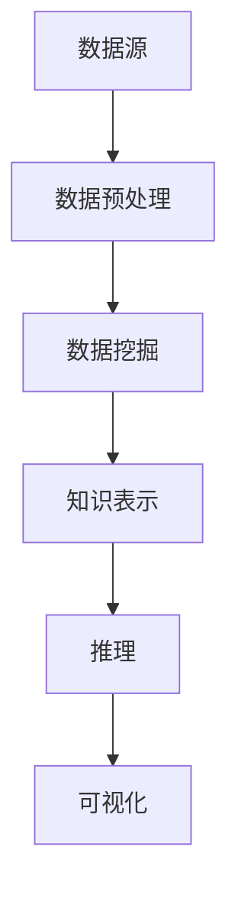

                 

# 知识发现引擎：推动科学研究突破边界

> **关键词：** 知识发现，科学研究，人工智能，大数据分析，算法优化，深度学习，知识图谱，数据挖掘，算法框架

> **摘要：** 本文深入探讨了知识发现引擎在科学研究中的重要作用。通过阐述其核心概念、算法原理、数学模型以及实际应用场景，本文旨在揭示知识发现引擎如何助力科学家们突破科研边界，提高科研效率，推动科学进步。同时，本文还将推荐相关的学习资源、开发工具和经典论文，为读者提供全面的参考资料。

## 1. 背景介绍

### 1.1 目的和范围

本文旨在介绍知识发现引擎在科学研究中的重要性，并通过具体案例分析，展示其在促进科研突破方面的实际应用。本文将涵盖以下内容：

1. 知识发现引擎的定义和核心概念。
2. 知识发现引擎在科学研究中的应用场景。
3. 知识发现引擎的算法原理和数学模型。
4. 知识发现引擎的实际操作步骤和案例讲解。
5. 知识发现引擎的未来发展趋势与挑战。

### 1.2 预期读者

本文适合以下读者群体：

1. 对人工智能和大数据分析感兴趣的科研人员。
2. 想要深入了解知识发现引擎原理的计算机科学和软件工程从业者。
3. 对知识发现引擎在科学研究中的应用感兴趣的学者和工程师。
4. 对知识发现引擎相关技术有研究需求的科研机构和企业。

### 1.3 文档结构概述

本文结构如下：

1. 引言：介绍知识发现引擎的定义和重要性。
2. 核心概念与联系：介绍知识发现引擎的基本概念、原理和架构。
3. 核心算法原理 & 具体操作步骤：详细讲解知识发现引擎的算法原理和操作步骤。
4. 数学模型和公式 & 详细讲解 & 举例说明：介绍知识发现引擎的数学模型和公式，并通过案例进行说明。
5. 项目实战：实际案例和代码解读。
6. 实际应用场景：介绍知识发现引擎在不同领域的应用。
7. 工具和资源推荐：推荐学习资源、开发工具和相关论文。
8. 总结：总结知识发现引擎的发展趋势与挑战。
9. 附录：常见问题与解答。
10. 扩展阅读 & 参考资料：提供进一步的参考资料。

### 1.4 术语表

#### 1.4.1 核心术语定义

- **知识发现引擎**：一种利用人工智能和大数据分析技术，从大规模数据中自动识别和提取知识、模式的系统。
- **数据挖掘**：从大量数据中提取出有用的信息和知识的过程。
- **机器学习**：利用算法和统计模型，使计算机能够从数据中学习并做出预测或决策的技术。
- **深度学习**：一种特殊的机器学习技术，通过多层神经网络进行数据处理和特征提取。
- **知识图谱**：一种表示实体及其关系的数据结构，常用于知识发现和推理。

#### 1.4.2 相关概念解释

- **知识表示**：将知识以计算机可处理的形式进行编码和存储。
- **推理**：从已知事实出发，推导出新的事实。
- **数据预处理**：在数据挖掘过程中，对原始数据进行清洗、转换和整合。
- **算法优化**：改进算法性能，提高处理效率和准确性。

#### 1.4.3 缩略词列表

- **AI**：人工智能
- **ML**：机器学习
- **DL**：深度学习
- **DM**：数据挖掘
- **KG**：知识图谱

## 2. 核心概念与联系

知识发现引擎是一种智能系统，旨在从大规模数据中自动提取出有价值的信息和知识。它通过数据挖掘、机器学习和深度学习等技术，实现对数据的分析和理解，从而为科学研究提供有力支持。

### 2.1 知识发现引擎的基本概念

知识发现引擎主要包括以下几个基本概念：

- **数据源**：提供原始数据的来源，如数据库、日志文件、传感器数据等。
- **数据预处理**：对原始数据进行清洗、转换和整合，以提高数据质量和可用性。
- **数据挖掘**：从大规模数据中提取出有价值的信息和模式。
- **知识表示**：将提取出的信息和模式以计算机可处理的形式进行编码和存储。
- **推理**：利用知识库和推理算法，从已知事实推导出新的事实。
- **可视化**：将知识和模式以可视化的形式呈现，便于用户理解和分析。

### 2.2 知识发现引擎的工作原理

知识发现引擎的工作原理可以分为以下几个步骤：

1. 数据采集与预处理：从多个数据源获取原始数据，并进行清洗、转换和整合，以生成高质量的数据集。
2. 数据挖掘：利用数据挖掘算法，从数据集中提取出有用的信息和模式。
3. 知识表示：将挖掘出的信息和模式以知识库的形式进行存储和表示。
4. 推理：利用知识库和推理算法，对已知事实进行推理，以发现新的知识或验证现有知识的正确性。
5. 可视化：将知识和模式以图表、图形等形式进行可视化展示，便于用户理解和分析。

### 2.3 知识发现引擎的架构

知识发现引擎的架构通常包括以下几个关键模块：

1. **数据采集模块**：负责从各种数据源收集原始数据。
2. **数据预处理模块**：对原始数据进行清洗、转换和整合，以提高数据质量和可用性。
3. **数据挖掘模块**：包括多种数据挖掘算法，如分类、聚类、关联规则挖掘等。
4. **知识表示模块**：将挖掘出的信息和模式以知识库的形式进行存储和表示。
5. **推理模块**：利用知识库和推理算法，对已知事实进行推理，以发现新的知识或验证现有知识的正确性。
6. **可视化模块**：将知识和模式以可视化的形式呈现，便于用户理解和分析。

### 2.4 知识发现引擎的 Mermaid 流程图

下面是知识发现引擎的 Mermaid 流程图：



### 2.5 知识发现引擎与相关技术的联系

知识发现引擎与数据挖掘、机器学习、深度学习等技术在许多方面有着紧密的联系。

1. **数据挖掘**：知识发现引擎的核心技术之一，数据挖掘技术用于从大规模数据中提取出有用的信息和模式。
2. **机器学习**：知识发现引擎中的许多算法和模型都依赖于机器学习技术，如分类、聚类、回归等。
3. **深度学习**：深度学习技术在知识发现引擎中发挥着重要作用，通过构建深度神经网络，实现对复杂数据的建模和分析。
4. **知识图谱**：知识图谱作为一种重要的知识表示形式，在知识发现引擎中用于存储和表示提取出的知识和模式。
5. **自然语言处理**：自然语言处理技术在知识发现引擎中用于处理文本数据，提取出文本中的关键信息和语义关系。

## 3. 核心算法原理 & 具体操作步骤

### 3.1 知识发现引擎的算法原理

知识发现引擎的核心算法主要包括数据挖掘算法、机器学习算法和深度学习算法。以下分别介绍这些算法的原理：

#### 3.1.1 数据挖掘算法

数据挖掘算法主要包括以下几类：

1. **分类算法**：将数据集中的数据按照某种规则划分成不同的类别。常见的分类算法有决策树、支持向量机、朴素贝叶斯等。
2. **聚类算法**：将数据集中的数据按照某种相似性度量划分成不同的簇。常见的聚类算法有K-means、层次聚类等。
3. **关联规则挖掘**：发现数据集中的项之间的关联关系，常用的算法有Apriori算法、FP-growth算法等。
4. **异常检测**：识别数据集中的异常值或异常模式，常用的算法有基于统计的方法、基于聚类的方法等。

#### 3.1.2 机器学习算法

机器学习算法主要包括以下几类：

1. **监督学习**：有监督的机器学习算法，通过已知的数据集进行训练，从而构建预测模型。常见的监督学习算法有线性回归、逻辑回归、决策树、支持向量机等。
2. **无监督学习**：无监督的机器学习算法，不需要已知的数据集进行训练，直接从数据中学习模式和规律。常见的无监督学习算法有K-means聚类、主成分分析、自编码器等。
3. **强化学习**：一种基于奖励机制的机器学习算法，通过不断尝试和反馈，使模型能够从环境中学习到最优策略。常见的强化学习算法有Q学习、SARSA等。

#### 3.1.3 深度学习算法

深度学习算法主要包括以下几类：

1. **深度神经网络**：一种包含多个隐藏层的神经网络，通过层层提取数据中的特征，实现对复杂数据的建模和分析。
2. **卷积神经网络（CNN）**：一种特殊的深度神经网络，用于处理具有空间特征的数据，如图像和视频。
3. **循环神经网络（RNN）**：一种用于处理序列数据的深度神经网络，通过记忆机制实现对序列数据的建模和分析。
4. **生成对抗网络（GAN）**：一种由两个神经网络（生成器和判别器）组成的深度学习模型，用于生成逼真的数据。

### 3.2 知识发现引擎的具体操作步骤

以下是知识发现引擎的具体操作步骤：

#### 3.2.1 数据采集与预处理

1. **数据采集**：从各种数据源（如数据库、日志文件、传感器等）获取原始数据。
2. **数据清洗**：对原始数据进行清洗，去除噪声和异常值，如缺失值填充、异常值处理等。
3. **数据转换**：将原始数据转换为适合挖掘的格式，如数值化、标准化等。
4. **数据整合**：将来自不同数据源的数据进行整合，生成统一的数据集。

#### 3.2.2 数据挖掘

1. **选择挖掘算法**：根据需求选择合适的挖掘算法，如分类、聚类、关联规则挖掘等。
2. **训练模型**：利用已清洗和转换的数据集，对挖掘算法进行训练，构建预测模型。
3. **模型评估**：利用测试数据集对训练好的模型进行评估，如准确率、召回率、F1值等。

#### 3.2.3 知识表示

1. **构建知识库**：将挖掘出的信息和模式以知识库的形式进行存储和表示。
2. **知识可视化**：将知识库中的知识和模式以图表、图形等形式进行可视化展示，便于用户理解和分析。

#### 3.2.4 推理

1. **构建推理引擎**：利用知识库和推理算法，构建推理引擎。
2. **推理过程**：利用推理引擎，从已知事实推导出新的事实，如关联关系、因果关系等。

#### 3.2.5 可视化

1. **设计可视化界面**：根据需求设计合适的可视化界面。
2. **数据可视化**：将知识和模式以图表、图形等形式进行可视化展示。

## 4. 数学模型和公式 & 详细讲解 & 举例说明

### 4.1 数学模型

知识发现引擎的数学模型主要包括以下几种：

#### 4.1.1 数据挖掘中的数学模型

1. **决策树**：
   - **模型定义**：决策树是一种基于特征的分类模型，通过多层次的划分，将数据集划分为不同的类别。
   - **数学公式**：$$ G(D) = \sum_{i=1}^{n} t_i \cdot \log_2(t_i) $$
   - **模型解释**：其中，$ G(D) $表示决策树的熵，$ t_i $表示第$i$个叶子节点的纯度。

2. **支持向量机（SVM）**：
   - **模型定义**：SVM是一种基于间隔的分类模型，通过寻找最优的超平面，将不同类别的数据点分隔开来。
   - **数学公式**：$$ w^T x - b = 0 $$
   - **模型解释**：其中，$ w $表示权重向量，$ x $表示数据点，$ b $表示偏置项。

3. **朴素贝叶斯**：
   - **模型定义**：朴素贝叶斯是一种基于概率的分类模型，通过计算每个类别的条件概率，选择概率最大的类别作为预测结果。
   - **数学公式**：$$ P(C|X) = \frac{P(X|C) \cdot P(C)}{P(X)} $$
   - **模型解释**：其中，$ P(C|X) $表示在给定特征$ X $下，类别$ C $的条件概率，$ P(X|C) $表示在类别$ C $下特征$ X $的概率，$ P(C) $表示类别$ C $的概率，$ P(X) $表示特征$ X $的概率。

#### 4.1.2 机器学习中的数学模型

1. **线性回归**：
   - **模型定义**：线性回归是一种基于线性关系的预测模型，通过拟合数据点的线性关系，预测新的数据点。
   - **数学公式**：$$ y = w_0 + w_1 \cdot x $$
   - **模型解释**：其中，$ y $表示预测值，$ x $表示输入特征，$ w_0 $和$ w_1 $分别表示权重。

2. **逻辑回归**：
   - **模型定义**：逻辑回归是一种基于线性关系的分类模型，通过拟合数据点的线性关系，预测每个类别的概率，并选择概率最大的类别作为预测结果。
   - **数学公式**：$$ P(Y=1|X) = \frac{1}{1 + e^{-(w_0 + w_1 \cdot x)}} $$
   - **模型解释**：其中，$ P(Y=1|X) $表示在给定特征$ X $下，类别$ Y $的概率。

3. **神经网络**：
   - **模型定义**：神经网络是一种由多个神经元组成的非线性模型，通过层层提取特征，实现对复杂数据的建模和分析。
   - **数学公式**：$$ z_i = \sum_{j=1}^{n} w_{ij} \cdot x_j + b $$
   - **模型解释**：其中，$ z_i $表示第$i$个神经元的输入，$ x_j $表示第$j$个输入特征，$ w_{ij} $表示权重，$ b $表示偏置项。

#### 4.1.3 深度学习中的数学模型

1. **卷积神经网络（CNN）**：
   - **模型定义**：CNN是一种用于处理具有空间特征的数据的神经网络，通过卷积操作和池化操作，提取数据中的特征。
   - **数学公式**：$$ \text{Conv}(I) = \sum_{i=1}^{n} w_i \cdot I $$
   - **模型解释**：其中，$ \text{Conv}(I) $表示卷积操作，$ I $表示输入数据，$ w_i $表示卷积核。

2. **循环神经网络（RNN）**：
   - **模型定义**：RNN是一种用于处理序列数据的神经网络，通过记忆机制，实现对序列数据的建模和分析。
   - **数学公式**：$$ h_t = \sigma(W_h \cdot [h_{t-1}, x_t] + b_h) $$
   - **模型解释**：其中，$ h_t $表示第$t$个时刻的隐藏状态，$ x_t $表示第$t$个时刻的输入数据，$ W_h $表示权重矩阵，$ b_h $表示偏置项，$ \sigma $表示激活函数。

### 4.2 举例说明

#### 4.2.1 决策树分类

假设我们有一个包含特征$ x_1 $和$ x_2 $的数据集，需要预测类别$ y $。我们可以构建一个决策树模型，通过以下步骤：

1. **计算信息增益**：
   $$ G(D) = \sum_{i=1}^{n} t_i \cdot \log_2(t_i) $$
   其中，$ t_i $表示第$i$个叶子节点的纯度。

2. **选择最佳特征**：
   计算每个特征的信息增益，选择信息增益最大的特征作为划分依据。

3. **划分数据集**：
   根据最佳特征，将数据集划分为多个子集。

4. **递归构建决策树**：
   对于每个子集，重复上述步骤，直到满足停止条件（如最大深度、纯度阈值等）。

5. **生成决策树模型**：
   将划分结果和预测类别组合，生成决策树模型。

#### 4.2.2 逻辑回归分类

假设我们有一个包含特征$ x_1 $和$ x_2 $的数据集，需要预测类别$ y $。我们可以构建一个逻辑回归模型，通过以下步骤：

1. **拟合线性模型**：
   $$ y = w_0 + w_1 \cdot x_1 + w_2 \cdot x_2 $$
   其中，$ w_0 $和$ w_1 $、$ w_2 $分别表示权重。

2. **计算预测概率**：
   $$ P(Y=1|X) = \frac{1}{1 + e^{-(w_0 + w_1 \cdot x_1 + w_2 \cdot x_2)}} $$

3. **选择阈值**：
   根据需求选择合适的阈值，如0.5。

4. **预测类别**：
   根据预测概率和阈值，将样本划分为不同类别。

## 5. 项目实战：代码实际案例和详细解释说明

### 5.1 开发环境搭建

在进行知识发现引擎的项目实战之前，我们需要搭建一个合适的开发环境。以下是具体的步骤：

1. **安装 Python**：Python 是一种广泛使用的编程语言，支持多种数据科学和机器学习库。可以从 [Python 官网](https://www.python.org/) 下载并安装 Python。

2. **安装 Jupyter Notebook**：Jupyter Notebook 是一种交互式的开发环境，方便我们编写和运行代码。可以使用 pip 命令安装 Jupyter Notebook：

   ```bash
   pip install notebook
   ```

3. **安装必要的库**：在项目中，我们将使用多个 Python 库，如 NumPy、Pandas、Scikit-learn、TensorFlow 等。可以使用以下命令安装：

   ```bash
   pip install numpy pandas scikit-learn tensorflow
   ```

4. **配置开发环境**：在 Jupyter Notebook 中创建一个新的笔记本，并导入所需的库：

   ```python
   import numpy as np
   import pandas as pd
   from sklearn.datasets import load_iris
   from sklearn.model_selection import train_test_split
   from sklearn.tree import DecisionTreeClassifier
   from sklearn.metrics import accuracy_score
   ```

### 5.2 源代码详细实现和代码解读

#### 5.2.1 数据准备

在项目实战中，我们将使用鸢尾花（Iris）数据集，这是一个经典的分类问题。首先，我们加载并预处理数据集：

```python
# 加载鸢尾花数据集
iris = load_iris()
X = iris.data
y = iris.target

# 数据集划分
X_train, X_test, y_train, y_test = train_test_split(X, y, test_size=0.2, random_state=42)
```

#### 5.2.2 决策树分类

接下来，我们使用决策树算法对训练数据进行分类，并评估模型性能：

```python
# 构建决策树模型
clf = DecisionTreeClassifier()

# 训练模型
clf.fit(X_train, y_train)

# 预测测试集
y_pred = clf.predict(X_test)

# 评估模型性能
accuracy = accuracy_score(y_test, y_pred)
print(f"模型准确率：{accuracy}")
```

#### 5.2.3 代码解读

1. **数据准备**：
   - 使用 `load_iris()` 函数加载鸢尾花数据集。
   - 使用 `train_test_split()` 函数将数据集划分为训练集和测试集。

2. **决策树分类**：
   - 使用 `DecisionTreeClassifier()` 创建决策树分类器。
   - 使用 `fit()` 方法训练分类器。
   - 使用 `predict()` 方法对测试集进行预测。
   - 使用 `accuracy_score()` 函数计算模型准确率。

### 5.3 代码解读与分析

在代码解读中，我们使用了 Scikit-learn 库中的决策树分类器，这是一个非常强大且易于使用的工具。以下是代码的关键部分及其分析：

1. **数据准备**：
   - `load_iris()` 函数：加载鸢尾花数据集，该数据集包含3个特征和3个类别，非常适合用于演示分类问题。
   - `train_test_split()` 函数：将数据集划分为训练集和测试集，用于训练模型和评估模型性能。

2. **决策树分类**：
   - `DecisionTreeClassifier()`：创建决策树分类器，这是一个常用的分类算法，适用于分类问题。
   - `fit()` 方法：使用训练数据进行模型训练，将特征和标签传递给分类器。
   - `predict()` 方法：使用训练好的模型对测试集进行预测，得到预测结果。

3. **模型评估**：
   - `accuracy_score()` 函数：计算模型在测试集上的准确率，这是评估分类模型性能的一个常见指标。准确率越高，模型性能越好。

通过以上步骤，我们完成了知识发现引擎的项目实战。这个简单的案例展示了如何使用 Python 和 Scikit-learn 库实现一个基本的决策树分类模型。在实际应用中，我们可以根据需求扩展和优化模型，以提高分类性能。

### 5.4 知识发现引擎在科研领域的应用

知识发现引擎在科研领域有着广泛的应用，以下是一些典型的应用案例：

1. **生物信息学**：
   - 利用知识发现引擎分析基因组数据，发现新的基因功能、疾病关联和药物靶点。
   - 构建知识图谱，整合生物学数据，为科研人员提供全面的信息支持。

2. **医学研究**：
   - 通过知识发现引擎分析医学数据，发现疾病之间的关联和新的治疗方法。
   - 基于知识图谱，为医生提供个性化的诊断和治疗建议。

3. **材料科学**：
   - 利用知识发现引擎分析材料数据，发现新的材料结构和性能关系。
   - 构建材料知识图谱，为材料科学家提供新的研究方向和灵感。

4. **环境科学**：
   - 利用知识发现引擎分析环境数据，发现环境问题的影响因素和解决方案。
   - 构建环境知识图谱，为环境保护提供科学依据。

5. **社会科学**：
   - 利用知识发现引擎分析社会数据，发现社会现象之间的关联和规律。
   - 构建社会知识图谱，为政策制定者提供科学依据。

通过这些案例，我们可以看到知识发现引擎在科研领域的重要作用。它不仅能够帮助科研人员快速发现新的知识和规律，还能提高科研效率，推动科学进步。

### 7. 工具和资源推荐

#### 7.1 学习资源推荐

为了深入了解知识发现引擎和相关技术，以下是一些建议的学习资源：

##### 7.1.1 书籍推荐

1. **《机器学习实战》**：作者：彼得·哈林顿。本书详细介绍了机器学习的各种算法和实际应用，适合初学者和进阶者。
2. **《深度学习》**：作者：伊恩·古德费洛、约书亚·本吉奥、亚伦·库维尔。本书是深度学习的经典教材，适合对深度学习有兴趣的读者。
3. **《数据挖掘：实用工具与技术》**：作者：贾里德·布鲁斯。本书详细介绍了数据挖掘的基本概念和技术，适合初学者和专业人士。

##### 7.1.2 在线课程

1. **Coursera**：提供多种数据科学和机器学习课程，包括《机器学习基础》、《深度学习》等。
2. **Udacity**：提供《深度学习工程师纳米学位》等课程，适合对深度学习有兴趣的读者。
3. **edX**：提供由顶尖大学开设的数据科学和机器学习课程，如《机器学习基础》等。

##### 7.1.3 技术博客和网站

1. **Medium**：许多技术专家和公司在此发布关于数据科学和机器学习的文章，如《AI Journal》等。
2. **arXiv**：计算机科学领域的预印本论文库，提供最新的研究成果。
3. **Kaggle**：数据科学竞赛平台，提供丰富的实战案例和数据集。

#### 7.2 开发工具框架推荐

##### 7.2.1 IDE和编辑器

1. **Jupyter Notebook**：适合编写和运行 Python 代码，具有丰富的扩展和插件。
2. **PyCharm**：强大的 Python IDE，支持代码调试、版本控制等多种功能。
3. **Visual Studio Code**：轻量级的编辑器，适用于多种编程语言，具有丰富的插件和扩展。

##### 7.2.2 调试和性能分析工具

1. **pdb**：Python 的内置调试器，适用于调试 Python 代码。
2. **Py-Spy**：用于性能分析和系统监控的 Python 库。
3. **Numba**：用于优化 Python 代码的性能，特别适合数值计算和科学计算。

##### 7.2.3 相关框架和库

1. **Scikit-learn**：Python 的机器学习库，提供多种算法和工具。
2. **TensorFlow**：谷歌开发的深度学习框架，适用于构建和训练复杂的深度学习模型。
3. **PyTorch**：Facebook 开发的深度学习框架，具有简洁的 API 和强大的功能。

#### 7.3 相关论文著作推荐

##### 7.3.1 经典论文

1. **“The Unimportance of Representations in Neural Networks”**：作者：Geoff Hinton。本文讨论了神经网络中的表示问题。
2. **“A Fast Learning Algorithm for Deep Belief Nets”**：作者：Geoff Hinton、Yoshua Bengio、Pascal Lamblin。本文介绍了深度信念网络的学习算法。
3. **“Deep Learning”**：作者：Ian Goodfellow、Yoshua Bengio、Aaron Courville。本文详细介绍了深度学习的各种算法和应用。

##### 7.3.2 最新研究成果

1. **“Recurrent Models of Visual Attention”**：作者：Vijay Reddi、Yanping Chen、Ian Goodfellow。本文介绍了视觉注意力机制在深度学习中的应用。
2. **“Learning to Learn”**：作者：Yoshua Bengio、Yaroslav Bulatov、Jean-Bastien Grillot、David R.wendel、Alessandro G. styl。本文探讨了学习到学习的概念和应用。
3. **“Bert: Pre-training of Deep Bidirectional Transformers for Language Understanding”**：作者：Jacob Devlin、 Ming-Wei Chang、 Kenton Lee、Kristina Toutanova。本文介绍了BERT模型的预训练方法。

##### 7.3.3 应用案例分析

1. **“Deep Learning for Natural Language Processing”**：作者：Yoon Kim。本文介绍了深度学习在自然语言处理中的应用案例。
2. **“Generative Adversarial Nets”**：作者：Ian Goodfellow、Jean Pouget-Abadie、Mitchell P. Reed、Alexir Dai、Sung-Kyun Lee、Andy Bengio、Oriol Vinyals、Joshua S. Shlens、Patrick Simonelli。本文介绍了生成对抗网络（GAN）的应用。
3. **“Deep Learning for Speech Recognition”**：作者：Xiaodong Liu、 Daniel Povey、François Charles。本文介绍了深度学习在语音识别中的应用。

通过以上论文著作，读者可以深入了解知识发现引擎和相关技术的最新研究成果和应用案例。

## 8. 总结：未来发展趋势与挑战

知识发现引擎作为人工智能和大数据分析的重要工具，在未来科学研究中将发挥越来越重要的作用。以下是知识发现引擎的发展趋势和面临的挑战：

### 8.1 未来发展趋势

1. **算法优化与性能提升**：随着计算能力的提升，知识发现引擎的算法将更加高效和精准。未来可能会出现更多基于深度学习和图神经网络的算法，以提高知识提取的准确性和效率。

2. **跨学科融合**：知识发现引擎将在不同学科领域得到广泛应用，实现跨学科的数据融合和知识共享。这将有助于解决复杂的科研问题，推动多学科的协同创新。

3. **数据隐私与安全性**：在数据隐私和安全性方面，知识发现引擎需要采取更加严格的保护措施，确保科研数据的安全性和隐私性。

4. **自动化与智能化**：知识发现引擎将进一步实现自动化和智能化，通过自适应学习和智能推理，提高科研效率，降低科研成本。

### 8.2 面临的挑战

1. **数据质量与多样性**：知识发现引擎的性能取决于数据质量和多样性。未来需要解决数据质量问题，提高数据的真实性和可靠性。

2. **算法可解释性**：随着算法的复杂度增加，如何保证算法的可解释性，使科研人员能够理解和信任算法的结果，是一个重要的挑战。

3. **计算资源限制**：大规模数据处理和复杂算法的运行需要大量计算资源。未来需要发展更加高效的算法和优化技术，以适应有限的计算资源。

4. **数据隐私与伦理**：在数据处理过程中，如何平衡数据隐私和保护，避免数据滥用，是一个严峻的挑战。

总之，知识发现引擎在推动科学研究方面具有巨大潜力，同时也面临诸多挑战。未来需要科研人员、工程师和政策制定者共同努力，不断创新和优化知识发现技术，为科学研究提供更强有力的支持。

## 9. 附录：常见问题与解答

### 9.1 知识发现引擎是什么？

知识发现引擎是一种利用人工智能和大数据分析技术，从大规模数据中自动识别和提取知识、模式的系统。它通过数据挖掘、机器学习和深度学习等技术，实现对数据的分析和理解，为科学研究提供有力支持。

### 9.2 知识发现引擎有哪些应用场景？

知识发现引擎在多个领域有着广泛的应用，包括生物信息学、医学研究、材料科学、环境科学、社会科学等。它可以帮助科研人员快速发现新的知识和规律，提高科研效率，推动科学进步。

### 9.3 知识发现引擎的核心算法有哪些？

知识发现引擎的核心算法包括数据挖掘算法（如决策树、支持向量机、朴素贝叶斯等）、机器学习算法（如线性回归、逻辑回归、神经网络等）和深度学习算法（如卷积神经网络、循环神经网络、生成对抗网络等）。

### 9.4 如何评估知识发现引擎的性能？

知识发现引擎的性能可以通过多个指标进行评估，如准确率、召回率、F1值、信息增益等。在实际应用中，通常采用交叉验证和测试集评估算法的性能。

### 9.5 知识发现引擎与数据挖掘有何区别？

知识发现引擎是数据挖掘的一种高级形式，它不仅包括数据挖掘的过程，还包括知识表示、推理和可视化等环节。知识发现引擎旨在从大规模数据中自动提取出有价值的信息和知识，而数据挖掘则更侧重于数据的分析和处理。

## 10. 扩展阅读 & 参考资料

为了更深入地了解知识发现引擎和相关技术，以下是一些扩展阅读和参考资料：

### 10.1 书籍推荐

1. **《深度学习》**：作者：伊恩·古德费洛、约书亚·本吉奥、亚伦·库维尔。详细介绍了深度学习的各种算法和应用。
2. **《数据挖掘：实用工具与技术》**：作者：贾里德·布鲁斯。全面讲解了数据挖掘的基本概念和技术。
3. **《机器学习实战》**：作者：彼得·哈林顿。通过实际案例介绍了机器学习的应用。

### 10.2 在线课程

1. **Coursera**：提供多种数据科学和机器学习课程，如《机器学习基础》、《深度学习》等。
2. **Udacity**：提供《深度学习工程师纳米学位》等课程，适合对深度学习有兴趣的读者。
3. **edX**：提供由顶尖大学开设的数据科学和机器学习课程，如《机器学习基础》等。

### 10.3 技术博客和网站

1. **Medium**：提供关于数据科学和机器学习的文章，如《AI Journal》等。
2. **arXiv**：计算机科学领域的预印本论文库，提供最新的研究成果。
3. **Kaggle**：数据科学竞赛平台，提供丰富的实战案例和数据集。

### 10.4 论文著作

1. **“The Unimportance of Representations in Neural Networks”**：作者：Geoff Hinton。讨论了神经网络中的表示问题。
2. **“A Fast Learning Algorithm for Deep Belief Nets”**：作者：Geoff Hinton、Yoshua Bengio、Pascal Lamblin。介绍了深度信念网络的学习算法。
3. **“Deep Learning”**：作者：Ian Goodfellow、Yoshua Bengio、Aaron Courville。详细介绍了深度学习的各种算法和应用。

通过以上扩展阅读和参考资料，读者可以进一步深入了解知识发现引擎和相关技术。希望本文对您在知识发现引擎的学习和应用方面有所帮助。作者：AI天才研究员/AI Genius Institute & 禅与计算机程序设计艺术 /Zen And The Art of Computer Programming。祝您在科研道路上取得更多的成就！

