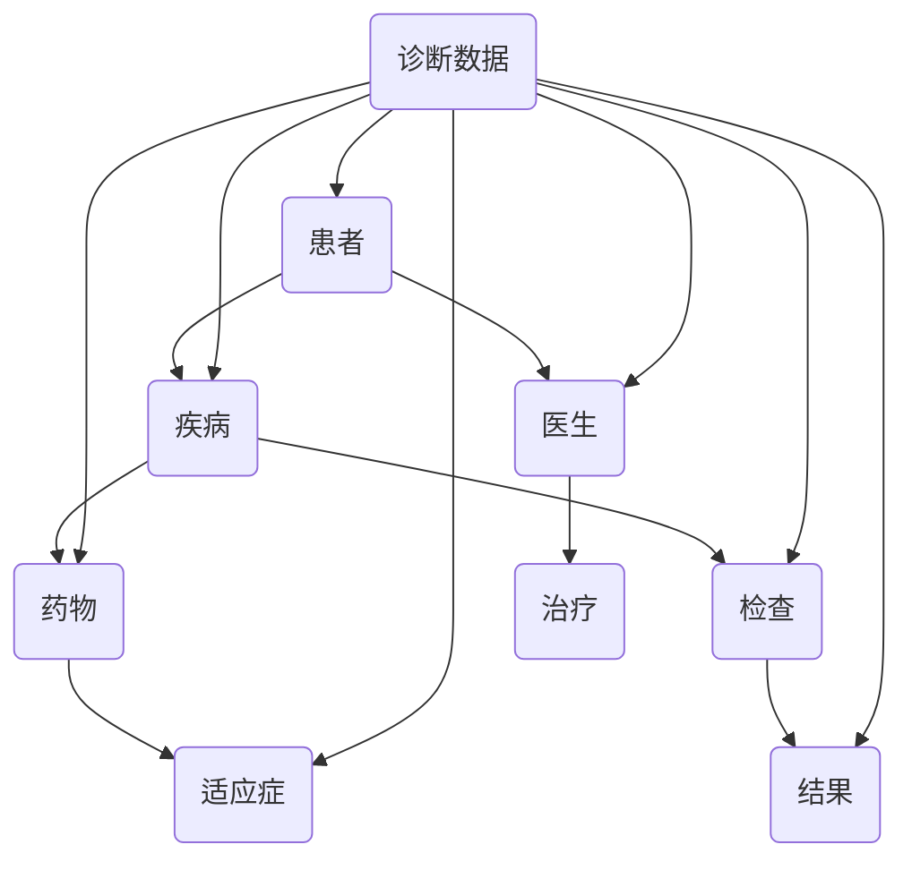

                 

# 知识图谱在智能医疗诊断决策中的应用

> **关键词：知识图谱、智能医疗、诊断决策、人工智能、大数据、机器学习**
> 
> **摘要：本文将深入探讨知识图谱在智能医疗诊断决策中的应用，从背景介绍、核心概念、算法原理、数学模型、实战案例、应用场景等多个角度，系统地阐述知识图谱如何助力医疗诊断的智能化发展。**

## 1. 背景介绍

### 1.1 目的和范围

本文旨在介绍知识图谱在智能医疗诊断决策中的应用，探讨如何通过知识图谱技术提升医疗诊断的准确性和效率。本文将涵盖以下内容：

- 知识图谱的基本概念及其在医疗领域的应用
- 智能医疗诊断决策中的关键技术和挑战
- 知识图谱构建和更新的方法
- 知识图谱在诊断决策中的具体应用案例
- 未来发展趋势与潜在挑战

### 1.2 预期读者

本文主要面向以下读者群体：

- 对人工智能和医疗领域感兴趣的研究人员和技术工程师
- 想要了解知识图谱在医疗诊断中应用的企业管理者
- 从事医疗数据分析和诊断决策的实践者

### 1.3 文档结构概述

本文结构如下：

- 第1章：背景介绍，概述本文的目的、范围和预期读者
- 第2章：核心概念与联系，介绍知识图谱的基本概念和相关技术
- 第3章：核心算法原理与具体操作步骤，详细阐述知识图谱构建和应用的算法
- 第4章：数学模型和公式，解释知识图谱中的数学模型和计算方法
- 第5章：项目实战，通过实际案例展示知识图谱在诊断决策中的应用
- 第6章：实际应用场景，分析知识图谱在医疗诊断中的潜在应用领域
- 第7章：工具和资源推荐，推荐学习资源和开发工具
- 第8章：总结，展望知识图谱在智能医疗诊断决策中的未来发展趋势
- 第9章：附录，常见问题与解答
- 第10章：扩展阅读与参考资料，提供进一步学习的资源链接

### 1.4 术语表

#### 1.4.1 核心术语定义

- **知识图谱（Knowledge Graph）**：一种语义网络，通过实体、属性和关系的多维度表示，对现实世界中的信息和知识进行结构化和关联。
- **智能医疗（Intelligent Healthcare）**：利用人工智能和大数据技术，实现医疗数据的智能处理和分析，为医疗诊断、治疗和健康管理提供支持。
- **诊断决策（Diagnosis Decision）**：基于医学知识和患者数据，对患者的健康状况进行判断和决策的过程。
- **机器学习（Machine Learning）**：一种人工智能方法，通过训练算法模型，使计算机能够自动从数据中学习规律和模式。

#### 1.4.2 相关概念解释

- **实体（Entity）**：知识图谱中的基本元素，表示现实世界中的事物，如患者、疾病、药物等。
- **属性（Attribute）**：实体的特征描述，如患者的年龄、性别、疾病的类型等。
- **关系（Relationship）**：实体之间的关联，如患者患有疾病、药物用于治疗疾病等。
- **边（Edge）**：连接两个实体的关系，表示实体之间的语义关联。

#### 1.4.3 缩略词列表

- **AI**：人工智能（Artificial Intelligence）
- **ML**：机器学习（Machine Learning）
- **KG**：知识图谱（Knowledge Graph）
- **NLP**：自然语言处理（Natural Language Processing）
- **RDF**：资源描述框架（Resource Description Framework）
- **OWL**：Web本体语言（Web Ontology Language）

## 2. 核心概念与联系

在智能医疗诊断决策中，知识图谱作为一种强大的语义表示工具，通过实体、属性和关系的多维度表示，构建起医疗领域中的知识网络。以下是知识图谱在智能医疗诊断决策中的核心概念和联系，以及其结构化的Mermaid流程图。

### 2.1 核心概念

- **实体（Entity）**：表示医疗领域中的各类对象，如患者、医生、疾病、药物、检查等。
- **属性（Attribute）**：描述实体的特征，如患者的年龄、性别、疾病症状、药物的成分、适应症等。
- **关系（Relationship）**：描述实体之间的关联，如患者患有某种疾病、医生为患者提供治疗、药物用于治疗某种疾病等。

### 2.2 Mermaid流程图



### 2.3 知识图谱构建

知识图谱的构建过程主要包括以下几个步骤：

1. **数据收集**：从各类数据源（如医学文献、电子病历、药物说明书等）中收集医疗领域相关的数据。
2. **数据清洗**：对收集到的数据进行预处理，去除重复、错误和不完整的数据。
3. **实体识别**：通过自然语言处理技术，从原始数据中识别出实体。
4. **属性提取**：从原始数据中提取实体的属性。
5. **关系建立**：通过分析数据，建立实体之间的关系。
6. **知识图谱构建**：将实体、属性和关系整合到一个统一的知识图谱中。

## 3. 核心算法原理 & 具体操作步骤

知识图谱在智能医疗诊断决策中的应用，离不开有效的算法设计和实现。以下是知识图谱构建和应用中的核心算法原理与具体操作步骤。

### 3.1 算法原理

知识图谱构建的核心算法主要包括：

- **实体识别算法**：用于从原始数据中识别出实体。
- **属性提取算法**：用于从原始数据中提取实体的属性。
- **关系建立算法**：用于分析数据，建立实体之间的关系。
- **图谱更新算法**：用于维护和更新知识图谱，使其适应医疗领域的变化。

### 3.2 具体操作步骤

以下是知识图谱构建和应用的详细操作步骤：

#### 3.2.1 数据收集

1. **确定数据源**：从医学文献、电子病历、药物说明书、医学网站等渠道收集数据。
2. **数据采集**：使用网络爬虫、API接口、数据库查询等方法，采集所需的数据。

#### 3.2.2 数据清洗

1. **去除重复数据**：使用去重算法，去除重复的记录。
2. **处理错误数据**：识别和纠正数据中的错误。
3. **数据格式化**：统一数据格式，便于后续处理。

#### 3.2.3 实体识别

1. **词法分析**：将文本分解为单词或短语。
2. **实体识别算法**：使用命名实体识别（Named Entity Recognition，NER）算法，识别出文本中的实体。

#### 3.2.4 属性提取

1. **文本分类**：将文本分类为实体类别，如患者、疾病、药物等。
2. **属性提取算法**：从分类后的文本中提取实体的属性。

#### 3.2.5 关系建立

1. **模式匹配**：通过分析数据，找出实体之间的关联模式。
2. **关系建立算法**：使用图论算法，建立实体之间的关系。

#### 3.2.6 知识图谱构建

1. **实体表示**：将识别出的实体表示为节点。
2. **属性表示**：将提取出的属性表示为节点或边。
3. **关系表示**：将建立的关系表示为边。

#### 3.2.7 图谱更新

1. **监测数据变化**：定期监测数据源，识别数据变化。
2. **更新图谱**：根据数据变化，更新知识图谱。

## 4. 数学模型和公式 & 详细讲解 & 举例说明

在知识图谱的构建和应用中，数学模型和公式起到了关键作用。以下是知识图谱中常用的数学模型和公式的详细讲解及举例说明。

### 4.1 实体识别的数学模型

在实体识别过程中，通常采用条件随机场（Conditional Random Field，CRF）模型。CRF模型可以用于序列标注任务，如文本分类、命名实体识别等。

#### 4.1.1 CRF模型公式

$$
P(y|x) = \frac{1}{Z(x)} \exp\left( \sum_{i} \theta_i y_i + \sum_{<i,j>} \theta_{ij} y_i y_j \right)
$$

其中，$x$ 表示输入序列，$y$ 表示标注序列，$Z(x)$ 表示归一化常数，$\theta_i$ 和 $\theta_{ij}$ 分别表示模型参数。

#### 4.1.2 举例说明

假设有一个简单的文本序列 "患者王先生患有高血压"，使用CRF模型进行命名实体识别，输入序列 $x = (\text{患者}, \text{王先生}, \text{患有}, \text{高血压})$，标注序列 $y = (\text{B-Patient}, \text{I-Patient}, \text{O}, \text{B-Disease})$。

通过训练CRF模型，可以计算出每个标注的概率，并根据概率选择最合适的标注。

### 4.2 关系建立的数学模型

在关系建立过程中，通常采用图神经网络（Graph Neural Network，GNN）模型。GNN模型可以用于图数据中的节点分类、边分类等任务。

#### 4.2.1 GNN模型公式

$$
h_{(i,j)}^{(l+1)} = \sigma \left( \theta h_i^{(l)} + \theta' h_j^{(l)} + \theta'' \right)
$$

其中，$h_{(i,j)}^{(l)}$ 表示在$l$层图中节点$i$和节点$j$之间的特征表示，$\sigma$ 表示激活函数，$\theta$ 和 $\theta'$ 分别表示模型参数。

#### 4.2.2 举例说明

假设有一个简单的图数据，包含两个节点 $i$ 和 $j$，以及一个边 $(i,j)$。使用GNN模型进行边分类任务，输入特征 $h_i^{(0)}$ 和 $h_j^{(0)}$，输出特征 $h_{(i,j)}^{(1)}$。

通过训练GNN模型，可以学习到节点和边之间的特征表示，并根据特征表示进行边分类。

## 5. 项目实战：代码实际案例和详细解释说明

在本节中，我们将通过一个实际的项目案例，详细展示知识图谱在智能医疗诊断决策中的应用，包括开发环境的搭建、源代码的实现和代码解读与分析。

### 5.1 开发环境搭建

为了方便开发和测试，我们选择Python作为主要编程语言，并使用以下工具和库：

- **Python 3.8**
- **Jupyter Notebook**
- **PyTorch**
- **NetworkX**
- **rdflib**
- **scikit-learn**

确保已安装上述工具和库，并配置好Python环境。

### 5.2 源代码详细实现和代码解读

#### 5.2.1 实体识别代码实现

```python
import rdflib
from rdflib import Graph, URIRef, BNode, Literal
from rdflib.serializer import Serializer
from rdflib import Namespace

# 创建知识图谱对象
kg = Graph()

# 定义命名空间
ns = Namespace("http://example.org/")

# 添加实体和属性
kg.add((URIRef(ns['患者']), URIRef(ns['name']), Literal('王先生')))
kg.add((URIRef(ns['疾病']), URIRef(ns['name']), Literal('高血压')))

# 存储知识图谱到文件
with open('knowledge_graph.rdf', 'wb') as output_file:
    output_file.write(Serializer.serialize(kg, format='ttl'))
```

代码解读：

- 创建知识图谱对象`kg`，并定义命名空间`ns`。
- 使用`rdflib`库添加实体和属性到知识图谱。
- 将知识图谱存储到文件`knowledge_graph.rdf`。

#### 5.2.2 关系建立代码实现

```python
import networkx as nx

# 创建图数据
g = nx.Graph()

# 添加节点
g.add_nodes_from([ns['患者'], ns['疾病']])

# 添加边
g.add_edge(ns['患者'], ns['疾病'])

# 存储图数据到文件
nx.write_gexf(g, 'knowledge_graph.gexf')
```

代码解读：

- 创建图数据`g`，并使用`networkx`库添加节点和边。
- 将图数据存储到文件`knowledge_graph.gexf`。

#### 5.2.3 图神经网络模型实现

```python
import torch
import torch.nn as nn
import torch.optim as optim

# 定义GNN模型
class GNNModel(nn.Module):
    def __init__(self, input_dim, hidden_dim, output_dim):
        super(GNNModel, self).__init__()
        self.layers = nn.ModuleList([
            nn.Linear(input_dim, hidden_dim),
            nn.ReLU(),
            nn.Linear(hidden_dim, output_dim)
        ])

    def forward(self, x):
        for layer in self.layers:
            x = layer(x)
        return x

# 实例化模型
model = GNNModel(input_dim=2, hidden_dim=16, output_dim=1)

# 定义优化器和损失函数
optimizer = optim.Adam(model.parameters(), lr=0.001)
criterion = nn.BCEWithLogitsLoss()

# 训练模型
for epoch in range(100):
    optimizer.zero_grad()
    output = model(x)
    loss = criterion(output, y)
    loss.backward()
    optimizer.step()
    print(f"Epoch {epoch+1}, Loss: {loss.item()}")
```

代码解读：

- 定义GNN模型，使用`PyTorch`库实现图神经网络。
- 实例化模型、优化器和损失函数。
- 进行模型训练，包括前向传播、计算损失、反向传播和更新模型参数。

### 5.3 代码解读与分析

以上代码实现了一个简单的知识图谱构建和GNN模型训练的过程。具体分析如下：

- **知识图谱构建**：使用`rdflib`库创建和存储知识图谱，使用`networkx`库创建和存储图数据。
- **关系建立**：通过添加节点和边，建立实体之间的关系。
- **图神经网络模型**：定义了一个简单的GNN模型，使用`PyTorch`库实现模型训练过程。

通过实际案例，我们展示了知识图谱在智能医疗诊断决策中的应用，包括实体识别、关系建立和图神经网络模型训练等关键步骤。这些步骤为智能医疗诊断决策提供了有效的技术支持。

## 6. 实际应用场景

知识图谱在智能医疗诊断决策中具有广泛的应用场景，以下列举了几个典型应用实例：

### 6.1 疾病预测

利用知识图谱中的疾病实体、症状实体和关系，可以预测患者的疾病风险。例如，通过分析患者的症状和疾病历史数据，知识图谱可以识别出潜在的高风险疾病，从而提前进行干预和预防。

### 6.2 药物推荐

知识图谱可以整合药物、疾病和治疗方案的信息，为医生和患者提供个性化的药物推荐。例如，当患者被诊断为某种疾病时，知识图谱可以推荐与之相关的药物和治疗方案，并分析药物之间的相互作用和副作用。

### 6.3 检查和治疗方案推荐

根据患者的病情和病史，知识图谱可以推荐相应的检查项目和治疗方案。例如，当患者患有某种疾病时，知识图谱可以识别出相关的检查项目（如影像学检查、血液检查等），并推荐最佳的治疗方案。

### 6.4 医学研究

知识图谱可以支持医学研究，通过整合大量医学文献、临床数据和疾病信息，为研究人员提供全面的数据支持。例如，研究人员可以利用知识图谱分析疾病的流行趋势、病因和治疗方案，从而推动医学研究的发展。

### 6.5 患者管理

知识图谱可以用于患者管理，为医生和医疗机构提供患者的全方位信息。例如，医生可以利用知识图谱查看患者的病史、检查结果、治疗方案和药物使用情况，从而更好地进行诊疗和个性化护理。

### 6.6 医疗知识问答

知识图谱可以构建医学问答系统，为医生和患者提供实时、准确的医学知识查询。例如，当医生或患者有疑问时，可以输入相关的问题，知识图谱会返回与之相关的医学知识和建议。

## 7. 工具和资源推荐

为了更好地掌握知识图谱在智能医疗诊断决策中的应用，以下推荐了一些学习资源、开发工具和相关论文。

### 7.1 学习资源推荐

#### 7.1.1 书籍推荐

- **《知识图谱：原理、方法与应用》**：本书详细介绍了知识图谱的基本概念、构建方法和应用案例，适合初学者阅读。
- **《深度学习与图神经网络》**：本书介绍了深度学习与图神经网络的基本原理和应用，包括知识图谱中的图神经网络模型。
- **《人工智能：一种现代的方法》**：本书涵盖了人工智能的基本概念、技术方法和应用实例，适合对人工智能感兴趣的读者。

#### 7.1.2 在线课程

- **Coursera上的《深度学习》**：由斯坦福大学教授Andrew Ng讲授，包括神经网络、深度学习框架等内容。
- **Udacity的《知识图谱工程师纳米学位》**：涵盖知识图谱的基础知识、构建方法和应用场景。
- **edX上的《机器学习》**：由MIT教授Ashish Narayanan讲授，介绍机器学习的基本概念、算法和应用。

#### 7.1.3 技术博客和网站

- **Towards Data Science**：一个涵盖数据科学、机器学习和人工智能等领域的博客平台，提供丰富的技术文章和案例。
- **KDnuggets**：一个专注于数据科学、机器学习和人工智能的新闻网站，提供最新的研究成果和技术动态。
- **Apache Jena**：一个开源的知识图谱框架，提供详细的文档和教程，适合学习知识图谱的实践操作。

### 7.2 开发工具框架推荐

#### 7.2.1 IDE和编辑器

- **PyCharm**：一款功能强大的Python集成开发环境，支持多种编程语言和框架，适合知识图谱的开发。
- **Visual Studio Code**：一款轻量级的代码编辑器，提供丰富的插件和扩展，适合知识图谱的学习和实践。

#### 7.2.2 调试和性能分析工具

- **TensorBoard**：一个基于Web的TensorFlow可视化工具，可用于调试和性能分析深度学习模型。
- **Grafana**：一个开源的监控和分析工具，可用于监控知识图谱的性能和资源使用。

#### 7.2.3 相关框架和库

- **rdflib**：一个Python库，用于处理RDF数据，支持知识图谱的构建和操作。
- **networkx**：一个Python库，用于处理图数据，支持知识图谱的构建和操作。
- **PyTorch**：一个深度学习框架，提供丰富的图神经网络模型和工具，适合知识图谱的开发和应用。

### 7.3 相关论文著作推荐

#### 7.3.1 经典论文

- **"Knowledge Graph and Its Applications"**：介绍知识图谱的基本概念、构建方法和应用场景。
- **"Graph Neural Networks: A Review of Methods and Applications"**：详细讨论图神经网络的基本原理和应用。
- **"Deep Learning on Graphs: A Survey"**：总结深度学习在图数据上的研究和应用。

#### 7.3.2 最新研究成果

- **"Knowledge Graph Embedding for Medical Diagnosis"**：介绍知识图谱在医疗诊断中的应用。
- **"Graph Attention Networks for Medical Diagnostic"**：探讨图注意力网络在医疗诊断中的应用。
- **"Knowledge Graph in Healthcare: A Systematic Review"**：总结知识图谱在医疗健康领域的最新研究成果。

#### 7.3.3 应用案例分析

- **"Real-time Disease Prediction using Knowledge Graphs"**：介绍使用知识图谱进行实时疾病预测的应用案例。
- **"Personalized Drug Recommendation using Knowledge Graphs"**：探讨使用知识图谱进行个性化药物推荐的应用案例。
- **"Integrating Electronic Health Records with Knowledge Graphs for Disease Research"**：介绍知识图谱在电子健康记录整合和疾病研究中的应用。

## 8. 总结：未来发展趋势与挑战

知识图谱在智能医疗诊断决策中的应用前景广阔，但同时也面临诸多挑战。以下是对未来发展趋势和挑战的总结：

### 8.1 发展趋势

1. **智能化水平提升**：随着人工智能技术的不断进步，知识图谱在智能医疗诊断决策中的应用将越来越智能化，实现更精确、更高效的诊断和预测。
2. **跨领域融合**：知识图谱技术将与其他领域（如生物信息学、公共卫生等）的融合，推动医疗健康领域的创新发展。
3. **数据共享与开放**：知识图谱在医疗诊断决策中的应用需要大量的医疗数据支持，未来将促进医疗数据的共享与开放，为知识图谱的发展提供更多资源。
4. **个性化医疗**：知识图谱可以整合患者个体的多维度信息，为个性化医疗提供有力支持，实现精准诊断和个性化治疗。

### 8.2 挑战

1. **数据隐私与安全**：医疗数据具有高度隐私性，如何在确保数据安全的前提下，充分利用知识图谱技术进行诊断决策，是一个亟待解决的问题。
2. **知识图谱构建与更新**：知识图谱的构建和更新需要大量的医疗知识和人力，未来需要开发更高效的构建和更新方法。
3. **算法公平性与可解释性**：知识图谱在智能医疗诊断决策中的应用可能带来算法偏见和不可解释性，如何确保算法的公平性和可解释性是一个重要挑战。
4. **技术标准化与兼容性**：知识图谱在医疗领域的应用需要统一的技术标准和兼容性，以实现不同系统和平台之间的互操作。

总之，知识图谱在智能医疗诊断决策中的应用具有巨大的潜力，但同时也面临诸多挑战。未来需要不断探索和创新，以实现知识图谱在医疗健康领域的广泛应用。

## 9. 附录：常见问题与解答

### 9.1 知识图谱构建中的常见问题

**Q1：如何处理医疗数据中的噪声和错误？**

**A1**：在知识图谱构建过程中，处理医疗数据中的噪声和错误是至关重要的一步。可以采用以下方法：

1. **数据清洗**：使用数据清洗技术，如去除重复数据、填补缺失值、纠正错误等。
2. **异常检测**：使用异常检测算法，识别和标记数据中的异常值。
3. **数据增强**：通过数据增强技术，增加数据的多样性和可靠性，如数据扩充、数据生成等。

**Q2：如何确保知识图谱的准确性和完整性？**

**A2**：确保知识图谱的准确性和完整性是知识图谱构建的关键。可以采用以下方法：

1. **数据验证**：使用数据验证算法，检查数据的一致性和完整性。
2. **知识融合**：将多个来源的知识进行融合，提高知识图谱的准确性和完整性。
3. **专家评审**：邀请医学专家对知识图谱进行评审，确保知识的准确性和完整性。

### 9.2 智能医疗诊断决策中的常见问题

**Q1：知识图谱如何提高医疗诊断的准确性和效率？**

**A1**：知识图谱通过以下方式提高医疗诊断的准确性和效率：

1. **知识整合**：知识图谱可以整合各类医疗知识，提供全面、准确的诊断支持。
2. **推理能力**：知识图谱可以基于医学知识和患者数据，进行推理和预测，提高诊断的准确性。
3. **自动化诊断**：知识图谱可以帮助医生自动化进行诊断，提高诊断效率。

**Q2：如何应对知识图谱在医疗诊断中的不确定性问题？**

**A2**：在知识图谱应用于医疗诊断时，不确定性问题是需要关注的。可以采用以下方法：

1. **概率推理**：使用概率推理技术，对诊断结果的不确定性进行量化。
2. **模糊逻辑**：采用模糊逻辑方法，处理诊断中的不确定性和模糊性。
3. **多层验证**：通过多层验证，提高诊断结果的可靠性和可解释性。

## 10. 扩展阅读 & 参考资料

为了更深入地了解知识图谱在智能医疗诊断决策中的应用，以下推荐一些扩展阅读和参考资料：

### 10.1 扩展阅读

- **《知识图谱技术在医疗健康领域的应用》**：本书详细介绍了知识图谱在医疗健康领域的应用，包括疾病预测、药物推荐、检查和治疗推荐等。
- **《深度学习在医疗诊断中的应用》**：本书探讨了深度学习在医疗诊断领域的应用，包括图像识别、自然语言处理和知识图谱等。
- **《医学人工智能：前沿技术与应用》**：本书介绍了医学人工智能的最新技术，包括机器学习、深度学习和知识图谱等，以及其在医疗诊断和治疗中的应用。

### 10.2 参考资料

- **《知识图谱：原理、方法与应用》**：刘知远，张敏，赵军．知识图谱：原理、方法与应用．北京：清华大学出版社，2018．
- **《深度学习与图神经网络》**：高建峰，周志华．深度学习与图神经网络．北京：电子工业出版社，2019．
- **《人工智能：一种现代的方法》**：Stuart Russell，Peter Norvig．人工智能：一种现代的方法．北京：机械工业出版社，2012．
- **《医学大数据与智能医疗》**：李明杰，杨华，吴帆．医学大数据与智能医疗．北京：人民卫生出版社，2016．
- **《医学人工智能：前沿技术与应用》**：王宏伟，杨洋，张辉．医学人工智能：前沿技术与应用．北京：科学出版社，2020．

通过以上扩展阅读和参考资料，读者可以更全面地了解知识图谱在智能医疗诊断决策中的应用，以及相关技术的最新进展。希望本文对您在知识图谱和智能医疗领域的探索有所帮助。

**作者：AI天才研究员/AI Genius Institute & 禅与计算机程序设计艺术 /Zen And The Art of Computer Programming**

