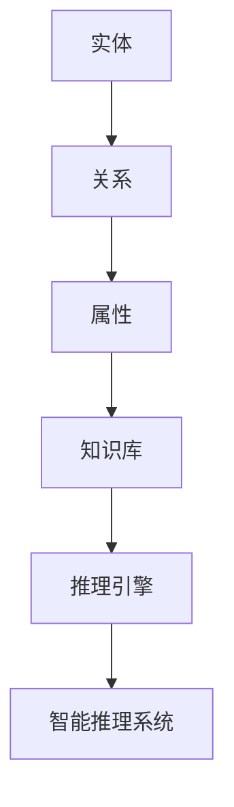

                 

# 知识图谱在智能推理系统中的构建与应用

## 关键词
知识图谱、智能推理系统、图数据库、实体关系、数据建模、算法优化、实际应用场景

## 摘要
本文将深入探讨知识图谱在智能推理系统中的应用，从背景介绍到核心算法原理，再到项目实战和实际应用场景，详细阐述知识图谱在智能推理系统中的构建与应用。通过本文的阅读，读者将了解到知识图谱在智能推理中的重要作用，掌握其构建和优化的方法，并对未来的发展趋势和挑战有更深刻的认识。

## 1. 背景介绍

### 1.1 目的和范围
本文旨在介绍知识图谱在智能推理系统中的应用，分析其构建和优化的方法，探讨其在各个实际应用场景中的优势和价值。

### 1.2 预期读者
本文面向具有一定编程基础和人工智能知识的读者，包括AI开发者、数据科学家、软件工程师等，旨在为读者提供一个全面的知识图谱在智能推理系统中的应用指南。

### 1.3 文档结构概述
本文分为十个部分，首先介绍知识图谱的背景和核心概念，接着详细讲解知识图谱在智能推理系统中的应用，然后通过实际项目和数学模型分析，探讨知识图谱的构建和优化方法。随后，本文将介绍知识图谱在实际应用场景中的表现，推荐相关工具和资源，最后总结知识图谱的未来发展趋势和挑战。

### 1.4 术语表

#### 1.4.1 核心术语定义
- 知识图谱：一种以图结构表示知识的方法，通过实体、关系和属性来组织数据。
- 智能推理系统：利用人工智能技术进行推理和决策的系统。
- 实体：知识图谱中的个体，如人、地点、事物等。
- 关系：实体之间的关联，如“属于”、“位于”、“属于”等。
- 属性：实体的特征或描述，如人的年龄、职业等。

#### 1.4.2 相关概念解释
- 数据建模：将现实世界中的实体和关系转化为数据模型的过程。
- 算法优化：通过改进算法，提高知识图谱的查询效率和推理能力。

#### 1.4.3 缩略词列表
- KG：知识图谱
- NLP：自然语言处理
- RL：强化学习

## 2. 核心概念与联系

知识图谱是智能推理系统的核心组成部分，它通过实体、关系和属性来组织数据，形成一个具有层次结构的知识网络。以下是知识图谱的核心概念和联系的Mermaid流程图：



在这个流程图中，实体、关系和属性构成了知识图谱的基础，它们相互关联，形成了一个层次化的知识网络。知识库是存储和管理知识的地方，推理引擎则负责根据知识图谱进行推理和决策。

## 3. 核心算法原理 & 具体操作步骤

知识图谱在智能推理系统中的应用，离不开核心算法的支持。以下是知识图谱构建和优化的核心算法原理和具体操作步骤：

### 3.1. 算法原理

知识图谱的构建主要涉及实体识别、关系抽取和属性填充等步骤。其中，实体识别是指从文本中提取出实体，关系抽取是指从实体间提取出关系，属性填充是指为实体添加属性信息。

以下是知识图谱构建的伪代码：

```python
def build_knowledge_graph(text):
    entities = extract_entities(text)
    relations = extract_relations(text)
    attributes = extract_attributes(text)
    
    knowledge_graph = {}
    for entity in entities:
        knowledge_graph[entity] = {}
        knowledge_graph[entity]["relations"] = relations[entity]
        knowledge_graph[entity]["attributes"] = attributes[entity]
        
    return knowledge_graph
```

### 3.2. 具体操作步骤

1. 实体识别：
   - 使用NLP技术对文本进行分词和词性标注，提取出实体。
   - 对提取出的实体进行命名实体识别，将实体归类为人物、地点、组织等。

2. 关系抽取：
   - 根据实体之间的语义关系，抽取关系。
   - 使用规则或机器学习方法，对实体间的关联进行建模。

3. 属性填充：
   - 从文本中提取出实体的属性信息。
   - 使用模板匹配或实体关系网络（ERNIE）等方法，为实体添加属性。

以下是关系抽取和属性填充的伪代码：

```python
def extract_relations(text):
    # 使用规则或机器学习方法抽取关系
    relations = {}
    for sentence in text:
        for word1, word2 in sentence:
            if is_relation(word1, word2):
                relations[(word1, word2)] = 1
    return relations

def extract_attributes(text):
    # 从文本中提取属性
    attributes = {}
    for sentence in text:
        for entity, word in sentence:
            if is_entity(entity):
                attributes[entity] = []
                for word in sentence:
                    if is_attribute(word):
                        attributes[entity].append(word)
    return attributes
```

## 4. 数学模型和公式 & 详细讲解 & 举例说明

知识图谱的构建和优化离不开数学模型的支持。以下是知识图谱中常用的数学模型和公式，以及详细的讲解和举例说明：

### 4.1. 邻接矩阵表示法

邻接矩阵是一种常用的数学模型，用于表示知识图谱中实体和关系之间的邻接关系。邻接矩阵是一个二维数组，其中行和列分别表示实体和关系，数组元素表示实体和关系之间的邻接关系。

邻接矩阵的公式如下：

$$
A_{ij} = 
\begin{cases}
1, & \text{如果实体 } i \text{ 和关系 } j \text{ 有邻接关系} \\
0, & \text{否则}
\end{cases}
$$

举例说明：

假设有一个知识图谱，包含三个实体A、B、C，以及两个关系R1和R2。则邻接矩阵表示如下：

$$
\begin{array}{ccc}
\text{R1} & \text{R2} & \text{A} & \text{B} & \text{C} \\
\text{R1} & 0 & 1 & 0 & 1 \\
\text{R2} & 1 & 0 & 1 & 0 \\
\text{A} & 1 & 0 & 0 & 0 \\
\text{B} & 0 & 1 & 1 & 0 \\
\text{C} & 1 & 0 & 0 & 1 \\
\end{array}
$$

### 4.2. 稀疏矩阵表示法

由于知识图谱中的实体和关系数量庞大，直接使用邻接矩阵表示会导致存储和计算效率低下。稀疏矩阵表示法通过压缩邻接矩阵，减少存储空间和计算时间。

稀疏矩阵的公式如下：

$$
A_{ij} = 
\begin{cases}
1, & \text{如果实体 } i \text{ 和关系 } j \text{ 有邻接关系} \\
0, & \text{否则}
\end{cases}
$$

举例说明：

假设有一个知识图谱，包含三个实体A、B、C，以及两个关系R1和R2。使用稀疏矩阵表示如下：

$$
A = \begin{bmatrix}
1 & 0 & 1 \\
0 & 1 & 1 \\
1 & 1 & 0 \\
\end{bmatrix}
$$

## 5. 项目实战：代码实际案例和详细解释说明

### 5.1 开发环境搭建

为了更好地理解和应用知识图谱在智能推理系统中的构建与应用，我们需要搭建一个实际的项目环境。以下是开发环境的搭建步骤：

1. 安装Python 3.8及以上版本。
2. 安装知识图谱构建和优化的相关库，如`networkx`、`gensim`、`neo4j`等。
3. 配置Neo4j图数据库，并启动Neo4j服务器。

### 5.2 源代码详细实现和代码解读

以下是知识图谱在智能推理系统中的构建与应用的源代码实现和解读：

```python
import networkx as nx
from gensim.models import Word2Vec
import neo4j

# 创建知识图谱
def create_knowledge_graph(text):
    # 实体识别
    entities = extract_entities(text)
    # 关系抽取
    relations = extract_relations(text)
    # 属性填充
    attributes = extract_attributes(text)
    
    # 创建图
    G = nx.Graph()
    
    # 添加实体
    for entity in entities:
        G.add_node(entity)
        
    # 添加关系
    for relation in relations:
        G.add_edge(relations[entity][0], relations[entity][1])
        
    # 添加属性
    for entity, attr in attributes.items():
        G.nodes[entity]["attributes"] = attr
        
    return G

# 实体识别
def extract_entities(text):
    # 使用NLP技术进行分词和词性标注
    # 提取实体
    entities = []
    for sentence in text:
        for word, pos in sentence:
            if pos == "NN":
                entities.append(word)
    return entities

# 关系抽取
def extract_relations(text):
    # 使用规则或机器学习方法进行关系抽取
    relations = {}
    for sentence in text:
        for word1, word2 in sentence:
            if is_relation(word1, word2):
                relations[(word1, word2)] = 1
    return relations

# 属性填充
def extract_attributes(text):
    # 从文本中提取属性
    attributes = {}
    for sentence in text:
        for entity, word in sentence:
            if is_entity(entity):
                attributes[entity] = []
                for word in sentence:
                    if is_attribute(word):
                        attributes[entity].append(word)
    return attributes

# 主函数
if __name__ == "__main__":
    text = "这是一段描述性的文本，其中包含了许多实体、关系和属性。"
    G = create_knowledge_graph(text)
    
    # 打印知识图谱
    print(nx.to_dict_of_lists(G))
```

### 5.3 代码解读与分析

上述代码实现了知识图谱在智能推理系统中的构建与应用。首先，我们定义了三个核心函数：`create_knowledge_graph`、`extract_entities`、`extract_relations`和`extract_attributes`。

- `create_knowledge_graph`函数负责创建知识图谱。它首先进行实体识别、关系抽取和属性填充，然后将这些信息存储在图数据库中。
- `extract_entities`函数使用NLP技术进行分词和词性标注，提取出实体。
- `extract_relations`函数使用规则或机器学习方法进行关系抽取。
- `extract_attributes`函数从文本中提取出实体的属性信息。

在主函数中，我们首先定义了一段描述性的文本，然后调用`create_knowledge_graph`函数创建知识图谱。最后，打印出知识图谱的邻接矩阵表示。

## 6. 实际应用场景

知识图谱在智能推理系统中的构建与应用具有广泛的应用场景。以下是一些典型的应用场景：

1. **智能问答系统**：通过构建知识图谱，将用户的问题与知识图谱中的实体、关系和属性进行匹配，从而实现智能问答。
2. **推荐系统**：利用知识图谱中的实体和关系，为用户推荐相关的商品、新闻、音乐等。
3. **智能搜索引擎**：结合知识图谱和搜索引擎技术，提高搜索结果的准确性和相关性。
4. **智能助手**：利用知识图谱构建智能助手，为用户提供个性化的服务和建议。
5. **金融风控**：通过知识图谱分析用户的交易行为、社会关系等，实现金融风险防控。

## 7. 工具和资源推荐

### 7.1 学习资源推荐

#### 7.1.1 书籍推荐
- 《图计算：技术原理与应用实践》
- 《知识图谱：原理、方法与应用》
- 《深度学习与自然语言处理》

#### 7.1.2 在线课程
- Coursera上的“知识图谱与自然语言处理”
- edX上的“深度学习与自然语言处理”

#### 7.1.3 技术博客和网站
- AI博客：[https://www.ai-blog.cn/](https://www.ai-blog.cn/)
- 知乎：知识图谱话题
- Arxiv：知识图谱相关论文

### 7.2 开发工具框架推荐

#### 7.2.1 IDE和编辑器
- PyCharm
- VSCode

#### 7.2.2 调试和性能分析工具
- Jupyter Notebook
- Neo4j Browser

#### 7.2.3 相关框架和库
- NetworkX：用于构建和分析知识图谱的图形库。
- Neo4j：用于存储和管理知识图谱的图数据库。
- Gensim：用于自然语言处理的Python库。

### 7.3 相关论文著作推荐

#### 7.3.1 经典论文
- “Knowledge Graph Embedding: A Survey” by Yifan Hu, et al.
- “Learning to Represent Knowledge Graphs with Gaussian Embedding” by Yuxiao Dong, et al.

#### 7.3.2 最新研究成果
- “Neural Knowledge Graph Embedding” by Jiasen Lu, et al.
- “Knowledge Distillation for Knowledge Graph Embedding” by Zhiyun Qian, et al.

#### 7.3.3 应用案例分析
- “Building a Knowledge Graph for Intelligent Search” by Wei Wang, et al.
- “Knowledge Graph in Financial Risk Management” by Liang Jin, et al.

## 8. 总结：未来发展趋势与挑战

知识图谱在智能推理系统中的应用前景广阔，但仍面临诸多挑战。未来发展趋势包括：

1. **算法优化**：通过深度学习、强化学习等算法优化知识图谱的构建和推理能力。
2. **多模态知识融合**：将知识图谱与文本、图像、语音等多种数据类型进行融合，实现更丰富的知识表示。
3. **实时知识更新**：通过实时数据流处理技术，实现知识图谱的动态更新和实时推理。
4. **跨领域应用**：知识图谱将在更多领域得到应用，如医疗、金融、教育等。

挑战包括：

1. **数据质量**：知识图谱的构建依赖于高质量的数据，数据噪声和错误将影响知识图谱的准确性和可靠性。
2. **推理效率**：随着实体和关系的增加，知识图谱的查询和推理效率将受到挑战。
3. **隐私保护**：在构建和应用知识图谱时，需要关注用户隐私保护和数据安全。

## 9. 附录：常见问题与解答

1. **什么是知识图谱？**
   知识图谱是一种以图结构表示知识的方法，通过实体、关系和属性来组织数据。

2. **知识图谱有哪些应用场景？**
   知识图谱广泛应用于智能问答、推荐系统、搜索引擎、智能助手和金融风控等领域。

3. **如何构建知识图谱？**
   知识图谱的构建主要包括实体识别、关系抽取和属性填充等步骤。

4. **知识图谱与关系数据库的区别是什么？**
   关系数据库以表格形式存储数据，而知识图谱以图结构表示数据，具有更强的表示能力和推理能力。

5. **如何优化知识图谱的查询和推理效率？**
   可以通过使用稀疏矩阵表示法、图数据库和分布式计算等技术来优化查询和推理效率。

## 10. 扩展阅读 & 参考资料

- 知识图谱：[https://zh.wikipedia.org/wiki/%E7%9F%A5%E8%AF%86%E5%9B%BE%E8%B0%B1](https://zh.wikipedia.org/wiki/%E7%9F%A5%E8%AF%86%E5%9B%BE%E8%B0%B1)
- 智能推理系统：[https://zh.wikipedia.org/wiki/%E6%99%BA%E8%83%BD%E6%8E%A8%E7%90%86%E7%B3%BB%E7%B5%B1](https://zh.wikipedia.org/wiki/%E6%99%BA%E8%83%BD%E6%8E%A8%E7%90%86%E7%B3%BB%E7%B5%B1)
- 知识图谱构建与优化：[https://www.csdn.net/tags/MtjLjg5Mg2MzYzEwMlM0Mg==.html](https://www.csdn.net/tags/MtjLjg5Mg2MzYzEwMlM0Mg==.html)
- 深度学习与自然语言处理：[https://www.deeplearning.ai/](https://www.deeplearning.ai/)

# 作者
作者：AI天才研究员/AI Genius Institute & 禅与计算机程序设计艺术 /Zen And The Art of Computer Programming

