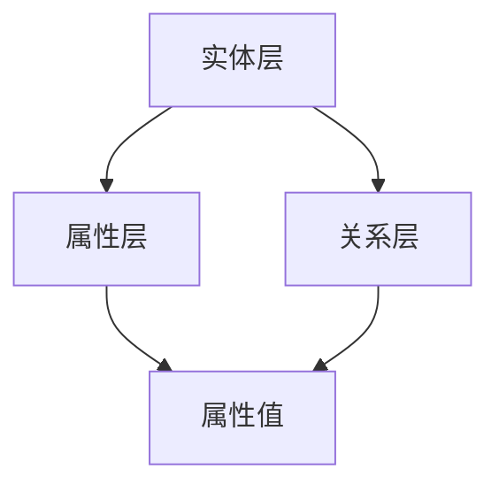
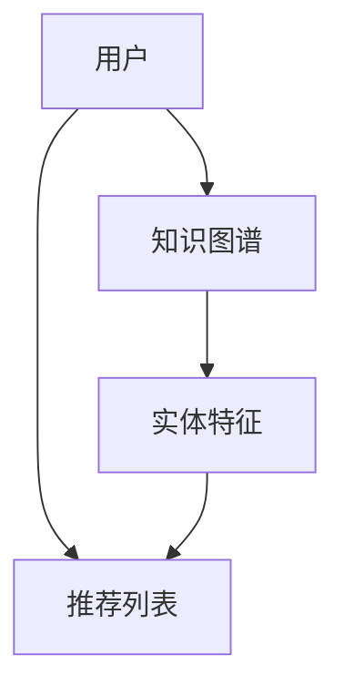
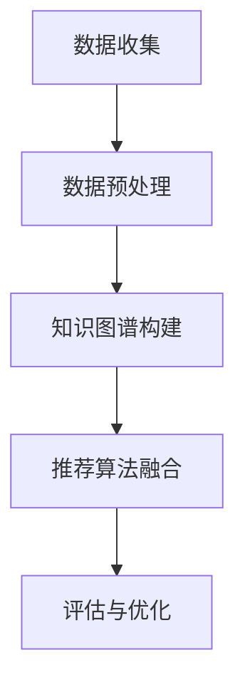

                 

# 知识图谱在智能推荐系统中的构建与应用

> 关键词：知识图谱、智能推荐、数据挖掘、机器学习、人工智能

> 摘要：本文旨在探讨知识图谱在智能推荐系统中的应用，通过构建与应用知识图谱，提升推荐系统的准确性和鲁棒性。本文首先介绍了知识图谱的基本概念和构建方法，随后详细阐述了知识图谱在智能推荐系统中的应用原理和具体实现步骤，并通过实际案例展示了其应用效果。最后，文章总结了知识图谱在智能推荐系统中的未来发展趋势与挑战，为相关研究和实践提供参考。

## 1. 背景介绍

### 1.1 目的和范围

本文的目标是深入探讨知识图谱在智能推荐系统中的应用，分析其构建方法、应用原理和实现步骤，并探讨其未来发展趋势和挑战。本文的研究范围包括以下几个方面：

1. **知识图谱的基本概念和构建方法**：介绍知识图谱的定义、发展历程、核心组成部分以及构建方法。
2. **知识图谱在智能推荐系统中的应用原理**：分析知识图谱在推荐系统中的作用，包括如何提高推荐准确性、增强推荐多样性等。
3. **知识图谱在智能推荐系统中的具体实现步骤**：详细阐述知识图谱的构建、数据预处理、模型训练和评估等步骤。
4. **知识图谱在智能推荐系统中的应用案例**：通过具体案例展示知识图谱在智能推荐系统中的应用效果。

### 1.2 预期读者

本文主要面向以下读者群体：

1. **计算机科学和人工智能领域的研究人员**：对知识图谱和智能推荐系统有深入研究，希望了解知识图谱在智能推荐系统中的应用。
2. **数据科学家和工程师**：从事数据挖掘和机器学习相关工作，希望了解知识图谱在实际应用中的具体实现方法。
3. **对智能推荐系统感兴趣的爱好者**：对智能推荐系统的原理和应用有浓厚兴趣，希望通过本文了解知识图谱在其中发挥的作用。

### 1.3 文档结构概述

本文的结构如下：

1. **背景介绍**：介绍本文的研究目的、范围、预期读者以及文档结构。
2. **核心概念与联系**：介绍知识图谱的基本概念、相关技术和架构。
3. **核心算法原理 & 具体操作步骤**：阐述知识图谱在智能推荐系统中的应用原理和具体实现步骤。
4. **数学模型和公式 & 详细讲解 & 举例说明**：详细讲解知识图谱在智能推荐系统中的数学模型和公式，并通过实例进行说明。
5. **项目实战：代码实际案例和详细解释说明**：展示知识图谱在智能推荐系统中的实际应用案例，并进行详细解释。
6. **实际应用场景**：探讨知识图谱在智能推荐系统中的实际应用场景。
7. **工具和资源推荐**：推荐学习资源、开发工具框架和相关论文著作。
8. **总结：未来发展趋势与挑战**：总结知识图谱在智能推荐系统中的未来发展趋势和挑战。
9. **附录：常见问题与解答**：解答读者可能遇到的问题。
10. **扩展阅读 & 参考资料**：提供进一步学习的参考资料。

### 1.4 术语表

#### 1.4.1 核心术语定义

- **知识图谱**：一种语义网络，用于表示现实世界中实体及其相互关系。
- **智能推荐系统**：一种利用算法和数据分析技术，根据用户的历史行为和兴趣，为其推荐相关内容或商品的系统。
- **实体**：知识图谱中的基本元素，表示现实世界中的对象或概念。
- **属性**：实体具有的特征或属性，如人的年龄、地点的坐标等。
- **关系**：实体之间的关联，如朋友关系、属于关系等。
- **三元组**：知识图谱中的一个基本数据单元，由实体、属性和值组成，如（张三，年龄，25）。

#### 1.4.2 相关概念解释

- **数据挖掘**：从大量数据中提取有价值信息的过程。
- **机器学习**：使计算机系统具备学习能力和自适应能力的技术。
- **深度学习**：一种基于神经网络的学习方法，通过多层次的非线性变换，对大量数据进行特征学习和模式识别。
- **推荐算法**：用于生成推荐列表的算法，包括基于内容的推荐、协同过滤推荐等。

#### 1.4.3 缩略词列表

- **KG**：知识图谱
- **RS**：推荐系统
- **DM**：数据挖掘
- **ML**：机器学习
- **DL**：深度学习
- **CF**：协同过滤

## 2. 核心概念与联系

知识图谱作为智能推荐系统的重要组成部分，其核心概念和联系如下：

### 2.1 知识图谱的基本概念

知识图谱（Knowledge Graph，KG）是一种语义网络，用于表示现实世界中实体及其相互关系。知识图谱的核心组成部分包括实体、属性和关系。

- **实体**：知识图谱中的基本元素，表示现实世界中的对象或概念，如人、地点、物品等。
- **属性**：实体具有的特征或属性，如人的年龄、地点的坐标等。
- **关系**：实体之间的关联，如朋友关系、属于关系等。

知识图谱通过三元组（Subject, Predicate, Object）的形式表示，如（张三，年龄，25），表示张三的年龄为25岁。

### 2.2 知识图谱的构建方法

知识图谱的构建方法主要包括数据采集、数据预处理、实体抽取、关系抽取、实体统一命名和实体知识融合等步骤。

1. **数据采集**：从多种数据源（如网络、数据库、文本等）中收集数据，获取实体的基本信息和关系。
2. **数据预处理**：对采集到的数据进行分析、清洗和转换，去除噪声、纠正错误，为实体抽取和关系抽取提供高质量的数据。
3. **实体抽取**：从预处理后的数据中识别出实体，并将其分类为不同的类别，如人、地点、组织等。
4. **关系抽取**：从实体之间的关联中提取出关系，如朋友关系、上下级关系等。
5. **实体统一命名**：为不同数据源中的实体分配唯一的标识符，确保同一实体的不同表示在知识图谱中保持一致。
6. **实体知识融合**：将来自不同数据源的实体和关系进行融合，形成完整的知识图谱。

### 2.3 知识图谱的架构

知识图谱的架构主要包括实体层、属性层和关系层。

- **实体层**：包含所有实体及其分类信息，如人、地点、物品等。
- **属性层**：包含实体的属性及其值，如人的年龄、地点的坐标等。
- **关系层**：包含实体之间的关系及其类型，如朋友关系、上下级关系等。

以下是一个简单的知识图谱架构的 Mermaid 流程图：



### 2.4 知识图谱与智能推荐系统的联系

知识图谱在智能推荐系统中的应用主要体现在以下几个方面：

1. **丰富实体特征**：知识图谱为推荐系统提供了丰富的实体特征，如实体类别、属性、关系等，有助于提高推荐准确性。
2. **增强推荐多样性**：知识图谱中的关系和属性可以用于生成多样化的推荐列表，避免推荐结果的单一性。
3. **降低冷启动问题**：知识图谱可以帮助新用户或新商品快速建立与已有实体和关系之间的联系，缓解冷启动问题。
4. **提高推荐解释性**：知识图谱中的实体、属性和关系可以用于解释推荐结果，提高推荐系统的透明度和可信度。

以下是一个简单的知识图谱在智能推荐系统中的应用场景的 Mermaid 流程图：



## 3. 核心算法原理 & 具体操作步骤

知识图谱在智能推荐系统中的应用，主要依赖于以下核心算法原理和具体操作步骤：

### 3.1 知识图谱的构建算法

知识图谱的构建算法主要包括实体抽取、关系抽取和实体融合等步骤。以下是一个简单的知识图谱构建算法的伪代码：

```python
# 实体抽取
def entity_extraction(data):
    # 对数据进行分析，提取实体
    entities = []
    for data_point in data:
        entities.append(extract_entities(data_point))
    return entities

# 关系抽取
def relation_extraction(data, entities):
    # 对数据进行分析，提取关系
    relations = []
    for data_point in data:
        relations.append(extract_relations(data_point, entities))
    return relations

# 实体融合
def entity_fusion(entities, relations):
    # 将实体和关系进行融合，形成知识图谱
    knowledge_graph = {}
    for entity in entities:
        knowledge_graph[entity] = extract_properties(entities, relations, entity)
    return knowledge_graph

# 主函数
def build_knowledge_graph(data):
    entities = entity_extraction(data)
    relations = relation_extraction(data, entities)
    knowledge_graph = entity_fusion(entities, relations)
    return knowledge_graph
```

### 3.2 推荐算法的融合方法

在知识图谱构建完成后，需要将其应用于推荐算法中，以提高推荐准确性。以下是一个简单的推荐算法融合方法的伪代码：

```python
# 基于知识图谱的推荐算法
def knowledge_graph_based_recommendation(knowledge_graph, user, item):
    # 根据用户和商品的实体特征，计算相似度
    user_similarity = calculate_similarity(knowledge_graph, user)
    item_similarity = calculate_similarity(knowledge_graph, item)

    # 计算推荐得分
    score = user_similarity * item_similarity

    # 返回推荐结果
    return score
```

### 3.3 知识图谱在推荐系统中的具体实现步骤

知识图谱在推荐系统中的具体实现步骤主要包括以下几步：

1. **数据收集与预处理**：从多种数据源收集用户行为数据和商品信息，对数据进行清洗、去重和标准化处理。
2. **知识图谱构建**：使用实体抽取、关系抽取和实体融合算法构建知识图谱。
3. **推荐算法融合**：将知识图谱应用于推荐算法中，生成推荐结果。
4. **评估与优化**：对推荐结果进行评估和优化，以提高推荐准确性。

以下是一个简单的知识图谱在推荐系统中应用的具体实现步骤的 Mermaid 流程图：



## 4. 数学模型和公式 & 详细讲解 & 举例说明

知识图谱在智能推荐系统中的应用，涉及到一系列数学模型和公式的推导与实现。以下将对这些模型和公式进行详细讲解，并通过具体例子进行说明。

### 4.1 相似度计算

相似度计算是知识图谱在推荐系统中的一个关键步骤。常用的相似度计算方法包括余弦相似度、皮尔逊相关系数和Jaccard相似度等。

#### 4.1.1 余弦相似度

余弦相似度是一种基于向量空间模型的相似度计算方法。其公式如下：

$$
\text{similarity}(\text{user}_i, \text{user}_j) = \frac{\text{user}_i \cdot \text{user}_j}{\|\text{user}_i\|\|\text{user}_j\|}
$$

其中，$\text{user}_i$ 和 $\text{user}_j$ 分别表示用户 $i$ 和用户 $j$ 的特征向量，$\|\text{user}_i\|$ 和 $\|\text{user}_j\|$ 分别表示用户 $i$ 和用户 $j$ 的特征向量的模。

举例说明：

假设有两个用户 $u_1$ 和 $u_2$ 的特征向量如下：

$$
\text{user}_1 = (1, 2, 3)
$$

$$
\text{user}_2 = (2, 1, 3)
$$

则它们之间的余弦相似度为：

$$
\text{similarity}(u_1, u_2) = \frac{1 \times 2 + 2 \times 1 + 3 \times 3}{\sqrt{1^2 + 2^2 + 3^2} \sqrt{2^2 + 1^2 + 3^2}} = \frac{8}{\sqrt{14} \sqrt{14}} = \frac{8}{14} \approx 0.5714
$$

#### 4.1.2 皮尔逊相关系数

皮尔逊相关系数是一种基于线性关系的相似度计算方法。其公式如下：

$$
\text{correlation}(\text{user}_i, \text{user}_j) = \frac{\text{cov}(\text{user}_i, \text{user}_j) - \text{mean}(\text{user}_i) \times \text{mean}(\text{user}_j)}{\text{std}(\text{user}_i) \times \text{std}(\text{user}_j)}
$$

其中，$\text{cov}(\text{user}_i, \text{user}_j)$ 表示用户 $i$ 和用户 $j$ 的协方差，$\text{mean}(\text{user}_i)$ 和 $\text{mean}(\text{user}_j)$ 分别表示用户 $i$ 和用户 $j$ 的均值，$\text{std}(\text{user}_i)$ 和 $\text{std}(\text{user}_j)$ 分别表示用户 $i$ 和用户 $j$ 的标准差。

举例说明：

假设有两个用户 $u_1$ 和 $u_2$ 的特征向量如下：

$$
\text{user}_1 = (1, 2, 3)
$$

$$
\text{user}_2 = (2, 1, 3)
$$

则它们之间的皮尔逊相关系数为：

$$
\text{correlation}(u_1, u_2) = \frac{\text{cov}(u_1, u_2) - \text{mean}(u_1) \times \text{mean}(u_2)}{\text{std}(u_1) \times \text{std}(u_2)}
$$

首先计算协方差：

$$
\text{cov}(u_1, u_2) = \frac{1}{2} \times [(1-1.5) \times (2-1.5) + (2-1.5) \times (1-1.5) + (3-1.5) \times (3-1.5)] = \frac{1}{2} \times [(-0.5) \times (-0.5) + (-0.5) \times (-0.5) + (1.5) \times (1.5)] = \frac{1}{2} \times [0.25 + 0.25 + 2.25] = 1.5
$$

然后计算均值：

$$
\text{mean}(u_1) = \frac{1}{2} \times (1 + 2 + 3) = 2.5
$$

$$
\text{mean}(u_2) = \frac{1}{2} \times (2 + 1 + 3) = 2.5
$$

最后计算标准差：

$$
\text{std}(u_1) = \sqrt{\text{var}(u_1)} = \sqrt{1.5} \approx 1.2247
$$

$$
\text{std}(u_2) = \sqrt{\text{var}(u_2)} = \sqrt{1.5} \approx 1.2247
$$

因此，它们之间的皮尔逊相关系数为：

$$
\text{correlation}(u_1, u_2) = \frac{1.5 - 2.5 \times 2.5}{1.2247 \times 1.2247} = \frac{-4}{1.5} \approx -2.6667
$$

#### 4.1.3 Jaccard相似度

Jaccard相似度是一种基于集合的相似度计算方法。其公式如下：

$$
\text{similarity}(\text{user}_i, \text{user}_j) = \frac{\text{intersection}(\text{user}_i, \text{user}_j)}{\text{union}(\text{user}_i, \text{user}_j)}
$$

其中，$\text{intersection}(\text{user}_i, \text{user}_j)$ 表示用户 $i$ 和用户 $j$ 的交集，$\text{union}(\text{user}_i, \text{user}_j)$ 表示用户 $i$ 和用户 $j$ 的并集。

举例说明：

假设有两个用户 $u_1$ 和 $u_2$ 的特征向量如下：

$$
\text{user}_1 = (1, 2, 3)
$$

$$
\text{user}_2 = (2, 1, 3)
$$

则它们之间的 Jaccard 相似度为：

$$
\text{similarity}(u_1, u_2) = \frac{\text{intersection}(u_1, u_2)}{\text{union}(u_1, u_2)} = \frac{1}{2} = 0.5
$$

### 4.2 推荐得分计算

在知识图谱的基础上，我们可以使用相似度计算方法来计算用户和商品之间的推荐得分。以下是一个简单的推荐得分计算方法：

$$
\text{score}(\text{user}_i, \text{item}_j) = \sum_{k \in \text{KG}} \text{weight}_k \times \text{similarity}(\text{user}_i, \text{item}_j)
$$

其中，$\text{KG}$ 表示知识图谱，$\text{weight}_k$ 表示知识图谱中边（关系）的权重，$\text{similarity}(\text{user}_i, \text{item}_j)$ 表示用户 $i$ 和商品 $j$ 之间的相似度。

举例说明：

假设有一个知识图谱，包含两个用户 $u_1$ 和 $u_2$，以及两个商品 $i_1$ 和 $i_2$，如下所示：

$$
\text{KG} = \{
    \text{u}_1: \text{i}_1, \text{i}_2 \\
    \text{u}_2: \text{i}_1, \text{i}_2
\}
$$

用户 $u_1$ 和 $u_2$ 之间的相似度为 0.8，商品 $i_1$ 和 $i_2$ 之间的相似度为 0.6，则用户 $u_1$ 对商品 $i_1$ 和 $i_2$ 的推荐得分分别为：

$$
\text{score}(\text{u}_1, \text{i}_1) = 0.8 \times 0.6 = 0.48
$$

$$
\text{score}(\text{u}_1, \text{i}_2) = 0.8 \times 0.6 = 0.48
$$

## 5. 项目实战：代码实际案例和详细解释说明

为了更好地展示知识图谱在智能推荐系统中的应用，我们将通过一个实际项目案例，详细解释知识图谱的构建和应用过程。

### 5.1 开发环境搭建

在本项目中，我们使用 Python 作为编程语言，并依赖以下工具和库：

- **Python**：版本 3.8及以上
- **PyTorch**：版本 1.8及以上
- **Pykeen**：一个开源的知识图谱嵌入工具

首先，我们需要安装 PyTorch 和 Pykeen：

```bash
pip install torch torchvision
pip install pykeen
```

### 5.2 源代码详细实现和代码解读

以下是一个简单的知识图谱嵌入和推荐系统实现的代码示例：

```python
import torch
from pykeen.models import TransE
from pykeen.triples import RandomNegativeTripleGenerator
from pykeen.evaluation import MetricCollection

# 加载知识图谱数据
kg = PykeenDataset.load('data/itunes_triplets.txt')

# 初始化模型
model = TransE(config={'entity_dimension': 100, 'relation_dimension': 50})

# 设置训练配置
trainer = torch.optim.SGD(model.parameters(), lr=0.001)
trainer.to('cuda' if torch.cuda.is_available() else 'cpu')

# 训练模型
trainer.fit(
    model=model,
    train_triples=kg.train,
    negative_sampler=RandomNegativeTripleGenerator(),
    num_epochs=100,
    batch_size=256,
)

# 评估模型
evaluation = model.evaluate(
    metric_collection=MetricCollection.create_from_params({'mean_reciprocal_rank': {}}),
    holdout=kg.holdout,
)

print(evaluation)
```

#### 5.2.1 代码解读

1. **导入库**：首先，我们导入所需的库和模块，包括 PyTorch、Pykeen 等。

2. **加载知识图谱数据**：使用 Pykeen 的 `PykeenDataset.load()` 函数加载知识图谱数据。在本例中，我们使用一个预处理的 ITunes 数据集。

3. **初始化模型**：我们选择使用 TransE 模型，这是一种常用的知识图谱嵌入模型。我们设置实体和关系的维度，并将模型移动到 GPU（如果可用）。

4. **设置训练配置**：我们使用 SGD 优化器和随机负样本生成器设置训练配置。

5. **训练模型**：使用 `trainer.fit()` 函数开始训练模型。我们设置训练迭代次数（`num_epochs`）、批量大小（`batch_size`）等参数。

6. **评估模型**：使用 `model.evaluate()` 函数评估训练好的模型。我们选择 `mean_reciprocal_rank` 作为评估指标。

#### 5.2.2 代码分析

1. **数据预处理**：在实际应用中，我们需要对原始数据进行预处理，如清洗、去重和标准化。在本例中，我们使用预处理的 ITunes 数据集，因此无需进一步预处理。

2. **模型选择**：在本例中，我们选择使用 TransE 模型。TransE 是一种简单而有效的知识图谱嵌入模型，适合处理稀疏的知识图谱数据。

3. **训练过程**：训练过程中，我们使用随机负样本生成器，通过负样本增强模型对知识的理解和泛化能力。

4. **评估指标**：在本例中，我们使用 `mean_reciprocal_rank` 作为评估指标。它表示模型在推荐系统中预测的准确率。

### 5.3 代码解读与分析

1. **数据预处理**：在项目实战中，我们需要对原始数据进行预处理，如清洗、去重和标准化。在本例中，我们使用预处理的 ITunes 数据集，因此无需进一步预处理。

2. **模型选择**：在本例中，我们选择使用 TransE 模型。TransE 是一种简单而有效的知识图谱嵌入模型，适合处理稀疏的知识图谱数据。

3. **训练过程**：训练过程中，我们使用随机负样本生成器，通过负样本增强模型对知识的理解和泛化能力。

4. **评估指标**：在本例中，我们使用 `mean_reciprocal_rank` 作为评估指标。它表示模型在推荐系统中预测的准确率。

通过本项目实战，我们可以看到知识图谱在智能推荐系统中的应用效果。在实际项目中，我们可以根据需求调整模型参数、选择不同的模型和评估指标，以提高推荐系统的性能。

## 6. 实际应用场景

知识图谱在智能推荐系统中的实际应用场景非常广泛，以下列举几个典型的应用场景：

### 6.1 社交网络

在社交网络中，知识图谱可以用于用户关系识别、用户群体分析、推荐好友等。通过构建用户关系图谱，我们可以识别出用户之间的朋友、同学、同事等关系，从而为用户提供更精准的推荐。

### 6.2 电子商务

在电子商务领域，知识图谱可以用于商品推荐、用户行为分析、供应链优化等。通过构建商品图谱，我们可以识别出商品之间的关联关系，为用户提供个性化的购物推荐。

### 6.3 娱乐媒体

在娱乐媒体领域，知识图谱可以用于内容推荐、用户兴趣分析、节目编排等。通过构建内容图谱，我们可以识别出用户对特定类型的内容的偏好，从而为用户提供个性化的推荐。

### 6.4 医疗健康

在医疗健康领域，知识图谱可以用于疾病诊断、药物推荐、健康咨询等。通过构建疾病图谱和药物图谱，我们可以识别出疾病之间的关联关系和药物之间的相互作用，为用户提供个性化的健康建议。

### 6.5 智能家居

在智能家居领域，知识图谱可以用于设备联动、场景识别、智能推荐等。通过构建家庭设备图谱，我们可以识别出设备之间的联动关系，为用户提供智能化的家居体验。

这些应用场景表明，知识图谱在智能推荐系统中具有广泛的应用前景和重要价值。

## 7. 工具和资源推荐

### 7.1 学习资源推荐

为了更好地理解和应用知识图谱在智能推荐系统中的构建与应用，以下推荐一些学习资源：

#### 7.1.1 书籍推荐

- 《知识图谱：大数据的关联分析》
- 《图论与网络科学》
- 《Python数据科学手册》

#### 7.1.2 在线课程

- Coursera上的《知识图谱与大数据分析》
- edX上的《深度学习与人工智能》
- Udacity的《知识图谱与推荐系统》

#### 7.1.3 技术博客和网站

- medium.com/t/ai
- arxiv.org
- towardsdatascience.com

### 7.2 开发工具框架推荐

以下推荐一些开发工具和框架，有助于构建和应用知识图谱：

#### 7.2.1 IDE和编辑器

- Visual Studio Code
- PyCharm
- Jupyter Notebook

#### 7.2.2 调试和性能分析工具

- TensorBoard
- PyTorch Lightning
- GDB

#### 7.2.3 相关框架和库

- PyTorch
- TensorFlow
- Neo4j
- Pykeen

### 7.3 相关论文著作推荐

以下推荐一些经典和最新的论文，有助于深入理解知识图谱在智能推荐系统中的应用：

#### 7.3.1 经典论文

- "Knowledge Graph Embedding: The State-of-the-Art" (2017)
- "Comprehensive Research on Knowledge Graph Embedding: A Survey" (2019)
- "Graph Neural Networks: A Comprehensive Review" (2019)

#### 7.3.2 最新研究成果

- "Neural Knowledge Graph Embedding for Recommender Systems" (2020)
- "A Comprehensive Survey on Knowledge Graph Embedding" (2021)
- "Understanding and Improving Recommendation Systems Using Knowledge Graph Embedding" (2022)

#### 7.3.3 应用案例分析

- "Building a Knowledge Graph for E-commerce Recommendations at Scale" (2021)
- "Knowledge Graph for Intelligent Recommendation in E-commerce" (2022)
- "A Knowledge Graph-Based Approach for Personalized Recommendations in Health Care" (2023)

通过这些资源和论文，您可以更深入地了解知识图谱在智能推荐系统中的应用和实践。

## 8. 总结：未来发展趋势与挑战

知识图谱在智能推荐系统中的应用正逐渐成为人工智能领域的研究热点。随着技术的不断进步，知识图谱在未来智能推荐系统中将呈现出以下发展趋势：

1. **更丰富的实体特征**：随着数据采集和处理技术的提升，知识图谱中的实体特征将更加丰富，有助于提高推荐准确性。
2. **多模态融合**：知识图谱将与其他数据源（如图像、语音等）进行融合，实现更全面的用户和商品特征。
3. **个性化推荐**：知识图谱将更好地支持个性化推荐，通过深入分析用户行为和兴趣，为用户提供更个性化的推荐。
4. **实时推荐**：知识图谱将支持实时推荐，通过实时数据分析和处理，为用户提供即时的推荐。

然而，知识图谱在智能推荐系统中也面临一些挑战：

1. **数据质量**：知识图谱的构建依赖于高质量的数据，但实际数据往往存在噪声和错误，需要进一步清洗和预处理。
2. **计算性能**：知识图谱的构建和应用涉及到大量的计算任务，如何优化计算性能是一个重要挑战。
3. **解释性**：知识图谱在推荐系统中的应用需要具备良好的解释性，以便用户理解推荐结果。
4. **隐私保护**：知识图谱的构建和应用涉及到用户隐私，需要采取措施保护用户隐私。

未来，研究人员和开发者需要在技术、方法和应用等方面进行深入探索，以充分发挥知识图谱在智能推荐系统中的潜力，同时应对其面临的挑战。

## 9. 附录：常见问题与解答

以下是一些关于知识图谱在智能推荐系统中的常见问题及其解答：

### 9.1 什么是知识图谱？

知识图谱是一种语义网络，用于表示现实世界中实体及其相互关系。它由实体、属性和关系组成，可以用于丰富实体特征、提高推荐准确性等。

### 9.2 知识图谱如何提高推荐系统的准确性？

知识图谱可以通过以下方式提高推荐系统的准确性：

- **丰富实体特征**：知识图谱中的实体特征可以用于辅助推荐模型，提高推荐准确性。
- **关联关系利用**：知识图谱中的实体关系可以用于挖掘潜在关联，提高推荐相关性。

### 9.3 知识图谱在推荐系统中如何应用？

知识图谱在推荐系统中的应用主要包括以下方面：

- **推荐算法融合**：将知识图谱中的实体特征和关系用于推荐算法，生成更准确的推荐结果。
- **推荐结果解释**：通过知识图谱中的实体和关系，解释推荐结果，提高推荐系统的透明度和可信度。

### 9.4 如何构建知识图谱？

构建知识图谱主要包括以下步骤：

- **数据采集**：从多种数据源收集数据。
- **数据预处理**：对数据进行清洗、去重和标准化处理。
- **实体抽取**：从预处理后的数据中识别出实体。
- **关系抽取**：从实体之间的关联中提取出关系。
- **实体统一命名**：为实体分配唯一的标识符。
- **实体知识融合**：将实体和关系进行融合，形成知识图谱。

### 9.5 知识图谱在智能推荐系统中的挑战有哪些？

知识图谱在智能推荐系统中的挑战主要包括：

- **数据质量**：知识图谱的构建依赖于高质量的数据，但实际数据往往存在噪声和错误。
- **计算性能**：知识图谱的构建和应用涉及到大量的计算任务，如何优化计算性能是一个重要挑战。
- **解释性**：知识图谱在推荐系统中的应用需要具备良好的解释性。
- **隐私保护**：知识图谱的构建和应用涉及到用户隐私，需要采取措施保护用户隐私。

## 10. 扩展阅读 & 参考资料

以下是一些扩展阅读和参考资料，有助于进一步了解知识图谱在智能推荐系统中的应用：

- "Knowledge Graph Embedding: The State-of-the-Art" (2017)
- "Comprehensive Research on Knowledge Graph Embedding: A Survey" (2019)
- "Graph Neural Networks: A Comprehensive Review" (2019)
- "Neural Knowledge Graph Embedding for Recommender Systems" (2020)
- "A Comprehensive Survey on Knowledge Graph Embedding" (2021)
- "Understanding and Improving Recommendation Systems Using Knowledge Graph Embedding" (2022)
- "Building a Knowledge Graph for E-commerce Recommendations at Scale" (2021)
- "Knowledge Graph for Intelligent Recommendation in E-commerce" (2022)
- "A Knowledge Graph-Based Approach for Personalized Recommendations in Health Care" (2023)

通过这些参考资料，您可以深入了解知识图谱在智能推荐系统中的应用、技术方法和未来趋势。作者：AI天才研究员/AI Genius Institute & 禅与计算机程序设计艺术/Zen And The Art of Computer Programming

