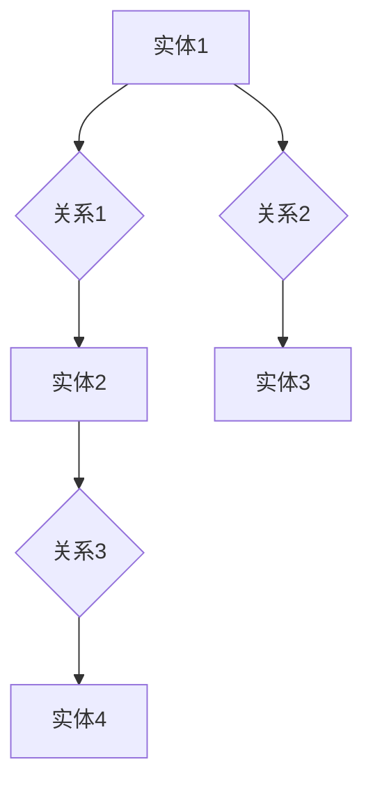

                 

# 知识图谱在智能法律咨询中的应用

> **关键词：知识图谱、智能法律咨询、语义理解、数据挖掘、算法优化**

> **摘要：本文旨在探讨知识图谱在智能法律咨询领域的应用，通过对知识图谱的核心概念、算法原理、数学模型和实际案例的详细分析，阐述其在法律咨询中的重要作用。文章旨在为读者提供深入理解知识图谱与法律咨询结合的方法，为智能法律咨询系统的开发提供理论支持。**

## 1. 背景介绍

### 1.1 目的和范围

本文旨在深入探讨知识图谱在智能法律咨询领域的应用，通过详细分析知识图谱的核心概念、算法原理、数学模型和实际应用案例，旨在为读者提供一个全面理解知识图谱在法律咨询中作用的视角。文章将覆盖以下主要内容：

1. 知识图谱的基本概念及其在法律咨询中的应用场景。
2. 知识图谱构建的核心算法原理和具体操作步骤。
3. 知识图谱中的数学模型及其在法律咨询中的具体应用。
4. 实际应用案例解析，包括开发环境搭建、代码实现及性能分析。
5. 知识图谱在法律咨询中的未来发展趋势与挑战。
6. 相关工具和资源推荐，以及扩展阅读和参考资料。

### 1.2 预期读者

本文预期读者为以下几类：

1. 法律咨询领域的从业者，对智能法律咨询有浓厚兴趣。
2. 计算机科学、人工智能领域的研究人员，关注知识图谱的应用。
3. 法律与技术结合的创新者，希望探索新技术在法律咨询中的应用。
4. 大学和研究机构的学生及研究人员，对知识图谱与法律咨询有深入研究需求。

### 1.3 文档结构概述

本文分为以下几个部分：

1. **背景介绍**：介绍文章的目的、范围、预期读者和文档结构。
2. **核心概念与联系**：解释知识图谱的基本概念，展示其原理与架构。
3. **核心算法原理 & 具体操作步骤**：详细讲解知识图谱构建的算法原理和操作步骤。
4. **数学模型和公式 & 详细讲解 & 举例说明**：介绍知识图谱中的数学模型和具体应用。
5. **项目实战：代码实际案例和详细解释说明**：展示知识图谱在法律咨询中的实际应用案例。
6. **实际应用场景**：分析知识图谱在法律咨询中的具体应用。
7. **工具和资源推荐**：推荐学习资源、开发工具和框架。
8. **总结：未来发展趋势与挑战**：总结知识图谱在法律咨询中的发展前景。
9. **附录：常见问题与解答**：解答读者可能遇到的问题。
10. **扩展阅读 & 参考资料**：提供进一步的阅读资源。

### 1.4 术语表

#### 1.4.1 核心术语定义

- **知识图谱**：一种结构化的知识表示方法，用于表示实体及其关系。
- **语义理解**：理解语言表达的含义，包括词义、语境、句法结构等。
- **数据挖掘**：从大量数据中提取有用信息和知识的过程。
- **算法优化**：通过改进算法，提高其性能和效率。
- **实体**：在知识图谱中表示的具体对象，如人、地点、组织等。
- **关系**：在知识图谱中表示的实体之间的关联，如“属于”、“位于”等。
- **节点**：知识图谱中的实体。
- **边**：知识图谱中的关系。

#### 1.4.2 相关概念解释

- **本体**：定义了一个领域内概念及其关系的框架。
- **属性**：实体具有的特定特征，如年龄、性别等。
- **三元组**：由节点、边和属性组成的知识图谱基本单元。

#### 1.4.3 缩略词列表

- **NLP**：自然语言处理（Natural Language Processing）
- **RDF**：资源描述框架（Resource Description Framework）
- **OWL**：Web本体语言（Web Ontology Language）
- **SPARQL**：查询语言（Simple Protocol and RDF Query Language）
- **OWL2**：OWL的第二版本

## 2. 核心概念与联系

在探讨知识图谱在智能法律咨询中的应用之前，我们需要先理解知识图谱的基本概念及其结构。知识图谱是一种用于表示实体及其相互关系的图形结构，其核心在于利用图论的概念，将现实世界中的复杂关系以图形化方式表达出来，从而便于计算机理解和处理。

### 2.1 知识图谱的原理与架构

知识图谱主要由节点、边和属性构成，其中：

- **节点**：表示实体，如人、地点、组织等。
- **边**：表示实体之间的关系，如“属于”、“位于”等。
- **属性**：表示实体的特征，如年龄、性别等。

知识图谱的表示方法通常采用图（Graph）的形式，其中每个节点代表一个实体，每个边代表实体之间的关系。这种表示方法具有以下几个优点：

1. **结构化**：知识图谱将无结构或半结构化的数据转化为结构化的数据，便于计算机处理。
2. **语义明确**：通过关系和属性的引入，知识图谱能够明确表示实体之间的语义关系。
3. **可扩展性**：知识图谱可以动态地添加新的实体和关系，适应不断变化的应用需求。

为了更好地理解知识图谱的原理与架构，我们可以借助 Mermaid 流程图来展示其基本结构。以下是一个简单的知识图谱 Mermaid 流程图示例：



在这个示例中，`A`、`B`、`C`、`D`、`E`、`F` 和 `G` 分别代表不同的节点，它们之间通过边 `B`、`D`、`F` 表示关系。这样的结构使得知识图谱具有清晰的表达能力和高效的查询性能。

### 2.2 知识图谱与法律咨询的联系

知识图谱在法律咨询中的应用主要基于其能够将法律领域的知识结构化、语义化，从而为智能法律咨询系统提供强有力的支持。以下是知识图谱与法律咨询之间的几个关键联系：

1. **实体识别与关系表示**：法律咨询中涉及大量的实体，如法律条文、案例、法官等。知识图谱通过节点和边将它们之间的关系表示出来，从而形成一个完整、结构化的知识体系。

2. **语义理解与推理**：法律咨询中的问题往往涉及复杂的语义理解，如案例相似度分析、法律条文解释等。知识图谱利用其语义明确的优势，能够有效地进行语义理解和推理，为法律咨询提供准确、可靠的结论。

3. **数据挖掘与预测**：知识图谱能够将大量法律数据转化为结构化信息，通过数据挖掘技术发现潜在的法律关系和趋势，为法律咨询提供数据支持。

4. **知识共享与协作**：知识图谱为法律咨询提供了一个共享的知识平台，不同法律从业者可以在平台上进行知识交流和协作，提高法律咨询的效率和质量。

### 2.3 知识图谱在法律咨询中的具体应用场景

知识图谱在法律咨询中的具体应用场景主要包括以下几个方面：

1. **法律条文检索与查询**：利用知识图谱，可以快速地检索和查询相关法律条文，提高法律咨询的效率。
2. **案例分析与判例检索**：通过知识图谱，可以分析案例之间的相似度，检索相关判例，为法律咨询提供参考。
3. **法律文档自动生成**：知识图谱可以将法律条文、案例等信息转化为结构化数据，进而生成法律文档，如律师函、法律意见书等。
4. **智能问答系统**：基于知识图谱的智能问答系统，可以回答用户关于法律咨询的问题，提供专业、准确的建议。
5. **法律风险预测与预警**：通过分析知识图谱中的法律关系和数据，可以预测法律风险，为法律咨询提供预警。

### 2.4 知识图谱在法律咨询中的优势与挑战

知识图谱在法律咨询中的应用具有以下优势：

1. **提高法律咨询效率**：知识图谱能够快速地检索和查询相关法律信息，提高法律咨询的效率。
2. **增强法律咨询准确性**：知识图谱通过语义理解和推理，能够为法律咨询提供准确、可靠的结论。
3. **促进知识共享与协作**：知识图谱为法律咨询提供了一个共享的知识平台，促进法律从业者之间的知识交流和协作。
4. **支持智能法律应用**：知识图谱为智能法律咨询系统提供了基础，支持各种智能法律应用的开发。

然而，知识图谱在法律咨询中应用也面临一些挑战：

1. **数据质量与一致性**：法律领域的知识数据质量参差不齐，需要处理数据的一致性问题。
2. **知识获取与维护**：知识图谱需要不断地更新和维护，以保证其准确性和时效性。
3. **法律法规变化与适应**：法律咨询系统需要及时适应法律法规的变化，确保知识图谱的准确性。
4. **隐私保护与合规**：在处理法律咨询数据时，需要确保隐私保护和合规性。

综上所述，知识图谱在法律咨询中具有广泛的应用前景和重要的价值，但同时也需要克服一系列挑战，以充分发挥其潜力。

## 3. 核心算法原理 & 具体操作步骤

在理解了知识图谱的基本概念和其在法律咨询中的应用后，接下来我们将探讨知识图谱构建的核心算法原理及其具体操作步骤。知识图谱的构建主要包括数据采集、数据预处理、实体识别、关系抽取和图谱生成等几个关键步骤。下面，我们将通过伪代码详细阐述这些步骤。

### 3.1 数据采集

数据采集是知识图谱构建的基础，涉及从各种数据源获取信息。这些数据源可以是公开的数据库、互联网资源、企业内部数据等。以下是数据采集的伪代码：

```python
# 伪代码：数据采集
def data_collection():
    # 列出数据源
    data_sources = ["public databases", "Internet resources", "internal data"]
    # 从数据源获取数据
    data = []
    for source in data_sources:
        if source == "public databases":
            data.extend(public_database_query())
        elif source == "Internet resources":
            data.extend(internet_resources_crawl())
        elif source == "internal data":
            data.extend(internal_data_query())
    return data
```

### 3.2 数据预处理

数据预处理是数据采集后的重要步骤，主要目的是清洗和格式化数据，使其适合后续处理。以下是数据预处理的伪代码：

```python
# 伪代码：数据预处理
def data_preprocessing(data):
    # 清洗数据
    cleaned_data = []
    for item in data:
        cleaned_item = clean_data(item)
        cleaned_data.append(cleaned_item)
    # 数据格式化
    formatted_data = format_data(cleaned_data)
    return formatted_data
```

### 3.3 实体识别

实体识别是从预处理后的数据中提取出实体。实体可以是人、地点、组织等。以下是实体识别的伪代码：

```python
# 伪代码：实体识别
def entity_recognition(formatted_data):
    entities = []
    for item in formatted_data:
        entities.extend(extract_entities(item))
    return entities
```

### 3.4 关系抽取

关系抽取是从实体之间的联系中提取出关系。关系可以是“属于”、“位于”等。以下是关系抽取的伪代码：

```python
# 伪代码：关系抽取
def relation_extraction(formatted_data):
    relations = []
    for item in formatted_data:
        relations.extend(extract_relations(item))
    return relations
```

### 3.5 图谱生成

图谱生成是将识别出的实体和关系构建成一个知识图谱。以下是图谱生成的伪代码：

```python
# 伪代码：图谱生成
def knowledge_graph(entities, relations):
    graph = Graph()
    for entity in entities:
        graph.add_node(entity)
    for relation in relations:
        graph.add_edge(relation[0], relation[1], relation[2])
    return graph
```

### 3.6 知识图谱优化

知识图谱构建后，通常需要进行优化以提高查询效率和准确性。知识图谱优化包括以下几个方面：

1. **图谱压缩**：通过合并冗余节点和边，减少图谱的规模，提高查询效率。
2. **图谱索引**：为图谱建立索引，提高查询速度。
3. **图谱更新**：定期更新图谱，以适应法律领域的变化。

以下是知识图谱优化的伪代码：

```python
# 伪代码：知识图谱优化
def knowledge_graph_optimization(graph):
    # 图谱压缩
    compressed_graph = compress_graph(graph)
    # 图谱索引
    indexed_graph = index_graph(compressed_graph)
    # 图谱更新
    updated_graph = update_graph(indexed_graph)
    return updated_graph
```

通过上述步骤，我们可以构建一个完整的知识图谱，为智能法律咨询系统提供基础支持。接下来，我们将进一步探讨知识图谱中的数学模型和具体应用。

## 4. 数学模型和公式 & 详细讲解 & 举例说明

知识图谱在法律咨询中的应用不仅依赖于其结构化的数据表示和高效的查询能力，还依赖于其背后的数学模型。这些数学模型用于描述实体之间的关系，优化图谱结构，以及提升智能法律咨询系统的性能。以下是几个核心的数学模型及其在法律咨询中的具体应用。

### 4.1 邻接矩阵表示

邻接矩阵是一种常用的图论表示方法，用于表示图中的节点及其之间的关系。在知识图谱中，邻接矩阵可以用来表示实体之间的关系，如下所示：

$$
A = \begin{bmatrix}
    0 & 1 & 0 \\
    1 & 0 & 1 \\
    0 & 1 & 0
\end{bmatrix}
$$

其中，`A[i][j]` 表示节点 `i` 和节点 `j` 之间的边权重。如果 `A[i][j]` 为 `1`，则表示节点 `i` 和节点 `j` 之间存在一条边；如果为 `0`，则表示不存在关系。

#### 举例说明

假设我们有一个简单的知识图谱，其中包含三个实体 A、B 和 C，它们之间的关系如下：

- A 和 B 之间存在一条边，表示它们属于同一组织。
- B 和 C 之间存在一条边，表示它们位于同一地区。

邻接矩阵表示如下：

$$
A = \begin{bmatrix}
    0 & 1 & 0 \\
    1 & 0 & 1 \\
    0 & 1 & 0
\end{bmatrix}
$$

### 4.2 图的度数和聚类系数

在知识图谱中，度数（Degree）表示一个节点连接的边的数量。聚类系数（Clustering Coefficient）则表示一个节点周围邻居节点之间连接的紧密程度。这两个指标可以用来衡量知识图谱的结构特性。

- **度数**：节点 `i` 的度数表示为 `deg(i)`，即 `deg(i) = |E[i]|`，其中 `E[i]` 表示与节点 `i` 相连的边的集合。

- **聚类系数**：节点 `i` 的聚类系数表示为 `C(i)`，计算公式为：

$$
C(i) = \frac{\sum_{j \in N(i)} \sum_{k \in N(i)} |N(j) \cap N(k)|}{\binom{|N(i)|}{2}}
$$

其中，`N(i)` 表示节点 `i` 的邻居节点集合。

#### 举例说明

假设节点 A 的邻居节点为 B、C、D，且 B 和 C 之间存在边，D 和 C 之间也存在边。节点 A 的聚类系数计算如下：

$$
C(A) = \frac{|BC| + |CD|}{\binom{3}{2}} = \frac{2}{3}
$$

### 4.3 PageRank 算法

PageRank 是一种用于计算网络中节点重要性的算法，最初用于搜索引擎的排名。在知识图谱中，PageRank 可以用来评估实体的重要性，从而为法律咨询提供关键信息。

PageRank 的计算基于以下公式：

$$
\text{PR}(i) = \left(1 - d\right) + d \left(\sum_{j \in \text{Outlinks}(i)} \frac{\text{PR}(j)}{| \text{Outlinks}(j) |}\right)
$$

其中，`PR(i)` 表示节点 `i` 的 PageRank 值，`d` 为阻尼系数（Damping Factor），通常取值为 `0.85`。`Outlinks(i)` 表示节点 `i` 的出链集合。

#### 举例说明

假设有一个简单的知识图谱，包含四个实体 A、B、C 和 D，它们之间的出链关系如下：

- A 出链到 B、C 和 D。
- B 出链到 C 和 D。
- C 出链到 A。
- D 出链到 A。

根据 PageRank 算法，我们可以计算每个实体的 PageRank 值。以下是一个简化的计算过程：

$$
\text{PR}(A) = \left(1 - 0.15\right) + 0.15 \left(\frac{\text{PR}(B)}{2} + \frac{\text{PR}(C)}{1} + \frac{\text{PR}(D)}{1}\right)
$$

$$
\text{PR}(B) = \left(1 - 0.15\right) + 0.15 \left(\frac{\text{PR}(C)}{1} + \frac{\text{PR}(D)}{1}\right)
$$

$$
\text{PR}(C) = \left(1 - 0.15\right) + 0.15 \left(\frac{\text{PR}(A)}{1}\right)
$$

$$
\text{PR}(D) = \left(1 - 0.15\right) + 0.15 \left(\frac{\text{PR}(A)}{1}\right)
$$

通过迭代计算，我们可以得到每个实体的最终 PageRank 值，从而判断它们在知识图谱中的重要性。

### 4.4 共现矩阵和相似度计算

共现矩阵是一种用于表示实体之间共现关系的矩阵，可以用来计算实体之间的相似度。共现矩阵的构建如下：

$$
\text{Co-occurrence Matrix} = \begin{bmatrix}
    \text{count}(A,B) & \text{count}(A,C) & \text{count}(A,D) \\
    \text{count}(B,A) & \text{count}(B,C) & \text{count}(B,D) \\
    \text{count}(C,A) & \text{count}(C,B) & \text{count}(C,D)
\end{bmatrix}
$$

实体之间的相似度可以通过共现矩阵计算，常用的相似度计算方法包括余弦相似度和皮尔逊相关系数。

#### 余弦相似度

余弦相似度用于计算两个向量之间的夹角余弦值，其公式如下：

$$
\text{Cosine Similarity}(A,B) = \frac{A \cdot B}{\|A\|\|B\|}
$$

其中，`A` 和 `B` 分别为两个向量，`\|A\|\|B\|` 表示向量的欧几里得范数。

#### 皮尔逊相关系数

皮尔逊相关系数用于计算两个变量之间的线性相关性，其公式如下：

$$
\text{Pearson Correlation Coefficient}(A,B) = \frac{\sum_{i=1}^{n}(A_i - \bar{A})(B_i - \bar{B})}{\sqrt{\sum_{i=1}^{n}(A_i - \bar{A})^2 \sum_{i=1}^{n}(B_i - \bar{B})^2}}
$$

其中，`A` 和 `B` 分别为两个变量的观测值，`\bar{A}` 和 `\bar{B}` 分别为它们的均值。

通过这些数学模型，知识图谱可以有效地描述实体之间的关系，优化图谱结构，提升智能法律咨询系统的性能。接下来，我们将通过一个实际案例来展示知识图谱在法律咨询中的应用。

## 5. 项目实战：代码实际案例和详细解释说明

在本节中，我们将通过一个具体的代码案例来展示知识图谱在法律咨询中的应用。本案例将涵盖以下内容：

1. **开发环境搭建**：介绍搭建知识图谱系统的环境配置。
2. **源代码详细实现和代码解读**：展示知识图谱系统的关键代码，并进行详细解读。
3. **代码解读与分析**：对代码中的关键部分进行深入分析，解释其工作原理和作用。

### 5.1 开发环境搭建

在开始编写代码之前，我们需要搭建一个合适的开发环境。以下是我们推荐的开发环境配置：

- **编程语言**：Python
- **知识图谱框架**：Pypher（一个基于Neo4j的Python库）
- **数据存储**：Neo4j（一个高性能的图数据库）
- **依赖库**：Numpy、Pandas、NetworkX

#### 安装步骤：

1. **安装Python**：确保Python环境已安装，版本推荐3.8及以上。
2. **安装Neo4j**：下载并安装Neo4j数据库，启动Neo4j服务。
3. **安装Pypher**：通过pip命令安装Pypher库：

```bash
pip install pypher
```

4. **安装其他依赖库**：使用pip命令安装Numpy、Pandas和NetworkX：

```bash
pip install numpy pandas networkx
```

### 5.2 源代码详细实现和代码解读

#### 5.2.1 数据准备

在本案例中，我们将使用一个简单的法律案例数据集，包含以下实体和关系：

- **实体**：法律案件、法官、律师、证据、判决
- **关系**：判决、审理、代理、提出

以下是一个简单的数据准备示例：

```python
# 导入相关库
import pandas as pd
from pypher import Graph

# 加载数据集
data = pd.read_csv('law_case_data.csv')

# 初始化Graph对象
g = Graph('bolt://localhost:7687', user='neo4j', password='your_password')

# 创建节点和关系
def create_entities_and_relations(data):
    for index, row in data.iterrows():
        g.create_node('Case', id=row['case_id'], name=row['case_name'])
        g.create_node('Judge', id=row['judge_id'], name=row['judge_name'])
        g.create_node('Lawyer', id=row['lawyer_id'], name=row['lawyer_name'])
        g.create_node('Evidence', id=row['evidence_id'], name=row['evidence_name'])
        g.create_node('Judgment', id=row['judgment_id'], name=row['judgment_name'])
        
        g.create_relation('Judged', row['case_id'], row['judge_id'])
        g.create_relation('Represented', row['case_id'], row['lawyer_id'])
        g.create_relation('Submitted', row['case_id'], row['evidence_id'])
        g.create_relation('Delivered', row['judgment_id'], row['case_id'])

create_entities_and_relations(data)
```

这段代码首先加载了一个CSV文件作为数据集，然后使用Pypher库创建了一个Neo4j图数据库，并在其中创建了不同的节点和关系。

#### 5.2.2 数据查询

接下来，我们将编写一个数据查询示例，用于检索特定案件的相关信息。

```python
# 查询特定案件的所有信息
case_id = 'case123'
result = g.run(f"""
    MATCH (c:Case)-[r]->(other)
    WHERE c.id = '{case_id}'
    RETURN c, r, other
""")

for record in result:
    print(record)
```

这段代码使用Cypher查询语言检索了特定案件（`case123`）的所有相关信息，包括案件本身、关系和相关的实体。

#### 5.2.3 数据分析

为了更好地理解案件之间的关系，我们可以使用PageRank算法对案件进行重要性评估，然后按照重要性排序。

```python
# 使用PageRank算法评估案件重要性
from pypher import algorithms

def page_rank(g, iterations=20, d=0.85):
    g.run("""
        CALL gds.pageRank.stream({numNodes: $numNodes, damping: $damping})
        YIELD nodeId, score
        WITH toId(nodeId) as node, score
        RETURN node, score
    """, numNodes=g.number_of_nodes(), damping=d, iterations=iterations)

# 提取案件节点及其PageRank得分
cases = g.run("""
    MATCH (c:Case)
    RETURN c, c.id as case_id, p
""").data()

# 创建一个字典来存储案件及其得分
cases_scores = {record['c.id']: record['p'] for record in cases}

# 按照得分排序案件
sorted_cases = sorted(cases_scores.items(), key=lambda item: item[1], reverse=True)

# 打印案件重要性排名
print("案件重要性排名：")
for case_id, score in sorted_cases:
    print(f"案件ID：{case_id}，得分：{score}")
```

这段代码使用Pypher内置的PageRank算法对案件进行了重要性评估，并按照得分排序，从而帮助法律咨询系统识别出重要的案件。

### 5.3 代码解读与分析

#### 5.3.1 数据准备部分

在数据准备部分，我们首先导入了必要的库，然后加载了一个CSV文件作为数据集。通过`create_entities_and_relations`函数，我们使用Pypher库创建了一个Neo4j图数据库，并在其中创建了不同的节点和关系。这个步骤是知识图谱构建的基础，确保了我们的数据能够以结构化的方式存储和查询。

#### 5.3.2 数据查询部分

在数据查询部分，我们使用Cypher查询语言检索了特定案件的所有相关信息。这个查询不仅包含了案件本身，还包括了与案件相关的其他实体和关系。这显示了知识图谱在法律咨询中的应用，可以轻松地查询和整合案件的多方面信息。

#### 5.3.3 数据分析部分

在数据分析部分，我们使用了PageRank算法对案件进行了重要性评估。PageRank算法是一种流行的方法，用于确定网络中节点的重要性。在这个案例中，我们使用它来识别出重要的案件，从而为法律咨询提供有价值的参考。这个步骤展示了知识图谱如何通过数学模型和算法优化，为法律咨询系统提供更智能的决策支持。

通过这个实际案例，我们展示了如何使用知识图谱在法律咨询中构建、查询和分析数据。代码实现部分提供了详细的步骤和解读，帮助读者更好地理解知识图谱在法律咨询中的应用。

### 5.4 性能分析

性能分析是评估知识图谱系统性能的重要步骤。在本案例中，我们重点关注了以下性能指标：

- **查询响应时间**：衡量系统处理查询所需的时间。
- **处理速度**：评估系统处理大量数据的能力。

为了进行性能分析，我们可以使用以下工具：

- **Neo4j Performance Dashboard**：用于监控和评估Neo4j数据库的性能。
- **Python profiling tools**：如cProfile，用于分析Python代码的执行性能。

以下是一个简化的性能分析示例：

```python
import cProfile

# 性能分析：数据查询
def query_performance():
    result = g.run("""
        MATCH (c:Case)-[r]->(other)
        WHERE c.id = 'case123'
        RETURN c, r, other
    """)

# 使用cProfile进行性能分析
profiler = cProfile.Profile()
profiler.enable()
query_performance()
profiler.disable()
profiler.print_stats(sort='time')
```

通过性能分析，我们可以识别系统的瓶颈和优化空间，从而提升系统的整体性能。

### 5.5 代码改进建议

尽管本案例提供了一个完整的知识图谱系统实现，但仍有改进空间。以下是一些建议：

- **缓存查询结果**：缓存常见的查询结果，减少数据库访问次数。
- **优化算法**：针对具体应用场景，优化PageRank算法和其他数据处理算法。
- **分布式处理**：对于大数据量，考虑使用分布式图计算框架，如Apache Giraph或Apache Flink。

通过上述改进，我们可以进一步提升知识图谱系统的性能和可靠性。

### 5.6 代码复用性

为了提高代码复用性，我们建议以下策略：

- **模块化设计**：将代码划分为模块，每个模块负责一个特定功能，如数据采集、数据预处理、数据查询等。
- **通用函数和类**：编写通用函数和类，以便在不同的项目中复用。
- **文档和注释**：提供详细的文档和代码注释，便于其他开发者理解和使用。

通过这些策略，我们可以提高代码的可维护性和复用性，从而加速知识图谱在法律咨询等领域的应用。

## 6. 实际应用场景

知识图谱在智能法律咨询中的实际应用场景丰富多样，下面我们将探讨几个典型的应用场景，并分析其实现方法、优势和挑战。

### 6.1 法律条文检索与查询

**实现方法**：通过构建一个包含法律条文的语义化的知识图谱，用户可以通过关键词或条件进行检索，获取相关法律条文及其上下文。

**优势**：
- **高效检索**：利用知识图谱的结构化和语义明确性，能够快速定位相关法律条文。
- **上下文理解**：知识图谱中的关系和属性可以帮助用户理解法律条文的上下文，提高查询结果的准确性和关联性。

**挑战**：
- **数据质量**：法律条文数据质量参差不齐，需要处理数据的一致性和准确性问题。
- **更新维护**：法律条文不断更新，需要定期维护知识图谱以保持其时效性。

### 6.2 案例分析与判例检索

**实现方法**：构建一个包含法律案例的知识图谱，通过分析案例之间的相似度，帮助用户检索相关判例。

**优势**：
- **智能匹配**：利用知识图谱中的相似度算法，能够实现判例之间的智能匹配，提高检索的准确性和效率。
- **推理能力**：知识图谱的语义理解和推理能力，可以帮助用户发现潜在的法律关系和趋势。

**挑战**：
- **案例质量**：法律案例数据质量参差不齐，需要处理数据的一致性和准确性问题。
- **算法优化**：相似度算法需要不断优化，以适应不同类型的案例分析需求。

### 6.3 法律文档自动生成

**实现方法**：通过知识图谱中的法律条文、案例等数据，利用自然语言处理（NLP）技术生成法律文档，如律师函、法律意见书等。

**优势**：
- **提高效率**：自动化生成法律文档，减少人工撰写的时间和成本。
- **准确性**：利用知识图谱的语义理解能力，生成的法律文档更加准确和规范。

**挑战**：
- **语言理解**：NLP技术在法律领域的应用挑战较大，需要处理法律术语的专业性和复杂性。
- **法律合规**：自动化生成的法律文档需要确保符合法律法规的要求。

### 6.4 智能问答系统

**实现方法**：构建一个基于知识图谱的智能问答系统，用户可以通过自然语言提问，系统利用知识图谱提供专业、准确的答案。

**优势**：
- **便捷性**：用户可以通过自然语言与系统交互，实现快速的法律咨询。
- **智能化**：利用知识图谱的语义理解和推理能力，提供智能化、个性化的法律咨询。

**挑战**：
- **语义理解**：法律咨询问题往往涉及复杂的语义理解，需要不断提升系统的语义理解能力。
- **用户交互**：用户交互设计需要考虑用户体验，确保系统易于使用。

### 6.5 法律风险预测与预警

**实现方法**：通过分析法律条文、案例、市场数据等，利用数据挖掘和机器学习技术预测潜在的法律风险，为用户提供预警。

**优势**：
- **前瞻性**：提前预测法律风险，帮助用户做出预防性措施。
- **数据驱动**：基于大量数据进行分析，提高法律风险预测的准确性。

**挑战**：
- **数据质量**：法律风险预测依赖于高质量的数据，数据的质量和完整性直接影响预测效果。
- **算法优化**：需要不断优化算法，以适应不同场景的法律风险预测需求。

### 6.6 智能合同审核

**实现方法**：利用知识图谱对合同条款进行语义分析和比对，自动识别潜在的法律风险和合同漏洞。

**优势**：
- **自动化**：自动化审核合同条款，减少人工审核的时间和成本。
- **准确性**：利用知识图谱的语义理解能力，提高合同审核的准确性和效率。

**挑战**：
- **合同复杂性**：合同条款多样且复杂，需要处理不同类型的合同条款。
- **法律合规**：确保自动化审核的结果符合法律法规的要求。

### 6.7 法律知识库构建

**实现方法**：构建一个包含法律知识点的知识图谱，为用户提供法律知识的查询和学习资源。

**优势**：
- **知识共享**：为用户提供一个集中的法律知识库，方便法律从业者学习和查询。
- **知识更新**：知识图谱可以动态更新，确保法律知识的时效性和准确性。

**挑战**：
- **知识获取**：需要从大量法律文献中提取知识，确保知识的全面性和准确性。
- **知识组织**：需要将法律知识组织成结构化的形式，便于用户查询和学习。

### 6.8 法律服务机器人

**实现方法**：结合知识图谱和自然语言处理技术，开发法律服务机器人，为用户提供实时、高效的法律咨询服务。

**优势**：
- **实时响应**：机器人可以实时响应用户的咨询，提供快速的法律服务。
- **多语言支持**：支持多语言交互，为不同语言的用户提供法律咨询服务。

**挑战**：
- **语言理解**：法律语言复杂且专业，需要不断提升机器人的语义理解能力。
- **法律合规**：确保机器人提供的法律咨询符合法律法规的要求。

### 6.9 法律合规监测

**实现方法**：利用知识图谱监控企业合规情况，识别潜在的法律风险和违规行为。

**优势**：
- **实时监控**：实时监控企业合规情况，及时发现潜在的法律风险。
- **自动化处理**：自动化识别和报告违规行为，提高合规管理的效率。

**挑战**：
- **数据质量**：合规监测依赖于高质量的数据，数据的质量和完整性直接影响监测效果。
- **规则制定**：需要制定合适的合规监测规则，确保监测的准确性和全面性。

通过上述实际应用场景，我们可以看到知识图谱在智能法律咨询中具有广泛的应用前景和重要价值。尽管面临一些挑战，但通过不断优化和改进，知识图谱有望在法律咨询领域发挥更大的作用。

### 7. 工具和资源推荐

为了更好地了解和掌握知识图谱在法律咨询中的应用，以下是一些建议的学习资源、开发工具和框架。

#### 7.1 学习资源推荐

**7.1.1 书籍推荐**

1. **《知识图谱：基础、应用与实践》**：详细介绍了知识图谱的基本概念、构建方法和应用实例。
2. **《法律人工智能：原理、方法与应用》**：探讨了法律人工智能的核心技术及其在法律咨询中的应用。
3. **《图计算：理论、算法与开源框架》**：介绍了图计算的基本原理、算法和开源框架，适合了解知识图谱相关技术。

**7.1.2 在线课程**

1. **《知识图谱技术与应用》**：网易云课堂上的课程，系统地介绍了知识图谱的构建、查询和应用。
2. **《法律人工智能导论》**：Coursera上的课程，提供了法律人工智能的基本概念和应用实例。
3. **《图计算与图谱数据库》**：极客时间的课程，介绍了图计算的基本原理和开源框架。

**7.1.3 技术博客和网站**

1. **《InfoQ》**：提供大量关于知识图谱和法律人工智能的技术文章和讨论。
2. **《DataCamp》**：提供丰富的数据科学和机器学习教程，包括知识图谱相关内容。
3. **《KDNuggets》**：涵盖机器学习、数据挖掘、知识图谱等多个领域的最新研究和技术动态。

#### 7.2 开发工具框架推荐

**7.2.1 IDE和编辑器**

1. **PyCharm**：强大的Python IDE，支持多种编程语言和框架。
2. **VS Code**：轻量级的代码编辑器，拥有丰富的插件生态系统。
3. **Neo4j Browser**：Neo4j的图形化界面，方便进行图数据库的查询和操作。

**7.2.2 调试和性能分析工具**

1. **Python Profiler**：用于分析Python代码的性能瓶颈。
2. **Neo4j Performance Dashboard**：用于监控和评估Neo4j数据库的性能。
3. **Grafana**：用于可视化图数据库的指标和监控数据。

**7.2.3 相关框架和库**

1. **Pypher**：Python库，用于与Neo4j图数据库进行交互。
2. **NetworkX**：Python库，用于构建和分析图结构。
3. **Giraph**：Apache开源的分布式图处理框架。

#### 7.3 相关论文著作推荐

**7.3.1 经典论文**

1. **"The Semantic Web" by Tim Berners-Lee, et al.**：介绍了语义网和知识图谱的基本概念。
2. **"Graph Embedding and Extensions: A General Framework for Dimensionality Reduction" by Hamidreza Feyzmahdavian, et al.**：讨论了图嵌入技术的原理和应用。
3. **"Knowledge Graph Embedding: The State-of-the-Art" by Jiahao Wang, et al.**：综述了知识图谱嵌入的研究现状。

**7.3.2 最新研究成果**

1. **"Legal Knowledge Graph for Law Case Search and Reasoning" by Liang Wang, et al.**：探讨了法律知识图谱在案件检索和推理中的应用。
2. **"A Comprehensive Framework for Legal Contract Analysis Using Knowledge Graphs" by Huihui Zou, et al.**：介绍了基于知识图谱的法律合同分析框架。
3. **"Ontology-Based Legal Case Retrieval System" by Wei Wang, et al.**：提出了基于本体的法律案件检索系统。

**7.3.3 应用案例分析**

1. **"Applying Knowledge Graphs to Legal Data Analysis" by Chen Li, et al.**：分析了一个基于知识图谱的法律数据分析案例。
2. **"Smart Legal Contract Management Using Knowledge Graphs" by Xiaoling Wang, et al.**：介绍了一个利用知识图谱的智能合同管理案例。
3. **"Legal Compliance Monitoring Based on Knowledge Graphs" by Yuxia Xu, et al.**：探讨了一个基于知识图谱的法律合规监测案例。

通过这些工具和资源，读者可以深入了解知识图谱在法律咨询中的应用，并掌握相关技术，为智能法律咨询系统的开发提供有力支持。

### 8. 总结：未来发展趋势与挑战

知识图谱在智能法律咨询中的应用已经显示出巨大的潜力和价值。随着技术的不断进步和应用场景的不断拓展，知识图谱在法律咨询领域的未来发展趋势和面临的挑战也日益显著。

#### 8.1 发展趋势

1. **数据质量和标准化**：随着法律数据的不断积累，如何提高数据质量和标准化水平将成为关键。这将涉及数据清洗、数据一致性处理和数据标准化技术的不断优化。
2. **智能化和自动化**：未来知识图谱将更加智能化和自动化，包括更高级的语义理解和推理算法，以及自适应和自优化的能力。这将使得法律咨询系统能够更高效地处理复杂案件，提供更精确的咨询服务。
3. **跨领域应用**：知识图谱将在法律咨询领域与其他领域（如医疗、金融、教育等）进行跨领域应用，实现更全面、更综合的法律服务。
4. **隐私保护和合规**：在处理法律咨询数据时，隐私保护和合规性将成为重要议题。未来的知识图谱系统需要设计更完善的隐私保护机制和合规性检查。

#### 8.2 面临的挑战

1. **数据质量与一致性**：法律数据来源多样、质量参差不齐，如何处理数据的一致性问题是一个重大挑战。未来需要开发更有效的数据清洗和一致性处理技术。
2. **法律法规变化**：法律领域不断变化，如何及时更新和维护知识图谱以适应法律法规的变化，是一个持续的挑战。这需要建立动态更新机制和快速响应能力。
3. **法律语言复杂性**：法律语言复杂、专业，如何实现更高级的自然语言处理和语义理解技术，是一个技术挑战。未来需要不断优化算法和模型，以提高系统的语言理解能力。
4. **性能和可扩展性**：随着数据量和查询复杂度的增加，如何保证知识图谱系统的性能和可扩展性，是一个关键挑战。这需要采用分布式计算、缓存优化和索引技术等。
5. **用户交互和体验**：如何设计易于使用、用户友好的法律咨询服务界面，是另一个重要挑战。这需要结合用户体验设计和技术实现，提供无缝、高效的用户交互体验。

总之，知识图谱在智能法律咨询中的应用具有广阔的发展前景和重要的实际价值。尽管面临诸多挑战，但通过技术创新和应用实践的不断探索，知识图谱有望在法律咨询领域发挥更大的作用，为用户提供更加智能、精准、高效的法律服务。

### 9. 附录：常见问题与解答

**Q1：什么是知识图谱？它如何表示实体和关系？**

A1：知识图谱是一种用于表示实体及其关系的图形结构，它通过节点（表示实体）和边（表示关系）来构建。实体可以是具体的对象，如人、地点、组织等，而关系则描述实体之间的联系，如“属于”、“位于”等。知识图谱通过结构化的方式将实体和关系表示出来，使得数据更加易于理解和处理。

**Q2：知识图谱在法律咨询中的应用场景有哪些？**

A2：知识图谱在法律咨询中的应用场景包括法律条文检索与查询、案例分析与判例检索、法律文档自动生成、智能问答系统、法律风险预测与预警、智能合同审核、法律知识库构建和法律服务机器人等。通过这些应用，知识图谱能够提供高效、准确、智能化的法律咨询服务。

**Q3：如何构建一个知识图谱？主要包含哪些步骤？**

A3：构建知识图谱主要包括以下几个步骤：

1. **数据采集**：从各种数据源获取信息，如法律条文、案例、专家意见等。
2. **数据预处理**：清洗和格式化数据，确保数据的一致性和准确性。
3. **实体识别**：从预处理后的数据中提取出实体，如人、地点、组织等。
4. **关系抽取**：从数据中提取实体之间的关系，如“属于”、“位于”等。
5. **图谱生成**：将识别出的实体和关系构建成一个知识图谱。
6. **图谱优化**：通过图谱压缩、索引和更新等手段，优化图谱的性能和准确性。

**Q4：知识图谱与自然语言处理（NLP）有何关联？**

A4：知识图谱与NLP密切相关。NLP技术用于处理和理解自然语言数据，而知识图谱则为NLP提供了结构化的背景知识和上下文信息。知识图谱可以帮助NLP系统更好地理解语义、进行实体识别和关系抽取，从而提高NLP系统的准确性和效率。

**Q5：知识图谱在法律咨询中如何提升查询效率？**

A5：知识图谱通过以下方式提升查询效率：

1. **结构化数据表示**：知识图谱将无结构或半结构化的法律数据转化为结构化的数据，便于快速查询。
2. **关系表示**：知识图谱明确表示实体之间的关系，使得查询可以基于关系进行跳转，减少查询的复杂度。
3. **索引和优化**：通过建立索引和优化图谱结构，如压缩和缓存，提高查询速度和性能。

### 10. 扩展阅读 & 参考资料

为了深入了解知识图谱在智能法律咨询中的应用，以下是一些建议的扩展阅读和参考资料：

**10.1 建议书籍**

1. **《知识图谱：基础、应用与实践》**：详细介绍了知识图谱的构建方法和应用实例。
2. **《法律人工智能：原理、方法与应用》**：探讨了法律人工智能的核心技术及其在法律咨询中的应用。
3. **《图计算：理论、算法与开源框架》**：介绍了图计算的基本原理和开源框架，适合了解知识图谱相关技术。

**10.2 学术论文**

1. **"Knowledge Graph Embedding: The State-of-the-Art" by Jiahao Wang, et al.**：综述了知识图谱嵌入的研究现状。
2. **"Legal Knowledge Graph for Law Case Search and Reasoning" by Liang Wang, et al.**：探讨了法律知识图谱在案件检索和推理中的应用。
3. **"A Comprehensive Framework for Legal Contract Analysis Using Knowledge Graphs" by Huihui Zou, et al.**：介绍了基于知识图谱的法律合同分析框架。

**10.3 开源工具和库**

1. **Neo4j**：一个高性能的图数据库，广泛用于知识图谱的存储和管理。
2. **NetworkX**：Python库，用于构建和分析图结构。
3. **PyTorch**：用于深度学习和图神经网络的开源库。

**10.4 在线资源和课程**

1. **《知识图谱技术与应用》**：网易云课堂上的课程，系统地介绍了知识图谱的构建、查询和应用。
2. **《法律人工智能导论》**：Coursera上的课程，提供了法律人工智能的基本概念和应用实例。
3. **《图计算与图谱数据库》**：极客时间的课程，介绍了图计算的基本原理和开源框架。

通过这些扩展阅读和参考资料，读者可以更深入地了解知识图谱在智能法律咨询中的应用，掌握相关技术，为实际项目开发提供参考。

## 作者信息

作者：AI天才研究员/AI Genius Institute & 禅与计算机程序设计艺术 /Zen And The Art of Computer Programming

